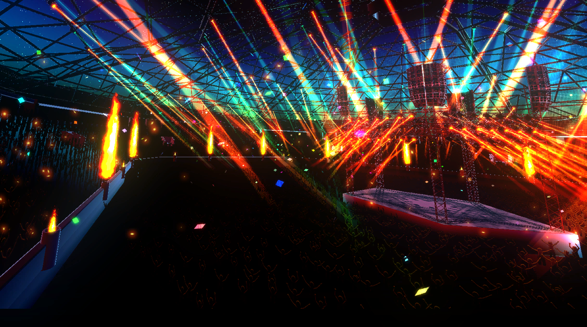
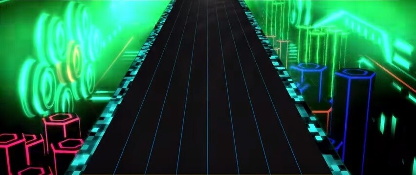
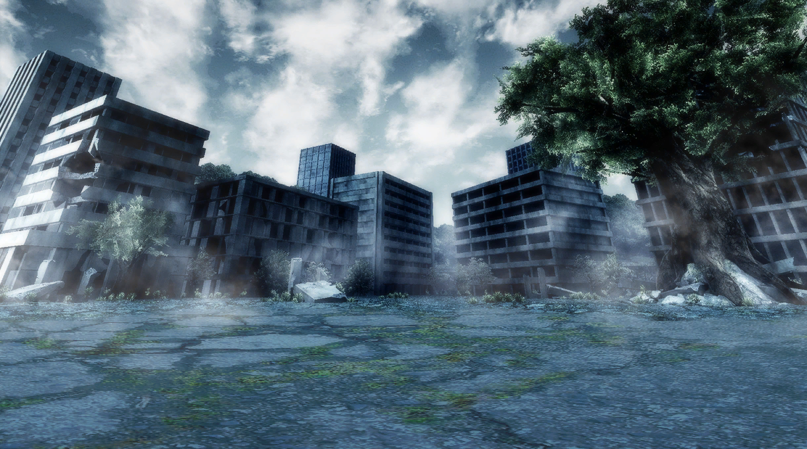
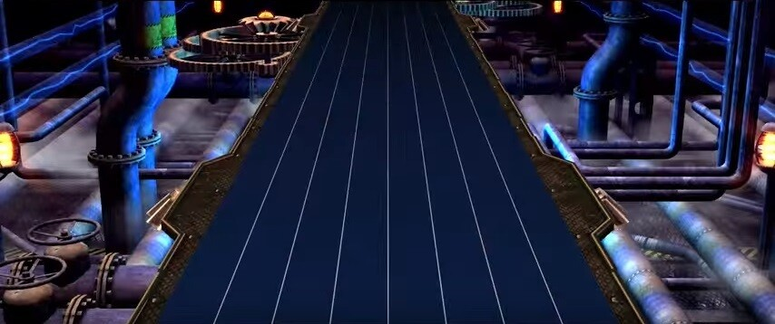
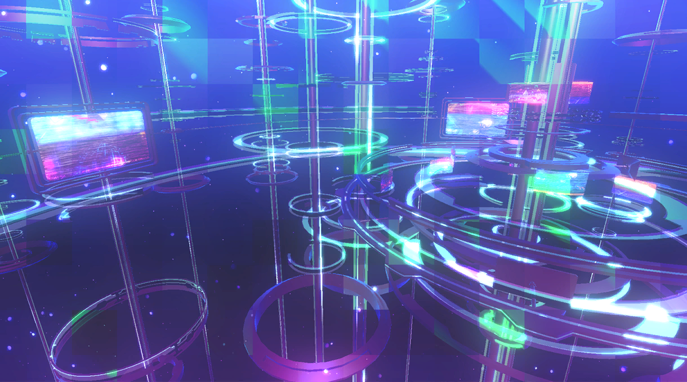
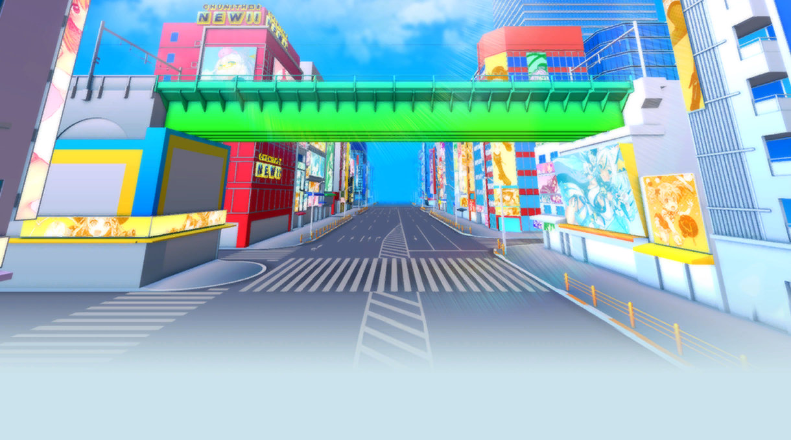
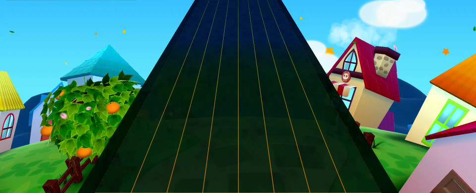
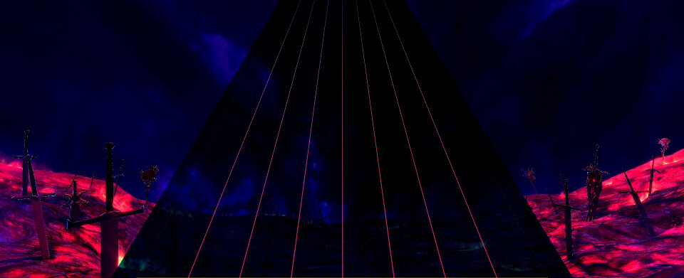

# Chunithm原创曲人物故事翻译计划

Chunithm作为SEGA社的音乐游戏运营多年，积累了大量的原创曲和原创人物，以等级解锁的形式刊载不同篇章的人物故事于Chunithm.net上。Chunithm角色种类画风形式各异，且各自具有自己的世界观，长久形成了巨大的设定文案。

虽说种类繁多，不过基本上可以分为七个世界观。同一世界观内的角色可能互相独立，也可能承前启后甚至多年以后添加伏笔描写。

[征集想要翻译的人物中，有兴趣者可以前往留言。](http://story.chunithm.top/index.php/main/768.html)

本网站旨在翻译这些隐藏在官网背后的人设故事。所有人物故事来源皆为Chunithm Wiki:https://chunithm.gamerch.com/    （旧）

https://wikiwiki.jp/chunithmwiki/ （新）

版权归SEGA所有。

B站用户“远野毛颜前线”提出希望将翻译的中二人物剧情搬运到站点。

作为区分，所有迄今为止翻译的文章将会在人物表下方标识对应的原作者名称。

最近数日，将会对已经完成的翻译文稿进行转移，主页会大幅更新内容，请各位读者利用人物表自行寻找想看的文章。

当然，也支持继续进行投稿推荐想看的剧情。

谢谢各位的支持。

# [企鹅开发秘话](/penguin/README.md)

作为游戏默认的吉祥物以及可用角色，制作组在企鹅的角色故事栏填写的并不是什么原创故事，而是制作组自己的各种感想和内容。其中整活，内幕众多，篇章量也较大。

不分顺序，将节选进行更新。

# 原创曲的分类

根据原创曲的打歌背景，可以分为以下世界观：

## Genesis of Destiny

以乐器演奏类曲子为主的系列。作曲者多为同人乐队的相关者。角色一般多为音乐家或者是手上持有类似乐器的东西。

## Metaverse
以俱乐部音乐为主的系列。作曲者大多数是BMS或者其他音游原创曲的常客。也是目前全游戏中所属乐曲最多的世界观系列。大多数占据了游戏难度的中高层。
### Metaverse(假想世界篇) 

以电脑世界Metaverse为背景发生的故事。文案和关联人物最多的系列。根据时间点可以分为多个时期。
### Metaverse（地上篇）

Chunithm Paradise新增加的剧情线。时间同步于假想世界篇中期，与假想世界篇有一定的关联。
## SeelischTact

以JRPG幻想风格为主的系列。作曲者大多参与过JRPG的作曲工作。与Chunithm Crystal的故事可以得知，该世界观与Metaverse有紧密联系，基本可以确认Metaverse系列为该世界观超古代时期发生的故事。
## [心连羁绊（リレイションレーベル　)](/relation/README.md)

作曲者以VOCALOID创作者和歌手居多的系列。背景模仿的是niconico动画的界面。歌曲人物对应的故事相对独立，除少部分有剧情联系以外，基本为一章独立的短篇。
## 愚民大陆（GUMIN）

以偶像系和电波曲为主的系列。除少部分公募曲外，全都是带VOCAL的歌曲。除了几名角色单独成系列以外，其余组成一条独立的故事线——魔大陆“秋叶原”。
## 群码动物仙境（アニマリアレーベル）

以Future Bass曲风为主的系列。全体角色基本位于世界观下一座会说人话的动物的城市——群码县萨法里市（グンマ県サファリ市）。
## [西比拉精灵记](/sibula/README.md)

以日本海外的作曲家为主的系列。全角色属于同一个世界观，且剧情呈明显的先后顺序。由于发布的时间点与Chunithm在海外的发展计划时间相近，被认为是SEGA同时推向海外的战略计划。剧情与迄今为止的故事画风截然不同，毫不吝啬残酷的描写。剧情基本为郁向。<del>由于过于沉重甚至该系列被列入“不可搜索的名词”wiki</del>

Chunithm NEW更新了新章节。内容为远古时期原初的四名巫女的故事。

Chunithm SUN PLUS更新了其后续，讲述了原初的四名巫女以及丰壤之神之后的故事。
