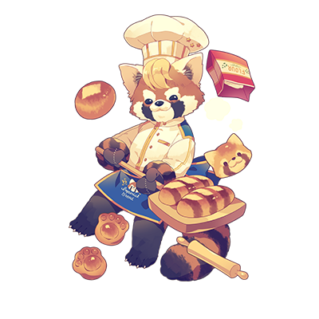

# 柯尼

| 角色信息   |          |
| ----------- | ----------- |
|  名称 |柯尼
|年龄 |8岁
|职业|面包店“明石家”的年轻精英面包师
兴趣|研究面包
|对应乐曲|Servant of Love
|初出|Chunithm Amazon Plus

## Episode 1 萨法里市面包物语·外传

>我的名字叫柯尼。是代表着冰库县的面包店“明石屋”的年轻精英面包师。

这里是能够说话的动物与人类共同生活的不可思议的世界·群码县。

在群码县的萨法里市，今天也有大量的动物们在这里生活着。

而如果要说在这萨法里市里最出名的面包店的话，那肯定是由熊猫·潘达所经营的“West&East”以及由小熊猫的柯尼所经营的“Imperial Bread”这两家了！

他们俩从小就是好友，而现在也是旗鼓相当的对手，不过，柯尼也是直到最近才回到群码县的。

而这个故事，就是面包店的潘达和他的童年好友柯尼，两人奇迹般地重逢之前所发生的前日谈。

这个故事，将讲述柯尼一手建立起他最自豪的“Imperial Bread”面包店的经历，以及他那波澜壮阔的人生。

冰库县，当地最大的面包制造厂商，明石家。

那里，有位叫做柯尼的青年小熊猫，在这里工作着。

身为面包师，柯尼的技术十分高超，在冰库县能够排到全县第一，也正是因为这个原因，他年纪轻轻就当上了明石家的精英面包师。

“Prince Bread 54号完成了！”

从炉子中取出面包，柯尼高声呼喊着。然后，周围正在工作着的其他面包师停下了手中的工作，纷纷围到了他的身边。

“哦哦！这就是柯尼你的新作品吗！”

“请务必让我试吃一下！”

“不，应该让我先试吃才对！求你了柯尼！”

这些面包师们都很喜欢柯尼做的面包，所以每当柯尼做出新作品，他们总会求着柯尼给他们试吃一下。

“放心，人人有份！请各位好好品尝吧！”

柯尼自信地说到。当各位面包师们将面包放入口中——

“咩！！咩！！”

吃了面包的众人由于这独特的美味，纷纷陷入了精神恍惚的状态，甚至发出了山羊一样的声音！在这样奇妙的光景持续了一阵子之后，他们才恢复正常。

“这、这也太好吃了吧！！！这东西，难道是用山羊奶做的吗！？”

“不错，正如你所说。山羊奶虽然有着独特的味道，不过要是能好好活用的话，就能创造出这种近乎上瘾一般的味觉体验了。之前去国外的时候吃过那里做的面包，所以就想着把当时的知识活用一下。”

“真、真不愧是柯尼啊！！”

众人对柯尼做的面包赞不绝口。而身为这个面包的作者的柯尼则是谦虚地摇了摇头。

“这还不够呢。我的Prince Bread还离那究极的面包相去甚远……！我还得继续磨练自己才行！”

柯尼再次燃起了斗志，这也让那些面包师们无比佩服。

为了完成究极的面包，柯尼不知道做了多少的努力。

从他人的角度来看，柯尼在选用的素材，技巧，在各种方面都已经登峰造极，然而，他本人却并不满足于目前的状况。

“真不愧是我们的王牌……！！我们也要努力了啊！”

“哦哦！！”

被柯尼专注于面包的热情所感染，面包师们也不甘落后，各自投入到自己的工作之中，努力制作好吃的面包。

就这样，“明石家”的面包品质，就在众人的努力之中持续提升着。

## Episode 2 柯尼，那波澜壮阔的过去

>当我还是小孩的时候，老爸就已经是群码县知名的面包师了。但是伴随着意大利面的流行，面包成了过气的存在……

在面包师之道上精益求精的柯尼。

虽然现在的他是一名胸怀大志，充满自信，力争上游的面包师，但是，最初的他并非如此。

柯尼出生于群码县高崎市的一个面包师的家庭中。他们一家三口，在这个小小的城市中幸福地生活着。

既是店主，又是面包师的父亲在镇上赫赫有名，深受众人爱戴。而柯尼，也爱戴着自己的父亲。

然而，某一天——

“为什么？为什么没有人来买面包？”

看着店铺内琳琅满目的面包，柯尼的父亲露出了惊讶的表情不禁问到。

不知从什么时候开始，前来买面包的客人开始骤然减少了。经过调查，他很快就发现了问题。

原来，在他们店的附近，一位义大利来的厨师开了一间名为“耶利哥”的店。

对于将面包当成主食的高崎市的市民们来说，意大利面这种食物实在是过于崭新，过于新奇了。

于是，一股意大利面的风暴席卷了整个城市，最终，大家都跑去买意大利面了，再也没有人去买面包了。

这股风潮也影响到了许多面包店，高崎市一家又一家的面包店只能关门大吉。

而柯尼的店，也是这股闭店潮之中的受害者。

“新町的面包店似乎要转行成为点心店，但是我没有那样的技术……这下完蛋了……”

“老爸……”

结果，柯尼的父亲也不得不关掉了店铺。

之后，柯尼的父亲带着全家，就像逃亡一样离开了这里，回到了他的家乡，冰库县。

“如果是冰库县的话，还能够再努力一下……！”

然而，上天就像是要给柯尼的父亲一个玩笑般，又一重不幸降临于这个家庭。

由于高崎市那场闭店潮的影响，柯尼的父亲遭受了很大的打击，并且在这之后，搞坏了身体。

身为家中唯一的顶梁柱的柯尼父亲就此倒下，整个家庭陷入了危机之中。

然而，这不过是柯尼那多舛命运的序章罢了。

## Episode 3 成为面包师的决心

>在这贫困线上挣扎着的日常之中，我从一只棕熊那里拿到了一块面包。吃下那块面包的我大受感动，于是决定成为一名面包师。

“酒呢！快把酒拿过来！”

“已、已经没钱买酒了……”

“啊啊！？那就给我想办法解决啊你这窝囊废！！”

“呀！”

“爸爸！！不要再打妈妈了！！”

在穷困潦倒的生活之中，迫于贫困和病魔的双重压力之下，柯尼的父亲彻底崩溃了。面对终日沉浸于酒精之中，对着家人大打出手的他，柯尼和他的母亲终日只能以泪洗面。

整个家庭已经再也回不到曾经温馨的模样。

不但如此，新的不幸再度降临到柯尼的头上。

“这小子在搞什么啊。怎么说话贵里贵气的。”

“切，死穷鬼装什么阔少！以为自己很吊吗！再这样看我不揍死你啊！”

“不、不要打我了……我才没摆什么有钱人架子啊……”

……学不会口音独特的当地方言，家境贫寒，给人阴郁的感觉……总之，就是因为这些大大小小的原因，柯尼在班上总是被人欺负。

对于柯尼来说，不论是家，还是学校，对于现在的他来说都没有容身之所。

  

就在这样地狱般的日常之中，某一天。

即便心中愁云密布，柯尼也不得不踏上自行车，为了学费和家庭生计，前去运送报纸。

因为常常过着上顿不接下顿的生活，柯尼骑车时总是一副有气无力，摇摇欲坠的样子。而今天，路过的一只棕熊拿出了一块新鲜出炉的面包，递到了柯尼面前。

  

“快吃吧，小子。”

  

望着棕熊，柯尼露出了惊讶的表情，然后他的肚子发出了很响的声音。

  

“放心吧，这东西没毒，赶紧吃吧。”

“非、非常感谢您……。那我开动了……”

  

当柯尼将男人给的面包放入口中，那一瞬间，柯尼立刻恢复了生气。

“太！好！吃！了！吧~！！！”

看到柯尼如此幸福的表情，男人也笑了出来。

“是吧？点心面包可是很好吃的哦。好吃的面包甚至可以充实你的人生哦！”

（注：点心面包（菓子パン）即那些有进行调味或者附加内馅和装饰，以点心的要求制作出来的面包（例如红豆包或者火腿肠包）与没有任何调味单纯作为主食，整块成型的主食面包（食パン）相对）

正如男人所说。当柯尼将面包放入口中的时候，他感觉自己的魂儿被带到了一个充满温暖和光亮的地方，仿佛坐在暖炉前一样。这个面包的味道，在柯尼的心中留下了深刻的印象。

（对、对啊！面包，是可以让人变得幸福的啊……！至少，现在的我，十分幸福……！）

看着露出恍惚的笑容的柯尼，男人满足地点了点头，并未留下名字，就这样默默地离开了。

等到柯尼回过神来，他才发现自己忘了问那个男人的名字，但是他可以确信，那位男子应该是一名有名的面包师。

  

“我决定了……！我一定要跟那位大叔一样，成为厉害的面包师……！”

  

从此，一个小小的梦想，就在柯尼的心中生根发芽。

## Episode 4 明石屋的文藏

>我进入了“明石屋”，然后，我又一次见到了那名棕熊……也就是文藏。而他，正是隶属于“明石屋”的一名面包师！

“要成为面包师”

定下如此决心的柯尼，已经无所畏惧。

内心变得无比坚定的柯尼，已经不会再因为欺凌和家庭暴力吓得瑟瑟发抖了，他勇敢地站了出来，并且与之对抗，最终，获得了胜利。

说到底，他们也不过都只是“靠欺负更弱者取乐的弱者”罢了。

“我很强大！我是绝对不会被那些家伙阻挡我的脚步的！我要拼尽全力，为实现梦想而努力！”

## Episode 6 独立的条件

>当我向师傅提出想要自立门户回去故乡开店的时候，师傅提出了让我在大会中获得优胜的要求。

某日，已经小有成就的柯尼，向师傅文藏讨论了一件事。

“师傅。我想……在高崎那边开一间自己的店。”

“高崎……？你是认真的吗？”

文藏用着低沉的语气向柯尼问到。而柯尼认真地点了点头。

“我想要让大家重新想起面包的味道。必须让他们知道，面包也是拥有不输给意大利面的魅力的……”

“柯尼……这真的就是你的目的吗？”

“咦……？”

文藏一眼就看透了柯尼的想法。

“确实，那家叫做‘耶利哥’的意大利面店，确实让小子你的人生急转直下。如果是现在的你的话，应该是能够从‘耶利哥’那里夺回客人的。但是啊，小子你可要记住，复仇，会让面包的味道染上污浊的。而最后的结果，只会是无尽的空虚而已……！！过去的事情什么的，还是尽早忘掉吧！！”

“为什么师傅会知道我的过去……不，现在已经无所谓了！求你了，师傅，让我自立门户吧！为了让我的面包走向世界，这是不可或缺的一步啊！！”

面对拼命恳求的柯尼，文藏露出了苦恼的表情，思考了一阵。

“……西日本食品大赛的面包部门。只要你能够在比赛中夺冠的话，我就考虑一下。”

“西日本食品大赛的面包部门……”

“要是连整个西日本都拿不下来，那么，就算是回到你的故乡，被称作小麦王国，在全国也是赫赫有名的面包业激战之地·群码县，想必就算是你，也难以取得一席之地的。如果你真的有此觉悟，那么就让我看看你的成果吧！”

“也就是说，这是对我的试炼吗……。师傅，我懂了！我就做给你看吧！”

柯尼如此宣言道。接着，他就告别了师傅，回去研究面包了。看着柯尼的背影，文藏若有所思。

（……柯尼。你的面包，跟你的父亲做的真的很像。那家伙曾经也为了做出天下第一的面包而为之努力，却在临门一脚的时候，折戟沉沙，被名扬四海的意大利面所打败……不过，如果是你的话……！！）

实际上，文藏，既是柯尼的父亲曾经的挚友，也是在面包师这一行当中的对手。所以，文藏才会知道柯尼这一路是怎么走过来的。

就在如此复杂的思念交织之中，柯尼向西日本食品大赛发起了挑战！

## Episode 7 何为究极的面包……？

>如果要赢得冠军的话，就一定要做出最强的面包才行。所以，不论是技术，还是使用的素材，都要达到最好！

面对师傅给出的条件，柯尼也觉得有些道理，于是应承了下来。

不过，即便再怎么说着“复仇只会带来空虚”这样的话，柯尼也并未有所触动。

“……我一定要回到曾经让我们全家蒙受苦难的高崎，重新开店，最终成为群码最强的面包店！战胜那些无聊的意大利面店，做出最棒的面包，让客人重新回到我们这里……！！只有这个，才是我生存至今的目的啊！以高崎为起点，我身为小熊猫的新人生将会起航……！”

然而，如果要实现这个目标的话，那就必须赢下食品大赛的冠军才行。

虽然柯尼已经享有盛名，而且也对此有所自信，不过他始终认为，仅靠现在的实力，是难以取胜的。

“那么，我的面包到底是欠缺了什么呢……？如果要做出究极的面包的话，到底需要什么呢……？”

在无尽的思考之中，柯尼得出了一个结论。

要做出究极的面包，就需要有最高级的技术，以及最高级的素材。只有两者相辅相成，才能制造出究极的面包——Imperial Bread。

得出答案的柯尼，立刻就开始了探寻最高级的食材的旅途。

而经历了漫长的旅途，柯尼终于收集到了最棒的素材。

“只要有这些的话，就能够做出Imperial Bread了！做出不会输给任何人的面包！”

## Episode 8 大赛初战

>食品大赛的第一场，主题是“点心面包”。我端出了地上最强的奶油面包，赢得了比赛。

## Episode 9 大赛决胜

>在决赛之中，我终于做出了究极的面包，在餐桌上创造出了一片宇宙！最终，我漂亮地获得了胜利。

## Episode 10 自立门户

>获得了大赛冠军的我，终于获得了师傅的许可。带着种种想法，我踏上了旅途，离开了冰库县。

## Episode 11 向着面包的皇帝而努力

>就这样，我回到了故乡。目标是成为日本第一的面包师！那么，就先从群码县开始吧！
