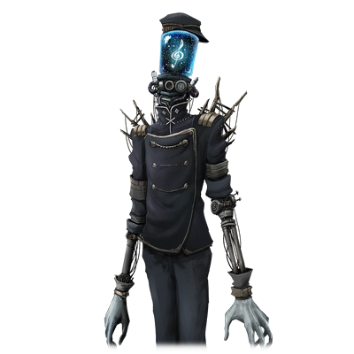

# EMANON

| 角色信息   |          |
| ----------- | ----------- |
名称|EMANON
年龄|不详
职业|服务生/钢琴家
对应乐曲|Reverberate
初出版本|Chunithm NEW PLUS

## Episode 1 Tranquillo（宁静）
>这个故事，发生在稍微遥远的过去。一名少女，邂逅了一只形单影只的人偶。

在一座远离城市的森林的深处。

有一处人迹罕至的废墟。

在这个废墟里，有一个古老的传说。

“每天的夜里，都能从废墟中听到钢琴的声音。”

为了确定这个传说是否属实，一名少女造访了这个森林。

而这个故事，就是少女所经历的，不可思议的故事。

森林中郁郁葱葱，就算是白天，遮天蔽日的树木都让森林之中略显昏暗。

而现在还是夜深人静的时候。

本就昏暗的森林就变得一片漆黑，伸手不见五指。

就在这样的黑暗之中，却有一名少女拿着小小的提灯在森林中走着。

“应该是往这边走……对吧？”

似乎是为了排解心中的恐惧，少女继续说到。

“听说废墟那里能够听到幽灵演奏钢琴的声音……真的存在吗，这种事情？”

少女确认着附近仅剩无几的，似乎有人留下的痕迹，在没有任何道路的的森林中前行着。

突然，有个东西从远处的灌木丛中一闪而过，少女似乎看到了某样类似于光源一样的东西。

“难道说，除了我以外还有别人在这个森林里？”

察觉到这点的少女，表情变得明朗起来。

刚刚还在因为自己一个人来到森林中而感到后悔的少女，正加快脚步，向着光亮的方向走去。

很快，少女就走到了一片树木稀少的开阔地带。

前面，就是少女一直在寻找的废墟。

“这里，就是传说中的那个废墟吧……”

少女的眼中充满期待。

虽然刚刚还在追着的光亮不知道何时就已经消失了，但是少女并未在意，走进了废墟中。

废墟中空无一人。

地面一片狼藉，看着随时都会倒塌的样子。

少女留意着周围的情况，小心翼翼地走着。

“钢琴声……怎么还没听到呢？”

少女有些失望，叹了口气。

对于期待着这个声音的少女来说，能够见到幽灵的期待和好奇心战胜了对这个寂静无比的空间的恐惧感。

“是不是搞错了呢……我还挺想听一听演奏的呢。”

就在少女即将打道回府的时候。

不知道从哪个方向，传来了一个响亮而高昂的声音。

“咦？这个声音，不就是钢琴……”

少女立刻奔向声音传来的方向。

跟着声音，少女不知何时来到了一间带着钢琴的大房间面前。

“就是这里……”

少女闭上眼睛，仔细的聆听着不知何人演奏的钢琴曲。

等到演奏结束的时候，少女一边鼓掌，一边走向那个正在弹奏着钢琴的人影。

“哦……没想到居然还会有听众来啊。”

“那、那个，刚刚演奏的曲子——”

就在少女两眼放光，想和人影搭话的时候。

看到“那个东西”的少女，瞬间哑口无言。

“咦？”

演奏钢琴的人影的真身，实际上是一个用机械零件组合起来，做成人形的“某种东西”。

“小姐，把您吓到真是不好意思。”

“那个东西”向少女恭敬地行了一礼，以温和的语气继续说到。

“我叫EMANON。是这个旅馆的服务生兼钢琴师。以后，还请多关照。

EMANON虽然用着温和的态度向少女说话，但是少女还是因为震惊呆在原地一动不动。

“……哦，你是从哪里——”

“那、那个！”

少女似乎想到了什么，突然大声抢过了EMANON的话头。

“你的演奏，实在是太好听了啊！”

“……您能够喜欢真是我无上的光荣。”

看着两眼放光的少女，本以为自己肯定是吓到她的EMANON歪了歪头问到。

“您，不怕我吗？”

“确实呢，虽然有点可怕，不过，我更想和你多说点话啊！”

看到少女如此反应的EMANON，微微地点了点头。

毕竟，看到如此奇异的人影，普通人应该早就逃之夭夭了吧。

“我曾经听说这个地方有幽灵在演奏钢琴！然后，我就在这里找到你了！”

“原来如此，坊间还有这种传闻吗……不过，我并不是幽灵。”

“就算不是幽灵也无所谓。我只是想听听看别人的演奏，才来到这里的！”

“演奏……吗？”

少女向EMANON说了各种各样的事情。而大部分，都是少女自己的事情。

少女一直都在学习钢琴的演奏，但是无论怎么联系，都无法提升实力，既无法参加演奏会，也拿不到任何奖项。

EMANON为了表示自己并非对话题不感兴趣，只能努力地摆出夸张的动作，“嗯嗯”附会着少女的对话。

因为看不见任何表情的EMANON，只能用这种方式表达自己的意思。

“因为我觉得如果能听到那些超脱于人类常理之外的演奏，能够听到真正的幽灵所演奏的钢琴曲的话，应该就能获得什么灵感了吧。只要有这些灵感的话，我也能变得更强了吧……“

少女似乎说到了痛处，越说越小声。

“就算是和恶魔做交易也行。我就是这么想着，才来到这里的。”

“恶魔……吗。”

少女的话语似乎让EMANON想起了什么，他说了起来。

“如果可以的话，能不能听一下我讲的某个故事呢？”

“咦？是什么故事？”

“那是个很久很久以前，连名字都没有留下来的某个男人的故事。”

EMANON用着温和的语气，怀念地讲述着过去的故事。

## Episode 2 Subito（急转）
>那个人偶十分擅长弹钢琴，少女爱上了人偶先生的钢琴演奏。

这是个很久很久以前的故事。

在某座森林的最深处，有着一间旅馆。

那间旅馆以远离城市喧嚣的静养地为卖点，接待着来自五湖四海的客人们。

一名不知名的服务生，今天也在旅馆里工作着。

这名服务生生性温厚，是一名诚实正直的好青年。

给人如此印象的服务生，有着一项众人皆知的特技。

“那个，刚刚好有时间吗。那个会弹钢琴的服务生？”

“是的。如果您不介意的话，我就勉为其难上去演奏一下吧。”

是的。服务生的特技，正是演奏钢琴。

从他那老实忠厚的外表之下，他的钢琴演奏却充满着丰富的感情，他的钢琴演奏扣人心弦，令无数的客人心醉神迷，甚至有人不辞千里就为了来这里聆听一曲。

“我也想听听看，能不能弹一弹这首歌？”

“我明白了。由于我需要先和老板确认，请稍等一下。”

接到演奏请求的服务生立刻去找旅馆的老板寻求许可。

“那个……老板……”

虽然服务生用着抱歉的语气向老板问着关于钢琴演奏的事情，但还没等他说完，老板就回答了。

“要弹钢琴对吧？没问题啦。明明不用每次都来找我征求许可呀。”

因为这是常有的事，就连老板也露出了一副无可奈何的表情。

“这可不行。毕竟我的本职工作还是一个服务生而已。”

“你呀，就是一板一眼……好啦，客人还在等着你的表演呢，快去吧！”

“谢谢您！”

服务生向老板表示了感谢，立刻就奔向了客人的方向。

客人也很开心，一边说着“准备好了”，一边坐在了钢琴旁边的座位上。

其他的客人看到他的样子后，也注意到了他的演出，纷纷停下来望向钢琴的方向。

服务生向客人们轻轻地行了一礼之后，便开始了他的演奏。

钢琴声响彻整个旅馆，客人们都被他的演奏吸引住了，纷纷静下来仔细聆听。

他的钢琴演奏是那么的热情四射，让人无法和他平时温文尔雅的样子联系起来。

一曲完毕，服务生向旅馆中的客人们行了一礼。雷鸣般的掌声和欢呼声响了起来。

“这曲子实在是太棒了啊。可是，我从来都没听说过像这样的曲子呢。”

“因为那是他自己做的曲子。虽然，据说还没有名字的样子。”

老板回答了客人的疑问。

“明明有那样厉害的技术，甚至还能自己作曲，为什么还会在旅馆里当一个服务生，偶尔才出来演奏呢？”

“他似乎有着自己的坚持，自己坚持要求必须在这个地方演奏才行呢。”

“是吗？原来还有这样的事情。”

“而且他似乎也找不到工作的地方，所以我就收留了他，估计就是这样他才决定用弹琴报答的吧。”

“原来如此。”

“所以，如果你们想要让他去别的地方的话，应该找的不是我，而是他才对。”

“我哪里也不会去的哦。”

就在老板和客人谈话的时候，服务生已经结束了演奏，加入了他们的对话。

平时老实温和的他，现在却带着些许怒意。

“我现在有老板照顾就已经很满足了，老板的恩情可得好好地偿还才行啊。”

看着服务生又恢复了平静的样子，老板露出了笑容。

“我现在已经很感激你的恩情了，如果你觉得现在这样就足够了的话也行哦。”

“哈哈，真是输给你们了。果然，那些传言都是假的啊。”

“传言？”

老板和服务生听到“传言”二字的时候，纷纷提起了精神。

“是啊，我曾经听人说过这个旅馆的接待和服务都很糟，外界评判那么好只是老板花钱请人打了点广告而已，之类的。”
“啊呀，竟然还有这样的传言。”

“……”

听到客人说的这些话，服务生不禁感到有些愤慨。

注意到服务生的变化的老板，一边安慰着服务生，一边向别的客人问到有没有类似的传言。

“来这里之前，我可是听说过这里的老板尖酸刻薄，用少到只能塞牙缝的薪水雇佣厉害的钢琴师在这里工作呢。”

“怎么会！我可是！”

“行啦，你也别激动。会来到这个旅馆的人看到这个旅馆的真实样貌，这些传言也就不攻自破啦。”

“可是，究竟是谁散播这样的谣言……”

“……嘛，虽然我能够预想到是些什么家伙散布这种谣言，不过说到底就只是不攻自破的谣言罢了。你也不用太在意。”

“是……”

老板一边笑着说“这种谣言立刻就会消失的”，一边离开了这里。

服务生虽然还有些不服气的地方，不过还是回到了自己的工作中。

过了几天后。

正如老板说的那样，旅馆来了众多的客人。客人们的喧闹声和服务生的钢琴声响遍了整个旅馆。

“哈哈，果然和老板说的一样。那么，我也得继续为这间旅馆而努力才行。”

日子就像这样一成不变的继续下去。

是的，这一切本该如此。

但是，很快就发生了某件事。

“……咦？”

服务生在医院的一间病房里起来。

为什么自己会在这里。

就在服务生一脸茫然地看着周围的环境的时候，他看到了老板的身影。

“老板，这里究竟是……”

就在服务生想要伸出手的时候。

不知为何，手却无法动弹。

服务生感到很不可思议，无数次的尝试操作自己的手，手却纹丝不动。

“咦？为什么……？”

“你终于醒来了啊。老天保佑，你能够保住性命已经很幸运了啊。”

老板已经满眼泪花，似乎是终于安下心来，不禁摸了摸自己的胸口。

“你想不起来了吗？前几天，你在路上遭遇了事故啊。”

“啊……！”

听到这句话的时候，服务生想起了一切，不禁脸色铁青。

是的，他在路上走的时候遭遇了事故，而且受了很重的伤。

服务生再次望向了自己的手腕，但他看到的，只有被绷带卷着的，完全失去运动机能的手臂。

“虽然很残酷……听好。你已经……再也无法弹钢琴了。”

老板静静地在自己的耳边说着的这个事实，让服务生再也说不出话。

正是以这天为交界，从此以后，他被卷进了黑暗之中，越陷越深。

## Episode 3 Gemendo（呜咽）
>开始每天都去和人偶先生见面的少女，开始对人偶先生的事情感兴趣了。

就在服务生遭遇事故后几个月。

他终于走出了医院，来到了老板一直在守候的旅馆门前。

不能弹钢琴的自己，还有什么价值呢。

服务生想到了辞职。但是看到他的老板只是笑着说了这句话。

“就算不弹钢琴，你也是个优秀的服务生啊，早点回来吧。”

感受到老板的温柔，服务生暗暗的在心中发誓，就算是为了需要自己的老板，也要回去从头开始努力。

“嗯？这是怎么回事？”

回到旅馆的他，注意到了些违和感。

如果是平常的旅馆的话，就算是旅馆外面也应该是有些客人有说有笑的才对啊。

然而，今天旅馆却空无一人。

在大堂的人，只有旅馆的工作人员和几名客人而已。

曾经的热闹景象就像不曾存在一般。

“欢迎回来，没能前去接你，真是抱歉。”

“老板……这到底是！”

和惊讶到喊出声的服务生不同，老板仍然用着一如既往的语气回答到。

“之前不就说过了吗。有些人在传播关于旅馆的不利消息。”

“是、是啊！可是，明明之前才说过不用在意这些流言蜚语，客人们自然能明白的啊！”

“对不起，似乎是我太天真了。恶名已经传的太远了，已经回天乏术了。”

“怎么会这样……！”

在这之后，旅馆的经营状况变得越来越糟糕了。

那些常客们，听到服务生再也无法弹钢琴之后，就再也没出现在这里，服务生因为事故落下的后遗症影响了日常工作……这些大大小小的挫折就像毒素一般，渐渐地侵蚀着他的精神。

“虽然你的钢琴真的很厉害，不过你也不要太当回事了。旅馆会这么少顾客也不是你的问题，不要放在心上。”

“好的……”

老板不停地鼓励着他，向他露出笑容。但是，老板的这些关心和体谅，都无法打开服务生的心扉。

“旅馆都变成这个模样了，我难道什么都不能做吗。至少，这双手还能够动的话……”

服务生一边看着再也无法演奏钢琴的手，一边无声地叹着气。

“你想治好你的手腕吗？”

突然，一个声音从背后响起，吓得服务生转了过来，发现背后站着个瘦小的黑衣老人。

以为是客人的服务生赶忙摆出姿势，向眼前的老人道歉。

“抱、抱歉！这位客人，真是对不住，让您看到丢人的一面了……”

“不，没关系的。话说回来，你想不想治好你的手，是想呢，还是不想？”

“难、难道说，您能治好这双手吗！？”

这句话深深地吸引住了服务生，不假思索地回答到。

“求您了！请务必告诉我方法！我有不得不再次重拾钢琴的理由！”

“啊啊，没问题哦。不过，我有一个条件。”

“如果是我能做到的事情的话！”

“那么，请跟我来。”

这么说着，老人从怀里拿出了一张卷轴。

那是身为钢琴师的他也从未见过的乐谱。

“这是？这是老先生您自己写的曲子吗？”

“正是。等你的手恢复了的话，还请演奏一下这首曲子。”

“这，这就行了吗？！”

服务生为老人所提出的简单条件而震惊，但很快就转变成了喜悦。

“是的。这首曲子非常难，最好有十足的技术再来演奏看看哦。”

“我明白了。这个条件的话，没问题。”

“呵呵……那么，契约成立了哦。”

说完这句话，老人伸出了手面向服务生。

服务生感到了一阵天旋地转，很快就失去了意识。

“那么，契约就此成立，您可一定要演奏这首曲子哦。”

这就是服务生失去意识以前，最后听到的话语。

## Episode 4 Lietamente（欢愉）
> 听着人偶的故事，少女越来越想让人偶指导她的钢琴了。
“怎么回事？怎么睡在这种地方？”

“咦……？”

躺在地上的服务生被老板叫醒。

原来服务生正躺在前台后面的房间里，除了老板以外别无他人。

“咦，客人呢？”

“你在说什么啊。今天也是没人来这里住宿哦。现在我们啥事都干不了都在闲着呢。”

服务生赶忙奔向前台，确认登记房间的册子，这时他才发现，名单上一片空白。

服务生感到不可思议。

明明那个时候才和一名老先生见面过的。

“难道说，这都是梦吗……”

服务生恢复了冷静，仔细思考着。

怎么可能有那么巧的事情。果然这一切都是梦吗。

随着服务生这么想着，他又一次消沉了下去。

“没想到竟然连做梦都在想着来客人？虽然说我们没什么客人的确是很无聊，不过也用不着这么日思夜想吧？”

“不、不是的……我实际上是梦见了我的手被治好了而已……”

“啊呀，看来是个美梦啊。要不要试试看？”

老板走上前来，轻轻地摸着服务生的手。

顿时，服务生感到了一股瘙痒般的触感，不自觉地抽开了手。

这时的他和老板才发觉到了违和感。

“刚才……难道说手有知觉了吗？之前我这么做的时候你说感觉不到什么触感的……”

“啊……”

服务生也察觉到了刚才的违和感。

正如老板所说，自从事故发生以来，他的手就几乎没有知觉了。

而现在，服务生正确认着自己从事故以来就无法动弹的手腕，手掌，手指的感觉。

“——可以动了……”

服务生的双手就像没有发生过那场意外一般，灵活地跟着他的意识而动。

他走到了钢琴的面前，伸向了那台自从事故发生以来就再也没有触碰过的琴键。

然后，本来无法弹奏的双手，现在宛如神助一般，在琴键上轻快地飞舞着。钢琴声再次响彻了整个大厅。

“这到底是怎么回事！？”

“我、我也不太清楚……”

不管是老板，还是服务生自己，都对这双手上发生的奇妙时间难掩震惊。

本以为一生都再也无法弹奏钢琴的服务生，就像是要将失去的这阵时间全部补偿回来一般，忘我地，尽情地，流着泪弹奏着钢琴。

在服务生终于结束了演奏之后，服务生静静地向老板说到。

“老板，既然我的手已经恢复了，请问我可以再次上台演奏，给客人们弹奏钢琴吗？”

“这倒不是不行……不过，你真的没问题吗？”

“嗯，我没问题。”

“是吗。那么，可得先庆祝一下你的手恢复了啊！”

看着老板对自己的康复喜出望外，服务生有点不好意思。

但是，他最关心的，还是只要手恢复了，就能够再度弹奏钢琴，让客人们回来这件事。

在这之后又过了几周。

虽然不如曾经的盛况，但是整个旅馆也重新热闹了起来。

随着服务生重返前台，越来越多的客人回到了这里，曾经那些不实的谣言也随着客人的来访烟消云散。

曾经被逼入绝境的服务生重新获得了自信。

“这都多亏了那位老先生啊……”

——就在这个时候。

服务生突然在一个角落看到了之前梦中的那个老先生。

见到老先生的他本想直接向老先生道谢的，但是，他的手碰到了某个东西。

那正是之前老人拿给他的乐谱。

“说起来，那个老先生说过，希望我务必弹奏一次这首曲子的……”

道谢就等到演奏结束之后吧。服务生拿着谱子，开始了演奏。

许多客人都被服务生的演奏吸引住了。

但是，服务生在弹奏着这首曲子的时候，突然有一股不可思议的感觉。

仿佛这首曲子从很久以前就知晓了一样，似乎已经烂熟于心了一样。

服务生即便没有看着谱子，也知道下一个音符，下一段小节应该如何演奏。

曲子结束，服务生收到了客人们的一致赞赏。

一边向台下的客人们行礼，服务生一边寻找着老人的身影，但是，老人已经消失了。

即便演奏过后服务生找遍了整个旅馆，也未能找到那名老先生。

“肯定是听到你的演奏感到心满意足，先回去了吧？”

“是这样吗……”

“不过啊，这曲子真是太棒了。以后还请拜托你继续努力了哦。”

“好的！”

服务生重新取回了自信，决心从此为了旅馆的经营更加努力，再次开始了演奏的工作。

此时的他，仍旧相信着旅馆能够恢复以往的盛况。

## Episode 5 Acciaccatura（碎音）
>随着少女和人偶一起练习的次数逐渐增加，少女对钢琴的喜爱就更进一步。

这是发生在客人开始重新到访旅馆之后的某天的事情。

服务生正和平常一样正在演奏钢琴。突然，有两个男人向他走了过来。

两个男人向服务生搭话，并且掏出了自己身上的证件。

“警、警察？！”

“抱歉，我们有事情想向你询问一下。”

看到样子不对赶来的老板也被叫去询问，服务生他们这才从警察那里知道了事情的来龙去脉。

原来，最近这几天出现了数名老人的非正常死亡事件，这引起了警方的注意。

根据警方的调查，这些死者的共通点，就是都到过这家旅馆。

“说到这些死者的共通点，就是都听过你的钢琴演奏。在听完演奏之后，他们都死于非命。”

“怎么会……怎么可能听了我的演奏之后就死了呢？”

“这根本不是什么询问吧。你们是想把他当成犯人吗！”

听到警察的说辞，老板不禁怒上心头。

为了让老板平静下来，警察继续说着自己的调查结果。

“当然，我们也不想这么推测……可是现有的证据实在是太少了。”

“我们也是抱着能不能在这里找到些许线索才这么问的呀。”

“……”

老板不发一语，只是死死地瞪着警察们。

似乎是被老板的气势震慑到，警察们并未久留，一边说着“今天就先到这里”，一边离开了旅馆。

“老板……”

“你别在意。就和平常一样工作就行了。”

“好的……”

目送着回去工作的老板，服务生站了起来，再次走到了钢琴面前。

服务生拿起了一叠乐谱，那正是之前老人送给他的那一份。

“虽然老板都这么说了，果然以后还是少弹琴比较好吧……”

本来，这只是服务生四下无人时的一句自言自语而已。

但是，某个人突然出现，接过了他的话头。

“哦，您是要忘掉和我的契约吗？”

“你、你是！？”

老人突然出现在服务生面前让他吓了一跳。

更可怕的是，刚刚周围还是人声鼎沸的大堂，现在却变得空无一人。

面对空荡荡的大堂，服务生的脸上写满了惊讶。

“这、这到底是……”

“您忘记了和我的契约，要继续弹奏这首曲子的事情吗？”

老人并未将服务生看在眼里，继续淡淡的说着。

老人那冷冰冰的语气令服务生感觉到了恐惧。

“这曲子，究竟是什么……”

“我问您一个问题。您相信这个世界存在一些不可见的奇妙东西吗？”

“什么！？这是怎么回事！”

无法理解老人所说的话，服务生只能绞尽脑汁思考着老人的意思。

“这张乐谱，就是恶魔所写的曲子哦。作为证据，您就好好看看吧。”

随着老人的话语，服务生看着手上的乐谱，然后，奇特的文字从纸上浮现了出来！

明明从未见过如此奇妙的文字，但是服务生却能够读得懂上面写的是什么。

“这到底是怎么回事！？你、你究竟是什么人！”

“如果按照你们人类的叫法的话，我们就是恶魔。”

“恶魔……难道说，那些非正常死亡的人们都是你们的杰作吗！”

“哦，脑子转的还挺快嘛。正是如此。多亏了您的努力，我可是获得了许多的能量哦。”

老人发出了宛如恶魔一般邪恶而高亢的笑声，俯视着服务生。

“能量……竟然将人的生命当成物品一样看待……”

“您这说法就很奇怪了。对我们来说，这就和人类吃牛羊之类的家畜毫无区别。只不过我们的食物是人类罢了。而且，我们也不是直接食用人类的肉体，这难道不是更加高明，更加温和吗？”

“怎么会……”

服务生终于发觉眼前的存在无法用常理所解释。

“怎、怎么可能……怎么可能弹个钢琴就夺走人的生命……”

“我不是说过了吗。这谱子，是‘特别’的。只要听到这首曲子的人，灵魂就会被渐渐地夺走。灵魂是人类生命的源泉……失去灵魂的人类会变成什么样子，您应该很清楚才是。”

“正因为这样，所以死者大多都是老人吗……”

正如老者所说，那些老人们的非正常死亡都是恶魔的乐谱的力量所致。

服务生终于领悟到这残酷的真相。

“终有一天，所有听过这首曲子的人，都会凄惨地死去。全都是拜您所赐哦。”

必须尽快向其他人说这件事。服务生这么想着，不由分说地冲了出去。

但是，无论服务生跑到哪里，别说是老板了，就连一个人都没见到。

拼命奔跑的服务生累得倒在地上。

“没用的。这个地方稍微有点特殊，在这个空间里，就只有您和我而已。”

恶魔又不知道从哪里出现，抓着服务生的领子将他举了起来。

“我要是早点知道是这样的谱子的话，我绝对不会演奏的！”

“事到如今还在说什么。您也是和我们一样的同类了啊。”

“你在说什么……！”

“您忘记了吗？究竟是谁治好了您的手？不就是身为恶魔的我吗？”

“那个……那个只是我！”

“你想想看，我如果要治好那双手的话，需要多少人的生命才能做到呢？”

“给我闭嘴！总之，我绝对不会再演奏那首曲子了！”

恶魔并未将服务生看在眼里，继续淡淡的说到。

“哦哦，您原来是这么想的吗。那么，撕毁契约，可是需要代价的哦。您真的要这么做吗？”

## Episode 6 Sospiroso（叹息）

## Episode 7 Perdenosi（遗失）
## Episode 8 Spiritoso（幽默）

