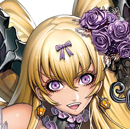

以乐器演奏类曲子为主的系列。作曲者多为同人乐队的相关者。角色一般多为音乐家或者是手上持有类似乐器的东西。

本世界观的人物以恶神·GOD和正方的人们之间的战斗作为主轴，不过大部分的故事其实都为独立成篇的故事。

|
头像
|
 角色
   |日文原名|对应乐曲 |初出版本|
| ----------- | ----------- | ----------- | ---------- | ---------- |
|| [暴虐的基泽库尔](/genesis/gizegul.md)|暴虐のギーゼグール|Sparking Revolver|Chunithm STAR PLUS
|| [EMANON](/genesis/EMANON.md)|EMANON| Reverberate|CHUNITHM NEW PLUS
|| [库蒂露卡.普露米耶](/genesis/kudelica.md)|クーデルカ・プルミエール|Black Swan Lake| Chunithm Amazon Plus
|G.O.D|G.O.D|Gate of Fate|Chunithm
||巴尼修|バーニッシュ|Guilty|Chunithm|
||波风涟|波風 レン|リリーシア|Chunithm
||罗兹玛丽|ローズマリー|Memories of Sun and Moon|Chunithm
||西拉·史丁格|シラー・スティング|Genesis|Chunithm PLUS|
||加拉德利乌斯·布鲁|カラドリウス・ブルー|名も無い鳥|Chunithm PLUS
||帕比翁|パピオン|L’épisode|Chunithm PLUS
|轰雷音|轟 雷音|ケモノガル|Chunithm AIR
| |天音英二     魔扉莉音|天音 エイジ     魔扉 リオ|Tuning Rangers|Chunithm AIR
||摇滚巨星★亚美|ロックスター★アミー|明るい未来|Chunithm AIR
||妮妮卡·克罗修|ニニカ・クロッシュ|Philosopher|Chunithm AIR
||玛丽安努·新城|マリアンヌ新城|札付きのワル　～マイケルのうた～|Chunithm AIRPLUS
||赛丽德文·玛格梅尔|セリドウェン・マグメール|響|Chunithm AIRPLUS
||斯特拉利乌斯·艾昂·普利尔诺瓦|ステラリウス・エオン・ブリルノーヴァ|Warcry|Chunithm AIRPLUS
||白川虎之助|白川 虎之助|覚醒楽奏メタフィクション|Chunithm AIRPLUS
||纯白的歌斗士 尤丽斯|純白の歌闘士 ユーリス|哀しみ集め|Chunithm STAR
||特利斯墨吉斯忒斯|トリスメギストス|トリスメギストス|Chunithm STAR
|戏曲的佛纽司|戯曲のフォルネウス|PinqPiq|Chunithm STAR
||SOUL BROTHERS|ソウル・ブラザーズ|WE GOTTA SOUL|Chunithm STAR PLUS
|G.O.D/魔缘|G.O.D／魔縁|Gate of Doom|Chunithm STAR PLUS
|娜迦·贝尔里奥斯|ナージャ・ベルリオーズ|Blaster Heaven|Chunithm Amazon
||京极院樱花|京極院 桜花|ユメキキョウ|Chunithm Amazon Plus
||强尼·赛亚斯丁|ジョニー・サイアスティン|GIGA DRIVE	|Chunithm Amazon Plus
||不动绝音|不動 絶音|Rebellion|Chunithm Amazon Plus
||帕特里奥特|パトリオット|Surrogate Life|Chunithm Crystal
||[远夜灯](/genesis/akari.md)|遠夜 灯|ROAD TO DREAM|Chunithm Paradise
|风焰|風焔|Blazing:Storm|Chunithm Paradise Lost
||[梅莉姆](/genesis/merim.md)|メリム|ピュグマリオンの咒文|Chunithm NEW
||[丽塔·卡尔斯迪特](/genesis/rita.md)|リタ・カールステット	|創世のコンツェルティーナ|Chunithm NEW
||摩根·菲尔|モーガン・フェール	|I’ll make you Super Rock Star|Chunithm NEWPLUS
|艾娃·拉格艾尔|エヴァ・ラグエル	|Breakthrough	|Chunithm NEWPLUS
||被比黑暗更黑之物所侵蚀的巴尼修|闇よりも深い黒に染まるバーニッシュ|	Scythe of Death|Chunithm NEWPLUS
||琪基&乌莉修|チキ＆ウリシュ|	ガチ恋ラビリンス	|Chunithm SUN
||泰莉·卡司通|ティリー・キャクストン	|CELERITAS|Chunithm SUN
||芙莉西亚·贝亚德|フリーシア・ベイヤード	|グラウンドスライダー協奏曲第一番「風唄」	|Chunithm SUN
||乌尔加雷欧|ウルガレオン|ウルガレオン|Chunithm SUN PLUS