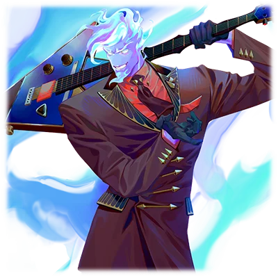

# 远夜灯

| 角色信息   |          |
| ----------- | ----------- |
|名称|远夜灯
|年龄|17岁
|职业|歌斗战士
|身份|女高中生 
| 对应曲   |ROAD TO DREAM
| 对应版本 | Chunithm Paradise|

## Episode 1 8月32日-早晨-

>八月只有三十一天，这是连小孩子都知道的常识。那么，难道错的人是我吗？

那是一个艳阳高照，太阳几乎就要到顶的，几乎可以算作正午的清晨。  
河川在阳光的照耀下反射出点点波光。而我正沿着河岸缓缓走着。  
微风轻拂脸颊，令人心旷神怡。我一边走，一边哼着不知道哪里听过的老歌。这时，一位骑着自行车的大婶与我擦肩而过。  

“啊呀！小姑娘声音真好听啊！”  

突然被人搭话，我才注意到自己刚刚在无意识间唱了出来。  
我有点害羞地点了点头，之后便立刻走远了。然后，我突然忍不住打了个大大的哈欠。  

“哈啊啊……好困啊。昨天练吉他练通宵了……第二学期开学第一天就迟到这也太糟糕了吧……”  

我的名字叫远夜灯，十七岁，是一名普通的高中二年级学生。  
如果非要说有什么不凡的地方，那大概就只有一个曾经被称作“摇滚乐的天之骄子”的，曾经身为音乐人的父亲而已了。  
当然，在我的记忆中并未有太多跟他相处的时间，不如说，跟他相关的麻烦事儿有一堆。  

我的父亲，在他到达人气巅峰的时候，突然死去了。  
那些无比崇拜父亲的粉丝们还有亲戚们都纷至沓来……让我……变得“不再是我”。  
那些失去了崇拜偶像的人们，把我当成了他们的精神支柱。  
只是因为从小就稍微会点音乐，他们就把我当成了父亲的继任者。  
在他们的眼中，我只是一面用来映照出父亲的镜子罢了。  
拜此所赐，我的人生中也曾有段灰暗的历史……不过现在至少还能享受学校的生活了。  

“……咦？今天开学仪式之后应该有课的对吧？”  

来到学校的我望着校舍一言不发。  
今天是九月一日。对学生来说，这是假期结束，又要开始上学的郁闷之日。  
本来，开学仪式之后，今天就应该开始上课的。  
然而校舍中却没有传出任何讲课声。不如说，甚至都没什么人。然而这时间怎么看都是上课时分，就算是几百人聚集在一栋建筑物内也应该有些生气才是。   

我走进教学楼，穿过安静的走廊，小心翼翼地打开了教师办公室的门。  
办公室里面的人注意到了我。  

“哦哦，这不是远夜同学吗？今天怎么来了？啊，难道是来交志愿调查表的吗！就剩你没交了哦！”  

“不不不，老师这是在说什么呢？现在这种事情无所谓吧？”  

“什么叫无所谓啊？高二整个学年也已经过了大半了啊？”

“不是这个！”  

班主任露出了一头雾水的表情。  

“明明今天就是新学期第一天……为什么教室里空无一人？”  
“哦，这个意思啊。远夜，你是不是搞错什么了？偶尔也会有像你这样搞错的学生啊……”  
“哈？这怎么可能？我昨天才确认了日历的！”   
“好啦好啦，是不是暑假放多了人都没反应过来啊……今天啊……”   

我想起了昨晚看的新闻节目，上面一字一句地说着，“明天就是九月了”。就算是三岁小孩，也不会认错的吧。   
我从口袋里掏出手机，正准备确认日期的时候，老师的声音也在我耳边响起。  

“今天，是8月32日哦？”  

——啊？

## Episode 2 8月32日-傍晚-

>眼前出现的，是一个头部燃烧着蓝色火焰，背着吉他的男人。他说，我的歌声能拯救这个世界，这是真的吗？

我摇摇晃晃地走回了河岸边，拧开水龙头的开关，狠狠地一头扎进了水流中。  

——搞什么啊？明明八月应该只有31天才对啊……32日什么的，这是什么整人玩笑吗？  
然而，不管是路上的电子显示屏，便利店的新闻，还是手机的日历。   
不管哪个，写的都是——32日。    

实在是太莫名其妙了，脑子一片混乱。我不禁烦躁了起来。   
就在我正用水龙头冲着自己的头发，打算稍微冷静一下的时候，突然从某个地方响起了很大的爆炸声。  
我丝毫不顾被打湿的头发垂到了肩膀，抬头望了过去。脚边能够感觉到震动，爆炸点应该距离这里不远。  
我循声望去，只见一栋高楼正裹挟着烟尘轰然倒塌。  
下一刻，另一座高楼也以同样的方式轰然倒塌，然后，又一栋倒塌了。很快，此起彼伏的爆炸开始在城市内的各处扩散。   
平日无比祥和的街道，此刻也变成了悲鸣与尖叫齐飞的地狱现场。   

“这次又是什么！？燃气爆炸吗！？”  

要么是事故，要么是天灾。这是我贫瘠的脑子所能想到的少数可能。  
大家肯定也是这么想的吧。  
然而，眼前出现的景象，却又确实地让大家明白，这并不是什么事故。  
因为出现在眼前的，是飞翔在夏末的苍蓝天空中的，明显不是这个世界的东西的，异形的虫型飞行物。   
那些飞行物体成群结队，向着城市发动了攻击。   

“外，外星人……？就是它们发出的激光一样的东西，破坏了这里吗……”  

我混在慌乱的人群之中，拼命奔跑着。  
这不是什么整蛊。情况可能比我想象中的还要危险。虽然只是直觉而已，但我还是从中察觉到了危险。  
我沿着河岸边的土坡奔跑着，试图躲过这些谜之飞行物体的攻击。  
然而，爆炸和悲鸣，还有烈焰与浓烟还是渐渐地追上了我。  
终于，一道激光在我的后方不远处炸开，随着响亮的爆炸声，路面的沥青被爆炸的冲击波卷起，向我袭来。   
在那瞬间，爆炸的冲击波将我狠狠地炸飞老远，我顿时头晕目眩。   

“不行！我还不能死在这里……！虽然活到现在处处都是令人不爽的事情，但我还有想做的事情啊！！”   

即便我这么呐喊着，从喉咙中还是发不出一点声音。   
我趴倒在地，挣扎着向前爬动。  
然而如此挣扎也只是徒劳，飞行物体向着地上射出了数道激光。   
其中一道向着我的面前从来，我默默地闭上了眼睛。   

——突然，响亮而刺耳的电吉他声响起。  

我睁开了眼睛，确认自己身体的情况。虽然到处都是伤，然而我却平安无事。   

“我……没死？话说回来……吉他？啊？为什么？”   

毫无疑问，刚刚响起的正是通过放大器发出的电吉他声。怎么看都不可能在这条河岸边出现的声音，在我面前响起。   
我惊讶地抬起了头，发现站在我面前的，是一个穿着西装的魁梧男子，正架着吉他，站在这些飞行物体的面前。     
面对飞行物体射来到无数激光，男人只是拨动琴弦，声音就像屏障一样张开，抵挡住了激光的攻击。  

“等等，那个拿着吉他的！很危险啊！”   

这么说着的时候，那个男人持续弹着吉他，向我扔来了某个东西。   
我条件反射地接下了这个物体。就像是一把弯刀的刀柄上接了个球形的铁丝网一样，男人递给我的，就是个形状如此奇妙的麦克风。   
看着正对着这个麦克风露出讶异表情的我，男人继续说到。   

“虽然事发突然，听好了，你就用这个东西尽情地唱一曲吧。”   
“……哈啊？要我‘唱歌’？就在现在这个时候，这个地方！？”   
“不错……简单来说，‘要么唱出来，拯救这座城市，要么不唱，就这么死在这里’。这么说，很好理解吧？”   

头上正燃烧着熊熊的蓝色火焰的男人，向我咧嘴笑着说到。   

## Episode 3 8月32日+1 

>不是被别人依靠就是依赖别人……如果期望落空就会受伤的话，那不如从一开始就别抱任何期待。

配合着眼前这个字面意义上“火烧眉毛”的男人的吉他，我就这么不明就里地开始了演唱。   
不为任何人而演唱，也没有任何的主题或者和弦，只是凭借着临场发挥组合成的即兴演唱。   
本来这种没有任何事前预演的合奏肯定会出现各种破绽的，然而不知为何，我却能够明白眼前的男人后续的旋律要如何进行。相应的，那个男人也明白我想要唱的东西，我们之间就像是心有灵犀一般。   
敌人的攻击被男人的吉他化解，而我的歌声则会成为击退那些怪物的武器。   
我拼命地唱，拼命地唱，一直唱到夜幕降临，太阳升起的时候，空中的怪物才终于消失了踪影。  

“哈啊……哈啊……结束……了吗？”  
“啊啊，结束了。不过只是‘到今天为止’而已。”  
“……你会解释给我听的吧？”  
“当然。那么，该从哪儿说起呢……”  

自称风焰的男人，顶着一头如同青色火焰一般燃烧着的。怎么看都不像是此世之人。  
从他口中听到的故事，放在平时我绝对无法相信。  
但此刻，我却能够相信。不，是不得不信。  
逐渐崩坏的街道景象、人们的悲鸣，早已深深烙在我的感官中。  
那绝非虚构。  

“第一点。这座日野市，连同整个空间被禁锢在8月32日，不断循环重复这一天。循环会在清晨5点整重置，再度重复32日。”  
“也就是说……时间无法推进到33日？”  

“没错。严格来说日期确实在更替，但这座城市永远不会迎来9月1日。”  
“简直像电影情节……但我信。”  
“第二点，我和你……”  
“灯。我叫远夜灯。”  
“好，记住了。除了我们之外的居民，都无法察觉循环的事实。无论街道被破坏成什么样，只要到了清晨5点，记忆和街道都会恢复原状。”  
“……等等。先不管循环的事，既然大家都会恢复，那也不算大问题吧？”  
“我还没说完呢。恢复原状的只有街道。失去的生命……可不会回来。重置瞬间，死去的人会被世界篡改得‘像从一开始就不存在’。谁都不会感到违和。”  
“怎、怎么会……！”  
“哈哈，很恶趣味吧？为逝者积聚悲伤，本是生者的权利。连这都要剥夺，太过分了。”  

风焰移开视线望向远方，吸引了我的注意。  
但现在有更加重要的事情。  

“……有解决方法吗？”  
“把引发这种现象的元凶干掉就行。我就是为此而来。而执行这件事的人……是你，灯。”    

他将肩上的吉他重新挎好，指向我。  

“刚才的战斗你应该注意到了，我的音波无法对那帮家伙造成致命伤。但我能保护你。而你的歌声可以触及它们。所以我们必须以两人一体的组合一同战斗。你的使命，就是拯救这座城市。   

由我来拯救这座城市……这就是我的“使命”。  
风焰笔直注视着我的眼睛，如此断言到。  

“……！”    

这眼神，我曾经见过。  
那是那些透过我注视着父亲的，那些大人们的眼神。  
毫无缘由，只是因为我是父亲的女儿，便将“使命”强加于我，要求我成为父亲的后继者的——如出一辙的眼神。   
他们看到的并不是我，而是我所要背负的“使命”。    

“……明白了。我做就是了。我挺喜欢这座城市的，也不想让大家遭遇那种可怕的事情。”  
“很明事理嘛，不错。那关于接下来的行动……”     
“但我不需要帮助。我一个人解决就行。”    
“哈？一个人？喂、喂！等等！你要去哪儿！？”    

无视风焰的喊声，我迈步离开。    
无论何时，能依靠的都只有自己。过去如此，今后亦然。   
根本没法借助他人之力。  
……不。不对。  

——我打从一开始，就不知道该如何依赖别人。

## Episode 4 8月32日+33

>想要利用我的人，我已经不知道见过多少个了。这个男人也是一样的。那眼神跟他们如出一辙。

“到此……结束了！！”  

随着我的歌声打倒了最后一只“BUG”（毕竟长得就和虫子一样，干脆就叫BUG吧），我也筋疲力尽，直接靠在了一片残垣断壁旁边。   

虽然说唱歌什么的还是有些自信，但是如果有人因为我的歌声而死去的话那就有点复杂的感觉了。  

距离凌晨五点还有5秒，4，3，2，1……
背后靠着的废墟消失，整座城市在顷刻间恢复了原样。  

“太好了……今天也没有人死去……”  

住在这座城市里的人们。  
如果我的歌声能够保护他们的话，就算要我唱破喉咙，我也会继续歌唱下去。   

“……哟。辛苦你了，今天也是充满灵魂的演唱啊。”  

从后面传来了男人的声音。  
能在这片刚才还是一片慌乱的城市之中还跟我搭话的只有一人。就是风焰。  

“啊，你在啊。”
“什么叫你在啊……算了。我从之前就一直很在意了，你唱的歌，怎么看都不是完全没接触过的素人应有的水准啊。虽然技艺还稍显稚嫩，不过还是可圈可点的……”   
“跟你没什么关系吧？”   
“我说你啊……明明刚才没有我掩护的话可就危险了……”  
“我又没拜托你这么做。”   
“你这小鬼头……！一点也不可爱！！”   

风焰大喊大叫着，狠狠地随手拨响了手中的吉他。  
虽然只是瞎搞一气的弹奏，但没过多久他的脑中就传来了不知什么的灵感，渐渐地，瞎弹的声音也组成了旋律，然后弹了八个小节的solo才停了下来。   
风焰满足地点了点头，终于平静了下来，再次向我说到。   

“我说你啊，你要单打独斗也不是不行，至少可以多依靠依靠我嘛。我们的目的可是一致的，一直这样闹别扭只会让效率低下哦？”  

“……”

我一言不发，只是望向了风焰。与他那粗枝大叶的发言不同，他的那双眼中充满的，却是一股温柔的感觉。  
又是这副眼神。  
是偶尔能从风焰那里看到的，温柔的眼神。  
我感觉到了一股仿佛透过我看着什么别的东西的样子，不禁心生厌恶。   

“……那我走了。”

就在我准备离开的时候，身后传来了制止的声音。

“喂！”  
“……又怎么了？”
“你有好好地睡觉吗？你的脸色很难看哦？”  
“别管我了。”

当我还不怎么适应战斗的时候，因为我的防守不力，结果出现了五名死者。   
这估计是我第一次深刻地体会到他人的生死肩负在自己身上的时候。  
背负着如此重大的责任持续以歌唱战斗的日子，确实在消磨着我的身心。   
而我，却视而不见。   

