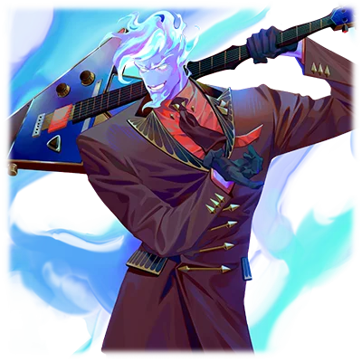
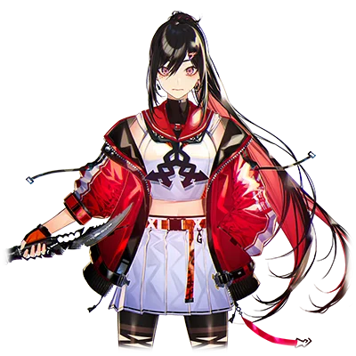
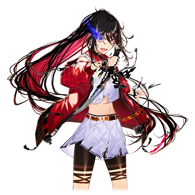

# 风焰

| 角色信息   |          |
| ----------- | ----------- |
|名称|风焰
|年龄|？岁
|职业|特利斯墨吉斯忒斯部下的精灵
|身份|远夜灯的搭档 
| 对应曲   |Blazing:Storm
| 对应版本 | Chunithm Paradise Lost|

## Episode 1 空壳

>要是有个能让我就这么去死的机会摆在面前，那我肯定不会放过。不管是上刀山下火海，都放马过来吧！

“终于也轮到老子被‘流放’了吗……”  

虽然嘴上这么抱怨，但说实话，我根本无所谓。  
无论是被贬往下界也好，还是明天就死在哪个角落，我都会照单全收的。   
在从天界前往“地上世界”的途中，我漫不经心地想着这些。  
本以为再也没机会回到地上世界——可当这个决定真的降临时，我却忍不住回想起三天前的情景。  

——三天前。  
某个板着脸的神明用近乎唾弃的语气说道： 

“风焰，现命你前往地上世界执行任务。”  

这家伙虽和我同属于“特利斯墨吉斯忒斯”的部下，但他却是直属的部下。    
这家伙就是个整天只会察言观色、阿谀奉承的混账东西。    

“……这差事非我不可吗？”  
“那倒不是。但看你这副半死不活的样子实在碍眼。”  
“…………”  
“我明白你失去‘她’的心情，但作为灵体的职责——”    
“打住。明白了，我去就是。”   

我粗暴打断这个硬要揭人伤疤的蠢货，转身离开。  

所谓“地上世界的任务”——    
不过就是让我前往出现G.O.D爪牙征兆的地上世界，赋予那些被选中的人力量，并且一同战斗。   
但是，只有征兆却没有情报，这也就意味着此行极为凶险。  
更何况像我这样的灵体本就没有寿命概念，除非死在战场上，否则就会永远存在。  
现在却要派我这个整日游荡的废物去高危地带——说白了，这就是变相的解雇通知。  
简单讲，这就等于在说“去死吧”。  
可对我而言，这反倒求之不得。  
自从失去“她”后，活着对我早已失去意义。  
参加战斗，然后就这么死去。   
如果这样就能够去她所在的地方的话——

——没有比这更令人欣喜的事了。  

## Episode 2 笑不出来的玩笑

>明明我以为我已经找到了我的葬身之地，但我遇到的协力者居然和“她”如此相像？这是命运跟我开了个玩笑吗？

出现G.O.D爪牙征兆的地方，是被称作“日本”的国家的，名为日野市的街区。  
降落在日野市后，我立刻开始寻找需要并肩作战的"被选中之人"。  
被选中的人，体内会沉睡着神力的原石。循着神力波动的指引，我分毫不差地沿着街道前进，最终来到了一座像是学校的建筑前。   
我远远望去，很快就找到了我这次的搭档。然而，看着搭档的样子，我却无比惊愕。   

"......开什么玩笑？这个玩笑可一点都笑不出来啊......"  

松垮的校服，束起的长发。   
这些特征全都跟“她”对不上号。   
但那双直视前方的锐利眼眸，那副凛然生威的面容——   
简直像是"那家伙"转世重生了一般。   
她大步流星地走着，散发出一股凛然的气息。   
真的越看越像。   

（该死的......这算什么恶作剧？）  

竟然要和酷似“那家伙”的女人共同战斗。  
简直像是被强迫重演当年的剧本，我烦躁地抓乱了头发。  

“别开玩笑了，这简直就是噩梦啊……”    

我跟着少女，来到了河岸边的沙洲。    
就在我本想立刻现身，立刻说明来龙去脉的。然而一想到要跟那个无比像“她”的少女对峙，不知道是因为不好意思呢，还是因为恐惧呢，我竟然站在那里无法动弹。   
我哀叹着自己的没用，就在这时——   
随着强烈的爆炸声，大楼就宛如沙堆一般轰然倒塌。   

“这就来了吗！！”   

那些不成气候的，G.O.D的爪牙正以浩浩荡荡的大军，从空中向这里飞来。   
没时间犹豫了。必须跟她一起战斗才行。   
我正想寻找少女的身影，却发现她已经独自奔向了堤坝的另一侧。  

“那边不行！会变成它们的活靶子的！......啧！”

那些家伙的动作比想象中的还快，没时间迟疑了。   
我一个运劲跳了起来，冲到了准备射出光束的敌人面前，护住了少女。

“久违的工作了……拜托了，老伙计！”   

我拿起了被自己称作搭档的吉他，狠狠地拨动了琴弦。只见无数向着这里飞来的光束都被我挡了下来。

“哈！这种程度的攻击，可不够我嗨的啊！！”

我抵挡着敌人的攻击，转身将特制麦克风抛向了目瞪口呆的少女。    
这是能够增幅神力的特殊麦克风。当她的指尖触碰到那东西的瞬间，我清晰感知到沉睡的力量正在苏醒。   

“虽然事发突然，听好了，你就用这个东西尽情地唱一曲吧。”   
“……哈啊？要我‘唱歌’？就在现在这个时候，这个地方！？”   
“不错……简单来说，‘要么唱出来，拯救这座城市，要么不唱，就这么死在这里’。这么说，很好理解吧？”   

少女瞪着我，眼中满是将信将疑的神色。   
那是肯定的。毕竟整座城市突然变成了一团糟，就算说要这么做估计也没法理解的吧？
但出乎意料的是，她轻轻地，却无比坚定地点了点头。  

（哈......果然像极了啊......这个家伙）  

而我，只能以一个微笑回应。  

## Episode 3 循环的法则

>感觉……还真是个干劲十足的小鬼啊。可恶，这下更相像了啊……

我随着她的歌声疯狂拨动着琴弦。  
这绝对是一场配得上“即兴”二字的、毫无章法可言的LIVE。  
她通过麦克风将神力增幅，利用歌声发动攻击。
我则用灌注神力的吉他音轨支撑。    
虽然粗糙生硬，但我们渐渐用音乐而非语言达成了默契——    
就算顶级乐手严格按着乐谱演奏，每个人总会自然地流露出他们独有的“律动感”。    
而这家伙的律动......还真是带劲啊。  

当战斗结束时，天已破晓。  
少女气喘吁吁地追问着事情原委。  
这些由G.O.D的爪牙引发的世界异常，我实在太熟悉了。  
和当年如出一辙的、疯狂的世界。  
我向少女解释这个我早已摸透的诡异现象：  

〈规则一：整个日野市被连着空间分割开来，永远循环在"8月32日"。每天清晨5点重置，周而复始〉  
〈规则二：除我们之外无人察觉这个循环。不管是被破坏的城市，还是人们的记忆，在重置后都会被复原〉  
〈规则三：死去的人不会被重置，而是被当成“从未存在过”一般处理〉  

对这个世界的居民来说，这简直就是创作小说中才会出现的设定。  
就算被当成嗑药嗨过头的瘾君子的疯话也不奇怪。  
但这位自称"远夜灯"的少女却不同——  

她灼灼生辉的瞳孔没有半分动摇，全盘接受了这个疯狂世界的现状，并展现出死战到底的觉悟。  
刚才的战斗中，她爆发出了根本不似新人的歌喉，以及唱到天明的惊人毅力。  
按理来说，常人初次上台，声音也本该紧张得发抖才对。    
然而她却如此自信，这自信究竟从何而来？  
某种意义上也是个疯子啊。“跟那家伙一样”，啊……    

我一边惊叹于灯的胆识，一边凝视她闪亮的眼睛。  
那身影终究还是与另一个人重叠。  
当我意识到自己又在做这种事的时候，一股自我厌恶感油然而生。  

（本想随便帮帮她......再随便死掉算了......现在可不能轻易死掉了啊......）  

擅自把影子投射在她身上，又擅自想通过救赎她来获得解脱。  
这不过是一个自私的男人一厢情愿的赎罪罢了——  
然而，现在的我却并未意识到这个错误。

## Episode 4 孤狼

>虽然素养确实是一流，但总会有碰壁的时候。我说啊，稍微依赖一下别人吧？

“这、这死小鬼......！”

丝毫不在意气的七窍生烟的我，灯连看都不看我一眼，自顾自地望向远方。
我的满腔怒火无处发泄，最后只能化作指尖狂暴的吉他扫弦。

虽然不知道她在闹什么别扭，但这小鬼压根不听别人说话。  
按常理本该由身为灵体的我负责防御，她专注攻击，两人组队战斗才是。   
可灯铁了心要单打独斗，始终不肯借助我的力量。   
当然我也不可能就这么放着不管，但连我主动掩护，她都要甩一句“谁要你多管闲事”。

平心而论，她的歌喉与战斗天赋确实惊艳。   
刚觉醒神力就能达到这种程度，说是天才也不为过。   
但要是遇到更强的敌人，光靠天赋可不够看。   

“我说你啊，你要单打独斗也不是不行，至少可以多依靠依靠我嘛。我们的目的可是一致的，一直这样闹别扭只会让效率低下哦？”  

“……”

对我的建议充耳不闻，灯只是以“今天的任务已经结束了”这么搪塞我。    
望着她远去的背影，我只能苦笑着叹了口气。   

“哎……真是的，明明就在努力逞强……”  

不知是她尚未察觉呢，还是刻意隐藏呢。      
她的身体尚未适应战斗的身躯，却每天都得这么绷紧神经。    
肉体和精神肯定早就到极限了。

当年的“她”虽然也十分好强，但至少懂得引导容易暴走的我。    
倒不如说，其实一直是她在守护着我。

“这回轮到我来当保姆了吗？真是个难搞的小鬼......”   

看似相似却又截然不同的少女。    
不过灯这份笨拙的倔强......倒也不讨厌。   
虽然这臭脾气实在让人头疼。

## Episode 5 灼热的代价

>不管灯在那边闹什么别扭都无所谓。我只知道一件事……我辜负了自己的使命。   

那些像是巨型飞虫一样的，G.O.D的手下的残渣们，灯把它们称作“BUG”。

既是破坏世界的“<ruby>程序错误<rp>（</rp><rt>BUG</rt><rp>）</rp></ruby>”，又是字面意义上的“<ruby>虫子<rp>（</rp><rt>BUG</rt><rp>）</rp></ruby>”。  

虽然可能只是偶然，但我也被灯的双关语所折服，也跟着她这么称呼起来。  

虽然和灯的信任关系仍未建立，但我们还是勉强击退了连日来袭的敌人。   
但今天出现的BUG却截然不同。   
那是迄今为止从未见过的，堪比高楼大小的蜘蛛型状的畸形生物。  
怪物背部燃烧着滔天邪焰，腹部挂着不断产出飞虫型BUG的卵囊。   
如此可怖的外形，一看就能明白。   
之前打倒的不过是敌人的马前卒，这东西才是让这座城市陷入疯狂的元凶。   
正当我被这直白到滑稽的巨型BOSS震住时，身旁的灯早已双眼充血，浑身迸发出骇人的杀气。

“别贸然靠近，会烧得渣都不剩的。”

虽然我这么警告着，但我知道她根本不会听。   
不过按常理，她总不至于无脑冲锋吧。  
——这个天真的想法，在下一秒就被粉碎。  

“要上了——！！”   

灯嘶吼着冲了上去，一瞬间就冲进了敌军之中。  
这怎么看都是自杀式袭击，连半点战术都没有。  

“该死...那个白痴！”   

我迟了半拍才追上去。   
某种意义上，灯的攻击简直无比的直白。   
但双方不论是从战力还是物量来看，差距都无比悬殊。    
更糟的是，我的吉他演奏和她的歌声依旧各唱各调，毫无配合可言。     
这种烂演出要是放在Livehouse，观众早该扔酒瓶了。

就在这时，蜘蛛型的BUG突然全身发光，一道巨大的激光直指灯的面门。   
虽然她勉强躲过了第一发，但接踵而至的第二击——   
不妙，要是直接命中的话非死即伤。   
无论如何都要保护好她！  

（可恶！距离实在是太远了！！但……必须赶上！！）

以极限速度冲刺的同时，我声嘶力竭地喊出了那个名字：

"灯——！！"

大部分攻击都被我挡了下来。    
然而，唯独漏过的一发直击灯的要害。   
被直击的灯失去了意识。   
我只能将她抱在怀里。  

“这下真是失职了啊……”   

我又没能守住。   
无处发泄的悔恨化作齿间的铁锈味，我几乎要咬碎自己的嘴唇。   

## Episode 6 孤独的孩子

>那孤僻的孩子的真面目，只是个比谁都要心高气傲的女孩而已。这种事情，我岂能重蹈覆辙呢！

我护着昏迷的灯苦苦抵挡着怪物的猛攻。就在快要撑不住时，那些BUG却突然撤退了。    
虽然搞不懂它们的意图，但我们确实捡回了一条命。

我撬开了一所待拆迁的旧医院屏障，带着伤暂避于此。    
过了几天，灯仍未醒来。   
但是深受高烧之苦的她，不知是不是做了噩梦呢，不时从她的口中发出了痛苦的梦呓。

“......妈妈......爸爸......不要丢下我……”

若说平日的灯是“叛逆期的小鬼”，此刻的她完全就是个“无助的孩童”。    
虽不知具体缘由，但显然她十分惧怕自己被抛弃。   

“装独狼的缘故……也是因为这个啊……”   

我嘟囔着，拭去她脸上的泪痕。     
因为比谁都害怕孤独，所以宁可从一开始就独自一人。     
想到这孩子始终藏着这份脆弱，孤军奋战，胸口就像压了块烙铁般疼痛。   

我看着躺在病床上的她。   
灯的身影渐渐与记忆中“她”临终的模样重叠。    
为驱散这幻影，我一拳砸向斑驳的墙壁。

我的使命是什么？    
不就是守护这家伙吗？   
我绝不能再眼睁睁眼前的女人。     
至少现在，还不是我退场的时候。   

## Episode 7 无须掩饰的话语

>就算只有冰山一角也好。谢谢你让我知道了你的想法。现在就轮到我回应的时候了。

我倚坐在医院斑驳的墙边，取出吉他。  
我试着一根根弦调试着音准，却怎么都调不对。   
虽然没有断，不过琴颈怕是已经变形了。我咂了咂舌头，放弃了修复工作。     
忽然，我瞥见了灯，似乎是已经苏醒的样子，她正颤巍巍地试图撑起身子。    
不用说，她失去了平衡，差点就从床上掉到了地上，我慌忙接住了她。   

“喂喂，就你现在这样还想乱动？伤员就该像伤员那样，给我老实待着。”  

这句无心之言似乎踩中了地雷。灯突然剧烈颤抖起来。   
就在我想回她一句“受伤了这不是理所应当”的时候，她的喊声盖住了我。  

“怎么可能老实待着！我不去做的话，还有谁来拯救这座城市！？大家一直都是这样！把期待啊愿望啊什么的强加给我……我受够了！”  

一直都在逞强着的灯，第一次撕开了她的伪装。   
我瞬间明白了自己的愚蠢——  
对啊，我到底在干什么啊。   
眼前这个少女一直忍耐着孤独，一个人为了拯救这个世界而拼命“活着”。   
而我……却沉溺于过去，总是觉得什么时候“去死”就可以解脱了。   

“这样啊……确实如此。擅自把自己的使命强加给你，是我不对。我也只顾着完成自己的使命，没好好看着你呢。”  

灯肯定是抱着累累的伤痕一路活下来的。   
她的心扉不可能轻易敞开。   
需要更直接的表达——不带任何修饰的真心才行。  

“我绝不会抛弃我重要的伙伴的。”     

她不是“那个人”。   
她是远夜灯，我的搭档。  
这次绝不会再搞错。所以——相信我吧。  

## Episode 8 信赖的前方

>就算一切都结束，也要保护这个笑容。只是期望这种事情，总不会遭到天谴吧？

看来我的心意终于传达到了——灯渐渐对我敞开了心扉。  
拜此所赐，不但是我们之间的意思互相疏通，还产生了其他变化。  
灯的成长速度简直堪称恐怖。    
当她把后背完全托付给擅长防御的我后，这家伙彻底放飞自我了。    
现在，反而是我被她保护的时候居多了。   
虽说没啥无聊的自尊心...但拖后腿可不行。   

“……我也得加把劲才行……不能再像从前那样被搭档带着跑了……”

"从前的搭档？"  

说漏嘴了。  
正想打个哈哈糊弄过去，灯却挂着不自然的笑容凑到我面前。  
糟，逃不掉了。  

"……因为我们的伪神在那个世界大闹了一场，结果导致整个世界出现了异常。其实，在灯之前，我还有过一个契约者，是个女人。"    
"……嘿～除了我还有人抽到你这种下下签啊。是个什么样的人？"  
"好胜又傲慢，做事不顾后果……简直和你一个模子刻出来的。"   
"哈？我才没那么傲慢也不鲁莽好吗！"  
"不……这方面简直一模一样……"  

自从灯开始信任我，这样的斗嘴越来越频繁。  
虽然吵得要命...但说实话，不讨厌。  
至少比当初冷冰冰的样子舒服多了。  

"这样啊……风焰也有可信赖的人呢。嘛，普通人活到这个岁数总会有那么一两个吧。"    
"你那边没有像这样的人吗？"  
"……我啊，是某个已故传奇音乐人的女儿。周围人只对我的才能感兴趣。能保护我的只有我自己。"  

医院里听到的梦呓，此刻被主动说出口。  
那是高烧中泄露的真心话，本不该被我听见。  
所以我一直没追问她恐惧孤独的缘由。  
但此刻她亲口告诉了我——  
那些被当作他人替代品的日常，  
那些塑造了如今的灯的经历。  
让我为不久前沉溺过去的自己感到羞愧。  

"不用，没关系。比起这个，刚才说到能够信赖的人——"  
"怎么？"  
"我现在有风焰了。所以，我不是孤单一人了！"  

灯露出的笑容，耀眼到让我眯起了眼睛。  
现在的我们一定能消灭BUG，修复世界。  
而当一切结束后——祈愿灯能获得不再孤独的平凡日常。     
这是我唯一能献上的祈祷。  

## Episode 9 为了再度欢笑立下约定

>没想到，寻找死的场所的我，竟然会和人约定一同活下去啊。不过，这种感觉……也不坏。

“终于现身了啊……哈哈，灯，快看啊，今天可真是黑压压的一大片啊……”  

从清晨起，整座城市就笼罩在异常的氛围中。  
铅灰色的云层吞没了阳光，浑浊的空气里弥漫着不祥的压抑感。    
仿佛在预示即将到来的恶战。    
此刻，遮天蔽日的BUG群正蜂拥而至，规模远超以往。    
而在它们后方，摇曳着邪焰的巨型蜘蛛正缓缓显现。  

这是场雪耻之战。   
对方显然也打算做个了断——显然，这是场恶战。
但奇怪的是，我竟丝毫不觉得会输。

“……好。赢下这场战斗，迎接明天的到来吧！可别死了啊，灯！”  

“嗯！一起活下去吧，风焰！”  

我们定下了"活下去"的约定。  
若让初来这个世界的我听见，恐怕会嗤之以鼻吧。    
灯改变了。而我也是。   
这早已超越灵体的职责——    
我只是——单纯地，想守护这家伙。   

"Live——Start！！！！"

灯呐喊着，而这声音就如同点燃我引擎的火花，战意随着飙升的肾上腺素沸腾。    
大干一场吧。   
我咧嘴一笑，甩出炸裂的吉他强力和弦。

## Episode 10 LAST SONG

>嘿嘿……这下还挺象样了吧……？真是最棒的LIVE啊……对吧……灯？

以我的吉他声作为掩护，灯放声歌唱。  
在吉他轰鸣的声浪中，歌声如利箭般穿透云霄。那声音仿佛能无限延伸，即便身处激战中央，我仍感到阵阵战栗爬满脊背。     

“开什么玩笑……这家伙的潜力简直深不可测啊！”

密密麻麻的飞虫型BUG筑起遮天蔽日的高墙。   
灯的一记超规格的攻击，直接就让这座高墙轰然洞穿。    
余波甚至撕裂云层，让久违的蓝天从窟窿里透出光来。   
她的成长永无止境。    
尤其在情绪高涨时，她总能带来惊喜，但今天这威力还是头回见识。  

（这种奇妙的感觉……就像要融化在歌声里似的……好想永远站在灯身后弹吉他啊……）  

明明是最终决战，我却想着这些有的没的。    
灯仿佛在嘲笑“这才哪到哪‘，继续提升了速度。她的攻击对BUG的大军正确实地造成伤害。   
绝佳的状态，绝妙的舞台。   
气势如虹的灯，冲向了一切的元凶——蜘蛛型BUG。  
就在这时。  

"是陷阱！灯！"  

佯装畏惧的蜘蛛型BUG突然锁定了目标，向着灯发动了攻击。   
体表无数眼球状的发射口同时亮起了凶光。   
那是激光攻击发射前的前兆。   
然而灯冲刺的惯性太大，根本来不及回防。    
哼，这算什么。    
我怎么可能让她再度受伤啊！

——恍惚间，我听见了欢呼声……    
啊啊……原来LIVE还在继续啊……    
无数光束如舞台射灯般，贯穿了我的身体……  
太棒了……这辈子都开不了第二次这么痛快的LIVE了……  

“风焰！！”

远处传来了灯的声音。   
怎么了，这么慌。   
LIVE还没结束呢。   

我想这么调侃，却发不出声音，意识迅速沉入了黑暗。   
我的身体正承受着过量的攻击，即将迎来我使命的终点。  

## Episode 11 青色的火焰

>虽然我已不再是熟悉的模样……放心吧，我一直会与你同在的。  

这是个没有阴影、没有墙壁也没有门，被白色的光芒包裹着的奇异空间。   
正当疑惑这地方究竟延伸向何处时，我突然发现——这里还有另一个人。 

“哟......原来你在这儿啊。”   
『才不是在这儿呢，我是特地来接你的』  
“哈，这么久没见还是这副德行。”  
『呵呵...你倒是变了不少呢』
“啊...算是吧。人只要活着总会有点变化的。”
『这样啊...嗯。其实呢，我算是来"接你"的』    
“我想也是。”  
『那...要跟我走吗？就算这么说，你估计也会拒绝的吧？』    
“...抱歉。这次不能跟你走了。”     
『哎呀呀——居然脚踏两条船啊——』    
“胡、胡说什么！那丫头还太嫩需要人看着...就是这样……！”   
『噗，开玩笑啦！要好好守护那孩子哦』  
“虽然我能做的已经不多了...嘛，我走了哦。”   
『嗯。再见啦，风焰』  

如同从梦中惊醒般，意识回归了现实。   
我看见灯正用身体护着我，拼命抵挡BUG的攻击。     
她这副模样实在让人心疼，想到接下来要说的话更是胸口发闷。   
我强压下情绪，呼唤她的名字。

"灯，已经足够了"  

我很清楚自己的状况。   
任何奇迹都改变不了这个事实。   
这副身躯早已到达极限，已是回天乏术。   

"不行……风焰……！"  
"傻丫头，别哭。战斗还没结束啊。"  
"可是……！"  
"别停下。像你这样的倔丫头，只要看着前方就够了。"  

——没错，只要向前看就好。   
当这场战斗结束，世界恢复原貌之时。   
尽情奔跑吧。永远奔跑下去吧，灯。  

"活下去。赢得这场战斗！"  

在存在即将消散的瞬间。   
我把最后的话语传递给她。   
说到底，我想说的不过如此。   

——别再哭了。   
即便这个世界终结，日常重新降临。   
你也早已，不再是孤身一人了。  

