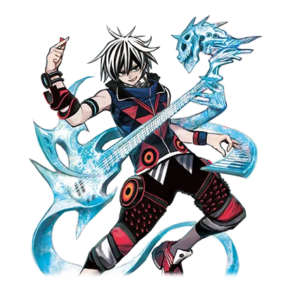
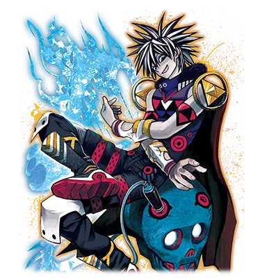

# 被比黑暗更黑之物所侵蚀的巴尼修

| 角色信息   |  |
| ----------- | ----------- |
名称|巴尼修
年龄|23岁
职业|视觉系摇滚乐手
时代|现代
对应乐曲|Scythe of Death
| 对应版本 | Chunithm NEWPLUS

## Episode 1 时间开始转动的世界

>我梦见了一个很长的梦。那梦无比漫长，甚至长到感觉像是被禁锢其中，永远无法脱身一般。

“……呼哈！！”

 

感觉像是从潜水中浮上来一般，我深吸了一口气，从床上一跃而起。

我整理了一下呼吸，确认着现在的情况。

周围是熟悉的床铺，沙发，桌子，还有散落在地上的乐谱。毫无疑问，这里就是我的房间。

从挂在墙上的霓虹灯管的数字时钟上的数字来看，是23：59分。

稍微过了片刻，时钟变成了00：00分，一天就此过去。

确认了这件事情的我，就好像心中的一块大石落地一般，松了一口气。

 

——这是为什么？我为什么会感到安心？

时间仍在流动，日子也该一天天的过去才是。为什么我会在意这种理所应当的东西？

 

感觉像是做了个噩梦。

我擦了擦额头的冷汗，摇摇晃晃地走进了厨房。

我从冰箱里拿出了瓶矿泉水，一饮而尽，接着开始回想起刚刚一直梦到的“噩梦”。

——我记得……我好像在跟什么东西战斗来着。

虽然很不甘心，但是敌人真的很强，光靠气势也无法战胜，那股惊人的力量，庞大的气势让我心惊胆战。

跟着那种RPG游戏里才会出现的，最终BOSS手下的那种眷属，我前往了那个敌人的所在，向他发起了挑战……然后，我输了，并且被他吸收了。

在那家伙的体内，我的身体似乎被大卸八块，就像是从细胞的层面被重新塑造了一个肉身一般。

在这痛苦与沉闷的感觉之中——我苏醒了。

怎么看这都是荒唐无稽的内容。

但这毫无疑问是一场噩梦。

 

“这果然……是场噩梦对吧。但是，我总感觉在我变得即将不是我的瞬间……好像看到了什么发光的东西？”

不管是感官的刺激，还是那股焦躁感，梦中那经历的一切都未免太过真实了。

然而那具体的内容就像一场梦一般，现在无论怎么想都想不起来。

这也是稀松平常的事儿了吧。等到一觉睡去再醒来，便会回到日常之中，把这天晚上的事情彻底忘了吧。

就在我对自己居然会被噩梦惊醒而自嘲地摇了摇头的时候——

 

“还真是千钧一发啊。”

 

从我刚才还在的卧室兼客厅的房间中，传来了男人的声音。

我并没有开灯。

因为冰箱内部的照明缩起瞳孔的我，对于这黑暗之中的身影根本无法辨认。

 

“是谁！！”

 

窗没有被打开，也没有什么外人的气息。

难道是狗仔队的记者？还是某些狂热粉丝？

不管怎么说，能够偷偷溜进我房间里的肯定不是什么正常人。

 

“不用这么警戒我的。至少，我不是你的敌人。”

“你以为说这两句话就会让我放松警惕吗？话又说回来……既然是来客，不如先报上自己的名号吧？”

“哦？作为人类的子民，你还真是有魄力啊。不过既然你能跟奥津对峙之后，还能活着回来，会这样也不稀奇。”

 

那个在那边自说自话地接受现状的声音的主人，没有一点愧疚之意，只是向我正面答到。

“我名为特利斯墨吉斯忒斯。是曾经被你们人类称呼为‘祝祭之神’的存在。”

## Episode 2 炼狱的诅咒

>先是噩梦，接着又是神？饶了我吧，我只是想以巴尼修的身份继续歌唱下去罢了。

“神……？”

“对。如果按你们的说法的话，这么说比较好形容。”

“哼，也就是说跟周围那些普通人不一样，我就是那种天旋之人是吧……看来我的脑子是真的疯了。”

“这既不是你的幻觉，也不是我在说什么诳语。看来……是你的肉体没有跟上你的意思啊。那么就让我帮你想起来吧。”

 

这个奇怪的不速之客这么说着的时候，我的房间瞬间被亮到张不开眼的光所包围。

那种光不是像舞台的照明设备那样的强光，而是宛如太阳光一般，温暖而恐怖的光芒。

那道光穿透了我的身体的时候，我突然感到了猛烈的疼痛，不禁跪倒在地。

回过神来，我的身上不知何时多了无数道伤口。

这不是被这道光所灼伤的痕迹——我很清楚，这些伤到底是怎么来的。

 

“我……对啊……我记得我……”

“终于想起来了吗？想起你的身体究竟经历了什么，最后落得怎么样的结局了吗？”

 

这个世界，还有我的时间的流逝，被一个“恶灵”操纵着。在它的操纵下，我被耍的团团转。

循环往复，时空跳跃，时光逆行，彻底抹去。

简直就像是一部制作粗劣的B级Cult片一般的经历，而在这尽头我看到了。

看到了那矗立于地狱，神性与邪性共存于一体的，燃烧着业火的生命。

我为了取回自己的世界，我——

 

“不错。你那个时候脱离了时之坩埚，落入了炼狱的缝隙之中。然后你在那里与G.O.D对决，最后被吸收了。”

“G.O.D……”

“在你的肉体彻底消失之前，我把你救了出来。如果不这么做的话，你要么是成为他的眷属，要么就是彻底成为他的食粮，被吸收到连残渣都不剩了吧。”

“……原来如此。看你说的这么稀松平常，应该也有解决方法吧？”

“是我的话，解除这种诅咒不过是举手之劳。”

“那么……”

“所以，我有个建议。要不要和我签订契约？以净化诅咒作为交换成为我的眷属，和G.O.D战斗，如何？像你这样的人类，应该会成为强大的战士吧。”

 

G.O.D，特利斯墨吉斯忒斯，神，眷属，诅咒。

就算是我，听到这一连串的名词都会有些混乱。

但是可以确认的是，这一切的说辞并不保证就是事实。而眼前的这个人也很有可能并非可以依赖的盟友。

 

“明明自称神明，说出来的却是以解咒为质，要挟人加入的话啊。”

“我不知道你们人类对神有怎样的看法，我只是想要你的一臂之力，仅此而已。”

“那你这招人的方式可真夸张啊。”

“你不用立刻做出回答。想必你也需要些时间整理思绪。等你决定好之后再呼唤我吧。”

 

这么说着，特利斯墨吉斯忒斯随着那道笼罩整个空间的光芒从这个房间里消失了。

房间里只剩下我一个人。我走到了窗前，拉开了窗帘。

从窗户看出去，是一轮明亮的半月，同时，从远处还能微微听到警笛声。

窗外见到的，仍然是一如既往的，我再熟悉不过的这片街道。

虽然很想回归日常，继续参加那些录制以及演出工作，但老天爷似乎已经不允许我这么做了。

按照特利斯墨吉斯忒斯的说法，从那场疯狂的时间旅行中生还的我，还留下了某样可怕的后遗症。

 

“哼，真是可笑啊。不管哪个家伙说起话来都这么古怪。既然要被诅咒的话，至少也得是被个音乐之神诅咒比较好吧？”

 

我并不会焦急。这点东西是绝不会改变我的生存之道的。

不管发生了什么，我终究还是回到了现实世界。

那么，我只要继续像以往那样歌唱下去就好了。

只要持续歌唱着的话，那无论是什么困难，都不成问题。

## Episode 3 最初以及最后的三天

>我原本应该以绝佳状态迎接第三天的演出。然而，在我未曾察觉的时候，命运却已经开始运转了。

第二天早晨。洗完澡整理好着装后，我便朝着体育场出发了。

昨晚，在看钟表上的日期时，我便隐约有些预感了。今天，正是我在体育场演出的第三天。也就是说，是我被卷入时间漩涡的第一天。

我似乎被送回到了原本应该存在的时间轴的那个分支点上。

 

凭借通行证通过会场的安检后，我径直前往休息室。只见经纪人以及乐队成员们都已到场。

虽说接下来就要进行排练了，可却丝毫没有紧张的氛围。

经纪人正和成员们一起说着无聊的话，甚至还有人打算趁这个时候好好吃顿饭呢。

我确信，今天的演出会比以往更加顺利。

虽然不知道其他乐队怎么样，但我们就适合这种轻松自在的氛围。

 

过了一会儿，我们被工作人员叫着前往舞台，在那里，从某种意义上来说，呈现着一幅“熟悉”的景象。

鼓面上写着“Varnish”的鼓组。堆叠着两台音箱的吉他全功率放大器。贝斯放大器则是精心挑选出来的稀有复古款。而在它们的环绕之中，我的麦克风被立在舞台中央的支架上。

这本该是一幅反复出现过无数次的景象。

在拼命制作样带，在简陋的场地进行演出的年轻时代。

好不容易抓住的出道机会，参加“<ruby>KOB<rp>（</rp><rt>KING OF BAND</rt><rp>）</rp></ruby>”，从Live House（注：小型现场演出场所）到音乐厅，又从音乐厅到体育场。

一路走来并不轻松。但每一天都无比光辉灿烂。

即便如此，我也并不想重复过去。我要继续向前迈进。

这幅景象也将到此为止了。

“今天这个瞬间，不会再次重演了”。

 

“那么，差不多该开始排练了——”。

透过扬声器传来工作人员的声音，我轻轻抬手回应。成员们也各自拿着乐器就位了。

能自然而然地感觉到情绪高涨起来。

哪怕是排练也没什么不同。唱歌，仅仅是唱歌这件事，对我来说就是能让我热血沸腾的瞬间。

 

“One,Two,Three,Four！”

——随着鼓的四拍，乐曲开始了。

充满疾走感的吉他前奏，贝斯的旋律稳稳地支撑着节奏。

节奏并不复杂。再过一小节，从主歌部分开始唱就行。

…………来了。

我认真地、但又不过于拘谨，带着几分大胆开始唱了起来。

嗓子的状态很不错。可以说是近期以来最好的状态了。

啊，好幸福啊。在震耳欲聋的轰鸣声中歌唱。

我活着就是为了品味这样的瞬间。

 

就在我满怀着幸福感与全能感歌唱的时候，在第一段副歌即将到来的时候，众人察觉了异样。

起初，我看到了在观众席检查排练情况的工作人员们那困惑的表情。

接着，同样带着困惑看着我的还有乐队成员们。

不久，明明曲子还在进行中，鼓手却停止了打节拍，紧接着其他成员也纷纷停了下来。

难道是在我没注意的时候出了什么故障吗？就在我打算向成员们询问情况之前，脸色变得煞白的经纪人慌张地跑了过来。

出问题的既不是工作人员，也不是乐队成员，更不是器材。

经纪人说到——你的声音不对劲。

就在这一天——我失去了作为主唱的自己。

## Episode 4 TRANCE

>我还能歌唱……但是歌声却再也传不到谁的心中。无法打动心灵的歌，那便不是我想要的歌。

手机屏幕上接连不断弹出的新闻网站以及社交媒体，上面全都充斥着关于我的话题。

“巴尼修，突然取消巡演！” “竟然传出失踪传闻！其真相究竟如何！？”

诸如此类的语句不停地在屏幕上疯狂涌现着。

 

我失去了存在的意义。

作为“声音”而言，我的嗓音并没有改变。即便把录音重听一遍，那毫无疑问就是我自己的声音。

但是作为“歌唱”来讲，我的嗓音似乎已经变成了别的什么东西。

我的歌在别人听到的感觉……就好像是把各种金属相互摩擦时那种每个人所能想象到的最让人不舒服的声音汇聚到了一起似的。

而且这并非是暂时性的情况。

嗓音一直不见好转，巡演也全部取消。理所当然地，后续的活动也完全没了头绪，于是我宣布了无限期停止活动。

想必也得考虑商业方面的事吧。经纪人在宣布停止活动时隐瞒了真实原因，甚至还想把这停止活动也变成一个耸人听闻的噱头，向媒体宣称“巴尼修失踪了”。也正因如此，无数无聊的猜测和谣言四处传播，甚至都传到了我这里。

 

“可恶……要是能唱的话早就唱了啊！”

 

我一边把手机往墙上扔去，一边如此嘟囔着，随后便一头倒在了床上。

比任何人都更对无法唱歌的我感到惋惜的，既不是经纪人，也不是狂热的粉丝，正是我自己。

我是能唱歌的。但仅仅那样是没有意义的。

当我的歌曲震撼他人的心灵，在那个人的心里留下无法磨灭的印记。这一整套才是我“唱歌”的意义所在。

难道要像在阿尔卑斯什么的地方，在空无一人的宁静草原上独自一人对着山歌唱吗？

开什么玩笑。

 

——好了，巴尼修。首先得冷静下来。

要想在这个世界上出人头地，冷静也是必不可少的。我应该比任何人都明白这一点吧？

想想看。事情变成这样到底是谁的错呢？对了，如果那个特利斯墨吉斯忒斯说的是事实的话，那这就是那个叫G.O.D的火焰混蛋干的好事。

不过，事到如今那都无所谓了。现在重要的是应对当下的状况。

该怎么办才好呢。想想看，想想看——

 

话虽如此，可所有的一切都颠覆了以往的常识。即便想了也想不出什么好主意。

我叹了口气，决定为了转换心情前往常去的酒吧。

我还没到借酒消愁、自甘堕落的地步。只是，为了提提神，想尝尝烈酒罢了。

走出公寓，朝着大街走去。

我把超大号的连帽衫的帽子拉得很低，手插在口袋里在街上走着。

不久拦到了一辆出租车，便坐了进去。

告诉司机目的地后，车子立刻就开动了。到酒吧大概需要15分钟左右吧。

 

——我一边望着车窗外夜晚街道的风景，一边呆呆地思考着。

在坐上这辆出租车之前的路上，行人并不算少。但是，却没有一个人认出我是巴尼修。

要是平时的我，会觉得没人认出自己是件值得庆幸的事，可今天却有点不一样了。

不能唱歌的我是没有价值的。说不定终有一天，我不但不会被人注意到，甚至还会被人遗忘吧。

虽然不想承认，但我确实感受到了那样的焦躁感。

 

出租车在红灯前停了下来。后面车子的灯光反射到后视镜上，格外刺眼。

我露出了不快的表情，然而本应该比谁都觉得刺眼的司机却纹丝未动。

 

（话说回来，这个司机……到现在都还没听到他说过一句话呢……）

要是平时的我，应该不会在意这些吧。

只要能把乘客准确无误地送到目的地就行。只要能做到这点，态度好不好之类的都无所谓。

但在这一天，我却因为这点微不足道的念头而产生了疑惑。

我侧过身子朝后视镜看去。

在那里，被远光灯照着的司机——是一个穿着制服的白色骷髅。

把我扔到这个时间扭曲的世界里的罪魁祸首，“白骨恶灵”出现在了镜子里。 

## Episode 5 HI&LOW

>既然要选边赌一把的话，那还是不要犹豫前进的好。当然，这只是只有两个选择的时候的情况。

没错，就是这家伙。

我毫不犹豫地解开车门锁，紧接着一脚踹开车门，从出租车里逃了出来。

跳过护栏进入狭窄的小巷后，我头也不回地继续奔跑着。

 

我可不是在害怕。哪怕被人说成是胆小鬼我也认了。

只是，我可不想再被送进那个荒唐的世界了。

 

那家伙并没有追上来的迹象。

为什么那家伙会出现在现实世界里呢？又或者说，我以为是现实的这个世界其实依旧是一场梦呢？

虽然心里有些在意，但总之此刻我对自己似乎能够顺利逃脱这一事实稍稍松了口气。

 

“搞什么鬼啊……”

 

在这狭窄的单行道上，原本应该在后面的“恶灵”，突然出现在了眼前。

我赶忙停下脚步，想要转身往回跑，可这次却发现后方也有一个一模一样的骸骨正慢悠悠地朝我这边靠近。

 

“……这下是走投无路了么？”

我不清楚它的目的是什么。但我确实是被它一点点地逼入绝境了。

凭直觉就能明白，这可不是靠拳头就能对付得了的对手。

可话虽如此，我也不能就这么乖乖地任由它摆布。我下定决心，用力地握紧了拳头，就在这时，不知从哪儿传来了声音。

 

“——巴尼修啊，歌唱吧。”

“这个声音是……特利斯墨吉斯忒斯吗！？说什么歌唱，这是什么意思？！”

“只有歌唱才能为你带来胜利。在今后所有的战斗中，这也不会有例外。”

“我的嗓音已经变得奇怪了。我的歌声已经没有了以往的力量！”

“不。你不是‘失去了’，而是被‘改变了’，皆是因为G.O.D的诅咒所致。”

“我本来就猜到是这么回事了啊！但是……可恶，没时间了！”

 

等我回过神来，那些“恶灵”们已经近到我伸手就能碰到的距离了。已经没时间再和特利斯墨吉斯忒斯继续问答下去了。

我不顾一切地按照它说的唱了起来。

 

——这些家伙一个个的都无视我，随心所欲地乱来。

什么梦境啊、现实啊、神明啊、恶灵啊，烦死了啊。

我要把你们统统都碾碎！

 

这不是舞台上唱的那种歌。是饱含着我所有烦躁情绪的歌。

瞬间，两具骷髅就被火焰包裹住了。

仿佛之前的行动都是假象似的，它们就那样像模型一样直立着，咔咔作响地微微颤抖着，然后渐渐燃烧殆尽。

不久，它们的身体消失后，在那里就像黑夜中燃起的篝火一样，有什么东西飘浮在空中，随后那东西朝着我的身体汇聚而来。

一瞬间，我感觉到有某种不属于自己的东西流入了体内。

 

“成功了吗……”

“比想象中还要厉害啊，巴尼修。果然我的眼光没错。”

“给我解释一下吧？”

“施加在你身上的诅咒，那也是G.O.D力量的一部分。通过压制我的诅咒，你得以能够操控那股力量了。”

“我的歌声发生变化，就是因为这个原因吗？”

“G.O.D的力量是邪恶且丑陋的。曾经你歌声中所拥有的希望之力被它吞噬、改变了。现在那力量已经不复存在了。”

“可恶的家伙……！！”

 

虽然心里已经有所预料，但还是不希望是这样啊。还想着是不是得了什么罕见的病，过段时间就能轻松治好之类的呢，一直都放不下这样的想法。

但是，现在我已经不得不直面这残酷的现实了。

我的歌声之力被那个巨大的怪物的力量给改变了，而现在我又靠着这股力量获救了。

……真是讽刺啊。

 

“刚才那个像人魂一样的东西是什么？看上去好像进入到我身体里了一样。”

“这个等之后再慢慢说吧。现在对你来说，首先得从剩下的选项中做出选择。”

“选项？”

“是选择在失去歌声后就此沉沦，等待着即将到来的因诅咒而降临的死亡呢，还是成为我的眷属，与G.O.D战斗，夺回歌声呢。只有这两个选择。”

“……有夺回歌声的可能性吗？”

“打败那个家伙就有希望。”

“要是把G.O.D……打倒的话……”

 

特利斯墨吉斯忒斯的声音已经消失了。

我伫立在小巷的这条单行道上思考着。

在我眼前的，是为了夺回我活着的意义而要去战斗的道路。而要是转身的话，便是只能静静等待即将到来的灭亡的失败之路。

前进，还是后退呢。

 

“哼……不管选哪条路，讽刺的是都没法保证一定能胜利啊。”

 

我带着自嘲的意味笑了笑，然后迈步向前走去。

我手中的选择，似乎只有这两者了。 

## Episode 6 再次邂逅

>G.O.D的力量的本质，还有这一连串的真实。已经知晓了一切的我，前进的路唯有一条。

那天夜里，我做了一个梦。

我身处于仿佛被漆黑且布满煤灰的岩石所包围的深渊底部。

准确来说，在那里的既是我，又不是我。

身体热得好似要燃烧起来一般，不过并非是肉体在燃烧。

燃烧着的是我的灵魂。我仿佛化作了火焰本身，在那个地方飘荡着。

就好像听觉被硬生生削去了一样，我什么都听不到。

仅仅靠着视觉，就这样一直在那个地方飘荡着。

 

忽然，我看到了黑暗中熊熊燃烧着的巨大炼狱之火。

那并非是那天在扭曲的时间世界里所看到的模糊记忆，它清晰地呈现出了模样。

是G.O.D。第一眼看到，我便如此确信。

在那巨大的身躯旁边，有一个小小的人影。

身着紫罗兰色的衣服，头上还戴着一顶格外大的帽子。

这套装束要打个比方的话……没错，就是魔女。

就像小时候读过的绘本里出现的那种魔女。那个娇小的身影就这么跟在G.O.D的身后。

 

（那就是所谓的G.O.D的眷属之类的家伙吗……？那么，那个“恶灵”又在哪里……）

 

除了魔女之外，还能看到几个疑似是G.O.D眷属的身影。

不过，它们的表情隐匿在阴影之中，无法看清。

即便如此，由于它们全都有着血肉之躯的生物形态，所以我知道在这些眷属当中并没有白骨恶灵的身影。

 

（我隐隐约约就有这种预感了……）

 

就在我心里暗自思索的时候，深渊的景象出现了变化。

在G.O.D那巨体前方的空间，就像被剪刀将眼前的空间剪下了一块般，开出了一道口子。

在那之后，从那洞口中，以如同老旧录像带般粗糙的画质，映出了某个别的地方。

那里摆放着一排桌子和椅子。还有一整面墙壁都铺设着落地镜的房间。那里还有一个拿着仍带着些许稚气的吉他的男人。

我对那个房间以及那个人物有印象。

（那是巡演会场的休息室……而且那个小鬼，好像是叫虎之助来着的……）

 

有一个男人站在虎之助的面前。

我对这个男人没什么印象，但不知为何我知道他的真实身份。那家伙，就像是G.O.D的分身一样的东西。

忽然，分身握住了虎之助的手。紧接着，虎之助的灵魂立刻就被分身吸收了进去。

剩下的那个“曾经是虎之助的东西”，变成了一个散发着超越人类范畴的邪恶力量的傀儡。

那便是G.O.D展现出“吸收能力”的瞬间。

 

（和“恶灵”进入我体内是一样的……G.O.D的力量看来不只能操控炼狱之火。那家伙就是这样，摄取他人的力量的吗……）

 

仔细想想就能明白的事。

毕竟我也是差点就被诅咒“吸收”了。

就好像点与点连接起来了一样的感觉，事件的脉络正在我的脑海中缓缓凑齐。

就在我想着这些事的时候，忽然注意到魔女正在对G.O.D说着什么。

因为听不到声音，所以不知道在说些什么。我静静地看着那情形，突然，G.O.D朝这边转了过来。

它的眼睛，确实是捕捉到了我。

 

（这是，怎么回事！？）

 

我下意识地想要逃离那个地方，可身体却像被定住了一样无法动弹。

就在我挣扎的时候，G.O.D朝着我伸出了手。

不久，那只巨大的手伸到了眼前，一下子大大地张开，将我握住然后捏碎——

 

“…………噗哈！！”

 

醒来时，发现这里是我的房间。

我已经知道，那不是梦——并非一场虚无缥缈的噩梦。

嵌入我体内的“G.O.D的一部分”。大概就是那家伙把我带去那个地方的吧。

——把我的灵魂带去了那里。

 

“……答案已经确定了。”

 

我如此嘟囔着，起身站到了穿衣镜前。

镜子里映出的是和昨天之前并无不同的我的模样。

但唯有一点不同，原本略带青色的我的眼眸——染上了如同炼狱之火般深邃的红色。

 

“你在的吧，特利斯墨吉斯忒斯！让我们好好谈谈吧！”

 

总是摆出一副交易商做派的特利斯墨吉斯忒斯，现在差不多也该等得不耐烦了吧。

就这么继续晾着它其实也没什么关系，不过不巧的是，我并不擅长心理战。

还不如赶紧开始这场以命相搏的游戏吧。

## Episode 7 VANISH

>我不会当任何人的马前卒。如果前方没有道路，那就由我自己开拓吧。

“这里到底是哪里？”

“这里是与现实接壤的世界的缝隙。就当成是我制造出来的空间吧。”

 

当我呼唤了特利斯墨吉斯忒斯之后，我便被那同样的光再度笼罩。接着，就被传送到了这个不可思议的空间。

那是一个仿佛无边无际，空无一物的空间。不，与其说什么都没有，或许更应该说只有一整片的白色。

在这个如同被泼满了白漆的白色世界里，我与特利斯墨吉斯忒斯对峙着。

 

“你既然呼唤了我，想必已经有所觉悟了吧？”

“啊啊，那是当然。我的心意已定。”

 

“像你这样的人，肯定不会就这样死在这里的吧。那么，告诉我你的答案吧？”

“在这之前，我有些事情想确认一下。”

 

特利斯墨吉斯忒斯看上去似乎急于得到我的回应，我却让他先等等。

反正我心里已经有了打算，即便继续往下谈也没什么问题……但那样的话我这口气可咽不下去。

让我吃了苦头这笔账可得好好算一算。

哪怕对方是神明，也得算清楚。

 

“首先一点。实际上，我以被G.O.D的诅咒牵连的形式和那家伙有了接触。虽然只是灵魂层面的接触。”

“看起来确实如此。你体内的 G.O.D 的力量…… 和昨天相比已经膨胀到不可同日而语的程度了。”

“原来你都清楚啊，那话说起来就快了。那家伙带领的眷属当中，并没有‘恶灵’的身影。看来白骨的风格似乎不符合 G.O.D 的喜好呢。”

“哦？”

“在吸收‘恶灵’的时候，我隐隐约约有那种感觉……通过像现在这样和你面对面，我更加确信了。从恶灵身上感受到的灵魂的气息，和你身上的是一样的。那是你创造出来的眷属之类的东西吧？”

“你想说什么？”

“把我扔到那见鬼的扭曲的时间旅行里的人——就是你，特利斯墨吉斯忒斯！”

 

我一直以为，那个无限循环的噩梦的罪魁祸首是 G.O.D。

但是，如今因诅咒获得了那家伙的力量后，我能够感觉到，有某种东西存在比任何事物都更能清晰地诉说真相。

甚至连灵魂都藏不住。

 

“……巴尼修。你从很早就已经被 G.O.D 盯上了。为了把你从他手中救出来，就需要在无限的时间当中提升你的力量。提升到足以和G.O.D战斗的力量。”

“那都是为了你自己方便吧。这就是个打从一开始就盘算着要把我变成眷属的说法。”

“……我不否认。为了应对这场大战，我希望能多招揽一些优秀的人才，哪怕只是多一个也好。”

“但我可不会答应这种事。”

 

我不清楚这是不是神明级别的怪物之间的争斗什么的情况，但这和我没关系。

虽说我被 G.O.D 盯上或许是事实，但这毫无疑问是导致我失去日常生活和歌唱能力的原因之一。

我可不会任由别人擅自决定我所不知道的未来。

 

“那也罢了。要是没被你扔进这场无限循环的时间旅行的话，说不定我早就被G.O.D吞噬了。那么，再让我确认一件事吧。”

“你说吧。”

“这种摄取他人的力量……对于‘G.O.D也不例外’吗？不只是 G.O.D，只要想做的话——就算是吸收你，也做得到吧？”

“……可以这么说。如果能拥有与他，抑或是与我互相匹敌的力量的话，是可以做到的。所以我才需要你的力量啊。”

“原来如此。那我决定好了。我已经，决定好我要走的路了。”

 

和这家伙一起打倒G.O.D，然后我就能夺回我的歌声了。或许也会有这样的未来吧。

——但我可不会听从神明的安排。我的未来，由我自己决定。

 

从眼前的局势来看，要么前进，要么后退，看上去只有这两个选择。

但是，真的是这样吗？是谁决定的只有两条道可以走的？

我哪条路都不走。我要打破这堵墙，开辟出属于自己的道路。

是大是小？无所谓了。

我要把整个牌桌都掀翻！

 

“答案是不。不管对方是谁，我可不想被人套上项圈。”

“……你是认真的吗？”

“啊，当然是认真的。我要用这 G.O.D 的力量，把那些眷属之类的家伙全都打倒然后吸收过来。为了让自己拥有无人能敌的力量。然后亲手干掉 G.O.D，夺回我的歌声。”

“…………”

“事先声明，要是敢来妨碍我，你也好，你的眷属也好，都不会有例外，谁敢妨碍我，我就打倒他。不碍事的家伙之后也会被我收拾掉。我为自己而活。除我之外全都是敌人。”

“即便那条路通向地狱，也还是要这么做吗？”

“对失去了歌声的我来说，已经没有比现在更糟糕的境地了。”

“好吧。你便尽管走上这条修罗之路吧。”

 

话说完了。没必要再继续纠缠下去了。

我哼着 “世界上最丑陋的歌”，白色空间的一部分就像纸被烧穿了一样，打开了一个洞口。

从特利斯墨吉斯忒斯那令人厌恶的世界里逃出来的我，来到街上，漫无目的地走着。

我，那个曾经叫巴尼修的男人，就在此刻已经死去了。

话说回来，那个恶灵好像确实说过……“Vanish（消失）” 之类的话。还挺合适的。

我要为了找回自己而把一切抹杀掉。

不论是神明，还是G.O.D——！

## Episode 8 神明与眷属

>眷属诉说着对希望的感受。神明低语着被诅咒者的未来。

在巴尼修离开了那白色空间之后。

从特利斯墨吉斯忒斯的身后，走出了一名少女。

她背上那巨大的背包中装满了大小各异的乐器，每当稍微动弹一下，就会发出嘈杂的声响。

少女似乎是顾忌着默默目送着巴尼修离去的特利斯墨吉斯忒斯，心不在焉地碰了碰头上的发饰，过了一会儿，终于按捺不住开了口。

“……放他走真的没问题吗？”

“啊啊，<ruby>放心吧，没问题。<rp>（</rp><rt>大丈夫だ。問題ない</rt><rp>）</rp></ruby>”

“可是他把特利斯墨吉斯忒斯大人当成了敌人啊……是不是把诅咒的封印解开更好？”

“那样也只会成为奥津的养分罢了。可不能让那家伙白赚一笔。”

“所以才决定‘观察’他吗……”

 

少女脸上浮现出一副似懂非懂的神情，过了一会儿，小声地嘟囔了一句。

“不过…… 想要夺回某样东西的那种心情，我也能理解啊……”

特利斯墨吉斯忒斯没有回应她，只是轻轻地摸了一下少女的头。

然后再次将目光投向瓦尼什打开的那个洞，收起笑容说到：

“要是G.O.D的力量不断增强，终有一天，他会连保持自我都变得无比困难的吧……到那个时候，估计他才会真正的面临‘选择’吧……巴尼修……”

 

特利斯墨吉斯忒斯施加在诅咒上的封印并非是永久性的。

而巴尼修，却仍未知晓这个事实。

