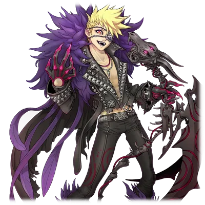

# 被比黑暗更黑之物所侵蚀的巴尼修

| 角色信息   |  |
| ----------- | ----------- |
名称|巴尼修
年龄|23岁
职业|视觉系摇滚乐手
时代|现代
对应乐曲|Scythe of Death
| 对应版本 | Chunithm NEWPLUS

## Episode 1 时间开始转动的世界

>我梦见了一个很长的梦。那梦无比漫长，甚至长到感觉像是被禁锢其中，永远无法脱身一般。

“……呼哈！！”

 

感觉像是从潜水中浮上来一般，我深吸了一口气，从床上一跃而起。

我整理了一下呼吸，确认着现在的情况。

周围是熟悉的床铺，沙发，桌子，还有散落在地上的乐谱。毫无疑问，这里就是我的房间。

从挂在墙上的霓虹灯管的数字时钟上的数字来看，是23：59分。

稍微过了片刻，时钟变成了00：00分，一天就此过去。

确认了这件事情的我，就好像心中的一块大石落地一般，松了一口气。

 

——这是为什么？我为什么会感到安心？

时间仍在流动，日子也该一天天的过去才是。为什么我会在意这种理所应当的东西？

 

感觉像是做了个噩梦。

我擦了擦额头的冷汗，摇摇晃晃地走进了厨房。

我从冰箱里拿出了瓶矿泉水，一饮而尽，接着开始回想起刚刚一直梦到的“噩梦”。

——我记得……我好像在跟什么东西战斗来着。

虽然很不甘心，但是敌人真的很强，光靠气势也无法战胜，那股惊人的力量，庞大的气势让我心惊胆战。

跟着那种RPG游戏里才会出现的，最终BOSS手下的那种眷属，我前往了那个敌人的所在，向他发起了挑战……然后，我输了，并且被他吸收了。

在那家伙的体内，我的身体似乎被大卸八块，就像是从细胞的层面被重新塑造了一个肉身一般。

在这痛苦与沉闷的感觉之中——我苏醒了。

怎么看这都是荒唐无稽的内容。

但这毫无疑问是一场噩梦。

“这果然……是场噩梦对吧。但是，我总感觉在我变得即将不是我的瞬间……好像看到了什么发光的东西？”

五感，焦躁感，梦中那经历的一切都未免太过真实了。

然而那具体的内容就像一场梦一般，现在无论怎么想都想不起来。

这也是稀松平常的事儿了吧。等到一觉睡去再醒来，便会回到日常之中，把这天晚上的事情彻底忘了吧。

就在我对自己居然会被噩梦惊醒而自嘲地摇了摇头的时候——

“还真是千钧一发啊。”

从我刚才还在的卧室兼客厅的房间中，传来了男人的声音。

我并没有开灯。因为冰箱内部的照明缩起瞳孔的我，对于这黑暗之中的身影根本无法辨认。

“是谁！！”

窗没有被打开，也没有什么外人的气息。

难道是狗仔队的记者？还是某些狂热粉丝？

不管怎么说，能够偷偷溜进我房间里的肯定不是什么正常人。

 

“不用这么警戒我的。至少，我不是你的敌人。”

“你以为说这两句话就会让我放松警惕吗？话又说回来……既然是来客，不如先报上自己的名号吧？”

“哦？作为人类的子民，你还真是有魄力啊。不过既然你能跟奥津对峙之后，还能活着回来，会这样也不稀奇。”

那个在那边自说自话地接受现状的声音的主人，没有一点愧疚之意，只是向我正面答到。

“我名为特利斯墨吉斯忒斯。是曾经被你们人类称呼为‘祝祭之神’的存在。”

## Episode 2 炼狱的诅咒

>先是噩梦，接着又是神？饶了我吧，我只是想以巴尼修的身份继续歌唱下去罢了。

“神……？”

“对。如果按你们的说法的话，这么说比较好形容。”

“哼，也就是说跟周围那些普通人不一样，我就是那种天旋之人是吧……看来我的脑子是真的疯了。”

“这既不是你的幻觉，也不是我在说什么诳语。看来……是你的肉体没有跟上你的意思啊。那么就让我帮你想起来吧。”

这个奇怪的不速之客这么说着的时候，我的房间瞬间被亮到张不开眼的光所包围。

那种光不是像舞台的照明设备那样的强光，而是宛如太阳光一般，温暖而恐怖的光芒。

那道光穿透了我的身体的时候，我突然感到了猛烈的疼痛，不禁跪倒在地。

回过神来，我的身上不知何时多了无数道伤口。

这不是被这道光所灼伤的痕迹——我很清楚，这些伤到底是怎么来的。

“我……对啊……我记得我……”

“终于想起来了吗？想起你的身体究竟经历了什么，最后落得怎么样的结局了吗？”

这个世界，还有我的时间的流逝，被一个“恶灵”操纵着。在它的操纵下，我被耍的团团转。

循环往复，时空跳跃，时光逆行，彻底抹去。

简直就像是一部制作粗劣的B级Cult片一般的经历，而在这尽头我看到了。

看到了那矗立于地狱，神性与邪性共存于一体的，燃烧着业火的生命。

我为了取回自己的世界，我——

“不错。你那个时候脱离了时之坩埚，落入了炼狱的缝隙之中。然后你在那里与G.O.D对决，最后被吸收了。”

“G.O.D……”

“在你的肉体彻底消失之前，我把你救了出来。如果不这么做的话，你要么是成为他的眷属，要么就是彻底成为他的食粮，被吸收到连残渣都不剩了吧。”

“……原来如此。看你说的这么稀松平常，应该也有解决方法吧？”

“是我的话，解除这种诅咒不过是举手之劳。”

“那么……”

“所以，我有个建议。要不要和我签订契约？以净化诅咒作为交换成为我的眷属，和G.O.D战斗，如何？像你这样的人类，应该会成为强大的战士吧。”

G.O.D，特利斯墨吉斯忒斯，神，眷属，诅咒。

就算是我，听到这一连串的名词都会有些混乱。

但是可以确认的是，这一切的说辞并不保证就是事实。而眼前的这个人也很有可能并非可以依赖的盟友。

“明明自称神明，说出来的却是以解咒为质，要挟人加入的话啊。”

“我不知道你们人类对神有怎样的看法，我只是想要你的一臂之力，仅此而已。”

“那你这招人的方式可真夸张啊。”

“你不用立刻做出回答。想必你也需要些时间整理思绪。等你决定好之后再呼唤我。”

这么说着，特利斯墨吉斯忒斯随着那道笼罩整个空间的光芒从这个房间里消失了。

房间里只剩下我一个人。我走到了窗前，拉开了窗帘。

从窗户看出去，是一轮明亮的半月，同时，从远处还能微微听到警笛声。

窗外见到的，仍然是一如既往的，我再熟悉不过的这片街道。

虽然很想回归日常，继续参加那些录制以及演出工作，但老天爷似乎已经不允许我这么做了。

按照特利斯墨吉斯忒斯的说法，从那场疯狂的时间旅行中生还的我，还留下了某样可怕的后遗症。

“哼，真是可笑啊。不管哪个家伙说起话来都这么古怪。既然要被诅咒的话，至少也得是被个音乐之神诅咒比较好吧？”

我并不会焦急。这点东西是绝不会改变我的生存之道的。

不管发生了什么，我终究还是回到了现实世界。

那么，我只要继续像以往那样歌唱下去就好了。

只要持续歌唱着的话，那无论是什么困难，都不成问题。

## Episode 3 最初以及最后的三天

>第三天的