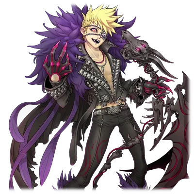
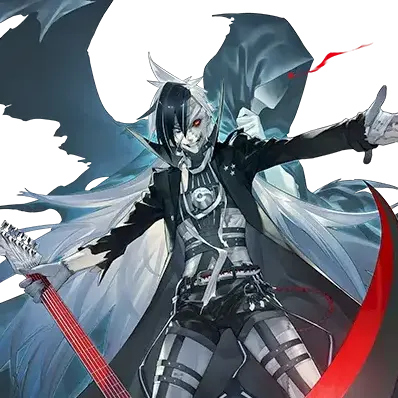
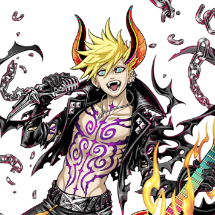

# 巴尼修/炼狱荣光

| 角色信息   |  |
| ----------- | ----------- |
名称|巴尼修（Ｖａｒｎｉｓｈ）
年龄|23岁
职业|视觉系摇滚乐手
对应乐曲|Crush the Dystopia
| 对应版本 | Chunithm VERSE

## Episode 1 见鬼的万事屋生活

“维内斯，数到4我们就上！可别拖后腿啊！”

“你才是。可别让我看到你丢脸的样子啊，巴尼修。”

“哼，大话还是挺会的啊。”

  
整理好呼吸。

大概这就是最后的机会了，只许成功，不许失败。

我轻轻地吐了口气，缓缓数着。

  

“1，2，3……”

  
还没等到4说出口，维内斯就配合着我，托举着我的右脚将我抬了上去。

我借着这阵助推，同时左脚蹬地，跃上了常人无法自行跳上的高空之中。

凌空而起的我，当看到那个正躲在树木的枝桠之间放松着的“小毛球”的瞬间，立刻向那东西伸出了手。

然后，我的身体直接跟坚硬的地面来了个激情碰撞，痛得我的脸扭成了一团。

  
“喵喵喵——！”

  
被我掐住喉咙的小猫，正用叫声表达着不满。

  
“可恶，竟然花了我们这么大功夫。别以为我们人类就爬不上这么高的树木啊！”

“这么野，这真的是家养的猫吗……”

“啊啊，我也觉得根本不像是养的。话说啊，不要总是拿些找猫之类的工作行不？”

“毕竟你可是大闹了一场，好赚钱的活儿可是越来越少了。这也是工作的一环。”

  
维内斯仍旧板着脸，冷冷说着。

我也只能挠了挠头，把抓来的猫送到依赖人的面前。

  
自从我们把那个突然出现在城市中的火柱怪物打倒以来，已经过了几个月。

我干的是那种所谓类似“万事屋”的活儿。

当然了，我可不是心甘情愿从事这样的营生的。

起初，我本想着靠瓦内斯的吉他和我的歌声，在这一带闯出点名堂来，但我们毕竟都是跟神和恶魔都宣布开战的大红人。

很容易就能想象得到，G.O.D和特里斯美吉斯托斯的那些手下们，肯定会盯上显眼的我们，然后蜂拥而至。

我自己因为自身的缘由在街头上闹事倒没什么，但要是这座城市被别人给破坏了，那我可忍不了。

所以靠乐队来维持生计这条路就走不通了。

话虽如此，也得挣钱糊口。

我在这个社会里已经成了“本不该存在的人”，连收取曾经的版税的途径都没有了。

像我这样的情况，除了靠手上的功夫之外，音乐之外就没剩下什么别的办法。剩下的也就只能听天由命了。

我一直在靠拳头解决街头暗处的各种麻烦事儿，日子也还算过得滋润。

不过这次，那些忌惮我的小混混们都开始收敛起来了，结果就出现了这么个讽刺的状况，就是这街道的治安反倒变好了，尽管这并非我所愿。

托这的福，我就沦落成了这样一个连找走失的猫这种无聊的委托都会接的“万事屋”了。 

  
“来，这是这次的报酬。”

  
瓦内斯一边推着那辆说是老爷车也太过破旧的车子，一边把这次的报酬给了我。

  
“就找只猫来说，这报酬可不少啊。” 

“是一位资本家太太的委托。听说她挺有钱的。虽说为了抬高报酬，我费了不少劲儿就是了。”

“摆出一副吓人的样子，然后把事儿办得挺漂亮嘛。咱们俩说不定意外地靠正当手段也能活下去呢，是吧？”

“别开玩笑了。我也好，你也好…… 在完成我们该做的事之前，根本不可能过上安稳的日子。”

“……我明白的。”

  
我是为了我的歌声，瓦内斯是为了他死去的弟弟。

为了夺回被夺走的东西，为了给被扭曲的命运做个了断。

我们必须要除掉那些自称为神的混蛋们。

想必有无数的人要么沦为那些所谓神的眷属，要么就彻底放弃了一切吧。

但是，我们是那些 “没有那样做” 的异类。

如果说我们能迎来些许幸福的话，那肯定是在这双手沾满鲜血的时候吧。

  
“话说回来，巴尼修。那个…… 你的身体没问题吧？”

“啊？啊——，没什么特别的问题呀。跟平常一样。”

  
那是我们为了找猫而在大街小巷四处奔走之前的那天晚上。

我们面前出现了第三个“刺客”。

不知道他是来自G.O.D那边的，还是特里斯美吉斯托斯派来的。我也没兴趣知道。

只是，这家伙毫无疑问是带着明确的杀意朝我们袭来的。

不过，他可不是我和瓦内斯的对手。

我抱着就像轻松进行一场演奏会的感觉，打败了他然后凭借潜藏在我体内的G.O.D的力量，将这家伙给吸收了。

没错，就是字面意义上的“吸收”。

吞噬对方的力量，化为自己的养分。而且，等到有朝一日，能够强大到足以给那些神狠狠地来一拳的地步为止，这就是我们唯一能做的事情。

我们没有选择落荒而逃，隐姓埋名，反而是即便继续做着万事屋的活儿也要留在这条街上，是有原因的。

这就是一场狩猎。

给那些本以为把我们逼入绝境的猎犬们设下陷阱，反过来将它们全部消灭。

所以，对于刺客的出现，我们也没什么好惊讶的。

因为这一切早就在我们的预料之中。

  
“话是这么说……你吸收那家伙时的样子，可不太对劲啊。”

“……那个瞬间实在是没办法。那力量会强行在我的灵魂上改变形态，对身体也会有影响的。而且……”

“而且？”

“昨天那家伙应该是G.O.D势力那边的吧。在吸收的瞬间，会有记忆和感情的碎片流入进来……他们所有人的那些碎片，都‘很痛苦’。”

“痛苦……啊。”

  
愤怒、怨恨、憎恶——。

不知道这些是他们原本就有的，还是G.O.D赋予他们的感情。

但是他们所有人，都是被这些情绪驱使着活着的。

只是在以毫无防备的灵魂去承受这些东西的瞬间，即便像我这样的人，也会尝到难以忍受的痛苦。

看着回想起那场景就皱起眉头的我，心思细腻得和他那粗犷外表不太相符的瓦内斯说道：

  
“……希望这一切能有结束的那一天。不管是我和你的这场旅途……还有这场荒唐的盛宴。”

  
我没有回答，只是一直凝望着眼前那郊外荒芜的道路。

旅途总有一天会结束的。

在迎来最后时刻的瞬间，哪怕那时我是站着的，又或者是趴在地上死去的。

在那终点的前方会有怎样的景色在等着我呢。

现在的我，根本都想象不到。

## Episode 2 史上最糟的依赖

在这个因秩序与混沌互相制衡而繁荣的街道上，不管是去惩治那些四处闹事的小混混，还是去给那些重要人物当暗中的护卫工作，又或是被委托去做些无聊的出轨调查之类的事儿，万事屋的活儿总是源源不断。

我一边时不时地打倒那些前来袭击的所谓神的手下，踏踏实实地吸收着他们的力量，一边虎视眈眈地瞄准即将到来的“那一天”，就这样过着日子。

不过，同时我也切实地感觉到，距离那一天还远着。

派来的那些眷属们，明显都是些小喽啰。

大概是因为我既不投靠G.O.D那边，也不依附特里斯美吉斯托斯的缘故，所以面对我这个异端，他们只敢派些人来侦查情况罢了。

虽然留在街上引他们上钩这个计划是成功了，可就算猎杀再多这样的小喽啰，也根本没法触及那些所谓神的脑袋呀。

到底是主动出击呢，还是耐心等待时机呢。

就在我正躺在定期更换地点的“窝点”的沙发上思考着这些事儿的时候，听到了朝着门靠近的脚步声。

脚步声有两个。

其中一个是听惯了的瓦内斯（注：Vernes音译，可能是人名等）的脚步声。

另一个却完全不知道是谁的。

我一边保持警戒，随时准备行动，一边等着。

眼前的门嘎吱嘎吱地被打开了。

  
“……瓦内斯”

“抱歉啊，巴尼修。什么都别问，能否就这样答应我一个请求？”

“我拒绝。你那严肃的表情，让我只有不好的预感。”

“那这样行不行。这是作为万事屋，由‘我’对‘你’发起的委托。我也会给报酬的。所以……拜托了。”

  
到了这个时候，我已经没有拒绝的余地了。

虽说还谈不上相处很久，但我很清楚瓦内斯是个什么样的人。

明明长着一副让人觉得有点阴森的模样，却是个老好人，我的意见他通常都会听取。但这家伙要是固执到这种程度的时候，那就是十头牛都拉不回来了。

  
“……那，是什么请求？虽然大概我也能猜到是‘那事儿’吧。”

“啊……”

  
那正是另一个脚步声的主人。

这家伙被瓦内斯从身后推了出来，然后用格外冷漠的眼神直勾勾地看着我。

脏兮兮的皮肤，破破烂烂的衣服，从破了洞的鞋子里还能看到脚趾露在外面。

这个看起来还没过上十次生日的小鬼，就那样用阴沉的眼神一直盯着我看。

  
“听说他叫巴特。是个……孤儿。”

“看着就像是。就是个街头的小鬼而已。这种家伙在这条街上也不算少见了。”

“那个……我想能不能收养他一阵子？”

“哈——”

  
我深深地叹了口气。

这下可摊上了比以往任何活儿都要麻烦的事儿了。

  
“到底是发生了什么事才会这样啊？你这老好人的毛病都侵蚀到脑子了吗？”

“不是的。我也不是突然变成什么慈善家了，也不是想说这世界一片美好之类的话。”

“那当然了。那种人可是我们最讨厌的类型啊。”

“嗯。但是这孩子，这孩子的家人是……被‘火柱’给烧死的。”

“火柱”——。

  
那天，那个如火焰怪兽一般的存在，把中央体育场烧了个精光，还对周边设施造成了极大的破坏。

我听说当时因为体育场处于关闭状态，所以损失还算小的，但伤亡数字终究不是零。会出现这样不幸的孩子也是完全有可能的。

而且“火柱”和瓦内斯之间是有渊源的。

他想说的事儿我大概也能猜到了。

  

“因为某个契机和他相遇了……但无论如何，我都……”

“把他跟你弟弟的形象重合了吗？”

“啊！？”

  
看着被我一语道破而惊讶的瓦内斯，我嗤笑了一声。

还说什么“不是”呢。这个老好人啊。

瓦内斯的弟弟就是被“火柱”烧死的，现在就像死神一样附在他的背上“纠缠”着他呢。

不知道这对他们来说是单纯的不幸，还是不幸中的万幸。只是，他大概是想通过这个孩子，去挽救那天的自己吧。

  
“——那，期限是多久呢？”

“啊？”

“我问你要保护到什么时候啊。这可是委托呢。”

“啊，啊！我已经托人在找收养家庭了。他又不是那种彻头彻尾的孤儿，应该不用花太长时间就能找到的吧。”

“……明白了。”

  
我说完便从沙发上站起来，朝着小鬼——巴特走去。

然后，像是要把什么扔出去一样，伸出了手。

  
“行吧，多多关照啊。不过话说回来，我也就只能提供个遮风挡雨的地方和几顿饭罢了。”

  
巴特先是看了看我的手，又看了看我的脸，然后突然把头扭到了一边。

我气得把悬在半空的手握成了拳头。

  
“真够可以的啊……这个不知天高地厚的小鬼……”

  
就这样，史上最糟糕的“委托”开始了。 

## Episode 3 Childhood

和巴特这个新来的小鬼头的生活，比想象中还要轻松。

他不像一般的小鬼那样咋咋呼呼的。平时，除了最基本的几句话交流之外，几乎都不怎么开口说话。

不管是吃饭的时候，还是我随手拨弄吉他的时候，又或是我和瓦内斯出去工作的期间，他都只是在家里默默地待着。

瓦内斯认为，他可能是一下子失去家人受到了太大的打击，所以总是想主动去关心他，不过事实并非如此，这孩子原本好像就是这种闷葫芦般的性格。

而我呢，一边盼着快点有人来把他领走，一边倒也没嫌弃这个不怎么给人添麻烦的家伙。

就这样，大概过了一周左右。

我们三个人正吃着买回来的快餐汉堡。

 

“……两位平时都是去哪里工作的呢？”

 

从巴特嘴里第一次发出了“询问”。

他本来就很少说“是”或者“不是”之外的话，像这样明确地抛出问题还是头一回。

我和瓦内斯对视了一下，但并未太在意，便直接回了他话。

 

“基本上都在中央市那边吧。人多的地方麻烦事儿也就多呗。”

“哦。那工作，都是什么样的呀？”

“什么活儿都干……基本上就是防止有人被揍，有时候也会反过来去揍别人。”

 

瓦内斯一副“哎呀呀”的样子，无奈地摇了摇头。

我可不会费心去考虑什么思想教育之类的措辞。毕竟在这个疯狂的大都市里，就算只待了几个月，那也是在街头混过的人了。事到如今也没必要在小孩子面前装什么了。

 

“有那么多这样的工作，那这街道是个很可怕的地方吗？”

“啊？你是在这条街上出生的吧？这种事儿你应该知道的吧。”

 

本以为他难得开了口，没想到紧接着又抛来一连串的问题，让我有些猝不及防。

不过这孩子说话的语气里，并没有那种刚燃起求知欲的小鬼特有的烦人劲儿，倒像是要核对自己心里那些模糊的知识一样，有着一种类似讨论的氛围。

我莫名觉得挺有意思，便决定继续这段奇妙的对话。

 

“就像我刚才说的，人聚集的地方就会有麻烦事儿。所以要说可怕的话，确实是这么回事儿。不过，就算是在这可怕的地方，也有着自己的乐趣。从这个意义上来说，这条街可不会让人觉得腻味呢。”

“这样……”

 

 
巴特小声嘟囔着，然后面无表情地咬了一口手里的汉堡，那表情可看不出汉堡有多好吃的样子。

完全猜不透他在想些什么。

现在的小鬼都这样吗？还是说这孩子比较特殊呢？

我试着回想自己小时候的事儿，可脑海里只闪过打架和摇滚乐的轰鸣声，很快我就觉得想这些也没什么用，便放弃了。

我也同样面无表情地准备把饭吃完，刚张开嘴的时候，这次又听到了“请求”的话语。

 

“我，想去街上看看。”

 

这是什么玩笑吗？难道要我带着这小鬼去糖果店之类的地方逛逛吗？

 

“街上……是说中央区那儿吗？”

“……我想看看人们都在做些什么。”

“哈，原来是社会实践学习啊。我还以为你会想要变形机器人之类的呢。”

“不需要。我只是，想看看这条街是怎样的而已。”

 

这该怎么回答才好啊。

要是他乖乖听话的话，带他去稍微参观一下倒也没什么。

只是，我也好，我们这群人，都是这条街的异类。

对于那种适合给小孩子看的“街面上的景象”，我们是一无所知。

大概是看不下去我被问得哑口无言的样子了吧，旁边的瓦内斯接过了话头。

 

“我们只了解夜晚的街道情况哦。不知道是不是有你想看的东西，即便这样也可以吗？”

 

巴特默默地点了点头。

他的眼神和刚才一样。与其说是去看未知的东西，倒不如说是去确认什么，闪烁着一种和单纯的好奇心不太一样的光芒。

我一边吐槽着轻易就答应下来的瓦内斯，一边把汉堡塞进嘴里，然后把揉成一团的包装纸扔掉，从沙发上拿起皮夹克穿上了。

 

“巴尼修？你要去哪儿？”

“去哪儿，当然是要去那里……去中央区呗。”

“……你这人行动可真够快的。”

“那当然了。麻烦事儿就得赶紧解决掉才行啊。”

 

说着，我催促着正呆呆地抬头看着我的巴特。

 

“来，穿上外套，你就跟我去长长见识吧。让你看看这条街的恐怖一面！” 

## Episode 4 摇滚的觉醒与狗牌

“巴尼修！刚刚还说的那么帅气，结果就是来到这里吗！”

“有什么办法啊！你要我大晚上的带着小孩在中央市的街头游荡吗！”

 

瓦内斯用着不输给鼓点与吉他的声响的嗓门向我吼到，我也不甘示弱地喊了回去。

这里是我们常去的据点。

虽说只是家新开没多久的Live Bar，但这里的酒味道不错，选乐队的眼光也不差。
每次干完活儿，我们就常常来这儿喝一杯。

与其在街头惹人注意，倒不如来这儿更省事。

要是想看看“人”的样子，这家店再合适不过了——仅凭“喜欢摇滚”这一个共同点，就能聚集起形形色色的人。

 

“嗨，‘伯恩斯’。”

 

前一支乐队的演出刚结束，工作人员正在进行换场准备的时候。

相熟的酒保隔着吧台，喊出了我在街头用的名字。

她满脸都是耳钉，多到让人觉得脸上再没地方能扎孔了，此刻她将从背心袖口露出来的双臂撑在吧台上，开口说道：

 

“真没想到你还带着这么大的孩子啊。”

“少废话。要不是工作，我才不会带他来。”

“呵呵，你又掺和进麻烦事里了啊。至少也得找点乐子嘛。”

 

顺着她的视线望去——

巴特那小鬼正坐在那儿，连橙汁都没碰一口，只是直勾勾地盯着舞池里端着酒杯谈笑的客人们。

这孩子实在让人猜不透在想什么。

到底是接受了怎样的教育，才会长成这么死气沉沉的小鬼啊。

 

“喂，有意思吗？”

“……嗯。”

“光盯着客人看有这么有意思？”

“因为觉得奇怪。”

“啊？”

“大家都在笑。明明大家之间看起来也不像是朋友的关系……”

“那是因为来这儿的人都喜欢音乐啊。要是喜欢同一样东西，自然会觉得彼此像同伴吧。”

“音乐……一样的东西……”

 

面对这似懂非懂、含糊不清的回答，我无奈地耸了耸肩。

我转头看向瓦内斯，他像是早已认命般，正猛灌着杯里的酒。

 

“真是……越来越离谱了啊……”

 

虽说人是我带出来的，可眼下这局面比想象中还要混乱。就在我正暗自叹气的时候，原本温和无害的爵士流行乐背景音随着灯光一同渐渐淡去。与此同时，舞台上的堆叠音箱震颤着，爆发出震耳欲聋的声响。

是支常规的四人组乐队。骨子里带着硬摇滚的底子，还融入了旋律金属的风格。

单看成员的模样，大概是支新人乐队吧。

虽说年轻，却既带着对前辈的敬意，又有着自己的新风格，更具备了能将这份特色展现出来的实力。

真没想到现在还有这样的乐队啊——我心里这么想着，一边享受着这轰鸣声，视线边缘却不经意间瞥见了被舞台灯光照亮的巴特的脸。

他虽还是那副不苟言笑的样子，可我总觉得，他的眼眸里似乎闪过了一丝微光。

鼓与贝斯交织的节奏、吉他奏响的旋律、还有主唱的嘶吼……

我看着他全神贯注、仿佛要将乐队的一举一动都刻进眼里的模样，一边想起了自己小时候的样子，一边将酒杯凑到了嘴边——。

 

“你刚才看得挺入神的嘛。喜欢摇滚吗？”

“……嗯。总感觉有一种怀念的感觉。”

“怀念……你这小鬼，哪来东西让你怀念的呀。”

 

从Live Bar走出来，我们踏上了归途。

喝了几口好酒，还听了一场好听的摇滚的我和瓦内斯心情正好，愉快地带着巴特一起走着。

毕竟被听到那样上头的音乐，任谁都会心里痒痒的，想要上台去露一手呢。

 

“赶紧把那些事儿都解决了，咱们也去尽情地玩一玩吧。是吧，瓦内斯。”

“是啊。再这样下去，我的技术都要生疏了。”

 

当然，我们心情好可不仅仅是因为这个。

毕竟啊，当年还是小孩子的时候被摇滚所点燃的那股热情，简直就是无上的享受。

虽然不想说些像老头子一样的话，但正因为自己体会过那种心情，所以现在就更有感触了。

当我们一边想着这些事儿，一边走在这依旧喧嚣、尚未入眠的夜晚的中央区街道上时。突然，街边林立的几个摊子映入了我们的眼帘，我们看到了其中的某个摊位，停下了脚步。

在那摆放着一排排银色戒指、手链的摊位上，有许多狗牌（注：Dog Tag，一般指军队中用于识别身份的牌子）被杂乱地串在一起，挂在那儿。

 

“那是什么呀？”

“是狗牌。”

 

我简洁地回答了巴特的疑问。

 

“是在战场上牺牲的士兵用来确认身份的牌子。不过，也有很多人把它当作饰品来戴呢。”

“这么不吉利的东西，真不想戴啊。”

“你背着个死神还好意思说这话……”

 

我没理会看起来没什么兴趣的瓦内斯，伸手拿起了一套两枚的狗牌。

 

“老板，这个给我。”

“好嘞，多谢惠顾！我可以用刻印机帮您把名字刻上去哦，您看怎么样？”

“……不用了，就这样就行。”

 

付完钱后，我拿到了没有刻印、崭新的狗牌。

瓦内斯一脸疑惑地说道：

 

“这玩意儿不就是块铁板嘛。”

“这样就行啦。我在这个世界上，已经没有被认可的名字，也没有安身之所了。”

 

我不需要这种身份标识牌。因为我在这世上本就没什么可刻上去的东西。

我把两枚狗牌中的一枚从链子上取下来，然后塞到了巴特的胸前。

 

“给你啦。”

“嘛……就当作是今天的纪念礼物之类的吧。你也是失去了整个家庭、屋子，失去了一切。等以后你有了新的家，有了新的名字，到时候再把它挖出来看看也好。”

“谢……谢你。”

 

我这是在做不合身份的事儿啊。

也许是太久没这么好心情了，被这难得的惬意夜晚给弄醉了吧。

不过，偶尔这样“放纵”一下也挺好的。

我感受着那许久未曾有过、甚至都快想不起来的一丝平静，再次迈开了脚步。

穿过摆满摊位、热闹非凡的街区后，人流渐渐少了些，周围也安静了下来。这时，我突然发现，擦肩而过的人们都朝着我们这边看过来。

他们一个个都带着那种像是硬挤出来的笑容，到最后甚至开始跟我们打招呼了。

 

“晚上好呀。”

“啊？”

 

我对这些面孔完全没有印象。

但是，一个又一个与我们擦肩而过的人，却不停地向我们打着招呼。

 

“晚上好呀。”

“今晚夜色真美呀。”

“今天有点冷了呢。”

 

有点不对劲。

我们在这街面之下的暗巷里倒是有点名气，可这些明显是普通老百姓的人，平时可不会这样跟我们搭话的。

 

“喂，瓦内斯。”

“我知道。不管怎么看，这都太奇怪了。”

 

我们对这摸不清状况的情形警惕了起来。

这是敌人搞的鬼呢，还是发生了什么我们不知道的事儿呢？

 

“您今天已经要回去了吗，**巴尼修**。”

 

当一个脸上挂着虚假笑容、随处可见的老太太喊出“我的名字”的瞬间，我就明白过来，这是敌人发起的攻击了。 

## Episode 5 中央市，惊魂警报

“巴尼修”

“巴尼修”

“巴尼修”

“巴尼修！！”

 

就好像堤坝决口了一般，周围那些人不停地呼喊着我的名字，缓缓朝我们靠近。他们就像恐怖电影里的僵尸一样，慢慢地把我们围了起来，然后，伸出手向我们扑了上来。

 

“哼！”

 

那些扒在我肩膀上的手的力道之凶狠，已经远超常人。

我用力甩开那几乎要嵌进肉里的手，我们三人赶紧踢开这些“僵尸”，拔腿就跑。

 

“这到底是怎么回事啊！！”

“很明显他们怀有敌意，这错不了！”

“我知道啊，这还用说嘛！！”

 

我们漫无目的地一路狂奔，好不容易跑到了相邻的街区。

这里是富人居住的住宅区，这个时间点，大家都已经入睡，早该是一片寂静了。

本想趁着暂时摆脱了那些人，喘口气调整一下，可没想到，从那一栋栋带车库的气派独栋房屋里，接二连三地冲出了那些被“僵尸化”的居民。

 

“巴——尼——修——”

 

虽说说是“僵尸”，但他们可不是那种会走路的尸体或者被抽干血的躯壳之类的。

他们脸色看上去和正常人没什么两样，只是看起来像是被操控了一样。

我愤恨地朝地上吐了口唾沫，然后我们又开始跑了起来。

 

“虽然不想往这个方面去想……难道说整个街道都变成这样了吗？”

“……虽然想说不太可能。不过也说不准了。”

“要不先把巴特带回住处吧。别把他也卷进来了。”

“在这种情况下，让他一个人反而更危险。而且，既然连我的名字都被他们知道了，那咱们的住处肯定也被盯上了。”

“啧，这些家伙真是……挑的这什么破时机来搞事啊。”

 

怎么办呢，好好想想。

那些所谓“神”的家伙们到底有什么企图。

不管是G.O.D也好，还是特里斯美吉斯托斯也好，他们都觊觎着我的力量，所以我才一直被他们盯上。

不过，对于那个不惜杀了我然后把我变成傀儡肉身的G.O.D来说，相对还算纯粹的神——特里斯美吉斯托斯，应该是想活捉我吧。

那如同捉摸不透的“气息”一样的东西，正渐渐露出真面目。

不亲自动手，而是操控街道居民这种下作的手段。

而且，还想用数量来把我们困住。

 

“不用问了，这肯定是特里斯美吉斯托斯那一派的人的杰作。”

“怎么办，巴尼修。要逃出这条街吗？”

“不，就这么夹着尾巴逃跑，我自己可接受不了。而且，也没法保证能逃得掉啊。”

“话虽如此，也不能动用武力啊。这些居民恐怕只是被操控了而已。”

“嗯。就算是我，无故去杀害无关的普通人，那也是会做噩梦的呀。所以，我们要直接去把幕后黑手解决掉。”

“你是说干掉操控他们的元凶吗。可是，要怎么做呢？”

“管不了那么多了！用这双脚去找啊！！”

 

虽然已经可以确定背后有人在操控这些居民，但要在这么大的街道上把那家伙找出来，简直难如登天。

我们一边盲目地跑着一边继续寻找，可我抱着巴特，体力毕竟有限，不可能一直跑下去，于是我们便躲进了一处暂时看不到那些“僵尸”的废墟区域。

每次大口呼吸想要调整气息的时候，肺部就像被冻住了一样，生疼生疼的。

 

“哈，哈……这么瞎找也不是个办法啊……”

“嗯……我也这么觉得……”

 

我躺在地上，大字型摊开，仰望着天空。

仿佛全然不顾这满是“僵尸”的街道一般，那皎洁的月亮、被月光照亮的云朵，还有寥寥几颗星星，依旧像往常一样点缀着夜空。

忽然，我看到巴特站到了我旁边，也同样仰望着天空。

 

“都这种情况了还有心思看星星，还挺有闲情逸致的嘛——”

 

刚说到这儿，我就发现巴特的视线并没有看向夜空，而是落在了眼前的地方。

在中央区的正中央，矗立着无数高耸入云的摩天大楼。

其中，有一座比周围大楼都要高出许多、直插云霄的中央塔。

那座有着观景台，作为观光景点也很受欢迎的塔，巴特正目不转睛地看着它。

 

“……对啊，是塔呀！就算是神的眷属，也不可能随心所欲地操纵人们的！他们肯定需要在某个地方掌握我或者居民们……整个街道的情况！在那里的话，街道各处都能尽收眼底！”

 

我们再次起身狂奔，朝着目的地——中央塔奔去。

虽然不知道对方对街道的情况掌握到了什么程度，但我们可是每天在街道上东奔西跑的万事屋啊。

包括那些小巷子在内，论对这一带的熟悉程度，我们可不会输给那些家伙。

要是他们是直接操控着街道居民的话，那我们选择像废墟区域这种原本就没什么人经过的道路走就行。更何况现在目的地已经明确了。

即便如此，在途中还是好几次遭遇了成群的“僵尸”，不过我们最终还是有惊无险地抵达了中央塔。

虽说有观景台，但这基本上是座用于商务用途的大楼。在这万籁俱寂的深夜里，应该不会有太多“僵尸”才对。

我们拖着公交站的长椅，朝着玻璃砸了过去，然后踩着破碎的玻璃碴进入了大楼里面，展现在眼前的是被不知哪里的电源灯或者应急灯幽幽照着的大堂。

 

“看啊，巴尼修。运气不错啊。电梯还通电呢。”

“这可真是谢天谢地了。我都想发自内心地感谢一下那混账神了。”

 

我按下了两两相对、一共四部的大型电梯的按钮。

安静的大堂里响起了电机运转的声音，很快电梯就会来迎接我们了。

在等电梯的时候，为了等会儿能把那可能在观景台上的混账家伙狠狠揍一顿，我一边活动着拳头的关节，一边说道：

 

“瓦内斯，话说回来，我一直挺好奇的。”

“怎么了？”

“先不说我都已经算不上是半个正常人了，你又为什么没被操控呢？”

“那肯定是因为我是从‘火柱’里活下来的存在吧——在那地狱般的烈火，全身被那火焰灼烧的瞬间，G.O.D的血沾染到了我身上。要说不算半个正常人的话，我也差不多是这样了。”

“哼，原来如此……”

 

原来我们是同类啊。

无论是所处的境遇，还是失去的东西，都很相似。

在这里的我们三个人，都是被G.O.D夺走了很多东西的丧家之犬。

正想着这些无聊的事儿时，我突然意识到。

既然我和瓦内斯都不会被他们操控，所以才会像这样被追得到处跑。

那么——这孩子呢？

 

“喂。”

 

从一开始到现在，一直都保持着清醒的巴特，我朝他喊了一声。

巴特只是盯着电梯门上倒映出的自己的模样，并没有回应我的呼喊。

 

“你这家伙，到底是什么人——”

 

话还没说完，伴随着“叮”的一声，那有些傻乎乎的提示音响起，电梯到了。

通常这种情况，大多是离所在楼层最近的那一部电梯会过来。

但这次不一样。

八部电梯，同时打开了。

 

“糟糕！快躲开！”

 

发出警告的我，还有瓦内斯他们，根本来不及做出充分的反应。

从八部电梯里，涌出了多得仿佛无穷无尽的“僵尸”，一瞬间，我们就陷入了绝境，无处可逃了。 

## Episode 6 炼狱降临

就在我们即将被那一大群“僵尸”组成的“肉团”压在底下的时候，我和巴特对上了眼。

 

“……巴尼修——”

 

这小子第一次喊了我的名字。

然后，就在他用轻得几乎听不见的声音嘟囔着什么的那一瞬间。

 

“呜哦哦哦！？”

 

我们突然被一道足以灼烧眼球的强光所包围，与此同时，我们感受到了一股带着压倒性质量的冲击力，我和瓦内斯的身体直接冲破大堂的玻璃，被甩飞到了大街上。

我脑袋晕乎乎的，视野也模糊不清，强忍着颤抖的膝盖，好不容易才站起身来。

我瞪大眼睛看向爆炸发生的地方，想弄清楚到底发生了什么事。

不过，其实根本没必要这么做。因为那造成爆炸的源头——那个东西，周身正缠绕着无比耀眼、熊熊燃烧着的炼狱般的火焰，想不注意到都难。

 

“不是吧……”

旁边站起身来的瓦内斯不禁脱口而出。

这也难怪，我此刻也是同样的心情。

“G……O.D……”

 

出现在那里的，正是那有着震撼炼狱之力的神——G.O.D的身影。

它那庞大的身躯挪动时，把大堂里碍事的柱子、墙壁统统扫到一边，缓缓地朝着大楼外的我们靠近过来。

终于走到我们眼前时，它停下了脚步，与我们正面相对峙。

它附近的行道树开始燃烧起来，融化的沥青冒出的烟呛得人难受。

我凭直觉判断着眼前的情况。

虽然不清楚这是它的分身还是本体，但这应该是个无限接近于纯度极高的“G.O.D本身”的存在。

 

“……不好意思啊，我可没工夫跟你玩。我正被特里斯美吉斯托斯那家伙找茬呢。”

“……”

 

一直盯着我、纹丝未动的G.O.D，缓缓地举起了张开的手，紧接着，又用力地握成了拳头。

刹那间，被扔在中央塔大堂里的无数“僵尸”的身体，全都燃起了红色的火焰。

 

“啊啊啊啊——！！”

 

那红色的火焰在街道各处熊熊燃烧起来，从被染成红色的夜空，以及像警报声一样笼罩着街道的惨叫声就能知道。

那些“僵尸”们用不成声的嗓音疯狂地嘶吼着。而他们，可都是这街道上与我原本毫无关联的普通居民。

 

“你这家伙……！！”

“等等，巴尼修！别冲动，贸然冲上去可赢不了它！”

 

瓦内斯一把拉住了正要冲出去的我。

为什么要拦着我？这街道上除了我们之外的居民可都要被杀光了呀！

就在我气得要甩开瓦内斯冲出去的前一刻，仿佛是要制止我一样，G.O.D开口说话了。

 

“他们并未死去。特里斯美吉斯托斯的那些眷属也好，其他什么也罢，我只不过是烧掉了让这些民众发狂的‘力量’罢了。”

“……这是什么意思？”

 

回过神来才发现，笼罩着居民们的红色火焰已经消失了。

他们的衣服也好，皮肤也好，看上去都没有被烧伤的迹象。其中有些人虽然看上去很痛苦，但也只是发出呻吟声而已。

G.O.D并没有杀害这街道上的居民。

 

“你到底想干什么？不管你是神还是恶魔，没想到你这家伙还会对人类手下留情啊。”

“没必要这么做。只是如此而已。”

 

确实，这家伙是个混账东西，但它也不会像奇幻故事里的魔王那样，不分青红皂白地到处杀人。

要是它想这么做的话，早就动手了吧。

早在我的命运变得乱七八糟之前，就会动手了吧。

而且——就在刚刚，我们还心情不错地走在夜晚的街道上呢。

 

“……巴特！我们得去找他！”

 

瓦内斯像是突然反应过来一样，大声喊道。

看着这家伙马上又要冲出去了，这次轮到我来拦住他了。

 

“没那个必要。”

“……为什么啊。”

“巴特那小鬼原本就不应该存在于此。虽然不知道它打的什么主意，但那家伙……是和这个G.O.D有关联的人。”

“什……么……？”

 

没有受到特里斯美吉斯托斯势力干扰的人。

那就是像我和瓦内斯这样，身体里带有G.O.D因子的人。

而且，就在那道强光闪过之前，我看到了。

我看到了脸上露出了从未有过的笑容的巴特，以及他的身体开始迅速发生变异的那一瞬间。

 

“那只是我分出的一小部分无意识的肉块燃起的篝火罢了。我依靠那火焰，才得以在这地方现身。”

“所以，你就扮成小孩子的模样，玩这鬼鬼祟祟的间谍游戏？你这震撼炼狱的神可真够让人无语的。”

 

我们被算计了。

被那小孩子的模样给骗了，被它耍得团团转，还可悲地沉浸在那片刻的平静之中。

明明就是刚刚才发生的事儿，可现在一想起来，我就气得七窍生烟。

而且最重要的是，他当时看着摇滚乐队时的眼神。

但与此同时，我也越发搞不懂G.O.D的真正意图了。

因为我觉得，当时那孩子的眼神，不像是装出来的。 

## Episode 7 鲁莽与无谋

“虽然搞不明白的事儿一堆一堆的，但你也不是来跟我闲聊的吧？既然如此，我该采取的行动就只有一个。G.O.D，我要把你给吞了！”

G.O.D盘算着要把我变成它的眷属。

事已至此，它肯定不会轻易放我走的。

话虽如此，不管怎样，我现在也没有别的选择了。

“只能上了，巴尼修，咱们全力出击！”

瓦内斯说着，便从背上取下了吉他。

只要跟着这家伙的演奏节奏，我就能使出全力一击——虽然心里是这么想的，可脸颊上还是流下了冷汗。

传入耳中的，是他随意拨弄琴弦的声音，就像是在确认调音一样。

那声音并非通过音箱传出，而是仿佛与瓦内斯的精神相呼应，震动着空气，在我们耳边奏响的音色。

看来，很快就要发起进攻了。

 

“上啊——！！该死的巴尼修！！咱们把这破神干掉——！！！”

 

瓦内斯像是变了个人似的，一边嘶吼着，一边与那激烈的吉他弹奏同步起来。

我也跟着他，发出算不上是歌声也算不上是吼叫的呐喊声，朝着G.O.D的腹部冲了过去。

 

“哇哦哦哦！！”

 

打持久战是不行的，只能一击定胜负。

可我的拳头，根本碰都碰不到G.O.D的身体。

 

“噗哦……”

 

就像少年漫画里的那些小喽啰角色一样，它只是轻轻一挥手臂，我的身体就失去了力气，整个人飞到了半空。

即便后背狠狠地砸在地上，这股冲劲也没停下来，直到撞到围着行道树的那圈砖砌花坛，我的身体才终于停了下来。

我，真是完全小瞧它了啊。

难道就这样，我会违背自己的意愿，变成G.O.D的眷属吗？

难道要像个为它而死的行尸走肉一样活着，直到最后连自己都被剥夺殆尽吗？

听不到吉他声了。难道瓦内斯也意识到了双方力量的悬殊差距了吗？

好困啊。强烈的困意侵袭着我的全身。

就要这么放弃吗？

也许，这也挺好的——

 

“别像个下水道的老鼠一样趴在地上等死啊！！巴尼修！！”

 

伴随着那本应消失了的吉他声，耳边传来了瓦内斯的怒吼。

 

“等把这一切都了结了，咱们还要搞乐队呢！！我们，可要为了能够在这个再也不会被夺走任何东西的世界，奏响旋律而战啊！！”

 

——对啊。

就算打倒了G.O.D和特里斯美吉斯托斯，被夺走的东西也不会回来。

但是，即便如此，我也必须夺回来。

我要夺回我们的……“未来”啊！！

 

“别光在那儿说大话，然后死掉啊，你这呆子！！”

“烦死了！！你这乱糟糟的家伙！！别废话了，使劲弹啊——！！”

 

我站起身来。明知这是一场毫无胜算的战斗，可我依旧站了起来。 

## Episode 8 G.O.D

如果正面硬刚敌不过的话，那就只能采取别的办法了。

我身上有着G.O.D的力量。

在被它吞噬之前，就让我活生生的把它的“内在”给吞噬殆尽！！

 

“哦哦哦哦哦……！！”

 

我一边吼叫着，一边再次朝着G.O.D冲了过去。

没必要执着于把它打倒在地。

只是直直地，用一种极为狼狈的方式用身体去冲撞它。

只要它哪怕有一丁点儿身为上位者的傲慢，那我就有机会。

 

“……终于是破罐破摔了吗？”

 

大概是觉得我在极限状态下陷入错乱了吧。

G.O.D像是很无奈地嘟囔了一句，然后连手臂都没抬起来，就用身体直接接住了我。

刹那间，我被从它身上燃起的熊熊业火灼烧着身体。

 

“啊啊啊啊啊！！”

 

我强忍着那几乎要让我意识消散的剧痛，伸出了手臂。

朝着那火焰之中，它的核心伸了过去。

 

“！？”

“事到如今才发觉，已经晚了！尝尝被自己的力量从内部吞噬的滋味吧！！”

 

在那火焰之中，我感觉好像触碰到了一种和灼烧身体的热度不一样的、暖暖的东西。

瞬间，我的意识就朝着一片深邃的黑暗之中飞了过去——。

* * *

“这里是……哪里……？”

 

我正身处于一片黑得让人分不清东西南北的黑暗之中。只是，不知从哪里有风吹来。

回过神来才发现，周围的黑暗好像裹上了些许微光，我察觉到周围的景色正在高速流动着。

这和坐在跑车里风驰电掣的感觉可不一样。

不是我在动，而是周围的时间在飞速流逝。

那景色就好像在我的脑海里烙下印记一样，深深地刻了进去。

 

“这是……谁的记忆……”

 

在遥远的过去。

有一个有着金色头发、身着漆黑长袍，被称作预言者的男人。

他为人类的未来担忧，身为人类却与神对峙。

为了挽留那个对这个世界感到绝望、想要舍弃它离去的神。

凭借这个男人的勇气，人类与神迎来了蜜月期，可人类却再次犯下罪孽。

他们贬低神，还背叛了这个男人。

面对如此悲惨的对待，这个男人陷入了疯狂。

甚至到了忘却作为人类该如何前行的地步。

 

“名叫奥津的男人……G.O.D，这就是真正的你……吗……？”

 

那流动的景色早已朝着抛在了我的脑后，我再次被留在一片漆黑之中，喃喃自语道。

我察觉到有个能对我的声音做出反应的存在，便回头看去。

 

“啊，这正是我。”

“G.O.D……不，我该叫你奥津吗？”

“随你喜欢就好。反正，指的都是我。”

 

那个有着金色头发、身着漆黑长袍的男人，如此说道。

这里大概就是G.O.D的精神世界吧。

因为触碰到了它的核心，所以我现在正在干涉它的精神世界。

 

“你已经看到了我的全部吧。怎么样，知道了这震撼炼狱的神的真面目，其实是一个被人类……被这个世界背叛的可怜男人之后……你是怎么想的呢？”

“…………”

 

是该嘲笑他呢，还是该大骂他一顿呢。

但我，哪一种都做不到。

刻在我脑海里的奥津的记忆，就好像是我自己的记忆一样，深深地、深深地烙印在那里。

去嘲笑他的痛苦、绝望，就感觉好像是在拿刀砍自己一样，我做不到。

 

“像这样我们彼此的精神能够相互干涉的时间，已经所剩无几了。我们都拥有着同等的，能够吞噬他人的力量。那么，最后活下来的，就只有我们其中一个。”

“好啊。我会把你吞噬掉，然后把特里斯美吉斯托斯也一并击溃。”

“哼，气势倒是挺足的嘛。”

 

我们冷冷地交谈了几句后，便正面相对峙起来。

然后，为了将对方彻底吞噬，他掐住了我的喉咙，我也紧紧地抓住了他的咽喉部位。

 

“哦哦哦哦……！”

“咕啊………！”

 

从因疼痛而张开的嘴里，火焰喷涌而出。

我感觉喉咙像被火烧一样，全身的血液都在沸腾。

即便如此，我和他都没有停下那想要将对方吞噬殆尽的手。

就在这关乎生死的激烈争斗之中，我心底不知怎的，竟想着把自己交给这家伙也未尝不可。

奥津的记忆刻在我心里，深刻到仿佛要和我融为一体了。

这家伙和我一样，都是被夺走了一切的丧家之犬。

在知道了这些之后，现在我心里有着一种连自己都不敢相信的、很天真的想法，怎么都挥之不去。

就在我看着眼前痛苦挣扎的奥津，感觉他的痛苦就好像是我自己的痛苦一样，下意识地就要放松手上力道的时候。

 

“巴尼修……啊……”

 

奥津用那被灼伤的喉咙，艰难地挤出了声音，喃喃说道。

 

“你觉得……人类承担起责任……就能获得自由吗……？”

“我哪知道……责任也好，自由也罢，做选择的是我……！”

“哈，哈哈……没错……你就是这样的……男人啊……”

 

在极限的状态下，奥津笑了。

那笑容和我在中央塔看到的巴特的笑容，很是相似。

 

“我想……再试着相信一次……神也好，人也罢，都不分彼此……相信自己的人能够生存的世界……”

“你在说什么……”

“为此……我这副身躯，已经太过……污浊了……”

“我在问你到底在说什么呢……！”

“一切……都交给你了……巴尼修啊……”

“奥津……！”

“真是个很棒的乐队……啊……”

“奥津！！”

 

就在我感觉到灼烧我脖子的热度减弱的那一瞬间，这漆黑空间里的时间开始以超快的速度逆流起来。

我强忍着那几乎要让意识消散的感觉，等再次睁开眼睛的时候。

我发现，我这个存在，已经和G.O.D融合，发生了蜕变。

“巴尼修！你没事吧！”

 

我听到了瓦内斯的声音。

在站在沥青路面上的我的周围，曾经是G.O.D的那个存在已经被烧得干干净净，化为灰烬，四处飘散着。

而那些灰烬，也乘着夜晚的风，朝着某个遥远的地方飘去了。

 

在G.O.D核心深处，那仅剩的作为奥津的人格，把一切都托付给了我。

从遥远的过去开始，就像连锁反应一样被搅乱的，他和我的命运。

这是否算是一种赎罪，没人知道。

只是，现在的我，很奇怪地，对他已经没有恨意了。

以往每次接触到G.O.D的眷属时感受到的那种疼痛。

愤怒、恨意、憎恶……。

但是，我一直都没弄明白那疼痛的真正本质是什么。

现在我明白了。

那是——一种痛彻心扉的悲伤啊。

 

忽然，我脖子处传来了金属碰撞的声音。

那里挂着的，是和我送出去的那个东西凑成一对的、用链子连着的两枚狗牌。

 

“……奥津，这笔帐，我可要好好的算才行啊。之前你让我承受的那些，我都要讨回来。所以你就在……我的身体里活下去吧。我会让你看到最美好的景色的，等着瞧吧。” 