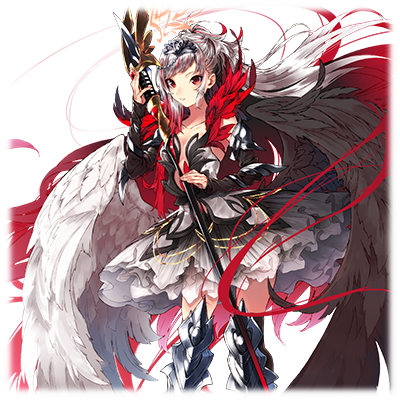
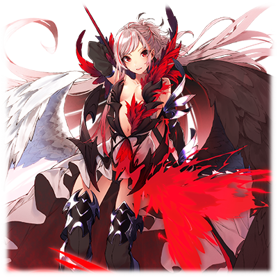

# 库蒂露卡.普露米耶

| 
角色信息 
  |          |
| ----------- | ----------- |
|名称|库蒂露卡.普露米耶
|年龄|18岁
|职业|白圣骑士团团长、圣骑士
|对应曲|Black Swan Lake
CV|今井麻美
|初出版本|Chunithm Amazon Plus

翻译：UZNp

## Episode 1 歌斗士库蒂露卡

> 为什么人们必须互相争执……为什么我还在战斗……明明已经，不想再战斗了……

歌斗士——指的是，拥有将声音或歌，转化为物理、精神力量的能力的人。

圣王国法尔内利亚……

在霸王法尔内利亚二世的统治下，鲁维利亚大陆北部诸国被合并而成的，号称大陆霸主的强国。

然而，自从圣王国成立开始，就使用着强力的歌斗士们率领的13个骑士团，进行着武力的治世，被淹没在与周围的国家的无尽争斗之中

普露米耶家族作为歌斗士一族世世代代侍奉王室，是背负着率领直属骑士团命运的贵族

而作为长女出生的库蒂露卡，是一位拥有用歌声鼓舞人们的，指挥之歌声的歌斗士，在王室的庇护下被培养成圣骑士。

然而她心地善良，厌恶争斗。因此，不愿参加这些无论敌我都会血流成河，失去性命的战争

但是现在，成为骑士的库蒂露卡所隶属的王室直属骑士团“白圣骑士团”，奔走于战场，不断战斗着。

 

“为什么，人们必须互相争执……为什么，我依然在战斗……”

每次上战场她都会这么想。为什么自己要投身于不希望的战斗之中……。

而这是由她所服侍的国家、世代相传的家族的职责以及战况所决定的。

 

普鲁米耶家族是指挥之歌斗士辈出的名门。在战场上鼓舞士兵，作为指挥官率领他们。

继承了高歌斗士能力的男孩世世代代都会成为圣骑士，不久就奉命会率领骑士团。

但是，库蒂露卡出生以后，就只有女孩出生，在没有继承人的情况下国家又掀起了新的战火。

在不断蔓延的战火中，率领白圣骑士团的普鲁米耶家族族长，也是她父亲的阿尔冯斯

·普鲁米耶，战死于沙场。

作为先代的祖父西奥多·普鲁米耶暂时继承了家主之位，但由于年事已高，无法在战场上指挥士兵。

 

就这样，普鲁米耶家族只剩下库蒂露卡、阿露米纳、塞西莉亚和夏洛蒂四姐妹。

作为长女继承了优秀歌斗士才能的库蒂露卡，背负着为了国家，为了保护家人的话语，和指挥之歌声一起投入了她所不希望的战斗之中。

 

## Episode 2 库蒂露卡，首战

>库蒂露卡在首战中明白了名为战争和战场的真实。为什么，会这样……

如果是普通的女孩，此时应该是歌颂青春的年纪，但库蒂露卡却率领军队，第一次作为歌斗士站上了战场。

 

然而，她的首战却是星落云散。

 

这也是理所当然的。虽说她是作为歌斗士培养起来的，但连战斗都没有经历过的，纤细而温柔的少女，是无法在战场上担任指挥的。

这样的库蒂露卡在战场上看到的，是人的生命被轻而易举摧毁的光景，和惨不忍睹的战火的伤痕。

“为什么，会这样……我……我……”

库蒂露卡无功而返，副官和祖父鼓励他说:“第一次也没办法。”

 

虽然在那个场合装出平静的样子说了道歉和反省，但是一个人回到房间的时候，她的泪水决堤而下。

对战场惨状的悲痛感，眼前本国士兵的牺牲，对自己无能为力的悔恨，使他无法忍受的感情化作泪水涌了上来。

哭了一场之后稍微冷静下来的库蒂露卡，压抑住想要逃避的情绪，选择了继续战斗。为了保护年幼的妹妹和家人，她强行杀死了自己的本心。

 

然而，她却不知道，这会酿成后来的悲剧……。

## Episode 3 无垢之心
>不想看到……争斗和鲜血。这样苦恼着的库蒂露卡找到的答案是……
 

我讨厌战争……

我并不想夺走别人的性命……

但是，我也明白，在现在的世界里，不战斗就无法生存

那样的话，为了不夺去无辜的生命，只能把战火控制在最小限度，并继续取得胜利

这就是我的答案

 

被圣王国法尔内利亚吞并的城市国家，海安，为了争取独立，由独立军发动了叛乱。她所经历的这场战役，后来被称为海安战役。

王国派遣了几个骑士团，试图平息事态。

但是，以第一身份的法内利亚人，和第三身份的海安人为中心展开的战争非常惨烈，在后来的史书中，成为了历史黑暗的一页。

 

库蒂露卡在如此惨烈的战场上持续战斗着，取得了巨大的功绩，并成长了起来

副官和她的祖父对此评价颇高。然而，库蒂露卡本人却默不作声。

“夺去众多生命换来的评价……不是我所想要的。我不想战斗……不想看到，战争中的鲜血……”

 

每当战斗结束时，库蒂露卡都会从自己房间的窗户，望向夜空，默默地流泪。

拥有无论敌我都不愿让其流血这样强烈愿望的库蒂露卡，在反复的战斗中，逐渐开始向独立军劝降。

虽然骑士团中也有抱怨优柔寡断的声音，但在库蒂露卡积累的实绩面前，这样的声音并不响亮。

“就这样一边劝降一边进军的话，一定能不流血就能结束战争。和平安稳的生活就会到来……”

库蒂露卡坚信这一点，继续进军着

 

## Episode 4 亡失之人

>为什么……会叛乱……他们明明都已经投降了……
“来人！请求支援！俘虏发动叛乱了！”

一个士兵大声喊道。

其他士兵闻讯赶来，只见打破牢房的俘虏们一齐向士兵们扑了过去。

 

“为什么……会叛乱……他们明明都已经投降了”

叛乱爆发后过了一段时间，前线的库蒂露卡收到了报告。

库德尔卡对突然转变的状况感到震惊和悲伤。

 

虽说是后方部队，但库蒂露卡率领的白圣骑士团战斗力齐备。虽然成功镇压了叛乱，但也给士兵们带来了巨大损失。

这场叛乱，某种程度上可以说是库蒂露卡的失职，一度压抑的反感之声再次浮出水面。

“早知道会变成这样，根本不需要什么俘虏，直接杀了就好！”

“我之前就觉得你优柔寡断，果然是这样。”

 

对于本应是自己盟友的士兵们的声音，库蒂露卡只能闭目塞听。

接着，就像对库蒂露卡穷追猛打一样，她收到了来自本国的残酷通告，上面这样写道。

 

“从今往后，不允许接收任何俘虏”

 

如此简单的一句话，却是如此残酷的消息，她之前的所作所为都被否定，也让她不得不亲手掀起一场腥风血雨。

本国的这一决定，让现在剩下的不抵抗的俘虏们，失去了活下去的可能性。

就算他们不是发起叛乱的人……。

 

“怎么会……怎么会有这种道理……我……我做不到……”

“要我……要我亲自让双手染上鲜血吗?”

库德尔卡跪在地上，握着那封书信，为自己的处境和即将到来的无情的决定不停地流泪。

 

## Episode 5 被愚弄之人

>被命令处死俘虏，逼迫举起剑刃的库蒂露卡。那一刻，脑海中响起了声音
不希望，这样的日子到来。

我和副官一起，站在广场上动弹不得的俘虏们面前。

不想看到俘虏们的脸，不能去看……。

 

“库蒂露卡，您准备好了吗?”

副官注意到库蒂露卡的情况，便上前搭话，但库蒂露卡一言不发地低着头。

 

这时，一名俘虏对着库蒂露卡喊道。

“喂！不是说好是来救我的吗？！”

 

听到这句话，库蒂露卡抬起头，立刻辩解道。

“那、那是因为……你们的同伴……发动了叛乱……”

俘虏立刻反驳了库德尔卡的话。

“那和我们又有什么关系!”

 

以这反驳为开端，俘虏们异口同声。

“求求你！救救我！”

“我们明明什么都没做啊！”

“你不是说过只要投降就不会杀我吗?那是骗人的吗? ！”

“怕不是一开始就决定好的，先扮的像圣女一样，让我们安心，然后再用这种方式杀光我们 ！”

 

无法忍受俘虏们质问的库德卡，呼吸困难，不由自主地踉跄了一下，副官扶住了她。

但，扶着他的副官，手里握着剑刃。

“库蒂露卡殿下……”

副官什么也没说，把剑交给了库蒂露卡。

“不要……不要……我……不想……”

库德尔卡害怕地留下泪水，手中的剑不停地颤抖。

 

就在这时。

那个声音在库蒂露卡的脑海中回响，她失去了意识。

“那么，我来帮你。”

“这样，就谁也不能责怪我……是吧?”

## Episode 6 无法抹去的血痕

>恢复意识的库蒂露卡所看到的，是残酷无情的既定现实。
“非常出色，库蒂露卡。”

 

副官的话唤回了库蒂露卡的视界，她瞬间恢复了意识。

库蒂露卡不知道发生了什么。

 

然而，眼中所见的，是被行刑的俘虏们，在蓝天下，如同是功绩一般暴露着的尸体。

干燥的空气包围了库蒂露卡，她盯着尸体的视线一下子扭曲了。

 

“这……怎么、会……”

恍惚中的库蒂露卡，发现自己的手沉重得很不自然，还有暖湿的感觉，她猛地低下头。

紧握着剑柄的手，已经被眼前尸体的鲜血，染成了黑红色。

“...诶?”

 

哑然的库蒂露卡，发出了细微的声音。副官看到她的样子，平静地对他说。

“感觉如何?库蒂露卡在士兵们之前，亲自展示了正义。这样一来，我们白圣骑士团的士气……库蒂露卡?”

 

发生了什么，自己做了什么，她瞬间全都明白了。

那一刻，库蒂露卡脸色苍白，颤抖着身体，剑掉落在了地上，被亲手杀死毫无抵抗能力的人的罪恶感和恐惧所折磨。

“……！！呜....！！”

库蒂露卡忍不住蹲了下来，流着眼泪呕吐起来。

 

“——结束了哦。”

“放弃吧?在这个世界，随心所欲可是行不通的。”

 

## Episode 7 坦诚之人
>对不是自己的自己感到恐惧的库蒂露卡，向副官坦白了一切。
那次对俘虏下手后，我在战场上的记忆有时会中断。

但是，我既没有倒下也没有昏过去，在失去记忆的这段时间里，我依然在战斗，并不断取得胜利。

然后我意识到。我的身体里，有个只有我不知道的自己存在……。

 

“这次的战斗也很精彩，库蒂露卡殿下。”

副官自豪地说，但库蒂露卡没有战斗中期的记忆，也没有任何胜利的实感。

有的只是一个不是自己的另一个自己，另一个自己并不惧怕战斗和杀戮，反而是乐在其中的恶魔般的存在。

但是，在战场出现的另一个库蒂露卡，不仅拥有作为歌斗士的能力，作为指挥官也是拥有罕见才能的优秀存在。

有时还会被赞誉为亲自舞剑作战的女神，甚至被投来憧憬的目光。

 

为了在现实面前欺骗自己，结果孕育出了另一个“自己”，不知什么时候被欺骗的她甚至不能向任何人寻求救赎，只能独自背负悲伤

“那不是真正的我,……。那个，我所创造的，自己…………”

库蒂露卡意识到，另一个自己的存在，是类似自己脆弱的心灵所产生的庇护所这样的东西。

而这样持续战斗着的库蒂露卡，本我的记忆也开始变得模糊，只积累着不知名的另一个自己，将自己覆盖，隐去的感觉

 

那简直就如同拥有美丽白色翅膀的天使逐渐堕入黑暗，变成恶魔般的黑色堕天使。

 

无尽的战争和另一个自己揪住了库蒂露卡的心，慢慢地将她束缚

库蒂露卡无法忍受自己对那个恶魔的恐惧，下定决心将一切都告诉了副官。

看着哭着向自己坦白一切、忏悔着的库蒂露卡，副官开始反思自己之前的行为。

“请擦干眼泪吧，库蒂露卡殿下……我误会了。库蒂露卡殿下在多次的战斗中成长，成为了不辱家族之名的骑士……本以为是这样的。但那并非真相。”

尽管这是令人难以置信的事情，但副官还是同情库蒂露卡的遭遇，这份为她担心的温柔，是库蒂露卡已经快要忘记了的东西。

 

然而，这里是战场。

 

库蒂露卡他们不可能后退，必须继续前进。

以及，在这之后，副官没有再让库蒂露卡进行痛苦的厮杀，而是为了不让她看到惨烈的战场竭尽全力。

有了这样的保护，变成另一个自己的现象减少了，但她还是无法抑制侵蚀自己内心的、深邃的黑暗……。

如同从手中滚落，无法再捡起的东西一样。她只能带着心中的黑暗，继续前进。

## Episode 8 传递死亡的黑鸟

>呼吁投降的声音被战火淹没，地狱般的战场毁灭了库蒂露卡的心
在愈演愈烈的战斗中，库蒂露卡率领的骑士团终于抵达了解放军的据点——首都海因瓦尔。

持有指挥权的库蒂露卡命令独立军全体投降，但充耳不闻的他们表示要抗争到底。

而他们采取的，是不顾妇孺，让市民们都上前线战斗，根本就不能算得上是战略的鲁莽行动

 

“快、快住手！你们根本没必要战斗！放下武器投降吧！求求你们……求求你们……”

战火中库蒂露卡恳求的声音，没有传到任何人的耳中。

 

周围的骑士团士兵们，不仅杀掉了独立军的士兵，就连普通市民也将他们残忍地杀害。

这并不是库蒂露卡的意思。驱使他们的，是获得战功的野心和欲望，是像家畜一样倒在那里的，手无寸铁的人们。

在这地狱般的现实中，库德尔卡的心迎来了极限。

“啊……啊……不要靠近我……求求你，住手。”

黑暗笼罩着库德尔卡的心。她只能望着扭曲的景色，慢慢染上黑暗。

 

“库德尔卡殿下！！库德尔卡殿下！！”

副官察觉到了库蒂露卡的异常，大声呼喊。但库蒂露卡并没有回应。而隐约可见的库德尔卡的脸上，带着寒冰一般的微笑，冷冷地看着副官。

库德尔卡那张厌恶战争、心地善良的白鸟般美丽的脸，已经消失得无影无踪。

 

“……歼灭，放火把他们全都杀了”

 

这样低语着，挥舞黑色羽翼的库蒂露卡烧尽了阻挡在眼前的一切，驰骋在战场上，给恐惧中的人们带去死亡……。

那个身影，把一切都烧成黑色，宣告一切的终结……正如一只传递死亡的黑鸟。

## Episode 9 梦之终焉
>另一个我也是我，果然，被憎恨的依然是我……
我不知道那之后发生了什么。但当我回过神来，发现周围到处都是惨不忍睹的尸体。

“是吗……是另一个我……干的吗……”

 

冲上战场的海安人都为了保护家人，豁出了性命。

但是，如同宣告死亡的黑鸟一般的另一个自己，用指挥的歌声强硬地鼓舞士兵们，暴虐至极。甚至，她自己也充满喜悦地虐杀着毫无抵抗的人们，向士兵们展示可以被称为杀戮者的姿态。

结果，虽然战斗还在各处持续，白圣骑士团的胜利已不可动摇。

 

回过神来的库德尔卡，虽然有些木然，但确信战斗已经走向了终结，心中某处也松了口气。

 

然而就在这时，不知从哪里，传来了孩子的叫声。

 

“呜哇啊啊啊啊!”

和那声音一起的，还有落在库蒂露卡身上的，无力的石块。

在库蒂露卡眼前，站着一个孩子。而在他的身边倒着的，是血泊中的，一位应该是他母亲的女性。

毫无疑问，那是被另一个库蒂露卡杀害的母亲，以及怨恨着作为杀亲仇人的库蒂露卡的孩子。

“啊，你是在憎恨着另一个我吧……不，因为另一个我也是我，果然被憎恨的依然是我……”

 

暴露在被不断扔去的石块下的库蒂露卡，面无表情，纹丝不动

库蒂露卡周围的士兵们，在那孩子的面前，一瞬间也掩饰不住犹豫。

然而这时，一个孩子拿起地上的剑，冲向库蒂露卡侧面的样子，被副官发现了

 

“……！！危险，库蒂露卡殿下！！”

 

副官立刻护住库蒂露卡，倒在了剑刃之下。

看到副官在凶刃面前殒命的样子，在大义名分的驱使下，士兵们重新找回了斗志，开始了反击。

 

他们把周围所有的幼子都视为危险因素，毫不留情地把武器指向了他们。

 

呆立在原地的库蒂露卡的眼中，映出了倒在自己身边的副官，和年幼的孩子们，被慢慢地，残酷地夺去生命的身影。

“……这是什么?我为什么会在这种地方?啊……啊啊啊啊!”

 

应该还有别的办法，携手避免战争的未来，到底是哪里出错了呢?

但是，一切都晚了……。

 

库蒂露卡的身体里，传来了什么东西碎裂的声音。那是与自己的心相连的东西，粉碎的声音。

## Episode 10 海安战役

>战争以独立军全灭的形式结束了。而战争结束后，人们之间流传着一个传闻。
就这样，战争在库德尔卡率领的白圣骑士团的活跃下，普鲁米耶家族侍奉的圣王国法内利亚取得了胜利。

为独立揭竿的海安以失去首都海恩瓦尔的形式，名符其实地消失了……。

 

根据后来的记录，海因瓦尔攻防战的生还者只有数百人，战死者超过数万人，是历史上罕见的惨烈的战争。

战争结束后，幸存者们被迫成为下层身份的奴隶，海安拥有的领地成为了圣王国法尔内利亚的直辖领地。

 

——虽然没有留下任何记录，但在那场战争中，存在着一位对妇孺也毫不留情地下手，极尽残暴的美丽少女。

有人说，那个美丽的少女带着笑容指挥杀戮，有人说，那个美丽的少女流着泪奔走在战场上。

还有人说她有着美丽的白色翅膀，也有人说她有着漆黑的翅膀，但这些都是没有一致性的传闻。

 

到底何谓真相……。事到如今已无从得知。

## Episode 11.一切为爱

>回到我们身边的时候，姐姐心中的那个，我们的姐姐，已经不在了……
那场战争结束后过了几年，很多人都过上了平静的生活。

普鲁米耶家族后来也一直侍奉着法尔内利亚王室，但因为没有继承人，所以现在由作为先代祖父西奥多继续当主，次女和末女辅佐。

 

那之后……。

 

“姐姐，看，海鸟飞过去了。”

我对姐姐说着。但是，姐姐用没有毫无感情的声音回答。

“……哇，那些鸟要去哪里?”

不知道要去哪里。于是，我直接把想到的说了出来。

“是要去哪里呢?一定是个很有趣的地方吧。”

姐姐一言不发，面无表情地看着那只海鸟。

 

——我的名字叫夏洛蒂，夏洛蒂·普鲁米耶。

我是普鲁米耶尔家的末女，现在和姐姐一起生活在这座能看到海的修道院。

姐姐在战火中变了。在大人们的大义和理想之下，美丽聪慧的姐姐变成了童话中的恶魔……。

然后，回到我们身边的时候，姐姐心中的那个，我们的姐姐，已经不在了……。

 

但是我记得，我们大家都记得。那个温柔的姐姐的温暖。

所以我向神问道。

 

“为什么……为什么只有姐姐必须遭遇这种事?！”

 

我一遍又一遍地问着。然后，祈祷着。

“神……求求你，总有一天，请把我们的姐姐还给我吧……”

 

风平浪静的大海将末妹夏洛蒂的悲伤慢慢地淹没，而海鸟们只是向着令人不快的蓝色天空的另一边，继续飞翔。

 作者：UZNp https://www.bilibili.com/read/cv18935962?spm_id_from=444.41.list.card_article.click 出处：bilibili