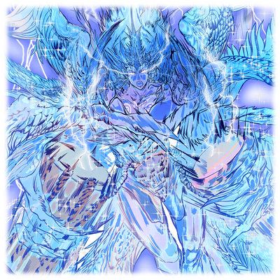

# 梅利姆

| 角色信息   |  |
| ----------- | ----------- |
名称|梅利姆
年龄|242岁
身份|长寿种
职业|被称作“魔女”的研究者
| 对应曲   |ピュグマリオンの咒文 |
| 对应版本 | Chunithm NEW

## Episode 1 被称作魔女的存在

>那些与我们并行，并不存在于此的世界……在那里一定存在着能够拯救我们的答案。

曾经有个种族被称作“长寿种”。

这个种族尽出聪明绝顶抑或武力过人的奇才，然而，除了那对特别的双耳之外，他们和普通的人类样貌别无二致。

他们与人类最大的不同，只有一个。

那就是极长的寿命。

与数十年就衰老死去的人类不同，身为长寿种的他们，寿命却能轻松超过两百年。

人们对于这些轻易就能跨越几个世代的种族，要么为之惊叹，要么为之羡慕，要么为之崇拜——

 

要么为之忌讳。

 

无数人梦寐以求的，绝不会消耗殆尽的生命。

人们对长寿种的憧憬渐渐变成了嫉妒，那些“并未拥有”的人们便开始迫害那些长寿种。人们声称，长寿种，是模仿成人类形态的超常种族。

在不同的时代和地点，长寿种被人们以“怪物”或“妖魔”等各种各样的名字所恐惧，不知不觉中，我也被他们称作——“魔女”。

据说，魔女隐居于人迹罕至的森林中，研究并操控着奇异的魔法。

我倒是接受了这个称呼。

因为，相比较我正在做的事情，被人说是“研究奇异的魔法”还更方便。

误解滋生更多的误解，而被杀害的同胞。

至今仍在各地持续遭受迫害，陷于水火之中的同胞。

为什么我们仅仅因为寿命较长，就要遭受如此悲惨的命运？

一心想要拯救同胞的我，思考着，思考着，花费了数十年的时间不断思考着，终于领悟到了答案。

仅凭这个世界的法则，我们是无法得到拯救的。

而那拯救我等的答案也不在这个世界，而在另一个世界。

为了穿梭于时空，并且连通我们生活的这个世界与那可能存在的“另一个世界”，我认为所有运动作用的原点——振动，也就是“音之力量”才是其中的关键。就这样，我在人迹罕至的森林中隐居，研究着人们所说的“奇异魔法”。

而这，就是我与某位人类共同创造出来的“音之力量”以及与之相关的故事——。

## Episode 2 梅利姆的研究日志

>这个只是给自己做的记录，我并不打算留给别人看。

**――梅利姆的研究日志・第1297号。**

自从开始闭关在这个研究室以来，已经过去了多少天呢？

作为长寿种，并且不与人类交流的我来说，历法这种概念毫无必要，但若无法把握时间的长短确实会很不方便。那么，从今以后就开始记录吧。

实验……依旧不太顺利。

曾经有一段时间看起来顺风顺水，但最近却反而退回到了初期阶段。

为什么会这样？是不是我的基础理论有误？如果是这样的话，那我不就还要再浪费更多的时间去研究才行吗？

……不，我不能就这么气馁。

我绝对不会放弃。我一定要找到超越世界的力量——那无人听闻过的音之能量。

如果是为了这个目标，……即便失去一切，我也心甘情愿。

 

**――梅利姆的研究日志・第1648号**

今天，我的研究取得了惊人的成果。

过去的我太过拘泥于“声音的形状”。在测量仪器上显示的，如波浪般起伏的波形，明明已经目睹了多少次，却未曾意识到一件事。

声音不仅仅是拥有形状，也拥有节奏。

只要配合“这个世界的声音”的节奏，再与另一个相位的声音相碰撞的话，就能观测到时空的微小扭曲。

我的理论并没有错。

但是，观测到的扭曲真的非常非常微小。

必须要用更大更强的声音去碰撞，但我没有这样的手段。

如果有能产生强烈声音的装置就好了……但是，难道要从现在开始制作吗？要怎么做？又要花费长时间进行研究吗？

不，现在这样还节外生枝可不行，更何况就我一人根本难以完成。

如果……这个世界有什么可以替代的东西就好了……。

## Episode 3 炼金术师的少女

>我对她的技术非常感兴趣……当然，我“只”对技术感兴趣，真的。

在郁郁葱葱、人迹罕至的森林深处。

有一片不自然地开阔出来的平地，梅利姆的宅邸——兼研究室就坐落于此。

 

从宅邸中会时不时的传出刺耳的高音抑或是震撼大地的低音，虽然这些声音算不上多悦耳，但在这无人涉足的森林中，即便发出这样的噪音也不会有人察觉。

从前一天晚上，梅利姆就开始通宵进行着实验，而此刻，她正在复盘着大概总计第三万次实验的失败。

自从梅利姆开始研究以来，已经过去了五十年。

“这个也不行。又得从假设重新开始……这次大概要把进度倒退回十年前吧？”

 

梅利姆喃喃自语着，露出了个自嘲般的微笑。

就在这时，与之前的噪音不同，一个有些滑稽的声音冒了出来。

随着“咕噜——”一声响起，梅利姆的肚子发出了响亮的抗议声。

注意到自己饿了，同时储备的食物也已经耗尽的梅利姆，决定久违地外出去采集食物。

这片森林中到处都是可以食用的花草和树果，而即使是没有多少体力的梅利姆，也至少能搞到兔子之类的小动物作为食粮。

戴上一顶与身体不相称的大帽子，梅利姆带上了弓箭和篮子，还有足够一人份的食物后，摇摇晃晃地走向了森林中的草原地带。一走到那里，她就仰面躺在了草地上。

 

“稍、稍微休息一下吧……虽然应该也有肚子饿了的缘故，不过果然还是呆房间里太久，缺乏运动了吧……”

 

温和的阳光，轻柔的微风。

对于每天都在研究室过着黑白颠倒的生活的梅利姆来说，这简直就是对于所有活在地上的生物所能感觉到的，最上等的治愈。

不消片刻，她的思维开始变得迟钝，眼皮也开始沉重起来。

梅利姆完全放松了警惕。

“呐！”

 

突然，一个声音从头顶上方传来，吓得梅利姆一个机灵坐了起来。

虽然身体条件反射般地行动了，但头脑还没跟上现在的状况。还需要片刻，梅利姆才能恢复正常思考。

 

——是谁！？为什么！？是我太疏忽了吗！

糟糕……糟糕了……被人看到了……！

 

梅利姆的脑海中闪过了那些被人类迫害的长寿种同胞们的身影。

梅利姆之所以在森林中生活，一方面是因为实验中会不可避免地会发出怪声引人耳目，但最主要的目的，还是为了不被人发现。

当然，她并没有完全隐藏自己的存在。但是，即使在最临近的城镇中，人们对这片地方也是只有“森林中住着魔女”这样的，童话般的认识。

梅利姆内心恐慌，她已经不记得上一次与人类对峙是什么时候了。

然而，站在眼前的少女的眼中却闪烁着好奇的光芒，饶有兴趣地窥视着梅利姆的脸。

 

“魔女……是魔女啊！你是魔女吧！？哇！是货真价实的魔女！”

“！？不、不是！我不是魔女……”

“可是我在镇上从没见过你，而且那顶大帽子……和童话里的魔女一样！”

“这、这是……”

 

梅利姆慌忙用双手按住帽檐，脸上露出尴尬的表情。

那些曾经见过梅利姆的少数人将她的特征口口相传，不知何时，她一直戴着的那顶帽子似乎已经成为了她的标志。

意识到这一事实的梅利姆，立刻感到了一阵羞耻，她背对少女，头也不回地向着森林走去。

 

——不妙！我的事情似乎传播得比我想象的还要广……！

……算了。反正，魔女基本上都是被恐惧着的存在。只要我甩掉她的话，就不会再见面了……

 

“魔女小姐！等等我！”

 

人类会迫害这些长寿种的主要原因，正是由恐惧所转化而来的恶意。

然而，这名少女的脸上却没有一丝恐惧，而是挂着无忧无虑的笑容紧随其后。

面对这无法理解的行动，梅利姆反而感到了恐惧。

 

——为、为什么要追我！？

而且……她、她在笑！好可怕……那孩子好可怕！

 

梅利姆快步在森林中行走，试图甩掉少女，但面对体力更胜一筹的少女，梅利姆最终也只能败下阵来。

不顾暴露住所的风险，梅利姆冲进自己的宅邸锁上了门，然后瘫坐在门前。

稍后，敲门声响起。

 

“魔女小姐！你的家真漂亮！”

“噫，噫噫！”

“我只是想和魔女小姐聊聊天！”

“回、回去！我不是什么魔女，也没什么好说的！”

“诶——，是吓到你了吗……那我下次再来吧！魔女小姐！”

 

少女隔着门留下了这句话，然后离开了宅邸。

之后，少女如她所说的那样，每天都来到这里。

日复一日，从未缺席。

 

每天都被敲门，并且伴随着“魔女小姐”的呼声让梅利姆感到无比厌烦。

更不用说，这间屋子的位置被人知道了，可以说是最不想见到的情况。

但是，带着大量的研究工具搬迁需要大量的劳力，而被称为魔女的梅利姆，倒也确实对魔法有些心得，有个万一的话确实会对人类造成危害。

考虑到这一点，梅利姆选择继续观察一阵子。

 

这样的日常持续了一阵子。

某天，再次意识到家中已经耗尽食材，自己也饥肠辘辘的梅利姆，决定外出采集食物。

她缓缓地推开门，仔细确认着周围的情况。确认完周围没有人后，才踏出屋子的大门。

但这一天，梅利姆却做出了错误的判断。

在研究“音之力量”方面，梅利姆确实是倾注了所有的心血，但这也意味着她在别的地方漠不关心。

这也包括她的身体状况。

空腹许久的梅利姆的身体早已越过了极限，随着她紧绷的精神放松的瞬间，她也慢慢地倒在了地上。

在逐渐模糊的意识中，梅利姆回忆起了遥远的过去。

回忆起了那些早已音信不明的同伴们的模样。

 

耳边传来了咔嗒咔嗒的作业声，还有一股刺激鼻子的香味。

在意识到这些东西的同时，梅利姆睁开了眼睛。

熟悉的实验室。熟悉的床上。

唯一不同的是，那个少女正站在厨房里。

 

“啊，你醒了？”

 

梅利姆试图坐起来，但身体动弹不得。

 

“等等，别动！你刚才才晕了过去，可不能乱动啊！”

 

少女这样说着，走到梅利姆身边，递给她一碗金色的汤。

虽然动弹不得，但梅利姆仍未放松警惕。看着这样的她，少女苦笑着说到。

 

“放心吧，没有毒。赶紧喝了它恢复下体力吧，好吗？”

 

对于刚刚才饿晕过去的梅利姆来说，这是再正确不过的提议了。

更重要的是，那股刺激至鼻腔深处的诱人香味让她无法抗拒。梅利姆小心翼翼地喝了一口汤。

 

“……好喝。”

 

梅利姆不由自主地发出了赞叹。

由于埋头于研究工作，梅利姆几乎都是直接按着原材料的样子不经处理地吃下去的。然而，当这碗温暖的汤填满了她的胃的时候，她心中的防线也开始融化，喝完之后，她甚至开始认为少女“可能不是坏人”。

“还真是厉害的屋子。到处都是我没见过的机器。这些工具是用来做什么的？”

“……研究用的。我在进行关于‘音之力量’的研究。”

“音之力量……？”

 

梅利姆简要地讲述了她的目的，即研究如何将振动——即“音之力量”——转化为足以影响其他事物的强大力量。

听了之后，少女喃喃说着“音的力量啊”站了起来，从她的包里拿出了某样东西。

 

“我也在研究‘声音’。这是我做的道具……让你听一听也许能更快理解呢。”

 

说着，她将一根类似弓的工具贴到了几条被绷紧的弦上。

随着少女拉动弓弦，迄今为止从未听过的音色在实验室中响起。

弓与弦的摩擦所形成的微小震动被轻易地放大，形成响亮的声音。

梅利姆睁大眼睛，目不转睛地看着、仔细聆听着那东西的声音。她急忙从床上坐起身来，急切地问着少女。

 

“这、这是什么东西……！？”

“这个啊，是我做的，被叫做‘乐器’的东西。我就是利用它发出像刚才那样的声音……啊，应该叫‘演奏’才对。我现在就是在研究与之相关的东西。”

“还、还请详细告诉我！”

“当然可以！但在此之前……”

 

少女向梅利姆伸出手，继续说道。

 

“我是莉塔。莉塔·卡尔斯迪特。15岁。是一名炼金术士哦。我问你，你愿意和我做个朋友吗？”

 

梅利姆一时不知所措，但还是怯生生地伸出手，握住了莉塔的手。

 

“我是……梅利姆。是被你们……称作‘魔女’的存在。”

## Episode 4 第一次“与谁一起”

>一同欢笑，一同生气。这真是奇妙的感觉。在这之前，我从来都没这么想过我居然也会有这么一天。

追寻声音力量的二人发现，她们之间的研究竟然拥有着许多共通点，本来只是互相交换意见的二人，很快就发展成了共同研究的关系。

 

“莉塔，准备好了吗？接下来要同时发出声音，观察它们碰撞的反应。”

“好的，梅利姆！我随时都可以！”

“这个实验最重要的是时机。可别出岔子啊。”

“没问题！数到三就行了吧！”

“是的。那么，开始吧。一、二……”

“二，三！”

“二！”

 

随着那明显慢了一拍的声音响起的瞬间。

刺耳的噪音回荡开来，将研究室内的玻璃窗和各种玻璃制的器具都震了个粉碎。

就在两人还因为这突如其来的状况不知所措的时候，两人手上的装置也先后发生了爆炸。

 

“……喂！不是说要同时的吗！”

“啊，我同步了呀。一、二、“三”嘛。”

“通常说‘一、二、三’的时候，是在‘三’的时候同步的吧！”

“诶！？在我的家乡明明是这样的啊！”

 

两人你一言我一语地吵了起来。但对于她们来说，这已经是家常便饭的事情了。

尽管性格不同，但两人却意外地合拍，虽然经常吵架，但从不记仇。

只要过个几分钟，她们就会忘了刚才的事情，又笑着继续实验。

这就是梅利姆和莉塔独属于两人的节奏。

 

“呐，梅利姆。你说下一个实验就要进入全新的阶段，那会是什么样的？”

 

莉塔一边用扫帚清理地上散落的玻璃碎片，一边问道。

梅利姆一边从爆炸的装置中挑选可以再利用的零件，一边回答。

 

“接下来……是将声音转化为语言的实验。”

 

据梅利姆说，下一个实验的目的，是给“声音”本身赋予如‘A’‘B’‘C’这样的语言，并进行转换。

然后将它们像程序一样组合起来，从而任意操控“声音的力量”。

而这个想法，是从莉塔带来的“演奏”这一概念中得到的灵感。

 

“原来如此……将声音转化为自由的语言……嗯，听起来就很有趣！好嘞，我有干劲啦！”

 

莉塔一边说着，高兴地挥舞着扫帚。

梅利姆看着她的样子，想起了过去的自己。

曾经，梅利姆独自一人进行研究的时侯，老实说，成果并不理想。正因如此，她才花了数十年的心血于其中。

想要为同伴们出一份力，然而事情却并不如她所愿。

在这样的日子里，不知何时，梅利姆的心也渐渐变得干涸。

但现在不同了。

随着梅利姆每天与炼金术士莉塔交流意见，不断尝试新的想法。

研究的进展简直突飞猛进，甚至很快就到达了准备操纵“音之力量”的阶段。

梅利姆为这美妙的日常纯粹地感到“有趣”。

另一方面，在那娇小的背影中，也能看到她对那些仍在水火之中的同伴们的愧疚。

## Episode 5 胆小的魔女

>我并不是这个意思……但是，我不知道应该怎么做才好……

“B……B……C……E～～……D！”

 

莉塔一边哼唱着音阶，一边拨弄着她自制的乐器。

随着实验告一段落，梅丽姆也坐到一旁歇了下来。她一手端着刚泡好的茶，一边愉快地观看着莉塔的表演。

 

“嗯，听起来有点曲子的感觉了。真不可思议啊……声音竟然还有这样的利用方法。”

“嘿嘿～对吧？”

 

研究与实验，以及朋友间的闲聊。

如此平常的景象，平常的时光。

然而，打破这“平常”的，却是莉塔的一句话。

 

“梅丽姆，你不是说过想要把声音的力量用在更重要的事情上吗？你想用那力量做什么呢？”

 

莉塔直率地向梅丽姆问着。

莉塔自己并没有特别在意这句话，在旁人看来，这只是一句自然而随意的话。

然而，尽管两人一起进行了长时间的研究，然而这却是第一次像这样提出触及根本的问题。

梅丽姆的出身与经历可以说充满了悲惨，自然不是什么能够欣然谈论的话题。

尊重他人感受的莉塔，即便两人的距离拉近了，也从未轻易踏入梅丽姆内心深处最脆弱的一块，直到现在为止也从未问起。

但是，研究已接近尾声。

如果一切顺利，很快就能揭开“音之力量”的奥秘。

研究即将大功告成。但这之后呢？

从道理上讲，不问反而显得“不自然”。

 

“……莉塔你呢？”

 

梅丽姆没有回答，而是回问了莉塔。

看来梅丽姆还没有足够的勇气去坦白这一切。

 

“嗯……你这么说的话，还真是有点难回答呢……嗯，我的话，和之前应该差不多吧！当我用乐器演奏音乐的时候，大家都会露出笑容，并且被治愈。我希望更多的人能了解这种力量。所以，我才想更深入了解‘音之力量’。仅此而已！”

“……这样啊。”

 

莉塔的回答，梅丽姆很容易就能料到。

因为梅丽姆每天面对的，都是莉塔那美丽的笑容。从她的表情中看不到一丝阴霾。

不如说恰恰相反，莉塔的笑容简直如清澈流水般洁净，甚至有些过于耀眼，让人无法直视。

因此，梅丽姆明白，莉塔每天挂在嘴边的“想用音乐让大家开心”就是她最真切的想法。

 

“我啊……”

 

这次轮到梅丽姆讲述自己的目标了。

毕竟莉塔已经说出了自己的目的，那么自己也没有理由拒绝了。

这就像是给自己一个拒绝不了的场合，不在这里说就不行的样子。

梅丽姆下定了决心。她摘下头上的大帽子，撩起头发。

 

“看这双耳朵。其实，我是被称作‘长寿种’的种族。”

“嗯，我知道。”

“……果然。你应该已经早就注意到了。毕竟我在这座森林里已经被人称作‘魔女’很久了。”

“不不……不如说，我们都在一起这么久了，要是没发现才奇怪呢！”

“……那倒也是。”

 

两人笑了一阵后，梅丽姆开始讲述自己的故事。

身为长寿种被人迫害的历史、作为异类存在于这个世界的违和感、声音的力量、还有另一个世界。

在她的口中，几十年，几百年的思绪倾盆而出。

每当吐露出一段深藏已久的思绪，梅丽姆都感到内心沉淀着的某些东西仿佛开始流逝而去。

 

“如果要帮助同胞们……还有解开我们来自何处的谜团，我必须前往那另一个世界。另一个与这个世界并行的世界……我想要的，是自由穿梭于那个世界的力量。为此，我才开始研究足以跨越时空的音之力量……这就是我活着的理由。”

 

过去、现在、未来。

倾诉完毕后，梅丽姆感到一种莫名的轻松，而莉塔却意外地露出了困扰的表情。

 

“梅丽姆，谢谢你告诉我这些。不过，有件事让我有些在意。”

“是什么？”

“即使能去另一个世界，我们也不知道那里是什么样子吧？如果那是个非常危险的地方呢？甚至可能是人类无法生存的地方的话……”

“我不在乎。”

 

梅丽姆毫不犹豫地回答，并说道：“只要能继续前进的话，就算我会变成怎样，都无所谓。”

听到这话，莉塔这次明显露出了愤怒的表情。

 

“这是不对的！为了帮助同伴，竟然连自己的生命都不顾什么的……这肯定有问题啊！”

 

曾经，梅丽姆因饥饿而倒下，这便可以看出她对“自己”的漠不关心。这并不是什么鲁莽，而是梅丽姆的价值观的真实体现。

莉塔愤怒地质问着，笨拙地表达着自己的想法。

即使了解了梅丽姆的背景，她也无法完全理解。这与种族什么的无关，只是——人终究无法替代他人。无论是身体还是心灵。

对莉塔来说，她最珍视的不是其他长寿种，而是梅丽姆本人。这是理所当然的。

 

而梅丽姆在听到莉塔的话后，先是感到了惊讶，随后表现出的，是更出离的愤怒。

听着莉塔的话，对于梅丽姆来说，这番话相当于否定了自己的全部。

当然，莉塔的本意并非如此。然而这出于对朋友的关心的话语，对于长期独自生活的梅丽姆来说，也许过于沉重了。

梅丽姆，也同样是个笨拙得令人心疼的人。

两人的主张宛如一对平行线般毫无焦点，最终演变成了一场只会伤害彼此的争吵。

 

“莉塔你是不会懂的！就凭……就凭这种天真的想法去研究声音的力量的你，怎么能明白我的想法！”

 

话语从梅丽姆口中脱口而出。

这并不是她的真心话。她只是一时激动，说出了这番气话。

但这句话带来的伤害是巨大的。

莉塔的眼神瞬间变得前所未有的黯淡，失去了光彩。接着，她就默默地离开了研究室。

 

“莉塔……！”

 

即便喊着，梅丽姆也无法追上去。

一直以来，她固执地避免与人类接触的理由，不仅仅因为她是长寿种。

还是因为梅丽姆比任何人都还要——胆小。

## Episode 6 为了解开所有的谜团

>要是连这个都被否定的话，那就等同于我自己否定了自己了。

迄今为止，两人的争吵与其说叫争吵，不如说是拌嘴子。只要数刻钟过后，她们就会忘掉才发生过的争吵，继续工作。

正因为如此，现在的梅利姆难掩自己内心中的不安。

莉塔——已经整整三天没有来宅邸了。

这是自从那天两人在森林中相遇以来，第一次出现如此长时间的间隔。

 

不知道之后该怎么做的梅利姆，正托着腮，坐在研究室的大桌子旁，。

目前的研究成果几乎都是两人合作的产物。只靠她一个人也无法推进研究，而现在的她，也没有这个心情继续。

梅利姆叹了口气，无聊地摆弄着桌上的摆球。

那是两人共同制作的用于超越维度的装置的开关。

虽然还不完善，但应该能产生相对的效应吧。

剩下的就是付诸实践了。然而，就在这个节骨眼上，梅利姆却与重要的伙伴发生了争执。

在这各种因素的影响下，梅利姆开了个小差。

就在梅利姆慢慢将摆球放回原位时，她的手滑了一下。

摆球撞上了与之配对的另一个摆球，球体在无视物理法则的情况下，反复碰撞，划出的弧线越来越大。

 

“啊，啊啊……！”

 

尽管她焦急万分，但已经无能为力了。

摆球产生的能量传递到下一个装置，那个装置又将力量传递到下一个装置。

发生连锁反应的装置将能量扩散到了围绕研究室布置的各种乐器，它们开始以巨大的音量奏出奇异的旋律。

 

“这，这下该怎么办啊！？”

 

面对已经完全启动的装置，梅利姆束手无策，无数乐器奏出的声音——即振动，正以复杂的形式交织在一起，空气的震动得让人皮肤发麻，最终形成了足以扭曲视线的巨大能量。

梅利姆茫然地看着这一切。此刻，她的脑海中已经没有莉塔抑或是同伴们的身影。

取而代之的，只有“实验成功的喜悦”。

就在这时。

研究室中心扭曲的空间像剥开柑橘皮一样翻卷起来。

 

“这就是……另一边的时空”

 

梅利姆喃喃自语。从结果来看，她是对的。

这翻腾着的振动“内部”展现出的，是一片本不该存在于这里的风景。

 

“如果……能‘前往’这个另一边的世界，或许能发现什么。”

 

梅利姆一直这样相信着。

但，她却从未考虑过另一种可能性。

 

仿佛强行撕裂并扩大尺寸不匹配的时空裂缝一般。

那东西——来了。

从裂缝中伸出了一只手臂，还有另一只手臂，接着是头部，然后是身体。

巨大的身躯缓缓扭动，几乎要将梅利姆的宅邸掀翻一般。

它仿佛从炼狱中爬出，身披沉重的火焰——不，就像是火焰本身仿佛拥有了质量，一般，眼前的东西形成了用火焰组成的巨体。

它散发着暗沉而钝重的光芒，对着被震慑的梅利姆张开了嘴。

『……原来如此。吾确实察觉到了有人在干涉，但没想到竟然会触及到这般地步。』

“你……到底是……”

『提问的人是吾。你难道不想知道这个世界的秘密吗？由你创造出的那种声音的力量。如果你将它交给吾，吾便会告诉你一切。当然，要借助吾之力量也未尝不可。』

世界的秘密。世界的一切。这些听起来荒诞不经的话。

然而，眼前的巨体却散发着一股恐惧和神性。

它似乎不属于这个世界，但梅利姆能感受到一种与魔力相似的强大力量。

长年以来苦苦追求的“世界的一切”对于梅利姆来说，实在是无法抗拒的诱惑。

 

“……我明白了。这声音的力量，以及我的存在……就献给您吧。”

## Episode 7 不要用那样的眼神看我

>不要用那样的表情……不要那样看着我……因为那不是面对“朋友”应有的表情啊！

梅莉姆的意识陷入了模糊不清之中。

现在的她，正处于半梦半醒的状态。

然而，她并未感到疲惫。相反，她感觉到了一股几乎要喷涌而出的生命力量。

回过神来，梅莉姆已经与火焰巨体共享了意识。

既是梅莉姆，却又不是梅莉姆的存在。而这正是她与火焰的巨人签订契约、成为傀儡的证明，但此刻的她并未察觉这一点。

她只是感受到了一股巨大的力量，以及一种不可思议的、从心底涌出的“愤怒”情绪，正逐渐充满她的全身。

 

“就是这里！果然有魔女在这里啊！！”

 

突然，周围响起了陌生的人们的声音。

那声音并非来自一个人，而是一大群人，他们手持各式武器，与梅莉姆对峙。

“为什么这里会……？” “知道这里的应该只有莉塔才对”。

她心中想要相信的念头瞬间消失，梅莉姆很快得出了一个答案。

 

“啊……果然是这样啊……”

 

心中留下的，只有深深的失望。以及愤怒。

她真正理解了那些被迫害的同伴们的心情。

 

“原来如此……大家，当时就是这样想的啊……我竟然就这样相信了人类，真是太愚蠢了。”

 

就在梅莉姆陷入虚脱之际，面对火焰巨人的人类们，为了掩盖恐惧，大声呐喊着，试图给自己壮胆。

“魔女在使用奇怪的魔法！在她搞出什么之前，我们必须消灭她！！”

“哦——！！”

面对手持武器冲过来的人们，梅莉姆——或者说火焰的巨人，向着他们轻轻挥动了手臂。

瞬间，火焰席卷而起，将人类们，甚至他们身后的森林，都吞噬殆尽。

面对这突如其来的地狱景象，人们瞬间失语，随即而来的，是恐惧和惨叫声。

 

（好厉害……这股力量……是来自我的吗？）

 

梅莉姆为自己能够掌握足以决定他人生死的力量而感到兴奋。

这是这个世界无法解释的、超越人类认知的力量。而这股力量正来自时空的彼端。自己的研究果然是正确的。

接着，梅莉姆想起了那些悲惨死去的……以及至今仍在水火之中的同伴们，她缓缓地、一步一步地向前走去。

朝着人类们逃去的方向，朝着森林另一边的城镇而去。

与火焰巨体融合后，心中的怒火无尽地膨胀，彻底支配了她的内心。

但梅莉姆并未对此感到困惑，也没有试图压制它。

她只是任由情绪驱使着，挥舞着力量。她的脑海中只剩下这个念头。

 

很快，火焰的巨人穿过了森林，来到了城镇的边缘。

从眼前这片荒凉的街道，已经能够见到城镇的模样。

然而，却有一个人挡在了梅莉姆面前，那是莉塔。

 

“梅莉姆……”

“……让开，莉塔。你想死吗？”

“我不会死的。而且，我要把梅莉姆带回来。”

“……！？你哪来的口气……！！”

梅莉姆只是挥动手臂，莉塔就像是纸片一样被吹飞了。

街道上烧出了一条歪歪曲曲的火焰通路，然而莉塔的身体却没有一点火光。

尽管被愤怒支配，胆小的梅莉姆也无法杀死她人生中的第一个朋友。

 

面对这超乎寻常的力量，莉塔明白，仅凭意志是无法改变眼前的现状的。然而，即便跪倒在地，也只是撑着颤抖的身躯，用那双眼睛紧紧盯着梅莉姆。

梅莉姆看到莉塔的样子，心中突然感到一阵刺痛。

 

——不要这样。不要让我看到这幅样子。不要……不要用那样的眼神看着我！

 

尽管仍旧颤抖着，莉塔的眼中却浮现出斗志的光芒。

那是梅莉姆从未见过的眼神。

如果让眼前的这番景象只会让自己更加痛苦的话，那就只能从她眼前消失了。

就在梅莉姆下定决心的这个瞬间。

 

『……！？这股气息是……！可恶啊！……竟然追着吾等来到这里了吗！！！』

 

火焰的巨人刚说完，梅莉姆曾经居住的森林深处突然闪过一道光，紧接着，强烈的光芒染白了眼前的一切，夺走了她的视野。

她努力抵抗着刺眼的光芒，缓缓睁开眼睛，发现一个手掌大小的光团漂浮在莉塔身旁。

她听不清他们在说什么。只是看到莉塔说了几句话，点了点头，随后一股强大的力量包裹住了莉塔。

当梅莉姆意识到时，莉塔已经站了起来，与她面对面。

莉塔的身后，同样背负着一位陌生的神明。

## Episode 8 遥远而光明的日子

>那时候真是开心啊……不管是演奏，还是唱歌，还是料理也好。曾经与你留下的这些东西，现在就让我忘却掉吧……

直到刚才为止……我还和她在一起……一同欢笑的……

那眼前的这幅光景，究竟是怎么回事？为什么会变成这样？

到底是哪里做错了呢……我已经搞不明白了……

明明……我只是为了完成我的夙愿而已……

 

对了……我应当完成的夙愿……

只要不再迷失这一目标的话，在这前方应该就不会再做错什么了吧……

 

……？

您说……“现在并不是舍弃力量的时候”吗……是……我明白了。

那就在这里先行撤退吧……我的夙愿仍未完成……若是为了达成愿望的话，不管哪里我都会跟随而去的……即便，要我深入奈落深渊的炼狱之中……

 

再见了，莉塔——