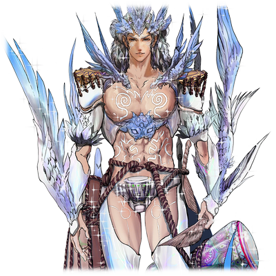

# 莉塔·卡尔斯迪特

![rita.png][1]

| 角色信息   |  |
| ----------- | ----------- |
名称|莉塔·卡尔斯迪特
年龄|15岁
职业|炼金术师、发明家
| 对应曲   |創世のコンツェルティーナ |
| 对应版本 | Chunithm NEW

## Episode 1 那是，曾经有过的文明

>好厉害……以前竟然有这么有趣的东西！我决定了！我要好好研究这些东西，让大家都幸福！

在这世上，总有一群人是渴望着什么东西而活着的。

换句话说，他们正是“没有”，才会如此地渴望着什么东西。

那些东西可以是财富、名声，抑或是爱。或者更为高尚之物。

他们把那些追求的东西称之为“梦想”，怀抱于胸，不断追寻着。

他们一心一意，他们不顾一切。

甚至有的时候怀揣着足以疯狂的热情。

正因如此，人类有时既能成为希望，也能成为绝望——

 

在山脚下，有一个既不繁华也不萧条，在这个国家里也只是不大不小的、毫无特色的城镇。

我在那里出生并长大。

不管是游戏还是学习什么的，我都没有表现出特别的兴趣，平时也只是最低限度地应付一下。

因为我有更加让我着迷的东西。

 

那就是，“用这双手创造出什么东西”。

从用积木搭建房子开始，我凭着这样的直觉，深入了解科学，掌握理论，最终发展到能够做出让全镇人惊叹的工具的地步。

不知不觉中，我成为了一名炼金术师——我也被镇上的人们冠以发明家的称呼。

 

作为商人的父亲从各地买来材料，我则将这些材料组合起来，不断发明新的东西。作为炼金术师的生活也逐渐步入正轨，我就过着无忧无虑的日子。

但是，我却陷入了困境。

所谓的发明，也不过是改良或进化一些生活用品，很快就会碰到瓶颈的。

而我相信，我还能做的不止这些。

虽然我坚信着点，但是我却找不到任何灵感，只是这样虚度着光阴。

 

父亲买回来的不仅只有材料。还有来自世界各地的书籍，这些书籍，全部都塞在一间用书房来形容都过于宽敞的房间里。

某天，我在那个书房里找到了一本书。

这是一位研究古代人类生活的考古学家的书。

在介绍衣食住等生活方式的这本书中，我找到了一段特别有趣的内容，让我目不转睛。

那段内容，描述的是名为演奏的“演奏”某样活动。

据书中所述，这是一种将工具组合在一起，利用发出的声音叠加起来并且有机结合，以此作为娱乐的活动。

 

——将声音叠加起来？以此娱乐？

这样的娱乐方式在这个世界里闻所未闻，见所未见。

仅仅通过文字阅读也无法从中感觉到是什么景象的我，却被这字里行间的描述深深吸引了。

从这一天起，我开始了我的新研究。

我相信，在这项研究的尽头，将会诞生某种幸福的东西。

 

而这，就是某位魔女与我共同创造出来的，关于“音之力量”的故事——

## Episode 2 魔女，竟是可爱的女孩子

>我见到了真正的魔女！一点都不可怕，反而还有点可爱。我想和她成为朋友！

对莉塔而言，研究并不只是窝在房间里闭门造车。

她会出门四处探索，同时，也会在日常中寻找能够学习的东西。

从巨大的果皮、到紧绷的晾衣绳，再到洞穴中回荡的声音，莉塔从各种各样的事物中汲取灵感，并将这些发现带回家中，反复实验。

她甚至半途抛下了作为炼金术师的工作，全身心投入到这项研究中。经过数年的努力，研究终于开始结出果实，她成功发明了一种名为“乐器”的工具。

然而，研究并未就此结束。因为“乐器”终究只是“演奏”的工具。

声音有高低之分，还需要让这些声音能互相共鸣。

还需要制定节拍，将声音之间融为有规律的整体。

然后是调整各自的速度，让不同的声音有机结合起来。

依靠那本书中仅存的描述，莉塔结合自己的理解，不断进行尝试和摸索。

 

“嗯……大概就是这样吧？”

 

坐在家中的工房里，莉塔演奏着自制的乐器。

最初莉塔只能演奏出“咚锵咚锵”这样的简单而原始的声音，渐渐地演变成了可以被称为“曲子”的作品。

到了这个时候，对这个神秘的声音开始产生兴趣的镇民们，纷纷来到了工房面前。

 

“哦，莉塔啊。你最近一直在捣鼓的东西到底是什么啊？”

“啊，难道说感兴趣吗？那不如来听听看吧！”

 

莉塔抱着最近完成的自信之作——一种全新的“乐器”，走到聚集的人群前。

这是一个用绳子拉直绷紧架成几根弦的木制箱子，上面开了几个用于放大声音的孔。

当莉塔开始弹奏和敲击它的时候，欢快的旋律立刻在空气中回响着。

或许这与书中的描述并不完全契合，由莉塔所还原的理解是否正确也无从得知。

但这一行为，确实可以称得上是“演奏”应有的模样了。

 

“这、这是什么……我的身体……竟然不由自主地动起来了！”

“是啊，真不可思议！感觉心情畅快了许多！”

 

不管是谁的脸上都露出了笑容，镇民们开始即兴跳起舞来，甚至有人开始哼唱起弹奏的旋律。

莉塔一边演奏，一边看着这幅光景，心中确信无疑。

这果然是能够给人带来幸福的东西。

这是一项绝不会为他人带来不幸的美妙发明——。

 

在一个晴朗的日子里，莉塔离开了小镇，走进了森林深处。

森林深处有危险的动物，还有人们无法解释的怪异生物，所以镇上的人通常不会靠近那里。

莉塔从小也被叮嘱禁止进入，但作为炼金术师，仅仅依赖父亲提供的材料是不够的。所以，她偶尔会偷偷来到这里，采集一些可能用于研究的东西。

 

这一天，莉塔的采集进展不如预期，于是便放下自己心中的约束，向着自己划分出去的危险区走出了第一部。

森林深处生长着许多她从未见过的植物，在不知不觉间，莉塔沉浸于其中，越走越深。

最终，当她来到了一片与这片森林环境极搭调的开阔草原时，才回过神来。

 

“哇……森林里居然还有这种地方啊……这阵风好舒服……”

 

眼前的低矮草丛正茂密生长着，连成一片一望无际的草原。

就在她全身心感受这片风景时，突然从视野的尽头瞥见了什么。

 

“嗯？那里是个人……在睡觉吗？”

 

这种地方怎么可能有人。

怀着这样的疑惑，莉塔蹑手蹑脚地靠近过去。

当她终于能看清那个身影的时候，她的心中不由得激动起来。

穿着并非这个国家风格的装束，还有一顶几乎遮住了她娇小的身躯的大帽子，那稚嫩的面容与危险的森林环境显得格格不入。

（……是、是魔女！）

 

只存在于童话世界中的居民——魔女。

但莉塔却莫名地确信，那个躺在草地上的女孩就是魔女。

一直以来忠于好奇心的莉塔，在这一刻，将所有应该警惕的可能性都抛到了九霄云外。

 

“魔女……是魔女啊！你是魔女吧！？哇！是货真价实的魔女！”

 

突然被叫醒的“魔女“被吓了一跳，猛地一激灵跳了起来。面对兴致勃勃靠近的莉塔，她反而露出了警惕的神情，向后退去。

然后，她一句话都没说，就转头逃向了森林深处。

 

“魔女小姐！等等我！”

 

传说中，魔女是使用诡异魔法、对人类怀有敌意的可憎存在。

印象中本该如此，但莉塔却未从眼前的这名少女中感觉到一丝恐怖。

虽然她的装束和帽子与童话中的描述一致，但这个“魔女”却有一个不同之处。

那就是——她并非是传说中阴森冷笑的老太婆，而是一个娇小可爱的女孩。

 

“我们一定能成为朋友的……”

 

莉塔低声自语着，随后追着魔女的脚步而去。

## Episode 3 单身，可是很寂寞的

>在我做了锅汤之后，终于愿意打开心扉了。虽然说是成为了朋友，但我怎么觉得像在喂小动物的样子？

莉塔追着少女最终来到的，是一座怎么看都不该存在于森林深处的，相当气派的宅邸。

少女像是逃跑般冲进了宅邸，莉塔则轻轻敲了敲门，试着呼唤她。

 

“魔女小姐——”

 

虽然莉塔这样呼唤着，但房间中的少女却只坚持着“我不是魔女”，并拒绝了莉塔的请求，希望她离开。

但莉塔没有放弃。

她相信总有一天少女会敞开心扉，于是从那天起，她每天都会前往那座宅邸。

每天登门拜访，隔着门单方面地交谈。

虽然少女没有回应，但确实可以感觉到宅邸里有人的气息。

仅凭这一点，莉塔就确信那天在草原上遇到的魔女并非什么幻觉。

 

某一天，莉塔像往常一样来到少女的宅邸前，突然发现大门敞开，而那名少女正倒在敞开的门边。

她慌忙跑过去，抱起了少女的身体。

 

“……嗯，没事。还有呼吸，也不像是发烧的样子。”

 

就在这时，少女的肚子发出了“咕噜噜噜～”的巨大声响。

莉塔会心一笑，似乎明白了些什么。她将轻得惊人的少女抱起来，带进了宅邸的床上。

似乎只是饿晕了的样子。既然如此，就必须让她吃点东西才行。

想到这里，莉塔环顾四周，开始探索起这间宅邸，试图找到厨房。

然后，她注意到了这座宅邸的异样。

虽然有一个小厨房，但里面的厨具和调味料都只有最低限度的东西，而且看起来不像是怎么用过的样子。

除此之外，屋子里几乎摆放的东西几乎没有任何生活感，只有一些陌生的机械和化学品随意散落各处。 

无论如何，这里都不像是一名少女应该生活的环境。

 

“难道说……就这样一个人住在这里吗？”

 

莉塔忍不住轻声问到。

虽然她知道每个人的价值观各有不同，但莉塔也是同样以研究为生的人。

这个房间给人一种淡淡的寂寥感，完全感受不到一点“快乐”的要素。

 

不久，少女醒了过来，莉塔将她在少女睡着时煮好的汤递了过去。

在莉塔安抚了一下满脸疑惑的少女之后，她慢慢喝起了汤。

 

“因为这间屋子里我找了半天都没找到什么吃的嘛。在路上我采摘了些野菜果然是对的！慢慢喝吧，不要刺激到胃哦。”

听着莉塔的话，少女没有回应。

但她没有停止喝汤的手，很快，她就将汤喝光了。

或许是眼前的人刚刚帮助了自己的缘故，她终于稍微敞开了心扉。少女初次与莉塔展开了对话。

少女与莉塔，讲述了自己一个人住在这里的事情。

还有她正在研究“音之力量”的事情。

听到少女的话，莉塔惊讶地站了起来。

 

“声音的力量！这也太巧了吧！”

 

虽然二人的切入点不同，但她们竟然都在进行与声音相关的研究。

莉塔兴奋地从包里拿出自制的乐器，演奏了一首自己最拿手的曲子。

她拨动琴弦，弹奏出美妙的音乐。

演奏时，她偷偷瞥了一眼少女，只见少女两眼放光，刚才苍白的脸色就仿佛从未存在过一般。她的眼中闪烁着光芒，直直地望向莉塔。

 

（果然……！乐器，演奏……是能为大家带来幸福的东西啊！）

 

炼金术师莉塔，就这样与魔女梅丽姆成为了“朋友”。

而这也是这个世界即将改变的要素终于凑齐的瞬间。

## Episode 4 那是，只属于我的秘密

>魔女会吃人？那只不过是迷信的说法罢了。我可是一清二楚，魔女其实是非常可爱又温柔的存在。

都在研究着“音之力量”的二人。

没有人率先提出，她们就这样自然而然地开始了共同实验。

莉塔每天都会前往梅莉姆的宅邸，交流着只有他们两人才能理解的语言，反复进行着实验。

时而欢笑，时而沮丧，偶尔也会争吵。然后又再次欢笑。

两人相互分享知识和技术，切磋琢磨，研究就在两人的努力下顺风顺水推进着。

虽然现在的莉塔还未能察觉，但毫无疑问，这段时间是她“人生中最美好的时刻”――。

 

这一天也是。结束完愉快的研究之后，莉塔在日落前离开了宅邸。

 

“B……B……C……原来如此，如果这样写的话，不仅是我，镇上的人们也能演奏了！果然梅莉姆的主意真是太棒了～！”

莉塔一边哼着歌作曲，一边愉快地踏上归途。然而，回到家，迎接她的却是眉头紧锁的家人。

 

“莉塔，你过来一下。”

“嗯？怎么了，母亲？”

“你……最近每天都去了森林对吧？”

“咦！？呃……到底是在说什么事情呢～？”

“别装傻了。我知道炼金术需要很多东西，都到这个地步了我也不多说什么。只是，你最好不要走太远，千万不要深入森林。”

“……为什么？”

“那里自古以来就传说有怪物或者魔女什么的，还会吃人。总之很危险，你千万不要闯进去。”

“好～”

 

莉塔敷衍地回答后，便回到了自己的房间。

 

――森林里有魔女。这是真的。因为我已经亲眼见到了。

但是，竟然说梅莉姆会吃人什么的！

啊～，真是的！

尽管拥有与同龄人无法比拟的知识，莉塔毕竟还是个青春期的少女。

只有自己知道的宝贵秘密。这让她的心潮澎湃，兴奋不已。

“森林的魔女并不可怕”这件事。

她还没有意识到，这是**只有她一个人知道的事实**。

  [1]: http://story.chunithm.top/usr/uploads/2025/02/2203868955.png

## Episode 5 不要，不要说出那样的话

>“自己变成怎么样都好”……这也太过分了。要是这样的话，那我又该何去何从呢……？

尽管两人共同进行研究，但目标并不完全相同。

莉塔以梅莉姆的知识和研究结果为参考，致力于开发新的乐器和演奏理论。

梅莉姆则借用莉塔开发的乐器，将其融入自己的研究中。

在这个过程中，如果彼此有不足之处，她们会互相帮助，形成一种互助的关系。

这种研究方式似乎非常适合两人，因此研究迅速取得了成果。

 

尤其是梅莉姆的研究，似乎即将迎来一个重要的里程碑。

察觉到这一点的莉塔，虽然心中有所疑惑，但一直未曾开口询问，直到现在才提出了那个问题。

 

――当这项研究告一段落后，你打算做什么？

 

梅莉姆似乎也感到了莉塔的疑问，面对她，梅莉姆开始讲述自己的一切。

提到自己属于被称为“长寿种”的，与人类完全不同的种族的事。

提到他们长期以来一直遭受迫害的事。

以及为了从这种痛苦中解脱，他们需要前往另一个世界的事。

 

“为此，我开始了足以跨越时空的强大音之力的研究……这就是我生存的全部意义。”

虽然莉塔对梅莉姆真诚的回答感到高兴，但心中却仍有一个疑问。

即使能够跨越时空前往另一个世界，那里的环境真的适合梅莉姆生存吗？

当然，目前没有人知道答案。无论是莉塔，还是梅莉姆自己。

因此，莉塔再次向梅莉姆提出了一个问题，假设最坏的情况发生，会怎么做。

梅莉姆如此回答：

 

――如果是为了同胞，我可以不惜献出自己的生命。

 

莉塔顿感脸颊发热。

为什么还说得出如此残酷的话？

我可不是为了这样的未来才一起研究的。

对梅莉姆的关心化作了愤怒，化作责备的话语从她口中迸发出来。

梅莉姆也为了让莉塔理解自己的立场，说的话越来越重。

渐渐地，争吵逐渐升级，超越了平常的斗嘴，演变成了一场激烈的口角。

最终，将这场争执推向最糟的结局的，是梅莉姆。

 

“莉塔你是不会懂的！就凭……就凭这种天真的想法去研究声音的力量的你，怎么能明白我的想法！”

 

这并非梅莉姆的本意，但这句话已经足以给莉塔的心致命的一击了。

莉塔一言不发，冲出了宅邸。

 

（竟然说我天真……原来梅莉姆一直就是这样看我的吗……说好要一起研究下去的。难道说，只有我一个人认为，我们之间是朋友的关系吗？）

她一边擦拭着不断涌出的泪水，一边在森林中奔跑。

呼吸逐渐变得急促，但她并没有停下脚步的意思。

跑啊，跑啊，跑啊。

莉塔的脸颊被泪水浸湿，眼睛哭得红肿。

当她回到镇上时，迎接她的，是脸上表情比以往更加严峻的家人们。

 

“哈……哈……大家，这是怎么了？”

“莉塔……你去了魔女那里，对吧？”

 

莉塔的身体猛地颤抖了一下。

她深入森林的事情不但已经暴露，她的母亲甚至还明确提到了“魔女”。

 

“为、为什么……”

“看来你确实被操纵了……”

“爸爸！？被操纵是什么意思！？”

“你不用担心了。你就暂时待在工房里吧。”

“等、等一下！为什么？为什么要我待在工房里！？”

 

对于每天都坚持去森林中的莉塔，有一个人，比任何人都要担心她。

那就是她的妹妹——梅格。一个比成年人更相信魔女存在、无法将童话当作玩笑话的纯真小女孩。

有一天，出于对姐姐的担心，梅格尾随莉塔进入了森林，并亲眼目睹了姐姐与魔女在森林深处会面的场景。

她不愿相信这一切，宁愿认为这是一场噩梦。

但她太年幼，无法将真相深埋心底。

她将真相告诉了父母，父母又告诉了镇上的领袖，消息迅速传遍了整个小镇。

“魔女正在盯上孩子们”的信息被迅速传播开来。

“在灾难发生之前，我们必须采取行动。”

就这样，镇民和卫兵们开始紧锣密鼓地准备。

 

与此同时，认为被魔女“操纵”着的莉塔被软禁起来，除了偶尔有人送来食物外，她无法离开工房，只能在工房里过着与软禁无异的生活。

 

“没想到梅莉姆的事情竟然被他们被知道了……但是，只要我老实待着的话，大家迟早都会忘记的吧……”

尽管她试图安慰自己，但心中总有一种不安的感觉。透过天窗，莉塔仰望着月亮。

她还太年轻，太天真。

她仍未知晓，人类在获得正当理由后，会展现出何等过剩而丑陋的暴力。

## Episode 6 现在，仍在持续犯错的我们

>我不知道现在究竟发生了什么……但是，我知道我现在应该要干什么。

就在莉塔被家人软禁了三天之后。

早晨，待在屋内的莉塔突然察觉，外面异常安静。

坐立于街口的工房本应人声鼎沸，但此刻却听不到任何喧嚣或人声，就像是整个城镇都陷入了沉寂一般。

这种前所未有的异常情况让莉塔感到不安，但她现在也只能静静等待。

 

几个小时后，打破这片诡异寂静的，是一群惊慌失措的男人们的喊叫声。

 

　
“怪物！怪物朝这边来了！大家快逃啊——！！”

 

听到呼喊声，原本躲在家中的女人和孩子们开始骚动起来，城镇陷入了一片混乱，仿佛之前的寂静从未存在过。

莉塔慌忙跑到工房门前，用力捶打着门板。

 

“快开门！谁快来开门啊！”

 

不久，一个男人注意到了她的呼喊，急忙从外面打开门闩，对莉塔喊道：

 

“莉塔，你也快逃吧！去森林深处猎杀魔女的那些人遇到了巨大的火焰怪物！那东西发怒了！要杀了我们！”

“猎杀魔女！？这是什么意思！？”

“你不是被魔女盯上了吗！？那个魔女盯上了镇上的孩子们！”

“她不可能做这种事！”

“哎呀，现在说这些都没用了！趁被追上之前赶紧逃跑吧！”

 

说完，男人慌慌张张地离开了这里。

莉塔站在原地，思绪纷乱。

 

（巨大的火焰怪物？从来没听说过……）

 

在她与梅莉姆的对话中也从未提到过火焰怪物。而且，她知道梅莉姆虽然懂得魔法，但她的魔法主要用于研究辅助，不可能召唤出如此巨大的存在。

然而，莉塔却莫名确信。

 

——是梅莉姆。

虽然不清楚具体经过，但那火焰怪物一定是梅莉姆吧。

这也意味着，她尽管遭到了那些人的追杀，但她还活着。

与梅莉姆的争吵似乎成了一切的导火索，在短短几天内，莉塔的日常生活就这样彻底崩塌。

眼下已经是一团乱麻，就算城镇恢复平静，也需要花很长时间，而且再也无法回到原来的样子。

同时还有另一件事——那就是梅莉姆。

虽然她还活着，但显然发生了某种巨大的变故。

 

——我到底是哪里做错了？

是吵架的时候吗？还是和梅莉姆说话的时候？

还是说，是更早以前……是我们人类的错？

 

莉塔自问自答着，然后摇了摇头，双手拍了拍自己的脸颊。

 

“现在不是想这些的时候，莉塔·卡尔斯特特！必须去救梅莉姆才行！！”

这么大喊着，她抓起工房里的一件乐器，飞奔了出去。

朝着与逃亡的人群截然相反的方向而去——

## Episode 7 世界，从遥远到更遥远

>梅莉姆，我现在终于有点明白了，为了重要的东西什么都可以置之不顾的心情——

莉塔穿过城镇，沿着街道奔跑了几分钟后，终于看到了梅莉姆的身影。

尽管距离还很远，但那巨大的身躯已经清晰可见。

燃烧的火焰让周围的景色变得模糊不清。
　
在在那火焰巨人的面前，梅莉姆的身体正悬浮在空中，仿佛成了那巨体的心脏。

 

即便莉塔和梅莉姆已经经历过无数超乎常理的事情，眼前的景象仍让她不禁屏住了呼吸。

这不是什么怪物，而是到达神之领域的存在。

意识到这一点时，莉塔想起了自己曾经说过的话。

 

“即使能去另一个世界，我们也不知道那里是什么样子吧？如果那是个非常危险的地方呢？甚至可能是人类无法生存的地方的话……”

 

——“那个”一定是从另一个世界来的东西吧。

太厉害了，梅莉姆。

你成功了……实验成功了。

 

无论结果如何，梅莉姆已经迈出了实现梦想的第一步。

尽管身处危机之中，莉塔的脸上还是浮现出一丝感慨的笑容。

 

很快，梅莉姆和那火焰的巨人来到了。

巨人烈火熊熊，灼人的热风扑面而来。

尽管被这股力量压制着，莉塔还是平静地问到。

 

“梅莉姆……”

“……让开，莉塔。你想死吗？”

“我不会死的。而且，我要把梅莉姆带回来。”

“……！？你哪来的口气……！！”

 

巨体的身躯猛然一动，莉塔甚至还来不及反应，身体就被击飞了出去。

她在空中飞了一阵，接着重重地摔在堆满石块的街道上。

 

“咳啊……！？”

 

肺部的空气被强行挤出，令她几乎无法呼吸。

但莉塔只是在地上忍受了几秒的疼痛之后，便咬紧牙关，挣扎着站了起来。

 

——这不是我能对付的对手……。
　
但我不会倒下。
　
要是就这么在这里倒下确实会轻松不少……但那也就意味着放弃……。

我是……绝不会放弃梅莉姆的……！！

 

就像梅莉姆曾说过的，为了同伴可以不惜生命一样。

莉塔也下定了决心，愿意为梅莉姆赌上性命。

就在她下定决心的瞬间——

 

突然，一道闪光在她眼前炸裂，莉塔感觉自己仿佛失去了重力一般。

她小心翼翼地睁开眼睛，发现自己正置身于一个陌生的纯白世界。

就在她困惑之际，一个声音传入她的耳中。

 

『我本应在追踪那东西的气息的……却不知为何被你吸引……你是……？』

“我、我是莉塔……莉塔·卡尔斯迪特……”

『哦，莉塔是吗。嗯……原来如此。那个乐器……』

“这、这个吗？”

 

莉塔慌乱地四处寻找着那看不见身影的声音对象，随后将手中的乐器举到胸前。

那是她制作的乐器，也正是那天在梅莉姆面前首次演奏时使用的乐器。

 

『做得很好。我能感受到其中蕴含的着的令人愉悦的力量。我，大概是被这乐器和你的力量吸引而来的。』

“被吸引……？啊，那个！我现在正处在危机之中！我必须救我的朋友……！”

『啊，我明白你的处境了。看来我们的利益是一致的。虽然想帮助你，但我似乎没法在这个世界稳定显现的样子。』

“那我能做些什么吗……？”

『我希望你能成为我的载体。如果你答应，我将赋予你阻止那火焰巨体——奥津，以及拯救你朋友的力量。』

“阻止梅莉姆的力量……我明白了。我的身体，随你使用吧。”

『很好』

 

随着声音的主人话音刚落，莉塔便发现自己从一片光的世界回到了原来的街道。

不知何时，她的眼前漂浮着一团小小的光球。

光球发出了与之前相同的声音。

 

『忘了自我介绍了。我的名字是特利斯墨吉斯忒斯，天界的神明之一，祝祭之神，音之领域的守护者。』

“神明……”

『拥有温柔音色的少女，莉塔啊。你准备好成为我的载体了吗？』

“……是的。我……要救梅莉姆！！”

 

瞬间，莉塔被一股力量的洪流吞没。
　
这股力量如此亲和，仿佛其并非外来之物，从一开始就存在于她的体内一般。

虽然温柔却无比强大的力量。

就在名为“莉塔”的意识逐渐变得透明的过程中。

她的脑海中，反复回响着同一句话——

## Episode 8 那是，魔女的朋友

>我与神明开始了旅行。那是一场穿越国度，穿越世界的漫长旅行。直到把你救出来为止，我都不会放弃的！

在那之后，我在接触到梅莉姆之前，那个名叫奥津的火焰巨人发出了怒吼。

那是一阵令人不快，激起无尽的憎恨与愤怒的声音。

就在我们被这声音镇住的时候，那火焰巨人带着梅莉姆……消失了。

在那瞬间，我看到了一个像是把天空划开的巨大洞穴。

那肯定是梅莉姆做出来的时空裂隙吧。

 

呐，梅莉姆。

终于找到了呢……穿越世界的方法。

不过，这真的是梅莉姆你所期望的形式吗？

那天……真的很抱歉对你说了那些话。

我很清楚，事实并不是这样的。

 

所以，等等我吧。

不管哪里我都会去的，直到将你唤醒为止。

因为……我可是梅莉姆的朋友啊——