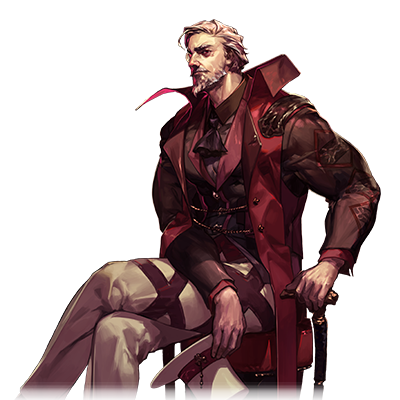

# 白川虎之助

| 角色信息   |  |
| ----------- | ----------- |
名称|白川　虎之助（しらかわ　とらのすけ）
年龄|18岁
职业|天才摇滚乐手
特技|能够演奏各种各样的乐器
对应乐曲|覚醒楽奏メタフィクション
| 对应版本 | Chunithm AIRPLUS

## Episode 1 世界最强的男人

>我是白川虎之助。你会一辈子都忘不了这个名字的！给我记好了，因为我会是世界最强的乐队乐手！

“白川虎之助”……在这条街上，可谓是无人不知，无人不晓。

在这个据说 “掌控音乐者便能掌控一切” 的世界里，“音乐家” 成为了那些充满野心的年轻人所憧憬的职业。

仅凭自身一人就能将世界掌控于手中……。

怀揣着这样梦想的年轻人，要么通过街头演出，要么就是每晚都在Livehouse里展示着自己的实力。

虎之助也是这样的年轻人之一。

不知何时流落到这条街上的他，凭借那极具压倒性的音乐，已经能够让Live House里的观众为之沸腾了。

一经发售的门票立刻就售罄了。

一直支撑着老字号 Live House 的店员是这样说的。

“这样的情况，可是自从巴尼修办独立乐队的时候以来，第一次出现呢！”

在狂热的粉丝们面前，今天虎之助也呐喊着：

“好嘞！拜倒在我的吉他之下吧！我就是掌控音乐的神明…… 白川虎之助啊！”

## Episode 2 旁若无人的演奏者

>你说现场演出？想让我满意的话，得准备和巴尼修那家伙同等规模的场地才行啊！

有一天，虎之助偶然抬头看向街头的电视，上面正播放着通知人气鼎盛的硬摇滚乐队即将开启世界巡回演出的画面。

（哼！巴尼修啊…… 就满足于那种轻飘飘的音乐，这世上还真是有不少可悲的家伙啊。）

正想着这些走着的时候，几个男人朝虎之助搭话了。

“……虎之助先生，能否请您在我们的Live House展示一下您那超凡的技巧呢？”

听到Live House 的店长对自己的技艺赞不绝口，虎之助原本心情还不错，可一听对方Live House的名字，态度立马就变了。

“啊？……你觉得我这本事能在那么小的场地施展得开吗！……想让我满意的话，就准备个与之相称的场地……对了，至少得是像‘S - Age’那样规模的场地，我才会考虑出演哦。”

“啊！？那、那可是那个巴尼修出道时的 Live House 啊！”

“哈！巴尼修？确实现在是稍微有点名气了看起来…… 但也没什么了不起的呀，那种家伙。”

“你、你太狂妄了！”

血气方刚的男人们对虎之助旁若无人的态度怒不可遏，朝他扑了过来。然而……。

“嘿嘿……可以啊？我会给你们献上专属的安魂曲哦！”

在虎之助那极具压倒性的旋律面前，那些人们深切地感受到了自己的无力，纷纷倒在了地上。

（嘿嘿……总有一天，巴尼修也会拜倒在我的脚下！）

## Episode 3 寄件人不明的邀请函

>前往音之祭典KOB的邀请函？虽然不知道寄件人是谁，但作为世界最强的我，没理由不参加啊！

虎之助感到了饥渴。他已经将这条街道人气吃干抹净，在这里已经再无追求。

（…… 差不多该换个地方了啊。）

就在他想着这些事的某一天，有一封邀请函寄到了他这里。

“嗯……？上面写着‘WELCOME TO THE KOB’……？”

看着这张用比血还深的红色文字写在暗色卡片上的邀请函，虎之助思索起来。

（“KOB”……“KING OF BAND（乐队之王）”！我听传闻听说过这事，好像是从全世界召集技艺高超的乐手，大家互相展示技艺…… 然后决出世界最强乐手的大赛对吧！）

无论是在台前风光无限地活跃着的乐手，还是在幕后竭尽全力展现自己实力的乐手，都在这个生存音乐节上平等地展开较量，彼此用尽全力相互比拼。

对于一心想向世人宣告 “自己是最强的” 虎之助来说，这简直就是再合适不过的音乐盛典了。

虎之助紧紧握着这张邀请自己去战斗的卡片，脸上露出了凶狠的笑容。

“嘿嘿…… 终于等到了这一刻。这个世界，终将在我面前卑躬屈膝，沉浸在我的音乐之中的这一刻啊！”

虎之助心中有一个疑问。自己过着从一个城市辗转到另一个城市的生活，要确定他的具体所在是很困难的。

那到底是谁把这样的邀请函寄给他的呢？

“寄件人是……‘G’？…… 没什么头绪啊。不过没关系！我要让参加 KOB 的所有蠢货都知道我是最强的！”

## EPISODE4 被人展示了自身的差距

>在 KOB 上受伤的我，被巴尼修救了。可恶！竟然被那家伙给救了！

虎之助意气风发地参加了 “KOB”，然而……参加者全都是远超他想象的有着超人般实力的乐队成员。

激烈得让人喘不过气的战斗，毫不留情的音乐较量，还有……凄惨落败的人们。

没错，“KOB” 就是由那些企图将全世界优秀的乐手一个个淘汰，只让自己旗下乐队成为 “最强” 的黑暗音乐制作人策划的一场地狱般的盛典。

看着在战斗中落败，如同海中的残渣般消逝的参赛选手们，虎之助动摇了。

（可恶…… 但是，我可不能在这种地方输掉啊！我可是世界最强的啊！）

此时支撑着虎之助的，只有认定 “自己是最强的” 的这份骄傲了。

但是……就连这份骄傲，在那实力远超常人想象的黑暗制作人的技巧面前，也像纸片一样被吹飞了。

“呜哇！？”

“呵呵……原本还以为你多少有点驾驭音乐的本事呢…… 说到底，在能掌控音乐运用的我面前，你就跟蝼蚁没什么两样啊。”

虎之助在面对黑暗制作人发出的那充满杀戮气息的旋律《<ruby>Genocide Beat<rp>（</rp><rt>灭族音切</rt><rp>）</rp></ruby>》时，意识到了自己的死期。

（可恶！我、我要死了吗！？）

然而，他却被一个意想不到的人救了。

“喂！你没事吧！？”

“啊！？你、你是…… 巴尼修！？”

 

……把陷入绝境危机之中的虎之助救出来的，正是那个巴尼修。

## Episode 5 堕落的灵魂

>自从我从KOB回来之后，事业就彻底一蹶不振了。可恶……！这都是那个巴尼修害的！

面对突然出现的巴尼修，虎之助大为震惊。

“巴尼修！？为什么要救我……原来如此啊！是觉得宿敌的我要是死了，会让你心里不舒服是吧？”

“啊？宿敌？你在说什么呢？我们应该是今天才第一次见面吧？”

“啊……！？”

过去，虎之助和巴尼修曾经有过乐队对决。然而，已经作为音乐界绝对王者的巴尼修，根本就不记得虎之助这个人了。

将精神受到严重打击以及刚刚经历激战，体力消耗过度无法动弹的虎之助放在一边，巴尼修解决掉了那个黑暗制作人。然后，在豪华客船爆炸起火之时，巴尼修护住了虎之助，平安地回到了岸上。在离开之前，巴尼修说了一句话。

“……虽然不知道你是谁……但就你那点本事还参加‘KOB’（注：可能是特定音乐活动名称），也太莽撞了啊。”

……从那之后，虎之助便开始走向衰落。

被巴尼修击碎了内心，曾经的骄傲也荡然无存，他已经没办法像以前那样弹奏出犀利的音乐了。

粉丝们纷纷离去，那些曾经被他看不起的乐队以及Live House如今都把虎之助当成了绝佳的嘲笑对象。

“虎之助已经不行了呀。果然这个时代是属于巴尼修的了。”

“哦，不过最近那个叫‘炼狱之男’的家伙也挺火的呢。那家伙的票，一下子就卖光了。”

……听着街头传来的议论，嫉妒、憎恶以及对音乐的执着让虎之助心烦意乱。

（可恶！可恶！巴尼修！……我也……本应该可以朝着更高的目标迈进的啊！） 

## Episode 6 恶魔的交易

>那个宛如炼狱一般的男人如此说到。——以我的五感作为交换，便可获得超越那家伙的力量。 我求之不得。

……虎之助已是一落千丈。

曾经，Live House的演出邀请纷至沓来，可如今，他的演奏请求屡屡被拒，甚至就连在街上拨动吉他琴弦，就会被人赶走。

在这条街上，已经没有他的容身之所了。虎之助就宛如行尸走肉一般，漫无目的地徘徊着。

那天，虎之助也在后巷里彷徨着。

“……为什么没有人认可我的音乐啊！？这都是巴尼修的错！”

只有对巴尼修那无穷无尽的恨意驱使着他的身体继续行动。

就在这样的虎之助身后，一个黑色的影子缓缓靠近。

“……你就是虎之助吗？”

这个男人周身笼罩着比漆黑还要浓郁的黑暗，有着比火焰还要鲜红的眼眸。没错……打个比方的话，他就像是从“炼狱”中来的男人。

“虎之助啊，你想要的话，我可以赋予你更强大的‘力量’。让你能够演奏出迄今为止从未有人演奏过的、美妙绝伦的音乐的力量。”

“……这种事，真的能做到吗！？”

“当然。不过为此是需要付出代价的。人类所拥有的五种感觉，也就是
‘视觉’‘听觉’‘触觉’‘味觉’‘嗅觉’……以这些感觉作为代价，赋予你力量。……怎么样？”

“更强大的力量……只要有了它，我就能打败巴尼修了……好吧！把力量给我吧！！”

……虎之助，毫不犹豫地答应了与这个男人之间如同恶魔般的交易。 

## Episode 7 解放的激情

>这可真是强大的力量啊！啊哈哈哈哈哈哈！只要有这股力量的话，我就所向无敌了！失去感官的感觉什么的也不过是小意思！

与那个如同炼狱般的男人达成交易后，虎之助感觉到力量正在自己的身体里充盈起来。

那是一种前所未有的满足感，仿佛失去的荣耀即将被重新夺回的那种满足感。

“哈……就是这样啊。这就是，我的新力量啊！”

不知不觉间，那个如同炼狱般的男人已经消失不见了。不过，沉醉在力量之中的虎之助对此并不在意。

“……咦？这不是过气的虎之助嘛？怎么还在这条街上呢？”

街上的一些年轻人开始向虎之助挑衅。

很显然，他们选错了对象。

……因为如今的虎之助就宛如一头饿到了极点，即将爆发血性的猛兽。

“……正好，你们就来陪我练练手吧！”

转眼间，那些曾经轻视自己的年轻人就被他轻松解决掉了，虎之助发出了胜利的怒吼。

“哈，哈哈哈哈哈哈——！没错！这就是我的力量啊！比任何人都要强的力量啊啊——！”

……虎之助的名号转眼间就传开了。

他那与以往截然不同的音乐，以及能够完美演奏各种各样乐器的演奏风格，吸引了众多人，同时也让人们对他心生畏惧。

人们都说“那可不是人类能演奏出来的声音，简直就像是恶魔的声音一样”。

不过，别人说什么都无关紧要。对于虎之助来说，只要能打败巴尼修就够了。

……没错，虽然作为交换，力量在不断增强的同时，五感也在逐渐衰退，但即便如此，虎之助依然对现在的状况十分满意。 

## Episode 8 与消失的宿敌的意外再会

>什么！巴尼修居然消失了！？这种事情我是不会相信的！……你是，那个炼狱的男人！

“哼，哼哼，呵，呵呵呵！现在的话……就能让那个男人，让巴尼修为我折服了！”

虎之助光是想着那个瞬间，尽管已经失去了触觉，却仍能感觉到后背一阵阵地发颤。

突然，一则耸人听闻的新闻传到了虎之助这里。说是巴尼修在巡回演出途中神秘失踪了。

得知巴尼修失踪的消息后，虎之助坐立难安，径直冲向了据说巴尼修所在乐队休息室的地方。

到这个时候，虎之助的眼睛几乎已经失去了光亮，耳朵也听不太清了，但他仅凭对巴尼修的那份执念，硬是摸索着来到了休息室。

然而那里果然没有巴尼修的身影，取而代之的是，一个神秘男子正在等着虎之助。

“……好久不见啊。”

“……你这家伙，谁啊？”

“哼。原来如此……你已经失去视觉了啊。”

“难道……你是，那个时候的！？”

那正是曾经赋予虎之助力量的那个如同炼狱般的男人……。

“新的力量，看样子你运用得挺不错啊……你出现在这里，是来向巴尼修挑战的吗？”

“那当然了！我就是为了打败他才活到现在的啊！”

“呵呵……就凭你，可触及不到巴尼修哦。”

“……你说什么！？”

男子的话让虎之助勃然大怒。 

## Episode 9 舍弃灵魂化为异形

>虽然我还未能追上他……不过如果舍弃我的灵魂就能够超越他的话……那就给你吧！

被如同炼狱般的男人的话语激起满腔怒火的虎之助，将恨意融入到音乐之中，向男人发起攻击。

然而，那音乐化成的利刃却被男人用吉他声轻而易举地抵消掉了。

“怎、怎么会……我的音乐居然输了……可恶！我、我可是……最强的啊！是要打倒巴尼修，成为最强的男人啊！怎、怎么会这样……”

陷入绝望的虎之助从失去光彩的眼眸中流下了眼泪，放声痛哭起来。而那个男人更是进一步地狠狠打击他。

“……我都说过了吧？就现在的你，是触及不到巴尼修的。”

“可、可恶……！我需要更多的力量！我想要力量！……喂，你啊！像那时一样赋予我力量啊！既然现在的我无法触及巴尼修的话！那就给我能压倒他、让他屈服的力量啊——！”

“……但是，你已经失去五感了。已经没有什么可以用来作为代价支付的东西了。”

“钱也好，命也好，什么都行！我什么都可以交出去！给我力量啊！给我无人能敌的力量啊！”

听着虎之助的呼喊，男人那红色的眼眸微微颤动了一下。

“……你说什么都行是吧？那么……我就收下你的‘灵魂’吧。”

“‘灵魂’……你说什么？”

“没错。那样一来，你就不再是人类了……会变成异形般的存在哦。”

“……无所谓。只要能超越巴尼修的话……‘灵魂’什么的，我很乐意交出去啊！”

“那么，契约成立。”

……男人脸上浮现出仿佛将世间所有黑暗都凝结起来般的不祥笑容，握住了虎之助的手。 

## Episode 10 觉醒的疯狂

>啊哈哈哈哈哈哈——！！毫无疑问，现在的我就是最强的！这股无所不能的感觉，现在的我，我……我才是<ruby>G.O.D<rp>（</rp><rt>神</rt><rp>）</rp></ruby>啊！

在握住男人手的瞬间……虎之助感受到了自己身体里的每一个细胞都仿佛沸腾起来的感觉。

“这、这是……！”

原本已经失去的视野被绚丽多彩的光谱填满，本应听不到任何声音的耳朵里，此刻却奏响着饱含情感的旋律。

因绝望而变得空洞的心被快乐的洪流所淹没，那能够将日常生活中的一切声音都掩盖住的、极具压倒性的音阶，源源不断地灌注到虎之助的体内。

“哈啊啊啊啊——！果然，我才是最强的啊！如同神明般无所不能，没错，我就是……我，我才是<ruby>G.O.D<rp>（</rp><rt>神</rt><rp>）</rp></ruby>啊，啊啊啊啊——！”

渐渐地，虎之助的脑海被混沌所侵蚀。

随着全身的感觉不断觉醒，某种重要的“东西”却在不断地流失……感觉就好像是，曾经那些本应在某个时候被悄然奏响的音乐，还没来得及被记录在五线谱上，就从脑海中流失了一般的悲伤。

仿佛置身于绚丽多彩的噩梦中，自己正在被一点点吞噬的痛苦……自己正逐渐变成另外一种东西的那种毛骨悚然、令人憎恶的感觉……。

然而，虎之助的内心深处却感到无比满足。

“啊哈哈哈哈哈哈哈哈——！巴尼修！巴尼修！这下我就能让你五体投地了！等着瞧吧！不管是地狱还是炼狱，我一定会找到你，然后用我的音乐将你侵蚀殆尽！嘿、哈、嘿嘿……嘿嘿哈哈哈哈哈哈——！！”

……虎之助就这样一直笑着，亲眼目睹着自己的世界被疯狂所笼罩，直至最后一刻……。 

## Episode 11 无法止步的疯狂齿轮

>被混乱与疯狂所支配的男人，眼中已无一丝光彩。只剩对宿敌的执念的他，缓缓地走下了黑暗中的楼梯。

觉醒后的虎之助，已经不再是从前的他了。他的意识被混沌所支配，甚至连过往的记忆都不复存在了。

如今失去了感情的他，既没有喜悦也没有悲伤……就连那份想要实现野心的心也丧失殆尽了。

现在的虎之助嘴里只会念叨着一句话。

“……巴尼修”。

他已经不再是人类了，彻底变成了一个为追寻巴尼修而四处徘徊的幽灵。

看着他这副模样，男人满意地微笑着问到。

“……呵呵呵。曾经名为虎之助的家伙啊……你想见巴尼修吗？”

“……巴尼修”

“好吧……既然如此，你顺着那楼梯下去就好。”

不知何时，休息室里出现了一道刚才还不存在的楼梯。

楼梯幽深，被黑暗所笼罩着。

对于常人来说，那恐怕是散发着令人不敢靠近的瘴气的黑暗之处，而虎之助在男人的催促下，迈着有些蹒跚的脚步朝着那黑暗走去。

他只是疯狂地渴望着能在那不知何时才能抵达的地底，见到那个男人的身影……。

“……巴尼修”

……他的眼眸中燃烧着，如同炼狱般暗沉的火焰。 

  [1]: http://story.chunithm.top/usr/uploads/2025/09/1955301913.png
  [2]: http://story.chunithm.top/usr/uploads/2025/09/1417248445.png
  [3]: http://story.chunithm.top/usr/uploads/2025/09/1743200340.png
  [4]: http://story.chunithm.top/usr/uploads/2025/09/2668371039.png