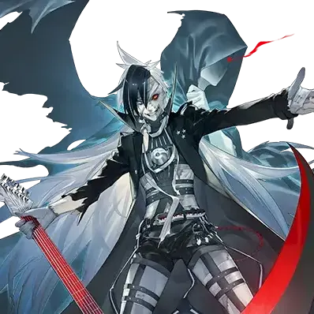

# 瓦内斯

| 角色信息   |          |
| ----------- | ----------- |
|名称|瓦内斯
|年龄|21岁
|职业|复仇暗杀者
|时代|现代
| 对应曲   |Chaotic Ørder
| 对应版本 | Chunithm SUNPLUS|

译者：毛颜

## EPISODE1 两位吉他手

>我们的梦想……这里也只是一个起点。不过没关系，只要你和我一起的话，我们一定能做到！

“怎么回事啊，老哥，你一直在发呆诶。”

“啊……只是稍微想了点事。”

“喂喂，你可得打起精神来啊！决赛马上就要开始了！再这样下去，我的吉他可要把整个舞台都抢走了哦！”

“哈哈，少吹牛了。哪有比大哥更酷的弟弟啊。”

 

某个地方的工业区。

这片劳动工人的街区，唯一的一座现场演出大厅里，有一对兄弟。

哥哥瓦内斯，弟弟劳里斯。

他们是一支双人吉他组合，以高度精准的叠加和声和仿佛能撕裂听众的尖锐音色而著称。在这个小镇的音乐爱好者中，几乎无人不知他们的名字。

平时看似坚强冷酷的哥哥与看起来完全就是个淘气鬼的弟弟，这样成为组合的二人，在舞台上却有着截然不同的一面。

瓦内斯狂野地释放出疯狂的主旋律，配合劳里斯紧实且技术精湛的演奏，共同谱出沉重的摇滚乐音。

他们的音乐不仅在这个小镇上引人入胜，甚至有让人信服能席卷全球的潜力。

此刻，两人刚刚在一场非官方的演出对战中连胜，正准备在后台休息，为即将到来的决赛做准备。

 

“我刚刚把我们的带子寄给了全世界最酷的场馆！之后要是有机会来组织一次巡演的话，我们就能证明我们的吉他是世界最强的！”

“是啊，我们可不是只在这种小地方待一辈子的人。”

“就是！然后我们还要推出传世之作，站上巅峰！为了这个，今天必须拿下冠军，为进军世界造势！”

“喂，你这家伙太兴奋了吧？到时候可别拖我后腿。”

“嘿嘿！平时还不是我老给你擦屁股，你还好意思说！”

 

连后台都能听到的音乐声停了下来，主持人宣布决赛正式开始的声音传了过来。

最后的对决马上就要开始了。

 

“……到我们了。”

“嗯嗯。那个……老哥。”

“怎么了？”

“我们一定要一起爬到顶峰，两个人一起。”

“……那是当然。”

 

两人碰拳，肩并肩走向舞台。

他们无需在意对手。只要像往常一样展现自己的演奏，胜利自然会到来。他们有这样的自信，也有与之匹配的实力。

挂上舞台上准备好的吉他，简单检查声音后，主持人开始倒计时，宣布对决开始。

 

“3——2——1——”

 

观众的期待与热情达到顶点的一瞬间。

伴随着轰鸣声崩塌的天花板。一颗巨大的火球般的物体从天而降，整个场馆被“物理的炽热”吞噬。

 

“怎么！”

 

瓦内斯甚至无法发出声音。

一旦吸气，周围的烈焰仿佛能瞬间烧灼喉咙。

究竟发生了什么？不绝于耳的尖叫和灼烧身体的火焰，让他无暇思考。

就在这时，维纳斯在熊熊燃烧的火柱中看到了一道人影。

就像是“被火焰包围这种事是理所当然的”一样平静站着的那个人，居然还露着微笑。

 

（那家伙是……）

 

瓦内斯凭直觉感觉到那个人影就是造成这场地狱般的惨剧的犯人，想办法接近那个人的时候。

 

“老……哥……”

熟悉的声音让瓦内斯瞬间转头看去。

弟弟拖着仿佛随时都会倒下的身体，身上到处都是火焰。

 

“劳里斯！！”

瓦内斯的记忆到此中断。被火焰灼烧、消失的意识再度恢复时，已经是在医院的病床上。

 

——醒来的瓦内斯迷迷糊糊的眼里，隐约能看到白色的墙壁。

耳边传来一阵阵慌乱的交谈声，随后一位看似医生的老年男子走了过来。

医生用温和的语气安抚着对瓦内斯。

 

“听好了，请冷静下来听我说。你是被‘炼狱的厄神’的手下所伤，此前一直徘徊在死亡边缘——”

 

医生说，那天的事并非意外，而是由厄神的手下所为。

这位自称是“对抗厄神的神”的医生，勉强保住了瓦内斯的性命，但他的身体损伤实在过于严重。

 

“——所以，我们只能这么做了。请你做好心理准备……”

 

说着，医生将一面镜子转向躺在床上的瓦内斯。

镜中映出的是满是随意缝合痕迹的扭曲皮肤。

“自己的皮肤”与“别人的皮肤”。

粗糙、直率、却自小体弱的苍白皮肤。

毫无疑问，属于他心爱的弟弟劳里斯。

 

“呜，呜呜，啊啊啊啊啊啊啊啊啊啊啊啊啊啊啊啊啊！！！”

 

变成身体上满是拼接痕迹的“怪物”的瓦内斯的声音响彻病房。

这一天，他失去了弟弟，失去了半边翅膀，也失去了本该璀璨的未来——。

## EPISODE2 拼接起来的男人

>在这座大到离谱的城市里，我一定能找到线索。找到那个杀死我弟弟的，那道火柱的元凶的线索……

在那之后，又过了两年——

瓦内斯出现在了一座称为“中央城”的大都市一角的蓝调酒吧里。

坐在吧台前，面无表情地举着酒杯，身上怪异的拼接模样的男人。

散发着和店里不一样的存在感。

 

自那以后，瓦内斯背井离乡，也抛弃了自己心爱的吉他。

失去了吉他组合的片翼，他再也没有继续弹奏的理由。

兄弟俩共同登上巅峰的梦想已经破碎。

瓦内斯如今生存的意义，只剩下“复仇”。

 

那天为瓦内斯治疗的医生自称是侍奉“祝祭之神”的人，留下了一些零碎的信息。

这个世界上，存在一支由厄神“G.O.D.”率领的军团，以及对抗他们的特利斯墨吉斯忒斯——祝祭之神统领的人们。

G.O.D.为了增加优秀的眷属，以拥有“优异的音之力”的人为目标，而瓦内斯和弟弟劳里斯不幸被卷入其中。

特利斯墨吉斯忒斯的部下一直在追捕袭击瓦内斯他们的G.O.D.的手下，但终究晚了一步，未能阻止惨剧。

得知这一真相的瞬间，瓦内斯毫不犹豫地决定要为弟弟报仇。

 

瓦内斯认为，在汇集了一流音乐的中央城，必定会出现与G.O.D.相关的人。

瓦尼斯这么想着，来到了这片土地。

他发誓要找到杀害弟弟的仇人，亲手了结对方。

为此，他夜复一夜地游走于有音乐的地方，搜集情报。

 

“嘁，今天也一无所获……”

 

离开酒吧，瓦内斯走在冬夜干冷的街道上，烦躁地吐了口唾沫，低语道。

“劳里斯的仇……在杀了那个火柱里的男人之前，我既无法前进，也无法回头……”

 

漫无目的地徘徊中，瓦内斯不知不觉闯入了废弃的旧城区，被一个身影挡住了去路。

 

“……你是谁？”

 

长袍被拉低，完全看不到脸。斗篷下仿佛没有生物的存在，只有一片无尽的黑暗。

第一眼就能确定，它不属于这个世界。

那宛如“死神”般的外貌，以毫无生气的声音对瓦内斯低语道。

 

“消失吧……”

“死神？找我有什么事？”

“消失吧……”

“哼哼……原来如此。”

 

说着，瓦内斯觉得全身的血液沸腾起来。

这个不是人类的暧昧存在——极有可能与自称神或魔的G.O.D.有关。

意识到自己可能接近了苦苦寻找的仇人，瓦内斯的杀意再也抑制不住。

 

“消失吧……”

“他妈的你才给我滚啊！”

 

瞬间，瓦内斯拔出手枪对准死神，毫不犹豫地扣下扳机。

一口气打光所有子弹后，他冷静地重新装填，继续朝死神倾泻弹雨。

但是，感觉不到任何击中对方的反应。

事实上，面前的死神的长袍上一个弹孔也没有，依然明晃晃站在他的眼前。

瓦内斯深吸一口气，冷静思考。

 

（……看来枪械对他没用。虽然没办法，只能先撤退了。）

 

视线紧盯着死神，正在慢慢后退的时候。

一直摇摇晃晃站着的死神，第一次展现了动作。

从斗篷的缝隙中伸出一只瘦削、毫无生气的胳膊，死神缓缓抬起手臂，指向瓦内斯。

 

“什么……呜！ ？”

 

刹那间，瓦内斯感到头脑仿佛被搅得天翻地覆，剧痛让他跪倒在地。

他拼命抵抗着飞速旋转的视野，但最终还是当场倒下了。

 

（怎么能在……这种地方……劳里斯……）

 

在马上就要失去意识之前。

瓦内斯的眼前又浮现起了弟弟曾经笑着说着讨厌的话的样子。

## EPISODE3 <ruby>赏金猎人<rp>（</rp><rt>BOUNTY HUNTERS</rt><rp>）</rp></ruby>

>我其实早就有所察觉了……但那声音却一次又一次在我耳边回响。那个呼唤我名字的声音是？

“——快醒醒！睁开眼睛！”

 

有谁在说话。

瓦内斯察觉到脸颊被拍打的触感，猛地跳起来，一边环绕四周一边喊道。

 

“……那家伙在哪儿！？那个死神呢！！”

“冷静点。这里只有你和我，还有几只肮脏的臭老鼠。”

 

一个身着皮夹克的金发男子说道。瓦内斯逐渐明白现状，长出一口气。

 

“我……还活着吗？”

“告诉我，你在这儿看到了什么？”

“啊，啊啊……一个像是死神的家伙……披着斗篷的幽灵……”

“……原来如此，果然还残留着那些家伙特有的‘气味’……”

“气味……？”

“那些自命为神的混账散发出的气味。”

“……神，吗。你也在追寻G.O.D.？”

“半对半错。我追的可不只是G.O.D.。”

“这样啊……总之，看来你不是敌人，我放心了。我叫瓦内斯，谢谢你让我不用在这垃圾堆里迎接清晨。”

“叫我巴尼修。能跟那家伙交锋还没断几根胳膊腿，真有意思。跟我说说你的事情吧。”

 

自称巴尼修的男子表示要带瓦内斯去他在中央城内的几处藏身处之一。

从拆除到一半的废弃商业设施遗迹里的一个下水道井盖下了下去，眼前出现了下水道内工作人员专用的房间。

在一个散乱地摆放着最低限度的生活用品和一把电吉他的房间里，巴尼什让维内斯坐在破烂不堪的沙发上，一边扔过去一块压缩食品一边说道。

 

“——对那些家伙来说，枪械不过是垃圾。‘普通人类’要对抗它们，只能依靠‘音之力’。”

“‘音之力’……”

 

瓦内斯并非完全没料到这一点。

他自己就是凭借“音之力”在对战舞台上崭露头角的乐手。他也曾考虑过，面对神一般的存在，枪械可能完全无效。

即便如此，他却有无法使用音之力的理由。

 

“为什么你不用‘音之力’？看你的样子，你也是个乐手吧，而且绝不是业余水平。”

“什么！？我还什么都没说——”

“我看得出来，感觉上而已。还有……你的眼神。我见过不少你这样眼神的疯子。”

“我……不一样。我已经抛弃了作为吉他手的自己。”

“……是吗？总之，如果你想干掉那些家伙，‘音之力’是必不可少的。拿上那把吉他吧，我用不着它。”

 

瓦内斯不情愿地接过吉他。

曾经的天才乐手瓦内斯早已抛弃了吉他，准确来说，是不得不抛弃。

每当他想弹起什么曲子时，眼前就会浮现出弟弟燃烧着的身影。

与其一次次被那地狱般的场景折磨得撕心裂肺，还不如永远不再玩吉他。

为了保护自己的内心，瓦内斯选择了逃避。

 

“谢了，但你为什么要帮我到这份上？抱歉，你可不像什么好心的绅士。”

“哼，虽然不知道你的目的，但你也是追捕同一个目标的猎人……就当是我的心血来潮吧。”

 

没有更多地交谈。瓦内斯与巴尼修告别，离开了那个地方。

他穿过旧城区，朝着自己的据点走去，背着那把无法弹奏的吉他，行走在夜晚的城市中。

 

“只要还在逃避，我就没有战斗的手段……但是，我已经……”

 

为了向夺走一切的人复仇。

他必须面对那本该抛弃的诅咒。

映在楼宇玻璃窗上的瓦内斯那满是拼接痕迹的脸庞，已不再有昔日天才吉他手的影子。

只有一张可怜的，胆小鬼的脸庞。

## EPISODE4 湿冷的导火索

>如果双人组合的一半消失了，那就完全是另一种东西。失去了那家伙的我，已经毫无力量可言。

“没想到这么快就又见面了……”

 

几天之后。

一如往常在深夜的中央城徘徊，走进离市区不远的贫民窟时，死神再次出现了。

与瓦内斯对峙的死神，依然重复着那句不变的话。

 

“消失吧……”

 

那天与死神初次遭遇时，瓦内斯不知为何没有被杀死，但对方是G.O.D.的眷属，他明白“不会有下一次”。

与其颤抖着祈求被放过，还不如吞下路边的呕吐物来得痛快。

无论多么想逃避过去的幻影，瓦内斯别无选择，只能战斗。

 

“只能做了吗……！！”

 

他咬牙从琴袋中取出吉他，笨拙地开始弹奏自己早就研究过几万次，已融入身体的乐句。

没有“热身”，一上来就是全速冲刺的高速颤音。

街头没有扩音器，没有任何电信号的介入，但瓦内斯的“音之力”逐渐化作震耳欲聋的爆音，撼动空气。

他那尖锐刺耳的失真音色，仿佛具象化为新月状的刀刃，在空中无数次显现。

当乐句转向全拨片扫弦时，那些新月如同脱缰的猛犬，朝死神猛扑而去。

 

“尝尝这招！我的‘音之力’！！！”

 

刀刃在柏油路面和满是涂鸦的水泥墙上随意切割，划过贫民窟的巷道。

就在刀刃即将命中的瞬间，死神第一次展现了“躲避”的动作。

这也证明了如果能正面击中它必定能造成伤害。

然而，死神却在这块空间不断穿梭，仿佛完全看透了瓦内斯的节奏，轻松地一次次躲开。

 

“操……真是灵活……”

 

愤怒和焦躁，长时间没有演奏吉他的空白，以及无法发挥全部实力的自己，让瓦内斯的呼吸渐渐急促。

他比谁都清楚，如今自己的力量连当年的一半都不到。

瓦内斯一直以来都是与弟弟劳里斯共同创造和声，演奏乐曲。

如今双人吉他组合的片翼已陨落，无论瓦内斯展现怎么样的表演，都只是“缺少了什么”的状态。

重新认识到这一现实，瓦内斯被失落感和无力感笼罩，痛苦地咆哮。

 

“操你妈的——！！”

 

脑海中劳里斯的影像一次次闪回，反复折磨着他。

 

（现在的我，别说复仇，连给它留下一道伤痕都做不到……）

 

他勉强维持的心态终于崩溃，演奏即将停止的那一刻。

就在这个时候。

 

“LIVE已经结束了吗！？”

 

伴随着轰鸣的引擎声，巴尼修骑着摩托车冲了出来，直接朝死神撞去。然而，死神的身体仿佛没有实体，像是雾气般被穿透。

但巴尼修并未停下，滑行着冲到瓦内斯面前，用拇指指向后座。

 

“快上车！我们要撤退了！”

 

瓦内斯跳上摩托，车子以几乎将他甩飞的加速度冲出。

死神没有追赶，只是静静伫立，随后如融入风景般消失。

## EPISODE5 <ruby>幻影视觉<rp>（</rp><rt>PHANTOM VISION</rt><rp>）</rp></ruby>

>呐，告诉我吧。像往常一样用着瞧不起人的态度，嘲笑我是个没用的老哥——

在远离中央城的港口。

巴尼修的摩托车怠速运转了一会儿，确认完全甩掉追击后，他熄灭了引擎。

夜幕下的码头恢复寂静，只有海浪的声音在回响。

 

“……抱歉。如果没有你，这次我恐怕真的没命了。”

“没打算让你欠我人情。毕竟是我利用了你。”

 

巴尼修随手扯下瓦内斯吉他盒上的一个别针，捏在指间，毫不掩饰地说着。

 

“不好意思，我跟踪了你。”

“定位器吗……”

“那天发现你倒下时，我就觉得奇怪了，G.O.D.的眷属竟然会完好无损地放过一个猎物。所以我在想，要么那个死神不是G.O.D.的手下，而是别的什么东西；要么是你有种吸引‘那种东西’的体质。结果看来，我的两种猜测都对了。”

“……你是说死神的目标是我？”

“连我委托的情报屋都不知道的死神，但它却多次出现在你面前——虽然不绝对，但十有八九是冲你来的。”

 

瓦内斯对被跟踪一事露出不满的表情，但是现在更在意另一个问题，又重新问道。

 

“……另一个问题。‘不是G.O.D.的别的什么东西’是什么意思？那家伙到底是什么？”

“具体我也不知道。但我直接撞向死神时，它的身体像是没有实体，像是幽灵一样。说不定是真的死神呢。”

 

巴尼修竖起手指，比了个割喉的手势。

瓦内斯面对这毫无解决办法的局面，只能耸肩苦笑。

 

“仇人找不到，还被死神追杀，甚至连像样的演奏都做不到……真是糟糕透了。”

“你的吉他声传到了两个街区开外，听起来是非常酷的声音。不过，确实不是你的最佳状态。”

“刚刚的东西……听拉稀的声音都比它强。”

“吼，你对自己的评价还挺高。”

 

巴尼修说着，跨上摩托，直直盯着瓦内斯。

明明两人都不清楚对方追捕G.O.D.的详细缘由，但他却像是看透了一切。

 

“……给你个忠告。你的表现不算差，但这种程度别说G.O.D.，连它手下的那群废物都打不过。不知道你要给谁报仇，但放弃也是明智的选择。”

 

瓦内斯刚想反驳，巴尼修却启动引擎，轰鸣声盖过了他的话，头也不回地疾驰而去。

正如巴尼修所说，瓦内斯的技术和演奏早已不复当年。

然而，瓦内斯的复仇剧甚至还没开始。

这绝不是被人劝几句就会放弃的事。

 

“我能做到的……我一定要为劳里斯报仇……”

 

像是说给自己听似的反复念叨着的瓦尼斯，脸上带着一丝决然，紧紧握住吉他盒的把手。

 

——几天之后。

到处都裸露出地基的废弃大楼之中。

以此为据点的瓦内斯，正弹奏着吉他。金属琴弦清脆的声响在楼层间回荡。

 

（劳里斯已经不在了……那我必须创造出“我一个人的乐音”……为了获得能对抗G.O.D.的力量……）

 

抛弃了以双吉他为前提的旧风格，开始钻研新的演奏方式。

由于长时间没碰吉他，这次的练习是他久违的自主训练，久到他都记不清上一次是什么时候。

每当弹奏琴弦时，瓦内斯的脑海里就会浮现出被烈火焚身的痛苦不堪的劳里斯的身影。

尽管对一如既往的闪回感到痛苦，但还是拼命地继续弹奏。渐渐地，他回忆起一些被遗忘的画面。

拿到第一把吉他那天的事情。发自内心爱上吉他的事情。与劳里斯切磋琢磨、提升技巧的事情。

如今对瓦内斯而言，吉他已化为诅咒，但它也曾是他最大的救赎。

回想着和弟弟一起度过的令人怀念的金黄色日子，回过神来，瓦内斯已经露出了微微的笑容。

 

那天晚上，瓦内斯入睡后做了一个梦。

没有观众也没有任何工作人员，一个冷冷清清的livehouse里。

瓦内斯独自站在木质舞台上，台下，劳里斯站在地板上仰望着他。

劳里斯以生前的模样站在他的面前，平淡的说起来。

 

“你看起来很开心啊，老哥。”

“劳里斯……不……这一切都是为了复仇……”

“复仇？复仇之后我就能活过来吗？那种没意义的事就别做了。说到底，不过是老哥你一厢情愿吧。”

“不是……”

“就你一个人还活得好好的啊……老哥真狡猾……呐，老哥……老哥……”

“不是这样……才不是这样……”

“老哥……老哥啊……啊啊啊哥哥哥哥哥哥哥哥哥哥哥哥哥哥——”

 

劳里斯的声音像坏掉般重复起来，身体突然如自燃般燃起火焰。

衣服烧毁，皮肤溃烂，眼球蒸发，但他仍拖着焦黑的身躯，缓缓爬向舞台。

当那焦黑的手掌抓住瓦内斯脚踝的瞬间——

 

“——哈！？”

 

瓦内斯从噩梦中惊醒。

意识到刚才的场景只是梦，他擦去额头的汗，长出一口气。

对瓦内斯来说，已经是无法用“糟糕透了”这个词来形容的噩梦。

即便明知那是自己的大脑制造的幻觉，他也无法保持平静。

 

“谁来告诉我吧……我该怎么办……”

 

他的声音无人回应，消散在深夜的黑暗中。

## EPISODE6 <ruby>倒带<rp>（</rp><rt>REWIND</rt><rp>）</rp></ruby>

>我们的路已经无法回头了，但我们还能继续一路向前。我竟然能忘记这么简单的事情。

“可恶……”

 

瓦内斯独自咒骂着，猛灌了一口酒瓶，踉跄地走在深夜的中央城街头。

 

　『就你一个人还活得好好的』

 

梦中劳里斯的声音仍在瓦内斯脑海中反复回响。

使用了弟弟的身体，苟延残喘活下来的为什么会是自己？

活下来的不该是劳里斯吗。

那个死神究竟是什么？

到底要如何获得对抗G.O.D.的力量？

就像把所有让他心烦意乱的元素都吞下去一样，瓦内斯独自一人不断闷着酒。

越喝就越对什么都做不了的自己生气。

 

“——靠！喂，疼死了！你这个浑身打满补丁的混蛋！”

 

擦肩而过时撞到肩膀的小混混挑衅着挥拳，醉态朦胧的瓦内斯毫无防备地挨了一击。

小混混得势不饶人，继续殴打，而瓦内斯刻意不抵抗，最终像破布般倒在路边。

 

（我……曾自信无人能敌……相信用摇滚登上巅峰的梦想绝非空想……可现在这是什么鬼样子……劳里斯被杀……而我一个人连像样的演奏都做不到……从小就是这样……他好强，我却是个胆小鬼……什么都没变……）

 

仰望天空，雪花飘落了下来。

雪势渐大，落在瓦内斯身上，带走他的体温。

 

（反正我早就死过一次了……在这里死掉也不坏……）

 

瓦内斯眼神空洞地想着，忽然把视线转到一股气息传来的方向。

不知何时，死神已站在触手可及的距离，静静俯视着他。

死神没有攻击，只是俯视着瓦内斯。

 

“哈哈……终于像个死神一样来接我了啊……”

 

瓦内斯自嘲地调侃，死神却毫无回应。

只是继续沉默地俯视着。

 

“喂……你是说连我这条命，都没有收割的价值吗……？”

 

自己难道已经落魄到死神都要放弃收割了吗？

一股怒火在瓦内斯胸中升腾。

怒火敲击着心脏，为身体注入活下去的热量。

 

“对了……我还有事情要做……怎么还能够忘掉……劳里斯是绝对不可能说复仇没有意义的……对啊，他肯定会怒气冲冲地说……‘就算追到天涯海角也要干掉它们’……”

 

无意中，死神的举动成了他重新振作的契机。

瓦内斯拍去身上的雪，站了起来。

为了战斗。而且，为了证明自己不是“苟且活着”，而是被劳里斯“救活”的。

 

他不再在意早已消失的死神，摇晃着走进城市。

不知为何，他突然特别想听摇滚。凭着这股冲动，他来到附近一家livehouse。

 

“啊——今天已经要打烊了哦……喂你这家伙怎么回事，怎么成这样了！”

一个打扮夸张、像是老板的人拉住瓦内斯，硬把他按到沙发座上，递来毛毯和热牛奶，像对待小孩般照顾他。

冰冷的身体开始暖和起来，甚至开始有力气嘲笑刚才的自己。

这时，他注意到旁边放着一把吉他。

虽然被揍得挺惨，好歹手指还能动。

把它拿在手里，漫不经心弹了起来。

 

“哦？这曲子……”

 

侧耳倾听音色的老板喃喃说道。

老板想了一会儿，突然走进柜台，拿出一件蒙着灰尘的东西。

 

“这个，是你的吧。”

 

瓦内斯接过递来的东西，瞪大了眼睛。

 

“这曲子挺酷，在地方新人里算不错了，所以人家还有印象呢。当时想请你们来这儿演出，打了好多次电话都没人接。怎么会在这种地方？”

 

那是他和劳里斯为进军全国制作的试听带子。

封面设计由瓦内斯操刀，劳里斯则负责四处寄送。

慢慢打开盒子，夹在磁带里的一张纸片掉了下来。

瓦内斯一边按住微微颤抖的手指，一边打开它。

 

“我们是即将登上摇滚界巅峰的最酷二人组。不是吹牛，我们决定的事就一定会做到。拼了命……不，哪怕死了也有信心成为传奇。所以让我们在你的场子演出吧！现在签下我们，将来你会更有面子！快联系我们！！”

 

不管怎么说都是最愚蠢、最差劲，也是最棒的劳里斯流的推销词。

但那也是可爱的弟弟的生活方式。

 

“……对啊，劳里斯。我们决定的事就一定会做到……就算失败过，也从未逃避……这么简单的事……我竟然……”

 

小时候，兄弟俩没少干坏事。如果有天堂和地狱，劳里斯肯定在地狱等着他。

就算没完成使命在地狱重逢，到时候两人再一起大闹一场就好了。

身体满是补丁的丑陋的瓦内斯。

眼中却清澈无比，不再有一丝迷茫。

 

“……我要大干一场，像个真正的摇滚巨星那样。”

## EPISODE7 <ruby>沉默死神<rp>（</rp><rt>SILENT REAPER</rt><rp>）</rp></ruby>

>那团火焰至今仍烙印在我的眼底。不管用什么手段，我一定要亲手了结它。

那天，瓦内斯背着吉他，前往了livehouse。

如果G.O.D.及其眷属为追求“优质之音”而现身，那自己主动引它们出来就好了。

虽然现在还是不太习惯单人独奏，不过不久后一定能达到那个境界。

没有任何依据，但瓦内斯非常自信。

在去livehouse的路上，他再次遇到了那个已不再令他惊讶的对手。

 

“是你啊……这次又有什么事？”

 

死神什么都没回答。

 

“事到如今，你别再说是来取我性命的咯？我可不会那么轻易就死了。即便需要时间，我也已经找到属于我的方式。所以别来碍事……哈，我在跟死神废什么话……”

 

说着挠挠头，瓦内斯好像注意到了什么。

那本该看不见的兜帽里是一片黑暗，而黑暗深处，似乎有谁笑了起来。

他还没来得及细想，就脱口而出。

 

“你，难道是——”

 

死神猛地抬起手臂，打断他的话，像上次扰乱他意识时那样指向他。

但这次手指指向的不是瓦内斯，而是中央城楼群间隙的远方。

瓦内斯顺势看去，下一个瞬间，他手指的方向——约五公里外的地方一道巨大的火柱冲天而起。

绝对不是什么瓦斯爆炸。那是人类无法制造的、巨大而邪恶的火焰。

瓦内斯对那火焰的颜色再熟悉不过。

 

“那是……！ ！”

 

不可能忘记。那是灼烧了自己和劳里斯的火焰。

他尚未掌握足以对抗G.O.D.的“音之力”，但即便如此，瓦内斯还是忍不住跑了起来。

来到火柱近前，瓦内斯粗暴地踢开混凝土碎块，一边小声说道。

 

“基泽库尔资本的体育场吗……”

 

火柱的根源是一座曾用作多功能体育场的设施。

据说瓦内斯来到中央城前不久，这里因不明事故，被关闭起来禁止进入。

一边拨开满是瓦砾的设施内部，一边赶往体育场中央。

穿过中央通道，来到竞技场，迎接他的是令人难以直视的炽热，以及——

 

“巴尼修！？”

 

在火柱内部的中心之处，可以看到一个持续燃烧身体却没有断气的“人影”。

那正是扭曲了瓦内斯和劳里斯命运的那天出现的“灾厄”，毫无疑问。

而与这灾厄对峙的，正是同样追捕G.O.D.的巴尼修。

大概是在苦战吧，已经气喘吁吁了。

 

“瓦内斯！这家伙……比想象中难缠！虽然很不爽，但得请你帮忙了！！”

“不用你说！！”

 

瓦内斯冲上前去。

与此同时，“火柱”似乎察觉到瓦内斯，一道不快却带着神圣感的声音不知从何处响起。

 

“哦……又一个‘音之编织者’……作为献给我主——炼狱震撼之神的祭品，真是再合适不过了……”

 

听到这句话的维内斯表情僵硬，愤怒至极地冲向火柱。

献给神的祭品——就为了这种事，毁掉了我们的未来吗？

 

“我要亲手把你折磨至死！！”

“住手！瓦内斯！！”

 

巴尼修制止的声音还没传过来，瓦内斯的身体就已经瞬间被火焰包围。

不是赤红，而是近乎纯白的烈焰。

在刺眼的光芒中闭上眼的瓦内斯，再睁眼时，看到的是无尽延伸的白色空间——以及死神的身影。

## EPISODE8 <ruby>寒冷糊音<rp>（</rp><rt>COLD FUZZ</rt><rp>）</rp></ruby>

>啊啊……没错……这就是属于我们的声音……这声音将会传到天涯海角……直到这火焰熄灭为止。

“这里是……为什么是你……”

 

瓦内斯本以为死神会一如既往地沉默。

但这次，死神首次以“对话”的形式回应了他的疑问。

 

“瓦内斯……”

“我的名字……”

“听着。你有两条路可走。签订‘生命与诅咒的契约’，或者化为灰烬。”

“‘契约’？签订后我会怎样？”

“我将赐予你超乎常理的力量。作为代价，你的部分生命将被夺走。每次使用这‘力量’，你的时间都会减少，直到‘死亡’来临。”

“原来如此……真是‘把灵魂卖给恶魔’的交易啊。”

“选择吧……作为主宰死亡者，这是我给你的最后抉择……”

 

燃烧生命，换取力量。

真的值得吗，瓦内斯不清楚。

但他毫不犹豫地说道。

因为他早已下定决心，无论用何种手段都要完成复仇。

 

“成交。玩摇滚的哪个不是短命鬼。”

“……明白了。”

 

侵入灵魂，“诅咒的契约”正式成立。

死神缓缓靠近瓦内斯，以履行契约。

但这时，本来应该同意契约的瓦内斯又缓缓开口。

 

“就一个事情可以吗……让我看看你的脸，劳里斯。”

 

短暂的沉默后，死神掀开了兜帽。

兜帽下不再是漆黑的虚空，而是一张毫无疑问真正的人脸。

那正是那天在火柱烈焰中死去的劳里斯的脸。

 

“老哥……你原来注意到了吗？”

“有点感觉。你变成这副鬼样子，给我讲讲原因吧。”

“哈哈……都怪那个自称特利斯墨吉斯忒斯的家伙。说什么我的灵魂太珍贵，不能浪费……就把我变成了他们的棋子。开什么玩笑，我逃了出来，结果被神之怒搞成这样。”

“所以……那家伙也是‘敌人’？”

“没错，是敌人。”

 

兄弟俩再次相视而笑。

像两个筹划恶作剧的孩子般，脸上带着天真无邪的笑容。

 

“话说，你真要签这契约？真会短命的。我现在是死神了，就算你是我老哥，我也帮不了你。”

“都这个时候了还说这无聊的废话。不择手段不才是我们的作风吗？”

“哈哈……对啊，嗯……没错。”

“……好了，该上场了。借我点力量吧。”

“好的，我会好好支援你的。”

“别拖我后腿！”

“老哥你才是！”

 

体育场中央燃起的白色烈焰。

突然又散开，仿佛是精心设计的舞台效果，一个男人出现在那里。

他肩扛着一把镰刀造型的吉他，背负着如同死神一般满身补丁的诡异模样。

他瞪大眼睛，口水滴落，痉挛着，发出震耳欲聋的爆音，完全无视常规地狂扫琴弦。

简直就是个疯子。

与平日的举止判若两人，完全就是“打开了开关”的过去的瓦内斯本人。

 

“噫呀——哈哈——！火焰浑蛋的公开处刑时间到了——！”

“瓦内斯！你这家伙居然还活着！”

“现在别他妈楞着了操蛋的骷髅混蛋！你的大腿中间要是真的长着两个蛋，就别害怕了赶紧跟着老子的节奏来啊！！”

“谁害怕了啊！！”

 

超绝技巧的高速乐句响彻体育场。

毒辣的音色仿佛能炸裂听者的耳膜甚至血管，却又在音与音的间隙中融入精妙的节奏，升华为一流的艺术。

两把吉他的音色如拼图般契合，交织成汹涌的旋涡。

 

“这声音究竟是怎么回事……明明是糟糕透了的吉他，却让老子‘嗨’起来了！！”

 

巴尼修从未体验过如此高昂的情绪。

即使在他曾经的乐队中，也从未发出过这“最凶之音”。

一种预感般的信念闪过，“这声音跟我的嗓音简直是绝配”。

 

“一击决胜负！他妈的骷髅男！！！”

“老子知道！闭嘴弹你的吉他，补丁男！！”

 

瓦内斯的吉他配上巴尼修的“咆哮之歌”。

这是单独演奏完全无法比拟的合奏效果，迸发出爆炸性的力量。

 

“我可是‘主之枝’……区区人类竟然敢……！！”

“哦哦哦哦哦哦哦！！”

 

巴尼修裹挟着超越火柱热量的炽热，跃入火焰，径直冲向核心的“人影”。

就在这一瞬间，两人的声音突然从激烈到极限的一段转变为突然爆发似的戛然而止，巴尼什静静地低语道。

 

“不好意思。我，还有那家伙——大概都不是人类了。”

 

他刺入“人影”的手臂，捏碎了G.O.D.的碎片。

瞬间，熊熊燃烧的火柱像倒映的影像一样集中起来，被吸入了巴尼修的身体。

体育场内G.O.D.的气息彻底消失。

这说明二人组成的临时乐队获得了胜利。

 

“我还差得远啊……没有瓦内斯，我可赢不了……”

 

巴尼修在安静的体育场中喃喃说道。

就像散步途中偶然遇到的朋友一样，虚脱的维尼斯走过来对他打着招呼。

 

“哟，干得不错嘛。”

“你……在演奏的时候完全换了个人啊……”

“从小就有的坏毛病，别介意。”

 

说完，沉默了一会儿，巴尼修挠了挠额头掩饰害羞，装出一副很自然的样子说道。

 

“我活着是为了干掉G.O.D.、特利斯墨吉斯忒斯……以及所有神和它们的爪牙。为了夺回我被抢走的东西。”

“真巧，我也差不多。得去讨回欠我的债。”

“看来我们利害一致呢。”

“似乎是这样。”

 

不用再说什么，巴尼修和瓦内斯碰了碰拳。

他们不属于炼狱之神，也不属于祝祭之神。

他们，正是憎恨、破坏、吞噬一切的，仍旧渺小的“第三方势力”。

这一刻，一个日后让神都感到威胁的新势力诞生了。

 

“没想到还会有再次组乐队的日子……唉，虽说是乐队，其实也只有两个人而已。”

“不——是‘3个人’。”

 

警笛声开始包围体育场，瓦内斯与巴尼修消失在中央城的夜色中。

他们会继续在黑暗中虎视眈眈盯着一切。

等待着斩下神之首级的那个瞬间。

