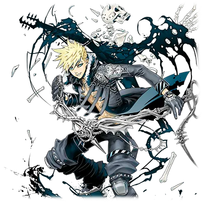
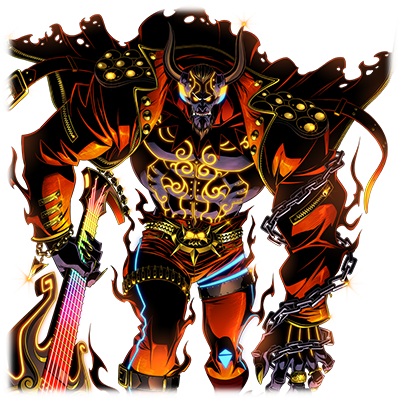

# 巴尼修（Varnish）

| 角色信息   |  |
| ----------- | ----------- |
名称|巴尼修（Varnish）
年龄|23岁
职业|视觉系摇滚乐手
最近的苦恼|有时候记忆会与经历发生冲突
对应乐曲|Guilty
| 对应版本 | Chunithm 

译者：毛颜

## EPISODE1 巴尼修

>一直在迷惑着我的，到底是“谁”……？不管如何，我一定会抓住那仍未见到的明天的！

他是一个超人气硬摇滚乐队的主唱。

他的名字，原本拼写为“Barnish”，但本人执意把名字改为“Varnish”。

“Varnish”有“清漆”、“装饰”以及“虚伪”的含义。

 

他总是在舞台上展现地非常火热，但据说私下里他是个冷酷的完美主义者。他是职业精神的化身，执着于打造观众所期待的自我形象。

 

但是，他却无法迎来未来。

有报道说他失踪了，但事实并非如此。

他被某人送回了过去，被迫重复相同的巡回LIVE……

他感到愤怒，想要寻找一个发泄的窗口。

这之中，究竟发生了什么？

为了对抗这不公的命运，追寻真相，他选择站在舞台上，继续歌唱——

## EPISODE2 时间循环的开端

>当那个副吉他手又在同一个乐句上出错，吐了吐舌头时……我才终于意识到了那件事。

我站在那里。站在被耀眼光芒笼罩的舞台之上。在撕裂般的失真音效的另一侧，观众的狂热如波涛般涌动。

这一次的Live Unit，无疑是我至今为止的企划中，最成功的一个。

处于巅峰时期的我们，陶醉在这胜利的喜悦之中。可容纳两万人的体育场的演出门票在开售三秒之后告罄，走在大街上，没有什么地方听不到我们的歌声。

未来的全球巡演早就决定好了。所有人，不管是谁都知道我的名字。

直到那一天——

 

我站在那里。在体育场演出的第三天。被耀眼光芒笼罩的舞台，持续涌动的狂热浪潮，我还没觉得有什么不对。

但当那个节奏吉他手又在同一个乐句上出错，吐了吐舌头时……我终于意识到了。

 

我本以为已经度过的昨天，依然在这里。

而我消失在了，明天的世界。

## EPISODE3 神秘的失踪，无法前往的明天

>我自己竟然失踪了……？而且这还是明天的新闻报道……这到底是怎么回事！

我依然还在这里。这里是正式演出之前的后台，我正和成员们谈论着一些无聊的话题。

 

“别随便对着镜子看，会看到不该看的东西哦。”

“都市传说？这种东西你也信？”

 

我倒是并不讨厌这样的插科打诨。

但是……他们的对话我已经听腻了。

已经慢慢快听不到了，声音像在耳朵里消失了一般。

 

看来，我已经重复了许多次第三天的演出。难道发生过的事情也会重复再发生一次吗？我不知道，完全想不出任何理由。

更奇怪的是，我竟然通过新闻得知自己失踪了并且在社会上引起了轩然大波的事实。

 

“巴尼修神秘失踪，世界巡演紧急取消”

 

放在后台的我的手机收到的新闻，日期居然显示的是明天。这到底是怎么回事？

是有人在搞大规模恶作剧，捉弄我吗？

我想确认一下。我跑出演出所在的体育场，冲向大街。这几天我都住在附近的酒店。如果去别的地方，或许能找到些线索……

 

然后，我就失去了意识。

## EPISODE4 来自过去的召唤

>当我再次醒来时，发现身处巡演的大巴车里面。 “不会吧……我又回来了？回到了更远的‘过去’”……

伴随着噪音醒来，我发现自己正坐在巡演大巴车的座位上。这辆车，正在往其他地方行进。

经理向我和乐队成员分发新打印的演出曲目表和行程安排。

内容似曾相识……正是我在前往大型体育场演出前完成的巡演计划，一模一样。

 

我用手机确认日期。是过去的日期。距离前往体育场演出，还有两周多的时间。

不会吧……时间又倒退了？回到了“过去”？

 

大巴车到达了live house，成员们都进入了会场。观众也开始排队。我虽然感到困惑，但依然下定决心，强迫自己站上舞台。

在观众面前，我始终希望展现完美的自己。

 

演出如我之前经历的那样，充满激情，圆满完成了整套曲目。

虽然演出一如既往的出色，但那种违和感却挥之不去。

观众的欢呼在我耳中变得刺耳，我开始陷入自我厌恶。

是我太累了吗……还是说，这只是我的一个无法醒来的梦呢。

## EPISODE5 未知的过去，扭曲的噩梦

>“这个写坏的纸板和破靴子是怎么回事？” 我所不知道的“过去”正在不断发生。

接下来的会场，以及再接下来的会场，我都顺利完成了演出，场场盛况空前，赢得满堂喝彩。一切顺利固然不错……但早已知道结果的成功，实在没什么意思。

然而，当我开始对日复一日的重复感到烦躁时，我也逐渐察觉到，周围出现了越来越多我未曾经历过的事实。

在后台一角，胡乱丢弃着一块写坏的纸板和一双破损的鞋子。那是我的笔迹，我的鞋子。

为什么会有这些东西？我完全不明白。

 

听贝斯手说，昨天有观众找我要签名，我接过纸板后之后又随手丢在了后台，然后直接跑去呼呼大睡。

他还说，我在舞台上甩腿时，鞋子的鞋带突然断了，鞋子飞到观众席，费了好大劲才找回来。贝斯手笑着讲起这些。

但是我完全不知道。我完全没有经历这些事情的记忆。

## EPISODE6 扩散的扭曲、空白的时间

>“我到底该相信什么……” 那些我毫无印象的事件，正折磨着我自己

不断更换演出的地点，分秒必争的行程表推动着演出继续。我平静地完成舞台表演，周围的人似乎毫无察觉，一切如常，时间仿佛没发生错乱一样正常流逝。

 

然而，我的违和感却愈发强烈。

那些我毫无印象的事件，正在不断增加。

排练时，旋律吉他手的吉他琴颈竟然断了，不得不换上备用吉他，而我直到演出前一刻才知道这件事。

排练时我明明也在场，旋律吉他手就在我旁边演奏，我不可能没注意到。

因为我也经历了排练，所以我才能正常完成演出。

但是，我真的完全没有“吉他坏了”这个事情的记忆。

 

……是因为这段时间太过匆忙，我的大脑出问题了吗？

那些记忆空白的时间让我开始怀疑自己，甚至觉得自己都不可信。

 

为了以防万一，我决定找经理谈谈。

经理狠狠瞪着我，怀疑我是不是乱喝酒或者是磕了什么药。真是的，别开玩笑了。

## EPISODE7 旋转的唱片、故意的影子

>是有人在故意让我“跳跃时间”吗？—— 我终于……产生了这样的想法。

在巡演的途中，有一天的休息时间。我打算暂时离开乐队的成员们，独自一人前往了郊外的一个偏僻的酒吧。

酒吧的角落里，摆放着一台老式的唱片机。

我突然就想起了呆在老家的朋友。

他是个既热爱音乐又钻研数学的怪人，现在应该在做音响研究。以前，他曾向我讲解过黑胶唱片的原理。

 

通过给带有沟槽的圆盘施加一定的旋转，并让唱针在其上滑动，就能按时间顺序播放声音。

不过那些DJ们可以从唱片中提取特定的声音，通过特殊的唱针或操控盘面，改变播放状态，甚至可以故意让同一段声音重复播放。

 

我的记忆就像是被操控的唱片一样，跳过了某些部分。

但其发生过的事情依旧会记录在光盘之上。

是有人故意让我“跳跃时间”了吗？

虽然我这么想，但我也没有去确认的方法。

如果能有个帮手就好了……我尝试联系那位老朋友，却始终没能联系上。

## EPISODE8 反逆之时、抗逆之药

>来创造一个与以往完全不同的“现实”吧。我想要证明，在自己的身上发生了什么。

各地的巡演也渐入佳境，但乐队经理突然提出临时进行一次录音棚录制。

 

虽然不是很感兴趣，但我还是答应了下来。

我们这个乐队现在正处于巅峰期，应该录制一次保存下来。

 

不过到了决定录音的日子，我自顾自决定不去录音棚。

我想证明，自己身上到底发生了什么。

 

我将自己牢牢绑在酒店的床上。虽然并非本意，但我还是用了药物，在深度睡眠中切断自己的意识。随即，眩晕与困意席卷而来。

 

下一瞬间，我发现自己正站在录音棚的调音台前。

乐队成员和乐队经理都在场。负责混音的工作人员询问我音量平衡的问题，监听音箱里回响着我自己都不记得的尖锐的歌声……

 

那个时候我的身体上既没有自缚留下的伤痕，也没有药物带来的倦怠感。在这里的，真的是我自己吗？

## EPISODE9 无止境的乐句

>在舞台的另一侧，观众还在等待着我。我开始歌唱。

我和乐队的成员们，再次回到了那个有着大型体育场的城市。巡演取得了圆满成功，录音也顺利完成。可以说是凯旋而归。

然而，我却几乎感受不到成功的喜悦。

毕竟自己的记忆断断续续，这也难怪……

在巡演途中，我曾几次尝试向乐队成员或经理解释我周围发生的奇怪现象，但他们要么认为我在开玩笑，要么只是招来无谓的担心。

 

住进了和上次一样的酒店，和上次一样进入了后台。

体育场的舞台另一侧，超过两万名观众在等待着我。我绝不能退缩。

 

我开始歌唱。耀眼的聚光灯。撕裂般的失真音效点燃了观众席的热情。声音与人群交织成波涛。波浪层层叠加，愈发壮大。

不知不觉，我沉入了这波涛之中。歌声持续。意识逐渐模糊，但我依然用力地歌唱。我察觉到一个短促的乐句在不断重复……就像，有永不枯竭的力量在控制一般。

## EPISODE10 支持与狂热、意志与骸骨

>我所追求的荣耀，充斥于此处。但是，这也并非我的本意。

站在舞台上，我中断的意识逐渐苏醒。在这场体育场里的演出大概过去了数十小时。

我依旧还在卖力演唱《罪》这首歌。一直唱着这首歌……不知道唱了几百次副歌。

但我与乐队成员们毫无疲惫，毫无下场的意思，观众席的热情也持续高涨，毫无停歇。支持与狂热。这是我在舞台上一直追逐的荣耀。此刻，这个体育场充斥着我一直所追逐的荣耀。

 

如果我们能永无疲劳、永无厌倦地在此演奏，永远得到众人的赞美，那难道不是一件令人愉悦的事吗？

或许是的——但这并非我现在的意志。

 

我扔掉了麦克风。

不顾呆然的成员与观众，我走向舞台侧翼，穿过后台，离开会场。

街头传来录制好的我的歌声，震耳欲聋，我不由得呻吟着捂住耳朵。

但即便如此，我也绝不回到体育场。

我再也不想回去。

 

避开人群，我走进一条昏暗的小巷。那里不知道是谁丢弃了大量的镜子。

我站在镜子之间，脑海中突然浮现出后台的闲聊时的话。

 

“别随便对着镜子看，会看到不该看的东西哦。”

镜中的倒影相互反射，映出我无限重复的样子。

我的……样子。

在重重叠叠的倒影背后，有什么东西在悄悄靠近。

一具白骨。骷髅。

是它……我想起来了。

我的身体，正被白骨恶灵紧紧包裹住。

## EPISODE11 过去的约定、未来的誓言

>曾经的我，确实在内心深处许下过愿望。但是…… “我绝对不会屈服于你，我一定会前往未知的明天！”

我透过镜子凝视白骨恶灵，刹那间明白了一切。

 

能登上体育场馆的舞台是众多音乐人的梦想。

如果我能在那里歌唱，未来又算得了什么？

就算把明天交给恶魔或恶灵又何妨？

曾经的我，内心深处确实这样期盼过。

但这已经是过去式。

 

然后——

恶灵从我的名字中抽走了“r”，在空中拼写出来。

“Vanish”，意为消失。

 

你就是这样夺走了我的明天吗？

你想让我在体育场永远歌唱，让我永远无法抵达明天？

 

——别开玩笑了。

我从未与你这恶灵达成任何约定。

我现在的成功都是靠我自己奋斗而来的。

 

我一脚踢碎了镜子。

即使那些镜子碎了，白骨恶灵仍然不会消失。

我的意识瞬间遁入模糊。

那一刻，我第一次清晰地感受到被恶灵“跳跃时间”的感觉。它夺走了我的明天，将我的灵魂拖向过去——

　　　×　×　×

——这是怎么回事？

在“跳跃时间”的过程中，我居然窥视到了“明天”。

在遥远的炼狱尽头，烈焰熊熊之地，有一个人影。

那家伙嘲笑着我，却也在责骂我的恶灵的行为。

 

对了……我又想起了一件事。

恶灵不断将我拖回过去。

因为炼狱的“神”，在明天等着我。

为了将我的未来彻底焚毁。

 

即便如此，我也要抗争到底。

这世纪。这命运。

我绝对不会屈服于你。我的未来，由我自己决定。