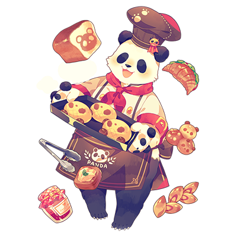
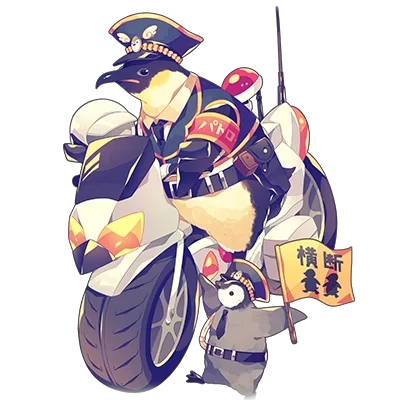

# 五代

| 角色信息   |  |
| ----------- | ----------- |
名称|五代
年龄|3岁
职业|大学生，打工者
| 对应曲   |lucky omen
| 对应版本 | Chunithm Luminous

本故事neta自网络漫画《100天后就会死的鳄鱼君》。

## EPISODE1 3个月后的未来

>离三个月后还早着呢，没必要那么在意也可以的吧！

我的名字叫五代。

是个随处可见的大学生，目前在书店打工。

你问我为什么在书店？

那是因为，我的梦想是要成为一名绘本画家。

每天，只要被许许多多的书包围着，各种想法就会不断涌现出来。

 

“喂，五代，有空吗？”

“忠兵卫啊，你看看我哪儿有空，我在打工呢。”

“我知道哦。”

“你知道还问啊——！”

“对了，你看看这个。”

“嗯？什么什么？”

 

忠兵卫给我看的是我在SNS上发布的插图。

 

“啊，是我的画。如何如何，画得不错吧。”

“当然画得很好呀。不过我想说的是，你只画了图，连个人物对话都没有。”

“啥？插画要什么台词？”

“我是说，如果你想要成为绘本画家，你就得学会画有故事的图集。”

“诶，这个……啊啊忠兵卫，你知不知道啊，最近那个很有名的占卜师！”

“又岔开话题了……那，是什么人呢？”

“很感兴趣吧！”

“别卖关子了，快说！”

“我听经常来的一个兔子客人说，咱们这附近有个无论是谁都能猜中未来的占卜师。”

“可那是占卜啊，又不是预言。”

“啊，没兴趣？”

“不，我很感兴趣。”

“那打工结束后一起去吧！”

“嗯，反正闲着没事，就陪你一起去吧。我去打发打发时间。”

 

打工结束之后。

我和忠兵卫会合，一起去了听说来的占卜师那里。

来到看起来很神秘的占卜馆前面，忠兵卫的脸色似乎并不好。

“虽然有点破破烂烂的，但就是因为这种地方感觉才会藏着很厉害的人吧？”

“我懂的。”

“好，去看看吧！”

 

我和忠兵卫走了进去。

桌子上放着水晶，桌子后面坐着一位一看就是占卜师装扮的老婆婆。

 

“……你想占卜什么？”

 

虽然戴着兜帽，但还是能看出这位老太太是一只驴。

我想不出来要占卜什么，于是忠兵卫先坐在了对面的椅子上。

 

“呐，我能成为有钱人吗？”

“原来如此，那就让我来看看……”

 

说着，占卜师把手放在水晶上，开始嘀嘀咕咕地说些什么。

过了一会儿，占卜师缩回手，断断续续地说起来。

 

“你成为不了有钱人，但是，小日子似乎过得还不错。”

“真的吗？真走运！只要不会因为钱而困扰就行。”

“下一个，到我了！”

 

我坐在忠兵卫刚刚坐在的椅子上，问了一个如论如何都想要知道的问题。

 

“我想要成为绘本画家。能成吗？”

“难道不是看你的努力吗？”

“忠兵卫我没问你！”

“好好好。”

“行了行了，让我来好好看看。”

 

和刚才一样，占卜师把手放在水晶上。

虽然很期待结果，但是占卜一直都没有结束。

 

“呐，占卜师小姐，该不会这家伙成不了绘本画家吧？”

“……好奇怪啊。”

“什么呀？”

“我想看看你的未来，可是我看不见。”

“什么意思？”

“我也是第一次遇到。100个月……不对，三个月后的未来我都看不到。”

“这么具体的吗。三个月后会发生什么哦。”

“嗯……我也没计划预定到三个月之后啊。”

“你这家伙连这周的计划都没决定好吧。”

“还真是！”

 

在我们笑着的时候，占卜师沉默的把手从水晶上拿开。

 

“我只能说三个月后请小心……”

“你不知道会发生什么吗？”

“看不见呢。这是为什么……”

“那就没办法啦。我们走吧，五代。”

“嗯，谢谢你，奶奶！”

 

我和忠兵卫走出占卜馆。

那时我并没有特别在意占卜的事。

在意也没用，而且——

 

“占卜什么的果然靠不住啊。”

“就是啊——”

## EPISODE2 一如既往的日常

>我想和兔子君搞好关系，但是应该靠什么呢？

去了占卜后的第二天。

我一如往常一边在书店打工一边看书。

这时，忠兵卫来了。

 

“哟，有空吗？”

“我哪有空啊。一看就知道了吧，我抽不开手。那么，你来干什么？”

“我当然来找你啊。”

“啥玩意儿嘛。”

“你是不是很在意占卜的事？怎么样？有发生什么事吗？”

“不，当然没什么事啊。”

“果然呐，我早就知道了。”

“对对对，你早知道了。”

“唉，三个月还早呢，相信这种不知道会发生什么的占卜也没用啊。”

“说的是呢。”

 

聊着聊着，店门开了，一个客人走了进来。

是昨天告诉了我占卜师的兔子。

 

“啊，兔子先生。昨天，我去了昨天你说的那个占卜师那里。”

“……怎么样？”

“果然没搞懂！”

“……这样。”

 

说完，兔子随手拿起一本书开始读。

本来还想期待其他答案来着。

 

“话说，你打工结束之后，要不要去哪里玩玩？”

“街机厅吧，街机厅！”

“好啊，我再来暴打你一次。”

“偶尔也手下留情吧！”

“这可不行，游戏最重要的不就是认真决胜负吗！”

“怎么这样！”

“那，明天再一起去玩吧！”

“OK！啊，对了！话说，兔子先生要不要一起去玩啊？”

“……诶？”

 

可能是因为我突然转过话头的缘故，他的反应有点慢。

兔子一脸的困惑和焦虑。

 

“笨蛋！”

“啊好痛！”

 

不知为何，忠兵卫敲了我的头。

“突然被不认识的人邀请可是会很困扰的。”

“不过，老是在店里聊天，偶尔一起出去玩玩也是没问题的吧！”

“……对不起。”

 

兔子说着低下头，走出了店门。

 

“啊，走了。”

“是这样啊。你好好想想怎么和和其他人处好关系吧。”

“不过，我也不是这么和忠兵卫你成为朋友的吗？”

“所以，你要感谢我这么温柔啊。”

“啊哈哈，那确实！”

 

之后又和忠兵卫聊了几句，打工也差不多结束了。

等明天兔子先生再来店里的时候，再和他道歉吧。

## EPISODE3 与邻居们的交往

>多谢了潘达的协助，我才能画出这样光是看起来就很美味的画！

今天休息，不用打工。

想去街上走走。

其实我还是很在意忠兵卫说的话。

如果想成为绘本画家，那就需要有所行动。

 

“有什么能成为绘画素材的东西吗？”

 

虽说是到街上了，但没想好要去哪里。

有什么想画的东西就随便画画吧——这样的感觉。

 

“嗯？嗅嗅，这气味是……面包！”

 

被让人不知不觉肚子空空的气味勾引，我来到了潘达潘达的面包店“West & East”。

“五代君，欢迎光临！”

“你好！”

“今天也要买面包吗？都是刚烤好的，很好吃哦！”

“那个，买什么呢……啊！不对不对，我今天不是来买东西的！”

“什么意思？”

于是我告诉潘达，我正在寻找适合在绘本里出现的场所。

于是——

 

“那我们家如何？绘本里的面包店，不觉得很不错嘛？”

“说的也是！”

 

因为有潘达先生的帮助，我决定画一张面包店的画。

接下来就是决定来画什么了。

 

“啊，是兔子先生！”

“你，你好……”

 

准备开始画画的时候，刚好和准备进入面包店的兔子先生打了个照应。

 

“上次对不起，吓到你了。”

“没什么，我不在意……”

“这样啊，太好了！”

“五代君和户崎君认识吗？”

“也不是认识，只是经常在书店里碰面而已。”

“咦，原来你叫户崎啊，我叫五代，请多指教！”

“对了，户崎君。五代君说想画店里的画，你也来帮忙吧。现在正好客人少，你可以当模特吗？”

“啊，我来吗？”

“如果你能帮忙的话，我会给你好吃的面包！”

“我也拜托你了，我会好好画的！”

“……我知道了。而且这里的面包很好吃。”

“太棒了，谢谢你！”

“……快点开始吧，早点开始早点结束。”

 

我把户崎君和面包店老板一起画在素描本上。

这时其他客人也进来了，店里变得热闹起来。

把这热闹的样子全部画在画上。

老板和顾客们的笑脸也是。

 

“果然大家的笑脸让人很温暖啊，我也能画出那样的绘本吗？”

 

虽然还不知道能不能做得更好，但能让人感到温暖，让人露出笑容。

我想要做出那样的绘本。

## EPISODE4 大人的工作

>果然警察什么的真的好帅，我一定要画进绘本里！

今天大学的课程结束了，也没有打工，所以和忠兵卫一起在回家的途中到处转转。

还没决定好去哪里。

 

“再不决定好的话那就直接算了吧。”

“那就解散？”

“等等，还是先去吃点什么吧。”

“感觉挺不错。”

 

我们边走边聊，忠兵卫突然把手机递给我看。

 

“你这家伙的画，最近好像很火的样子。”

“对对对，最近点击量好多！很厉害吧！”

“真的很厉害啊。”

 

最近，我的插画浏览量增加了许多。

虽然还没有在图中加入角色的台词什么的，不过在投稿的时候一起写在了简介里面。

 

“这样就挺不错的。”

“终于听到你夸我了，真的很高兴啊。”

“我是在夸你，但也别太得意。不过，绘本作家就是这样一步一步发展的。”

 

边笑边聊着，走到了十字路口。

 

“十字路口是容易发生事故的地方，即使是绿灯也不要忘记确认左右方向。”

“好——！”

 

顺着声音传来的方向看去，原来是潘德拉警官正在教孩子们交通规则。

“潘德拉先生真的很辛苦呢。”

“偶尔也教教我嘛。”

“……对了！我还随身带着素描本呢！”

 

我拿出素描本，奔向潘德拉先生。

 

“啊，喂！”

“潘德拉先生，你好！”

“哦呀，这不是五代和忠兵卫吗！我现在很忙，有什么事能不能过一会儿？”

“我有个请求想拜托您，请您当我画里的模特吧！”

“模特？”

 

我告诉潘德拉先生我为了绘本要画许多插画的事情。

 

“绘本，听起来不错啊。可以当作给孩子们讲交通规则的好素材。”

“非常感谢！”

“喂，你这家伙，不是说好要一起去玩的吗！”

“啊，对不起！”

“唉，没必要道歉，本来就是我怂恿你走这条路的。不过，可别后悔啊。”

“后悔什么？”

“我啊，最近在游戏方面手感超顺的。”

“嗯，我很期待再来过过招。”

“那这样，我就先走了。别回家太晚哦。”

“好的！”

 

我一边画着潘德拉先生和孩子们的画，一边思考这幅画要呈现一个什么样的故事。

在画里融合进教育交通规则之类的，感觉会很开心。

想画这样的内容。

 

“好的，完成了！”

 

周围完全暗下来的时候，我的画终于完成了。

 

“结束了吗？”

“谢谢你，潘德拉先生，还陪到我这么晚。”

“不用了，孩子们都回去了，我今天也不忙。回去的话要不要我送一送你？”

“没关系，我一个人可以回去的。我又不是小孩子了！”

“是吗，那就好。不过，大人也是会出事故的。回去的时候要注意安全哦。”

“好的！”

 

我向潘德拉先生打招呼告别，一个人急匆匆往家赶。

 

“居然都这么晚了，赶紧回家吃饭吧！”

 

我站在斑马线前面等着绿灯。

虽然很着急，但因为刚刚画了关于交通安全的插画，所以我也要好好遵守。

绿灯亮起的同时，我穿过斑马线。

准备过马路的下一个瞬间——

 

“诶……？”

 

那辆车突然出现在了我的面前。

就像是按下了暂停键的视频一样，整个世界似乎突然停止运转了。

这时，我的脑海里突然想到，好不容易画出来的话不能给忠兵卫看了，真的很遗憾。

——之后，我的身体就这样飞向了空中。

## EPISODE5 事故

>虽然多亏了潘德拉先生我才得救，不过，果然平时还是要多加小心呢。

身处完全漆黑的世界中。

也不知道眼睛是睁着还是闭着。

身体完全没有感觉。

不过，又好像能听到从哪里传来了声音。

 

“喂，五代！为什么，这是为什么啊！”

 

是忠兵卫的声音。

为什么他看起来那么悲伤呢？

对了，给他看看我的画吧。

我想要爬起来，但是做不到。想伸手去摸，却什么都摸不到。

 

“对不起，如果我当初送他回家的话……”

“五代君，说真的为什么会……！”

 

是潘德拉先生的声音。

但是，另一个声音是谁的呀？

好像有点印象。

 

——这究竟是什么。

有种不可思议的感觉，就像是在做梦，看到了另外一个自己一样。

 

“喂，五代，你这家伙在做啥？”

 

脑袋啪的被敲了一下，猛然清醒了过来。

 

“欸？忠兵卫？”

“忠兵卫？我说你啊，发生了那么大的事故居然还悠闲地躺着。”

“哦，啊啊！”

 

我躺在医院的病床上。

对了，之后被送到医院做了各种检查——

 

“你这家伙真的没有受伤吗？”

“嗯，真的没事！”

“真是的，别吓我啊，我真的很担心你呢。”

“抱歉抱歉。”

“五代没说错，谁叫你不好好听完电话。”

 

边说着走进来的是潘德拉先生。

 

“我刚想告诉你五代没受很严重的伤，你就把电话挂了。”

“啊，那是……”

 

虽然不知道他们在电话里说了什么，不过看样子这次是忠兵卫难得的判断失误了。

 

“也罢，为朋友着想是好事。”

“知道了……”

“没关系的，忠兵卫。正如你所见，我的命可是很硬的，稍微出点小事故也不会死的！”

 

看到忠兵卫一脸担心的表情，我为了表示自己很健康，做了个胜利手势。

 

“看起来确实。”

“当然！”

“不过，这次运气很好，我碰巧跟在你后面，所以我才能救下你。”

的确如此。

好像是潘德拉先生在出事前一刻救下了我，我才能得救。

“英姿飒爽地出现并出手相助，简直就像英雄一样！”

“……啊啊，是这样啊。”

“有什么在意的事情吗？”

“没什么，可能是偶然吧。最近那个十字路口好像经常发生交通事故的样子，我才去巡视来着。”

“原来是这样啊。”

“然后你来了这个十字路口，我提了个心眼在你回家时跟着你，这才避免了事故。”

 

原来还有这种偶然。

幸亏得救了，看来今年运气真不错。

 

“对了，那只兔子也来给你探病了？”

“兔子，是说户崎君吗？没有哦，我没看到他来病房。怎么了？”

“没，我刚刚在门口碰到了他，还以为是他来探望你的呢。”

“嗯，大概是因为别的事情吧。我可没跟他说过我在这个医院。”

“这样。这也是偶然吧？”

 

之后，我向潘德拉先生道谢，同忠兵卫聊到很晚。

 

“这么说来，春天快到了。要去赏花吗？”

“当然要去！”

“那就说好了哦。”

 

多亏了潘德拉先生的救助我们才能在这里聊这种无聊的话题。

但是，那个奇怪的梦又是怎么一回事呢？

## EPISODE6 无限轮回的世界

>无论多少次，不管轮回多少次，如果是为了拯救你的话，我……

樱花盛开的人行道。

花瓣飘落到地上，形成了漂亮的地毯。

 

“不行了……”

 

捡起掉在路边的手机。

手机上面显示着他们愉快地聊天的聊天记录。

* * * 

你到哪里了？

我在来的路上哦

你好慢

在过来啦

对了，给你看看

【这条消息之后是一张很漂亮的樱花照片】

很漂亮吧？

* * *

那条消息之后交流到此中断。

更准确来说，待发送窗口还有未发送的消息。

 

“明明已经到这里来了……”

 

这样就能得救了。我是这么想的。

我以为已经安全度过决定命运的三个月了。

为什么最后的结局总是这样？

 

“等着我，我一定会救你的。你是我第一个交到的朋友……”

 

——然后，时光再次倒流。

在眼前展开的是或许有可能存在的世界。

 

“喂，五代！为什么，这是为什么啊！”

“对不起，如果我当初送他回家的话……”

“五代君，说真的为什么会……！”

 

忠兵卫在他的面前泣不成声，潘德拉先生正在安慰他。

并且，我也在他旁边。

 

——时间继续倒流。

下一站是潘达潘达的面包店“West & East”。

 

“呐，户崎君可以来当我画画的模特吧？”

“如果我能做到你当然可以帮你。你一定要把我画得很帅哦？”

“包在我身上！”

 

在面包店里面，五代君以我为模特开始速写。

——这都是我经历的过去。

 

“街机厅吧，街机厅！”

“好啊，我再来暴打你一次。”

“偶尔也手下留情吧！”

“这可不行，游戏最重要的不就是认真决胜负吗！”

“怎么这样！”

“那，明天再一起去玩吧！”

“OK！啊，对了！话说，兔子先生要不要一起去玩啊？”

“……诶？”

“喂，这么突然邀请别人的话……”

“我，我也想和你们一起！”

“好啊，一起玩吧！”

 

真的是非常开心的日子。

一起玩游戏，一起讨论画怎么样的绘本，一起聊了很多很多。

 

——又回到这里来了。

我和五代君相遇的那一天。

 

“这次一定要……”

 

我用力握紧随着时间流逝变得破烂不堪的素描本。

我一定要改变命运给你看。

为此，不论是几十次还是几百次，我都会重新来过。

然后，我推开了店门。

 

“欢迎光临——。哦，是新来的客人呀，请到处看看吧。”

“……你好。”

## EPISODE7 赏花

>真期待能和大家一起赏花呢！户崎君也一定会来的吧！

天气渐渐暖和了起来。

走在路上，绽放的樱花映入眼帘。

 

“已经是樱花的季节了呀——”

 

想着想着，忠兵卫给打了个电话过来。

他说，等到樱花完全盛开的时候，大家一起去赏花吧。

 

“可以呀！”

 

我兴致勃勃地回复道，提议多叫几个人一起去。

不错啊，忠兵卫这么回道，于是开始讨论邀请谁。

先是潘达先生，然后是潘德拉先生，还有最近照顾过我的人的名字都被提到了。

 

“啊，对了。”

 

我对忠兵卫说我还有个无论如何都想邀请的人。

在电话那头，忠兵卫很快就明白了我说的是谁。

 

“不愧是你啊！”

 

也许会被拒绝吧，但是不先去邀请的话就什么都不会发生。

无论如何，如果他能来店里的话就去邀请他吧。

 

“对了，在赏花日到来之前完成绘本吧！”

 

从忠兵卫这么说的那天起我就一直在努力画画，已经完成了不少。

这样一定能做出很棒的绘本。

不管如何，绘本完成后给忠兵卫看的话，一定会大吃一惊的吧。

故事也准备好了，如果继续制作的话一定来得及。

 

“啊……但是，主人公还没决定……”

 

突然意识到最重要的事情还没有决定。

怎么办，真的来得及吗？

 

“对了，有个很不错的人选！”

 

我向适合主人公的人选所在的地方赶去。

既然要请他当模特，最好先征得他本人的同意。

我打开书店的门。

站在那里的是户崎君。

 

“啊，在这里！”

“什么？”

“呐，请你做我绘本的主人公吧！”

## EPISODE8 三个月后的未来

>和大家一起见到的，是十分漂亮的樱花。如果明年还能一起来的话，就更好了！

——约好的赏花的当天。

 

“终于，完成了！”

 

我目不转睛地看着刚完成的绘本。

封面是主人公的兔子笑着跳来跳去的样子。

那是当然，因为就是照着户崎君来画的。

我认为这是我自己也能满足的最高水平。

正当我沉浸在成就感之中时，手机收到了消息。

 

“是什么？”

 

看了看手机，是忠兵卫发来的消息，“还没来吗”。

 

“什么！”

 

我慌忙确认了一下，却发现现在早就过了约好的集合时间。

专心做绘本忘记确认时间了。

 

“这下，糟糕了！”

 

我赶忙联系忠兵卫说马上就出发，迅速做好出门的准备。

冲出家门的同时还收到了催促我快点来的信息。

 

“这个，给他们看到的话，一定会吓一跳的！”

 

我抱着做好的绘本，意气风发的赶向赏花的地方。

在去的路上也不停地妄想着大家会有怎样的反应。

 

“啊，好险好险。”

 

在想事情，差点没注意到斑马线亮起了红灯，差点闯了过去。

这么说来，我之前在这个十字路口差点出车祸，被潘德拉先生救了。

 

“那个时候太危险了，还好运气好被潘德拉先生救了下来。”

 

我一边想着，一边经过变成绿灯的斑马线，收到了忠兵卫的消息。

 

“真是的，又在催我了吗？”

 

果然不出所料，果然是催促我的消息。
* * *

你到哪里了？

我在来的路上哦

你好慢

在过来啦

对了，给你看看

 

“是什么呢？”

 

一会儿，忠兵卫发来了一张漂亮的樱花照片。

 

“好漂亮！那个——呜哇！ ？”

 

我正要回信给忠兵卫的时候，突然有人从背后一把抓住我的胳膊，把我往后拉。

 

“好痛！你干什么——”

“别动！”

 

我被叫声吓得身体一屁股坐在原地，下一秒，眼前的汽车便以惊人的速度疾驰而过。

 

“呜哇！好危险！”

 

如果我继续走过去的话，可能会撞上那辆车。

想到这里，冷汗涌了出来。

 

“没事吧？”

“啊，你是！”

 

拉着我胳膊的是户崎君。

户崎君向一下子发生了很多事情而陷入混乱的我伸出了手。

 

“站得起来吗？”

“嗯，谢谢！”

 

我拉着他的手站起来。

 

“啊！我的绘本！ ？”

“在这里哦。”

 

户崎君递给我我的绘本。

太好了，虽然有点脏，但至少没有破损。

 

“真是太好了……”

“比起绘本还是多担心担心你自己吧。”

“啊，嗯，是啊……啊，怎么了？哪里受伤了吗？”

“……什么？”

“你看，你都快哭了。”

 

不知道为什么，户崎君一副快哭出来的表情。

可能是被指出来了，他把头转了过去。

我想知道为什么，但还有别的事情想说。

 

“谢谢你救了我。还有，你能来赏花，我很高兴！”

“毕竟我有空闲的时间能去……”

“啊对了，现在已经过了集合的时间，我们得赶快了！”

“啊，等等！？”

 

我拉起户崎君的手开始跑。

不快点去的话忠兵卫又会催我。

 

“总算是，救下来了……”

 

户崎君像是在说什么，但我没听清楚。

几分钟后。

我和户崎君一起赶到了赏花的地方。

 

“好慢。话说，你俩一起来的？”

“嗯，刚好碰巧遇到了。”

“原来如此，来，我们开始吧。”

 

在那里，我们招待来的潘达先生他们都坐在地毯上。

我们也一起坐下。

 

“对了，我有东西要给你们看！”

“是什么！？”

“这个啊，可是个惊喜！”

 

我很紧张，不知道他们看完会有什么反应。

我有点不好意思表现出来，我想我的脸就像樱花一样红。

 

“对了，怎么样？”

“什么怎么样？”

“真是的，抬头看看啦。”

 

从这里抬头仰望，满眼全都是各种各样的樱花。

比那张照片里面的要好看好多。

户崎君好像也看樱花看入迷了。

 

“怎么样，很漂亮吧？”

“嗯，真的很漂亮呢！”

