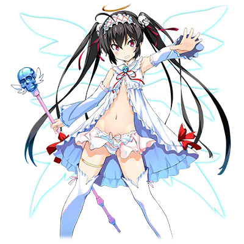
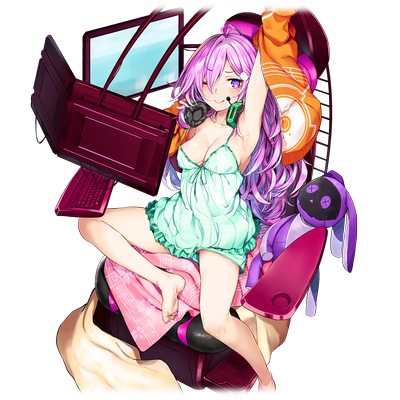
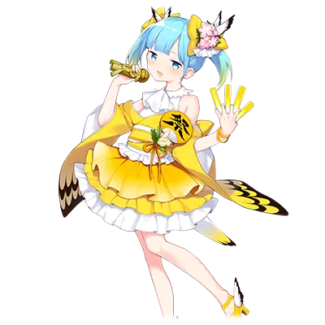
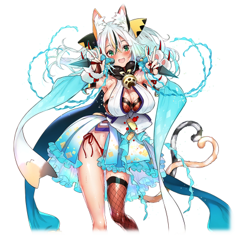
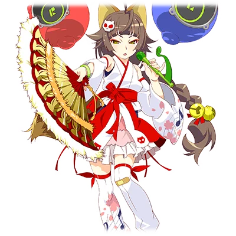
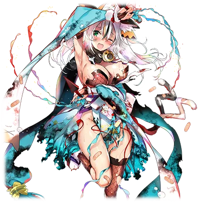

# 大天使·尤丽娅

| 角色信息   |  |
| ----------- | ----------- |
| 名称    | 鬼蝮尤丽娅 |
| 年龄   | 16岁      |
| 职业 |  愚民的象征以及盟主 |
| 对应曲   | 大天使ユリア★降臨！
| 对应版本 | Chunithm Crystal Plus|

译者：毛颜

## EPISODE1 <ruby>炎之秋叶原偶像<rp>（</rp><rt>炎のアキバアイドル</rt><rp>）</rp></ruby>

>大天使，于秋叶原的中心呐喊着。御宅族与<ruby>派对咖<rp>（</rp><rt>パリピ</rt><rp>）</rp></ruby>的命运，这一切都托付给她了。

（恶搞了SQUEEZ的《炎の孕ませ同級生》）

这里是前情提要！

嗨！大家早上好～！

我是天才美少女冒险家英格丽特的说！

书接上回，我们终于潜入了秋叶原的地下。

在一片漆黑的空间中，与桃子的悲鸣一同前进的我们，在那前方居然遇到了正等着我们的云雀和虎彻的说！

本以为大战一触即发，没想到虎彻带着我们去了她的秘密基地。真是意外的温柔的说。

……才怪。带我们去秘密基地的理由，是让我们再一次领教“<ruby>阿宅之环<rp>（</rp><rt>オタク・ハイロウ</rt><rp>）</rp></ruby>”的威力的说！

真是个恶毒的女人！

让大家亲眼目睹了横滨被染上御宅族色彩的虎彻，告诉了我们她的最终目的。

位于日本中心的最大的<ruby>派对咖<rp>（</rp><rt>パリピ</rt><rp>）</rp></ruby>设施“环球影城”。

她们的计划就是，把“<ruby>阿宅之环<rp>（</rp><rt>オタク・ハイロウ</rt><rp>）</rp></ruby>”射向那里，让其御宅化之后，统一全日本！

魔大陆已经开始向西移动，下一个目标是湘南的说。

为了阻止她们，爱理用魔法将钢太郎扔了出去。

但是！谁都没预料到的情况发生了的说！

居然是<ruby>派对咖<rp>（</rp><rt>パリピ</rt><rp>）</rp></ruby>……好多<ruby>派对咖<rp>（</rp><rt>パリピ</rt><rp>）</rp></ruby>！一个个都降落在了漂浮的秋叶原上面。

<ruby>派对咖<rp>（</rp><rt>パリピ</rt><rp>）</rp></ruby>们用好大的音量播放噪声一样的音乐，并且将秋叶原的御宅族们洗脑成一个又一个的<ruby>派对咖<rp>（</rp><rt>パリピ</rt><rp>）</rp></ruby>的说！

不仅如此还到处拍照片，还在大街上开始喝酒烤肉的说！

再怎么说也实在是太过分了！虽然肉看起来很好吃……

我们只能从秘密基地观看这一幕的说。

并且，江户的偶像现在谁都不在的这个瞬间正好是好机会。

爱理再一次用魔法让钢太郎飞出去，撞到一个接一个的操作员身上让他们失去意识，成功夺取了控制系统的说。

但是没有人能够操纵控制系统！都丽美甚至还掏出了吉他砸坏了一块控制面板的说。

尽管如此，也只是砸坏了个面板，事态并没有什么改变。就在我们伤脑筋的时候，又突然听到了爆炸声的说。

正想着发生什么事情的时候，屏幕上居然出现了尤利娅的身影的说！

明明好不容易找到了尤利娅，她却全身散发着白光飞走了！

等到光柱消失的时候，出现在秋叶原上空的，是张开天使般白色翅膀的尤利娅的说！

虽然不太清楚是怎么回事，但实在是太美了……！

就在我看得正入迷的时候，爱理突然朝着地面走去的说！？

等一下！我也一起去的说！

以天使的姿态出现的尤利娅。

秋叶原的未来又将何去何从？

敬请期待！魔大陆冒险谭第四集！

## EPISODE2 绝对防卫领域！

>看到尤利娅再度复活，爱理等人由衷感到欣喜。然后，水晶骷髅的谜团终于真相大白。

（恶搞了Rio的《絶対領域っ！》）

在虎彻的秘密基地之中。在桥上面放着的监视器屏幕上，映出了化身为天使的尤利娅的身影。
 

虽说是隔着屏幕，但5人依旧被尤利娅的身影深深吸引。

 

“姐姐……姐姐！”

 

最先作出反应的是爱理。

爱理哭喊着冲向前往地上的电梯，桃子和英格丽特也赶忙追了上去。

都丽美和钢太郎刚想追上去，视线又停留在了另一台监视器的屏幕上。

 

“是静乃酱和笑瑠酱！钢酱，我们快去救他们吧！”

 

都丽美不容分说地拖着钢太郎走向控制装置。

尤利娅降落在了UGX的广场前。

这时，爱理他们也一同跑了过来。

 

“姐姐！”

“爱理？！为什么你会在这里……”

 

爱理一边叫着姐姐，一边抱住了尤利娅。

虽然对爱理出现在魔大陆感到惊讶，但尤利娅还是温柔地抚摸着爱理，让她放松下来。

尤利娅一边照顾着爱理，一边看向另外的两人。

 

“你……该不会就是桃子小姐吧？”

“哈？你怎么会知道！？”

 

桃子看着好不容易相聚的姐妹俩，刚想松一口气就听到了这句突如其来的话，忍不住尖叫起来。

 

“我当然知道！毕竟是几年前还在网上大热门的——”

“呜哇——！行了行了别再说了！”

 

桃子大声喊道，仿佛要盖过尤利娅的声音一样。

桃子并不讨厌偶像时代的自己。

但能不能面对面和其他人讨论当时的事情，又是另一回事了。

 

“那个……尤利娅……”

 

在桃子还在害羞的扭动身体时，英格丽特开了口。

她的脸上没有了往日开朗的神情。

 

“你没事真是太好了。不过都怪我，才会发生这种事情……”

 

由英格丽特带来的水晶骷髅。与尤利娅接触的结果就是把她卷入了其中，让秋叶原变成了魔大陆飞了起来。

虽然她在努力表现得很轻松，但毕竟事件的起因还是因为自己，多少会有点在意这一点。

尤利娅对这样的英格丽特摇了摇头。

 

“这并不是你的错哦。并且，接触了水晶骷髅也让我了解了很多。”

 

尤利娅开始说起了水晶骷髅的事情。

水晶骷髅，原本是期望着一个能对御宅族温柔以待的世界，就此死去的御宅族们的怨念集合体。

被那些<ruby>派对咖<rp>（</rp><rt>パリピ</rt><rp>）</rp></ruby>们所欺压施虐，含恨而死的御宅族的怨念，对拥有强大偶像之力的尤利娅做出了反应，从而让想要复仇的虎彻等江户偶像复活了。

 

“水晶骷髅，没想到会是御宅族们的怨念……”

 

得知自己所追求的水晶骷髅的真面目，英格莉德难掩惊讶之情。

 

“然后我就被复活的虎彻她们要求去帮忙。”

 

但是，虽然尤利娅赞同虎彻要创造一个御宅族天堂的目标，但因为并不同意使用洗脑这样的极端手段，被捕获作为了控制装置的力量而被使用。

 

“可是，你一个人又是怎么逃出来的？”

“水晶骷髅是御宅族们灵魂的集合体，在其中也有那些不怨恨<ruby>派对咖<rp>（</rp><rt>パリピ</rt><rp>）</rp></ruby>，只是真心热爱着御宅文化的灵魂。那个灵魂，在秋叶原的危机中帮助了我。”

 

结果，尤利娅作为大天使降临在了这个魔大陆。

就在交换情报的时候，魔大陆突然出现了不同以往的晃动，爱理他们不由得发出了悲鸣声。

只有尤利娅露出了严肃的表情。

## EPISODE3 Dead of the Akiba

>因为<ruby>派对咖<rp>（</rp><rt>パリピ</rt><rp>）</rp></ruby>即将濒临坠落的魔大陆秋叶原。现在只能眼睁睁看着了吗？还是说——」

（恶搞了Fairytale的《DEAD OF THE BRAIN ～死霊の叫び～》）

在尤利娅她们俯下身抵御强震的时候，救出了静乃和笑瑠的都丽美她们向着尤利娅她们的所在飞奔而去。

 

“这里是怎么回事？”

“啊，秋叶原居然……！”

 

在街道上，古狗礼品卡漫天飞舞，各种爆音的dubstep充斥着整条街道。

看着到处烤肉喝酒开趴体的<ruby>派对咖<rp>（</rp><rt>パリピ</rt><rp>）</rp></ruby>把这条街道弄得乱七八糟的样子，笑瑠和静乃感到惊愕不已。

 

“尤，尤利娅酱！到底发生了什么！”

“哇！天使！天使降临了吗！”

 

看到笑瑠和静乃的反应，尤利娅严肃的表情稍微缓和了一些。

然后说着“接下来我会说明一切”然后解释起来。

 

“现在，秋叶原正在一点点往地面坠落。”

 

爱理等人因为尤利娅的话感到震惊起来。

刚刚的剧烈晃动，就是因为魔大陆开始下降所产生的。

 

“魔大陆虽然是因为御宅族之力浮在天空上，但因为<ruby>派对咖<rp>（</rp><rt>パリピ</rt><rp>）</rp></ruby>的侵略，现在御宅族之力正在慢慢变弱，照这样下去的话……”

“往地上咚的一下……的说？”

 

如果秋叶原真的掉到地上，整个秋叶原都会消失，不仅如此，还会对地上造成可怕的破坏。

 

“姐姐，现在该怎么办……？”

“总而言之，现在不能让御宅族之力再减弱了！”

 

这么说着，尤利娅张开翅膀飞上天空，开始祈祷。

从尤利娅身上散发出各种白光，随后爱理等人所在的广场上，许许多多的宅宅们像瞬间移动一样出现在了这里。

降落回地面的尤利娅松了一口气。

 

“我把被袭击的愚民们都转移到了这里，张开结界保护他们，这样暂时就应该没什么问题了。”

“哦哦，不愧是天使，这样的事情都做得到啊。”

 

看到超常的力量，桃子瞪圆了眼睛。

自以为习惯了爱理的黑魔法，但天使的力量远不止于此。

但是，尤利娅还是一副闷闷不乐的表情。

 

“我们的街道居然会变成这个样子……”

 

飞上天空重新眺望街道的尤利娅，对秋叶原的变化感到心痛。

 

“我们应该还有许多能够做到的事情的说！”

“这么说来，那些江户偶像到哪里去了呢？”

 

听到都丽美的话，尤利娅恍然大悟一般。

在这种情况下，也应该不会与她们敌对吧。那与她们汇合也应该没什么坏处。

她们也可能会遭到<ruby>派对咖<rp>（</rp><rt>パリピ</rt><rp>）</rp></ruby>的袭击。

尤利娅等人急忙赶到虎彻三人所在的地方。

## EPISODE4 <ruby>Akiba Alternative<rp>（</rp><rt>アキバ・オルタネイティヴ</rt><rp>）</rp></ruby>

>江户偶像们正在对抗<ruby>派对咖<rp>（</rp><rt>パリピ</rt><rp>）</rp></ruby>的猛烈袭击。此时，大天使伸出了援手。

（恶搞了age的《Muv-Luv Alternative》

并不知道尤利娅她们计划的江户偶像三人，为了对抗<ruby>派对咖<rp>（</rp><rt>パリピ</rt><rp>）</rp></ruby>的爆炸性dubstep音乐而站在LIVE舞台上。

但是，她们古老而美好的乐曲，被爆炸一样的音乐声淹没了，没有任何宅宅能听到。

 

“不行……了么……”

“要是在下的力量更加强大的话……！”

“秋叶原……就要坠落了！再这样下去，也没有替代方案了……！！”

 

无论怎么尝试，她们的歌声也无法突破响亮的dubstep音乐，反而被压了回去。

甚至连自己的声音都听不到，虎彻的心仿佛要碎了。

三个人都跪倒在地。

 

“请振作起来！”

 

这时，尤利娅她们赶到了虎彻等人的身边。

听到爱理的叫声，三人抬起了头，在已经变成大天使的尤利娅面前不断流着眼泪。

 

“果然我们……无法打败<ruby>派对咖<rp>（</rp><rt>パリピ</rt><rp>）</rp></ruby>，正如我们曾经命绝于此一般……历史又将重演……”

“我已经不想再遇到那样的事情了啊～！”

 

虎彻有气无力的说着，云雀像个孩子一样大声哭了起来。

楠子也双手捂住脸，发出呜咽声。

大概是回忆起了曾经被<ruby>派对咖<rp>（</rp><rt>パリピ</rt><rp>）</rp></ruby>造成的心理创伤吧。

 

“尤利娅……如果你真的是御宅族的救世神……那就救救大家吧！救救我们……救救御宅族们……！”

 

虎彻的眼睛已经失去了光芒，凝视着包裹着天使光芒的尤利娅。

听到虎彻的话，尤利娅用力点了点头，说道。

 

“大家，请把力量借给我吧。让愚民的心灵恢复正常，让<ruby>派对咖<rp>（</rp><rt>パリピ</rt><rp>）</rp></ruby>们回到属于他们自己的地方。”

## EPISODE5 <ruby>东京全域秋叶原<rp>（</rp><rt>東京全域アキハバラ</rt><rp>）</rp></ruby>

>为了各自的归属之地。在秋叶原的街头，尤莉娅的声音回荡着。

（注：对应了鬼蝮尤利娅对应的原创曲《とーきょー全域★アキハバラ？》）

尤莉娅从虎彻手中接过麦克风，站在舞台上大声呼喊。

 

“愚民们！都来听我的歌啊啊啊啊啊啊啊！！”

（注：恶搞了《Macross 7》里面的主角·热气巴萨拉的名台词。作为机器人动画的主角，热气巴萨拉却并非机器人的驾驶员，而是利用自己的歌声与敌人作战。该台词正是开场之前的开场白。）

 

尤莉娅的这声呼喊，让那些被“<ruby>阿宅之环<rp>（</rp><rt>オタク・ハイロウ</rt><rp>）</rp></ruby>”洗脑的御宅族们，还有因dubstep的影响变得如同小混混一样的家伙们都停下了动作。

如今已成为大天使的尤莉娅的声音，甚至吸引了肆意破坏街道的<ruby>派对咖<rp>（</rp><rt>パリピ</rt><rp>）</rp></ruby>们的兴趣。

在这当中，尤莉娅回想起过去实施的[东京秋叶原化计划。](/gumin/yuria.md)

那时，即使在秋叶原这个御宅族的圣地能够发挥力量，但却无法涉足<ruby>派对咖<rp>（</rp><rt>パリピ</rt><rp>）</rp></ruby>圣地涩谷。

尤利娅曾经认为，她只是对<ruby>派对咖<rp>（</rp><rt>パリピ</rt><rp>）</rp></ruby>感到胆怯罢了。

然而现在，尤莉娅觉得那时没有侵略涩谷真是太好了。

“过去，我曾想着把涩谷也御宅化，但我错了！因为<ruby>派对咖<rp>（</rp><rt>パリピ</rt><rp>）</rp></ruby>也需要有他们的归属之地！御宅族也是一样的！”

无论是谁都需要有归属之地。

不管是御宅族，还是<ruby>派对咖<rp>（</rp><rt>パリピ</rt><rp>）</rp></ruby>，这一点都不会改变。

 

“<ruby>派对咖<rp>（</rp><rt>パリピ</rt><rp>）</rp></ruby>是<ruby>派对咖<rp>（</rp><rt>パリピ</rt><rp>）</rp></ruby>，御宅族是御宅族，都应该回到自己所在的地方，要尊重彼此的文化才可以！”

 

尤莉娅的声音，御宅族听到了吗？<ruby>派对咖<rp>（</rp><rt>パリピ</rt><rp>）</rp></ruby>听到了吗？

站在舞台上的尤莉娅，没有办法确认。

但是，确实有人因为尤莉娅这番话而流泪。

即使被<ruby>派对咖<rp>（</rp><rt>パリピ</rt><rp>）</rp></ruby>嘲笑，也要拼命收集散落的古狗礼品卡的宅宅们也停下了手，只是不停地流泪回忆着。

回忆起因为纯粹的兴趣，而追逐着那个鲁莽地想要将整个东京都变成秋叶原的偶像的日子。

还有不知不觉迷上那个偶像，决定天涯海角，海枯石烂都要跟随到底的那个瞬间。

## EPISODE6 <ruby>家族复兴计划<rp>（</rp><rt>家族再生計画</rt><rp>）</rp></ruby>

>尤莉娅的歌声包裹着秋叶原。此刻，御宅族们的心也得到了解放。

（注：恶搞了D.O.的《家族计划》）

尤莉娅的演讲刚结束的同时，负责音响控制操作的都丽美和钢太郎就行动起来。

 

“好好干吧～，尤莉娅酱★！”

“啊欸！ 好棒——哦哦哦哦哦太棒了♥ 这声音要让人融化掉了哦哦哦哦哦哦哦哦哦♥♥”

 

把麦克风和扬声器的音量调到最大值后，秋叶原的街道被巨大音量的电波曲所包围，尤莉娅使尽浑身力气开始歌唱起来。

Dubstep和电波曲，两种乐曲激烈碰撞着。

不过，这种平衡很快就被打破了。

爱理她们即兴增设的扬声器，提高了尤利娅乐曲的音量。

电波曲的声音盖过了dubstep，尤莉娅的歌声开始传遍秋叶原的每一个角落。

 

“哇，我刚刚在做什么……？”

“心灵被净化啦～”

 

终于，尤莉娅的歌声成功解放了那些被“<ruby>阿宅之环<rp>（</rp><rt>オタク・ハイロウ</rt><rp>）</rp></ruby>”和dubstep洗脑的御宅族们的心。

但是，并不是所有人都从洗脑中解脱了。

还是有些像<ruby>派对咖<rp>（</rp><rt>パリピ</rt><rp>）</rp></ruby>那样不变地喊着“哦耶——！”，想要混入<ruby>派对咖<rp>（</rp><rt>パリピ</rt><rp>）</rp></ruby>当中的小混混们。

但是，那些被<ruby>派对咖<rp>（</rp><rt>パリピ</rt><rp>）</rp></ruby>们影响的家伙也被周围的人察觉，并且开始了自发恢复原样的行动。

 

“给我醒过来！你这家伙才没那么现充吧！？”

 

从洗脑中解脱的人对着处于洗脑的人，一边哭一边扇着耳光。

大概是不想再看到原本就是宅宅的丑陋模样了吧。

一个人的行动瞬间蔓延开来。御宅族们为了让其他宅宅们恢复正常，开始相互扇起了耳光。

不管是刚刚入宅还是资深御宅都没关系。大家对喜欢的东西的爱应该是一样的，却被洗脑这种非法手段，强制扭曲了对喜欢的东西的爱。

这种事情绝不应该被允许。

在尤莉娅的歌声的支持下，御宅族们流着泪，忍着手掌的疼痛，努力克服着洗脑。

不知不觉中，响个不停的dubstep消失了，取而代之的是整个街道中恢复正常的御宅族们的哭声。

成功让御宅族们恢复原样的尤莉娅松了一口气。

但是，一群<ruby>派对咖<rp>（</rp><rt>パリピ</rt><rp>）</rp></ruby>们却拿着手机，包围了尤利娅。

## EPISODE7 <ruby>满足，在这之后……<rp>（</rp><rt>満足　そして……</rt><rp>）</rp></ruby>

>尤利娅的声音，真的传到那些<ruby>派对咖<rp>（</rp><rt>パリピ</rt><rp>）</rp></ruby>们的心中了吗？即便被他们围着，尤利娅也始终保持着那份笑容。

（恶搞了世嘉土星的《慟哭 そして…》）

秋叶原的街道，因为尤利娅赋予了大天使之力的歌声，恢复成了原来的样子。

被dubstep污染了心灵的宅宅们恢复成了原来的样子，街上到处散落的古狗礼品卡也不知不觉变成了美少女游戏的海报。

 

“姐姐？！”

 

就在这时，爱理发现尤利娅被<ruby>派对咖<rp>（</rp><rt>パリピ</rt><rp>）</rp></ruby>包围了起来，发出了惊呼。

难道他们要准本反扑一口吗？

难道尤利娅的歌声没有传到那群<ruby>派对咖<rp>（</rp><rt>パリピ</rt><rp>）</rp></ruby>的耳中吗？

爱理差点就要崩溃在地。

但是，尤利娅对着这样的爱理还在展露着微笑。

而且，也对着一直以来视为敌人的<ruby>派对咖<rp>（</rp><rt>パリピ</rt><rp>）</rp></ruby>们展露着微笑。

接收着尤利娅笑容的<ruby>派对咖<rp>（</rp><rt>パリピ</rt><rp>）</rp></ruby>们似乎很兴奋，不住地用手机拍着尤利娅的神圣身姿。

“在那么多闪光灯的照射下，尤利娅还是纹丝不动啊，好厉害……”

 

来自四面八方的闪光灯风暴。

在几乎看不见前方的闪光灯照射下，尤利娅的笑容并没有消失。

桃子远远地看着这一幕，扶起了差点就要摔倒的爱理。

一会儿，<ruby>派对咖<rp>（</rp><rt>パリピ</rt><rp>）</rp></ruby>们开始把尤利娅当成背景开始自拍。

就算这样，尤利娅的表情也没有丝毫愤怒的样子，她独自接受着这一切。

终于不知道过了多久，拍了许多照片的<ruby>派对咖<rp>（</rp><rt>パリピ</rt><rp>）</rp></ruby>们心满意足地离开了尤利娅，走向停在路边的放音乐的厢型车。

 

“真是太棒了！拍了好多照片啊！”

“宅男君，我们玩的超开心的哟！”

“下次你们也来我们的街道玩玩吧！哈哈哈哈哈！”

“哇吼————”

 

<ruby>派对咖<rp>（</rp><rt>パリピ</rt><rp>）</rp></ruby>们似乎真的玩得很开心，他们依依不舍地背起降落伞，返回地面。

街道上散落着烧烤架、酒精罐和瓶子的残骸，垃圾桶里还堆满了喝了一半的珍珠奶茶。

<ruby>派对咖<rp>（</rp><rt>パリピ</rt><rp>）</rp></ruby>们不仅将他们的话语铭刻在秋叶原，还将他们的生活方式也留在了秋叶原。

## EPISODE8 HELLO ANGEL

>秋叶原就像是玩笑一般，恢复了以往的平静。

无论如何，来自<ruby>派对咖<rp>（</rp><rt>パリピ</rt><rp>）</rp></ruby>的危机终于消除，秋叶原的街道终于恢复了平静。

爱理等人聚集在尤利娅周围。

 

“尤利娅，真是太厉害了的说！”

“真不愧是尤利娅！”

“不，主要是因为有大家的协助。谢谢大家！”

 

收到称赞的尤利娅也向爱理他们道谢。

虎彻他们几个人在远处看着似乎很开心，被大家包围起来的尤利娅。

 

“并非改变任何人的LIVE，而是倾诉自己的想法和心情的演出，所以才会引起大家的共鸣……”

“但是，我们也……！”

“好了啦，云雀。虽然不甘心，但就是这样啦。”

 

倾诉自己的想法和心情的演出，虎彻他们应该也曾经想过吧。

但是，不知何时那种想法已经渐渐淡去了。

三人切实地感受到了这一点。

松了一口气，虎彻向尤利娅走近。

 

“你才是是真正的偶像，不是被任何人操纵的提线木偶。然后，你才是喜欢偶像的，真正的御宅族。果然，是一直被过去束缚着的我们输了。”

 

虽然听起来很不甘心，但是虎彻的脸上却是一副清爽的样子。

面对着这样的虎彻他们，尤利娅说到。

 

“‘喜欢某样东西或者人的心情’对于御宅族来说是很重要的。所以，用洗脑来强迫别人去喜欢是没有意义的。喜欢某样东西的心情，你们应该也有的吧？”

 

被这么问着，虎彻低头嘟囔道：“也是呢。”

 

“我们，大概已经忘掉了吧……”

“对于宅宅们来说最重要的东西……”

“果然完败喵！完败喵——！”

 

尤利娅的歌声、御宅观，让虎彻他们找回了遗忘的感情。

三人终于承认了自己的失败。就在众人好不容易沉浸在这种氛围之中的时候，楠子的衣服突然爆了开来，碎片飞到了天上。

就连大天使尤里娅也露出了惊讶的表情。

 

“这是……爱理你是不是用了什么魔法？”

“不不不！我才什么都没做！”

“别在意。那家伙……或者说忍者，好像自古以来就有一承认失败衣服就会大破的习俗。”

“Japanese ninja……好可怕的风俗的说……”

（注：可能在恶搞《忍者杀手》中被击败的忍者都会自爆而死的设定。一般伴随着“爆发四散！”的文字）

 

钢太郎小心翼翼地戳了戳趴在地上抽搐的楠子。难道是体质相似，互相吸引的缘故？

 

“好啦，事情解决了，我们来把秋叶原的街道打扫干净吧！”

 

在微妙的气氛中，尤利娅喊出了这样的话。

虽说恢复了平静，但街道仍然是一幅遭受着<ruby>派对咖<rp>（</rp><rt>パリピ</rt><rp>）</rp></ruby>破坏的模样。

“来吧，虎彻你们也一起来吧。这里是御宅族的圣地……是宅宅们的地方嘛。”

“……没错，我们也尽全力帮忙吧。”

 

尤里娅伸出手，虎彻握住了那只手。

漫长又短暂的，席卷了秋叶原街道的这一系列骚乱，也迎来了终结。

谁都坚信不疑。

至少，在这一瞬间是这样的。

## EPISODE9 <ruby>赐予御宅族与派对咖以祝福<rp>（</rp><rt>オタクとパリピに祝福を</rt><rp>）</rp></ruby>

>正在向西进发的秋叶原。面临坠落危机的魔大陆，再次迎来危机」

（恶搞了ensemble和Regista的《花与乙女的祝福》（花と乙女に祝福を））

街上虽然还是被<ruby>派对咖<rp>（</rp><rt>パリピ</rt><rp>）</rp></ruby>破坏的混乱状态，但秋叶原还是勉强回到了平静。

解除了洗脑恢复理智的御宅族们，在尤利娅的号召下，开始合作清理街道。

<ruby>派对咖<rp>（</rp><rt>パリピ</rt><rp>）</rp></ruby>留下的物品……烧烤的残骸和剩下的酒水等，御宅族们分散开来进行回收。

如果这条街道能因此变干净，应该就能安心……但很遗憾，事情并非如此。

仍在向着西边方向前进的秋叶原，仍旧在缓缓地下降着。

<ruby>派对咖<rp>（</rp><rt>パリピ</rt><rp>）</rp></ruby>对御宅族的洗脑消失了，能够支撑秋叶原的御宅族之力便已不再被抑制。然而，现在的秋叶原并没有余力补充这缺失的力量。

 

“如果秋叶原要降落到地面，那也没关系。回到它本该存在的地方，成为御宅族可以安心的场所。”

 

现在也不需要“<ruby>阿宅之环<rp>（</rp><rt>オタク・ハイロウ</rt><rp>）</rp></ruby>”来进行洗脑，让魔大陆继续漂浮的理由也就不存在了。

 

虎彻一脸兴奋地对尤利娅说到。

 

“在这里可以做自己喜欢的事，喜欢的偶像和动画总是在那里。这里就是这样的地方。”

“秋叶原就是属于御宅族大家的地方。”

 

没有人提出异议。

 

“我觉得现在这样也挺好的……不过现在我们飞到哪里去了？”

 

桃子像是突然想起了什么似的说道。

 

“好像到关原了。飞到这种地方……回东京还真是个难题啊。”

（注：关原位于日本岐阜县西部，距离东京约350公里。）

“在回去的时候，会不会突然‘咚！’的一声掉下去的说？”

 

没人知道维持魔大陆继续飞行的力量什么时候会中断。

所以在回到东京的途中就坠毁也不是不可能的事。

并且，降落之后能不能再补充能量也是个未知数。

 

“虎彻姐姐大人，不能让魔大陆再飞起来嘛？”

“这个嘛……这个秋叶原，虽说是靠着御宅族的力量飞起来的，但实际上主要还是靠尤利娅的力量来弥补。”

“欸，是这样吗？！”

 

听到虎彻的话，尤利娅惊讶地叫出声来。

尤利娅作为维持“<ruby>阿宅之环<rp>（</rp><rt>オタク・ハイロウ</rt><rp>）</rp></ruby>”的控制装置的能量才被她们带到了秋叶原的。这股力量不但能用于驱动兵器，同时也是维持魔大陆飞行的能量。

 

“那样的话，姐姐好好补充能量就好了……”

 

爱理嘟囔着，一边说着一边看着尤利娅。

仿佛看到了光明一样……但尤利娅的表情却很阴沉。

 

“那个……在从<ruby>派对咖<rp>（</rp><rt>パリピ</rt><rp>）</rp></ruby>那里保护愚民们的时候用了很多力量，现在连一半都还没恢复，所以……”

 

要返回东京，尤利娅一人的力量可能远远不够。

即使不说下去，大家也都能理解尤利娅想说的话。

 

“不过，即便如此，如果我们能一点一点地提供能量，应该能争取到坠落前的时间！”

“是啊，我们得尽我们所能！”

 

尤利娅用力点点头，话就这么说定了。

这样就应该能回东京了吧。

虽然不是百分百确定，但就在大家都这么想的瞬间，巨大的警报声在秋叶原的街道上回响。

## EPISODE10 <ruby>空之色，海之色<rp>（</rp><rt>そらのいろ、うみのいろ</rt><rp>）</rp></ruby>

>从大阪方向射来了巨大激光。难道说，秋叶原就要这样消失了吗？

（恶搞了2004年SPACE PROJECT的品牌Ciel发售的《空之色，水之色》（そらのいろ、みずのいろ））

“这，这是什么声音？”

“是紧急警报喵！到底发生了什么……？”

 

突然响起的警报声让大家都不知所措，这时，桃子的手机收到了电话。

 

“啥玩意？我可不知道这个号码啊？”

 

在这种情况下打来的电话，肯定没什么好消息。

虽然这么想，桃子还是忍不住按下通话键。

 

“<ruby>喂？<rp>（</rp><rt>も、しもしも？</rt><rp>）</rp></ruby>”

（注：此处桃子的接电话台词恶搞了日本泡沫经济时期女性的接电话招呼语。即将もしもし进行倒置。）

“这里是史蒂芬，虎彻在吗？”

 

接电话的是在秘密基地的操作员史蒂芬。

至少还算是有一面之缘的人，桃子松了一口气，切换到免提。

 

“……当然在啦。不对你怎么知道我的手机号码？”

“有互联网在什么都能找到啦。”

“这么可怕！”

“比起这个，史蒂芬，到底发生了什么？”

 

虎彻插进了对话，对着手机问道。

于是，手机屏幕上出现了一段影像。

 

“有超级多的大阪欧巴桑的<ruby>派对咖<rp>（</rp><rt>パリピ</rt><rp>）</rp></ruby>们，正拿着手机和相机对准了飞在天上的秋叶原。”

“噗噗！那又怎么了！”

“大事不妙了！！”

 

看到这个影像的笑瑠大叫起来。

 

“如果有这么多的人一起拍照的话，手机还是相机的闪光灯发射的庞大光能会直接射向秋叶原！”

“说是这么说，会怎么样呢？”

“秋叶原会被整个烧毁！连点渣都不剩！”

 

爱理战战兢兢地问，笑瑠则悲痛的回答道。

尤利娅她们也发出惊讶的声音。

 

“搞什么啊，这什么哪里来的太阳能照射系统……卧槽这下该怎么办啊？！”

（注：此处恶搞了《机动战士高达》和《机动战士高达0083》等UC世界观作品中的联邦军战略级光线兵器。该兵器的原理是使用无数的小型反射镜组成超巨大的凹面镜，从而聚集太阳能对目标进行大范围照射的要塞兵器。）

 

桃子吐槽道，准备和大家商量对策。

不过，已经太迟了。

手机屏幕上出现了一位穿着粉红色衣服的著名艺人，他饶有兴趣地用相机连拍着漂浮在空中的秋叶原。

以此为开端，许许多多的大阪大妈和<ruby>派对咖<rp>（</rp><rt>パリピ</rt><rp>）</rp></ruby>们相继按下了快门。

每个人的闪光灯都微乎其微，但它们重叠在一起，形成了巨大的照射激光。

这样下去，与魔大陆秋叶原直击也只是时间的问题了。

## EPISODE11 NEXT DAYS

>秋叶原耗尽了所有的力量，往地面坠落。即将于前所未有的区域展开的新故事，加速上演。

（标题恶搞了《SCHOOL DAYS》以及其旁支作品。）

再这样下去，再过几秒秋叶原就会完全消失了。

根本没时间磨叽了。

尤里娅飞到秋叶原上空，朝着御宅族们大喊

 

“我的身体就借给大家了！”

（注：恶搞了《机动战士高达Z》最终话卡缪驾驶Z高达利用生物传感器吸收众人意志撞击希洛克的一幕）

获得了大天使力量的尤里娅，能够作为御宅族们的凭依使用这股力量。

 

“其实我本不想使用大家的力量，但是……再这样下去秋叶原就会消失了！所以，请大家把力量借给我吧！”

 

现在是紧急情况，不得已为之。尤莉亚虽然明白这是无奈之举，但心里还是很痛苦。

不过，御宅族们毫不犹豫地高举双手，伸向了尤利娅。

这是大家同意将力量分享给尤利娅的信号。

留在秋叶原的所有宅宅们，都准备把力量借给尤利娅。

 

“尤利娅酱！加油～”

“一定会的！”

“哦哦哦哦哦！！！”

 

宅宅们的声音和力量，全部汇集到尤利娅那里。

 

“谢谢！大家的力量，我收到了！”

 

把汇聚来的力量与自己的大天使之力相结合，尤里娅制造出了笼罩着魔大陆的巨大能量护盾。

下一秒，从大阪而来的激光直击而来。

剧烈的震动让整个秋叶原都剧烈摇晃起来。

 

“呀……！”

“哦哦……呕呕呕呕呕”

“呀！桃子姐！”

“我们，我们会怎么样啊——！”

 

少女（和少年）们各自尖叫起来。

巨大的震动持续了一阵，直到激光的照射结束下来。

魔大陆秋叶原，毫发无损。

尤利娅创造的精神能量护盾保护了秋叶原和这里的宅宅们。

（注：此处对应的正是《机动战士高达Z》中由新人类产生的精神力屏障。）

“太，太好了……”

 

耗尽了所有力量的尤利娅，直直朝着秋叶原掉了下去。

并且，因为刚才的冲击，秋叶原的飞行力量也完全耗尽，开始缓慢下降。

终于，秋叶原轰的一声坠落进了琵琶湖中。

（注：琵琶湖位于日本本州岛的滋贺县，是日本最大的淡水湖，也是世界上最古老的湖泊之一。它距离京都市约10公里，距离大阪市约50公里。）

湖面因为巨大的震动波动不止。

湖面上，一艘小船静静地漂着。*

（注：*本章标题neta自动画《SCHOOL DAYS》，此处的场景对应着动画第十一集发送时发生的事件，通称“nice boat”。）

尽管巨大的波浪击打着小船，小船却像是被粘在水面上一样一动不动。

船上，一个女孩闭着眼睛，紧紧抱着什么东西躺在那里。

她的怀里抱着一个透明的水晶头骨。

头骨发出诡异的光芒，女孩像是回应一样，缓缓坐起。

——醒来的少女。

抱着透明的头骨，她的眼神中映出了什么呢。

-愚民大陆·魔大陆秋叶原-

-END-

