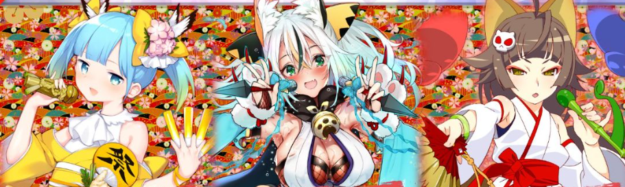

# 知云云雀

| 角色信息   |  |
| ----------- | ----------- |
| 名称    | 知云云雀|
| 年龄   |12岁    |
| 职业 | 江户时代的偶像|
| 对应曲   | ちゅんちゅちゅチューン
| 对应版本 | Chunithm Crystal Plus|

（注：从该篇章开始，各分集的标题都是GALGAME标题的恶搞。）

译者：毛颜

## EPISODE1 欢迎来到魔大陆！

>浮在空中的魔大陆秋叶原！勇敢的三位美少女即将踏入未知的世界！

这里是前情提要！

大家好哇！

这里是天才美少女冒险家英格丽特的说！

为了解开从爷爷那里得到的水晶骷髅之谜，千里迢迢来到了日本的说。

在水晶骷髅的指引下，在日本四处奔走的我，有一天遇到了鬼蝮尤利娅的说！

我注意到水晶骷髅对尤利娅有很强烈的反应，我尝试了一切手段来接近她的说！

然后终于我和尤利娅碰了面，顺利地把水晶骷髅交给了她的说！

噔噔——！但是那个时候！

水晶头骨裂开了，好多只黑色的手袭击了尤利娅的说！

尤利娅帮助了还搞不清状态的我，等我回过神来，我就到了……绵……绵……什么来着？

总之！我在一个陌生的城市的说！而且！天空中有一座大岛的说！

魔大陆原来真的存在……！这不得了的说……！

然后，在兴奋不已的我面前，出现了前偶像新井桃子和尤利娅的妹妹鬼蝮爱理的说。

两位偶像再此现身的说！

为了帮助被魔大陆俘虏的尤利娅，我们利用爱理不可思议的力量突入魔大陆的说！

为了解开浮在空中的秋叶原之谜，拯救尤利娅的大冒险，现在开始的说！

好戏，还在后头呢~

## EPISODE2 秋叶原系的少女们

>秋叶原显得更有御宅本色了。阿宅们都聚集在站前显得熠熠生辉，草长莺飞。

漂浮的秋叶原慢慢悠悠飘到了关东的上空。

鬼蝮爱理、新井桃子、英格丽特·奥瑞克·康奈尔三人，在魔大陆的边缘，借助爱理不可思议的力量，终于平安着陆。

 

“哇……这地方真的在飞啊……”

“真的不是做梦……”

“这里就是魔大陆……兴奋起来了的说！我一定会解开所有谜题，解救尤利娅她们的说！”

 

英格丽特不顾还在出神的桃子和爱理，把镜头转向了未知的魔大陆中心。

眼前是曾经被称为秋叶原的街道。

虽然仍旧一成不变，但映入眼帘的物体都被动漫和游戏的海报贴的满满当当。

 

“OH~看得眼睛都花了的说……”

“这是……被埋葬在永远黑暗之中的禁忌的贴纸！”

“诶，这是什么？这个，还有这个……从珍藏版本到现在最新的都有……要是拿去<ruby>可露美利<rp>（</rp><rt>カルメリ</rt><rp>）</rp></ruby>卖的话岂不是发大财了……？”

（注：此处“可露美利”恶搞了日本网络二手交易平台“Mercari”，其台湾官方名为“美露可利”）

 

那些能在秋叶原经常看到的海报自不必说，这里贴着的还有过去的稀有品和即将推出的新作品。

如此庞大的信息量压得三人喘不过气来。

看来这片区域已经变成了这副魔境，最初还让人感觉有些兴奋，但渐渐地就只有异常和违和的感觉。

 

“话说回来，边远的地方都这样了，不会靠近中心的地方还要更加混沌吧？”

 

三人看到了一个宅男向车站的方向跑去，赶紧追了上去。

某种意义上来说，桃子的担忧很正确。

 

“这是什么呀！！”

 

这里是中心区域——秋叶原站前。

作为车站前的象征性的建筑物，UGX前的大屏幕播放着就连桃子都没听说过的偶像三人组。

街道里回荡着的背景音乐也给人一种古风的印象，与走在御宅族最前端的秋叶原相比，多少有些违和感。

但是问题并不止于此。

秋叶原站前广场。那些聚集在大屏幕前的，声势浩大的御宅族大军让她们三人吓了一大跳。

这些宅宅的身上身穿印有三位谜之偶像的法披，头上缠着象征着三人的黄色、蓝色和红色的头巾，两手握着和头上绑的头巾颜色相同的发光棒。

令人难以置信的是，其中甚至还有全身挂满徽章，身上宛如鳞甲披身一般的强者。那样子就像穿着锁子甲的中世纪骑士一样……。

这些宅宅们都面对着大屏幕，手拿发光的荧光棒跳起了WOTA艺。

（WOTA艺：又称为"Ota艺"，是源自日本的一种独特的粉丝文化表现方式，主要在演唱会、现场表演等场合中由粉丝们进行。这种表演形式通常伴随着偶像或乐团的音乐，粉丝们会进行一系列有节奏的动作和手势，以此来表达对偶像的支持和热情。Wota艺的动作通常包括快速的手势、跳跃、旋转等，有时还会使用到荧光棒（ペンライト）来增加视觉效果。这些动作往往需要经过一定的练习和协调，以便在表演中达到整齐划一的效果。）

 

“……这到底，是什么的说……”

“嗯，这个……就算是桃子我也根本笑不出来呀……”

“姐姐，真的没事吗……”

 

三人各有各的反应，但都对着眼前的光景露出了难以形容的表情。

这里究竟在干什么呢？

为了弄清楚这一点，必须走向这一副奇异的光景，但是没有任何一个人迈开步子。

本以为如此，英格丽特却像是下定决心似的冲了进去。

 

“等等，你在干什么！”

“未知正呼唤着我的说~！”

 

看样子还是好奇心占据了上风，根本没听到桃子的制止声的英格丽特冲进了御宅族中。

桃子和爱理只能无可奈何地跟在后面。

 

（注：以下段落中御宅族的台词皆来自于2ch论坛的帖子“本物のオタクが「涼宮ハルヒのキャラで誰が好きか?”中的第83楼回帖内容。原帖内容为网民对贴主的问题“如果问真正的御宅族‘他喜欢凉宫春日系列里面的哪个角色’会怎样”的回答，并且模仿了一段御宅族的对话，尽显幽默夸张和对御宅族的刻板印象。其中的各类无意义怪叫声词语和www的综合即为原文模仿的内容，本文会以注音标识原文。）

“嗨！YOU来到秋叶原是来做什么的说？对了，这边在干什么的说？”

“哦哟哟哟wwwww又来了新人吗wwwww<ruby>嘟噗弗<rp>（</rp><rt>ドプフォ</rt><rp>）</rp></ruby>wwwww哎呀，失敬失敬wwww在下也是新来的，竟有志同道合之人也很开心<ruby>柯波wwwww<rp>（</rp><rt>コポォｗｗｗ</rt><rp>）</rp></ruby>”

“‘在下’？！难道你是传说中的……JAPANESE SAMURAI？”

“不是，这家伙怎么看都是个死宅吧？”

 

面对桃子的吐槽，那个宅男发出了“<ruby>弗卡奴波wwww<rp>（</rp><rt>フォカヌポゥｗｗｗ</rt><rp>）</rp></ruby>”一般的笑声。

 

宅男1：“在下可不是普通的宅男哦www”

宅男2：“在这里的诸位都是被选中的宅宅哦www”

宅男3：“能在这里的，都是被允许参加将全世界宅宅从<ruby>派对人<rp>（</rp><rt>パリピ</rt><rp>）</rp></ruby>中解放出来的圣战的精兵，换句话说，正是全御宅界的TO*集团wwww哎呀wwww在下怎么把TO说了出来，这可是宅宅才会用的专门用语wwww”

“踢欧？”

（注：TO指Top otaku，指代宅宅之中的顶级宅宅。）

 

宅宅们的语言一定很难理解。英格丽特歪着头，可能是啥都没听懂的样子。

就在这时，广场被前所未有的欢呼声包围了起来。

## EPISODE3 <ruby>出派对人记<rp>（</rp><rt>エクソダスパリピ</rt><rp>）</rp></ruby>

>新出现的偶像支配了浮于空中的秋叶原。那些御宅族们，纷纷变成了她们的俘虏。

（注：标题恶搞了《超时空之旅》（エクソダスギルティー），此处以EXODUS，即《出埃及记》为格式进行翻译。）

听到了宅宅们震耳欲聋的欢呼声，三人不由得捂住了耳朵。

欢呼声实在太大，甚至产生了秋叶原——准确来讲是这个浮岛都在晃动的感觉。

爱理环顾四周，试图弄清楚现在发生了什么。

包括刚才说话的宅男在内，这里的所有宅宅们都对UGX的大屏幕投去热切的视线。

爱理将视线也移到屏幕处，吃了一惊。

 

“那个，你们俩……快看那个……”

 

爱理的声音差点被周围的欢呼声盖住，桃子和英格丽特也向大屏幕看去。

桃子看着屏幕，也和艾莉一样露出了吃惊的表情，而英格丽特则两眼放光，像是在期待着什么发生。

让二人感到诧异的屏幕上，播放着轻快的古风音乐，倒映出三位偶像在逆光下仁王挺立的身影。

 

“在星空中飞舞的夜雀公主殿下！知云云雀啾！”

首先被灯光照亮的，是一个身着麻雀服装的女孩子。

甜美可爱的声音，还有那慵懒中带点轻蔑的眼神。

周围的身着黄色法披的宅男不断喊出“踩我！”“我立了！”这种下流的话。

这位女孩子的粉丝应该都是这样的人吧。桃子下意识地拉开了距离。

 

“吃我这招宅宅忍法喵！我是伊贺崎楠子喵！”

紧接着出现的是穿着暴露服装的猫耳忍者少女。

一看就知道是向宅男献媚的打扮和猫咪一般嗲声嗲气的声音，让穿着蓝色法被的宅男们兴奋不已。

 

“<ruby>空空<rp>（</rp><rt>コンコン</rt><rp>）</rp></ruby>！来自吉原的顶流偶像！天稻荷虎彻是也！”

最后担任C位的是一名穿着巫女服装的狐耳女孩。

她散发着一股纯洁的气息，却又露出宛如狐狸一般的锐利目光。

外加上高压的语气，穿着红色法披的宅宅们纷纷跪倒在地。

 

“我们过去在与<ruby>派对人<rp>（</rp><rt>パリピ</rt><rp>）</rp></ruby>的抗争中败北，壮志未酬，便遗憾离世……但是，不知是何等因缘际会，我等再度从地狱中回来了！”

“现在正是证明我们御宅族比<ruby>派对人<rp>（</rp><rt>パリピ</rt><rp>）</rp></ruby>更优秀，从而获得救赎的时候喵！”

“各位宅宅们，站起来吧！将嫉妒化为愤怒，站起身来！宅宅们！不要忘记我们御宅族才是被选中的人！啾啾！”

**“Yes！Your Majesty！”**

 

台上三人的演说让广场上的宅宅们发出了怒吼声。

 

“这些宅宅的力量让大地都在震动，好……好厉害！”

“还真是……不对，现在不是关心这个的时候……”

“啊！姐姐……！”

“哪里？在哪里？”

 

差点要被御宅族们的声音压倒的时候，爱理突然大声喊道。

就在映出三人身影的屏幕的一角。

那里正是爱理的姐姐——鬼蝮尤利娅所在之处。

不只是尤利娅。

与她在一起的还有偶像津久井静乃和观音寺笑瑠，不知为何还出现了叶和都丽美与八咫乌钢太郎的身影。

五个人似乎都失去了知觉，一动不动的躺着。

不对，**还有一个人像痉挛一样身体不停地颤抖着**，所以应该说四个人更确切。

 

“一定要帮助尤利娅她们的说。但是她们在哪里的说？”

“姐姐……姐姐大人很有可能是在那座可怖的黑暗建筑物里面吧。”

“嗯嗯……UGX啊，确实有这个可能性……”

 

爱理所指的，正是那个带着巨大屏幕的建筑物——UGX。

也没有其他可能的地方，那么就算只有一丝希望，也必须抓住才是。

 

“不过啊……这些宅宅们的狂热程度就像是被操纵了一样……哈！该不会是肉芽干的吧！”

（注：指的是《JOJO的奇妙冒险》第三部由迪奥产生的“肉芽”。该物体能够植入人的脑部，远程控制人的行动和意志。）

“肉……？”

“芽……？还有肉做的吗？”

“你说……什么……？”

 

（此处台词恶搞了《死神BLEACH》之中黑崎一护战斗中绝望惊讶时的台词分镜）

 

看到爱理和英格丽特的反应，桃子震惊的瞪大了眼睛。

想玩个梗，但是却没人能理解的时候……这正是御宅族最为心痛的瞬间。

不过，两人的年龄也和桃子少有差距，这也是没办法的事。

桃子带着那道御宅族心中的伤痕，三人穿过其他宅宅，前往了显示屏的前方……不是，UGX的内部。

EPISODE4 交给桃子吧！「UGX被其他宅宅看守着。作为自宅警备员的桃子有什么对策吗？」

三人现在总算接近了UGX。

不过，进入内部的门正被全副武装（痛法被+头巾+发光棒）的御宅族守着。

“哎哟……看起来很难对付呀。”

“那种小兵，就让他们跪倒在我的力量前！”

“等等啦，那种不明就里的力量还是留着以防万一更好。”

桃子挥动着手掌，对马上就要举起上面有关东煮罐头的手杖的爱理说道。

“那么，我的眷属桃子哟，你有什么锦囊妙计吗？”

“咦，我什么时候变成眷属了？成为可爱女孩子的眷属，这可没有拒绝的理由……算了，先把这个放在一边，该怎么办呢？”

爱理的不明魔法力量，应该是真的吧，毕竟现在三个人站在魔大陆上就是证据。

但这种力量要是无穷无尽使用就很危险了，如果超过使用次数，或者爱理的MP或者精神力归零就用不了了。

所以桃子还是阻止爱理使用魔力，但是，她现在也想不出任何办法。

“嗯，那是？”

桃子看到停在路边的一辆装饰华丽的卡车。

平常行驶在路上放着洗脑的招聘乐曲的就是这个车*。

桃子带着二人走进卡车，太好了门没锁，钥匙也还在。

“这个什么巴尼拉，是卖冰淇淋的说？”

“这个车太诡异了，吾之眷属桃子哦，快点说明！”

“两个人还是保持纯洁比较好啦……”

有些事就算不知道也能活下去，有些事现在知道未免还太早。

两个中学生年级的女孩子歪着头看桃子，桃子远远看着她们俩，看起来还是别破坏纯洁的二人了。

“这可是治外法权……就用这个来强行突破！”

“好厉害！桃子，你居然会开车吗？”
“当然！不过不是现实的那种！”

爱理和英格丽特并没有理解这句话的意思，但是她俩本能地觉察到坐桃子的车很危险。

“好了，准备冲吧！没时间解释了快上车！我要开车了！再不躲开就要被创进异世界了啊——！”

“呜哇！我还不想读俳句呢！**”

踩下油门。

轮胎发出轰鸣声，卡车开始高速行驶。

“御宅族、御宅族、御宅族、废人！御宅族、御宅族、御宅族、极限势！”

“我去，怎么连词都变了？”

突然响起来的音乐，旋律虽然还是一样的，但对桃子来说这个歌词很陌生。

“这歌曲是从哪里传来的？”

“爱理酱！不用管这个！”

“桃子！前面，前面的说！”

“呜哇！”

短暂的疏忽可是致命的。

原本要冲进UGX入口的卡车，就在刚刚一不小心，追尾了一辆黑色高级车。***

“这下……糟糕了糟糕了……的说……”

幸好三人都没有受伤。

但是，英格丽特似乎在害怕什么，果然，从前方的黑色轿车上下来一名穿着西装，一脸凶相的宅男。

之所以知道他是个宅男，是因为他身上穿的衣服是印有天稻荷虎彻样式的痛西装。

“果然的说！我在之前日本的搞笑视频上看过了，接下来肯定会提很过分的条件的说！”

“什么乱七八糟的……没想到魔爪还会伸向金发美少女……没办法了。”

“我，我的眷属桃子哟，你要去做什么？”

“和视频里的一样，跟他和解！”

从卡车上走下来的桃子，朝着向穿衣装的宅男走去。

就在宅男说了什么话的瞬间——

“噢啦！”

他的胸口狠狠挨了一下桃子的头槌，一发击沉。

“啊哇哇……”

“OH！红牌罚下的说！”

望着突然采取强硬行动的桃子，爱理和英格丽特互相依偎着身体颤抖起来。

“对了，一开始就这么干就好了啊！”

无论如何，三人就这样摆脱了一场危机。

把守在UGX入口的宅男也用头槌打倒，三人就这样潜入了UGX。

*网页链接，知名招募风俗店员的广告。日本国歌（大雾）

**漫画忍者杀手的neta，忍者在死之前的遗言。

***这里以及接下来的情节均出自由COAT公司出品的著名搞笑（大嘘）纪录片《BABYLON STAGE 34 真夏の夜の淫夢 the IMP》第一章《極道脅迫！体育部員たちの逆襲》。

EPISODE5 人工宅男「冲破无数宅宅们前进的三人。一直等待着的江户偶像们的目的，即将揭晓」

UGX 的建筑内部当然也有作为安保的宅宅。
但是，阻挡在前的宅男们们都被桃子强烈的头槌击倒在地。
“好奇怪，我应该不是这种武斗派才对……难道是自宅警备员的经验起作用了……？”
跨越众多宅人的身体，三人终于来到了 UGX 的综合管理事务所。
在那里等待着的，是统治着飘在空中的的秋叶原的偶像三人组。
“正在等你们呢。”
“啊，你们是……是谁呀的说……？”
摆着严肃表情严阵以待的三人组，被英格丽特的话逗得前仰后合。
这种让人感觉到代沟的反应，桃子的眼神不由得飘向远方。
“刚，刚才在广播里刚报过名字呀！？”
“没关系嘛，楠子姐姐。再报一次名号啦！”
“就是嘛，楠子。为了让你们再也忘不了我们的名字，要刻在你们的脑髓里！”
虎彻打了个响指。
就在那一瞬间，房间的灯光熄灭，就像刚才外面的显示器看到的那样，背景灯照亮了三人。
然后，响起了稍显古风的高音调曲子，灯光依次亮起，每个人都在摆造型。
“在星空中飞舞的夜雀公主殿下！知云云雀！ ”
“吃我这招宅宅忍法喵！我是伊贺崎楠子喵！ ”
“空空！这里是吉原的最顶级偶像！天稻荷虎彻！”
“哦哦～！”
每个人都摆好姿势，英格丽特两眼放光，兴奋地鼓起掌来。
“呃……这不是鼓掌的时候吧？”
“哎呀，对哦！你们的目的是什么的说！”
“我们是在遥远的古代——没错，在被称为江户的时代就声名远扬的偶像！”
“ΩΩΩ什么的，是什么姬掰！？”
听到虎彻的话，三人露出惊愕的表情。
桃子终于明白，之前一直觉得表演有不同时代的感觉，原来是这个原因。
“不知是何因果，在现世复活。这一定是神的启示！所以要消除那时的遗憾！”
“虽然不是很懂，但你们到底要干什么？”
“拯救那些被派对咖们迫害，只能苟且偷生的御宅族们！这就是我们的悲愿！用人类最大的心理武器‘Otaku High&low’洗脑，把所有人都变成宅人！！”
三人的脑海中浮现出建筑外的死宅们。
桃子半开玩笑地说“用肉芽洗脑”之类的话，看来也不完全是错的。
“创造一个只属于御宅族的世界，让御宅族们能轻松的生活下去。对你们来说，也不是坏事吧？”
“所以我们应该不是敌对关系吧。”
“也就是说你们也要协助我们喵！”
御宅族轻松生活的世界。
这对三人来说也是悦耳的话语。
虽然不像过去歧视那么严重，但真正的御宅族还是在其他人眼中还是备受批评。
爱理的姐姐尤利娅也在努力让东京全域秋叶原化，为了让御宅族们更容易被大众接受而活动着。
但是……
“强制全球御宅化还是不太好吧……”
“的说……”
桃子和英格丽特面露难色，爱理把镶着关东煮的手杖指向虎彻他们。
“对你们的阴谋没兴趣。把我亲爱的姐姐还回来！”
“不协助吗……好吧。但是，尤莉亚她们就是‘Otaku High&low’’的动力本身。她们不能还给你们！”
“而且，你们也别想走啦喵！”
楠子发出信号的瞬间，从房间的出入口出现了大叫着“乔治wwww”“迪布夫wwww”等以各种笑声出现的宅宅们蜂拥而至。
“被包围了的说！？”
“事已至此，我的眷属桃子哟。用你的头，给与我们为敌的人血祭吧！”
“哈！？姐姐我的生命值早就归0啦！再用头撞的话脑细胞会坏掉的好吗！？会变笨的！”
就在这么说着的时候，没有任何战斗力的爱理她们毫无办法，被讨厌的宅宅们给束缚住了。
“讨厌也是没有用的……就算你们不愿意，也会让你们舒服得求着我们的喵！”
然后，看到表情恍惚扭动身体的楠子，三人脸色变得苍白。

EPISODE6 朋友~再会的喜悦~「被宅宅们抓住之后，没想到遇到了新的伙伴」

被江户偶像抓住的爱理她们，被其亲卫队带到了某家商务酒店。
看起来，似乎是要把她们关在哪个房间里吧。
“这里是因提供优质睡眠而出名的商务酒店呢。没想到会以这种形式来这里。”
在看着商务酒店有些慌张的桃子旁边，眼里含着泪的爱理被宅宅们带着往前走。
“这是说这种话的时候吗！接下来怎么办啊！”
“这还能怎么办啊……”
被抓住后没了余裕，爱理用平常的说话方式大喊。
顺便说一下，她们当然尝试过逃跑。
但是，虽说这帮家伙都是宅男，但好歹也是成年男性，而且不止一两个，对方人数众多。
仅仅是柔弱的女孩子们，根本不可能突破。
就这样被带进的一个房间里，居然有先到的客人。
“哎呀~，又有可爱的孩子们来了呀，钢酱。”
“嗯哦哦♥ 要不行了♥ 可爱的孩子，要不行了~♥ 啊哦哦哦♥♥”
房间里有两个少女——不对，是有着轻柔温柔氛围的少女和可爱到让人怀疑是不是少女的少年。
少年不知是怕生还是害羞，红着脸瑟瑟发抖。
“还有其他人也被抓住了呢。”
“啊！是叶和都丽美酱和八咫乌钢太郎，对吧！”
“爱理小姐居然知道我们呀。”
“是的……啊，嗯嗯。我是亲爱的姐姐尤利娅的眷属。”
“原来是尤利娅小姐的妹妹呀~。初次见面~”
“嗯哦哦♥ 以后请多关照♥ 请多关照哦哦~♥♥”
五人简单地做完自我介绍后，都丽美开始说起为什么她们会在这里。
“虽然想解释也不知道从哪里开始说起呀~。一开始是想摆脱给愚民们要做点什么★”
“那，我姐姐在哪里……”
“对不起呀~，都丽美也不知道。”
“布吉岛哇！钢太郎，布吉岛呀！完全不明白噢噢噢噢~♥”
原本期待着能知道姐姐行踪的爱理，听到都丽美的话后低下了头。
对这样的爱理，钢太郎出声安慰道。
“哦♥ 没关系♥ 一起来♥ 哔♥ 啾——♥♥”
“呃……！？谢，谢谢你？”
“钢太郎，很温柔的说！”
“……真的吗？”
桃子正看着这一幕时，房间的门打开了，恶心的死宅们一边“嘿嘿嘿wwww”静静地一边出现在门口。
“工作时间到了哟wwww”
突然被告知“工作”，桃子脸色变得煞白。
“难，难道，要被带到外面一群宅宅们的面前，做这样和那样的事情……”
“嗯哦哦哦♥ 在大家的面前♥ 做各种各样的事情♥ 只能去了哦哦哦哦哦哦♥ ”

听到桃子不由自主的嘟囔，钢太郎踮起脚尖身体颤抖。

究竟，等待着她们的会是什么呢。
尽管内心不安不断加剧，五人也只能被宅宅们推进黑暗的通道中前行。

EPISODE7 宅之空「夜雀偶像知云云雀。能够理解宅宅们、激励宅宅们的萝莉偶像」

从商务酒店被带出来的五人，被塞进了全玻璃的车里。
“果然真的要变成小薄本一样的展开了嘛！？”
桃子的这种担心似乎是多余的，载着一行人的车抵达了名为“triplets秋叶原”的现场演出场所。
“你们要在这里给我进行现场演出wwww”
似乎那个宅男说的“工作”，就是指面向宅宅们进行现场表演。
比想象中要好，不会被强迫做更过分的事，五人安心了。
进去后，似乎演出已经开始了。能听到宅宅们巨大的欢呼声。
“喂，大叔。就不能再大声点吗？所以说大叔就是丢人呢。”
五人从舞台侧幕看向舞台，站在那里的是江户的黄色偶像知云云雀。
那轻蔑、瞧不起人的高音调声音，在演出场所回荡。
“呜哦哦哦！www 云雀酱！www”
“被折服了！www 被这小丫头折服了！www”
宅宅们朝着这样的云雀，一心一意地不停挥舞着荧光棒。
“呵呵，那么下一首曲子！我要把各位大叔们最后一滴汗水都榨干哦！”
云雀的现场表演更加热烈，大家都移不开眼。
“那孩子的舞台，感觉好厉害的说……！”
“裙子飘飘的，好小巧可爱呢~★”
“哎呀，确实超级可爱啊……我也要被折服了呢。”
就在这时。
现场演出场所——不，整个秋叶原，开始剧烈摇晃起来。
在一片喧闹中，云雀张开双手仰望天空，带着恍惚的表情说道。
“终于，能量CD终于好了，马上要发射了！‘Otaku Wave’！”
“ΩΩΩΩΩ？是，是什么！？”
“一起来改变吧，这个世界！地上的御宅族作战开始吧！”
正在表演的云雀，高声宣布道。
桃子慌忙打开拉特，刷新之后，一幕幕可怕的景象出现在了手机里。

EPISODE8 御宅族的狂宴「向地上开始发起攻击的御宅族兵器，被猛烈的强光扫到的话，将被强制变成御宅族」

桃子打开的拉特的时间线上，全是被“Otaku Wave”扫射过的地方的推文。

“哇……这都啥啊……”

看到桃子紧紧盯着手机屏幕，其他四个人也凑过来看。

顺着时间线不断往下滑。

首先看到的是千叶县的一个有名的娱乐设施成为了Otaku Wave的牺牲品。

“这个吉祥物的衣服实在是太少了wwwwww这不就围了块布wwwww”

“眼前的情侣突然开始说那种ngongo之类的话笑死wwwwww”

与这些推文同步发布的图片还有视频显示，普通人普遍很喜欢的娱乐设施也开始染成御宅族的色彩。

“今天的游行中发生了一件悲伤的事情。这篇文章很长，如果您能转发开来，我将不胜感激。”

原本这样的新闻，最后变成了报纸上的涂鸦张贴，宅宅们的兴奋感言，现场的椅子和座位散开，大家开始争抢前排观看游行。

进一步查看时间线，发现下一个目标是台场。

本应是现充约会地点的游乐园里，播放着动画和特摄的各种东西。

另外，还有的宅宅以独角兽为主题的等身大手办组成大圆阵围起来，挥舞着荧光棒跳舞。

那个著名的被视为自由的雕像不知道怎么回事，被改造成了一个胸前有狮子脸的黄金机器人雕像，高高举起了黄金色的锤子。

对于原本就是宅宅的人，强制御宅族化并没有什么效果，但是他们的周围突然充满了御宅化却让宅宅们困惑的嘟囔着什么。

不过对他们来说肯定很快就适应了这一切吧，并因为宅宅的增多和御宅族们开始以此为乐而充满了喜悦的叫喊声。

“Otaku Hi-low”一瞬间改变了世界的状态，虽然就这一部分。

目睹了巨大兵器的威力，五人惊呆了。

EPISODE9 御宅色彩五重奏「为了阻止地球全部御宅化，五人的临时LIVE拉开帷幕」

“好多人都被强制变为死宅了的说……这太可怕的说！”
“这样下去，真的全人类都要变成御宅族了！？”
又变回原本说话方式的爱理。
地球上的全员御宅化，其冲击程度就是如此之大吧。
“真正可怕的从现在才开始……！”
“这，这是怎么回事的说，老师！？”
桃子瞪大双眼说道。
“强制的御宅化会量产各种小鬼……真正的宅宅们的寒冬就要来了……！”
“寒冬算什么，我要用启示录的火焰把一切都烧光！”
“呃……不对，不是这样的啦！小鬼和伪宅的出现对真正的宅宅圈子的伤害可大啦！”
伪宅小鬼最擅长的技能之一，叫做“不懂装懂”。
指的是对于一个内容过去的历史以及在其过程中产生的梗，装作很早就知道，而且还错误地展示出来。
这样的小鬼，被资深宅宅嫌弃，也让被资深爱好者对这种人避而不谈。
但是这帮家伙数量众多声音又大，影响力不容小觑，可以说有着左右圈子的力量也不为过。
而且小鬼们贪婪地追逐内容，三个月后又转向别的内容。他们走过之后，剩下的内容就像被蝗虫啃食殆尽的田地一样，只留下贫瘠的荒野。
“总之，首先得从这里逃出去的说！”
“虽说就在这里老老实实进行演出，他们也肯定不会放我们走……真是讨厌，对淑女一点都不体贴。”
出入口有个“嘿嘿嘿wwww”肆无忌惮笑着的肌肉发达的猛男变态宅男，强行突破恐怕也很难。
“那要不试试求求云雀酱？求求你放了我们~★”
“请原谅我吧！我什么都会做的！*这样的感觉的说！”
“嗯？你刚刚说了什么都会做的是吧，什么都会？”
听着这三人的话，爱理哼了一声用鼻子笑。
“我可是高贵的暗黑魔导士，低声下气这种事想都别想。反过来说就由我来把这些愚民都洗脑！”
“啊，这样的话听起来也很有趣啦~！”
“呃啊，都搞不清楚谁是正派谁是反派了啦！”
桃子抱着头吐槽了一句，钢太郎也小心翼翼地想证明一下自己的存在感。
“咪~♥大家一起~♥变得幸福吧噗噜噜噜~♥”
“钢太郎酱感觉也干劲十足的说！”
“用我们的表演把愚民们迷得晕头转向★！”
被都丽美和英格丽特称赞的钢太郎高兴得脸都红了起来。
“作战会议结束了吗？”
正在商量逃跑计划的时候，刚刚表演结束的云雀走了过来。
看到她那娇艳的肌肤上微微渗出汗珠的样子，大家不禁吞了口扣税，但是被云雀酱冰冷、得意洋洋的强硬视线注视后，又忍不住想退缩。
“接下来轮到你们了。好好加油把气氛搞起来！啾啾啾！”
“噗噗……真是奇怪笑声的说。”
“啥？”
云雀狠狠地瞪了不小心说出口的英格丽特。
爱理赶紧插进两人中间。
“在那看着就好。然后为吾等颤抖吧！这是吾等秋叶原守护者的狂乱盛宴的开始！”
“呜呜呜……你得意也就趁现在了！把你打得站不起来，当消遣的对象啾！道歉也不原谅啾！”
五个人无视背后云雀的叫喊，朝着舞台走去。
仅限此次的梦幻组合。
魅惑的现场LIVE，开始吧。

*嗯？你刚刚说了什么都会做的是吧？

EPISODE10 THE！战斗！「现场宅宅们的热情分成了两波，变得混沌起来了！」

等待着登上舞台的五人的，是已经因云雀的现场LIVE而兴奋起来的的御宅族们。
这次的现场属于客场。组合也是一次都没有磨合过的临时组合。
但是，即便如此，除了一人之外，她们都是专业或曾经是专业的偶像。
以爱理为中心，各自发挥着自己的才能，让现场的宅宅们兴奋不已。
唯一没有作为偶像活动过的英格丽特，或许是因为她与生俱来的性格，一边对着台下的宅宅们绽放笑容，一边跟上其他人的表演。
“这都是什么景象哇！www”
“尽管感觉都在各自表演各自的，但就是移不开眼睛哇哇哇！www”
“哼……这帮小鬼挺不错的。”
有马上响应舞蹈动作的开始打call的宅宅，也有兴奋过度呆呆看着的宅宅，甚至最后面还有双手抱胸装酷的宅宅。
不得不说宅宅们的适应能力真是惊人。
本应是客场的现场，完全被舞台上的五位偶像掌控了。
“接下来就是这场宴会的终焉。把你们的叫喊声拿出来！”
终于最后一曲响起，爱理的MC煽动着台下的宅宅们，热情达到了高潮。
就在这一刻，云雀从舞台侧幕飞了出来。
“啾啾啾！我一直在等着！现在这一刻！”
在演出会场狂奔的云雀身后，训练有素的宅宅们追着在会场里跑来跑去。
然后，宅宅们类似气场的东西都聚集到了云雀拿着的麦克风上。
举起那个麦克风，云雀的服装渐渐闪耀夺目起来。
“来吧，用让人难以想象是成年人的喘息声呻吟吧，来让我满足吧！”
“哦哦哦！哦哦哦！”
“听不见~？根本听不见！这么小声还想参加现场LIVE！！”
“哇哦哦！哇哦哦哦！！哇哦哦哦哦！！！”
本应被爱理她们的LIVE迷住的一波宅宅开始朝着云雀大喊起来。
“完全被带跑了啦……啊，我差点也要被带跑了啦！”
“桃酱，坚持住~！”
“我们还在这里！我们还会给爱理大人应援的！”
即便如此，还是有给爱理她们加油的宅宅们存在。
不知不觉间，现场的御宅族们干净利落地分成了爱理派和云雀派，陷入了极端的混沌之中。
两个阵营火花四溅，最终在中间形成了死亡之墙。
肉体与肉体激烈碰撞，汗水和泪水在LIVE会场四处飞散。
简直就是地狱一般的光景。
“怎么会这样……愚民们在互相对抗……！”
给自己加油的御宅族们相互厮打了起来。
这景象对爱理她们来说很是难受。
但是，云雀却幸灾乐祸般的在空中飞舞着。
“撕得好……撕得再响些……！然后用这股能量，实现我们的愿望！啾啾啾啾！”

EPISODE11 少女乱舞「一决胜负的时候到来。夜雀偶像，魔掌逼近」

“这反而是个机会！爱理酱，我们也来强化支援咱们的宅男吧！”
  “诶！？”
对于桃子这突如其来的提议，爱理本能地发出了惊讶的声音。
  “强化咱们这边的宅男，把那边的宅男打散。在一片鬼哭狼嚎中咱们趁机开溜。完美呀这个！”
  “原，原来如此……虽然有点于心不忍……哈！那就这么办吧我的眷属桃子，我们就按照你的计划行事。”
哪怕只有一点能逃走的可能性也要尝试。爱理将关东煮手杖指向了宅宅们。
  “给守护我们的勇敢战士们赋予力量！暗黑之力！！”
爱理的声音在会场回荡，爱理派宅宅们的身体被紫色的黑暗光芒所笼罩。
  “哇哦！？www 给上buff了欸！！！www”
被禁忌的暗黑魔法强化的爱理派宅宅们，用起来强大的黑暗力量，把云雀派的宅宅们通通吹飞开来。
  “啾！？ 这是怎么回事——哇！？”
  原本一脸轻松在空中伫立的云雀，被这突如其来的情况弄得狼狈不堪。
  那一瞬间的迟疑酿成大祸，被吹飞过来的宅宅卷了进去，摔到了观众席上。
  “机会来了的说！”
  “哇哇，跑哇跑哇~★”
  看到摔到观众席的云雀，五人匆匆忙忙逃离了会场。在视野边缘捕捉到这一幕的云雀，想要起身去追。
  “别，别想逃跑……呀！？”
但是，云雀被暴走的要一决胜负的宅宅们为了个水泄不通。
原本应该能洗脑并随意操纵的这帮御宅族。
但现在，爱理的暗黑魔法刺激了他们的争斗本能，陷入了暴走状态。
  “这，这简直就是wwww小薄本里经常有的情节wwww”
  “哇吼吼吼wwww”
  “我们胜利啦~~~~www（大人可不会输给顽皮的小孩）”
  宅宅们全是汗味的手伸向云雀。
  “别，别过来！再靠近的话，我可不会放过你们！呜哇！？ 饶了我吧！！”
  “云雀酱！快闭上眼睛喵！”
在魔掌即将触碰到云雀的那一瞬间，不知从何处传来的声音让云雀下意识地闭上了眼睛。
  “宅宅忍法，大闪光之术！”
在御宅族们眼前，好几根棒子掉了下来。
发出清脆悦耳的声音，那光芒用耀眼的橙色光芒填满了御宅族们的视野。
“哇啊！？www我不需要a1高闪啊，秋梨膏！！www”
“眼，眼睛啊~！眼睛啊~！www”
宅宅们们噼里啪啦地倒在地上。
发生了什么呢。
当云雀想要确认而睁开眼睛时，不知不觉已经被移动到了会场的屋顶上。
  “云雀酱，没事吧喵？”
听到这声呼喊，云雀终于明白了现在的状况。
自己在即将被宅宅们袭击的时候，被像姐姐一样仰慕的楠子给救了。
紧张感消除了，云雀眼中含着泪抱住了楠子。
  “姐姐大人！求求您，一定要为云雀我报仇啊~！”
  “嗯哼……先回虎彻那里喵！”
  楠子这么说着，用公主抱抱着云雀，跳了起来。
  在楠子的怀里，云雀安心地闭上了眼睛。
  抱着这样的云雀，楠子脸上浮现出恍惚的表情。
  “喵呼呼……接下来轮到我来应对啦喵”
尽情享受着幼女的温暖、柔软和香甜的气息，楠子朝着虎彻等待的地方飞去。

-END-