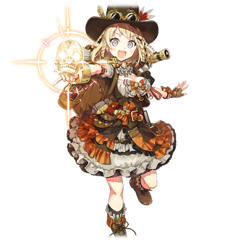
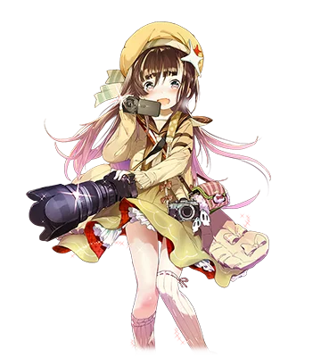

# 英格丽特·奥瑞克·康奈尔

| 角色信息   |  |
| ----------- | ----------- |
| 名称    | 英格丽特·奥瑞克·康奈尔|
| 年龄   | 14岁      |
| 职业 | 中学二年级学生、实况冒险家 |
喜欢的东西|O-Parts，世界上的不可思议之物
| 对应曲   | 【冒険】イングリット葛西降臨！【実況】
| 对应版本 | Chunithm Crystal|
CV|丹下樱

译者：毛颜

## EPISODE1 英格丽特的冒险记录

>作为天才美少女冒险家英格丽特，势必要解开世界上所有未解之谜！

英格丽特是出生于英国，但是祖父却是日本人的混血少女。

受到家人的影响，她从小就在探索发现和走近科学还有各种好莱坞电影中长大，沉迷于未知的秘宝以及世界上的不可思议事件之中。

她的梦想是成为下一代的伟大冒险家。

为了迈出这一步，英格丽特在任何人都可以免费观看的视频网站上上传了自己的探险视频，逐渐积攒了些人气。

 

这个故事，正是从她祖父留下的谜题而开始的，充满着汗与泪的冒险记录。

 

## EPISODE2 冒险开始的预感

>爷爷好久不见呀！那个看起来很可怕的东西是什么！？

英格丽特把自己的冒险记录上传到视频网站后不久，她家就来了一位稀客。

 

“好久不见呀，英格丽特！”

 

那个人——也就是英格丽特的祖父，虽然是日本人，却是个从日本移居到英国的贸易商。

经手的商品全都是有着某种来历的古董品，很多都不知道有什么用途，但是被其神秘的气场吸引而购买的富豪也很多。

英格丽特很喜欢收集这些珍品的祖父。

 

“爷爷，好久不见的说！”

“呵呵呵，真是很久很久没碰面了，没想到现在长成了个小美人了~！时间过得真是快啊。”

“真是的，爷爷就喜欢捉弄我。”

“爸爸，别老是捉弄您孙女了。今天来这边是要做什么？”

“真是个冷淡的家伙。好不容易和我孙女重逢，都不让人寒暄一下！”

“我女儿这么被戏弄了我可不能坐视不管！”

“爸爸和爷爷，不要见面就吵架啦~”

 

母亲的出现让即将一触即发的两人平静了下来。

 

“那么，爷爷今天来是要做什么呀？”

“哦哦，对了，今天来啊，其实是我拿到了个迄今为止从未见过的恐怖玩意儿啊！”

“那种东西就不要带到我们家里了呀！”

“可怕的东西！我很好奇！”

 

英格丽特与父亲相反的反应让祖父很开心，从袋子里拿出来了一个头盖骨。

 

“这……是什么东西！”

## EPISODE3 水晶的指引

>水晶头骨就是魔大陆复活的钥匙！　我，要去日本解开这个谜团！」

祖父从袋子里取出放在桌子上的，是用水晶制成的头骨。

 

“这就是……那个可怕的宝物吗？”

 

英格丽特咽了口唾沫。

往毫无瑕疵、晶莹剔透的水晶头骨里瞧去，它的另一侧清晰可见。

这东西仅仅是氛围就让人莫名感觉到一种不可思议的气场。

想必为了得到这件宝物，不知道花费了多少寻宝猎人的心血。

只是这么一想，英格丽特的心就激动起来。

 

“这，难道不是普通的人造水晶吗？”

“笨蛋！就因为这样外行人真让人头疼！”

“就是嘛，爸爸！难道您感觉不到这四溢的气场吗的说！？”

“哎呀哎呀，被骂啦——”

“哎呀……就算您这么说……”

“好好看看这东西！”

 

英格丽特想要把这个头骨拿给父亲看，刚举起来的瞬间，头骨咔咔地颤抖起来，放出了强烈的光芒。

闪耀的头骨飘在空中开始说话，这惊人的一幕让全家人都张大了嘴巴观看。

 

**“我等桃源乡的魔之大陆早已沉入日出之国。当被选中的女神之力汇聚于水晶头骨之时，魔大陆将会重现于人间。”**

 

说完这些话后，头骨光芒散去，又变回了和刚才一样晶莹剔透的水晶模样。

“这，这到底是怎么回事啊……？”

“连妈妈也被吓到了呢……”

 

在父母被这突如其来的事惊得目瞪口呆时，英格丽特双眼放光地盯着手中的头骨。

 

“这就是……解开魔大陆秘密的钥匙的说……！”

“日出之国……说不定说的就是日本呢。”

“日本吗！？”

 

去日本的话，或许就能确认这个头骨所说的事了。

这么一想，英格丽特立刻就下定了决心。

“决定了！爸爸，妈妈！我要去日本解开这个水晶头骨的谜团！”

 

抑制不住内心的激动，英格丽特举着头骨，高声说到。

 

“英格丽特，我不能让你为了这种莫名其妙的事就去。”

 

母亲流着眼泪走到英格丽特面前，像是要打断冷静反驳的父亲。

 

“终于到这个时候了呢……”

“妈妈，您在说什么呀？”

“要是不顺利，随时都可以回来……”

“没问题的。我一定会解开谜团回来的！”

“啥！？ 亲爱的，呃……你正常点好不好！？”

 

听到英格丽特的这番话，母亲含着泪抱住了自己的女儿。

为了将父母的温暖铭记于心，英格丽特也紧紧地抱住了母亲。

一定要解开水晶头骨的谜团，一定要回到父母身边，英格丽特在心中发誓。

 

只有父亲，呆呆地看着这一幕。

 

然后，英格丽特坐上了前往日出之国——日本的飞机。

## EPISODE4 美少女冒险家来到日本

>终于来了！日本！神秘的魔大陆终于近在咫尺了！

英格丽特到达日本之后，首先来到的地方就是她祖父在日本的工作据点葛西。

 

“我来了的说！JAPAN！”

 

英格丽特难以抑制踏上新土地的激动心情。

然而，不可思议的情况再次向英格丽特袭来。

 

“哦哟？”

 

手上拿着的水晶头骨又开始像之前在家一样散发出了光芒。

它张开的嘴巴，发出咔哒咔哒的声音，不住的颤抖。

 

“在日出之地，五角星辰圣地之中，女神们汇集于此。我等桃源乡——魔之大陆复活指日可待。”

 

说完，水晶头骨发出一道光芒直指天空。

 

“哦哦！”

 

抬头仰望天空时，发现还有另外其他4根光柱矗立在天上。

水晶头骨所说的“五角星辰圣地”，一定就是光柱所指向的地点了。

英格丽特打开随身携带的地图，根据大致位置在地图上标记了一下方位，五个点连起来就像是星星的形状一样。

看着地图，英格丽特咧嘴一笑，嘴角上扬，然后启动了自己的手持摄像机。

 

“噗噗~那么，天才美少女冒险家英格丽特将要解开传说中的水晶头骨之谜，找到传说中的魔大陆的说！”

 

将相机对准自己露出灿烂的笑容，英格丽特开始在东京寻找传说中的魔大陆。

## EPISODE5 五圣地的女神

>寻找日本的传说中的女神的说！头骨的启示绝对没错的说！

依靠着光柱在地图上做好的标记，除了葛西，还有品川、中野、足立、小岩这四个地方。

首先是品川。抱着这样的想法，为了前往那里而坐上电车的英格丽特，双臂交叉，苦恼地思考着。

地点大致有了目标，但是到了那里该做什么。

这一点她还不是很清楚。

再次回想起水晶头骨说过的话。

 

“头骨说过……女神都已聚集在五个圣地。也就是说，如果能见到各个圣地的女神，是不是就会有什么事情发生？”

既然“五个圣地的女神都已聚集”，那也就是说被称为女神的存在有五个。

英格丽特认为见到女神是解开谜团的关键，于是决定在被称为圣地的地方寻找女神。

就这样到达品川后，她发现手中拿着的水晶头骨散发着微弱的光芒。

英格丽特拿出自己的相机，像往常一样开始录制视频。

 

“呀吼~！天才美少女冒险家英格丽特来啦的说！为了解开水晶头骨的谜团，我来到了日本的品川的说！哇，头骨马上就发光了！”

 

随着英格丽特的移动，光芒时弱时强，仿佛是在对什么做出反应。

朝着光芒变强的方向前进，她发现了在品川水族馆活动的偶像——津久井静乃。

水晶头骨似乎是对静乃有反应，英格丽特立刻冲到了静乃面前。

 

“您好！初次见面！我是天才美少女冒险家英格丽特！您是品川的女神吗？”

“哇，吓我一跳！女、女神？这是什么意思啊？”

 

突然被这么一问，静乃一脸困惑，而水晶头骨依旧持续发光着，英格丽特则不管不顾地逼近静乃。

 

“这个水晶头骨说您是女神的说！一定就是，您认命吧！”

“啊，那个，所以这到底是……哎呀！太近了！太近了啦！？”

 

静乃被硬塞过来的水晶头骨蹭到脸颊，都快哭了。

不过，英格丽特也有点为难。

确实，她的目的就是在圣地找到女神，但实际上见到了该怎么做，却完全没有头绪。

“嗯……对啦！我想把您拿着这个的画面拍下来的说！拜托啦的说！”

“哈……不太明白，不过这样可以吗？”

 

虽然很困惑，但静乃还是拿起了水晶头骨，微弱的光芒变得更加强烈，英格丽特她们的视线被光芒填满。

然而，这只是一瞬间发生的事情。刚才还散发着微弱光芒的水晶头骨失去了光芒，落在了静乃的手中。

 

“这，这是怎么回事！？”

“这说明女神的力量已经注入到水晶头骨里了，对吧！”

 

把还没搞清楚状况的静乃丢在一边，英格丽特喃喃自语着接过了水晶头骨。

 

“感谢您的协助！水晶头骨的谜团越来越深奥……见到下一位女神也许就能明白的说！那么，接下来我要去中野的说！”

 

英格丽特礼貌地鞠了一躬，之后便朝着下一个目的地跑去。

只留下静乃在原地呆呆地望着她的背影。

 

来到中野的英格丽特，又依靠着开始散发微弱光芒的水晶头骨，朝着女神的方向前进。

很快，她就找到了目标人物——观音寺笑瑠。

她正在自家名为“观音寺照相店”的相机专卖店举办偶像活动。

英格丽特拿着水晶头骨，冲进了众多粉丝围绕着的人群中。

 

“您好！我是天才美少女冒险家英格丽特的说！希望能把中野的女神大人拿着这个的画面拍下来的说！”

“——！？竟然会有如此诱人的美少女主动来找我！？不行啦！我心里已经有了尤莉娅酱——啊啊啊！怎么是个骷髅头啊！？”

 

看着英格丽特一边录像，一边在笑瑠面前拿出水晶头骨，笑瑠发出了悲鸣。

她的亲卫队提高了警惕，但英格丽特不管不顾继续说着。

 

“水晶头骨说您是中野的女神！来！拿着这个的说！”

“不要……不要啊！！我才不要跟这东西……不要啊——！！”

 

在英格丽特的逼迫下，笑瑠战战兢兢地用双手拿起了水晶头骨。

然后，和静乃那时一样，一瞬间，头骨散发出了能吞没周围的光芒，接着，光芒瞬间消失，就像什么都没发生过一样，头骨落在了笑瑠的手中。

“嗯嗯嗯，和刚才一样的反应。果然是女神——不对，是被选中的偶像触摸后，力量就会积攒在水晶头骨里的说！”

“什……您在说什么呀～！？”

“感谢你的协助！ 那么，天才美少女冒险家英格丽特的冒险还在继续的说～！”

 

从笑瑠那里收回，或者说接过水晶头骨后，英格丽特又为了寻找下一位偶像跑了起来。

## EPISODE6 秋叶原的女神

>发现了秋叶原的偶像。其中头骨对尤利亚的反应最强烈的说……！

当英格丽特在光柱所在的品川、中野与当地的偶像相遇后，水晶头骨都出现了反应。

深知此事的英格丽特，本想去见剩下的足立和小岩的偶像，却因找不到在那里活动的偶像而烦恼不已。

 

“哎呀，相机的容量快不够的说。备用的……哎呀，没有！？”

 

似乎忘记带备用的 SD 存储卡了。英格丽特不禁在电车里抱头苦恼。

 

“怎，怎么办……哈！这么说来我听说过的说。日本有个叫秋叶原的街道，想要的东西应有尽有的说！去看看！”

 

就这样，她来到了秋叶原。

在这个作为电器街而闻名的街道，英格丽特很快就买到了她想要的东西。

 

“这下放心啦。能便宜买到真是太好啦的说！哟，那是什么？”

 

英格丽特心情愉悦地走在街头，突然，她发现一处地方挤满了人。

当她靠近那儿，水晶骷髅的光芒就变得愈发强烈。

拨开人群向前走去，出现在眼前的，是两位容貌相似的少女，而水晶骷髅的反应也变的更强了。

 

“诶……好像叫鬼什么……尤莉娅和爱理来着。头骨有反应，难道……她们就是足立和小岩的偶像吗！？”

 

两人似乎正在举办活动的样子，马上就要开始见面会了。

英格丽特不想错过这个机会，于是也参加了见面会。

参加见面会需要购买 1000 日元的周边商品，对于刚买了SD卡的14岁少女的英格丽特来说，这笔支出有点心疼，但这一切都是为了能见到魔大陆的牺牲。

她含着泪买了周边商品，获得了参加见面会的权利。

当英格丽特走到尤莉娅的见面会队伍面前时，随着她越接近尤莉娅，水晶头骨的反应就越强烈。

而且不像之前只是发光，甚至还散发出了热量，而且震颤起来。

终于轮到英格丽特了。

 

“谢谢你今天能够过来！”

尤莉娅满面笑容地迎接英格丽特。

排在前面的人，都在递上周边商品的同时进行了短暂的交流。

英格丽特也想效仿他们，但手中的水晶头骨却绽放出前所未有的光芒。

如此强烈的光芒让尤莉娅感到困惑，工作人员也提高了警惕，但英格丽特却因水晶头骨的闪耀而兴奋，不自觉地打开了相机。

 

“头骨发出了前所未有的光芒的说！这难道是，尤莉娅身上有女神的力量的说——”

“活动期间请不要拍摄、录像或者录音！”

“Why！？”

 

就在像往常一样准备实况解说的时候，英格丽特被几个工作人员按住，被强制带离了尤莉娅身边。

相机——没有被没收，但刚买的SD卡被没收了，这给英格丽特的钱包造成了致命的打击。

## EPISODE7 骷髅所追求的东西

>被赶出了活动的说……。但是，我可不会就这样放弃的说！

英格丽特虽然被赶出了见面会，但从目前的感觉来看，水晶骷髅头对五圣地的女神的反应都没有鬼蝮尤利娅这么强烈。

偶然发现了这一点的英格丽特，顿时将刚才SD卡的事情忘在了脑后，露出洋洋得意的笑容。

 

“呵呵呵，果然上帝是站在我这边的说！目前的问题就是怎么把骷髅头交到那女孩手上了……”

 

并未注意到自己已经因为这次的事情而被尤利娅的STAFF们盯上的英格丽特，正摸索着让水晶骷髅和尤利娅接触的方法。

她所知道的，只有尤利娅以秋叶原为据点进行活动这一点。

 

“只能慢慢找了的说。”

 

这样喃喃自语的时候，她在车站前收到了一张传单。

 

“这，这个是……！”

 

传单上写的，正是在秋叶原举行的现场偶像活动。

传单上不仅有尤利娅的名字，还有她在品川认识的静乃和中野认识的笑瑠。

 

“果然上帝就是站在我这边的说！”

 

如果是这场LIVE的话肯定有机会接近尤利娅，让她接触水晶骷髅。

想到这里，英格丽特毫不在意周围的目光，高声大笑起来。

## EPISODE8 女神与骷髅的邂逅

>为了让尤莉娅和头骨接触，要突击彩排现场的说！

决战之日——也就是LIVE当天。

英格丽特在秋叶原站前广场搭建的特别会场的暗处，悄悄地观察着。

舞台上，以尤莉娅为首，还有静乃、笑瑠等其他像是偶像的人在那里，然而，现在的英格丽特眼里只有尤莉娅一人。

不久，彩排结束，偶像们陆陆续续从舞台上退场。

英格丽特打开相机，在尤莉娅走下舞台之前冲了过去。

飒爽登场的英格丽特出现得过于突然，那些staff的反应慢了一拍。

趁着这个空当，英格丽特顺利登上舞台，挡在了尤莉娅面前。

 

“嗨！我是天才美少女冒险家英格丽特的说！今天要实况转播秋叶原有名的偶像的说！”

“诶？你不是前几天那个奇怪的粉丝嘛！居然还登上舞台，真是够狂热的呢！”

 

一瞬间，现场气氛紧张起来。

但尤莉娅露出笑容，缓和了气氛。

话虽如此，英格丽特毕竟还是完全的局外人。

就在staff准备让她从舞台上下去时，尤莉娅摇了摇头，制止了staff。

 

“难得有这么可爱又狂热的粉丝来，稍微聊一聊也没关系吧？”

 

既然尤莉娅这么说，staff只好不情愿地退下。

看到这一幕，英格丽特对尤莉娅开心的笑起来。

 

“啊！是你！”

 

正要和尤莉娅继续交谈的时候，还留在舞台上的笑瑠大声喊到。

 

“你，认识这孩子！？”

“才不认识呢！但是她之前来过我这里，拿着奇怪的头骨模型……我还以为是故意骚扰呢……”

“她也来过我这儿！在品川……因为她强行把用水晶做的骷髅塞给我，所以记得很清楚……”

接着大声说话的是静乃。

似乎想起了那时的事，眼神有点恍惚。

 

“就是这样的说。虽然已经给二位展示过了，但我无论如何都想拍下尤莉娅拿着这个的画面的说！”

 

在对话中，英格丽特自然而然地从背包里取出水晶头骨。

它已经闪耀着炫目的光芒，不知为何还咔咔地颤抖着，静乃和笑瑠稍微往后退了退。

 

“这，这和我那时的情况不太一样啊！？”

“嗯……怎么说呢，有点可怕……”

“没，没问题的的说~！我这样拿着也什么都没发生的说！来，尤莉娅酱，拜托了的说！”

 

感觉到有点被怀疑，英格丽特焦急起来，一边自己拿着展示安全，一边把水晶头骨递给尤莉娅。

 

“呃……拿着这个就行是吧？”

 

听了英格丽特的话，尤莉娅小心翼翼地用双手触摸水晶头骨。

就在那一刻，水晶头骨发出了耀眼的红色光芒，覆盖了周边一带。

## EPISODE9 水晶头骨的真身

>尤莉娅她们居然能与我共情……。但是，水晶头骨好像有点不对劲的说？

在光芒之中，英格丽特回想起了自己的过去。

那是在故乡——英国学校里的回忆。

 

“英格丽特呀，是个奇怪的孩子呢。”

“这么说来，前几天在河边看到她，还在想她在干什么，结果是在捡石头，还高兴得不得了。”

“哎呀，什么呀。难怪她总是独自一人。”

“总是搞得浑身是泥，也不知道在想什么，我妈妈还说别跟那孩子玩呢。”

 

某天，本想回学校取回东西的英格丽特，撞见了正留在教室里说着自己坏话的同学们。

一进教室，那些同学顿时感到一阵尴尬，但还是努力装作什么都没有发生一样。

英格丽特当时也装作没有听到坏话，脸上挂着笑容，拿了落下的东西之后就走出了教室。

在走廊上站了一会儿，又听到教室里传来关于自己的坏话，回家后的英格丽特把枕头都哭湿了。

从那以后，英格丽特便觉得没人能理解自己，于是更加沉迷于自己的爱好，比如神秘的古董和世界的奇观。

 

“为什么……会想起这些……？”

 

不明白为什么现在会想起这些，悲伤的情绪却不断涌上来，英格丽特的眼里很快蓄满了泪水。

 

“这种心情，尤莉娅很明白的。”

 

明明自己已经是一副要哭出来的模样，尤莉娅却仍温柔地抱着快要哭出来的英格丽特。

 

“你也有过痛苦的经历呢，明明这么可爱！”

“我懂……我也懂，那种心情……！明明是女孩子还喜欢电车什么的……”

 

笑瑠嚎啕大哭，静乃也含着泪，脸涨得通红。

英格丽特的回忆，似乎尤利娅她们也看得到的样子。

在意想不到的地方得到了共鸣，英格丽特顿时因为害羞而满脸通红。

没想到在这种地方会有理解自己的人。

就在英格丽特这么想着，也要抱住尤莉娅的时候。

 

“时候已到。”

 

不知从何处传来这样的声音，英格丽特惊讶地离开了尤莉娅。

英格丽特环顾四周，发现尤莉娅拿着的水晶头骨正喷出黑色的烟雾。

 

“这是什么呀！？”

 

被黑色烟雾吓到的尤莉娅松开了水晶头骨。

水晶头骨在重力作用下掉到地上，发出玻璃破碎的声音，被摔了个粉碎。

接着，从水晶头骨中冒出的黑色烟雾，罩在英格丽特她们的头顶。

 

“这，这是什么的说！？”

“御宅族所怀抱的愤怒、悲伤，这一切的一切，都要让那些凡夫俗子们亲身体会体会下。建立真正的御宅帝国的时刻已到。以尔等愚民愿望之力为凭依，释放出最强大光芒的女神——你的身体，就由我等收下了。”

 

伴随着这样的话语，从黑色烟雾中伸出好几只像影子一样的黑色手，伸向尤莉娅，发起攻击。

 

“危险！”

 

尤莉娅用尽全力把不明就里的英格丽特推到舞台之外。

英格丽特失去意识前最后看到的，是尤利娅被无数只黑手抓住的样子。

## EPISODE10 魔大陆秋叶原

>这里是……尤利娅在哪里……？等等，天上真的漂浮着一块大陆的说！

“呃……哎哟……这是哪里啊……？”

 

明明刚刚还在秋叶原，回过神来英格丽特已经身处陌生的地方。

环顾四周，发现旁边的建筑物上写着“锦糸町站”。

（注：錦糸町（Kinshicho）位于东京都墨田区，是东京的一个繁华商业区和交通枢纽。它位于东京的东部，靠近隅田川。錦糸町距离秋叶原大约有4公里左右的距离，需要十多分钟的电车车程）

 

“绵……系，町？”

 

很遗憾，对日本的地名和汉字都不熟悉的英格丽特根本看不懂这个路牌，但现在这并不重要。

就在刚才——在秋叶原和尤莉娅她们对话的时候，由于尤利娅被水晶头骨中冒出来的东西吓到，结果一个失手，水晶头骨掉到了地上，被甩了个粉碎。

然后，尤莉娅用力推开了即将被什么东西袭击的英格丽特。

这些东西，仍旧印象鲜明地记忆在英格丽特的脑海中。

 

“难道是我在做梦吗……？对了，大家都去哪儿了的说？”

 

本该在此的尤利娅她们却不在身边。

就在英格丽特准备寻找三人的时候，她突然发现天空中有个巨大的东西在漂浮着。

“啊，那东西……难道是！？”

那个漂浮在空中，正在慢慢移动的物体。

那正是英格丽特一直寻找着的魔大陆。

“太厉害了……太厉害了的说！魔大陆果然是真实存在的啊……！而且大家，一定都在那里……”

面对眼前难以置信的景象，英格丽特小声嘟囔着，扬起了嘴角。

因为喜欢世界上的各种未解之谜，所以她一直以来都在冒险并收集各种信息。然而，大多都是哄小孩的骗局。

但现在眼前展开的景象，不是梦，而是一块确实存在的大陆漂浮于空中。

而且，尤莉娅她们应该在那片大陆上.

必须去帮助能够理解自己的尤莉娅她们。

这么想着，亲眼目睹了真东西的英格丽特兴奋得无法抑制，打开了相机。

 

“那么！现在天才美少女冒险家英格丽特就要前往那片魔大陆，去救尤莉娅她们的说！不过，要怎么去那里——”

“啊！你是之前那个人！”

 

突然被搭话，英格丽特回头寻找声音的主人，看到的是尤莉娅的妹妹爱理。

“不对……你可是与姐姐大人为敌的人。这也是你的所作所为吗！？”

“喂，冷静点的说！？”

 

尤莉娅在那片大陆上！

正要这么说的英格丽特，被爱理用前端带着关东煮罐头的手杖指着。

英格丽特赶紧举起双手。

“——啊？这不是鬼蝮尤莉娅的妹妹嘛！？为什么你在这里而不是在魔大陆上面！？”

“你也是与我姐姐为敌的人吗？”

又从别处传来另一个声音，爱理一脸不高兴的样子，立刻将手杖指向声音传来的方向。

英格丽特也跟着看过去，那里正站着个无精打采的女人——新井桃子。

 

“哦哟？”

 

看向那里的英格丽特，发现两人脚下有什么东西在闪着白光。

那正是破碎的水晶头骨的碎片。

 

（难道这两人就是没找到的足立和小岩的偶像的说！？）

“等等等等妹妹酱！啊，不过你瞪人的表情也超可爱的，嘻嘻。”

“你这家伙……是在愚弄我吗？”

“等等的说！冷静下来的说！”

 

英格丽特夹住了随时似乎就要上去拼命的爱理。桃子看着两人，瞪大了眼睛。

“哇，又有美少女出现啦！还是金发！金发美少女和爱理竟然这么纠缠在一起……哦哦谢谢款待！”

“谢……？不太明白，不过你们两个好好听我解释的说！！”

 

英格丽特不明白桃子在说什么，歪着头。

不过她也没在意这种小细节，随后大声说道。

“尤莉娅她们在那片魔大陆上！”

“诶，真的吗！？”

“这，这是真的吗？！？”

 

两人同时叫出了声。虽然桃子只是装了一下，而爱理则是打心底里感到惊讶的样子。

## EPISODE11 前往未知的大陆

>这里是天才美少女冒险家英格丽特，为了最好的朋友尤利娅酱向着魔大陆突击的说！

就在英格丽特三人说话的时候，魔大陆仍在缓缓向东移动。

当英格丽特提到了尤利娅碰到水晶骷髅、身体被黑手包围住的事情，爱理的脸上顿时失去了血色。

 

“姐……姐姐……不会有事吧……”

“我们得赶快上去救他们的说！”

“我说啊，这可是在天上的大陆啊，这得怎么去？用什么飞空术之类的，一口气飞上去？不太可能吧。”

 

英格丽特她们并没有前往漂浮在空中的大陆的方法。

就在这一筹莫展之际，爱理开口了。

 

“我说不定可以做到。”

“诶，什么？你居然恢复正常说话的方式了吗？”

“啊！那个……只要拥有我的黑魔法之力，前往天上的大陆也不是不可能！”

“啊，这样……”

“那，是要做什么的说？”

“这可是能直接让人从这里飞到**千叶**的魔法！”

“完全听不懂你在说什么……”

“日本居然有能做到这种事情的人的说？！”

“够了！相信我的漆黑之翼吧！”

 

虽然情况紧急，但是一个成年女性抱着一个小女孩的画面也太古怪了些。

虽然桃子这样想着，但是英格丽特完全不在意，她两眼放光，紧紧地抱着爱理，桃子也只得叹了口气，抱住了她。

 

“呜哇，突然有种不好的预感……”

“在天空中飞舞的暗黑之翼啊……Dark Feather！！”

 

无视了桃子的吐槽，随着爱理念动咒语，三个人的身体被紫色的光包围，就这样轻飘飘的飞了起来。

下一个瞬间，三人以惊人的气势腾空而起，朝着**千叶**的方向飞了过去。

 

“不是吧————————！！！！”

“的说————————？！”

 

因为爱理的谜之魔法，三人毫发无伤在魔大陆上着陆了。

 

“这里就是魔大陆……兴奋起来了的说！我一定会解开所有谜题，解救尤利娅她们的说！”

 

英格丽特脚踏在未知的大陆之上，启动了自带的摄影机。

真正的冒险实况，才刚揭开序幕。

-END-