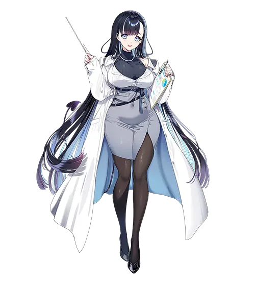
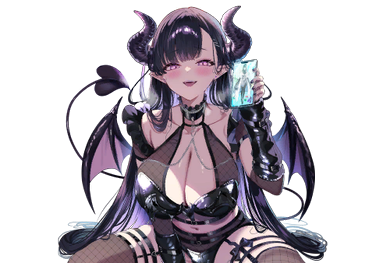

# 安栖泽香恋

| 角色信息   |  |
| ----------- | ----------- |
名称|安栖沢　香恋（あすみざわ　かれん）
年龄|外表年龄20岁左右
职业|营养管理APP的助理姐姐
对应乐曲|内臓♡マニピ
| 对应版本 | Chunithm X-VERSE

注：人物可能恶搞了日本的营养管理APP《あすけん》以及其中同样出现的营养管理的助理形象。

## Episode 1 既是我的一小步，也是我的一大步

“哈啊～～～”

结束了拉面店的零工，我正走在回家的路上。

有气无力地走着的我，只能低头看见自己那双脏兮兮的运动鞋。

 

“感觉……怎么不太一样啊……”

 

明明拼尽全力拿到了学分，好不容易结束了大学一年级的学习生活。明明才在手忙脚乱之中习惯了大学的崭新生活，想着终于能沉下心思考目前现状的时候……无论怎么想都只能望洋兴叹啊。

没有进自己选的第一志愿，而是去了次级的大学，又因为刻意回避那种活跃热闹的学生氛围，所以一个朋友都没有，在打工的场所也跟空气没什么区别，自己的长相就算再怎么算，在人群中也只不过是中下水平。

当然，像我这种人，也不可能有什么对象——

 

“我的大学生活，本来不该是这样的啊……到底是哪里出了问题呢？”

 

又来了。这是我的坏习惯。

每次都是临到头了后悔，却从来不为了改变而行动。

结果就是每次都给自己的拖延找个正当的理由，就这么无所事事地度过每一天。

一想到这个，就又对自己的厌恶多了几分。我深深地叹了一口气，打开了公寓的门。

 

“我回来了。”

 

向着空无一人的房间打了个招呼之后，我就立刻将背包扔在地上，然后直接扑向了床铺。

我没有那种讲究室内装修的爱好，也不会邀请客人来家里。在这个只有最基本生活用品的朴素房间里，我翻了个身，仰面躺着，望着天花板。

天花板贴着唯一的一张海报。上面印着的是穿着单件连衣裙，头发垂到耳后，正用手撩起头发的莉子酱。

 

“莉子酱真可爱啊……好想跟这种清纯的妹子交往啊……！”

 

当然，都大学生了还在妄想着跟偶像交往什么的，我知道这很羞耻。但是不论怎么样，我都会止不住地去联想——

可爱又清纯，虽然有些内向但却十分温柔的女生。要是能上大学的话，应该就能够遇见这样的女孩子了——

 

“……我也曾有如此想过的时期呢。”

 

怎么想都不可能吧。

连同年级的女生的联络方式一个都问不到，像我这种人怎么可能会有人喜欢呢？

妄想着某天会突然出现在自己的面前然后告白？就算是近几年的恋爱喜剧漫画都不这么画了吧？

 

“而且，还有‘这个’……！”

 

我愤恨地看着自己的肚腩。

在家就一直在吃方便面，在工作的地方就吃拉面。

自从我开始一个人住之后，我的肚子就开始一天比一天大了起来。要说跟去年的自己相比有什么优势的话，那大概就是如果在雪山里遇难，也许能靠这点肥肉多撑几天吧……

 

“呵，我都懂的……反正我这种人……”

 

反正。

反正我不行。

反正没有任何意义。

我已经不知道这么念叨了几百次几千次，怎么挣扎，最后都以放弃告终。

但是——如果真的，就算一次都好，就试着挑战一下，又如何呢？

就算再辛苦也好，如果能够拼命地努力一把的话如何呢？

不再是被动地接受，而是自己主动地，积极地上去与人接触呢？

完全不想会不会被人甩掉的想法，努力去改变自己的形象，又如何呢？

 

“改变形象……吗。是啊，不尝试一次怎么知道自己的极限在哪里！我……我要踏出我的第一步！！首先，就从减肥开始！！”

 

罗马不是一天建成的。

想要改变我的形象的话，也得一步一步慢慢来。

这样的话，想必终有一天也会……

 

“绝！对！要……找到莉子酱那样可爱的女朋友！！然后度过充满浪漫的玫瑰色的大学生活啊啊啊啊啊啊！！”

 

抱着破釜沉舟的决心，我兴奋地大喊着，然后握紧了手中的手机。

如果想要减肥成功的话，除了要运动之外，也要改善平常的伙食。于是我开始在应用市场翻找那些能够管理日常伙食选择的健康软件，直到某个软件映入了我的眼帘。

 

“《<ruby>明练<rp>（</rp><rt>あすれん</rt><rp>）</rp></ruby>》……就这个吧。”

 

我下载了APP之后立马将其启动。

输入了自己的身高和体重等各类身体数据之后，我的减肥之旅，也就此开始。

“初次见面！这里是为主人的健康生活全心全意服务的小助理，安栖泽香恋哦！以后还请多关照！”

“主、主人！？这搞得是哪一出啊……？”

 

从健康管理的APP画面中，跳出了一个作为助理人物未免过于充满个性的女性形象。

面对惊讶的我，画面中的女性并未作出反应，只是以灿烂的笑容望着我的脸。

## Episode 2 姐姐系角色并非我所喜好

“葡萄糖、脂肪都摄取的太多了。首先还是控制高卡路里的食品摄取，多吃那些蛋白质居多的食物吧。现在主人的膳食分数……是1分！”

“哈啊！？一分？？明明我都已经戒掉拉面配米饭的习惯了啊啊啊！！！”

 

看着手机中的小姐姐——安栖泽香恋打出的的冷血无情的分数，我不禁叫出了声。

同时，在开始减肥的第三天，我终于意识到了现实的残酷。

 

“看来我是真的吃的太多了……而且，如果想要变成我理想中的体型，怕不是得狠狠地节食才行……”

 

根据APP的计算，我必须根据目前的体型数据控制摄入的各类食物。在这之中，像拉面这种东西，基本上都被打上了“尽量少吃”甚至是“绝对不能吃”的标签。

 

“如果一口气上强度的话，是很容易受挫的。主人，我们还是慢慢来吧！”

“咦，原来这样就行了吗？我还以为要做到一天只吃一顿才行呢。”

“要是反过来搞坏身体那就本末倒置了啊！主人，首先就从早餐改为沙拉开始吧！”

“哦，这种程度的话……感觉应该还不难？”

 

真是幸亏我是在自己的家中，不然这么跟个手机APP里的角色互相对谈肯定会被当成怪人的。不过，这并不是APP在那里自动地执行命令开口说话。

我，确实是在和安栖泽香恋“对话”着。

自从安装了APP的那天，安栖泽香恋便自称自己是搭载了AI对话功能的助理小姐姐。

作为AI来说，安栖泽香恋的智能程度，先不说和那些个著名的AI助手比，甚至跟那些大厂做的搜索引擎助手也不相上下。虽然如此强大的能力也让我时不时怀疑为什么这东西会装在一个健康管理APP里，但由于她的便利性，我很快就和她变成了无话不说的关系。

 

“食谱方面虽然也很重要，不过生活习惯也是需要改善的。主人啊，特别在……”

“搞什么啊。虽然我知道我确实是运动不足，但我平时也有准时去学校，也有去打工，哪里有问题？”

“……主人，你昨晚是什么时候睡着的？”

“呃……”

“明明就玩游戏玩到了通宵，一整晚都没合眼不是吗！”

“可恶！难道是因为注册的时候关联账号暴露了吗……！？那，那个，昨天虽然确实是玩了个通宵，但是也是有理由的……”

“理由？可以的话能告诉我吗！”

“我有个在游戏里认识很久的朋友哦。要是对方请求帮忙一起打团队副本的话，那可不能不帮忙呀。毕竟平时也承蒙对方诸多关照呢。”

“原来是这样呀……！主人您真是很为朋友着想，是个重情义的人呢！主人竟然是这么温柔的人，太厉害啦！”

“哈哈，这夸得可真够直白的呀。不过这倒是个能保持减肥动力的好设定呢。”

“**不 ——，这可是我发自内心的话哟？**”

 

这是何等准确的对话。

安栖泽香恋的对话不但看不出什么违和感，甚至还能反过来以我的性格为突破口向我提出话题。

而且随着一天天过去，她的表情似乎也越来越丰富了。她的喜怒哀乐都能通过屏幕传达到我的面前，仿佛就像是和一个**活生生的人**对话一般。

虽然不想承认……但对于仍然处于单身状态的我来说，我很享受与她的对话。

既有严厉的指正，也有温柔的鼓舞，而且怎么说嘛……也很可爱。不过对于喜欢年下的清纯类型女生的我来说，她简直就是完全相反的类型就是了……

 

“啊啊……如果我不只是一个AI的话，我就能够帮主人确实地完成减肥计划了……”

“确实地完成？你要怎么做？”

“首先是一日三餐都要严格遵守完美的营养需求，接着是形影不离地保证主人能够好睡好起。运动的话……虽然只能主人自己努力了，但是我会认真地记录的！然后，还有二十四小时三百六十五天……啊啊……**要事无巨细地管理主人的一切才行**……”

“哦……哦哦……”

 

与略有些胆怯的我不同的是，香恋的表情十分认真。她的脸上始终挂着灿烂的笑容。

虽然说让女孩子关照我的身体确实令人开心，不过要是从早到晚形影不离的话……还是有点可怕啊。

而且她还说了“管理”这样的字样。仔细一想的话，那样我就几乎没有任何隐私可言了吧。

虽然听着有些心惊胆战，但也就止步于想象了。毕竟香恋也只是APP里的一个AI，我也只能透过手机才能与她进行对话。

就在我一个人时而战战兢兢，时而松一口气的时候，香恋仿佛看穿了我的内心一般，轻声说道。

 

“……那应该才是最幸福的哦。”

## Episode 3 曾经无比寂静寂寥的房间

又是结束了一天的零工，已经是夜深人静的时候。

我仍是走在回家的路上。

我为了图便宜，选了一间距离比较远的屋子租住。

以前我还会一直抱怨着自己当时那不明智的选址愤恨地回家，但是最近的我，已经把这段漫长的归途当成了轻度的慢跑路线，一边锻炼着身体，一边踏上回家的路。

虽然吃饭也很重要，但是想要减肥的话运动也是必不可少的。这是香恋教会我的道理。

 

“哈哈，没想到高中时期的体育运动，竟然有如此重要的意义啊。”

 

稍微流了一些汗的我回到了家中，并未急忙跑去洗澡，而是一边打开冰箱一边启动了APP。

 

“最近我可是一直憋着没吃拉面，都要饿死了。晚饭应该怎么吃？”

“是呢……根据现在已有的食材，就用猪肉、菠菜，还有鸡蛋一起做炒菜吧？还有昨天剩下的烤鸡肝应该也有剩吧？”

“哦，这也不错呢。今晚这顿应该会很好吃。”

 

在香恋的帮忙下，我的生活发生了一大变化——那就是我终于开始自己做饭了。

如果想要控制自己平时的营养摄入的话，那还是自己做饭来得方便。

虽然一开始我还因为磨磨蹭蹭而提不起劲做饭，但是在香恋执拗的鼓励下，我终于是败下阵来，就像现在这样开始亲自下厨。

而香恋的AI性能也着实优秀，只是把手机放在旁边，就能实时监督我的做饭过程并提供帮助。

拜此所赐，从未做过一顿饭的我，也能简单做出能吃的饭菜了。

 

“嚼嚼……嗯，果然很好吃。我曾经一直以为吃饭能吃饱就行，所以家里都堆满了泡面的。但是像这样开始注意起营养之后，我竟然也开始注意起食材的味道了啊！总觉得，舌头好像比以前还要灵敏的样子？”

“实际上，过于偏激的食谱会让人的味觉变迟钝的。所以根据营养制定食谱自己做饭的话，不但好吃，对身体也是大有裨益的呢！”

“嗯，虽然这也是减肥的一部分，不过还是谢谢你了。”

“啊啊……！主人竟然如此地感谢我！我已经开心的要昏过去了……！”

“哈哈哈。明明是个AI这说的都什么话啊。对了，虽然估计已经问了无数次了。这次的菜单是根据什么的营养平衡制定的？”

“首先是猪肉和鸡蛋所含的蛋白质，接着还有提供**增强精力**的效果的锌元素哦！”

“……哈？”

“增强精力哦！”

“不，我知道是增强精力的效果啊！”

 

……怎么说呢，最近的她的语气开始随便起来，偶尔还会玩一些委婉的荤段子了。

我不想去考虑开发这软件的开发商是什么样的脑回路，身为AI的香恋的互动会产生如此的变化的话……我想肯定是因为我的缘故。

但是，我自己也没有任何在她面前说过黄段子的记忆，至少，我希望自己真的没说过……

 

“咳咳咳咳咳……啊，刚刚呛到了……我说你啊，增强**那方面**的精力到底有什么意义啊！”

“因为啊，主人不是一直都想交个女朋友吗？所以肯定要做好准备才行啊。”

“这下不都全说出来了吗！？”

“就算没有女友不也不错嘛？”

“所以不要说得这么直白啊！”

“呵呵，玩笑话就说到这里。也不只是补充精力，这也能提高主人的体力，有助于主人从疲劳中恢复。越是活力四射，就越能保持减肥的习惯，这样也能够吸引到周围人的目光，变得魅力四射哦。”

“哦，哦哦……这么一说确实是啊……好像还真有道理……”

“要是实在是饥渴难耐的话，找我排解一下也不是不行哦？”

“你当我真的敢啊————！”

 

明明只是个AI的香恋，却像是那种漫画里的姐姐角色那样挑逗着我。想必她本人，一定藏在手机的哪个角落里拼命地憋着笑吧。

 

“真是的……”

 

我一边感到无奈，一边却不讨厌这样的时光。

就在不久前，我还孤身一人，没有什么称得上爱好的爱好，在空荡荡、静悄悄的房间里度过每一天呢。

而如今，仅仅是因为有某个人的……也是属于我的笑声在房间里回荡，就让原本安静的这个房间有了温暖的感觉。

虽说那原本只是为了减肥而下载的一款应用程序，可发展成现在这样，也算是令人开心的意外收获了。 

 

“话说回来，之前短期内定下的减掉肚子上赘肉的目标完成得怎么样了呀？”

“嘿嘿嘿。功夫不负有心人，现在已经瘦到用手指捏不起来赘肉的程度了哦。”

“哇！恭喜恭喜！！”

“果然只要去做就能做到呀——”

 

一边说着，我想着掀起T恤确认一下，顺便又想到不如去冲个澡吧。

 

“我要去洗澡了，你可以休息了哦。今天不用再用那个应用程序了。”

“……主人。您要不要试着把智能手机带进浴室呀？”

“为什么？”

“因为我想看看主人的……啊，不是啦，是想看看变瘦了的肚子嘛♪”

“真是完全糊弄不过去呀！！”

 

这家伙到底是怎么回事啊……

这样的话，与其说她像个姐姐——倒更像个大叔了呀。 

## Episode 4 一声惊雷响起，不速之客来袭

“多谢惠顾——”

 

在收银台结完账后，我拎着一大堆购物袋，又朝着下一家店铺走去。

 

“明明是休息日……而且还得自己掏钱，太心疼了呀……”

 

正在大学专攻化学的我，为了准备下周一开始做实验要用的材料，从早上开始就在家居中心和药店之类的地方转了一圈又一圈。

行李的重量在不断增加，与之成反比的是，钱包里的钱却越来越少了。 

 

“要是学校至少能帮我们垫一垫器材费还差不多，没想到居然还要我们自费，太可恶了……哎呀，要是我考上的是当时第一志愿的学校，就不会变成这样了……不过说起来理科系的女孩子根本就是稀有生物啊……”

 

这样嘟囔着，我赶忙摇了摇头。

明明已经不能再这么消极了呀。在现有的状况下，只能全力以赴了。

能这样去思考问题，说不定也是多亏了减肥呢。

我开始摄入高品质的饮食，除了慢跑之外，还开始进行力量训练了。

虽然距离拥有帅气的身材还差得远，但确实因为变得健康了，感觉思考也变得积极起来了。

所以，虽然拎着沉重的行李发着牢骚，但脚步却莫名地轻快。

 

“啊——到了！终于到了！！我都湿透了呀！”

 

在回家的路上，毫无预兆地，天空一下子就暗了下来，紧接着就遭遇了一阵倾盆大雨，我已经顾不上别的了，连人带物就那样跌跌撞撞地倒在了玄关处。

早知道看看天气预报就好了。等到我明白，明明是晴天，可路上的行人却都带着伞的原因时，已经为时已晚了。

 

“哎呀，从半路上就彻底放弃了，还索性享受起被淋成落汤鸡的感觉了呢……” 

 

首先把袜子和T恤脱下来，直接扔到洗衣机里。今天光处理上衣可不行。从牛仔裤的口袋里掏出钱包，然后拿出手机，把手机连接上充电线后，就把浸了水的牛仔裤连带着内裤一起扔到洗衣机里了。

虽说现在是比较暖和的时候，但还是不想感冒呀。

就在我已经脱得精光了，正想着赶紧洗澡的一瞬间。

那原本拉着窗帘却没拉严实的窗外，突然被强烈的光芒笼罩，那光芒强烈得让人忍不住闭上了眼睛，紧接着—— 

 

“轰！！！！”

 

跟随着强光而来的，是一阵响彻云霄的雷声。

同时，房间里的灯也全部断电，房间变得一片漆黑，只能听到窗外的雨点声。

看来是停电了。

 

“刚才的那道雷……不会打到我这里了吧？”

 

面对刚刚擦肩而过的大自然之伟力，我在原地僵持了片刻之后，首先决定先把跳闸了的总开关重新打开。

那开关是在洗手盆下呢，还是玄关门口呢……我自从搬进来就从来都没碰过，所以顿时不知道往哪里找。

 

“呜呜……”

 

——等等。

刚才的这道呻吟声是什么？

那不是我的声音。我从刚才到现在就没说过一句话。

看起来也不是母亲突然打来的电话。

我也没有来玩的朋友。

也没有什么共享了房间钥匙的女友。

那……这又是谁？

能想到的，只有最坏的那个可能。

 

“……”

 

我屏住呼吸，小心翼翼地挪动脚步，尽量不发出声响，然后拿起了一件“武器”。

这是我刚开始独居的时候想着“说不定会派上用场”而买下的，之后就一直放在厨房靠着墙，从没使用过的“顶门棍”（就是那种又轻便又细长的家伙）。

全身赤裸地紧握着顶门棍的怪人——也就是我，就这样朝着玄关走去，把手伸向了靠近天花板位置的电闸。 

 

（数到三就按下开关，立刻敲下去，数到三就按下开关立刻敲下去……）

 

像念咒语一样在心里默念了十遍之后，我下定决心，用力启动了总开关。刹那间，伴随着噼里啪啦的细小声响，照明用的荧光灯开始闪烁着亮了起来。

声音是从最里面的床那边传来的。必须要赶在灯亮了引起对方警觉之前，把这个疑似小偷的入侵者给击退才行。

我脸上一副不知是要去攻击对方还是会被对方攻击的狼狈模样，一边大声呼喊着，一边向着房里冲了进去。 

 

“哇啊啊————！！”

 

在闪烁着的日光灯下，我看到床上果然躺着一个人影。

就在我举起了手中的棍子决定给这个不速之客一个教训的瞬间。

随着日光灯的完全点亮，出现在我面前的，却是个和“小偷”二字相差甚远的美女。

 

“……哈？”

那充满包容力且五官端正的面容。身着那身给人“大人”感觉的，那成熟、身材匀称的身体的雪白大褂。

我也不是那种能够邀请这样的人前来我家的大人物，怎么想都不可能和这样的人有什么关联的。

然而，不知为何，我却被强烈的既视感所侵袭。

这是谁呢？完全想不起来了。本来就因为恐惧而大脑无法正常运转的我，所采取的行动就像是成功率为零的糟糕搭讪一样。

 

“那个……我们，是不是在哪里见过面？”

 

与我同样露出惊讶的表情的美女露出了若有所思的表情，然后，从头到脚打量了我的全身——特别是下腹部，接着露出有些邪恶的表情说到。

 

“主人，看起来减肥很顺利呢♪”

## Episode 5 BIRTH OF KAREN

“好像是落下的雷电那强烈的电流，通过插座、充电电缆流进了手机里。”

“……然后，就发生了化学反应，你就出现了，是这样吗？”

“可以这么理解。”

“不不不……这根本算不上什么解释呀……”

 

慌慌张张穿上衣服的我，隔着充当餐桌的矮脚圆桌，和那个女子面对面。

就是那个自称和那个AI一样叫“安栖泽香恋”的美女。 

 

“能否再详细解释一下吗？”

“拜托了。”

“原因就是……那个哦。”

 

说着，女子指了指被扔在玄关处的那一堆购物袋。

也不知道是为什么，原本鼓鼓囊囊的袋子，感觉好像不知何时变得瘪瘪的了。 

 

“厨房的水和盐，还有主人您今天购买的碳、石灰、磷、硫以及其他各种各样的东西……构成一个成年人身体的成分奇迹般地汇聚在了一起，在强大电流的触发下，我就像是灵魂附体一样变成了人形，大概就是这么回事吧。” 

“这是哪里的炼金术师啊！而且这已经触犯禁忌了吧！！”

“世间总会发生不可思议的事情呢……‘裸之’……”

“不要像取称号一样这么叫我啊！”

（注：这里恶搞了《钢之炼金术师》的内容。在该作品中，人体炼成为其中的禁忌）

 

这怎么听怎么都像是超现实的胡扯，然而，这个自称香恋的女子确实就实实在在地出现在眼前。

而且，她脸上还带着和往常在手机里展现出来的同样的笑容。

我身边没有那种会搞恶作剧吓唬我的朋友。甚至根本就没有朋友。说到底，也没有人知道我在用这个减肥APP。就算知道，也没必要做这样的事。

我试图去寻找能反驳她这个说法的要素，可悲哀的是，现实的种种情况却把我的假设一一否定了。

我像是抓住最后一根救命稻草一般，猛地拿起手机，启动了那个应用程序。 

 

“不是吧……”

 

主机画面确实映出了香恋的模样。

然而那却只是张不会动弹的立绘，旁边还有一句“今天也要努力哦”这样的，一看就是程序设计好的信息。

这种事情从来都没发生过。身旁的女子靠向正呆若木鸡的我，说到。

 

“所以你也看到了，**我，就在这里**。你面前的我，正是与主人同甘共苦过的安栖泽香恋。”

“这……这不是真的吧……这种超现实的体验……不会真的发生了吧？”

“我清楚，主人不会那么容易就相信这样的事实。毕竟，我也很震惊。不过现在……嘿！”

 

一边说着，她缓缓地用双手捧住我的脸颊，触碰了上来。

 

“啊……！”

“你看，像这样就能触碰到主人您了哦。我觉得我的体温也能好好地传递过来呢，您觉得怎么样呀？”

“你、你这是干什么，哎……！？” 

 

虽然那双手冰冰凉凉，但是从那深处却又感觉到了一股适时的温暖。那双手就这么贴着我的脸庞，没有分开。

那确实是活生生的人所特有的温暖，伴随着这股温暖的，是宛如绢丝般细腻，是我迄今为止都未曾接触过的，女性皮肤的感触。

 

“行了，赶紧放手啦！”

“那个……主人……”

“要，要干嘛啊……”

 

两只手仍然贴在我的脸颊边，她那漂亮的脸蛋就这样缓缓地贴近了我。

那双仿佛随时都能将人的视野吸进去的眼瞳，现在正与我四目相对。

缓缓地，缓缓地接近。直到我们之间只有数厘米的距离。

难道说……这就是那个时刻的到来吗？

我还没有做好心理准备。明明甩开她应该是很简单的事，可我却像被蛇盯上的青蛙一样，身体动弹不得。

我什么都做不了，就在我下定决心闭上眼睛的那一刻——

 

“主人，您的皮肤有些粗糙了呢。”

“……啊？”

“要多摄入富含维生素B2的乳制品和菌类哦。像蘑菇牛奶汤就很不错呀。明天的早餐我推荐您吃纳豆呢。”

“别、别突然在这里做起膳食辅助的工作啊！！！！”

 

仿佛松了一口气一般，又有些失望一般。我怀着一种莫名的心情，浑身没了力气。

不过这样也好。我就这样对自己说，毕竟这样就可以一直待到像莉子酱那样的女朋友出现为止了。 

 

“……那，你接下来打算怎么办啊。”

“打算怎么办……是指什么？”

“就是生活呀，生活方面的事。比如住的地方啦，工作啦之类的。运营那个应用程序的公司也不可能给你发工资什么的……”

“是的呢。我本来应该只是个AI而已呀。而且就算解释了，您大概也不会相信吧。”

“确实啊……不过因为我之前有和你交流的日子，所以还勉强能理解……”

“要是主人您没能相信我的话，我可能就要把一些很糟糕的秘密给抖出来了呢。”

“啊，等一下？你这家伙，知道我的什么事呀！？”

“呵呵呵。哎呀，谁知道呢。不管您去哪儿，都会带着手机，所以我可能会知道各种各样的事哦。”

“不，说真的，拜托了，快告诉我你掌握了什么呀！我可是那种知道这种事就会睡不着觉的类型啊！！”

“呵呵呵呵♪”

 

我心里已经开始相信了。这家伙，毫无疑问就是那个通过和我对话不断学习的AI，安栖泽香恋。

不管是谁想要模仿，这种熟悉又让人感觉舒服的氛围，只有我才知道。 

 

“从刚才开始，您是在担心我的什么事呢？”

“哎呀，那肯定会担心的吧。虽然你好像知道这个世界的常识，可从今往后你得作为一个人独自生活下去吧？”

“啊哈哈，主人您真会开玩笑呢！”

“啊，开玩笑？”

“我怎么可能离开主人您身边呀。我可是您的专属助理，所以从早到晚，都会比以往更加用心地照顾您的哦♪”

“…………………………唉～”

 

我仰望着天空，重重地叹了口气。

不过，好像也只能这样了吧。

虽然她养成了有点古怪的性格，但实际上确实帮了我超多的忙。

而且，就算她是AI，都交流了那么多了，也是有感情的呀。我实在做不出毫不留情地把她赶走这种事。

 

“……我明白了。那么，再次请多关照了，香恋。”

“……啊！好的，主人！”

 

就这样，我的独居生活还没持续到两年就结束了。

接二连三发生这么离谱的事，我脑袋还没能完全冷静下来，也不知为啥，心里却一直在担心公寓的合同内容，想着这家伙会不会被当作宠物对待之类的问题呢。 

## Episode 6 身体的变化带来的余波

怀着诸多不安开始的与香恋一起的生活，出人意料地还挺不错。

像以往一样的营养管理自不必说，虽说出身于辅助AI，但从购物、做饭，到打扫、洗衣，涉及生活的方方面面她都能以一流的本事处理好。

当然，这些事我自己也都能做，也没有完全甩手交给她，不过在我去大学或者打工的时候她能帮忙把这些事都搞定，确实帮了大忙了。

 

而提出利用空闲时间进一步提升自我这个建议的，正是香恋。

如今的我，通过改善饮食已经减掉了赘肉。为了让自己变得更有魅力，她说，应该去练出实用的肌肉，并且注重穿搭时尚之类的。

 

“虽然很感谢你的提议，不过啊，这样一来我就得比以前更加依赖你去做各种事了，这样不太好吧？”

“呵呵呵，主人您总是这么温柔呢。您还记得吗？就是第一次启动应用程序时输入的内容哦。”

“啊——是目标来着。好像……是‘必定超级受欢迎的紧致完美身材课程’吧。当时想着反正选哪个都差不多，就随便选了排在最上面的那个……”

“帮您达成那个目标就是我的使命。所以您不用跟我客气的。倒不如说，能帮上您的忙是多么幸福的一件事啊……！”

 

看着抱着我的肩膀激动得身体微微颤抖的香恋，我不禁苦笑着。

我一边在已经成为日常的两人晚餐中伸筷子夹菜，一边思索着接下来该怎么办才好。

做什么都需要花钱，要不要周末试着去做做现场的工作呢，感觉还能当作锻炼。

 

“不过……没办法跟着主人您去学校或者打工的地方，还是挺遗憾的呢。这大概就是获得了肉体唯一的缺点了吧……”

“哈哈哈，你别老是抱怨了，这样的话应用程序用起来也能更舒心些呀。”

“您怎么这样……太过分了……哼……”

“别装哭了啊。”

“啊，被您发现了吗？”

“真是的……话说回来，我在大学里想起来一件事了。我被社团邀请了。他们问我‘最近感觉你开朗了好多呀，是不是在做什么呀？’……看来努力还是有一点成效的嘛。”

“哇……这不是很厉害吗！您肯定能交到好多朋友的！”

 

回想起以前的自己，因为不均衡的饮食，脸色总是很差，走路也总是弓着背。而现在呢，每天都能适量且好好地吃饭，而且多亏了力量训练，背也挺直了。

抬起曾经总是低垂着的头，就会发现不一样的风景。那些备受欢迎的阳光开朗的人也并非没有烦恼。而当我抱着试试的心理去看看时尚杂志学习一下女性心理的时候，我也明白了，要想让自己变得可爱，就得付出超乎想象的努力。

原来，大家都在尽全力用自己所拥有的资本去努力生活。

没有跟过去那样带着“反正怎样都无所谓”想法的状态活着，真是太好了。

 

“嘿嘿嘿……说不定距离我交到女朋友的日子也不远了呢。”

“毕竟这可是主人您的梦想呢——交到像莉子小姐那样的女朋友。”

 

说着，香恋看向了天花板。

在那里，依旧贴着一张穿着连衣裙的莉子小姐微笑着的海报。那仿佛将“清秀纯洁”这个概念具象化了的模样，让我不禁眯起了眼睛。

 

“主人……其实之前就想跟您说了——不，还是不说了吧。”

“喂喂，你这么说话不就是想勾起我的兴趣吗？有话就说完嘛。”

“明白了。那我就直说了哦。说实话，我觉得主人您所说的那种理想女性，是不存在的呀。”

“你说什么……？”

“因为本来就是呀！又可爱，又娇小，要花两年时间才能牵到手的女孩子什么的！现在可是令和时代呀，令和！而且呀，要是那么可爱的女孩子，早在高中的时候就该被那些坏小子追到手了呀！早该！一下子就被追走了呀！！”

“你、你这家伙……居然说出这种不该说的禁语啊！”

 

高中的时候，学校里的偶像女生就是不良学长的女朋友。

光是听到这种事，我的脑子就像要坏掉了一样，所以在我的认知里，这种事就等同于“不存在”。结果现在这家伙居然……！！

 

“你这是打开了潘多拉魔盒呀！？为何啊！我现在都能听到自己的脑子正在一点点融化的声音了呀！！”

“主人您冷静一下呀！确实，不是所有可爱的女孩子都是那样的！但是，拓宽视野也很重要呀！”

“视野……？”

“我觉得如果一直被理想束缚着，那能交到女朋友的可能性就会变低哦。就像人如果只摄入必需的营养元素是没法活下去的一样，去关注一些自己原本不喜欢的方面也是很重要的呀！”

“嗯，虽然这个比喻我不是很明白，但还挺有说服力的嘛……”

“比如说，身材很棒、包容力满满的姐姐类型怎么样呀？虽然热量可能有点高，但满意度我可以保证哦。”

 

双臂抱在胸前的香恋一边说着“就是这样哦”，一边挺了挺自己的胸脯，小声说道。

 

“不要啊！自己这样主动推销还一个劲往前凑，好可怕！我果然还是喜欢清秀纯洁的类型呀——！！”

“啊，真是个榆木脑袋呀！主人您的心变得更封闭了呀！！”

 

我当然明白呀，我又不是傻子。

不过呢，正因为我现在已经不再抱着“反正怎样都无所谓”的想法了，所以才要更加坚持啊。

想要怀揣着理想去憧憬，也不是什么坏事吧？ 

## Episode 7 梦总是在深夜中降临

“学长……下下周的周末你有空吗？”

“……啊？”

 

在半推半就之下，我加入了露营社团（氛围挺宽松的），而在与这些成员们一起在学校食堂吃午饭的时候，发生了这件事。

大部分成员吃完饭后都去上下午的课了，而我还独自一人留在那儿吃饭。因为我一直遵循香恋的教导，要慢慢咀嚼、好好品味食物。

就在这时，跟我搭话的是一位一年级的学妹。虽说她是学妹，但在社团里算是与我同期加入的。

 

“那个，学长你和我都还没有露营装备对吧。要是可以的话，那个……咱们一起去买怎么样呀？”

“啊，好……啊，不是！要是你觉得我可以的话，当然没问题。”

“太好了！那我就等着一起去购物啦！”

 

我满心欢喜地看着学妹挥着手离开的背影，一直目送她远去。

说实话，确实觉得她挺可爱的。她像小动物一样小巧玲珑，总是带着含蓄笑容的模样，在某些地方和莉子小姐有相似之处呢。说白了，就是我喜欢的类型。

话虽如此，虽说一直在练习与人交流，但也不是马上就能付诸实践的，之前也就是打个招呼、进行一些最基本的对话而已，这样的相处都快两个月了。没想到，她居然主动来邀请我了。

 

“这难道就是……我人生中最大的机会？”

 

在已经没人了的学校食堂里，我一个人呆呆地嘟囔着——。

 

“……情况就是这样啦。”

“原来如此。”

 

结束了一天的各种事儿回到家后，我把白天发生的这件事讲给了香恋听。

一直以来，她在我的“自我改造计划”里帮了数不清的忙，跟她汇报一下也是应该的。而且，到约会那天估计还得请她帮忙。

这个家伙，虽然说有着那种沉稳的姐姐形象的气质，但听到这种消息，想必也会乐的开了花吧。

然而，香恋听到后的反应却出乎我的意料。

 

“主人，真是太好了呢。不过这只是第一步哦，要注意别太投入了呀。”

“啊？感觉你兴致不太高呢？”

“我确实挺为主人高兴的。但是，第一次约会就兴奋过头然后搞砸了，不光被对方嫌弃，在朋友之间也会沦为笑柄，这种事挺常见的。所以我觉得得先给您提个醒比较好。”

“哇啊……说得好现实呀……”

 

确实，这种情况我也听说过，而且我也很清楚自己心里确实对这件事挺期待的，这让我无比懊恼。

作为辅助的角色来说，她这回答算是满分了吧，只是和平时的香恋不太一样的反应还是让我有点吃惊。

 

“从明天开始也得进行约会的练习了呢。”

“确实需要练习呀，拜托你了。”

“很抱歉呀，我可能帮不上忙呀。”

“啊，为什么！？”

“您忘了吗？我只是一个健康管理的助手。要是关于身体方面的事，我还是有自信能给您提供建议的，可要是专业之外的事，我也就是普通人的水平啦。没什么能教您的……”

“确实是这样呀……一直以来都是靠你帮忙，我都误以为你什么都懂了呢。”

“……要是一起想办法的话倒是可以啦。不过我可不能保证效果哦。”

 

说完，香恋就匆匆忙忙地收拾好吃完的餐具，朝着厨房走去了。

我明白香恋说的话。如果太依赖她的话确实不好。但是，对于她这一连串的行为，我要是还没察觉到违和感，那也未免太看不起我们之间相处的时间了。

 

而且，从这天开始，那种违和感日益增强，别说消除了，甚至可以说香恋变得越来越奇怪了，就好像深陷其中一样。

 

“主人呀，我来给您擦擦背吧♪”

“别——！！我不是说过别进浴室嘛！！”

 

每次我洗澡的时候，香恋都会冲进来。

甚至还——

 

“哎呀，水进到胸口里了……主人，您能帮我擦擦吗？”

“……自己擦。”

 

她总是在想尽各种办法试图和我有身体接触。

因为太过于露骨了，所以我也不会上钩，可香恋却一点都不气馁。

 

“……我说啊。我当然知道你是故意的，但你到底是怎么回事呀？以前我就觉得你有点爱开荤段子玩笑了，可最近这段时间特别奇怪呀？”

“那个，我是想着刺激一下您的睾酮呢。”

（注：睾酮，又称睾固酮，是由男性睾丸或女性卵巢分泌的一种类固醇激素，少量来自肾上腺，为男性主要的雄激素和合成代谢类固醇。）

“别把这事和工作扯到一起呀！！”

“正常健康的男性应该会很高兴的呀……主人您难道不高兴吗？”

“我都说了呀，我喜欢那种清纯的女孩子。那种不管不顾一股脑往前凑的我可受不了。”

“这是为什么呢？”

“怎么说呢……因为我希望彼此能更珍视对方呀。不管是自己也好，对方也好，冲动行事然后受伤，大家都不喜欢这样吧。”

“……确实是这样呢。主人果然是很温柔的人啊。”

 

说着这话的香恋，脸上看上去好像有点落寞。

那是一种好像放弃了什么重要东西时的表情，是以前的我也常常会露出的表情。

而那样的表情，我以前可从没在她脸上见过——。

 

——然后，就在第一次约会的前一天晚上。

自从香恋出现后，我就把床让给了她，自己睡在铺在地上的被褥里.这会儿我正处于半睡半醒、迷迷糊糊的状态呢。

脑袋还昏昏沉沉的，眼皮也睁不太开。

 

（怎么回事……？好像有人……在我……身上……）

 

模模糊糊的视线里好像有什么东西出现了。

看起来很柔软的白皙肌肤，还有一股甜甜的、让人感觉很舒服的香气。

而且还有一双闪着诡异光芒的眼睛，就像在黑暗中盯着猎物的肉食动物一样。

 

“呵呵呵……看起来好美味呀……♡”

 

我听到了声音，与此同时，视线也变得更清晰了些。

和那可怕的眼睛很相称的，是让人感觉很不祥的角……还有尖尖的耳朵以及尾巴……就好像恶魔一样……恶魔的……

 

“恶魔！？”

 

我一下子彻底清醒了，惊讶地叫出声来。

我赶忙想要推开对方，可却被压得死死的，就像被大石头压着一样，纹丝不动。

 

“您醒了呀……可能是氨基酸不足了呢……”

出现在那儿的，是虽然形象大变，但却仍然能认出来的香恋。

她穿着那种很暴露、让人只想恨不得移开视线的衣服，用那仿佛恶魔和人类融合在一起的身体，露出诡异的笑容……没错，就好像游戏或者漫画里出现的魅魔一样呀。

 

“您很明白嘛。没错，其实，我的真身正是吸食男性精气的梦魔，也就是魅魔。” 

## Episode 8 我的愿望，香恋的愿望

“事到如今也没什么好惊讶的了……你原来不是那个应用程序里的AI吗？”

“呵呵……本来啊，那个应用程序里就**没有搭载什么AI**哦。”

“啊……！？”

“用‘寄生’在那个应用程序里来形容，可能会比较恰当吧。我是诞生于网络世界的魅魔……对我们魅魔来说，想要在现代社会生存也挺不容易的哦？”

 

诞生于网络世界，又在网络世界生存的魅魔。

伪装成应用程序的辅助功能，管理使用者的健康，将使用者打造成为“一流的食材”。据说从健康的身体上吸食的精气，对于魅魔来说可是极品。

这可真是令人毛骨悚然。 

 

“……所以，你就看准把我养肥了的时候出手吗？你这怪物！”

“竟然说怪物什么的，真过分……而且，主人现在还远不到可以品尝的时候呢……特别是最近又松懈了下来，吃的东西又不健康了……”

“那现在这种情况又是怎样？怎么看都是不想放我走吧？”

“如果只是要吸收精气的话，只需要一瞬间就够了……主人甚至都不会意识到发生了什么。我只是……想要对主人施展媚惑之术而已。呵呵……这一切都是为了让主人能够爱我爱得无法自拔哦……”

“魅惑……之术……？为什么要这么做……？”

 

香恋听到我的话后，先是一副惊愕、呆愣的表情，紧接着就“扑哧扑哧”地笑了起来，那笑容，带着一种妖媚与孩子气相混合的纯真模样。

然后，她再次凝视着我，这般宣告道：

 

“肯定是因为喜欢呀，这不是明摆着的嘛。主人您可真是够迟钝的呢。”

 

喜欢？这家伙……喜欢我？

不是为了捕食，而是把我当作恋爱对象？

我我不明白。我从来没以这样的眼光看待过她，也从来没往这方面想过。

 

“……不过，我已经放弃了哦♪ 现在也……今后也，都不会再去尝试了。” 

 

说完这话，香恋脸上浮现出了前些日子曾出现过的那种落寞的笑容。

 

“这……又是为什么？”

“主人您的梦想可是追到理想的女友呀。要是我使用了魅魔的手段，那这个梦想就没法实现了……想要帮喜欢的人实现梦想，这不是理所当然的事嘛。”

“你这家伙——”

 

我本想说些什么像样的话，却又把话咽了回去。

因为香恋的眼神无比认真。

原本跨坐在我身上的香恋站起身来，伸了个懒腰说道。

 

“我本来没打算这样的……但是，看到您烦恼、痛苦，却依然一次次重新站起来。即便有些笨拙，却不顾一切努力生活的主人的样子，在我看来是那样熠熠生辉。而且……和我接触却没有被我迷惑住的男性，主人您还是头一个。所以我可能才得以深入了解您的为人吧。”

“香恋……”

 

我正搜肠刮肚想着该说些什么的时候，香恋像是在说不用我开口似的，轻轻一笑，然后慢慢地朝着玄关的方向走去了。

 

“喂，喂。你要去哪里！”

“……主人大人。明天的约会，可要加油哦。我……就在这里和您告别了。”

“为，为什么呀！只要你没有害我的意思的话——”

“呵呵呵。就算是魅魔，看着喜欢的人谈恋爱成功，那也是很难受的呀。”

 

我赶忙坐起身来，近乎哀求地对香恋说道。

 

“那既然这样！为什么之前要一起生活……一直以来都给我加油助威呀！你早就知道会变成这样的吧！”

 

正在打开玄关门的香恋，回过头来。

故意似的叹了口气，嘴里嘟囔着别让我说好几遍呀之类的抱怨话语。

然后，带着那最熟悉、平日里一贯的笑容回应道：

 

“肯定是因为喜欢呀，这不是明摆着的嘛。”

 

我呆呆地望着门关上，就那样一直站在原地，动也不动。

虽然好几次都想着要追上去，可双脚却像灌了铅一样，无法挪动分毫。

（可是，就算追上去了，那之后又能怎样呢？）

就是因为老是想这些有的没的，所以才不受欢迎呀。等我已经开始自我嫌弃的时候，时间已经过去了太久——。

 

——第二天。

我因为前一晚没怎么睡好，就这么拖着昏昏沉沉的脑袋来到了繁华街。

今天，正是为了和学妹以购买露营用品为由的约会。

虽说因为是初次约会挺紧张的，不过从约好碰面开始，到在各个店铺之间穿梭，聊天的氛围倒是很热烈，进展也挺顺利的。

当然了，这也是因为对方很会照顾气氛，由此我也明白了她是个内心很温柔的女孩子。

 

“这个睡袋好可爱呀……居然还有粉色的呢。”

“因为登山的时候也能用得上。这种专业用品为了应对遇难之类的情况，好像很多都是鲜艳的配色来着。”

“学长，你懂得好多呀！”

 

我虽说只比她大一岁，可在露营社团里也同样都是一年级的新生。

虽然只是临时抱佛脚学来的知识，不过看她挺开心的样子，我也松了口气。

 

“哇，据说这个干粮只要用热水泡一下就能恢复原样了呢。好厉害呀。”

“啊……好像挺方便的呢……”

 

这种时候，香恋会说些什么呢？她可能会说“是真空干燥的呀，这样营养成分损失少，很不错呢！”之类的话吧。

 

“……学长？”

“啊？啊，不好意思，刚刚走神了。”

 

不行啊，现在可不能想些多余的事呀。难得的约会，这样对学妹太失礼了。

而且……香恋已经不在了呀。

 

之后我们在几家店铺买好了东西，就来到了附近的一家咖啡店。

毕竟走了不少路，脚也挺累的了。正好有这么一家咖啡店，还挺庆幸的。

站在点单柜台前的我，尽量装作自然的样子，问学妹想喝点什么。当然，可不能直接说“我请客哦”什么的，最好是像理所当然一样点单然后付款（书上是这么写的）。

 

“嗯……那我要一杯拿铁咖啡吧。”

“好的。我要——”

 

刚要开口，脑海里就浮现出了一个感觉很熟悉的声音。

 

“咖啡也挺好的，不过柠檬酸对缓解疲劳也挺有效的哦！不如试试看柠檬水？”

 

……难道都出现幻听了吗。

我一边摇了摇头，一边点了一杯柠檬水。

 

“一直就想着能像这样和学长两个人聊聊天呢。”

“那个……虽然现在说已经有点晚了，不过你为什么会选择和我一起出来呢？”

 

刚在座位上坐下，我就回应了学妹有些羞涩地说出的这番话。

也许只有我自作主张把这当作约会了，对方可能只是单纯觉得是一起出来买东西而已。

 

“因为，一直以来，我就挺在意学长你的。学长你很温柔呀。学长你也是刚加入社团不久，却能留意到慌慌张张的我……”

 

那是因为……我本来就是那样的人呀。要是去年的我，估计心里就只想着自己的事了吧。

只是现在，我有了能去关心周围的余力了而已。

 

“学长平时总是看起来很有精神，身材也很挺拔呢。强壮的男性，果然很帅气呀。”

 

而这，光靠我一个人是没法实现的。

要是没有那彻底的管理和建议，我恐怕早就半途而废了吧。

 

“和社团的大家还有我聊天的时候，也特别好聊。有时候感觉在开玩笑，可该严肃的时候也会很严肃地说我们呢。”

 

正是因为平时身边就有一个不管是无聊的事还是正经的事，都能一起聊的人在呀。

原本有交流障碍的我，也在不知不觉中提升了交流能力。

 

“最主要的是，学长笑起来的样子很好看呢。学长的笑容，让人特别安心。”

 

……原来是这样呀。我，原来一直都是笑着的呀。

自从那家伙来到我那灰暗的房间后，我就再也没有愁眉苦脸、低着头过了。

因为有那家伙在，我才能笑得出来呀。

 

“嘿嘿……感觉有点不好意思了……学长你突然听到这些话，也会觉得挺困扰的吧。”

“没有，谢谢你呀。我挺开心的。不过抱歉啊，我……得走了。”

“啊？”

“我一定会补偿你的！但我现在有件必须要去做的事！”

 

我说完就抓起行李，冲出了咖啡店，急忙往家赶去。

才跑了没一会儿，就已经气喘吁吁了。

这一切的一切，都是多亏了香恋。因为有香恋在，才有了现在的我。

能成为一个会被别人喜欢的人，也是多亏了她。

而且，她虽然是和“清纯”完全相反的生物，却只是怀着纯粹的心意把我变成了现在的样子，这份心意，不正是最“清纯”的东西吗？

本来我应该是最清楚这一点的，可我这个笨蛋，却没能马上意识到这个事实。

香恋已经不在了。她去了哪里，我根本无从知晓。

我也知道就算急忙赶回家，等着我的也只是那灰暗的房间而已。

即便如此，也不知道为什么，我就是忍不住要跑回去——。

 

“香恋！！”

 

我用力推开家门，门的那一头。

果然，那里一个人都没有，只有那空荡荡的、熟悉的房间——

 

“啊，欢迎回来。”

 

香恋就这么坐在那里，像往常一样喝着茶。

 

“啊，你怎么在这儿呀！！”

“那个……我已经回不去网络世界了，而且，也没地方可去……”

“那你一开始就别走啊！！”

 

说着，我用力地抱住了香恋。

 

“我……我……！”

 

明明必须得说出来，可话到嘴边却怎么也说不出口了。反过来抱住我的后背的香恋，用温柔的声音说道：

 

“主人……没关系的，什么都不用说了。您已经被我迷住了呢。”

“啊，是啊！都没用什么魅魔的手段，我就是个容易被迷住的家伙呀！所以，你不要再离开我了呀。”

“……我知道了。我会照顾您直到死去的。您的一切，我都会好好照料的哦♡”

 

就这样，我的梦想以我自己都未曾预想的方式实现了。

同时，香恋的梦想也实现了。

今后，我大概会在这位有着姐姐气质的魅魔的照料下，继续幸福地生活下去吧。

每天每天，一边聊着无聊的事儿，一边欢笑着。

“来吧，主人大人！今天也要加油呀！希望摄入的卡路里少一点，收获的爱情多一点哦！” 