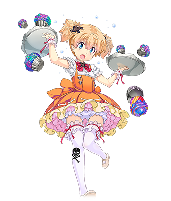
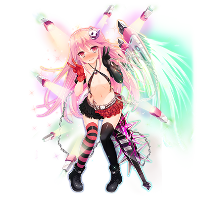

# 八咫乌钢太郎

| 角色信息   |  |
| ----------- | ----------- |
| 名称    | 八咫乌钢太郎   |
| 年龄   | 15岁        |
| 职业 |  秋叶原的摇滚天使  |
| 对应曲   |オススメ☆♂♀☆でぃすとぴあ |
| 对应版本 | Chunithm Air Plus |
| CV |田村ゆかり

注：由于原文以及人设原作者みさくらなんこつ的恶趣味，部分翻译句式和词句选择可能会有一定程度的修改。原文有相当多的地方致敬了みさくらなんこつ参与过的成人作品中的脚本和台词内容。角色的台词也是完全的致敬。

注2：由于角色本身人设特殊，所以对话的句子样式较为特殊，请理解。

## Episode 1 钢太郎醒来的第一句话 

> 大清早 我刚刚醒来 就发现自己被五花大绑了。

八咫乌钢太郎。

只要是对秋叶原有所了解的话，这个名字，是无人不知，无人不晓。

 

单薄到只能用布条形容的，极度暴露而煽情的服装。

怎么看都像是钉球棒的吉他“格拉姆尼尔”是钢太郎的注册商标，是他的专属武器。

钢太郎虽然身为秋叶原系的偶像，但擅长的却是摇滚乐。

而钢太郎，不只是音乐方面，就连他的生活方式都非常地ROCK。

钢太郎几乎每天都在跟着某样东西搏斗……跟“常识”和“规章制度”这样的，无影无踪的巨大存在战斗。
  
不止如此，在这个偶像们之间进行着以血洗血的残酷战斗的东京……哦不，“头狂”（注：东京的日文读音可以变成头狂两个汉字)，钢太郎还是一名所属于处于脆弱的秋叶原偶像势力旗下，效忠着那位带领着秋叶原偶像们艰苦奋战的女王·鬼蝮尤利娅的忠实战士。
  
今天，就让我们来近距离接触钢太郎的日常生活吧。

看起来，钢太郎好像从某个地方醒了过来……？

“大清早 我刚刚醒来 就发现自己被五花大绑了。”

## Episode 2 来自慰藉的天使的一句话

> （钢太郎）要为了秋叶原的男性们，成为天使♥~成为大家的偶像♥打心底想要这么做♥

那么，让我们稍微去了解一下关于钢太郎的事情吧。

《天使，聚集于秋叶原帝国的女王·尤利娅的大旗之下》。

这是身为秋叶原的人民都心知肚明的事实。

“天使”的一角，是大人气的女仆——叶和 都丽美（葉和　とれび）。每个周末都会有无数的客人来到店里，只为一睹那天使般的笑容，然而，她那破坏性的味觉给顾客带来的食物，又让人将其称作“终末的天使”。
  
而“天使”的另一角，就是钢太郎。钢太郎的称号，则是“慰藉的天使”。

钢太郎比任何人都慈悲为怀。不管是怎样严苛的爱的形式都能接受……不如说，接受的反应比任何人都更加严苛，极端。

不仅如此，钢太郎在各方各面都十分敏感，非常容易接受东西。不管多么细小的事情，都足以让他震惊到两眼翻白，让他华奢的身体止不住地抽动，而这样的钢太郎的姿态，已经是秋叶原的一大景观了。
  
一言以蔽之，钢太郎不管遇上什么样的事情，都能转变为足以让自己疯狂的喜悦之情。正如“慰藉的天使”其名，钢太郎比任何人都擅长“安慰，满足”自己。

而人们看着这样的钢太郎，都会打从心底里发出“至少，我比眼前的这个家伙过的还算正常的人生”的感慨，从而得到慰藉。

  

而今天，钢太郎也在向着台下的粉丝们呼喊着。

“钢太郎♥！要为了秋叶原的大家♥为了秋叶原的男生们♥成为♥成为♥成为偶像噢噢噢噢噢噢噢噢~♥”

……而身为大家的偶像的钢太郎，又为什么会被人抓住呢？

## Episode 3 询问职务时的一句话

> 要去了♥ 真的要去了♥ 就要去池袋了啊啊啊啊啊！！

——事情的开端，要从一天前说起。

今天，钢太郎也和往常一样，在秋叶原进行着过激的LIVE。

不过，那身衣服，还有形状可疑的吉他，还有钢太郎的动作，对于一般人来说，都太过激了。
  

“……那、那个，你能不能过来一下？那个东西是啥？吉他……吗？”

一名巡警鼓起了勇气向钢太郎发起了询问。

不过，钢太郎在这之后还得和尤利娅她们一起去池袋排练活动，所以没有时间在这里配合警察回答问题。

“要去了♥ 真的要去了♥ 就要去池袋了啊啊啊啊啊！！”

“喂！你给我等等！”

巡警抓住了无视质问打算直接逃离这里的钢太郎。

“这个！这不是危险物品吗！？让我看看……”

虽说巡警的要求是非常正当的，不过正有急事的钢太郎也被巡警的态度刺激到，不自觉地说出了暴言。

“啊啊！嗷嗷嗷嗷哦！！好臭啊♥好臭啊♥巡、巡警先生的口臭，感觉就算拿芳香剂都掩盖不掉的味道向我席卷而来哦哦哦！！”

“……你，能不能跟我来局里一趟？”

……于是乎，钢太郎这天不得不和巡警去约会（拘留）了。

## Episode 4 被警察带走前的一句话

> 钢——太——郎——被——抓——走——了——啊——

巡警把钢太郎带回了派出所。

“那么……我可要好好问问你，还有那个……吉他？的事情了。”

巡警拿着钢太郎身上的学生证开始了询问。

“……八咫乌钢太郎，15岁……直接称呼你八咫乌钢太郎没问题吧？”

就像是要回应巡警的质询一样，钢太郎睁着大大的眼睛，流着泪回答道。

“钢——太——郎——被——抓——走——了——啊——”

钢太郎的哭脸令人怜惜，巡警有一瞬间甚至产生了非常严重的罪恶感。

（不……再怎么说，那个跟凶器一样的东西都不能放过）

巡警重新打起精神，继续问着问题。

“……那个看着就很危险的东西是什么？真的是乐器吗？”

“是哦哦哦哦哦哦！！可以发出声音的哦哦哦哦哦！！只要摸那个地方的话，就会止不住地发出声音的哦哦哦哦哦哦！！”

“……啊，这么一说，还真的能拿来演奏啊。”

“要不要一起来♥一起来演奏看看♥♥”

“……才不做呢。……？”

巡警这时才注意到一个事实。

“……等等，你，难道是男孩子吗？男孩子穿成这样，难道不会丢脸吗？……不过话说回来，就算是女孩子穿成这样也是很有问题的啊。”

“噗嘻噗嘻嘻……嘻嘻嘻嘻嘻咿咿咿咿咿咿咿咿咿咿~♥”

不知为何，巡警的这句话一针见血，直接让钢太郎发出了奇怪的声音然后晕了过去。

## Episode 5 吃着晚饭时的一句话

> 钢太郎，因为吃到的饭太好吃了  兴奋到眼睛都要变成圈圈眼了呜呜呜呜♥

巡警不禁为自己让钢太郎受到如此大的刺激感到后悔。

而看着翻白眼，嘴角流出口水在地上抽搐着的钢太郎，在为他（的脑子）感到可怜的同时，还是努力地劝他起来先吃饭。

“……唉，我在这之后还是去调查一下这把吉他吧……钢太郎君，至少先吃顿饭吧。”

“唔嘿，嘿嘿嘿嘿嘿嘿♥太谢谢你了♥”
  

如果是拘留所的冷饭的话，对于衣着单薄的钢太郎来说，说不定会让他吃坏肚子的。

于是，巡警决定将自己吃的热腾腾的浓汤分一份给钢太郎吃。

“……普通人可没有这样的待遇，这可是单独给你的服务哦。”

从巡警那里拿到了浓汤的钢太郎，专心地吃了起来。

“啊哈♥啊哈♥太好吃了吧♥用浓稠的牛奶做成的，巡警先生给的浓汤，真的太好吃了啊啊啊啊啊♥”

“你、你觉得好吃就行。”

“太好吃了，感觉兴奋地眼睛都要变成圈圈眼了啊啊♥谢谢……谢谢款待……谢谢款待♥哧溜……哧溜♥嗯嗯……哧溜♥（舔）……嗯嗯♥”

“……没人会跟你抢的，稍微吃的有点风度吧。”

看着几乎是要把整个碗都吃干抹净的气势吃着浓汤的钢太郎，巡警不禁担心了起来。

（到底钢太郎君平时是过着怎样的生活啊……真的有好好吃饭吗？）

## Episode 6 躺在床上的一句话

> 被子，实在是太舒服了啊啊啊啊啊 万岁万岁万岁啊啊啊啊啊！！

吃完了晚饭，巡警再次开始了针对钢太郎的询问。
  
“嗯……确实能发出声音，不过这真的是吉他吗？这到底是什么构造啊？”

“不♥不知道♥不知道嘛♥真的……不知道呀啊啊啊啊♥”

“是……是吗……那么虽然有点对不起，不过我得先没收起来，直到确定这把吉他不是危险品才能还回来。”

“啊啊啊啊♥不要啊♥这样的事情♥这样的事情是不行的啊♥♥因为明天就要开LIVE了啊啊啊♥”

“……就算你这么说也不行啊。总之，现在已经是深夜了，今晚就在这里睡觉吧。”

  

身陷囹圄的钢太郎，也只能留在局子里过夜了。

不过，看到巡警为他准备的棉被，钢太郎还是开心地笑了出来。

“哦哦，哦哦哦哦哦要变得奇怪了噢噢噢噢♥啊啊啊啊啊啊♥棉被的味道啊啊啊♥闻起来就让人想入睡了哦哦哦哦哦哦♥”

“……你想睡的话，现在就可以去睡了。”

“被子实在是太舒服了，舒服到让我想大喊万岁噢噢噢噢 万岁万岁万万岁万岁万岁万万岁万岁万岁万万岁！”

“……嗯，不打扰你了，晚安。”
  
巡警似乎已经习惯了和钢太郎的互动，看着他躺进了被窝之后便熄了灯。

终于，从被窝里传出了钢太郎安稳的呼吸声。

## Episode 7 睡梦中的一句话

> 嗯哦哦哦哦哦哦哦哦♥  不好，要出来了啊啊啊啊  都丽美酱的浓缩奶油要出来了啊啊啊啊啊♥！！

夜幕渐深，巡警终于能在静下来的派出所里调查钢太郎的吉他了。

“……不管怎么看，都是凶器，不过却能够正常发出声音……真是莫名其妙啊。”

巡警叹了口气，开始翻找起钢太郎的档案的时候，不禁想起了他的生活。

（……钢太郎君，虽然他大声宣言过要成为秋叶原的男性们心中的偶像……到底他日常的生活是怎么样的啊？不如说，平时的他究竟有没有被当成人来看待啊？）

巡警的脑中充满了对钢太郎的疑问。

  

就在此时，从钢太郎睡觉的房间里，听到了非常大声的悲鸣。

“嗯哦哦哦哦哦哦哦哦哦……噢噢噢噢哦哦哦哦哦哦哦哦哦哦哦哦吼噢噢噢噢哦哦哦哦哦哦哦哦哦~♥♥哦哦哦哦哦噢噢噢噢噢噢噢噢哦哦哦~~~♥”

“怎，怎么了吗！？钢太郎君！？”

  

听到声音慌忙地冲进房间的巡警……翻开被窝之后，看到躺在床上的钢太郎的身体弯成了弓型，翻着白眼在床上痉挛。

“钢、钢太郎君！？你没事吧！……果然言行举止这么奇怪，是因为什么疾病导致的吗！？”
  
巡警摇着钢太郎的身体确认着他的安危……但仔细一看，钢太郎似乎露出了有点满足的样子，于是，巡警还是决定放着不管了。

……但是，钢太郎究竟是在梦中遇见了什么呢？

## Episode 8 汗流浃背的一句话

> 不要啊♥ 不可以啊啊啊啊啊啊♥ 请给我又浓又白的牛奶啊啊啊啊啊啊♥！

这时的钢太郎，正在梦乡中。

梦中的钢太郎，似乎是在都丽美的店里作客的样子。

而带着可爱的笑容的都丽美露出满面的笑容向着钢太郎打招呼。

“啊！是钢酱啊！呀嚯！欢迎来试吃都丽美今天的新作蛋糕哦！”

随着都丽美的拖车移动，一车子看起来就很危险的蛋糕被摆到了钢太郎面前。

“呀嚯噢噢噢噢哦哦哦♥不行的哦哦哦哦哦哦♥这真的♥♥不、不行啊啊啊啊啊啊♥会直接去了的哦哦哦哦哦♥吃了这个的话，钢太郎，就要升天了啊啊啊啊啊啊♥所以不行啊啊啊啊啊♥”

就算是钢太郎，看到都丽美的蛋糕也吓得脸色铁青，但是在都丽美纯真的笑容，以及由衷的恳求面前，钢太郎还是按下了抖M的开关。

心意已决的钢太郎张大了嘴巴咬了一口。

“都丽美的蛋糕……感觉好暖和……好松软……唔……”

突然，钢太郎的口中传来了剧烈的疼痛感！

“嗯噢噢噢噢噢噢噢噢……唔哦哦哦哦哦哦哦哦哦噢噢噢噢哦哦哦哦哦哦哦哦哦哦哦哦~~♥哦嗯哦嗯哦嗯噢噢噢噢哦哦哦呜呜呜呜呜呜呜呜呜噢噢噢噢哦哦哦~~~♥”

钢太郎由于口中的痛苦从椅子上摔了下来，只能蜷缩着身子抱头惨叫。

“啊——♥啊啊啊啊♥啊啊啊啊啊啊啊啊啊————————♥啊啊啊啊脑子要坏掉了啊啊啊啊啊♥”

痛苦中的钢太郎向都丽美伸出了手。

“不行了啊……要不行了啊啊啊啊啊啊啊啊！快不行了啊啊啊啊啊啊啊♥快点给我又浓又白的牛奶喝啊啊啊啊啊♥”

……梦中的钢太郎口中喷出了火焰，在地上挣扎着求着牛奶喝。

## Episode 9 喝牛奶前的一句话

> 钢太郎喝到了牛奶噢噢噢噢哦哦哦 牛奶真好喝啊啊啊啊啊啊啊♥

……第二天早上，巡警看到了面容憔悴的钢太郎。

（虽然说在这种地方能够睡个安稳觉的人本就不多……不过钢太郎这个样子真的没事吗？）

“对了，钢太郎，要不要吃早饭？”

巡警的提案，让钢太郎两眼放光。

“话是这么说，能提供的，也就只有牛奶，面包……哦，还有味增汤呢。”

“钢太郎！喜欢吃面包！喜欢喜欢吃面包~~！”

看到钢太郎的笑容，巡警松了口气，于是帮他准备了早饭。

“……来，快吃吧。”

“钢太郎要喝了噢噢噢噢♥牛奶好好喝哦哦哦哦哦♥”

看起来，钢太郎很喜欢喝的样子。

“牛……牛奶啊♥果然……果然喝这个东西就会感觉好幸福呢♥”

脸上写着感激不尽的钢太郎也帮巡警弄了份烤面包，然后坐到了餐桌边上请巡警过来一起吃。

“钢太郎，帮巡警先生准备了幸福的牛奶，还有热腾腾的味增汤……以及撒上了海苔碎的面包哦♥”

“那个……谢谢。那么我们一起吃吧。”

“好啊啊啊啊啊啊♥看看……用蛤蜊煮出来的味增汤，只要用筷子这么做的话……就会拉出一条丝线出来……这样汤也会变得更加完熟……更好喝的♥”

“不不不！味增汤什么的哪有‘完熟’什么的说法啊！你只是在玩食物而已啊！好了，钢太郎君，不好好吃饭可是不行的啊！”

……虽然早餐时间变得这么吵闹，不过巡警在心里的某个角落也在想着。

这样的早餐其实也不坏啊。

## Episode 10 释放前送别的一句话

> 风烛残年的警察先生，谢谢你哦♥

早饭过后，钢太郎的吉他最后还是被认定为了普通的乐器。

因为钢太郎的言行举止再怎么可疑，也不能放着没有罪证的他这么留在派出所里。

正因如此，巡警才在担心这个问题。

（真的能让钢太郎这么回到外面的世界吗？这孩子自身，说不定就是最危险的东西……）

然而，这个想法很快就不见了。

（不……虽说这孩子的行动非常地那个，不过至少还算是个好孩子。就信他一把吧。而且， 说不定就是因为这样自由的钢太郎，才能成为秋叶原的偶像，被大家所爱啊）

  
“……听好了哦，钢太郎君。下次你可得注意了。平时带着这么危险的东西出来的话，肯定会被警察抓到的啊。哦对了，尽量控制一下你的衣服不要那么暴露哦？还有，以后要正常地吃饭哦？”

“好的哦哦哦哦哦哦♥”

巡警感觉自己变成了个唠叨的老妈子。他一边回想着昨天到现在的经历，露出了略显寂寞的笑容，向着钢太郎道别。

“……那么再见了，钢太郎君。不管怎么说，我过得还是挺开心的。”

“钢太郎也是哦——”

“那么一路小心。”

“风烛残年的警察先生，谢谢你哦♥”

“……我才二十多岁啊。”
  
钢太郎踏着轻快的脚步走出了警察局。

## Episode 11 精神饱满的一句话

> 欸嘿欸欸欸欸欸♥ 太棒了啊♥ LIVE什么的真是太棒了啊啊啊啊啊啊♥

又一天……刚刚结束了巡逻的巡警，偶然间走到了钢太郎的LIVE会场。

就算之前才被他折腾了一整天，结果还是没法忘怀。

在舞台上的钢太郎正疯狂地挥舞着吉他，进行着疯狂的LIVE演出。

  
“大家♥为了守护大家的梦想……请大家一起……一起大声欢呼万岁吧♥谢谢大家了♥”

钢太郎正沐浴在粉丝们的呼声之中。

（搞什么啊，钢太郎君，这不是能够正常地进行偶像活动嘛。虽然有点被吓到了）

巡警放下了心中的大石头。

……然而，下个瞬间，在聚光灯的沐浴之下，还有愈发高扬的粉丝们的欢呼声中，全身充满快感的钢太郎举起了双手摆出了V字手势，泛起了白眼，直接僵在了当场。

“嗯哦哦哦哦哦哦哦哦哦♥唔哦哦哦哦哦♥不错啊不错啊啊啊啊！！果然LIVE什么的，真的太棒了啊啊啊啊！！♥哦，哦，哦♥！！太棒了啊啊啊啊啊啊啊♥”

  
在那个瞬间……他的裙摆翻了起来。看到了裙摆下的东西的巡警，不禁哑口无言。

（怎么会……我才刚刚打算信他一把，才把他放了出来，结果就在我的面前，举行了这疯狂到足以让普通粉丝退避三舍的变态LIVE，不仅如此，还十分享受，竟然向着我还摆出了v(゜∀。)v的表情吗！！！）

“钢太郎君……说不定，很快又要和你再见一面了啊。”

……巡警望着钢太郎的方向默默地说着，静静离开了会场。