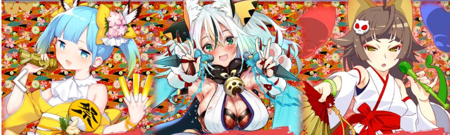

# 伊贺崎楠子

| 角色信息   |  |
| ----------- | ----------- |
| 名称    | 伊贺崎楠子|
| 年龄   | 20岁    |
| 职业 | 江户时代的偶像|
| 对应曲   |ドルオタ忍道！楠子ノ巻
| 对应版本 | Chunithm Crystal Plus|
CV|原田瞳

译者：毛颜

（注：从该篇章开始，各分集的标题都是GALGAME标题的恶搞。）

（该人物故事紧接上一篇“知云云雀”，请预先观看保证最佳阅读体验。）

## EPISODE1 <ruby>楠子来袭！<rp>（</rp><rt>楠子が来る！</rt><rp>）</rp></ruby>

>爱理为首的一行人击退了江户偶像·知云云雀。但是，另一名刺客也已经开始了行动！

（注：名称恶搞了Alicesoft的《邪夜将至（	夜が来る！-Square of the MOON-）》）

这里是前情提要！

 

嗨～！各位早上好！

这里是天才美少女冒险家英格丽特的说！

 

来到了魔大陆秋叶原的我、桃子还有爱理3个人。

在那里我们看到的是，被3位偶像所支配的秋叶原的街道。

 

那三位偶像应该知道尤利娅等人的去向。我们这样想着，克服了各种各样的困难，终于来到了UGX的说。

那三名偶像就在那里等待着我们。

竟然，她们是活跃在江户时期的偶像的说！

原来这么久以前就有偶像了的说！

新偶像，大发现的说！

 

她们的目的就是为了创造一个适合御宅族生活的世界，但是，没想到要将全人类全部宅化……

也向我们提出了一起联手的邀请。

虽然对于宅宅来说是个温柔的世界，但是，把全人类强制御宅化绝对是错误的！

 

我们强硬地拒绝了她们。

但是没想到居然很容易就被抓住了，这帮宅宅意外的很强大的说！

 

在这之后，居然要和在我们之前被抓住的叶和都丽美还有八咫乌钢太郎一期在live会场给宅宅们进行现场live的说。

哈，我从来就没有登上舞台过的说！应该没什么问题吧的说？！

 

当我们到达livehouse的时候，那个江户偶像知云云雀已经开始现场演出了。

并且在这场live中，她发动了洗脑兵器“Otaku wave”并对地面进行扫射了的说！

成为目标的游乐园还有约会点，全都染上了御宅族的颜色的说！

 

如此巨大的威力让我们吃了一惊。

总之我们想尽了各种办法都没有逃脱，最后还是登上了livehouse的舞台的说。

虽说是即兴表演，但除了我以外都是作为偶像活跃的专业人士。现场气氛很是热烈的说！

 

我也努力过了的说……真的……。

 

在盛况气氛的舞台上，云雀再次登上了舞台，让气氛更加热烈的说。

不知不觉间台下的宅男们居然分成了两组，激烈的相互对抗起来的说！

趁着这股混乱，我们借助桃子的主意和爱理的魔法一击打倒了云雀，像脱兔一般逃出了live会场的说！

话虽如此，但是其他江户偶像和宅宅肯定会追上来的说！

 

跑啊跑，别停下来的说！

怎，桃子怎么跑不动了的说！？

桃子振作一点！

 

于是乎，

欲知后事如何？魔大陆冒险谭第二集！

现在开始的说！

## EPISODE2 <ruby>三角谈话 <rp>（</rp><rt>とらいあんぐるトーク</rt><rp>）</rp></ruby>

>不幸被宅宅们包围的钢太郎。这时，传来了一个听起来很沉稳的声音

（注：该章节标题恶搞自ivory开发，JANIS发行的《とらいあんぐるハート》

5人好不容易从“triplets秋叶原”逃出来。

但是，为了继续逃离可能追过来的云雀还有其他江户偶像，或是这帮偶像的亲卫队，大家只能继续不停奔跑着。

 

“等……等等我……快不行了……”

 

年纪最大，担当殿后的桃子第一个发出了最没出息的声音。

顺便说一句，桃子绝对不是主动殿后的。

毕竟对于长期宅家不运动的人来说，虽然不是没有经验，但是突然参加LIVE进行激烈运动，之后还要马不停蹄地跑着，不累才奇怪。

然而桃子不像其他4人，要么是现役偶像，要么是好奇心旺盛的自称冒险家。

即使如此，也不要小看自宅警备员的体力。

尽管如此桃子还是努力了，当她跑到车站对面的警察局时，终于筋疲力尽，以一个漂亮的头球滑行动作趴在了地上。

 

“真的不行了……脚要动不了了……我再也不当自宅警备员了……”

“桃子刚刚滑的很厉害的说！”

“我的眷属桃子哟，我可不会原谅你这没用的样子，Dark Heal！”

“啊叭叭叭叭叭！”

 

暗黑魔法的紫色光芒包围着桃子。

虽然应该是治疗系魔法，但看到桃子开始不断抽搐的身体，英格丽特的表情变得紧张起来。

 

“接下来该怎么办？那个叫‘<ruby>阿宅哈喽跟<rp>（</rp><rt>オタク・ハロゲン</rt><rp>）</rp></ruby>’的东西？我们得阻止它！”

“是‘<ruby>阿宅之环<rp>（</rp><rt>オタク・ハイロウ</rt><rp>）</rp></ruby>’的说。”

“啊对对，就是那个～★”

 

虽然成功逃离了云雀和她的亲卫队，但之后的方针还没有确定。

都丽美提出了建议，但给桃子施了魔法的爱理又尖锐的反驳起来。

 

“在那之前！不把姐姐救出来是绝对不行的！姐姐的平安无事才是最！优！先！”

大概是担心至今仍被囚禁的姐姐吧。

爱理忘记了自己人设的语气，大声喊道。

 

“啊哇！也是，我们还得救出尤利娅才行！”

“哦哦，冷静下来的说，乖——乖——”

都丽美当然没有忘记尤利娅的事情，但是爱理咄咄逼人的样子吓得她浑身颤抖。

英格丽特则是夹在中间，安抚着两人。

 

“哦哦，三个美少女挤在一起，真是养眼……多谢款待……”

 

桃子跪坐在地上，双手合十，面对这在旁人看来令人兴奋不已的光景。

她的脸上早已看不出疲惫的神色。

不知道是爱理的黑暗魔法的效果，还是多亏了三个美少女贴贴的光景……。

 

“那，这边的话……”

 

桃子将视线从美少女们的身上移开，看向了不知什么时候被一堆宅男围住的钢太郎。

 

“这孩子，好像是在秋叶原活动的偶像wwwwwww居然能近距离观赏wwwww”

“哇哦wwwww真是太可爱了wwwwww”

“诶，真的是男孩子嘛？wwww在下，看来要打开新世界的大门了wwwwww”

“啊嗯，喵啊啊♥不行的啦♥这种事情，怎么可以呀♥♥♥”

 

被几个宅男围在一起的钢太郎虽然显得有些为难，但还是尴尬地笑了笑。

不愧是职业偶像，不论什么时候都不会怠慢对粉丝的服务。

 

“接下来该怎么办啊，真想回家睡个觉呢……”

 

小小嘟囔了一声，没人在意。

桃子摇了摇头，想站起来帮钢太郎一把。

就在这个时候。

 

“你们，在这里做什么？”

 

一个巡警从警察局里走了出来。

## EPISODE3 <ruby>邪恶的女干部们<rp>（</rp><rt>悪の女幹部たち</rt><rp>）</rp></ruby>

>江户偶像们进入了下一个作战。现在，楠子正一个人在秋叶原的街道上狂奔着。

（标题可能恶搞了《悪の女幹部「この私にオシオキだと!? ふざけるなっ！」》）

“回来了啊，云雀，楠子。”

 

就在爱理她们逃到警察局的时候，虎彻在“<ruby>阿宅之环<rp>（</rp><rt>オタク・ハイロウ</rt><rp>）</rp></ruby>”的控制室里迎接着二人归来。

 

“虎彻姐姐大人！我，我好不甘心哇～！本来好不容易才帮上姐姐们忙的！”

 

被楠子抱着的云雀还没等地上，就对着虎彻哭了起来。

虎彻温柔地抚摸着云雀的头。

楠子只能羡慕的看着这幅光景。

 

“好啦好啦，别哭鼻子了。第一波的照射可多亏了你的活跃，现在已经发挥出十足的力量了。”

“真的吗～？”

“还流鼻涕……真的哟。所以别哭了，而且，还有事情要交给你去做。”

 

云雀满是泪水的鼻涕的脸贴在虎彻身上，弄得虎彻皱起了眉头。

她赶紧摆正表情，抓住了云雀的肩膀。

 

“接下来的目标就是现充的地盘湘南。统治这个地方需要更多的能量。云雀，希望你能帮我收集能量。”

“呜呜……我会加油的！”

 

尽管还穿着偶像服，云雀还是用袖子抹了抹脸擦干泪水和鼻涕，然后便跑开了。

虎彻看着这一幕，叹了口气。

 

“被人仰慕并不是坏事，但果然小孩子就算复活了也还是一如既往的麻烦啊。”

“哎呀～你看她平常看起来很强势，但是一有什么事就哭着来找我‘姐姐大人～’，真的很可爱的呀。虎彻肯定不懂的喵。”

“你也是个麻烦人啊。”

 

看到虎彻不耐烦的神情，楠子脸微微泛红。

虎彻又忍不住叹了口气。

 

“楠子，你得赶紧追上那逃跑的五个人，虽然她们看起来是无足轻重的存在，但我不想整个计划被她们打乱。”

“呵呵，遵命。”

 

红着脸的楠子带着严肃的表情做出回复，一溜烟就消失了，就好像那里从来没有人来过一样。

控制室只剩下虎彻独自一人。她第三次叹了口气。

 

“就算复活了，我也一样没有任何改变吗……”

 

楠子从秘密基地回到地面，从大楼上眺望着秋叶原的街道。

然后把手凑近自己的脸，使劲用鼻子吸气。

 

“……嗯哈哈！太棒了喵，受不了喵！云雀的味道……幼女的味道……还混着LIVE结束后的汗味……喵呼呼～”

 

楠子脸上挂着糟糕的表情，全身剧烈的扭动着。

 

“想起来了喵……刚刚还泪眼汪汪地依偎在我怀里的云雀……吼吼吼！”

 

楠子的脸一直红到了耳朵根部，眼眶含泪，就像快要融化一样，口水从嘴角滴了下来。

正如各位所见，楠子是“认真”的。

楠子回过神来，摇了摇头。

 

“糟糕糟糕，差点就被妄想吞没了。宅宅忍法……阿宅分身术！”

 

随着楠子的手在空中飞舞划下各种印记，她的无数分身从天而降。

 

“来吧，我们一起来去找那些孩子喵。抓到之后，喵嘻嘻……”

 

一瞬间，楠子和她的分身露出了略显变态的表情。

但是下一刻，她们马上就像狩猎猎物的猎人一样，两眼放光地在秋叶原的街道上分散开来。

## EPISODE4 <ruby>为与明日御宅族相逢<rp>（</rp><rt>明日のオタクと会うために</rt><rp>）</rp></ruby>

>看着变了模样的秋叶原的宅宅们，巡警先生也悲从中来。

（注：恶搞了Purple Software的《明日の君と逢うために》）

看到现场有巡警的身影，宅男们全都嘟哝着走开了。

 

“我还想着外面是什么那么吵，原来是钢太郎啊。”

“好臭啊♥巡，巡警先生的口臭，感，感觉要习惯了哦哦哦♥♥♥”

“你认识那个警察大叔？”

 

看着二人亲切交谈的样子，桃子对二人的关系感到诧异。

刚刚还在争吵着的三人，不知道发生了什么，也来到了钢太郎他们的身边。

听这位警察的话，之前好像他在巡逻时有向[钢太郎问过话](/gumin/koutaro.md)，两个人就这么认识了。

不知道是不是因为当时的影响，现在的他也沉迷于偶像之中，成为了偶像宅。

 

“秋叶原飞起来之后，这里的宅宅们就好像发生了啥一样，变了个模样。”

 

巡警先生露出苦涩的表情，似乎对现在秋叶原的样子感到担忧。

 

“之前的秋叶原也有很多偶像活动，即便这片地方飞起来也没有改变。但是，现在的那些宅宅们可以说是毫无节操地围着偶像们转来转去。”

“我也不是为宅男们辩护，但是偶像去哪里偶像宅就去哪里不是很正常的吗？”

“不，不是这样的！”

 

巡警先生的声音突然变得急躁起来，和他的声音相反，他的眼神中带着几分悲伤。

“即使是这些女孩也有她们自己的生活。但是这些偶像宅们平时看到走在路上的偶像就会围上去，甚至触及她们的私生活。更有甚者，甚至还会在LIVE途中对偶像做出格的事情……简直就像是粉红票*哦。”

（*原文为“ピンチケ”，为“ピンクチケット”的简写，指的是以折扣价出售给初中高中生的以秋叶原为活动中心的偶像活动的入场券。由于许多使用这种粉红票的粉丝充满了各种不礼貌的行为，因此许多人使用ピンチケ来称呼这种不懂规矩的粉丝。）

“粉……是什么的说？”

“就是指那些没有礼貌的宅宅啦。”

 

原本是和字面意义完全不一样的词，但是在偶像宅之间，这个词拥有了新的含义。

事实上，每个偶像的LIVE现场都或多或少能见到这种人。

 

“宅男对偶像来说，就是ATM，这一点可别忘了。”

“哇哇，我才没有这么想过呢！”

“要，要被小钱钱喂饱了……要全部进来了哦哦哦哦哦♥♥”

 

都丽美和钢太郎温柔地接过话茬，巡警先生摇摇头“没关系”谢绝了二人的安慰。

爱理和英格丽特歪了歪头，并未理解其中的含义。

 

“虽然只是我的一己之见……我从那些女孩子身上得到鼓励，作为报答，我便以金钱报答她们……完全就是双赢的关系。”

“虽然不是很懂但听起来很达观的说。”

“不过也不是不能理解呀……”

“这帮宅男也是，他们原本并不是‘粉红票’那样的人，虽然不知道为什么会发生这么大的变化，但我也希望他们能恢复正常。”

 

五人看着巡警先生，他的表情中充满了悲伤和悔恨。

这时，巡警的手机响了。

看样子，这地方御宅族产生的骚动越来越大，甚至发生了纠纷。

 

“那我得先走了，你们也要小心那些宅男哦。”

“风烛残年的警察先生，充满幸福的牛奶，下次再给我喝喝哦哦哦♥再见——♥♥♥”

“……总觉得还会因为别的事再见到你呢，钢太郎君。”

 

巡警说完，就朝着UGX的方向跑去。

众人只能目送着他的背影远去。

## EPISODE5 姐爱模样

>思念姐姐的妹妹之泪。对于已无手段与江户偶像抗衡的五人来说，现在已是穷途末路。

（注：恶搞了BLACKRAINBOW开发的《姉愛模様》）

要是再被那些宅宅们缠上就麻烦了，5人在都丽美的提议下逃进了警察局附近的一个有献血logo的大楼。

 

“到处都是wota艺和mix的风暴……这就是教育啊。”

 

刚从警察局走没几步，就能看到好多宅宅在四处大吵大闹，桃子叹了口气。

 

“那个巡警也是因为愚民们的改变而感到悲伤吧。”

“果然，还是只有由我们来想办法吗？”

“虽然这么说，但该怎么办呢……”

 

目前，众人只知道江户偶像们正在策划“全人类宅化”的计划。

如果没有对抗的手段，那也无从谈起解决方法。

 

“呜呜，姐姐，好想见你啊……”

 

四个人还在谈论着的时候，突然，坐在地板上的爱理开始哭了起来。

之前由于各种状况让人武侠关注这些，现在会这样也是因为紧张的神经突然松弛下来了吧。

 

“这么说来啊，被抓的时候听她们说‘尤利娅她们是总控制单元’来着，所以，如果能救下尤利娅的话，说不定一切都能解决了吧？”

“真，真的吗？！”

 

看着哭起来的爱理，都丽美开始回忆起之前发生的事情，想着能不能从中找找解决方法，爱理也紧咬着不放。

 

“确实，那个狐狸女孩也说过，尤利娅她们现在就是动力源本身。”

 

被都丽美这么一说，桃子也想起来刚刚在UGX大屏幕下的情形。

 

“但是控制单元可是个很大的东西的说！那种东西，能放在哪里的说？”

“不行啊啊啊啊！这么大是进不去的哦哦哦哦哦哦哦♥♥”

 

如同英格丽特和钢太郎所说的一样，能够放置这么大的装置的地方可不多见。

桃子打开地图APP，试着找到街上能放置巨大装置的地方，不过这肯定是个很重要的装置，会放在很显眼的地方嘛？

 

“嗯，这个……肯定不是在天上。就算是地上也很微妙……这么说来，会不会在地下之类的？当然，怎么去地下我就不知道了。”

桃子半开玩笑这么说。

听到地下这个词，英格丽特突然两眼放光，而都丽美好像想起了什么似的大声说了起来。

## EPISODE6 <ruby>爱上地铁<rp>（</rp><rt>ちかてつ</rt><rp>）</rp></ruby>

>都丽美灵机一动想到了某个主意。对了，让我们下去地铁吧！

（注：标题恶搞了Lose社的《爱上火车（まいてつ）》）

“怎，怎么了的说？”

“地下！突然灵光一闪想到答案了★”

 

都丽美似乎想到了什么的样子。四个人的目光集中在了都丽美身上。

 

“之前都丽美还有其他人一起被抓住的时候哦，静乃酱她——啊，静乃是个很喜欢电车的可爱的孩子，前几天的话……”

“喂等一下呀！要脱轨了欸！虽然只是说那个电车而已！”

 

突然的沉默。

桃子清了清嗓，示意都丽美继续说下去。

 

“所以说，静乃酱一直说她很担心万世桥站啊。”

“啊，万世桥站……好像是神田和御茶水之间的那个吧？”

“嗯，因为指的是地铁站，所以可能不是你说的那个。听说现在已经不使用了，是个梦幻般的车站。”

“梦幻车站！我有兴趣地说！”

 

旧万世桥站。

它位于末广町站和神田站之间，在神田站完成之前作为临时站点设置了2年左右。

由于当时的资料几乎没有留存下来，有许多事情现在已无法探明，因此铁道宅之间流传着“梦幻车站”的说法。

（注：旧万世桥站现实中位于千代田区神田须田町，1912年（明治45年）启用。2013年，旧站址被改造成“mAAch ecute 神田万世桥”商业设施，保留了部分历史结构。现为集购物、餐饮、展览于一体的文化空间，并设有观景台供游客欣赏神田川和铁路风景。）

 

“从那里的话，应该也能去秋叶原的地下探险吧★”

“地下探险！……那就是魔宫的传说的说！”

“探险啊……嗯，好像也没有其他地方可去，去看看也未尝不可。”

“如果有机会救姐姐的话，那就赶紧出发吧！”

 

只是看到一点点的可能性，爱理就擦干眼泪，一个人跑出了建筑物。

 

“等，等一下，爱理！”

 

四个人刚想追上去，但爱理很快就又跑回来了。

 

“我，我还不知道位置在哪里……”

 

在问怎么了之前，爱理的脸就已经红彤彤的了。

完全陌生的旧万世桥站。甚至连在哪里都不知道就冲出去，会变成这样也是理所当然的。

都丽美微笑地看着这样的爱理，拉起了她的手。

 

“我知道地点，我们一起去吧★”

 

爱理红着脸点了点头。

五个人总算决定好了目的地。

正打算离开建筑物的时候，突然，风魔手里剑刺向了五个人的脚边。

 

“哇，什么？！”

“这什么玩意儿这是？”*

（*原文为「ちょとｓＹレならんしょこれは……」，为《最终幻想11》里面的网络俗语梗。在此处表达因为慌乱而脸滚键盘语无伦次的状态。）

 

被突如其来的攻击吓到的5人。

就在这时，不知何处传来了高昂的笑声。

面对未知敌人的出现，爱理等人开始紧张起来。

## EPISODE7 <ruby>猫抚Dystopia<rp>（</rp><rt>猫撫ディストピア</rt><rp>）</rp></ruby>

><ruby>无比·卑鄙下流<rp>（</rp><rt>スゴク・シツレイ</rt><rp>）</rp></ruby>的忍者。当与伊贺崎楠子目光相对之时，胜负便已展开。

（注：标题恶搞了Whitesoft的《猫抚歪曲（猫撫ディストーション）》）

（本篇内容完全是对《忍者杀手》的恶搞。在《忍者杀手》中，战斗前的问候是必须礼仪，但可以在问候前进行一次突袭。在《忍者杀手》中，不少专有名词和形容词都是以片假名形式分开标识。）

“是，是谁的说？”

“没有自报家门的必要！”

 

第一个对这高昂笑声作出反应的，是英格丽特。

抬头一看，楼顶上有一个人影。

人影纵身一跃。下一刻便英姿飒爽降落在地面上。那正是穿着似乎很时尚的江户偶像伊贺崎楠子。

看到她的身影，英格丽特惊呼起来。

“<ruby>诶诶！忍者！忍者为何！<rp>（</rp><rt>エエ！？　ニンジャ！？　ニンジャドーシテ！？</rt><rp>）</rp></ruby>”

“话说回来，我都报了两次名了喵！”

（注：此处英格丽特恶搞的正是《忍者杀手》中普通人类见到忍者时的反应台词。在原作设定中，忍者与人类是截然不同的物种，由于历史缘故忍者并不存在于人类认知，但在身体深处却有对其本能的恐惧，当人类见到忍者时便会产生NRS效应，外加此类台词。）

 

楠子气得直跺脚。

 

“为了我的朋友云雀的平安，在下要把你们扔进地狱的深渊喵！”

“等一下的说！”

“喵？！”

 

不知为何，英格丽特朝着手里拿着手里剑和苦无的楠子自信的大喊。

准备进入战斗姿势的楠子也停下了动作。

 

“听说忍者在进入战斗之前会有问候的礼仪*的说，没有进行问候的忍者据说会很失礼的说……”

（注：《忍者杀手》中的设定：对战场上的忍者而言，问候乃神圣不可侵犯的礼仪。）

“没、没听说过这种事……不，现在已经不是江户时代了喵。说不定现代早就不需要问候了喵……”

 

楠子的知识中存在空白。

其中发生了怎样的变化，现在的楠子无从确认。

 

（注：以下即为《忍者杀手》中忍者战斗前自我介绍的格式。）

“那模仿我的吧。DOMO，楠子=SAN，英格丽特DESU。”

“DO，DOMO，英格丽特=SAN，楠子DESU。”*

 

英格丽特漂亮地鞠了一躬，楠子也有模有样跟在后面。

楠子像英格丽特一样鞠躬起来的瞬间，桃子叫了起来。

 

“<ruby>快逃啊啊啊！<rp>（</rp><rt>逃げるんだよォ！</rt><rp>）</rp></ruby>”

（此处恶搞了《JOJO的奇妙冒险》第二部里乔斯达逃跑的台词。）

“敌前逃亡不是更失礼喵！ ？”

 

当然，楠子根本不会允许这些人逃走。

在往车站方向跑过去的时候，楠子居然从车站里冲了出来。

 

“哇，怎么被抢先了？！”

“后面也有人！这是怎么回事！”

 

爱理回头看了看后方，又看了看前方，前后加起来共有两个人，这是不争的事实。

不对，不止两个人，更多的楠子不断出现，很快爱理他们就被数个楠子组成的集团包围了。

 

“这，这是怎么回事的说？”

“太卑鄙了……可恶，真不愧是卑鄙下流的忍者……”

（注：此处恶搞了《最终幻想11》的论坛网络梗，原文为「汚いな。流石オタク汚い……」）

“你们就认命吧喵！”

 

大量楠子一齐扑了上去。

当然，爱理她们现在没有战斗的力量。

爱理她们反射性地把钢太郎推到前面躲了起来。

 

“不，不可以的哦哦哦哦哦哦！这么多人一起，嗯哦哦哦哦哦♥♥”

“哇嘎～～～～！这孩子好可爱喵～～～！”

 

不知道是不是这招凑效了，大量的楠子一瞬间就消失了，只剩下一个楠子扑向了钢太郎。

 

“哈呜——好可爱好可爱！好想带回家！”

“蹭蹭♥♥钢太郎扭来扭去♥蹭蹭好舒服哦哦哦哦哦♥♥♥♥”

 

一边是抱着钢太郎扭动的身体高速蹭脸的楠子。

一边是彻底高潮，在原地止不住地痉挛的钢太郎。

 

“嗯吼！wwwww竟然在大街上就能看到美少女搞百合！wwwwww”

“吼吼来啦！！！wwwww”

 

这样的光景，被躲在远处的宅男们用相机拍了下来。

其实其中一个人是男生的这一事实，眼前的这些宅男们也没有余力去判断。

 

“你们在看什么啊卧槽别给我看了散开散开！ ！”

 

被突如其来的状况激怒的桃子。

面对来势汹汹的桃子，宅男们纷纷逃之夭夭。

但是，楠子和钢太郎的攻防战仍在继续。

不知道该怎么办，四个人只能眼睁睁地看着这光景。

## EPISODE8 超级战忍楠子

>楠子坦白了自己的想法。爱理她们和楠子，为了彼此的正义互相交锋。

“哈……满足了喵……”

 

楠子到底抱着钢太郎过了多长时间呢？

虽然只是短暂片刻，但对于爱理她们来说简直漫长无比。

感到满足的楠子，擦着嘴角的口水，露出了温柔的表情。

 

“那个云雀，不，还有在下的主人对你们所做的事情，我感到非常抱歉喵。”

“事到如今还这么说干嘛？”

 

听到了意料之外的话，爱理困惑地问道。

 

“在下也明白的喵，将世界强制宅化是不对的。”

“那，那为什么要给那些愚民们洗脑，把他们全部变成御宅族呢！”

“这一切，都是为了全体宅宅们喵。”

“是为了拯救那些被<ruby>派对人<rp>（</rp><rt>パリピ</rt><rp>）</rp></ruby>们迫害的御宅族吗？”

 

桃子回想起在UGX对峙时的情景说到。楠子点点头同意。

 

“在下在江户时代被天保改革镇压了喵。”

“添，堡？”

“改革，什么的说？”

（注：此处指的是江户幕府于天保12至14年(公元1841年—公元1843年)，对幕政进行的改革，其中的主要内容之一便有抑制物价上涨，实行公定价格，禁止奢侈，矫正风俗，严格限制城乡人民生活，并且解散“株仲间”（同业公会），以废除其对商品的垄断权，实行自由交易，增加江户商品进货量的规定。）

听不懂在说什么，两个初中生歪着脑袋思考着。

 

“天保改革啊，限制奢侈品和娱乐活动来着。”

“你知道喵？”

“嘛多少知道一点。”

 

在这些人当中，桃子算是年纪最大的一个。

虽然过着自甘堕落的生活，但是简简单单的历史知识还是知道的。

 

“那些<ruby>派对人<rp>（</rp><rt>パリピ</rt><rp>）</rp></ruby>对御宅文化的限制，让许许多多的宅宅们沉浸在悲伤之中离开了这个世界……他们只是想拥有一个能够接纳御宅族的世界喵。在下也是这样想的。”

 

大概是想到了当时的场景了吧。

抱着钢太郎的楠子，脸上浮现了忧郁的表情。

 

“就算只是为了那些御宅族，在下也要为他们创造一个充满温暖的世界，仅此而已喵。”

“所以才会把愚民们，连带着普通人一起洗脑啊。”

“那也太奇怪了的说！”

 

英格丽特大声反驳道。

 

“因为打心底里喜欢才是正确的说！洗脑别人强迫别人喜欢御宅文化，这是不对的说！”

“说不定你的想法是对的，但是，有些东西是不这么做就保护不了的喵！宅宅忍法，阿宅分身术！”

 

楠子在手边划下许多的符号，大量楠子再度现身。

 

“不理解我也没关系喵，但是，绝对不会让你们来妨碍我喵！”

 

楠子大叫道。

以此为信号，一大批楠子朝爱理他们袭击了过来。

## EPISODE9 战栗的偶像狩猎

>5人对3000人的死斗。卑鄙地把钢太郎当作人质的楠子，就像是已然得胜一般，得意洋洋地舔了舔舌头。

”一下出现这么多，肯定是因为那个分身术的说！“

 

楠子的众多分身挡在五人面前，数量多到数一数都很麻烦。

退路彻底被切断了，爱理他们陷入了穷途末路。

 

“这里可是总共有3000人喵，你们可是一点胜算都没有的喵……要是不抵抗，我也不会太为难你们的喵。嘛，稍微‘叫几声’给我听听也不是不行哦。”

“3000人？”

“你，你到底想做什么？！”

 

大量的楠子一同咽了口口水。

脸上挂着的，都是一副花痴般的表情。

 

“我说啊，分身术其实很多都是除了本体其他都是幻影的模式，对吧★”

 

听着都丽美这么说，桃子捡起小石子，全力朝一个楠子的分身扔过去。

如果真的是幻影，那么石子应该会穿过去。

然而，扔出去的石子砸在了楠子丰满的胸部上，还弹了一下。

 

“这个分身术，可是在下为了能同时跑好几个LIVE现场，参加特典会不断改良的。全都是有实体的喵。”

“可恶，这也太卑鄙了吧！”

“而且！**就算把分身收回来，每个分身碰到的感觉、闻到的气味等等，发生在分身上的一切都会还原到本体的喵**！”

 

情况不仅没有改变，反而变得更糟了。

5 VS 3000。战斗力差距实在是太大了。

 

“先，先躲到那边的建筑物里面！”

 

再这样下去很快就会被抓住的。

这么想着的爱理一行人，赶紧躲进了旁边的绿色建筑物*里面。

（注：指的是位于秋叶原站前的成人用品店，在现今站前广场南梦宫秋叶原店的后面，当然，未成年人禁止入内。）

躲进大楼里的话，多少也能妨碍一些分身的行动。

4个人一边往楼上爬，一边把旁边架子上的物品往跟在后面的楠子扔去。

楠子们则用手里的苦无将扔过来的不知道什么的小玩意儿劈开。

 

“话说回来，这里的东西都长得好奇怪的说？”

“这都是什么店啊？”

“你们俩……唉，就算不知道也是没有关系的哦！”

“哇啊！都丽美也不懂啦！”

 

拿起来的东西全是奇奇怪怪的玩意儿。

尤其是那种大量**红银条纹相间的筒状物品**。

 

“对了！钢酱还被抓着呢！”

 

在往楼上逃的途中，听到都丽美的喊声，桃子数了数。

现在在这的，只有爱理、桃子、都丽美、英格丽特四个人。

 

“卧槽真的啊！”

“现在才发现已经迟了喵！”

 

追着4个人的楠子早已站在了楼梯口。

在她的怀里，钢太郎正在瑟瑟发抖。

 

“拿人质威胁实在是太卑鄙了的说！”

“卑鄙什么的可是夸人的话喵，那么，放弃抵抗吧喵！”

 

楠子得意地仰着脸。

已经没法逃了，爱理等人难道就要在这里放弃了吗？

但就在这时，注意到附近架子上某样东西的桃子，灵机一动想到了一个作战计划，扬起了嘴角。

这场对决，已经胜利了——

## EPISODE10 Chaos Arena

>桃子灵机一动，想出了逆转乾坤的秘策。被扩张到3000倍以上的敏感度之冲击，朝着楠子袭来。

（注：恶搞了5pb和Nitro+合作制作的《混沌之脑》（Chaos;Head））

“爱理酱，你的魔法能把东西变大变小吗？”

“我想应该可以，要做什么……”

 

桃子对一脸不安的爱理报以自信的笑容，和都丽美与英格丽特一起小声说了起来。

 

“你们在偷偷摸摸做什么的喵？”

 

楠子奇怪地歪了歪头。说完话，桃子、英格丽特、都丽美的手中都拿着一个球形的小瓶子。

爱理一个人则拿着关东煮手杖。

 

“还想战斗喵？就算不算人质这个战力差也……”

“报钢酱的一箭之仇！！”

“台词还没说完喵！”

 

都丽美无视还在说话的楠子，第一个将瓶子扔了出去。

楠子一边吐槽，一边对飞过来的瓶子摆好了作战的架势。

不过，楠子预想外的事情发生了。

 

“接受我的巨大化之力吧！Strong dark！”

 

爱理施展了魔法 ，抛向空中的瓶子变成了瑜伽球一样的大小。

楠子虽然吃了一惊，但是凭借达人级别的苦无技巧，将巨大化的瓶子切成了两半。

 

“这可没用喵！这样的东西……噗噗！”

 

不过，瓶子里面的东西可是切不开的。

被谜之液体溅到脸上的楠子，身体有些站不稳。

液体也溅到了其他分身的身上，可能因为是在楼梯附近，液体也滴到了楼下。

不过也仅此而已。

楠子并没有收到其他的什么伤害。

钢太郎也被液体溅到了，他的身体因为害怕还在瑟瑟发抖着。

 

“嗯，身体有点热，不过仅此而已喵！”

 

尽管如此，爱理等人的攻击并没有停止。

瓶子被扔了过来，然后被巨大化，楠子轻松地躲开。

确信这是她们唯一的攻击方法的楠子，逐渐接近着爱理她们。

爱理他们肯定因为没有对抗的办法才这样。

但是就在这时，其中一个瓶子爆炸了。

可能是爱理的魔法控制失灵了吧，里面的液体散落了一地，别说是楠子了，就连爱理她们也稍微沾到了一点。

爆炸的冲击波打碎了旁边的玻璃窗，液体如雨一般倾泻而下，打湿了在外面等候着的楠子分身。

 

“呜……这是什么啊……”

“身体……身体好热啊……”

“最后竟然还自取灭亡真是搞笑喵。都到这个地步了，也不需要分身了喵。”

 

看到瘫坐在地上的四人，楠子暗自窃喜，解除了分身术。

——就在这一瞬间。

 

“回来吧！分……嗯——呜！！”

 

楠子的身体宛如天雷划过一般。

她放开钢太郎，身子弓了起来，然后抱着自己的身体双膝跪地。

 

“喵……喵呜……这是什么……”

“……嘛，我们扔的只是‘增加些许敏感度的液体’。虽然效果只有一点点来着，不过如果洒在分身上会变成怎样呢……啊，看来也不用问是什么效果了。”

 

楠子想要知道缘由，视线却无法聚焦，声音也听不清楚了。

楠子的秘术是将分身得到的所有记忆和感觉还原到本体。

**如果全部3000个分身在“稍微提高灵敏度的液体”的状态下解除分身术的话，这“稍微”提升的灵敏度就会全部浓缩到本体中**。

结果就是现在的楠子这副模样。

（注：此处恶搞的是由BLACK LiLiTH发表的《对魔忍》系列里桥段。为了让角色屈服，反派会使用将角色敏感度提高到3000倍的方式进行调教。）

 

“啊呜……呜诶……哈……”

“看起来很难受呢……没事吧？”

“啊啊啊啊啊啊啊啊啊啊啊啊啊啊啊啊啊哦哦哦哦哦哦哦哦哦！”

 

都丽美担心的摸了摸楠子的肩膀，只见楠子用力向后仰着身体叫了一声，翻着白眼倒在地上，就此不省人事。

 

“啊，啊嘞嘞？”

“总算是，解决了的说？”

“虽然是我想的主意，但没想到会这么厉害啊……”

 

就这样，五人终于击退了江户偶像之一的伊贺崎楠子。

## EPISODE11 <ruby>悠之歌<rp>（</rp><rt>ハルカナチカ</rt><rp>）</rp></ruby>

>死斗结束，少女们头也不回地继续前进。为的是让洗脑的御宅族恢复原状，并且救出尤利娅。

（注：标题恶搞了《缘之空》的Fandisc《悠之空》（ハルカナソラ））

把翻白眼痉挛的楠子绑起来，五个人决定稍微休息一下。

 

“真的是各种意义上都很危险的战斗……”

“是呀，真的差一点就被抓住了……”

 

跨越了这场某种意义上如同地狱般的战斗，桃子顿感疲惫不堪。

 

“大家身体一定都湿透了吧，用这个擦擦吧！”

 
英格丽特说着，从包里拿出了纯白色的毛巾。

大家按顺序擦干身子，桃子接过毛巾，不知为何一直盯着毛巾看。

 

“果然毛巾很重要啊，嗯。”*

（注：*指新井桃子立绘和谐事件。在CRYSTAL代的印卡机可抽到的卡内，有一张“新井桃子/独自一人的温泉之旅”的卡片，这张卡抽到后可传导至游戏内获得对应的人物立绘（卡面色色的），游戏内的立绘最初是未和谐版，不过在一次游戏维护后的立绘加上了一条白色毛巾而被大量玩家吐槽。目前未和谐的原图依旧可以在pixiv找到。）

 

看着桃子喃喃自语的样子，其他四个人都歪着头。

**纯白的毛巾可以掩盖一切**，这一点桃子很清楚。

 

稍事休息的五人，决定朝着当初的目的地“旧万世桥站”前进。

 
“那，是在哪里的说？”

“诶～静乃酱当时好像说的是要从秋叶原epyon大楼前的通气孔进去呢★”

“那我们走吧，去姐姐那里……等着我，姐姐！”

 

为了把被洗脑的宅宅恢复原状，为了救出尤利娅。

五人走出了绿色的大楼。

 

“嗯……这是？”

 

爱理他们前往epyon大楼不久，楠子恢复了意识。

 

“好久没有这么糟糕的体验了喵……感觉，会上瘾的……”

 

液体的效果恐怕已经失效了，但楠子仍然无法忘记当时的感觉，扭动着身体。

 

“话说回来，居然竟然会被敌人利用了分身之术，真是太疏忽了喵。”

 

虽然自己并没有放松警惕，但自己还是被打倒了。

楠子认为自己是输给了爱理她们的团队合作。

 

“说不定，跟她们应该能成为好朋友喵……”

 

因为双方都有互不相让的理由才发生了冲突。

不过，若不是这样的理由的话……楠子想了想，摇了摇头。

 

“好吧，接下来该回到虎彻那里去了……喵！？”

 

想站起来的时候，发现自己的身体和手都被捆住了，整个身子正趴在地板上。

而且，倒下的地方还放着一个装着折磨楠子的液体的瓶子。

并且更不幸的是瓶子的盖子是半开着的——

 

“喵喵……噫噫噫噫～～～～！”

 

人只要品尝过一次的快乐，之后就很容易堕落于其中。

楠子娇艳的悲鸣，回响于秋叶原的街道之中。

  [1]: http://story.chunithm.top/usr/uploads/2025/02/3432084553.png
  [2]: http://story.chunithm.top/usr/uploads/2025/02/3743565181.png
  [3]: http://story.chunithm.top/usr/uploads/2025/02/503437298.png
  [4]: http://story.chunithm.top/usr/uploads/2025/02/2472430441.png
  [5]: http://story.chunithm.top/usr/uploads/2025/02/2324443338.png

