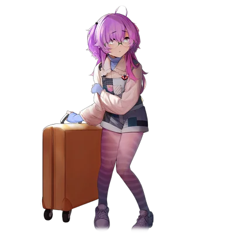

# 土吕城由衣

| 角色信息   |  |
| ----------- | ----------- |
| 名称    | 土吕城由衣  |
| 年龄   | 15岁      |
| 职业 |  JK/Coser（自称） |
| 对应曲   | Crack
| 对应版本 | Chunithm NEW|

## Episode 1 2.5次元的居民

>噗嘻，噗嘻嘻！又拿到一个赞了！果然被人追捧的感觉，最爽了~（爱心）

——偶像。

那是无数人梦寐以求的存在。

穿着漂亮的衣服，露出灿烂的笑容，端正的外表，再加一点天然呆的气质，只要有这样的人在，周围的空气都会瞬间明亮起来。

只要一张口，从那口中传出的，必是充满积极向上的气息的话语。

例如……我眼前的这个人。

 

“——不是常说吗，只要一直追寻着梦想的话，总有一天会实现的吗。我相信这句话！所以，大家也要诚恳地面对自己！不只是憧憬，也要为了梦想付诸实际行动！梦想，是用来实现的！对吧！那么，请各位听好了——”

 

噗嘻……

噗嘻嘻……

 

——那种事情怎么可能啊啊啊啊啊啊啊！！！

 

能够成为偶像的，不过是那茫茫人海中的少数几人而已！

长得既不可爱，自然也就没人捧着。

就算摆出吐舌头的可爱表情，只要不是美少女的话，就只会让人感到恶心而已。

像我这样又土，身材又平凡的人，只会沦为别人的笑柄而已！

总之我就是什么都没有啦！

反正，大家的起点，从一开始就是各不相同的。从出生起就是吊车尾的人，终究也只能以吊车尾的身份活下去啦！

 

“<ruby>已经动起来的这份心情～♪再也无法停息～♪奔跑吧，奔跑吧，奔跑吧～♪<rp>（</rp><rt>動きだした心～♪　止まらない～♪　駆けて、駆けて、駆けろ～♪</rt><rp>）</rp></ruby>”

——啊啊啊啊啊啊啊啊啊啊啊！！我受够了啊啊啊啊啊啊！！！

 

“只不过是听了点偶像曲，怎么就突然兴奋起来了啊！反正第二天就会把这些东西全部忘掉的吧！如果真的是这样的话，那这种东西还有什么意义啊！”

 
——噗呲。

 

“哈——哈——哈……”

 

我大喘着气，像是要把电视砸了一般狠狠地关掉了电源。

不妙啊……刚刚差点就酿成大祸了啊。

 

“真的是……为了当偶像就那么拼命吗。这种事情，难道不就是徒增疲劳？”

 

——不过啊……

 

“噗嘻……”

 

最近，我知道了，即便是像我这样的人，也有属于我的舞台。

“噗嘻……噗嘻嘻！今天也要努力收获一堆点赞！”

 

打开手机，显示在屏幕上的，是以俯瞰角度拍摄的照片。

用手挡住脸，穿着宽松的衬衫，将扣子开到不露点的地步，露出那浅浅的沟壑。

 

“来吧，鱼儿赶紧上钩吧～♪”

反正，现实世界是属于那些被人追星捧月的家伙的地盘。像我这样的人，肯定是没有容身之处的。

“啊，又有人点赞了！就是这样啊！”

 

正是如此！

现在的我，正是一名上传某些“涩涩”照片到网上的推特女子——“<ruby>由炭<rp>（</rp><rt>ゆーたん</rt><rp>）</rp></ruby>”！

 

“哦，有人回复了！看看啊……‘由炭的自拍，感觉有些危险啊！多露一点！’”

 

啊啊～太爽了吧～♪

只用拍点照片，就会有人围上来追捧你！这也太爽了吧！

 

说到底，到底要靠什么，才能在这个时代生存下去呢？

噗嘻，当然是<ruby>头脑<rp>（</rp><rt>这里</rt><rp>）</rp></ruby>啦！

 

不需要像偶像那样拼命。

也不需要练习唱歌跳舞，无需耗费多余的卡路里。

只要这样轻松几步，就能够获得如此的快感，感觉已经可以称之为电子毒药了吧？

 

“啊，又来了～！又钓到一个人啦！噗嘻嘻，果然男人就是些单纯的生物啊～♪”

 

只要从中感受过一次快感，就再也无法忘记了。

就算是我这样的人，也能够在这里生存下去。

成为万众瞩目的明星！

## Episode 2 COMPLEX GIRL

>吵死了吵死了吵死了！只有这里是属于我的圣域啊！你们这些俊男靓女就给我滚一边去！

“来了来了！还没上传多久呢，这么快就30点赞了！”

 

今天，我也是拿出了我的手机，进行着我的推特活动。一如往常，我获得了大量的点赞。

点赞数上升的瞬间，对我来说就是最棒的瞬间。不论查看多少次我都不会厌倦。噗嘻，刚刚又看了一遍。

 

“今天的由炭也很可爱哦！！”

“女神大驾光临啦——！”

“噗嘻！明明这些家伙都不知道现实中的我是什么样的，真的，太单纯了吧～♪”

 

只有这个瞬间，我才能够成为众人眼中的女神。

 

“那个……‘既然大家都这么捧场，那么，我也要更努力回应大家呢！’……爱心符号爱心符号爱心符号……”

 

随着我的回复发出，立刻就得到了其他人的回应。

啊啊，这些家伙真是困扰啊～♪

噗嘻，多说点吧，让我多听听几句对我的赞美吧！

 

“噗嘻嘻，赶紧看看……啊，出现了！我看看啊……”

 

——哈啊啊啊啊啊啊！？

 

“一眼丁真，鉴定为改。”

“你是正在读高中的学生吧？做这种事情，你就不怕家长知道了会怎样吗？要不要跟‘爸爸’谈一谈啊？”

“话说，为什么不露脸？不会全都是骗人的吧？”

“这，这都什么跟什么啊！”

 

烦死了烦死了烦死了！你，你，还有你！全都给我滚进黑名单里去吧！

我啊，可不喜欢这种东西。

我想看到的，只有对我的赞美而已！

 

哈啊……真的是扫兴。萎了。

 

“要是被他们缠上的话又会显得很麻烦，干脆重新开个账号吧？”

 

就在我再次启动app，准备删号的时候，手机传来了新回复的通知。

 

“哼……反正又是那种下头的发言吧？我懂我懂……不过，就让我最后再看一眼吧……可以吧……？”

“由炭，皮肤真的好漂亮啊！平常有用什么保养吗？现在，我在用这款即便底子较黑，用了也能显白的护肤液，由炭你怎么看？我觉得由炭用这款护肤液的话，肯定也能变得更漂亮的！”

 

跟着长文的，是一整排双手合十的表情符号。

接着读下去，出现的是长到直接把我的自拍的优缺点还有穿着等各种部分都进行仔细评论的漫长评价。

一直看到最后，甚至还附了像是那个女的自拍的cosplay照片。

 

搞、搞什么啊——

 

“烦死了烦死了烦死了烦死了！不要来妨碍我的圣域！你这种家伙，肯定就是长得漂亮，被人捧到天上去的那种家伙，来找我这种人，肯定是要把我的地位取而代之对吧！肯定是这样！”

 

不用问，你也给我滚黑名单里去吧！噗嘻！

妨碍我的乐趣的人，就统统给我滚出去！

## Episode 3 土气女孩与无赖们

>我是知道那些男孩子们是怎么看待我的。不过啊，现在这种事情怎么都无所谓了吧？

又到了周一上课的日子。

又到了百无聊赖的时间。

没错，那就是上学的日子。

 

“哈啊……真讨厌啊……”

 

这个名为“学校”的封锁空间，对于我这种身处于贱民阶级的土气女来说，简直就是地狱。

底层的人要么拼尽全力爬上高位，要么就跟那些上位者们勾肩搭背，确保自己的地位。

而如果中途失败了，那他们就会落入永世不得超生的最底层，只能期望学年结束，升上高年级再次分班而已。

当然，我也是翘首期盼着升上高年级换班的那些人的其中之一。

 

“——起立，敬礼。”

“谢谢老师的教导！”

“——说起来啊！这次也是很厉害啊！”

 

结束了一个小时的课程，学校这最为虚无的一面就展现在了我的面前。

在我前方的这个座位，那正是那些上位者的男生们聚集起来七嘴八舌的地方。今天，这里的吵闹还要更胜一筹。

这些家伙的脑壳里真的有脑子吗？

话又说回来，为什么这些家伙总是在我面前吵闹啊！

啊——受不了了。就算之后要被这些家伙戏耍也罢。

总之，现在就先装睡等待时间过去——

 

“我说啊，你们有没有看这周‘比奈’拍的cosplay照片？真的超可爱的啊！”

“就是啊！啊——我也想要个像比奈那样又可爱又会cosplay的女孩子当女朋友啊！”

 

不经意间，我听到了男生们说到的“cosplay”这个单词，偷偷竖起了耳朵偷听着。

偷偷瞄过去，那些男生们，正用饥渴的眼神看着一本封面印着穿着泳装的女性的杂志。

 

那封面上的女性，就是他们说的“比奈”吗？

嘛，嘛……确实是好看到足以放上去，样貌也是化妆到不会激起嫉妒的程度。不过……

 

“哼，这个叫‘比奈’的，估计也是靠着那张脸蛋和那副身材让你们神魂颠倒的吧……？”

“哈？喂！土气女！你小子敢对比奈酱说坏话是吧！？”

“噫噫！？”

 

我被吓了一跳