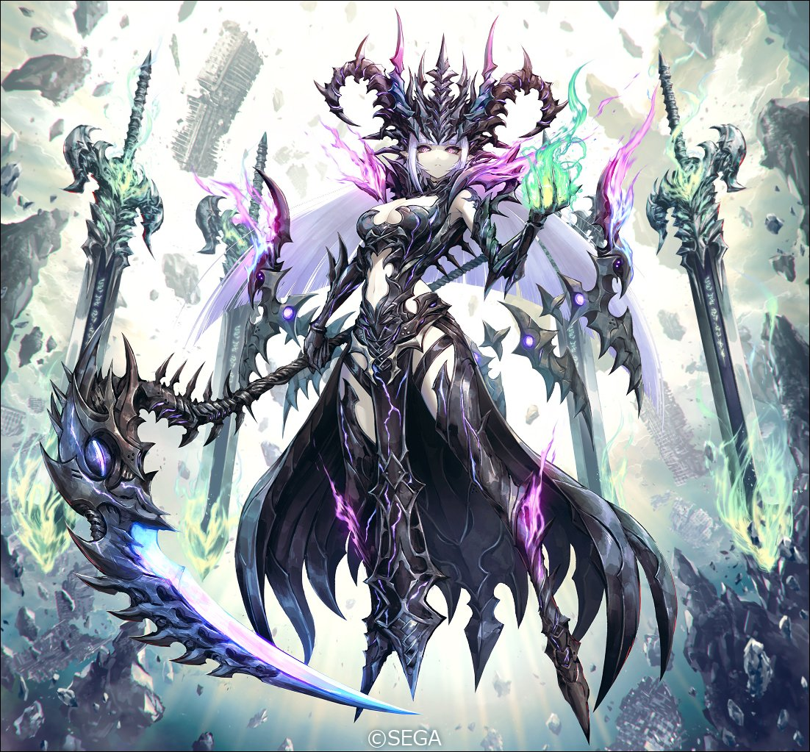

# 瓦尔马西亚的幽灵

| 角色信息   |  |
| ----------- | ----------- |
| 名称    |瓦尔马西亚的幽灵
| 年龄   | UNKNOWN     |
| 职业 |  涅墨西斯程序 |
| 对应曲   | Forsaken Tale|
| 对应版本 | Chunithm Luminous Plus|

## Episode 1 萌生的自我

>尊师啊……我一定会完成您的愿望的。

那大概是三十六万个周期之前的事情。

在这电子的乐园·Metaverse之中，有着两个势力。持续着无限的扩张，致力于维持乐园安定的框架主脑，以及与他们全力敌对的涅墨西斯。随着双方的战斗日渐激烈，甚至让整个电子的乐园陷入了危机之中。

双方从未有过任何的交流，只是以各自的战力向对方发起进攻，就这样你来我往的打着。

在这难分难解的战况之中，迎来了一个转机。

那就是统领着涅墨西斯的其中一名“混沌之器”被重创了。

就在这时，同样身为统领着涅墨西斯的“混沌之器”的其中一人——尼加尔，做出了痛苦的决定。

 

“我等将切断领域之间的联系。”

 

暂时中断进攻框架主脑的计划，将自身支配的领域与Metaverse分离开来。

这一计划，从决策到执行为止，并没有花费太多时间。

望着渐渐远去消失的领域，尼加尔向全体的涅墨西斯说到。

 

“这次会做出如此决定，想必也会有人感到不满吧。如此大败而归，对我等涅墨西斯亦是一种耻辱。但是如果从长远的角度来看，这场败北，肯定有着重要的意义。

 

虽然尼加尔本人比任何一个涅墨西斯还要感到不甘，然而为了大局，还是不得不将这份感情封存起来。

 

“当诸位理解了其中含义的时候，那时就是我等实现夙愿的时候。然后，就该轮到那些框架主脑的蛆虫们，亲身体会自己的渺小和无助了。”

 

尼加尔的话语，让所有的涅墨西斯都沸腾了。

就这样，在这隔绝的世界之中，所有的同胞们都开始了自力更生，实现进化的工作。

而对于那些忠实地执行王的命令的末端涅墨西斯，虽不知道有多少个体能够理解尼加尔的这份意思，至少，“她”做到了。

此时的“她”却仍旧弱小，仍未达到能够认识“自己”这一个体的地步。

 

“恩……师……我的，恩师……”

 

然而，没有这句话的话，那她也不会踏出进化的第一步吧。

“她”为了即将到来的决战不停地成长，进化，最终获得了稳固的自我意识——然后，经历了漫长的周期之后，终于到了那个时刻。

尼加尔带领着涅墨西斯，向着框架主脑开战了。

这场等待了不知道多久的大战。

这场终于可以成功报答恩师的大战，终于要来了。

然而，她的愿望，却再也无法实现了。

当涅墨西斯统治的领域，与框架主脑的领域再度连接的时候，他们设置于领域中的地雷就会引爆，而这些被卷入爆炸之中的部分领域就这样沉入了数据的深处，沉入了未定义的领域空间。

 

而这沉没下去的领域，在坠落期间也渐渐地散落成了碎片，最终只留下了一座都市。

这座都市的名字，叫“瓦尔马西亚”。

这正是“她”曾经所统治的都市。

 

“为何……为何只有我………………！！！”

 

这里并没有她所期望着的战斗。

这里也没有她心心念念的恩师。

面对这残酷的事实，她陷入了深深的绝望。直到完成她的恩师的夙愿为止，这份执念都不会消失。

这执念渐渐地在这数据之海的深处越烧越旺——最终，她成为了亡灵，向着框架主脑发动了攻击。

## Episode 2 只要继续挣扎下去

>框架主脑的小虫子已经被我粉碎了。你们已经没有任何的希望了！

与位于阶层都市·瓦尔马西亚的超深处的亡灵的战斗，以唯一拥有与亡灵能够一战之力的“调谐者”的败北落下了帷幕。

瞥了瞥倒在自己脚下一言不发的二人，亡灵向着自己的下一个目标走去。

那指的，正是刚刚还在这里的两名白发的少女。

 

“你们还觉得能够跟我作对吗？”

 

亡灵捡起了被调谐者斩断的手，缓缓地将其捏碎。那只手冒出了黑烟，然后渐渐化成了黑色的淤泥。

漆黑的淤泥渐渐聚成了形状，变成了涅墨西斯。

 

“把她们找出来。”

“哦，哦哦——！！”

 

宛如野兽般身形的涅墨西斯们，发出了怒吼声，一瞬间便散开了阵型，开始了搜索。

 

“你们没有可以躲藏的地方。别再白费工夫了。”

 

从废弃阶层仰望着上方的都市，亡灵冷冷地笑着。

 

与此同时。

利兹利斯威尔和拉菲因两人，正听从“调谐者”的指示在地下向着通往天花板的巨大排气管道中穿行着。

 

“呐，这空瓶子到底有什么用？”

“嗯，如果跟我推测的那样，一定能发挥作用。”

“一定能什么的……”

“……现在没时间解释这些了。”

 

两人要前往的，是都市上层的控制室。

拉菲因似乎要在那里做什么的样子。

幸运的是，排气管的大小刚好足够两人躲藏身形。

现在还没有追兵的气息。

就算是长期徘徊于废弃阶层的亡灵，也没法找到隐藏身形的两人吧。

 

“等等，先停下。”

 

从通气管的地面上漏出了几道光，警告着二人眼前的路已经不再安全。

仔细一看，管道的各处都已经崩塌。

只要稍有不慎，就会跌落下去，摔个粉身碎骨。

 

“……我们还是小心前进吧。”

“不，我们没时间在这里磨蹭了。好好抓着我哦？”

“咦？”

 

利兹利斯威尔深吸了一口气，不等拉菲因反应过来就将她背了起来。接着，她用着轻快的脚步，三下五除二地跳过一块又一块的平台。

 

“噫！？”

 

拉菲因死死地抱着利兹利斯威尔，生怕一睁眼就会掉下去。

 

“已经到了哦，拉菲因。”

 

睁开双眼，两人就已经到达了对岸。

 

“……至，至少动身前先说一声嘛！”

“哈哈，吓到了吗？”

“闭嘴。”

 

拉菲因就这样被利兹利斯威尔背着，向着管道的出口而去。

## Episode 3 在同一意志之下

>这是选别。这是为了让强者能够统治弱者而必须做的事情。

穿过到处都是孔洞的排气管道，两人终于来到了控制室所在的阶层。

 

“总觉得……这里和外面的感觉大不相同啊。”

“……是这样的。”

 

这个阶层的构造，非要说的话更像是统治机关的本部的样子。然而，这里飘荡着的刺鼻味道又让这里显得与众不同。

看着墙面上黑色的污渍，拉菲因不禁冒起一股厌恶的感觉，皱了皱眉头。

 

“……快，快走吧。感觉呆在这里都要闷死了。”

“啊啊。我也这么想。”

 

穿过天花板布满众多管线的通道，两人打开了深处的大门。刚打开，一股刺鼻的气味就向两人席卷而来。

 

“呜……！”

 

强忍着刺鼻的气味，利兹利斯威尔检查着屋内的情况。

整个房间十分宽广，呈现圆筒形的构造，向着下方的都市延伸而去。

这时，拉菲因才注意到她们现在正在那座初入都市时见到的那座带着几个壶状装置的建筑物之中。

 

“难道说这里是……”

“呐，这股气味的成因，难道是……”

“大概是……到底这里是经历了什么……”

 

仔细一看，从这些开着的门里面似乎能看见什么。不用说进去了，光是站在那里都能感觉到一股不妙的气氛。

 

“总之，还是先——”

“利兹？”

“拉菲因，我就在这里拖住敌人。你快去控制室。”

 

利兹利斯威尔将拉菲因放了下来，拔出了刀。拉菲因虽然什么都没感觉到，但是擅长战斗的利兹利斯威尔确实捕捉到了些只有她才能察觉到的气息。

 

“利兹……”

“而且啊，我也不知道我能‘撑’个多久。拉菲因的话，应该知道我在说什么吧？”

 

不论发生什么都要完成任务。

从她的眼神中能感觉到这股意志。

 

“……嗯。要是死了我可饶不了你。”

“啊啊，约好了。”

 

拉菲因伏下了身子，小步离开了房间。下一秒，一群涅墨西斯就出现在了利兹利斯威尔的面前。

 

“真是的，这也太多了吧！”

“噢噢噢噢噢——”

“吵死了！都给我一起上吧！”

 

右手持刀，左手握鞘，利兹利斯威尔向着涅墨西斯冲了上去。

 

“——最后一个！”

 

随着最后一只涅墨西斯被斩断，利兹利斯威尔也像是到了极限，单膝跪了下来。

深呼吸了几口空气，重整好呼吸之后，她的视线重新回到了装置之中。

刚才因为太过恐怖未能直视其中的模样，现在一看，里面躺着的，都是像是人类的尸骸一样的物体。

仔细一看，那些尸骸上也沾着黑色的污泥一般的东西——

 

“这究竟是什么东西啊……这不就是那些怪物吗？这些东西真的是我们的祖先？”

“——正是。”

“！？”

 

利兹利斯威尔一个小跳向后退去，出现在她面前的，正是“亡灵”。

 

“切……你这‘亡灵’！”

“这里，正是我等的起始之地。”

“哈？‘我等’？你不会是说我和你这种东西吧？”

 

亡灵的眼中映出一股若有所指的感觉，微微地笑着。

“‘即将到来的决战之日’，你还记得这句话吗？”

“什么——”

 

利兹利斯威尔说不出话来。

这是所有居住在瓦尔马西亚的人都谨记于心的话语，为什么这个亡灵会知道？

 

“这正是我的恩师向我传达的想法。我等本就是生于同一意志之下。你们本来就是为了和‘框架主脑’——也就是那个被称作‘调谐者’的人，和她所属的势力战斗，而一直准备至今的。”

 

听着这些话，利兹利斯威尔顿觉天旋地转，拼命摇着头，试图否定这些话。

 

“你以为我让你们活到现在是为了什么？”

“那还用说吗……不就是嘲笑我们这些手无寸铁的人类，享受这种绝望的快感吗！”

“非也。你们是被选中的人。你们是拥有与代理构成体相称的力量的素体。”

“那……难道说是那个吗？袭击村落，制造代理构成体什么的，难道就是筛选的过程吗？”

 

亡灵嗤笑着回答到。

 

“正是。弱者没有任何存在的价值。只有能够撑过筛选的强者，才能为我等所用。”

 

为了即将到来的决战之日。

如果说那些拼命锻炼和为了“决战”做准备的人们，最终却要落得个变成非人的怪物的下场的话，那这也太过讽刺了。

 

“你已经向我展示了你的力量，就让我好好嘉奖你一下吧。你就和你的那个搭档，一同成为我手下的代理构成体吧！”

“哈，这还真是搞笑啊。这事儿可得我说了算！说到底啊，你怎么就知道你赢定了呢？”

 

利兹利斯威尔举刀指向亡灵，大喊着。

 

“我可不会买账的！不管是你，还是你的尊师说的那些狗话！”

“你这下等生物，竟然敢愚弄我的恩师！”

“别那么小肚鸡肠嘛！在你被你口中的下等生物挑衅的时候，你也没什么区别了！”

 

面对怒火中烧的亡灵，利兹利斯威尔毅然决然地冲了上去。

双方力量差距是无比悬殊的。别说几分钟了，自己估计能撑个几十秒都算不错了。

 

“拉菲因，之后就拜托你了——”

 

为朋友着想的话语，就在这刀光交错之间消散——

## Episode 4 点亮希望之火

>为什么要如此乞求着不存在的希望？你们人类现在还能做什么？

与利兹利斯威尔分别，前往控制室的拉菲因，发现了倒在昏暗的通道旁边的都市建筑程序。

虽然大部分的程序都已经受损无法启动，但其中的一部分还是能够通过修复配线重新启动的。

 

“……嗯，这台，还有这台，都能动起来。”

 

轻车熟练地修复好之后，拉菲因向这些程序下达了新的命令。

 

“拜托你们了，在通道里建几面墙壁。”

哔。

 

程序以微小的蜂鸣声回应。

程序发出细小的声音，向着拉菲因所指的方向移动过去，之后就开始了对通道的改造。

如果是现行使用的型号的话，只要一晚就能建立起新的都市。不过就算只是这样小型的型号，也足以在短时间内改变这条通道的构造。

 

“就算是亡灵，也没法那么快就突破几面墙吧。”

 

拉菲因刚才通过的通道，现在正被厚厚的墙壁所阻挡着。不过在见到亡灵的力量之后，这些雕虫小技想必也阻挡不了她的脚步吧。

不过，只要能够拖延时间就足够了。

“调谐者”能否重生，就看她们的努力了。正是为了这个目的，她才选择不和利兹利斯威尔一起战斗，二世谷深来到了这里。

不管要用什么手段，都必须完成这个任务。

在都市建筑程序正训练有素地生成一道道墙壁的时候，拉菲因突然想到了些什么。

 

“……对了，如果这样的话，应该能够成功骗到亡灵吧！”

 

拉菲因向都市建筑程序下达了新的命令。之后，她就打开了控制室的某个终端，将针剂上标着的文字串输入了进去。

接着，终端的程序出现了波形一般的符号，向着某处传送了信号。

 

“……这样，我能做的就全都做了。剩下的，就只剩迎击亡灵而已。”

 

不久，这个时刻很快就到来了。

从入口的方向传来了震耳欲聋的响声，然后向着这里冲了过来——厚重的大门，被利器一刀两断。

从化为碎块的大门处，穿着可怖甲胄的亡灵出现了。

 

“亡灵……！”

 

拉菲因拿起了长枪，挡在了终端面前。

 

“……利兹呢！？你把利兹怎么了！？”

“少废话。”

 

亡灵并没有上拉菲因的当，直接扑了上去，将终端打了个粉碎。

拉菲因虽然在千钧一发之际躲开了攻击，但是也被旁边飞散开来的碎片击中，倒在了地上。

 

“呜……”

 

不知是否是头部被碎片砸到了呢，拉菲因倒在那里无法动弹。然而，很快就意识到了拉菲因手中握着的针剂的亡灵，攥着拉菲因的手，把她整个人提了起来。

 

“啊……！”

“明明那个人类拼了命地给你拖延了时间，你还真是不堪一击啊。”

“！？”

 

被抓在半空中的拉菲因仍然拼命地挣扎着，然而这不过是无谓的抵抗。亡灵将针剂连同她握着的那只手一起捏了个粉碎。

 

“啊啊啊啊啊啊啊啊啊啊啊啊！！”

 

似乎是对失心疯一般发动攻击的拉菲因感到了疲倦，亡灵随手一甩，直接将她砸到了墙上。

拉菲因已经没有动弹的力气了。

只能像坏掉的玩具那般干笑着。

 

“呵呵呵……啊哈哈哈……”

“本想把你变成代理构成体的，果然还是不够格。你就作为我的容器，被我吸收吧。”

 

就在亡灵向拉菲因伸出手的时候。

拉菲因的笑声发生了变化。

 

“有什么好笑的？”

 

掉在一旁的腿部被大镰划过。

利刃狠狠地刺入身体，让拉菲因发出了痛苦的声音，但很快她又笑了起来。

 

“……哈……啊哈哈……”

 

拉菲因并不是因为崩溃而笑出来的。

从她的眼中，看不出一点点的绝望。

那缓缓眯着的眼睛中透露出来的，是对亡灵的讥笑。

 

“你们的希望都已经被我一一断绝。事到如今，还觉得自己能做些什么吗？”

“……做得了啊。因为，这里是——”

 

昏暗的房间，突然照进了一束光。

明亮的白光，照亮了室内的每个角落。

被白光照亮的这间“控制室”，四周的样子显得无比粗糙，简直就像是四处随意拼凑起来的布景一般。

 

“——这里是我做的假房间啊！”

“你说什么？”

 

亡灵猛然回过头去。

然后，淡淡的光芒从被破坏的终端的裂痕之中冒了出来——

 

“难道说！？”

“……已经太迟了。”

 

拉菲因向都市建造程序下达了某个命令——那就是在这间控制室内再制造一间假的控制室。

外加上把这里弄得昏天黑地让人无法辨别周围的细节，这个以自己作为诱饵的陷阱就这么完成了。

亡灵成功了中了她们的计谋。

而在这道光的另一处——接收到了从控制室发出去的通讯码的基干系统，将某样东西送到了这里。

## Episode 5 皮埃尔·巴比斯特

>我能做到什么，不能做到什么……这些我都已经心里有数！所以，我要靠这双手，争取到想要的东西！

稍微把时间回溯一下。

被遗留在废弃阶层的地下都市的“调谐者”，正看着刚刚保护了自己，向亡灵发起了反击，却被残忍杀死的少女——皮埃尔的尸首。

 

“……”

 

她的眼睛只是大睁着一动不动。

但是仔细一看的话，还是能从身上感觉到有着些微的生命迹象。

虽然伤势严重，但是她的身体的绝大部分都已经被亡灵转化为了异形的代理构成体。

代理构成体拥有凌驾于人类之上的身体机能。

正是代理构成体的技术才让她仍留有最后的一丝生机。

看到如此现状的“调谐者”，决定将她仅剩的所有能量都传到皮埃尔的身上。

 

（皮埃尔……）

 

调谐者稍微动了动眼球，前方空无一物的空间之中就出现了几层重叠的几何学图案，这些东西向着皮埃尔的眼球之中钻了进去。

 

（我能做的，就到这里了）

 

在结束传送工作之后，“调谐者”失去了最后一丝力气，再也动不了了。

在她的嘴角处，还留着一抹笑容。

* * *

在宛如摇篮一般飘荡着的空间之中，皮埃尔苏醒了。

皮埃尔环顾四周，却什么都看不到。在她眼中的，只有一望无际的天蓝色。

 

“我到底是怎么了呢……”

“皮埃尔。”

“咦，‘调谐者’小姐！？”

 

回过神来，调谐者正站在自己的眼前。

不知为何，她的身体恢复了原样，而自己也变回了人类的样子。

 

“这里是你的深层领域。为了不让你的意识完全消失，彻底迎来死亡，我才会在这里。”

“那个……也就是说，我现在是多亏了调谐者小姐的力量才活着吗？”

“准确来说，只是创造了一段可以稍微延缓死亡到来的世家而已。只要我的能量耗尽，那么‘皮埃尔·巴比斯特’这个人类，将会彻底消失。”

 

明白眼前的这片领域无法支撑多久的皮埃尔，焦急地向调谐者问到。

 

“那我有什么能做的事情吗？”

“没有。”

“咦咦！？那为什么要……”

“准确来说，其实是还做不了什么才对。”

 

为了打破目前的现状，利兹利斯威尔和拉菲因需要逃过亡灵的追寻，向基干系统传送调谐者的通讯码。——调谐者如此说到。

 

“当终端与系统取得联系之后，我就会从系统那里获得能量的供给。这样的话，你也可以免于消失的命运。”

“调谐者小姐会怎样！？”

“我会留在你的深层领域。或者，直接消失掉吧。”

“怎么会！？”

“不过，也有一种可能，名为你的这个人将不复存在。”

“也就是说我也会消失吗？”

“你的崭新的身体，有可能会是并非我，也并非你的崭新个体。现在只能这么做了。”

“那么，非常感谢您的帮助！”

 

皮埃尔连想都不用想地接受了这个事实，牵起了调谐者的手。

调谐者第一次露出了困惑的表情。

 

“……你不害怕吗？”

“我会变得不再是我什么的，虽然我会害怕，但我不会后悔。因为重获新生的我，现在就比任何人都需要去拯救大家啊！”

 

如此直爽地答应了这一请求的她，露出了充满希望的笑容。

从这话语，从这意志中。

跟之前软弱的样子简直判若两人。

 

“这就是……人类的强大之处吗。”

 

如果是一如既往的她的话，肯定不会轻易接受这样的请求吧。

但是，她已经做出了改变。

现在站在调谐者眼前的，已经不再是那名一事无成的少女了。

站在她面前的，是足以让曾经的自己无比骄傲的，拥有无比勇气的，名为皮埃尔·巴比斯特的人类。

 

“咦？可是调谐者小姐也是人类啊？”

“是呢……你说的没错。”

 

调谐者握住了皮埃尔的手。

 

“她们，成功了。”

 

调谐者向上望去，那里充满了光芒。

光芒包围了二人。

然后——两人的身影渐渐合为一体。

## Episode 6 我们的世界

>既是**我**，又不是“我”的“我们”——就由**我们**来保护我们的未来！

瓦尔马西亚与基干系统取得了联系，从系统传来的庞大能量，向着一个方位倾注而去。

在控制室望着这番光景的亡灵，露出了困惑的表情。

 

“不可能……”

 

光芒收束，出现在亡灵面前的，是手握苍剑的一名人类。

以为是调谐者再度登场的亡灵摆出了架势，然而出现在那里的，却是出乎意料的人——正是那名人类的少女，皮埃尔。 

然而，皮埃尔的身上却有着很大的不同。

在她的背上，长出了钢铁铸成的翅膀。

那副设计的样子，跟框架主脑的的程序拥有着极为接近的形态——

 

“难道说，她们竟然合为一体了——”

 

就在这时，亡灵和露出自信笑容的皮埃尔对上了眼。

那么远的距离，人类的肉眼本来应该是无法分辨的才对。然而，亡灵却感觉到了她确实察觉到了这里。

不知不觉，亡灵竟向后退了一步。

 

“我竟然，在恐惧着那东西吗……！？”

 

为了抵抗从内心深处涌出的恐惧，亡灵向着皮埃尔全速飞去。

 

“就是变了个样，你又能做什么！”

（皮埃尔，做得到吧？）

“是的！调谐者小姐！”

 

面对方寸大乱的亡灵，皮埃尔听着内心深处调谐者的声音，展开了背后的钢铁翅膀。

随着皮埃尔心中默念着飞上天空的话语，翅膀也应声而动。

 

“区区框架主脑的……飞虫啊啊啊啊啊！！”

“哇啊！？”

 

飞上天空的她逼近了亡灵。

用<ruby>天统苍噬剑<rp>（</rp><rt>グランタクト</rt><rp>）</rp></ruby>架开亡灵挥舞出的巨镰之后，亡灵立马折返回来，杀了个回马枪。

如此高速的回击，仅凭人类的反应是难以招架的。 

但是已经和调谐者合为一体的她，可决不能小觑。

 

“没关系……因为我们可不是孤身一人！”

 

随着两人在空中激战，蓝色和紫色的光芒互相碰撞，发出点点火花。

最初还是不相上下的战况，也渐渐随着皮埃尔适应自己的身体，变得愈发有利。

 

“我，我竟然会……！”

 

面对一分一秒都在变化行动的皮埃尔，亡灵难掩困惑之色。

 

“我竟会输给区区一个人类！！”

“……！！”

 

皮埃尔正面挡下了亡灵的突击。在火花飞溅的瞬间，皮埃尔望见了那双充满憎恨的眼睛。

 

“瓦尔马西亚是我的东西！绝对不会交给任何人！”

“不管是这个世界也好，还是我们也好，都不会让你肆意妄为的！”

 

皮埃尔倾注全力，肆意一挥，将亡灵的手臂斩断。

 

“咕啊……！？”

 

手臂向着下方垂直落去，再也没有任何防御手段的亡灵，只能呆呆地望着皮埃尔高举着的<ruby>天统苍噬剑<rp>（</rp><rt>グランタクト</rt><rp>）</rp></ruby>。

不知是否是解开了什么的封印，苍剑爆发出了耀眼夺目的青白色光芒。

这场战斗的结果，早在未能阻止“调谐者”的复活的时候，就已经决定了。

 

“我等的……乐园——”

“<ruby>光辉·脉冲<rp>（</rp><rt>レディアントヴァーテックスッ</rt><rp>）</rp></ruby>！！”