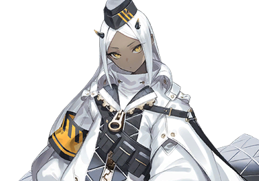
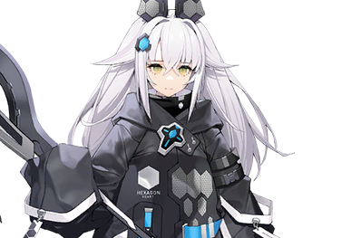

# 利兹利斯威尔

| 角色信息   |  |
| ----------- | ----------- |
| 名称    | 利兹利斯威尔|
| 年龄   | 19岁      |
| 职业 |  调停官|
身份|管理者（权限等级3）
| 对应曲   | Fire Engine 73
| 对应版本 | Chunithm Luminous Plus|

## Episode 1 为了即将到来的那一天

>遵守“规则”而活，就是生于瓦尔马西亚的人们的义务。

阶层都市·瓦尔马西亚。

这里到底是从何时开始出现的，以及为什么会变成现在的这副模样呢，住在这里的人们，对此一无所知。

在无比庞大的时间长河之中，住在这里的人们只将那些与自己的生存相关的东西保留下来，其他的东西则无情舍弃，就这样一代一代地继承下来。

而他们所需要的，只有寥寥几样。

其一，是由自动化生产线所供给的物资。

其二，是严格遵守的“规则”。

而负责执行这一切的，则是位于矗立于瓦尔马西亚中心处的构造物之中的“统治机关”。

说是机关，实际上这个组织就是实质上执行行政功能的组织。从属于那里的人们，也不过是忠实地跟随着机关设立当初的戒律，日复一日地忠实执行着自己职责的存在。

换句话说，统治着瓦尔马西亚这个小小箱庭的东西，就是这名为“规则”的系统。

 

那么，令瓦尔马西亚人们从头到脚都要忠实执行的“规则”，究竟是什么呢？

——那就是，为了“**终将到来的决战之日**”而做准备。

 

利兹利斯维尔，也是为了那一天做准备，被赋予了维持系统持续的职责的，调停官的其中一人。

## Episode 2 与未知物体的接触

>“敌人”什么的，除了训练以外，我还是第一次听到呢。而且还说是什么怪物来着？不错，让我玩玩看！

利兹利斯威尔的日常，总是以战斗训练为开始，也以战斗训练结束一天的工作。

不管是今天还是明天，抑或是之后的日子，估计直到生命结束的那天，她都会一如既往的持续下去的吧。

这对她来说既是她的人生全部，也是必须要赌上一切都得完成的使命。

然而，即便是成天训练的她，今天也碰见了让她不得不放下手中工作的事态。

 

正在统治机关的某个角落的训练室中冥想的利兹利斯威尔，被响彻整个房间的警报声惊醒。

 

“——利兹，请立刻前往作战室。”

“知道了。我已经在路上了。”

 

挂掉来自搭档拉菲因的通信，利兹利斯威尔拿起架在墙角的刀鞘，前往了作战室。

来到作战室，那里已经聚集了许多调停官。

 

“哦，大家都来了啊。”

 

利兹利斯威尔走向房间中央，向着站在装置面前的白发少女问到。

 

“发生什么事了？”

“……来得还真快啊，利兹。”

“那当然啊。这个警报会响，也就意味着距离‘决战之日’很近了吧？”

“嗯，是这样呢。”

 

说完，拉菲因指向了大概半人高的立体影像。上面正显示着瓦尔马西亚的模样。

拉菲因指向了影像上方的某个点，那里正是距离瓦尔马西亚的“尽头”最近的一座村落。

 

“第四，第八，第十三，第十七这四座村落刚刚都传来了紧急报告。虽然现场情况较为混乱，还需要些时间才能够获得准确的信息，不过至少有一件事情可以确认——那就是在那里出现了来历不明的怪物。”

“怪物？长什么样的？”

“……看看这个。”

 

拉菲恩拿出了照片。然而由于画质太差，能认出来的只有一团黑漆漆的东西，还有四颗灯光一样的眼睛。

 

“这根本看不出来是什么啊……”

 

利兹利斯威尔叹了口气，向终端伸出了自己的手。

 

“执行管理者权限。解除所有调停官的武装限制。”

“已检测到等级3的权限——已承认。”

 

从终端中传来了机械的声音，接着，调停官们身上的武器跟着发出了“哔”的电子声。

 

“移动用的轨道车随你们使用。赶紧前往你们负责的区域吧。敌人可是未知的生命体，可不能大意哦？”

 

调停官们向利兹利斯威尔敬了一礼，然后离开了房间。

 

“那么，我们也出发吧。”

“……嗯。”

“怪物吗……嘿嘿，看来会很刺激了啊。”

 

用肩膀扛着刀鞘，利兹利斯威尔露出了自信的笑容。

一直只在文字中听说的“终将会到来的决战之日”。

没想到的是，竟然这么快就要到来了。光是这点，就足以让利兹利斯威尔心花怒放。

## Episode 3 机械女

>那个孤身一人将怪物全部打倒的女人，简直生硬的跟个机器人一样，至少也该笑一个吧？

乘坐着轨道车，利兹利斯威尔来到了村子里。然而她还没到村子就发现了异样。

阵阵黑烟在夕阳的照射下格外显眼。

然而村里却并不像是在交战的状态。

 

“这是怎么回事？”

“……村民们似乎已经全灭，怪物已经离开这里了，另外——”

“算了，在这里思考也没用。我们走。”

“……嗯。”

 

扫开挡路的障碍，两人径直向着中央的高塔前进。随着他们距离高塔越来越近，战斗的痕迹就越来越明显。村民的尸体和怪物的残骸也越来越多。

“……看起来他们都努力战斗过了啊。”

“要是还有人活着就好了。”

 

拉着正分析着怪物残骸的拉菲茵的手，利兹利斯威尔两人沿着周围的地势缓缓攀登，终于来到了能够将整座塔尽收眼底的广场上。

广场上到处都是怪物的尸体，旁边站着的还有观测士皮埃尔，以及一名手握着苍蓝之剑的女性。

下一秒，刚才还拿在手中的剑，突然消失了踪影。

 

“我是‘调谐者’。守护着六千世界的守护者。”

“六千……哈！？”

 

那名叫“调谐者”的女性并未理会，只是望向了利兹利斯威尔头上的角状设备。

 

“你是，人类吗？”

“哈？这种事情还用问吗！这家伙到底怎么回事！”

“‘调谐者’小姐从刚才开始就是这样子……不过，要不是她的话，我现在说不定早就成为怪物的食物了。她不是坏人！”

“这种东西你怎么就能知道啊？”

“可是……”

“话又说回来啊，是不是难道不是该由我说了算吗？所以，这么多怪物，都是她一个人打倒的吗？”

“是的！她真的很厉害！”

 

皮埃尔几乎是手舞足蹈地解释着“调谐者”是如何神勇地打倒这些怪物。似乎因为刚才才战斗过的影响，现在的皮埃尔仍旧是亢奋状态，话语里满是各类拟音词，实在琢磨不透究竟是怎样的内容。

但是，在统治机关来到这里掌握情况之前的短暂时间内就将这些怪物一并消灭也是事实。

说不定眼前的这个人确实有着足够的实力。

光是想着眼前这个人深不可测的实力，利兹里斯维尔就感到如鲠在喉。

 

“……皮埃尔说的应该是真的。从那些怪物身上都能探测到一种未知的粒子。”

“哈，那还真是厉害啊。”

 

利兹里斯维尔干笑着，然而内心深处却不由得对眼前的这名女性警戒起来。

 

“竟然不辞辛劳地来到这瓦尔马西亚这个小小世界，有何贵干？根据你的回答，我们可能会限制你的行动哦。”

 

利兹里斯维尔用刀鞘叩了叩地面。然而，即便面对如此明确的挑衅行为，“调谐者”只是用着不温不火的声音回答到。

 

“我是来寻找连接终端的。”

“连接终端？”

 

“你知道吗？”——利兹利斯威尔看向了拉菲因。然而她摇了摇头，表示自己并不知道这样的事情。当然，皮埃尔也并不清楚这些。

“要连接到核心系统，接入终端是必不可少的。”

 

根据她们的反应，判断这里的人们并不知道终端的事情的“调谐者”，头也不回地离开了这里，就像是暗示着已经与她们没有任何交集一样。

 

“啊！我的话还没说完啊！”

 

“调谐者”并未回应。

看她的模样，就算是踏破铁鞋，掘地三尺，她也会在这座阶层都市执着地寻找那个终端的吧。然而对她来说，这似乎不是什么难事的样子。

 

“啊——等等我啊！‘调谐者’小姐！”

 

要是在这里放走她的话，估计就再也见不到了吧。皮埃尔这么想着，不禁大喊着，然后无意中说出了足以让她驻足的话语。

 

“那个！我其实，找到了能够当作线索的东西！”

“……”

 

听到皮埃尔这番话，“调谐者”回过了头。

回过头的“调谐者”脸上挂着的，仍旧是那副捉摸不透的表情。

 

“带路吧，皮埃尔。”

“我，我知道了！请等我一下！”

 

皮埃尔奔向了高塔，向着塔中避难的村长说明了事情的原委，接着就打点了下，回到了广场。

 

“好了，我们走吧！”

 

就在这时，利兹利斯威尔从背后悄悄地跟了上来，狠狠地捏了一把皮埃尔的侧腹部。

 

“呀……啊啊啊啊！？”

“你这呆子。怎么就这么不由分说地把话说下去了啊！你忘了吗？在这地盘，做主的可是我啊！”

“非、非常抱歉……”

“人类，你也要来吗？”

“别叫我‘人类’了。我也是有名字的。叫我利兹利斯威尔。”

“我知道了。”

 

“调谐者”点了点头，将视线转向了拉菲因。明显比“调谐者”矮了两个头的拉菲因发出了怯懦的声音。

 

“……怎、怎么了？”

“你也是，人类吗？”

“你要对所有人都这么问一句吗！”

 

就这样，在利兹利斯威尔的带领下，一行人为了寻找皮埃尔所说的线索，踏上了旅途。

## Episode 4 开始交汇的脉络

>如果那东西想要冲出去的理由跟我预想的一样的话……不，怎么可能。

“——说不定，只要前去‘尽头’那里的话，就能发现什么线索吧。”

 

在前往“尽头”的路上，皮埃尔说起了她遭遇怪物群的时候，见到的那把黑色的剑的事情。

 

“那个时候，从那把黑剑的剑刃上冒出了黑泥一样的东西。也许就是那些东西变成了怪物，袭击了我们的村庄。”

“你有亲眼目睹黑泥变成怪物的瞬间吗？”

“没有，但就在黑泥沉入地面的瞬间，怪物就从桥面上出现了。”

“你第一次看到怪物是在哪里？”
　
“估计很快就要到了，那个……”

“搞什么啊？怎么突然停下来了？”

“不，没什么。”

 

就像是想要逃离利兹利斯维尔一般，皮埃尔小步跑向了断裂的桥梁，向着对面指到。

“就、就是那里！”

“嗯……距离也太远了，什么都看不到呢。”

“是呢。”

 

这么说着的皮埃尔，正环顾着四周，似乎鬼鬼祟祟地在找什么东西的样子。

注意到皮埃尔异样的拉菲因本打算直接上前询问，然而，利兹利斯威尔打断了她。

 

“皮埃尔，你是不是瞒着我们什么了？”

“……！”

“哈，我就说嘛。”

 

皮埃尔承认了利兹利斯威尔的质问，深深地低下了头。然后，她向众人一五一十地讲述了桥梁断裂当时发生的事情。

 

“难怪没见到萨那卡的身影啊……原来，她已经死了吗……”

 

这么说着的利兹利斯威尔的语气中，带着一分和平时跟她们嬉闹时完全不同的感觉，带着一丝寂寥和忧伤。

 

“那个，你有看到她死在哪里吗？”

“不……我只是目睹了她跟着那把剑一起掉了下去，并没有看到她摔死的样子……所以，说不定她还活着呢？”

“是吗。毕竟她也是你童年时的玩伴啊，会这么想也不奇怪。”

“很抱歉瞒着大家，带着大家来到这里。但是，我并不是为了挽留各位才撒谎的。这里确实有着跟终端相关的线索。只有这点还请大家相信我。”

“……有什么根据吗？”

“是的。当时，我们目睹了那把剑无数次尝试突破‘波动’的现象。”

 

皮埃尔闭上了眼睛，仔细回想着当时的情况。

 

“虽然当时我并不明白为什么要这么做，但听了‘调谐者’小姐的话，我想我明白了。我想那把剑和那只怪物，只是想离开这里，前往外面的世界而已。”

“这种事情怎么可能看得出来啊？”

“……不一定。那把黑剑可能真的是通往连接终端的线索。”

 

拉菲因突然灵光一闪，想到了一个假说。

 

“‘调谐者’来到这里是为了让世界之间连接起来，而那把黑剑是为了前往世界外侧，既然如此的话，那么双方的目的应该就是一致的吧？”

“既然如此，如果我们找到那把剑的话……”

“嗯，运气好的话，说不定也能找到终端。”

“确实，这个注意不错。‘调谐者’，你怎么看？”

“我支持拉菲恩的主意。”

 

看着“调谐者”点着头，直到刚才情绪还十分低落的皮埃尔，又重新提起了精神。喜形于色的她，自告奋勇地提出了前往“尽头”的迂回路线。

望着走在前面的皮埃尔和“调谐者”，利兹利斯威尔小声嘀咕着。

 

“外面的世界……决战之日……不，这也太荒唐了。”

“……怎么了，利兹？”

“没什么。”

 

利兹利斯威尔拼命地摇了摇头，甩掉脑中那突然浮现的，绝无可能的想法。跟着拉非恩的脚步离开了这里。

## Episode 5 心意已决

>我的直觉告诉我，皮埃尔肯定不会就这么崩溃的。所以，如果是她的话，肯定能够度过这个难关。

绕道而行的众人，终于来到了断桥的另一端。然而，在这第一次遭遇怪物的地方，尽管他们试图搜索，但除了一些战斗留下的伤疤和怪物的残骸以外，什么也没有。

就连那些为了保护皮埃尔和萨纳卡而与怪物搏斗的观测士们，也只留下了血迹和电磁手枪，尸首则不知所踪。
　

检查着枪内剩余的能量。拉非恩摇了摇头。

 

“……看来没有其他线索了。”

“是呢。这样看来，就算来到‘尽头’，似乎也没什么可找的了。走吧，皮埃尔。”

“嗯……”

 

由于自己的伙伴仍旧生死不明，沮丧的皮埃尔只能低着头跟着利兹利斯威尔等人继续前进。看着他们的样子，“调谐者”只是一语不发，静静地观察着她们。

随后，一行人来到了“尽头”。不出所料，在那里也找不到任何重要线索。

 

“嘛，这也在意料之中。”

莉兹利斯维尔带着“调谐者”开始搜索周围的环境。

只剩皮埃尔留在那里，为自己的无力感到痛苦。

 

“皮埃尔，能帮帮我吗？”

 

从背后传来了拉非恩的声音。

当她转过身，一架观察机映入了她的眼帘。

 

“咦？”

“……就当作散散心吧。”

“啊……非常感谢。”

 

按照拉非恩的吩咐，皮埃尔开始观察起 “尽头”的波动。波动只是平静地摇晃着，延伸到永无止境的尽头。

 

利用拉菲恩提供的，用于对波动进行详细检查的特殊终端，也就只是证明了皮埃尔所说的都是事实而已。除此之外，并无其他收获。

 

“结果，我们只能曲寻找黑剑的所在吗。”

“那把剑到底去哪儿了呢？”

“谁知道呢。总之，已经没必要留在这里了。拉菲恩，我们回总部吧。”

“……嗯，明白。”

 

拉菲恩把手放在头上的通讯终端上，试图与总部取得联系。

 

“……咦？”

“怎么了？”

“刚才还能接通的……我们与总部联系不上了。”

 

利兹利斯威尔利用更高的权限启用了一条紧急线路试图取得联系，然而无论怎么尝试，都没有回应。

 

“这可不妙啊。”

 

这种情况,只有一种可能。

 

“回总部吧。”

“嗯。”

“‘调谐者’，你也跟着来一趟吧。如果我的预想是对的话，说不定还需要你的力量。”

“我知道了。”

“莉，莉兹……我也能来吗？”

“难道你的一举一动都要征得我同意才行吗？”

“啊呜……对不起……”

“你早就是我们的同伴了啊。”

“咦？你刚刚说什么——”

 

“哈呀！”

“别老这么愁眉苦脸的。一起走吧，皮埃尔·巴比斯特！”

“——！是！”

 

下一个目的地，是统治机关的总部。

 

　
重新振作起来的皮埃尔，和众人一同踏上了前往统治机关的旅途。

## Episode 6 崩坏的秩序

>要是中央被完全毁灭的话，那这一切就会在我们这一代结束了。怎么能让这种事情发生呢！

能够直通瓦尔马西亚中心部的轨道车，是沿着无尽延伸的外墙建设起来的。

由于建造当初出于保全和增建的需求，所以轨道建在城市上空。轨道车驶过已经变成错综复杂的大迷宫的地上都市，很快就到达了总部。

很快，她们就看到了统治机关的本部的轮廓。放眼望去，到处都是战斗过的痕迹。

 

“该死，来晚了吗！”

“这里就是统治机关吗……太惨了……”

 

从车辆格纳库往下望去，整个统治机关已经被怪物侵入，到处都是一片惨状。

人和怪物的尸体散落于各处，一尘不染的白色墙上早已沾满红黑色的污渍。

 

“你们几个，可不要离我太远了啊！”

 

利兹利斯威尔沿着格纳库，奔向了通往内部的通道，三人紧随其后。

幸运的是这条通道还没有怪物发现，她们成功地在被怪物发现之前冲进了通道。

 

“当务之急是先恢复通信终端的运作。”

 

小心翼翼地打开走廊与总部之间的分隔门，确认内部的安全之后，利兹利斯威尔就像是泥鳅一样神不知鬼不觉地溜了进去。

向后面等待的其他人发出手势示意之后，拉菲因，“调谐者”还有皮埃尔三人跟着走了进来。

面对着这意料之外的造访，皮埃尔对眼前的光景发出了感叹。

 

“这里……就是中央吗……”

 

在这荒凉而苍白的建筑物内部，到处都是大大小小的金属雕塑。它们的形状与人类相似，但头部和手臂却截然不同。

皮埃尔为了避免被怪物发现，底下了头，小心地走着。就在她小心前进的时候，她对雕塑产生了好奇，不禁开始数起数来。

“1……2……3”

 

小心地注意着不要被脚下的尸体绊到，缓慢地行走着。

 

“4……5……6——”

“——埃尔——”

 

就在这时，当皮埃尔走到分叉路口的地方时，她似乎听到了有人正呼唤着她的名字。于是她停了下来，四处环顾着周围的情况。

 

“——埃尔”

 

果然没错。

有人正呼唤着自己。

 

“难道说是……”

 

跟随着自己的感觉，皮埃尔拐进了通道旁边的一条小路，来到了一扇半开的门前。

 

“——埃尔——”

“萨，萨那卡……？”

 

皮埃尔努力维持着身体平衡，推开了门。

昏暗的小房间里站着一个人。

这个人正背对着皮埃尔小声嘀咕着什么。

 

“哎呜——哎呜——”

“萨那卡！？”

 

就在皮埃尔迈出脚步想要触摸她的肩膀时，她感觉到了一阵异样，于是停了下来。从不断闪烁的灯光中看见的身体，确实很古怪。

 

“总觉得……脖子好像伸长了……”

 

不，不止如此。

眼前的人影的四肢变得又细又长，甚至整个身形还在颤抖着，形变着。

每当身形发生变化，身体里就会溢出红黑色的液体，如此恐怖的景象让皮埃尔不由自主地后退，身体猛地撞在了门上。

 

眼前的人影缓缓地回过头来，望着皮埃尔。

 

“噫……！？”

那是一个“反着”贴着脸庞的“东西”。

令皮埃尔误以为是萨那卡的那“东西”，发出了刺耳的尖啸声。

那“东西”怪叫着，向着皮埃尔逼近。

皮埃尔虽然迅速掏出了大盾挡住了攻击，但在眼前这个“东西”的强大力量下，她被连人带着整扇门推了出去，摔到了通道上。

## Episode 7 死亡境界线

>可恶，那家伙究竟在干什么啊！要是因为这种无聊的小事就死掉的话，我可饶不了她啊！

被怪物撞飞的皮埃尔狠狠地撞到了墙壁上。

 

“……唔哈……”

 

那个“东西”并未给皮埃尔多少喘息的时间，继续向皮埃尔发起了进攻。幸好皮埃尔从视野的角落看到了那“东西”的动作，才勉强转过身子，躲过了攻击。

虽然那个“东西”的脸跟着那长长的脖子一起陷进了墙壁里，但是即便如此那个东西的动作也没有停下来。

那个“东西”不停地蠕动着，就好像它本身就是一个完全不同的生物体一样。

从这个“东西”的脖子处望去，只见它的脖子前后都长着尖锐的刺状突起，就像是裸露的骨头一样。

如果被这东西卷住的话，肯定会在顷刻间将皮埃尔柔嫩的皮肤撕成碎片的吧。

这样的话，一切就结束了。

 

“咿呀啊啊啊啊啊啊啊！！”

 

就像是要将传遍全身的恐怖驱逐出去一般，皮埃尔举起大盾，向着那个“东西”的脖颈砸了过去——然而由于用力过猛，大盾撞到了天花板，强烈的冲击沿着把手传了过来。

 

“啊！？”

 

在迄今为止的训练中，从来都没有在狭窄的通道中进行战斗的情况，但现在却成为了现实。

那个“东西”把头从墙体里拔了出来，瞄准了皮埃尔。

更糟糕的是，面前的敌人就像是野兽一样，弯下了腰。

那个“东西”就像是四足步行的野兽一样，缓缓地逼近皮埃尔。那长长的前臂，反过来挡住了倒过来的头部。

 

“哈……哈……”

 

看不到对手的行动会格外刺激人的神经，使得他必须尽可能的猜测所有可能或不可能发生的事情，从而让反应变得迟钝。这在分秒必争的战斗中是十分致命的。

 

（我要集中精神才行！）

 

皮埃尔向前方举起了大盾，然后慢慢的向后退，将注意力集中在了怪物的前臂。

 

因此，直到她手中的大盾被从侧边来的攻击抓住为止，她都未曾注意到。

从那“东西”的腰部伸出的，宛如手臂一般的尾巴。

 

“咦……？！”

 

由于紧盯着前方，皮埃尔的注意力被分散，导致慢了一拍。回过神来，她发现自己已经被恋人带着盾牌砸到了墙上。突如其来的攻击让皮埃尔意识模糊。当她倒在地上时，已经连一根手指都无法动弹了。

 

(快动啊……我的身体……快动啊……)

像是金属的摩擦声般的脚步声，正在缓缓逼近。

随着脚步声越来越近，死亡的轮廓也越来越清晰，也越来越真实。

在意识远去的前一刻，皮埃尔看到的，是那个“东西”高高举起的手臂，还有贯穿那个“东西”身体的一道蓝光。

## Episode 8 浮出水面的事实

>我们，究竟是在跟什么东西战斗啊……？

 

“——不是说了叫你跟着的吗！？”

 

一醒来，映入皮埃尔眼帘的，就是利兹利斯威尔的拳头，以及耳边传来的怒吼。

 

“真的很抱歉……”

 

不知是不是头痛仍未消退呢，皮埃尔并未站起来，仍是坐在地上用手扶着头忍耐着疼痛。

 

“要不是‘调谐者’眼疾手快将怪物干掉，现在的你早就该变成一堆碎肉了。听好了，这里已经不是我们的地盘了，是战场！在战场上，人都是从那些弱者开始先死的。你只不过是运气爆棚幸运躲过了两次劫数，不要太自以为是了！再这样下去的话，下次可就没人能救你了！”

“是，是呢……因为……呜呜……我很弱，是吧……”

 

在火冒三丈的利兹利斯威尔面前，皮埃尔的声音就像是风中残烛一般，仿佛随时都会消失一样。

 

“可是，我也……已经努力过了啊……”

 

皮埃尔不知何时已经哭了出来。

明明现在已经是十万火急的情况，必须尽早修复终端和其他的调停官取得联系才是。

然而，利兹利斯威尔却并未催促过她，只是静静地听着皮埃尔将自己心中所想的东西倾诉出来。

 

“‘调谐者’小姐能那样一击就将怪物打倒，利兹小姐和拉菲因小姐也是，拥有我所没有的力量……果然，我只会给大家拖后腿吧……因为我很弱……对吧……”

“是啊，你很弱。”

 

利兹利斯威尔不由分说地说了回去。

 

“因为自己的弱小而受苦，却只愿意自怨自艾的家伙，那他终其一生就是这么弱了。这种家伙，不论他走到哪里，他都会成为他人的累赘，最终在战场上自生自灭。”

“等等，利兹……”

 

利兹利斯威尔打断了拉菲因的话，继续说到。

 

“不过啊，你却搞错了一件重要的事情。”

“……”

 

然后，利兹利斯维尔抓住皮埃尔的胸口，强行把她拉了起来。

明明利兹利斯维尔的体型比皮埃尔要矮小。

但对现在的皮埃尔来说，眼前的利兹利斯威尔却感觉要高大了几倍。

利兹利斯威尔那锐利的目光直视着皮埃尔。

 

“你要比的不是别人，而是自己！看看现在的自己能不能战胜过去的自己！”

“——！”
　
“没有人是一开始就很强大的。你必须一遍又一遍地与自己抗争，不断战胜自己，才能成为现在的自己！”

皮埃尔的眼中闪过了一道光。

这仍然只是一束微弱的光芒，但它所蕴含的意志却比以往任何时候都要强大。

 

“听好了，我就问你一次。你想要**做什么**？”

“……我想要……至少跟那些怪物一样的……强……”

“声音太小了！”

“我想要！变得更强！”

“那么，你想要做什么！”

“利兹小姐！请让我变得更强吧！”

 

就算再怎么羞耻也好，想说的东西再怎么陈腔滥调也罢。

那个潜伏在普埃尔内心深处的 “怪物”，那个一直潜伏在普埃尔内心深处的软弱的自己，不知何时已经消失的无影无踪了。

要做的事情从一开始就已经决定好了。

“行啊。”

 

利兹利斯威尔简单的一句允诺，还有脸上的微笑，就比任何鼓励都更有力量。

 

“嘛，至少也得先把这坨烂摊子收拾干净才能开始特训啊。”

情况只会越来越糟。

必须谨慎行事。

得在怪物们对利兹利斯威尔的声音做出反应前离开这里——然而，“调谐者”阻止了她们。

 

“等等。”

“怎么了？还对这只怪物有什么事情要做吗？”

“这东西的前身，其实是人类。”

“你说什么！？”

“……这居然是人类？真不敢相信。”

“调谐者小姐说的是真的。我亲眼看到了这个东西从人的形态变成现在这副样子。”

“这，这不可能吧。这东西怎么看都已经扭曲的不成人形了啊？”

“看这个。”

 

“调谐者”指向了异形的脸部。

仔细一看，在那张仿佛被卷成麻花的脸部中央，开了一个小小的孔洞。

 

“这里有被针状的东西贯穿，并且植入了某种粒子的痕迹。”

“粒子！？”

“真的有这种能够把人类的身体结构彻底改变的技术吗？”

“是的。”

“调谐者”点了点头。

“在我的数据记录中，存在与之类似的技术。”

 

那技术的基础理论，是在迄今大概36万周期之前完成的。

那是曾经互相对立的两股势力，为了改变相持不下的战局从而开发出来的，非人道的技术。

 

“将实验对象的身体组成强行重组，作为战术兵器投入使用。像这样的技术，在我们的世界……被称作‘代理构成体’。”

