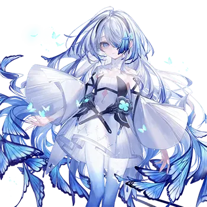
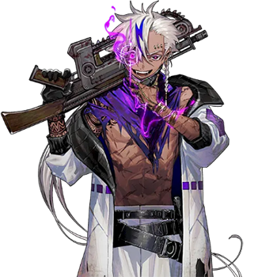
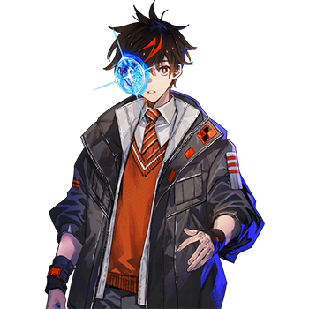

# 艾莉尼·居里亚斯

| 角色信息   |  |
| ----------- | ----------- |
| 名称    |艾莉尼·居里亚斯
| 年龄   |15  |
| 职业 | 无
| 对应曲   | Oracle|
| 对应版本 | Chunithm VERSE

## Episode 1 某样崩坏的记忆

——哐、哐、哐。

走廊回响着皮鞋敲击铁制地板的声响。

在这片吐息都蒙上了白雾的彻骨严寒里，一名白衣女性正沿着被应急灯染成一片红色的通道狂奔着。

被她牵着的少女紧随其后，两人身后还有数名护卫紧紧跟随。

等到抵达通路尽头的门前，白衣女性取出卡片钥匙触碰门旁的面板。在一声细微的电子音后，大门无声地滑开了。

这房间远比通路宽敞，角落布满密密麻麻的管道，中央是则是一个由巨大管道和各类仪表连接着，围成圆形的机械。

 

白衣女性直奔机械，立刻开始了启动的准备。

就在这时，身后的通路传来爆炸的巨响与震动。

守在房间门口的男性护卫，一边确认着通路情况一边大喊着。

 

“玛丽亚大人！请立刻启动加速器！”

 

白衣女性——玛丽亚没有回应护卫，反而对女儿艾莉尼下达指令。

 

“艾莉尼！确认那边的仪表！”

“好！”

 

艾莉尼遵照指示，大声报出机械的状态与数值。

 

“妈妈！接下来要做什么！？”

“到这边来！”

 

玛丽亚说着，走向房间深处的球状机械。这台机械通过管道和粗电缆相连，发出“嗡嗡……”的低沉震动声。她握住球体中心的把手打开舱门，对赶来的艾莉尼说着。

 

“进去里面。”

“里面……？”

 

在玛丽亚的催促下，艾莉尼钻进了球体。内部出乎意料地狭窄，根本无法容纳一个成年人。

 

“难道这是……”

 

她从内部构造中感受到了某种“意图”。

正想回头询问制造者的真意，玛丽亚的手覆在了她的手上。

她的手在颤抖。

 

“妈妈……”

 

玛丽亚紧紧握了握艾莉尼的手。

随后离开了呆立的女儿，关上了舱门。

 

“不要！妈妈！！”

 

厚重的金属壁隔绝了她的声音，可艾莉尼仍拼命呼喊着母亲的名字。这时，球体内传来玛丽亚的声音。

 

“……艾莉尼，我们没时间了。所以，你要认真听我现在说的话。”

 

她的语气平淡，没有平日那股严厉的样子，只有温柔与平静。

 

“索拉里斯要沦陷了。我们的世界终究逃不过毁灭的命运。但我，不想让你与这个世界一样走上同样的道路。”

『……大人！他们……他们冲过来了——』

“快！启动加速器！！”

 

玛丽亚身后传来数声枪响与怒吼，伴随着管道被撕裂的声响，高压蒸汽喷涌而出。

 

“你将要前往另一个世界。妈妈……不能陪你一起去，真的……对不起。多想……和你一起……实现……——唔！？”

 

声音断断续续，夹杂着玛丽亚的呻吟。

 

“妈妈？你怎么了？妈妈！”

『你要记住……无论何时……我都是盼着你的……幸……福……』

“不要！不要不要不要！！快回答我啊！！妈妈！！”

 

意识到母亲正身处险境的艾莉尼，拼尽全力嘶吼着。

然而，她的愿望终究是无望的——玛丽亚，再也没有回应她。

本就狭窄的球体内部愈发压抑沉重。

 

“妈妈……妈妈……”

 

她哽咽着，突然发现球体内部开始泛起微光。

光芒渐渐变强，球体开始轻微震动。

 

“这是……怎么回事……——”

 

艾莉尼的意识在此刻中断。

恢复意识时，她正漂浮在光的洪流中。

 

（诶……？为什么……）

 

无论如何用力，身体都无法动弹，只能任由自己被洪流裹挟着前行。

这就是死后的世界吗？

在这么想着的时候，远处突然有什么东西“闪烁”起来——

 

是爆炸。

 

等艾莉尼反应过来时，身体已被冲击波吞噬。

震彻空间的剧烈震动席卷全身，却没有丝毫痛感。

她只能眼睁睁看着自己的四肢从指尖开始，逐渐分解成粒子。

四肢，全身，全部都化作了粒子，与光芒交融、消散。

在头部也即将化作粒子的最后一刻，艾莉尼用尽所有力气，默念着对母亲的祈愿，彻底消失在光中。

## Episode 2 热砂的大地

灼热刺眼的阳光倾泻而下。

一望无际的广阔沙漠上，无数沙丘如涟漪般连绵起伏。

在其中一座最小的沙丘旁，艾莉尼正倒在那里，静静地沉睡着。

微风拂过脸颊，意识渐渐苏醒。

 

“……嗯……呜……”

映入艾莉尼眼帘的第一样东西，是万里无云的群青色天空。

 

“诶……”

 

从未感受过的解放感与昂扬感席卷全身，艾莉尼彻底沉醉在这片望不到尽头的湛蓝中。

 

“好美……妈妈说过的蓝天，真的存在啊。”

 

生于地下都市、长于地下都市的她，此前只在母亲和长辈的回忆里，以及绘本中见过天空。

这片无边无际、纯粹无瑕的蓝，美得让她不由得屏住了呼吸。

她凝望天空许久，一个疑问渐渐浮上心头。

为什么自己会在这里？明明当时，她亲眼看到自己被爆炸卷入，身体正被一点点分解来着。

 

“……不痛了……”

 

可此刻，身体完好无损，没有一丝伤痕。

 

“这……我是在做梦吗？”

 

她沿着沙丘漫无目的地走着，琢磨着这是不是梦。直到一个声音响起，让她不得不承认这里是现实——

 

——咕噜噜噜噜噜。

肚子中传来了一股仿佛怪物在洞窟中打鼾般的响声。

 

“呀！？ 啊呜……”

胃袋仿佛在做着抗议，拼命诉说着想要食物的渴望。

 

“呀……！？”

 

突然，艾莉尼双腿一软，再也支撑不住身体，瘫倒在沙地上。

全身的力气正急速流失。

 

“啊……”

 

必须找点东西吃。她盯着眼前的沙粒，脑海中想起了曾经在地下都市吃过的营养剂——

颜色很像，说不定能吃。

凭着直觉，艾莉尼用手捧起沙子，猛地塞进嘴里。

 

“……呃！ 呕、呕……”

 

根本咽不下去。必须找到其他能吃的东西——

她趴在地上，用双臂支撑着身体，拼命向前爬行。

——沙啦。

头顶的沙丘上传来声响。

艾莉尼小心翼翼地抬头，发现逆光中站着一个人影。

 

“啊……救，救我……”

“嗯？ 我还以为是沙鼠才过来看看的……没想到碰到稀罕事了。这荒芜之地竟然还躺着这么漂亮的娃娃啊……”

 

话音未落，那人便径直冲下沙丘，笔直朝着艾莉尼飞奔过来。

那是个高个子的女人，她身披着一件乳褐色斗篷，脸上戴着一副遮住眼睛的护目镜，还有掩住口鼻的黑色面纱。

 

“哦……凑近看更漂亮了啊。到底是哪家工坊做的？”

 

她推起护目镜，仔细地打量着艾莉尼。

 

“皮肤真娇嫩……没有一丝伤痕或污渍。错不了，这能卖个好价钱……”

 

女人伸手戳了戳艾莉尼的皮肤。

 

“呃……啊……”

“嗯！？ 你、你还活着！？”

 

女人立刻提高警惕，后退一步，手摸向腰间的剑。

 

“没穿防尘服，怎么会倒在这种地方？ 根据你的回答——”

 

——咕噜噜噜噜噜。

艾莉尼的肚子再次发出了怪物般的叫声。

女人忍不住笑了出来，啐了一声“真是的”，接着，便从背上取出一个细筒和一块风干肉。她打开筒盖，递到艾莉尼嘴边：

 

“……？”

“是水。慢慢喝吧”

“……嗯……”

 

艾莉尼轻轻点头，慢慢喝完水，又吃掉了风干肉。

* * *

“谢、谢谢你。多亏了你我才得救……”

“不用客气。既然能说话了，就赶紧回答我的问题：你为什么会倒在沙漠的正中央？”

“我不知道……等我反应过来，就已经在这里了。”

 

女人单手托着下巴，陷入沉默。

透过护目镜和面纱的缝隙，能看到她褐色的皮肤微微抽动了一下。

 

“嗯……看起来也不像是什么诱饵啊……”

“你、你说什么？”

“没什么。看你这样子，也没有可回去的地方吧。要不要来我家？ 食物和床铺还是能给你准备的”

“真、真的吗！？”

“当然。在这片不毛之地，不互相帮助可活不下去”

 

女人说着，向艾莉尼伸出了手：

“我叫薇尔维奇亚，是荒芜之地的商人。”

## Episode 3 母亲的身影

骑在薇尔维奇亚驯养的砂鼠背上——这只体型远超娇小的艾莉尼的生物，正载着两人，来到了一座建在陡峭巨岩缝隙间的建筑前。

这座建筑仿佛是由多个穹顶结构连接而成，造型奇特，静静矗立着以躲避阳光。

 

“哇啊……！”

 

艾莉尼顺着砂鼠的尾巴滑到地面，脸上瞬间绽放出花朵般灿烂的笑容。

 

“软软的好可爱！这就是薇尔维奇亚小姐的家吗！？”

“我刚才就说了，别这么吵闹。再叽叽喳喳的，就把你扔去喂沙虫哦。”

 

对艾莉尼来说，眼前的一切都充满新鲜感。

就连路上那些在薇尔维奇亚看来稀松平常的景象——比如天空中悬挂的三轮明月、在沙漠中穿梭的沙虫，都让她兴致勃勃地欢呼不已。

薇尔维奇亚已经在这个世界经历了漫长的岁月，在她眼中，眼神发亮、笑容灿烂的艾莉尼跟这里显得格外格格不入。

她到底是在什么样的地方长大，才会有这样的反应？

 

“……你要蹦跶到什么时候。我还有工作要做，赶紧过来。”

“啊……好的！”

 

艾莉尼跟在薇尔维奇亚身后走进屋里。薇尔维奇亚点燃了房间中央的油灯，灯光渐渐照亮了室内。

客厅十分简陋，衣服散落各处，疑似经商工具的物品杂乱堆放着。

仅仅看这个房间，就能大致猜到她的性格。

 

“空房间在……嗯……”

 

薇尔维奇亚身影消失在穹顶外缘的通道里。穹顶的结构到处都能产生回音，甚至能听到她在房间里哼着的小曲。

过了一会儿，她的声音传了过来。

 

“这边。”

 

艾莉尼沿着昏暗的通道前行。从外面看完全无法想象，这座建筑的内部结构竟然如此的宽敞。

穹顶内分出了几个小房间，每个房间门口都垂着几乎拖到地面的厚窗帘，无法看清内部是什么模样。

艾莉尼走到最后一个房间时，薇尔维奇亚正在向她招手。

 

“进来吧。”

 

艾莉尼探头一看，房间里就只有一张简单的床铺，除此之外算得上显眼的，也就只有悬挂在天花板上的油灯了。

由于位于建筑内侧，房间里没有窗户。

 

“虽然是个空无一物的房间，但你可以随意使用。”

“谢谢你。有这么多房间，真让人惊讶。你是和家人一起住吗？”

“不是。”

 

薇尔维奇亚摇了摇头，只回答了一句，“剩下的房间都当仓库用了。”

“好了，我得出去一会儿去处理剩下的工作，能否请你乖乖待在这里好呢？ 要是听话，就给你准备丰盛的饭菜。”

“有、有没有那个风干肉？”

“哦呀哦呀，这么喜欢吗？ 当然有，不仅有风干肉，还有沙虫肉排呢。”

 

站的远远的都能听到艾莉尼吞咽口水的声音。

 

“那、那我知道了！”

“嗯，真是个好孩子。”

薇尔维奇亚正准备离开房间，艾莉尼突然慌张地叫住了她。

“啊，那个！”

“怎么了？”

“请让我做点事报答你吧！”

“嗯？”

“薇尔维奇亚小姐在沙漠里救了我，还给我水和食物，甚至为我准备了住处。得到了这么多照顾，我怎么好意思待在这里呢？”

 

艾莉尼在胸前轻轻攥起拳头，抬头望着薇尔维奇亚。

 

“妈妈经常对我说，要成为能帮上别人的人。”

 

想要帮到别人——

这是艾莉尼从小就一直怀揣着的愿望。

 

“我以前住的场所是在地下。那里是个必须互相帮助才能生存的地方。可是，周围都是大人，就算我说想帮忙，他们也不让我做……”

“哦，是这样啊。不过，地下……真是闻所未闻。你想回到那里去吗？”

“想。但是……我不知道怎么回去……”

 

她试图回忆当时的情景，记忆却模糊不清，像蒙着一层薄雾。明明才刚失去了母亲，还有自己赖以生存的整座城市，还有住在那里的所有人，可自己却记不清任何的细节，这让她对想不起这些的自己感到了一丝厌恶，眼泪也跟着涌了上来。

 

“求求你。请让我帮上薇尔维奇亚小姐的忙吧！”

“这样啊……”

 

薇尔维奇亚单手托着下巴，装作思考的样子，淡淡地回答。

 

“那，你能给我一缕你那漂亮的头发吗？”

“诶？”

 

突如其来的请求让艾莉尼眨了眨眼。

 

“头发……吗？”

“对，简直就和金线一样漂亮，看得我都着迷了。可以吗？”

“好的。如果我的头发能帮到你，请随意拿吧！”

“嗯，真是个好孩子。那我就收下了。”

 

薇尔维奇亚从怀里掏出一把小刀，反手握在手中，刀刃朝着艾莉尼光泽亮丽的银发落下。

泛着青蓝色的长发从中间被切断，落入薇尔维奇亚的掌心。

这缕银发越往发梢越呈现出奇妙的纹路，如同蕴含着光芒的宝石，散发着璀璨的光泽。

 

“这真是……漂亮啊……”

薇尔维奇亚就像是被什么迷住了一般，目光久久无法从头发上移开。

 

“那个，薇尔维奇亚小姐？”

 

艾莉尼轻轻拉了拉她的斗篷，薇尔维奇才终于回过神来。她清了清嗓子掩饰尴尬，叮嘱艾莉尼“外面很危险，不要离开家”之后，便后走出了穹顶。

 

“走了啊……”

 

屋子里只剩下了艾莉尼一个人。她乖乖躺在了床上。床单上除了灰尘味，还夹杂着一丝酸味。但即便如此，这种气味对她来说也十分新鲜。

 

“……什么时候会回来呢？”

 

她茫然地望着墙壁，回想着地下都市的往事。在残存的记忆中，唯一清晰的是在光的洪流中看到的爆炸。

那就是毁灭了索拉里斯的原因吗？

 

“不知道……”

 

无论怎么回想，都想不出任何有价值的线索。

一直纠结着没有答案的疑问，心中渐渐涌起一阵烦闷。

艾莉尼猛地坐起身来。

 

“……毕竟……她只是说不要离开家而已嘛。”

 

她喃喃自语着，走出昏暗的房间，来到散落着大量衣服的客厅。

 

“虽然薇尔维奇亚小姐说不用收拾，但商品和房间干干净净的，她应该会更开心吧。嗯，肯定是这样。”

 

记得很久以前——

艾莉尼就开始照顾身兼市长和研究者的母亲的起居。

 

“妈妈以前也总是把衣服随手乱扔……如果我不说，她就算穿同一件衣服好几天也不会在意的。”

 

客厅的杂乱景象，和玛丽亚的房间非常相似。

薇尔维奇亚一定和妈妈是同一类人。想到这里，她才意识到自己在她身上看到了母亲的影子，不由得自嘲地笑了笑。

 

——过了一会儿。

 

艾莉尼收拾完散落在房间里的衣服，又打扫干净了房间。现在，她正坐在破旧的沙发上叠着衣服。

叠了几件后，她突然察觉到一丝不对劲。

 

“这是……”

 

这些衣服大多是起到防尘作用的斗篷，足足有二十多件。款式五花八门，既有纯色的，也有色彩鲜艳的。

其中甚至还有明显不适合个子高大的薇尔维奇亚穿的、破旧的“儿童款”——

艾莉尼心中涌起一股不祥的预感，转身冲向客厅深处的通道。

她掀开厚厚的布窗帘，走进小房间，眼前突然出现了一个和人差不多高的箱子。

她屏住呼吸，小心翼翼地查看里面的东西——

箱子里竟然收纳着大小不一的赤裸人体，他们被折叠得皱巴巴的，毫无生气。

 

“啊——！”

 

艾莉尼强忍着不让自己叫出声来，这时身后传来了一个声音。

 

“嗯……看来你还是没能乖乖听话啊，艾莉尼。”

“啊……薇、薇尔维奇亚小姐……？”

 

薇尔维奇亚站在客厅一侧的通道口。虽然护目镜和口鼻处的面纱遮住了她的表情，但艾莉尼能清晰地感觉到——

她此刻对自己充满了敌意。

## Episode 4 适者生存

“你没好好听我说的话对吧？还真是个坏孩子啊……坏的入骨了啊！”

“你、你在这里做什么？”

“嗯？当然是做生意啊。在这里，所有有价值的东西都是商品——哪怕是人类的尸体也不例外。”

 

薇尔维奇亚一步步地走近艾莉尼，通道被她的身体完全堵住。

就算能找到一丝缝隙，她手中的小刀也不会让自己过去的吧。

 

“你、你打算杀了我吗？”

“怎么会。你有值得我分给你珍贵水和食物的价值，所以我才把你留在这里养着。”

“养、养起来……？”

“没错。让你活久一点，再找个合适的对象让你‘繁殖’。”

 

艾莉尼不懂“繁殖”的具体含义，但从她的语气里，能清楚察觉到对方没打什么好主意。

她满是厌恶地瞪着薇尔维奇亚。

 

“难道这个世界非得做到这种地步才能活下去吗！？ 就算不做这种事，薇尔维奇亚小姐也一定有其他生存方式的！”

“要是那样，你早就曝尸荒野了。不过啊，你被保护得有多好，简直一眼就能看出来。你待过的地下，一定很幸福吧。”

“……”

“你不会明白的。所有生物，都会为了生存拼尽全力。对我来说，做生意只是实现这个目的的手段而已。”

 

薇尔维奇亚一点点挪向艾莉尼。

 

“别、别过来！”

“你能提供价值的地方只有这里，好了，为我的生意效力吧，艾莉——”

 

——咕呀……！

 

突然，响起一阵仿佛有什么东西被碾碎的刺耳声响。

声音来自艾莉尼眼前——薇尔维奇亚所在的方向。

艾莉尼吓得紧闭双眼，又小心翼翼地睁开。

正好看到薇尔维奇亚来不及做出任何防御，就脸朝下倒了下去。

 

“薇、薇尔维奇亚小姐？”

 

她疑惑地看着一动不动的薇尔维奇亚，想要上前查看情况。

 

“啊——！”

 

只见薇尔维奇亚腰部以上的身体，以远超人类活动范围的角度，扭曲成了诡异的形状。

 

“为、为什么会这样……”

“——真是千钧一发啊。”

“！？”

 

艾莉尼反射性地回头，只见一群身着灰褐色铠甲、手持枪械的男人站在那里。

 

“难、难道是你们杀了薇尔维奇亚小姐……？”

男人们中间站着一个褐皮肤的男人，他面带笑容，朝艾莉尼走来。

那笑容僵硬得如同贴上去的一般，毫无自然感。

 

“要是我没出手，你现在已经死了吧。还不快点感谢我？”

 

褐皮肤的男人一副理所当然该得到感谢的样子，张开双手等着艾莉尼说话。

可艾莉尼却说出了完全不同的话。

 

“为什么？ 为什么要夺走她的生命！？”

“……哈？”

 

褐皮肤男人脸上的笑容瞬间消失了。

“你在跟我说事？”

 

艾莉尼强压着内心的怒火，缓缓说道。

 

“薇尔维奇亚小姐根本没想杀我。如果你们没有夺走她的生命，说不定她还会愿意听我的解释……”

“哈，真是莫名其妙。所以呢？ 你想说什么？”

 

被他锐利的目光盯住，艾莉尼不由得打了个寒颤。但即便如此，对眼前这种无端的杀戮的愤怒也没有消散。

 

“薇尔维奇亚小姐她救了我啊！”

 

艾莉尼颤抖着身体，谴责着眼前的男人。

她本能地觉得，这种不问缘由就将人置于死地的人，根本不值得信任。

 

“哈啊……真麻烦。”

 

褐皮肤男人夸张地叹了口气，伸手掐住了艾莉尼的脖子。

 

“诶……？”

“给我安静点。”

“……唔、哈……啊！？”

 

男人的大拇指稍微用了点力，艾莉尼的脸上立刻浮现出痛苦的神色。

 

“这就是你不好了。我本来也不想做这种事的。”

“唔……”

 

看到艾莉尼不再反抗，男人才说道。

 

“你现在已经是我的东西了。要是敢试着逃跑，我就把你的手指一根一根折断，让你跟地上那家伙一个下场。”

 

“出发。” 褐皮肤男人对其他人说道，同时开始操作手臂上佩戴的某种装置。

艾莉尼无力地看着眼前的一切，如同旁观者般想象着自己即将面对的未来——

自己的生命，将会被这些粗暴的人肆意践踏，或许会遭遇比现在更悲惨的命运。

最终，也会和薇尔维奇亚走上同样的道路吧。

她的目光落在了惨死的薇尔维奇亚身上。

 

（……薇尔维奇亚小姐说过，所有生物都会为了生存拼尽全力。）

闭上眼睛，在索拉里斯的日子涌上心头——

在没有太阳的地下世界，大家互相帮助，有效利用有限的资源，拼命地活下去。

（妈妈也好，那些保护过我的人也好，都在拼尽全力保护我…… 那我呢？ 我拼尽全力了吗……？）

艾莉尼摇了摇头，眼神中带着一丝脆弱，却有着无比坚定的意志。

她要反抗这无理的暴力，反抗这注定悲惨的未来。

（不，还没有！ 我还没有拼尽全力活下去！ 为了那些拯救过我的人！ 我必须活下去——！）

 

就在艾莉尼从心底呐喊的瞬间——

她突然站在了一片沙丘连绵不绝的沙漠之上。

 

“……诶？”

 

眼前的景象如同按了切换键般彻底改变，周围瞬间变成了陌生的景色。

事情发生得太过突然，艾莉尼完全无法理解现状。

 

“我……刚才明明在薇尔维奇亚小姐的家里…… 为什么会在这里……”

 

她环顾四周，看到了不远处一个熟悉的岩堆——

那正是薇尔维奇亚家所在的岩堆。

到底发生了什么？

艾莉尼试图弄清状况，却突然发现自己身旁的空间正在微微晃动。

 

“这、这是……”

 

她伸手触碰那片晃动的空间，一道黑色的人影突然从里面浮现出来。

## Episode 5 相连的世界

刚才还掐着艾莉尼脖子的褐皮肤男人，反复张开又握紧手掌，试图确认掌心残留的微弱体温。

她已经从薇尔维奇亚的家里凭空消失了。

 

“切，真倒霉。已经发现了自己的力量了吗？”

“安克大人。”

“知道了知道了。”

 

名为安克的褐色皮肤的男人，一边回应着身后待命的手下，一边将前臂的装甲放到了自己的胸前。

前臂装甲上装有一个终端，上面排列着几个简化的符号。

安克按下符号中的锥形光标，淡橙色的光芒在空中浮现，形成了立体影像，映出了荒芜之地的沙漠地带。

他在生成的沙漠影像中找到一个唯一发光的地点，露出了嘲讽般的笑容：

“就是这里。追！”

* * *

与此同时。

艾莉尼正与眼前空间中浮现的人影对峙着。

 

“这、这是什么……？”

 

那个人影只有清晰的身体轮廓，除此之外没有任何多余信息。人影似乎能感知到她，每当艾莉尼左右移动，它就会在空间里随之晃动。

 

“到底……怎么回事啊……”

 

从正面看，这片空间晃动的范围很广，可当艾莉尼从侧面观察时，才发现它只是一片薄如纸张的“平面”。

 

“正面看是立体的，好神奇……”

 

艾莉尼想再靠近一点观察这片诡异的空间，于是慢慢缩短距离。

就在这时，人影突然朝她挥了挥手。

 

“呀！？”

 

艾莉尼吓得一屁股坐在了地上。

 

“吓、吓我一跳……”

 

她本想对人影这副像是在关心自己的模样表示抗议，可这短暂的平静也很快不复存在——

 

袭击薇尔维奇亚的那些男人，正在朝这边逼近。

 

“为什么他们会……”

 

没时间多想了。

必须立刻离开这里。

艾莉尼拼命在沙漠中奔跑。

可对方是武装集团，而她只是个一直生活在地下、毫无力量的孩子。

 

“哈……哈啊……！”

 

明明应该已经拉开了距离，却隐约能听到褐皮肤男人的声音。

心脏狂跳不止，她已经快撑不住了。

 

“还不能……！”

 

就在这时，视线突然一晃，一座沙丘瞬间出现在眼前。

 

“……诶？”

 

眼看就要撞上，艾莉尼反射性地闭眼戒备，可预想中的冲击迟迟没有到来。

 

“怎、怎、么……”

 

景色在瞬间切换。

这种状态持续了一会儿，随着呼吸逐渐平稳，艾莉尼才慢慢冷静下来。

她身上的异常终于开始平息，再次确认周围环境——

虽然肯定还在沙漠的某个地方，但追杀她的男人们已经不见踪影。

明明移动了相当远的距离，手脚却没有丝毫疲惫或疼痛。

突然，童年时母亲给她读过的**绘本故事**在脑海中浮现。

 

“难道……不，不可能……”

 

那本绘本里，描绘的是一个无论距离多远，都能瞬间<ruby>跳跃<rp>（</rp><rt>TELEPORT</rt><rp>）</rp></ruby>到想去的地方的女孩——

 

“这，这难道就是瞬间移动！？”

 

突然，剧烈的疼痛如同全身被撕裂一般袭来，艾莉尼摔倒在地，痛苦地挣扎着。

 

“……啊、啊啊啊啊啊！！”

 

就连无情暴晒的阳光，此刻对她来说也只剩下纯粹的疼痛。

虽然不知道原因，但这种<ruby>跳跃<rp>（</rp><rt>TELEPORT</rt><rp>）</rp></ruby>似乎对身体造成了极大的负担。

如果在这种状态下继续连续<ruby>跳跃<rp>（</rp><rt>TELEPORT</rt><rp>）</rp></ruby>的话，说不定还会危及性命。

 

“……我还不想死。我、我还要……”

 

艾莉尼强忍疼痛站起身，再次踏上了漫无目的的逃亡之路。

在她前行的方向，矗立着一座暗灰色的建筑物。

## Episode 6 逃亡的终点

“——你以为能躲到哪里去？”

“不……不要！”

 

艾莉尼抵达暗灰色建筑物的瞬间，褐色皮肤的男人也追了上来。

已经无处可逃了。

她默念着希望能再次<ruby>跳跃<rp>（</rp><rt>TELEPORT</rt><rp>）</rp></ruby>，可那股神奇的力量并没有回应她的心意。

 

“竟敢让我费这么大劲。”

“呀……”

 

男人的模样和在薇尔维奇亚家相遇时略有不同——

他正用兜帽盖住自己的头，铠甲的颜色也从灰褐色变成了赤棕色。

更让人在意的是，他此刻是单独行动。

明明之前还有其他全副武装的男人，可现在无论是在他身边，还是环绕着建筑物的沙丘上，都看不到其他人的身影。

 

“明明已经跑远了……为什么……”

“哈，再怎么逃也没用。你的位置，我随时都能锁定。”

 

她强忍疼痛拼命逃亡，可这样的抵抗在这个男人面前，不过是微不足道的挣扎。

绝望在艾莉尼的心中蔓延开来。

 

“我、我到底做了什么？ 我从来没做过会被这样追杀的事——”

“你的理由根本无关紧要！”

 

男人将枪口对准了艾莉尼。

她知道，那深不见底的黑色枪口，只需一点力量就能轻易夺走人的生命。

 

“不要……我不要……”

 

恐惧紧紧攥住了她的心脏。

男人还没有扣动扳机，可即便他没有杀意，这一幕也足以让艾莉尼直面死亡的恐惧。

 

“……”

看着艾莉尼的反应渐渐变得迟钝，男人确信自己已经胜利，开始操作手臂上的终端。

突然，他身旁的空间开始晃动。

终端发出了冰冷的机械音。

 

『传送门即将展开』

“……诶？”

 

艾莉尼对这突如其来的诡异空间有种熟悉感——

它和逃亡途中遇到的那片薄如纸张的平面空间非常相似。

 

“走吧。”

 

男人向艾莉尼逼近。

她已经没有任何办法能从这具训练有素的身体面前逃脱了。

 

“别、别过来……再过来的话，我就——”

“咬舌自尽？哈，你办不到的。老子最懂人的生死了。没放弃活下去的意志的人，光从眼神一眼就能看出来。”

 

男人故作姿态地顿了顿，兜帽下那双幽暗浑浊的眼睛看向艾莉尼。

 

“那种玩意儿就叫‘希望’。希望可是这世界上最麻烦的东西了。不管被逼到多绝望的境地，它都能轻易让人改变想法。”

他再次将枪口对准艾莉尼，却把瞄准的目标换成了她的脚边。

 

“总之先打断你的腿吧。”

 

说着，他的手指搭上了扳机。

下一秒，痛彻心扉的剧痛就会降临到自己的身上了吧。想象到即将到来的剧痛，艾莉尼仿佛事不关己般想要逃避，于是闭上了眼睛。

——就在这时。

——砰！！！

毫无预兆地，从另一个方向传来了如同爆炸般的巨响，还夹杂着某人的叫喊声。

褐皮肤男人反射性地翻身躲避，以平面空间为掩体，警惕着周围的情况。

 

“这群杂碎竟然还活着吗！妈的！？”

 

男人怒不可遏，一边警戒四周，一边朝着声音传来的沙丘方向走去。

他刚一离开，那片平面空间就消失了。

 

“……”

 

艾莉尼茫然地看着眼前发生的一切。

她从未想过，那个一直执拗追杀自己的男人，会主动离开。

这是千载难逢的机会，绝不能错过。

 

（必、必须逃跑……可是，可是……）

就算使用<ruby>跳跃<rp>（</rp><rt>TELEPORT</rt><rp>）</rp></ruby>，那个男人也能追上来，他一定有某种方法能锁定她的位置。

 

（……该逃到哪里去？）

 

面对那样的男人，自己到底能做什么？

或许，放弃一切反而能轻松些。

她已经拼尽全力了——只要给自己找点借口自我安慰一下就可以了……

 

“——喂，你！”

“诶？”

 

突然有人搭话，将艾莉尼从消极的思绪中拉回现实。

她朝着声音的方向回头，只见一个和自己年纪相仿的少年站在那里。

 

（怎、怎么会……？）

艾莉尼满心困惑——

因为眼前的少年，长着一张和刚才消失在沙丘后的男人“一模一样”的脸。

一种与死亡恐惧截然不同的恐慌，席卷了她的全身。

 

“呀——”

“等、等等。一叫就会被那家伙发现的。”

 

少年压低声音说道。

艾莉尼发现，越是慌张，自己反而越能冷静下来。

她再次打量着少年。

他衣着轻便，没有携带任何武器，也感受不到那个男人身上的敌意与杀意。他的皮肤没有被太阳晒黑，反而有些白皙。

原来，他们只是长得一样的不同的人。想通这一点，艾莉尼才松了口气。

“请、请问……你是什么人？”

“我叫威廉，威廉·温斯雷特。”

 

“我、我叫艾莉尼·居里亚斯。”

“艾莉尼啊，真是个好听的名字。”

 

在这紧张的局势下，威廉露出了爽朗的笑容。

 

“详细情况边走边说吧。趁那家伙没发现，赶紧离开这里。”

威廉向艾莉尼伸出了手。

 

“好……”

 

艾莉尼毫不犹豫地握住了他的手。

她自己也不明白，为什么会握住一个陌生人的手。但很快，她就从刚才那个男人的话里找到了答案——

——那就是希望啊。

她无意识地感受到了威廉眼中蕴含的希望，所以才握住了他的手。

## Episode 7 即便再怎么胆小也好

在艾莉尼陷入绝境时突然出现的少年——威廉。

此刻，两人在沙丘间穿行着，朝着他所说的“穿越到另一个世界的入口”前进。

 

“请、请问，你怎么知道这里有入口？我明明——”

 

艾莉尼的话还没说完，身后就传来巨大的声响。

 

“哗啦啦啦！”

 

尖锐的鸣叫声震彻空气。

这是薇尔维奇亚带艾莉尼回家时所提到过的，沙漠的主宰——沙虫发出的声音。

 

“太好了，它来了！”

“刚才那个……难道是你引来的？”

“对，我打开了录有激烈枪战的电影，然后把携带终端的音量开到了最大。”

“电，影？”

 

艾莉尼虽然没完全听懂，但威廉随后解释了自己是如何引来巨大沙虫的。

虽然他话里都是各种未知的词汇，勾起了艾莉尼强烈的好奇心，不过现在只要知道是利用了沙虫的习性做到的就足够了。

 

“那家伙现在应该正忙着对付怪物呢。”

 

看着威廉得意的样子，艾莉尼心中却掠过一丝不安。

那褐色皮肤的男人曾瞬间扭曲薇尔维奇亚身体的力量，如果也能用在沙虫身上——

他说不定很快就会追上来。

 

“威廉先生，我们快走吧！”

“嗯，当然——”

 

就在这时，一道破空声在两人之间响起。

 

“——！？”

鲜红的血顺着威廉的脸颊滑落。

那褐色皮肤的男人从远距离射击了他。幸运的是没有危及生命，但在未知的恐惧面前，威廉还是动摇了。

 

“不可能……那怪物已经被他解决了吗？”

 

那褐色皮肤的男人竟然轻松解决了比自己大好几倍的沙虫。

威廉和当初亲眼目睹这个男人疯狂一面的艾莉尼一样，吓得双腿发软。

 

“啊……”

“威廉先生……！”

 

威廉踉跄着从沙丘斜坡滚落了下去。艾莉尼慌忙跑过去查看，发现他正不停地颤抖着。

 

“……我竟然……只凭着毫无根据的自信……”

他小声呢喃着，仿佛在逃避现实。

“这么莽撞地行动……不，甚至是看不起他……”

 

艾莉尼看着他的背影，忽然有种似曾相识的感觉。

在她曾经居住的地下都市索拉里斯，有一个只有母亲玛丽亚和她能进入的房间。那里是身兼市长与研究者的玛丽娅，能“卸下”所有身份与压力的圣地。

 

（威廉先生现在正被死亡的恐惧和压力搅乱心神。那么，我能做的是——）

艾莉尼轻轻将自己的手，放在了垂头丧气、动弹不得的威廉手上。

 

“振作一点！”

“艾、艾莉尼……”

 

与母亲的回忆涌上艾莉尼的心头。

研究不顺而悲痛时，是自己在支撑母亲；而自己因为读了恐怖的绘本睡不着时，也是母亲在守护自己。

 

（对。我们一直都是这样互相支撑着活下去的……！）

 

威廉微微有了回应。

他的眼中，还没有完全被绝望浸染。

 

“我妈妈以前也总因为恐惧而发抖。但每当她这样握住我的手，就能鼓起勇气面对恐惧。所以，我们也可以的。如果我们两个都是胆小鬼的话，只要互相扶持就好。”

 

为了让威廉安心，艾莉尼露出了自己此刻能挤出的最灿烂的笑容。

 

“——抱歉”

“诶？”

 

艾莉尼以为自己的话没传达到，有些失落。

 

“啊，不是！我是为自己的没用道歉！”

威廉意识到自己说错了话，慌忙辩解。

看着他慌张的样子，艾莉尼忍不住偷偷笑了出来。

 

“现在不是说这个的时候！艾莉尼，赶紧走吧！”

 

两人加快了脚步。

艾莉尼注意到，在这片本该只有天空和沙漠的荒芜之地，漂浮着一个巨大的黑色洞穴。

洞穴里，能看到与荒芜之地风格迥异的建筑物。

 

“是那里吗？”

“嗯，只要能到那里的话——”

“太天真了！”

 

听到这个声音时，艾莉尼已经摔倒在沙漠上。

 

“威廉先生！！”

 

威廉被弹飞到了比她更远的地方。

褐皮肤男人正挡在单膝跪地、背对着黑色大洞的威廉面前。

 

“哈……哈……”

“看起来弱不禁风，倒还挺耐打的啊。你这家伙，还敢“算计”我？不过，这些都无所谓了。”

 

艾莉尼要想去到威廉身边，必须从那个男人身边经过。

 

“喂，臭小鬼，敢用这种无聊的陷阱耍我！很好，你成功惹怒我了。作为回报，我可要送你个大礼……”

男人说着，让枪口上装着的、散发着不祥气息的刀刃状物体“嗡”地响了一声。

如果现在不上去帮忙，威廉这次真的会丧命。

艾莉尼双手按在胸前，闭上眼睛询问着自己。

（要怎么做，才能<ruby>跳跃<rp>（</rp><rt>TELEPORT</rt><rp>）</rp></ruby>呢？）

她想使用<ruby>跳跃<rp>（</rp><rt>TELEPORT</rt><rp>）</rp></ruby>的力量拯救威廉。

她将意识集中到身体的每个细节，不断在心中默念着。

虽然上次因为在沙漠中不停地<ruby>跳跃<rp>（</rp><rt>TELEPORT</rt><rp>）</rp></ruby>，导致全身像被撕裂般疼痛，但此刻那种疼痛已经消失了。

 

（没关系。我相信自己一定能做到。）

 

感知情况如何？能力的精度如何？摆在艾莉尼眼前要思考的东西有很多

但她拼命想象着自己像绘本里的女孩一样，为了他人动用力量的模样。

艾莉尼下定决心，要为了生存拼尽全力。

只要自己真心渴望，就一定能得到回应。

 

“——哈，哈哈！哇哈哈哈！”

 

褐皮肤男人的狂笑声响彻四周，强行打断了艾莉尼的专注。

她不顾一切地冲了过去。

再一次，强烈地渴望着，拼命地祈祷着。

 

（我要救威廉先生！！）

不能让那个人就这么死在这里。

我要从那个长得跟威廉有着同样脸庞，唾弃希望的男人手中救出威廉！

（求求你，发动<ruby>跳跃<rp>（</rp><rt>TELEPORT</rt><rp>）</rp></ruby>吧！！）

## Episode 8 <ruby>跳跃<rp>（</rp><rt>TELEPORT</rt><rp>）</rp></ruby>，在那之后——

与艾莉尼分开的威廉，正与褐皮肤男人对峙着。

威廉的生死全凭男人一念之间，可他脸上却看不到丝毫不安或恐惧之类的负面情绪。

 

“真不爽……你那是什么眼神？难道还觉得自己能翻盘？”

“没错！无论失败多少次，我都会坚持到成功为止！”

“你、这个混蛋……”

 

威廉正面怒视着男人。

 

“我已经受够了失败了！我一定要打倒你，保护艾莉尼！”

 

他奋力呐喊着，却突然察觉到不对劲——

刚才还一脸烦躁的男人，此刻竟异常平静。

威廉感受到一股莫名的诡异，正疑惑时，褐皮肤男人突然抱腹大笑起来。

 

“哈、哈哈！哇哈哈哈哈！没想到会在这里遇到这种家伙吗？这缘分也太奇妙了吧！”

“你在说什么——”

 

就在这时，一阵狂风呼啸而过。

男人头上的兜帽被吹得向后翻起。

“——诶？”

眼前的男人，竟然和自己长得一模一样，宛如镜中的倒影。

 

“真是个不像样的家伙。这么个臭小鬼，竟然是我的“同异体”？”

“你、你到底想……”

“没必要让你知道。 反正你今天就要死在这里了！”

 

男人正要扑向威廉的瞬间——两人之间突然沙尘漫天。

 

“什么！？”

沙尘像间歇泉般猛烈喷涌，离得最近的褐皮肤男人吸入了如沙尘暴般的沙尘，动作瞬间停滞。

 

“咳……！ 你、你这家伙……到底做了什么！？”

 

被莫名指责的威廉也不知所措。

狂风扬起的沙尘模糊了视线，威廉待在原地正寻找反击的机会的时候，耳边突然响起了艾莉尼的声音。

 

“威廉先生！”

 

艾莉尼从沙尘中冲了出来。

 

“艾、艾莉尼！？”

“抓住我的手！”

 

威廉毫不犹豫地回握住她的手。

“这是你……弄出来的？”

“没错！”

 

艾莉尼干劲十足地应着，闭上眼睛准备再次<ruby>跳跃<rp>（</rp><rt>TELEPORT</rt><rp>）</rp></ruby>：

 

“绝对不要松开我的手哦！”

“好、好的！”

 

他们的目标是那个黑色大洞。

虽然沙尘让周围一片朦胧，但艾莉尼在来接应威廉之前，已经记下了大致方位。

唯一的担忧是——两人能否同时完成<ruby>跳跃<rp>（</rp><rt>TELEPORT</rt><rp>）</rp></ruby>。

 

“给我站住！！”

 

就在他们即将瞬移的瞬间，褐皮肤男人从沙尘中冲了出来。

 

“这句话该我说才对！！”

 

威廉掏出口袋里自卫钥匙链上的喷雾，对准正要抓住艾莉尼的男人，猛地按下喷头。

“噗嗤”一声，含有刺激物的液体迅猛喷出。

 

“痛！？ 啊啊啊啊啊！？！？”

“艾莉尼！”

“好！”

 

艾莉尼立刻启动了<ruby>跳跃<rp>（</rp><rt>TELEPORT</rt><rp>）</rp></ruby>。

 

“上啊啊啊啊！！”

“你这……混蛋，给我去死吧！！”

 

两人朝着黑色大洞尝试<ruby>跳跃<rp>（</rp><rt>TELEPORT</rt><rp>）</rp></ruby>的瞬间，褐色皮肤的男人也同时发动了力量。

 

“——！？”

 

刹那间，强烈的冲击波爆发开来，仿佛要吞噬滚烫的沙漠大地，在周围留下一道道裂痕。

但那里——早已空无一人。