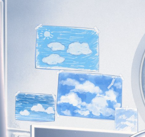
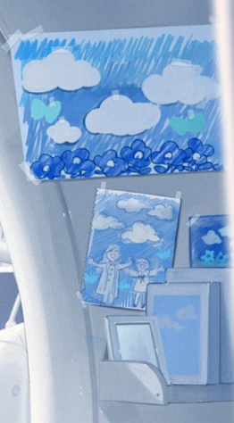

# 艾莉尼·居里亚斯/起始的蓝天

| 角色信息   |  |
| ----------- | ----------- |
| 名称    |艾莉尼·居里亚斯
| 年龄   |6岁  |
| 职业 | 将来想当绘本画家！
| 对应曲   | In the Straying Story|
| 对应版本 | Chunithm X-VERSE

## Episode 1 刻于其身的使命

地下避难所共同体“阿尔卡·卡艾拉”。

那是由于太阳消失，从地上被驱逐的人类所建立起来的最大的建筑物，也是最后的都市群。

这里没有纷争，因为残余的人类都在这里互相联手，相信着终将到来的回归地上之时，谨慎地生活着。

各个都市的管理者，也就是市长，他们共同制定了一道规则。

那就是维持都市机能与人口数量。

不管是都市失去了机能，还是人口的急剧增减，都可能成为都市崩坏的原因。如此考虑的市长们，严格控制着包括人在内的，各种各样的“资源”。

居住在第81号地下避难都市“索拉利斯”的少女·艾莉尼，正是为了维持“阿尔卡·卡艾拉”的人口，才诞生到这个世界上的。

距离她达到可生育年龄，尚有约十年时间。

在履行使命的那一天到来前，大部分的时间，她都待在自己的房间里。

虽然她是个很听母亲话的乖孩子，但将一个人禁锢在有限的空间里也绝非易事——更何况，她正处于对眼前一切都充满好奇的年纪。

为了不让女儿感到无聊，母亲玛利亚送给了她一份礼物：一本创作于旧时代的绘本。

## Episode 2 很久很久以前，在某个地方

这一天，艾莉尼也在母亲玛利亚的身边听她讲着绘本里的故事。

艾莉尼躺在床上，旁边传来的，是母亲温柔的声音。

>很久很久以前。在某个地方，有一个女孩子。
>
>女孩在这个世界上孤零零地一个人生活着。
>
>但是，她却不会感到寂寞。
>
>因为她拥有一股神奇的力量，即便是距离百万光年的星辰，也能随时前往。
>
>女孩最喜欢做的就是环游各个星球。
>
>所以，女孩并不孤单。
>
>直到有一天，女孩子遇到了一位男孩子。
>
>男孩正在哭泣。
>
> 
>——你为什么在哭呀？
>  
>
>女孩问到。
>
>男孩没有回答。
>
>于是女孩对男孩说。
>
> 
>——既然这样，就和我一起去环游星辰吧！
>  
>
>
>就这样，两人的星辰之旅，启程了。

玛丽亚一页一页地翻着，在那绘本上的，只有两人前去各个星系游历的插画，没有任何文字。

下一页，再下一页，都只有插画，没有文字。

 

“呐，妈妈……”

“怎么了吗？”

“这个故事，之后会怎样呢？”

“唔，谁知道呢……？”

 

玛丽亚这么说着，一页一页地翻了下去。

无论怎么翻找，上面都没有一点文字，不但如此，随着玛丽亚继续翻下去，女孩和男孩具体前往了什么样的星球，画面上的情报也越来越少了。

唯一不变的，只有他们两人紧握着的手而已。

然后，当玛丽亚翻到了最后一页，上面画的，只有站在星星之上，孤零零地站着的女孩子一个人而已。

 

“男孩子后来怎么样了呀？”  

“谁知道呢？到底会变成怎样呢？”

“唔～”  

 

被母亲反复用同样的话回应，艾莉尼似乎有些生气，撅着小嘴瞪着自己的母亲。  

玛丽亚疼爱地抚摸着女儿的头，轻声问到。  

 

“艾莉尼，要是让你来写，你想把这个故事变成什么样呢？”  

“诶？”  

 

突如其来的提问让艾莉尼眨了眨眼睛，满脸惊讶。

 

“要我来想故事的后续吗？”  

“嗯，我想听听艾莉尼会怎么安排。”  

 

这本绘本的用意，本就是为了激发读者的想象力。  

玛丽亚之前给女儿读的，都是情节固定的绘本。如今觉得艾莉尼已经到了可以进一步成长的阶段，便特意准备了这本开放式结局的绘本。  

 

“我来试试看！”  

 

艾莉尼的眼睛瞬间亮了起来，从玛丽亚手中接过绘本。  

此刻的她，已然代入了绘本作家的身份。  

这位小绘本作家兴奋地蹬着小脚丫，思绪早已飘向了那个未知的世界，琢磨着要编织怎样的故事。  

 

“呵呵，已经到熄灯时间了哦。思考的事就留到明天吧。”  

“好！”  

“晚安，艾莉尼。”  

“妈妈晚安！”  

 

艾莉尼挥手送别玛丽亚后，她把被子拉到肩头盖好。  

艾莉尼躺在床上，视线所及之处——微光洒落的天花板和墙壁上，贴满了她画的画。  

其中大多是天空的模样。  

对在地下都市出生的艾莉尼来说，“天空”本应是金属铸就的天花板。 

所以，阿尔卡·卡艾拉留存的记录里、绘本中描绘的蓝天，对她而言都不过是空想的产物罢了。

而这个房间，正是装满了她这般梦想的理想空间。  

## Episode 3 最初的创作活动

第二天，艾莉尼开始了故事的创作。

绘本已经提供了一个开头，所以方向已经有了谱。

那就是——身为主人公的女孩子，与男孩子一同走遍无数星辰，让男孩不再哭泣。

于是，艾莉尼思考着：到底要去到怎样的星球，才能让他不再哭泣呢？

 

“到底要去什么样的星球呢？”

 

两人将要前去的星球，会有什么东西呢？

周围的环境如何？有什么奇怪的生物吗？

他们会住在什么地方？他们会喜欢吃些什么？

就算只是在脑海中稍微勾勒雏形，就会有无数的想法从她脑中浮现出来。

光是沉浸在这些想象里，时间就过得飞快。

但是，艾莉尼却并不感到厌倦。

因为她的世界是那么地狭小。

虽然房间并没有被封锁起来，但她始终严格遵守着最爱的母亲的叮嘱。

就算是因为吃饭或洗澡而走出这个房间的时候，她也绝对不会去接近母亲叮嘱的那些“不可以去”的地方。

可即便如此，心底不断涌起的好奇心，终究无法被完全压抑。

也正因如此，母亲送给她的这本绘本，才会深深打动她、让她着迷

艾莉尼就这样乘着名为 “思考” 的翅膀，飞向了不属于这里的世界。

 

艾莉尼对星辰的创造十分顺利。

绿色星球、沙漠星球、水之星球、机械星球…… 

她尽可能地想象出各种各样的星球。

接着，她开始构思每个星球上的天空景色。

清晨、正午、黄昏、夜晚。

那些地方的天空，与房间里这钢铁做的天空，都有着截然不同的模样。

那里有妖精、有会说话的动物、有巨大的房屋、有绚烂的极光……

或许还有云朵之外的奇妙事物漂浮着。

对从未见过真正天空、也不知道天空为何会变色的艾莉尼来说，“天空” 本身就藏着无限可能。

 

“嘿嘿，想了好多呀。”

 

她忍不住期待，母亲会不会因此好好夸奖自己。

可就在这个念头闪过脑海时，艾莉尼才发现自己偏离了原本的目的。

 

“啊！得赶紧构思故事才行！”

 

星辰的设定已经完成，接下来终于要进入故事创作的核心了。

 

“我记得……男孩在哭来着。如果他也在哭的话……我也会伤心的。”

 

男孩子为什么在哭？绘本中并未直接描述过。

为了确定男孩究竟哭到了什么时候，艾莉尼再次翻开了绘本。

 

“啊……”

 

男孩在绘本上虽然随着绘本越翻越往后，泪水也越来越少，但是直到最后彻底消失前的最后一页，他却流了比以往更多的泪水。

 

“！”

 

就在这时，艾莉尼想起了绘本上最后一页那女孩子的表情。

她正站在星星上，独自一人。

再仔细一看，女孩的表情被头发藏着，看不太清楚。

看着像是在笑，又看着像是在悲伤。

 

“呜呜……”

 

艾莉尼从这绘本中感觉到的，是一股“悲伤”。

女孩说，在星辰之间游历是件快乐的事情。

但是，一旦她和那个一同走过无数星辰的男孩子分别之后，她还能够获得快乐吗？

不安渐渐笼罩了艾莉尼，一个个悲观的念头接连冒了出来。

如果，在那之后再也无法继续旅行了怎么办？

如果，再也没法见到任何人了怎么办？

即便遇到这样的变故，女孩还能够露出笑容吗？

 

“呜呜……”

 

胸口像是被紧紧攥住一般难受，艾莉尼流下了眼泪。

这种时候，要是那个男孩能够在她身旁就好了。

艾莉尼抱起绘本，向玛丽亚所在的办公室走了过去。

## Episode 4 感情的显露

“这样，因为这本绘本的结局流眼泪了，是吧？”

“……嗯。”

 

看起来是沉浸在绘本的故事中了。

艾莉尼轻轻地点了点头，就这样低着头一言不发。

也许是将绘本中女孩子的形象，想象成了孤身一人的自己吧。

玛丽亚从未想到艾莉尼居然会打破自己的叮嘱来到办公室，但她并未斥责艾莉尼，不如说反而为艾莉尼这出乎意料的行动感到惊讶。

能够自己思考故事的发展，玛丽亚的教育就是如此地成功。

 

“……”

 

玛丽亚冷静地分析着。

这里是要帮艾莉尼一把呢，还是要告诉她让她稍微自己多思考思考一阵子呢？

在思索了片刻之后，玛丽亚用温柔的声音向玛丽亚说到。

 

“这个故事，对于艾莉尼来说，也许是个有些悲伤的故事，对吧？但是，故事可不是一直都是这么悲伤的东西哦？”

“……嗯。”

“能不能跟我说一说，你是在什么地方感觉到了这股悲伤呢？”

“是从男孩子，停止哭泣的时候开始。”

“那又是为什么呢？”

 

艾莉尼并未考虑过这件事。艾莉尼不假思索地把脑海中的答案说了出来。

 

“因为，他见到了自己的爸爸和妈妈。”

“男孩和自己的父母失散了，才会哭泣……这就是你想到的理由吗？”

“嗯。”

“那，你为什么认为这个故事的结局是悲伤的呢？”

“……因为，女孩最后，又变成了孤身一人了。”

“这样。”

 

玛丽亚闭上眼睛，开始思考起艾莉尼到底是如何想到这一步的。

想必在她的脑海里，男孩和女孩都已经经历了难以想象的，波澜壮阔的大冒险吧。

结果就是，最终与一同冒险过的男孩子分别的时候，寂寞涌上了心头。

 

“呵呵……艾莉尼。你要把你思考的这些东西，感受到的这些东西，好好地记住。这些感觉，对你来说，是最重要的东西。”

“重要的东西？”

 

并不明白玛丽亚话语中的含义，艾莉尼歪了歪头。

 

“对的。这个故事对于艾莉尼来说，也许是个悲伤的结局。但是，这个故事从开始到结尾，并非一切都是那么的悲伤才对。艾莉尼自己认真动脑想到的那些东西，你可得好好珍惜啊。”

 

在通往结局的那个过程，肯定还有除了“悲伤”以外的其他东西。这些东西可不能一笔带过。

然后，还有一件事。

——玛丽亚指出了艾莉尼的故事中的一件重要的东西。

 

那就是绘本中的角色“希望他人能够获得幸福”的感情。

这种感情，终有一天也会成为艾莉尼自己，希望他人能够获得幸福的善心吧。

 

“这份感情，一定能够成为你的力量的。现在，你就好好记住这份感情吧。”

“虽然不明白……但我会珍惜的！”

“呵呵，真是好孩子。”

 

玛丽娅抚摸着艾莉尼的头。

那一刻，艾莉尼的脸颊皱成一团，露出了灿烂的笑容。

 

“对了。”

 

不知道是想到了什么呢，玛丽亚突然向艾莉尼说到。

 

“我说啊，艾莉尼。”

“什么？”

“你觉得这个故事的后续，会是怎样的呢？”

“后续？”

“现在，艾莉尼跟我说的故事，都是你思考出来的东西哦。所以，**是要在这里结束，还是要继续下去，都是由你决定的**。我想听听看……艾莉尼你的故事的后续。”

“啊……”

 

这话宛如晴天霹雳，直接让艾莉尼灵光一现。

她忽然明白，故事从来没有把所有事情都描绘完整。

——它只是“截取”了登场的角色们，从他们的眼中所看到的世界的一小部分而已。

 

“……妈妈，你好厉害啊！”

 

竟然还有这样的思考方式！艾莉尼的眼中，顿时就像是爆炸的银河一般，闪闪发亮。

 

“我还要继续回去想想看！我要写出之后的故事！”

 

这么说着，艾莉尼再也止不住脚步了，她三步并作两步，回到了自己的房间里。

一路走着走着，灵感就宛如涌泉一般，取之不尽，用之不竭。

母亲的这番话，就是如此的醍醐灌顶。

 

回到房间里的艾莉尼，立刻奔向了桌子。

要让这个女孩子幸福。

抱着这样纯粹的想法，艾莉尼努力地思考着故事的进程。

偶尔为之苦恼，偶尔为之痛苦。

终于，艾莉尼完成了这个故事的后续。

## Episode 5 在蓝天之下，展露着笑容

>女孩子，已经不再孤单了。
>
>因为，她已经跟男孩子，一起踏上了旅途。
>
>虽然还没有决定，应该往哪里走。
>
>但是，没关系。
>
>两个人已经有了想要完成的事情。
>
>两个人，会前往任何地方。
>
>为的是，能够为大家带来笑容。
>
>——结束——

艾莉尼坐在床边，向身旁的玛丽亚讲述了自己构思的故事结局，还有结局之后的无限可能。

 

“妈妈，怎么样？”

“我感觉到了艾莉尼的想法，真是个让人感到暖心的故事啊。干得漂亮啊，小作家。”

“嘿嘿……”

 

被母亲拥入怀中、温柔抚摸着头，艾莉尼满心欢喜。

然后，她暗暗想着。

以后，要给妈妈讲更多更多故事。 

——因为这是她能为忙碌的母亲做的，最特别的回报。

 

就在这时，房间的灯光微微变暗。

索拉里斯规定的夜晚时间到了。

这意味着她和母亲相处的时光即将结束。

可今天，又和往常有些不一样。

 

——窸窸窣窣。

玛丽亚突然钻进了艾莉尼的被窝。

 

“妈妈，不去工作真的可以吗？”

“不知怎么的，就是想多听听艾莉尼的故事呀。”

 

母亲的表情像个调皮的孩子，逗得艾莉尼忍不住笑了出来。

微光映照的墙壁和天花板上，贴满了艾莉尼画的蓝天。

玛丽娅怜爱地望着这些画，最终停在了其中一幅画上。

 

“呵呵。”

 

那幅画里，在一片青空之下，正画着抬手相视而笑的玛丽亚和艾莉尼。

 

“艾莉尼，再给我讲讲，你还想到了哪些星球呀？”

“好呀！ 比如说，这个沙漠星球它——”

 

艾莉尼兴致勃勃地讲述着自己创造的星辰世界。

玛丽娅听着女儿雀跃的话语，心中悄悄下定了一个决心。

 

“妈妈，你怎么了？”

“没什么哦。”

 

——无论发生什么，都要绝对守护好这个孩子。

哪怕，这会给这个封闭的世界，带来意想不到的改变。

 

——渴望孩子幸福的，身为母亲的心愿。

这份细腻而坚定的愿望，终将为这个本该迎来悲伤结局的世界，编织出全新的故事——
