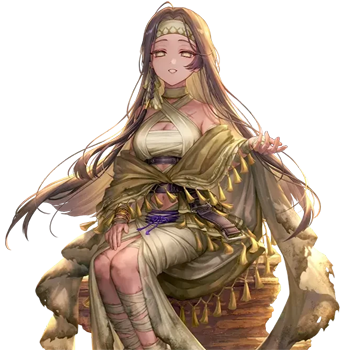
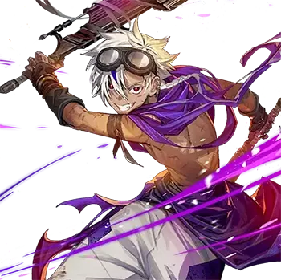
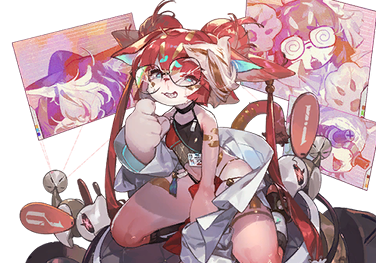

# 安克

| 角色信息   |  |
| ----------- | ----------- |
| 名称    |安克
| 年龄   |21岁
| 职业 | 拾荒者
| 对应曲   | MegiddØ
| 对应版本 |Chunithm Verse

## EPISODE 1 无止境的战斗

安克和威廉从沙漠世界误入了黑暗世界。

两人在不同的地方醒来，却像扑火的飞蛾一般，在某个城市中重逢。

幻想都市，NEON NEBULA。

那里是一座都市的灯光与喧闹的人群永不会消失的城市。

 

两人拥有相同的面容却各具不同的能力，为了一个少女，他们卷入了与NEON NEBULA居民的激烈争斗。

相对于拥有能扭曲任何事物的凶恶异能的安克，威廉的异能仅仅是看见不可见之物。

然而，威廉的这种能力对安克的力量产生了巨大作用。

战斗的结果是安克的败北。围绕少女的争斗结束，NEON NEBULA似乎恢复了平静——本应如此。

 

威廉打算向安克询问迷失在这个世界的原因。然而，这场对话却被一位对安克力量感兴趣的兽人研究员拉维娜妨碍，两人被一起带往了某个未知之地。

 

战斗进入了一个新的阶段。

别说NEON NEBULA的居民，就连这起事件的当事人也未曾料到，这件事情，最后会发展成将整个都市都卷入的巨大混乱。

## EPISODE 2 纠缠的细线

安克和威廉被拉维娜抓住之后，带到研究室的第一天。

二人在身体被捆绑起来的情况下，被提取了血液、皮肤组织、细胞等样本。

漫长的样本采集结束后，他们被带到一个摆满空荡荡检查台的房间，就这样转移到了硬邦邦的床上。

威廉看着职员离去的背影，松了一口气。

 

“终于结束了啊……”

 

话音刚落，房间的光线变得昏暗起来。

 

“老实说，我还以为会遭遇更糟糕的事，感觉有点意外。”

 

威廉就此意识到，自己之前对于科学研究者的偏见似乎太重了点。

电影和游戏里的研究者，无一例外都是疯狂的科学家。

或许，这种印象的形成，也受到自己那同样属于疯狂科学家的父亲的影响。

 

“说不定被这么调查完之后，他们会放我们回去呢——”

“嘁，你一个人要叽里呱啦说到什么时候。快把你的臭嘴闭上。”

 

打断威廉的是躺在旁边的安克。他的异能很凶恶，因此被束缚得比威廉更严实，眼睛上还蒙着用来封锁他的异能的布条。

如果没有捆绑起来，他现在应该对威廉拳脚相向了吧。

 

“我也没办法啊，毕竟现在可没事干。”

“那就闭上你的嘴巴好好想想我们该怎么逃出去，你的那个嘴巴真他妈的烦人。”

 

对于这样近乎无理取闹的说辞，威廉有点气馁。

在这里起争执只会让自己的身体更加疲惫。

威廉在昏暗的视野中分析周围的环境。

这里感觉凉飕飕的。

湿度有点低，但是睡觉应该没问题。但只有身体内部感受到的异物感，似乎怎么也习惯不了。

虽然没法确认，但是他感觉得到，身体的各个部位都连着奇怪的管子。

他们是从异世界来的人类，换句话说，是珍贵的实验样本。他们的身体、体液、排泄物，或许都能对某项研究有所帮助。

威廉也明白科学研究就是这样的，但一旦自己成为被研究的对象，心情就变得复杂起来。

威廉想起检查前被工作人员扒掉衣服的场景，又觉得有点羞耻。

 

“简直就是……马戏团的小丑一样……”

 

摇摇头想驱散一下负面情绪，威廉开始思考怎么从这里逃走。

 

“如果这是电影的话，这周围应该都会有可以利用来逃跑的道具。

 

可惜，威廉并不是演金蝉脱壳的那个知名演员，他没在周围找到什么有用的东西。

这种无能为力的状况，对于像威廉这样容易被好奇心驱使的人来说，难受极了。

于是，他的注意力自然转向了旁边的安克。

 

“呐，安克。同位体是什么？”

“……啊？为啥要告诉你？再说了，我们有这么熟吗？刚刚不是说了让你闭嘴？”

 

安克虽然嘴上凶狠，但是现在被捆绑着无法动弹，还蒙着眼睛，初次对峙时的威压感早已荡然无存。

并且，因为和艾莉尼一起打败了安克，威廉甚至觉得自己已经克服了对他的恐惧。

 

“原来如此。因为你也什么都不知道啊。”

“哈？同位体什么的，不就是另一个世界的自己吗？还有什么可说的？”

“真的就这么简单？”

“啊……你这家伙！竟敢套我话！？”

“什么套话，我可不是这个意思。我只是想确认你是不是真的什么都不知道。”

“哈，你这个满嘴狗屁的家伙！”

 

尽管安克说了这么冲的话，但威廉也没有退缩，继续说下去。

 

“因为我不想在什么都不知道的情况下就被杀死。而且，如果我们了解彼此的情况，也许就不会发生那种规模的战斗了。”

“了解了情况，你就会把那女人乖乖交出来？”

“这不是一回事。还有，她不是‘那女人’，她叫艾莉尼。”

“嘁，个斤斤计较的二逼。”

 

虽然安克依旧语气刻薄，但至少有了回应。

威廉觉得，这或许是改善两人关系的机会。

如果能劝诱的动，或许能让安克放弃带走艾莉尼的念头，也能避免更多人因他的力量受伤。

威廉想要抓住这一线希望的线索。

 

有没有什么共同点呢？

思考片刻后，威廉想到了父母。

出身和成长环境都不同的他们，但如果自打生下来就长着完全一样的脸的话，他们的父母很可能也是相同的。

 

“你就当是我的自言自语吧。”

 

威廉祈祷着安克会对这个感兴趣，然后平淡地讲述起自己的父母和成长经历。

 

“……你这家伙真是天真的可以。”

 

安克闭着眼睛，敷衍地听着威廉的话，却意识到自从在这个世界醒来后，他几乎没好好休息过。

或许是因为意识到了这点，安克的意识逐渐陷入深深的睡眠——。

## EPISODE 3 追忆——无名的感情

韦斯特兰德。

那里是一望无际的沙漠，不毛之地。

这个世界因空中悬浮的三轮月亮而饱受剧烈的气候变化和异常天气的摧残。

强烈的日照加速着自然淘汰，巨大的沙尘暴和扰乱重力的特殊力场吞噬城市与村落，无情地筛选着幸存的人们。

在这种情况下，一直呆在一个地方是不可能的。

 

生活在韦斯特兰德的人们必定会不断迁徙寻找住处，为了生存而互相争斗。

在这个世界，暴力才是最具分量的法则。

为了生存而磨砺能够威胁他人的技艺，所有人都逐渐趋向于这个力量至上的世界。

渐渐地，利益一致的人们开始组成共同体。

小型共同体吞并其他共同体，逐渐成长为更大的群体。

故乡就在这个韦斯特兰德的安克，便是在如此残酷的世界中存活下来的一员。

 

安克自幼与父母失散，从那天起便独自生活。

他早早就明白了这个世界的规则，为了生存不择手段。

欺骗、偷盗，有时甚至会杀人。

近十年的这种生活，让安克逐渐接纳了与自己境遇相似的孩子们，组建了自己的共同体。

 

然而，他的伙伴们既没有安克那般出众的力量，也缺乏高超的技艺，只能靠偷窃维生。

偷窃这种行为看似很简单。

只要偷偷伸手抓住东西逃走就行了。

但要靠没有技术的偷窃，现实并不乐观——。

 

看着因为杀鸡儆猴而被高高吊起来的同伴的尸体，安克心里想着。

 

“这样的日子不能再继续了。想要安心迎接明天，这样下去是不行的。”

 

不管自己拥有多么超强的战斗力，一天能赚多少都是有限的。并且如果自己失手，同伴们必定也会成为强者泄愤的工具。

无论如何，他都想避免这种结局。

 

韦斯特兰德的夜晚非常明亮。

在这片从未完全陷入黑暗的土地上，能遮挡月光的地方尤为珍贵。

安克的藏身之处，就在一个离地面稍微高一点的洞穴里。

简直就是天然的要塞。

虽然难以攀登，但陡峭的岩壁不易引人注目，只要保持安静，就不会被沙漠的支配者沙虫发现。

安克从伙伴们都熟睡之后的洞穴里走出来，思考着最近的传言。

 

“移动都市……说不定能在那里改变他们的命运。”

 

这附近好像有可以开采资源的地方，一个大约500人左右的大型共同体会赶来这里。

据说那个共同体与那些带着家畜移动的普通共同体不同，他们依靠冶炼、锻造、制造枪械弹药并出售来维生。

安克打算潜入其中，学习他们的技术。

如果能在移动都市采掘结束之前学会技术，孩子们或许就能告别与死亡相伴的日子。

这比继续过着危险的生活，是个更有希望的赌注。

然而，安克却有一个始终无法下定决心的理由。

 

“如果我不在这里，那个家伙能活得下去吗？”

“——”

“！？”

 

察觉到身后的动静，安克回头一看，有个坐在岩石上的少女。

“希尔德，你醒了？”

“嗯。”

 

希尔德轻轻点了点头，月光照在了她被太阳晒黑的身体上。

在及腰长的黑发缝隙之间露出的皮肤之上，可以看到许多触目惊心的伤痕。

其中，脖子和脚踝处的伤口尤为惨烈。

她“永远”都看不见那伤及骨髓的伤痕，或许是不幸中的万幸。

突然，希尔德用手指在脚下的岩石上划动。

 

“我没问题的。”

“你都听见了？”

 

希尔德略带歉意地露出笨拙的微笑。

 

“我的耳朵，比大家的都要灵。”

“被你听到了啊……是这样的，我在想怎么让大家能正经吃饭的方法。”

“我很赞成哦。而且，多亏了安克一直在努力，我才能一直活着，大家也一定会帮助我的。”

“但是，我……”

 

安克迟迟不愿离开的最大原因，就是希尔德。

她曾被她的拥有者**剥夺了声音、视觉，以及双腿的自由**。

他选择这里作为藏身处，正是为了让她免受更多痛苦。

 

“你是不是觉得，没有你我就活不下去了？”

“怎……怎么可能。”

“安克，你真的不会说谎呢。”

“呜……”

 

神奇的是，希尔德总能看穿安克的谎言。她说，安克撒谎时声音会变得很僵硬。

她的天赋不仅限于此。

她能从脚步声辨认来人，甚至对于感知空间的能力精准地令人怀疑她是否真的看不见。

被希尔德点破之后，安克摆出一副投降的态度，双手抱着头靠在岩石上。

 

“……没错。如果我走了，你遇到危险时我没法保护你。我……不喜欢这样。”

“原来你是这么想我的。我，有点失望。”

“哈？”

 

安克感到胸口一紧，声音不自觉地拔高。

希尔德捂着嘴，像是觉得有趣地笑着。

安克意识到自己被她玩弄于股掌之间。

尽管她看不见，他却下意识转过脸，生怕被她“看到”。

衣物摩擦的细微声响，像乘胜追击般骚扰着他的耳朵。

 

“……抱歉。我这人就是这么容易被看穿。”

“我觉得这是好事。”

“哼。”

“我没事的。安克给的这条命，我很珍惜。”

 

第一次相遇时，与她交流极为困难，不知道花了多长的时间才让她明白自己并不是她的敌人。

那时候的她随时自杀也不奇怪。

虽然安克这么想着，但出乎意料的是，她逐渐向安克敞开了心扉。

如今，他们甚至能进行简单的对话。

希尔德那纤弱的身体，承受了无数可怕的事情。

明明与自己同龄，或许稍微小一点，但是能做到如此关心他人，安克感到非常不可思议。

 

“希尔德……”

 

安克轻轻地把手伸向希尔德的脸颊——然而，他并未触碰，而是慢慢地把手放了下来。

建立共同体后一起生活了这么久，但除了救她的那天之外，安克从未触碰过她。

他害怕触碰希尔德。

她就像一朵一触碰就会坏掉纤细易碎的花。

他觉得自己这种人没有资格触碰她。

因为自己，和夺走她一切的那些人，是“同类”。

这么痛苦的感觉，有生以来还是第一次。

希尔德对狼狈的安克微笑着，用手指抚摸着岩石。

 

“谢谢你，安克。”

 

这句话，是对什么说的呢。

感受着心中萌芽的无名之情激烈地悸动，安克的手，轻轻触碰到了她刚刚书写痕迹的那块岩石之上。

## EPISODE 4 轴

“……尔德……希尔德……！”

 

威廉的研究室生活第二天，是从安克的呻吟声开始的。

 

“嗯……啊啊，我什么时候睡着了啊。”

 

威廉记得自己向安克讲了父母的事，但之后何时入睡的，记忆却模糊不清。

瞥了一眼安克。他似乎正被噩梦侵扰，痛苦地念着一个名字。

 

“希尔德……咕……住手……快住——”

 

然后，安克的身体想被弹了一下猛地一震，被拘束具强行压制的身体连同床铺一起剧烈晃动——安克醒了。

 

“早上好啊，安克。”

 

安克扭过头，露出了不开心的表情。

 

“真是糟糕透了，本来就睡不好，早上醒来第一个听见的居然是你这个家伙消极的声音。”

“什么叫消极的声音？”

“好了，赶紧闭上你的嘴。”

 

恢复体力之后，安克的臭骂也随之而来。

不过，威廉在听了他超过半天的嘴臭后，隐约觉得自己似乎有些习惯了。

趁着没啥感觉，他决定问问安克在梦话中提到的那个人是谁。

 

“你刚刚睡得很不安稳，是做了噩梦吗？”

“肯定会做噩梦吧！毕竟一个长得跟我一样的家伙一直叽里呱啦不停地和我说话！”

“哈哈，我很同情你。”

“说真的，你这家伙很让我火大……”

 

趁着安克无奈沉默的空隙，威廉决定进一步试探。

 

“那，你做梦时一直嘀咕的那个叫希尔德的孩子是谁——”

“你这家伙！不许提那个名字！”

 

怒吼声在房间里回荡。

这是直到现在为止安克反应最强烈的一次。

“希尔德”这个名字究竟唤起了他的深情，还是激起了憎恨，威廉尚无法判断。

但无论如何，这种强烈的反应意味着，威廉首次触及了构成安克这个谜团的“轴”。

 

“抱歉，好像问了点不该问的。”

“哈，那就给我闭嘴，你这一直说个不停的二逼。你以为没父母我就能理解你的感受？我最讨厌你这种故作关心接近我的人了！”

“……嗯？”

“怎么？有屁快放！”

“不，我不是那个意思——”

 

威廉正想说些什么，房间的门突然开了。

 

“睡得好吗喵~？人类种。”

“拉维娜！快给我解开这些绳子！不然我现在就扭断你的身体！”

“喵啊啊……”

 

拉维娜像画笔般的尾巴猛地立起，像是吓得整个人都僵住了一样。

她之前一定被安克狠狠教训过吧。

但转眼间，她那张因恐惧而僵硬的脸慢慢地放松了下来——随即放声大笑。

 

“喵哈哈！！有本事你就试试看喵！在这种状态下，你什么也做不了喵！”

 

正如威廉用异能洞悉了安克异能的发动步骤，拉维娜似乎也以某种方式掌握了这些信息。

她快步走到安克身边，将湿润的鼻尖凑到他耳边。

 

“我就在这里喵。你赶紧来扭断我试试看喵。”

“你这个……”

“喵哈哈，活该喵！不过，我受的屈辱可不是这点就能抵消的。喂，把这家伙带走喵！”

 

在拉维娜的指示下，几名男女解开固定安克脚部的拘束锁，将他转移到检查台上。

 

“别随便碰我！”

“真是的，吵死了喵……”

 

拉维娜说着，拿起一支预备好的镇静剂注射到安克体内。

刚才的气势荡然无存，完全安静下来的安克好像被带到了别的地方。

门关上后，房间里只剩威廉和拉维娜。

 

“你打算对他做什么？”

“你没必要知道喵……不过咱现在心情不错。待会儿你也会接受同样的实验，就特别告诉你喵。”

 

拉维娜口中的实验，是试图强制激发安克的异能。

方法是将他的手臂固定在目标方向，强行撑开他的眼睛，向特定部位发送电信号。

如果异能与肌肉联动，或许通过调节电信号强弱就能触发。

如果收到脑波的影响，则可通过识别并模拟脑波来激活。

逐一排除各种可能性，最终剩下的方法将成为破解异能的线索。

 

“难道，你想要‘再现’那种力量吗？”

“能告诉你的就只有这么多了喵。”

 

拉维娜单方面结束了对话，离开了房间。

房间里陷入了一片寂静。

威廉脑海中浮现出与安克的对话。

 

“说起来……他其实有认真听我说话啊。”

* * *

结果，威廉今天的检查只做了重新采集样本、测定脑电波和运动能力等比较简单的检测。

他早早的就被送回了房间，安克则数小时之后才回来——

 

“你没事吧？”

“……你好吵。”

 

电信号实验似乎也测试了安克的身体强度。

他没有了平时的那股气势，声音也虚弱了不少。

虽然曾经与安克展开过你死我活的战斗，但是看到他这幅模样，威廉还是有些于心不忍。

 

（安克的话，也有人会关心他吗？）

 

人类是需要与他人建立联系的生物。

无论是父母、朋友还是恋人。

即使不是很亲密的关系，但只要活着，就会产生联系。

安克生活的那个世界，应该也是如此。

 

（如果真有这样的人的话，是那个叫做希尔德的人的话就好了）

## EPISODE 5 回忆——人类狩猎者

移动都市是真实存在的。

虽然安克为此踏上了旅程，但内心始终半信半疑。

直到他亲眼目睹那东西的真实面目。

那是远远超过安克想象的东西。

超过自身高度的巨大车轮。似乎能承受沙虫撞击的厚重装甲。

冒着烟缓慢前进的身影，甚至会让人误以为那是否是某种巨大生物。

 

“居然真有这种东西……”

 

安克有了一种自己所处的世界是如此狭小的感觉，同时确信，若能加入这里，希尔德他们或许能迎来安稳的未来。

他潜入移动都市预定停泊的地点，混进行商人中，成功进入城市。

并且，成功地向在工房工作的人们推销自己的安克，成为了一名见习的工作者。

* * *

在工房内与其他技术人员一起工作的日子已经过了10天。

安克凭借与生俱来的心灵手巧，以惊人的速度学习着技术，同时逐渐了解了移动都市的实情。

到了移动都市他才知道，移动都市只是具备最低限度的生活基础设施，并非所有事情都能在这一个都市内完成。

每个都市都有各自的职能，既有负责资源回收与加工的都市，也有专门在都市内生产粮食的都市。

这座都市属于前者。

通过与其他移动都市或行商聚集的共同体交易，他们获取物资，继续向新地点进发。

正是这种循环，移动都市才能在韦斯特兰德持续存在。

 

这里与安克曾经生活的世界相差甚远。

深受震撼的安克，梦想着有朝一日大家也能在移动都市上生活，废寝忘食地刻苦学习技术。

 

在一个已完全适应都市氛围的夜晚。

安克注意到都市内部的气氛突然骚动起来。

 

“怎么回事？这个时候应该没有转移到下一个采掘地吧，怎么吵吵嚷嚷的……”

 

他向身旁一个瘦弱的男人搭话。

 

“呐，为什么今天大家这么兴奋的样子啊？”

“你居然不知道吗？今天啊，可是人类狩猎者久违地来到这里的日子啊！”好久没来过的人类狩猎者

“人类狩猎者？”

“嗯~连这个都不知道的吗？听好了，所谓人类狩猎者啊——”

 

专门狩猎人类的移动都市——曼伊特，正如其名，是在各地负责狩猎人类的都市。

被“回收”的人类会作为“资源”，被卖给行商人作为奴隶，卖不出去的则沦为都市居民发泄情绪的“展览品”。

换句话说，一旦被他们捕获，人就变成了商品。

 

“嘿嘿，你这小子挺走运啊。他们可不知道什么时候才会来这里，别老是磨道具了，快去看看吧，去晚了可就看不到了！”

 

作为同事的男人快步走向广场，安克却愣在了原地。

 

“展览品……？难道，希尔德当初也是被这样对待的——”

 

安克与希尔德的关系，始于某一次安克在一个共同体偷窃的时候。

当时，打算将她喂给沙虫的行商人临死前也提到了“展览品”。

而这一切的元凶，如今就在这里。

内心的怒火驱使安克冲向广场。

 

“来吧！你们这些全身油污和铁砂的混蛋们！准备好了吗？让我们听听你们发自内心的呐喊！！”

 

——呜哦哦哦哦哦哦哦哦哦哦哦哦哦哦！

 

从环绕着广场的建筑物周围，发出了狂热的嚎叫声。

建筑物的墙壁上有可以俯瞰广场的通道，里三层外三层紧紧包裹。

通道和楼梯平台早已挤满了迫不及待等待好戏开场的男人们。

安克推开人群，从二楼通道往外看，目光锁定广场中央的舞台。

台上站着一群身披黑斗篷的人，以及衣衫褴褛的男女。

那些黑衣人，想必就是人类狩猎者的成员吧。

 

“听好了！现在站在这里的你们可真是走了狗屎运啊！混蛋们！！”

 

鞭子抽响的声音回荡在舞台上。

舞台中央的男女因恐惧而颤抖，面对观众的怒吼几乎吓得要死。

 

“现在，介绍今夜即将上演的故事的演员们！”

 

像是领导的人物逐一指向了这些准备上演一幕幕惨剧的“演员”们。

有年轻的夫妇、因饥饿所困的孤儿，而此次的重头戏，是一位据说曾经当过仆从的少女。

 

“……哈？”

“这个女人，虽然身体上被印上了各种仆从的印记，但却幸运地活了下来。她是个被幸运女神眷顾的人！如果吃了这女人的肉，一定会有好运降临吧！”

 

安克无法相信眼前的景象。

因为，她本该在离危险最远的地方才对。
 

“希……希尔德……”

 

但现实并非如此。

她已被人类狩猎者捕获，此刻正在安克的眼前。
 

“““决斗！决斗！”””

“““杀了他！杀了他！”””

 

观众们的热情不断高涨起来。

与此相反，安克的心却反之冷却了下来。

下一瞬间，安克跳向舞台。

 

“希尔德！”

“…………！”
 

正当这对年轻夫妇准备开始厮杀的刹那，安克的登场让广场一片哗然。

 

“希尔德就由我带走了！我不会交给任何人！”

 

——啪！

 

骚动的声音消失了。

挥动鞭子的黑衣男人吸引了众人的目光，大声叫嚷道。

 

“哦哦，哦哦！这是怎么回事！竟然！这个移动都市的居民居然与一个前仆从有如此亲密的关系！！啊啊，这是何等的悲剧！这就是幸运女神的杰作吗！”

 

男人把这个不速之客也当作提高希尔德作为商品价值的要素。

这一刻，移动都市的所有人都成了安克的敌人。
 

“……你们这帮家伙，我要把你们全给宰了！！！”

## EPISODE 6 解开的线

研究室生活第四天。

结束电信号实验的威廉回到房间时，发现安克又被噩梦缠绕。

 

“安克，你这次比之前还严重，真的没事吗？”

“……别跟我套近乎，我们是敌人。而且，没理由让你叫我的名字。”

 

一起生活了四天，安克的态度似乎缓和了一些。

大概是在威廉反复尝试搭话的过程中，他意识到再怎么拒绝都没用吧。

这种纠缠不休，结果反而稍稍瓦解了始终筑着心墙的安克的戒备。

 

“……从什么时候开始的？”

 

从来不主动说话的安克，居然头一次提问。

 

“诶！？”

“你那沙鼠一样的叫声算什么？”

“不，谁能想到你会主动跟我说话啊？还有，沙鼠的叫声是什么东西？”

 

安克没有理会威廉的吐槽，继续说道。

 

“我问你，你那该死的力量是什么时候开始出现的？”

 

或许是回忆起在高楼战斗时候的场景，安克的语气有些僵硬。

 

“什么时候……小时候突然就发现自己能看见了。”

“什么鬼？能不能说点有用的？”

“那你呢，安克？”

“哈？我为什么要告诉你？”

“你这……”

 

臭安克！威廉差点就把这句话脱口而出，然而，他还是把到嘴边上的话又咽了回去。

正如他对安克所说，他并不清楚自己何时察觉到能看见不可见之物的异能。

如果说是小时候注意到远处窥视父亲的怪人存在时，那也不过是模糊的童年回忆，没有证据可言。

 

“毕竟，小时候的事情现在不怎么记得很正常吧？”

“那只是因为你是个肤浅的小鬼吧。”

 

威廉以为彼此距离拉近了些，却发现不过是自己的误会。

威廉保持平常心回答安克。

 

“既然叫同异体，那除了脸以外应该还有其他共同点吧。我也想知道，这能力从什么时候开始，又是从哪里来的。”

 

拉维娜也在用各种方法研究他们的异能，但至今毫无进展。

如果一直检查不出个所以然来的话，她一定会说出“把你们的脑子互相交换吧喵！”之类的话，像电影里出现的疯狂科学家一样做出些非人道的事情。

到那个时候，他们的生命就有危险了。

 

“不对，应该是非‘猫’道吧？”

“你又在叽叽喳喳说什么呢？”

“你才是，刚才就在干什么啊？”

 

安克一直在尝试扭动被绑起来的手臂。

 

“从这里逃出去。”

“诶？”

 

明明全身都被捆绑起来，还被蒙上了眼睛。

这种情况下，他到底还能做什么呢？

 

“你这种状态能干什么？”

“我一直在想，我的能力，是不是不亲眼看到想扭曲的东西就真的无法发动呢？”

 

这个疑问，自从安克败给威廉和艾莉妮之时便出现了，经过拉维娜的电信号实验后他更加意识到了这一点。

实验中，安克脑海中浮现的是在韦斯特兰德与希尔德共度的记忆。

她虽然眼睛看不见，但却在精神世界里完美重现了如同真实一般的空间，完美掌控着现实的位置。

 

“如果不用眼睛，只在脑海中想象形状就能扭曲目标呢？”

“难道说……”

 

——吱，一声闷响。

 

威廉猛地看向安克的手臂。

只见套在他手腕上的拘束具，如同从内部翻开来一样扭曲变形了。

 

“终于可以告别这种该死的情况了。”

 

安克扬起嘴角笑了笑，取下眼罩继续破坏剩下的拘束道具。

他拔掉身上连接的管子，换上旁边的衣服，走向威廉。

 

“……”

 

在威廉紧张的眼神注视下，安克朝他伸出手臂。

只要安克心里有这个意愿，威廉就会和床铺一起被扭曲得不成人形。

 

“是杀了你还是放了你，全看我自己的心情…………哈哈，瞧瞧你这副德行啊，威廉？”

“……”

 

威廉毫无胆怯地直直瞪着安克。

然而，无论过了多久，安克都没有发动能力。

 

“安克，你……”

“别想太多了，你这乐观的蠢货。我不是要放过你。我只是想看看你没能保护那个女人，陷入绝望的样子罢了。”

 

“你就好好体会一下自己的无能为力吧。”丢下这句话，安克离开了房间。

被捆绑起来的威廉毫无办法——但这种情况又以意外的形式告终。

安克离开后过了一会儿，整栋建筑都变得一片慌乱。

 

“有入侵者！有入侵者！全体工作人员立即撤离！重复，全体工作人员——”

 

警报声响彻大楼。

通往外面的门打开，威廉以为是安克返回，朝那边看去。

然而，站在门口的是意想不到的几个人——身穿不合尺寸的笨重防护服的艾莉尼和林内，以及换了新身体的吉吉。

 

“大家……你们怎么在这！？”

“威廉先生？你怎么会！？”

 

艾莉尼一脸困惑。

她的反应就像是在这里遇到威廉是“意料之外”的事情。

时间仿佛在这一刻凝固，通道里持续传来的警报声，仿佛预示着即将发生的事件，久久回荡。

## EPISODE 7 NEON NEBULA的怪物

“——我、我什么都不知道！求求你，饶我一命吧……！”

 

安克随手抓住一名女工作人员，逼问出拉维娜的房间位置。突然，他感受到一阵震耳欲聋的震动，察觉到大楼内空气的变化。

 

“……怎么了？”

“有入侵者！有入侵者！全体工作人员立即撤离！重复，全体工作人员——”

 

就在这时，脚下传来剧烈的震动。

安克瞥向窗外，微弱的霓虹灯光透进来。他拽着女工作人员的衣领，将她拖到窗边，脸贴上玻璃。

 

“喂，到底是怎么回事？”

“我……我、我真的什么都不知道！我只是被指示去做实验而已——其实我并不想做那种事！”

 

女工作人员吓得话没说完就哭倒在地。

 

“在你配合他们做实验的时候你就跟他们是一类人了，混蛋！听着，我只想知道拉维娜在哪。说了我立刻放了你。”

 

在安克用异能将旁边的窗户掰了个粉碎之后，女人吓得赶紧坦白了一切。

——拉维娜在走廊尽头，两个通道交叉处右转的房间。

 

“嘁，浪费我时间。”

 

安克说完，夺过女人的工作证。有了这个，似乎就能自由进出各个区域。

 

“饶，饶了我吧……”

“我才没空理你，快滚。”

“谢，谢谢……！”

 

安克没有把女人放在心上，继续前行。

视野一角隐约可见的房间里，残留着某种实验的痕迹。

这里的工作人员似乎都撤离了，只留下一些奇怪的东西在那里。

形状类似于Ω的舱内，蠕动着难以名状的、类似人形的团块。

 

“真是的，‘那边’和‘这边’做的事情看来都大差不差啊。”

 

突然，安克的脑海中，曾经的记忆复苏了。

 

“你们这帮家伙，我要把你们全给宰了！！！”

 

自从被关到这里，脑海里总是会播放一些不愿想起的回忆。

本来被关进来就很不爽了，威廉还知道了希尔德的名字，这对安克来说更加无法容忍。

 

“这一切追根究底都是拉维娜的错，只有那个臭女人绝对——”

话未说完，安克本能地侧身一闪。

紧接着，有什么东西从安克身边飞了过去——他刚才站立的地方发出巨响，碎裂开来。

 

“你这家伙~~！你是怎么逃出来的喵！”

“哟，臭女人。我来找你玩了。”

 

安克注视着前方，手持奇形怪状的枪，身后跟着数架小型无人机的女兽人——拉维娜·基顿站在那里。

 

“被你拿走的我的装备，还有通过玩弄我的身体得到的东西，我都要拿走。”

“开什么——”

“扭曲吧。”

 

——啪。

 

先发制人的安克，发出了干涩的声音。

安克的异能·<ruby>歪曲<rp>（</rp><rt>Färsezung</rt><rp>）</rp></ruby>，本该直接对着拉维娜的身体而去的——然而下一刻，拉维娜身后的窗户却被扭了个粉碎。

 

“什么？”

“喵哈哈哈！以为我只是在反复地做着这些实验吗喵！我已经强行扰乱了你身体释放的微粒子流喵！"

 

一群小型无人机聚集在露出胜利的浮夸笑容的拉维娜面前。这些无人机释放出了光一样的伞，扭曲了安克异能的方向。

 

”你还是挺能干的嘛。“

“想夸就多夸几句喵！我可是IDC引以为傲的主任研究员！你的力量我已经看透了喵！区区人类种什么的——喵呜！？”

 

一块瓦砾碎片砸中了拉维娜的头。

 

“呜哇！！”

 

猝不及防的拉维娜摔倒在地。

她自以为完美应对了安克的异能，但在这瞬间转换的，无比原始的战斗方式面前，轻易败下阵来。

 

“居然在趁着咱说话的时候偷袭，不讲武德喵……”

“我怎么会输给一个在战场的悠闲说半天废话的家伙呢？”

 

安克踢开等待主人指示的无人机，迅速接近拉维娜，夺过她所持的音波炮对准她。

 

“我本来想现在就把你的身体给扭断的，但是没想到你能想出对策，脑瓜子还挺有用的。高兴吧，从今天开始你就要给我干活了，明白吗？”

“想得美喵！咱只效忠艾比斯大人！那个大人的伟大，可是你这种人渣比不过的喵！”

“那，我就去干掉他。”

 

安克说着，伸手去抓趴在地上反抗的拉维娜的脖子。

 

“嗯？”

 

突然，安克注意到她身边有什么东西在发光。

捡起一看，是与之前从女工作人员那抢来的一样的员工证。透明的长方形壳体内，映着一张脸。

厚到看不见眼睛的眼镜。

内卷的肩膀，前倾的身体。

以及夸张得没打理过的头发——颜色与眼前趴着的这家伙一模一样。

 

“‘这’是你以前的样子吧。”

 

如果威廉在这里的话，一定会这么说她吧。在威廉的世界里，这种人被称为——Nerd。

安克拖着拉维娜来到她的研究室，夺回了自己的装备。

终端看起来还在故障状态，这种情况下贸然展开传送门非常危险。

 

“拉维娜，马上修好这——”

突然，整个建筑物剧烈地摇晃起来。

激烈的震动，让研究室里散乱的各类杂物也跟着摇晃了起来——突然，一个放在架子上的老旧机器掉了下来，往拉维娜头上砸了过去。

 

“噫……！？”

 

反应迟钝的拉维娜吓得连躲开都忘了——

——啪！

逼近拉维娜的机器在空中发出刺耳的声响，偏离了坠落的轨道，掉到了地板上。

 

“你……你救了我……”

 

大步走向拉维娜身旁的安克没有回答，而是反问道。

 

“喂，这剧烈的摇晃是怎么回事！”

“我，我完全不知道喵！从没遇到过这种震动……”

“嘁……！”

 

安克冲向走廊查看外面的情况。

空无一人的走廊里，只有通知避难的广播和类似地鸣的震动断断续续地重复着，没有任何变化。

 

“……那是什么？”

 

望向窗外，安克感到有东西在蠕动，投去疑惑的目光。

定睛一看，高耸入云的楼宇间，正有一个神秘物体从高得看不见顶点的建筑物之间穿行。

 

“哈……？”

 

在NEON NEBULA，这里的距离感难以捉摸。

但安克清楚自己与大楼的距离不近。

尽管如此，安克还是确信那东西在楼宇之间顺畅移动着。

在霓虹灯光的映照下，安克所看到的，是身体各个部位发出蓝色和紫色光芒的巨大怪物。

## EPISODE 8 回忆——天空与风与墓碑

——对于安克来说，这是决定他以后命运的最初始的记忆。

 

战斗结束后，安克回到了藏身处。

那里已不再有昔日的热闹景象。眼前只有试图抵抗人类狩猎者而被残忍杀害的，孩子们的尸体，以及泼洒到墙上，到天花板上的血痕。

 

——滴答，滴答。

在洞穴之中，安克身上尚未干透的血液滴落下来。那血液仿佛在代他诉说心情般，只是漠然地晕开一片殷红。

 

“对不起啊，花了太多时间，没能好好安葬你们……”

 

离开这个藏身处前往移动都市时，安克才15岁，而现在他也即将迎来17岁。

时间流逝，这里仍残留着当年的痕迹。

墙上比试身高的划痕、某人试图藏宝而挖到一半放弃的地面凹陷、为让希尔德安心入睡而精心调整长度的床。

只要闭上眼，在此度过的记忆便会复苏。

只是，这里——

 

“尸臭的气味还真呛啊……”

 

换个地方吧。

安克小声向着并非任何人的存在说着。他走出藏身之处，向岩场的顶上走去。

一边怀念地看着用废铁制成的入侵警报装置，一边默默地攀登。

 

终于，他来到一处视野开阔之地。

一望无际的荒野与沙漠、群青色的天空尽收眼底的这个地方，非常适合用来祭奠她。

 

安克找到一块合适的岩石，伸出手臂，调动体内的力量。

反复几次之后，岩石变成了伸向天空的石柱。

安克像是进行最后加工般，拔出腰间的刀，将刀刃刺入石柱，刻下了代表“希尔德”的名字。

刻完名字，恰似算准时机般，身后升起滚滚红黑浓烟。

凝视着被风吹成细长轨迹的烟雾，安克轻声说道。

 

“我给你报仇了，希尔德。”

 

那是安克将盘踞在这一带的所有移动都市尽数召集并付之一炬后，燃起的悼念之火。

 

“——接下来要做什么呢。”

 

反正自己一无所有。

为她流下的眼泪已经干涸，复仇的心也像沙漠一样干涸。

对这样的自己而言，这世界太过广阔，活下去毫无意义。

安葬完洞穴中的尸体后，就追随着他们而去吧。

就在他茫然地思考着这些的时候。

 

——咚。

 

某人落在附近的岩场上。

 

“你这家伙，是什么人！”

 

背对太阳站着的那个人的影子很怪异。

外表虽是和安克一样的人类，但头顶的那个宽檐三角帽，以及与小个子体格不相称的大手杖，安克从未见过这样的人。

 

“能够实现你愿望的人。”

眼前的任务，似乎是一名女性的样子。

 

“愿望？哈，那不如就用你的身体来给我‘解解闷’吧。你打扰了我的祭奠，可别以为跑得掉啊。”

“呵呵……真是这样吗？”

“有什么好笑的！”

“你根本就没有这种想法，又何必虚张声势？真是个奇怪的人。”

 

女子掩嘴轻笑。

 

“你又了解我什么？”

“如果是你真心所希望的事情，我自然是非常清楚。”

“所以到底是什么愿望？！”

“何必让我直接点出来？问问你自己的心吧。”

 

无需她多言，安克心知肚明。

自从那次分别以来，安克的愿望一次也没有改变过。

安克脸色一变，女人用劝诫般的温柔声音低语道。

 

“坦率的心也是一种美德。”

“少废话，反正你也会提什么要求的吧？”

“嗯，正是如此，你也很懂嘛。”

“在这儿这是基本规则。”

“确实如此，实现愿望需要代价。那么，就先请收下这个东西吧。”

 

女子朝安克挥动法杖。

突然，安克的眼前闪过一瞬微光，那里出现一个漂浮的陌生物件。

那是一种小型机器，长方形的板子上浮现出了从未见过的符号。

安克正觉新奇地打量着，女子便示意他将其戴在手腕上。

按照那女人说的将手腕靠近那机械，它便严丝合缝地戴了上去，仿佛从一开始就为安克的手臂调整好了一般。

 

“我要你去某个地方。我希望你能在那里迎接某个人。”

“哈？你到底在说什么。这跟我有什么关系？”

“若是如此，你的愿望就能实现了吧。”

 

女人不再多说什么。

 

“……真的能实现吧？”

 

女人以歌唱般的流畅语气回答。

 

“是的。只要我们的契约成立。”

“那就这样。我的愿望早就确定了。”

 

——让希尔德复活。

从这一刻起，安克就此沦为实现她愿望的命运的奴隶。

