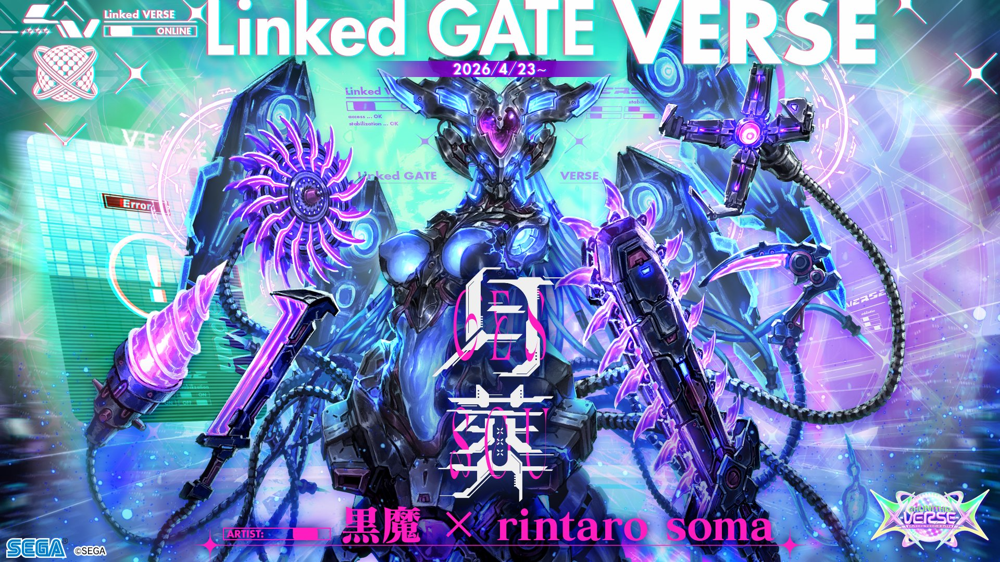

# 星间轨道航行船·海伯里昂

| 角色信息   |  |
| ----------- | ----------- |
| 名称    |星间轨道航行船·海伯里昂
| 年龄   |制造年份不明
| 职业 | 居住区域扩张型星间轨道航行船
| 对应曲   | 月葬
| 对应版本 |Chunithm X-Verse-X

## Episode 1 伟大的贡献者

“嗨，大家好！从摇篮到坟墓，欢迎来到让您的人生如玫瑰般灿烂的‘无限购物’频道！今天我们要为各位介绍目前最新最热的产品哦！！”

“嗨，迪恩！你要给我们介绍什么好东西呢？”    

“嗨，米歇尔，你今天也依旧光彩照人呢！那么，现在我要展示给大家看的就是这个——快看！”

“哇！上面挂满了琳琅满目的小玩意，真漂亮！这到底是用来做什么的呀？”

“很让人兴奋吧？这可是那个‘利布拉动力（Libra Dynamics）’推出的最新防盗护身工具哦！”

“护身工具？！”

“没错！米歇尔，你有没有过这样的经历？家里进了小偷，而你则是孤身一人的时候，到底要用什么才能把对方赶走呢？”

“哎呀，当然有想过！”

“我就知道。但是……您无需担心！米歇尔，还有屏幕前的各位！只要有了这个，就什么都不用怕了！这款自卫钥匙扣能完美解决所有问题！首先，我们要让对方失去行动能力——”

“嘿，迪恩，这个像小筒一样的东西要怎么用啊？”

“啊！别把它对着我——”

 

——噗嗤！

 

“啊！！我的眼睛，我的眼睛啊啊啊啊！！”

“好厉害！迪恩一瞬间就倒在地上打滚了？！”

“呜呜呜……不愧是米歇尔！不用我说明就能运用自如！这是一款携带方便的催泪喷雾！现在下单的话，还有数量有限的时尚设计师联名版……”

“哎呀，你竟然还有力气说话呀。那要不要再试试别的功能？”

“唏——！饶了我吧——！”

* * *

要说谁是巨型都市“利布拉”的功臣？

如果被问到这个问题，那么，她——利布拉动力创始人——**艾比斯·哈宾格**的名字，怕是无人不知无人不晓。

虽然她鲜少公开露面，但利布拉的市民们在不知不觉中，日常生活中随处都能接触到与她有关的事物。

军事、生活、研究、娱乐——其影响力渗透到了各个领域。

正因为有了她和利布拉动力的助力，利布拉才得以成为如今的巨型都市。

那么，她究竟是一个怎样的人呢？

由于很少参与市政事务，她身上笼罩着许多谜团，但其行为准则却异常简单：

那就是**对未知的热爱**。

科学与人类的进步，正是通过伟大先辈们那永无止境的探求心，才得以开辟出一个又一个新境界。

艾比斯也是承袭了这一血脉的，探索未知的人。

 

她首次成名是在二十多岁时发表的一篇论文。

尽管当时的科学界存在轻视女性论文的风气，但她的论文却成为了投向那潭死水的一枚石子，并最终促成了利布拉动力的创立。

她那怀疑既有常识、挑战未知的研究，有时甚至会触及伦理的边界。

正因如此，她遭受过许多无端的指责，但她以钢铁般的意志坚持研究，不断刷新着已知的认知。

 

艾比斯·哈宾格始终注视着明天。

其内心深处，怀揣着深沉的人类之爱与对未来的责任感。

## Episode 2 预兆

“让我去调查？”

“嗯。我认为这是最适合你的案子。”

应邀来到利布拉市政厅的市长办公室的艾比斯，从老市长手中接过了一份资料。

资料约有十页厚，封面上只写着“利布拉海姆”几个字。

艾比斯本以为这大概又是关于区划整理的咨询，便随手翻开了下一页——随即，她的手僵住了。

 

“这是……？”

 

看到艾比斯不由得皱起眉头，老市长露出了一丝玩味的笑容。

“很丑陋吧？看来就算是艾比斯，也是第一次见到这种‘东西’吧？”

 

艾比斯翻开了下一页。

 

这份似乎是匆忙赶制出来的资料中，附带了几张抓拍到异常景象的照片。

有人类的肉体与建筑的一部分融合在一起的照片；有身体部位被异样地伸长的人类；最令人惊心动魄的，是一个身体上竟然“长出了两份”头和手臂。

这些照片散发着一种难以言喻的诡异感，简直就像是技术拙劣的合成照片。

读完资料后，艾比斯饶有兴致地眯起双眼说道。

 

“这种不可思议的程度……确实足以激起我的好奇心。”

“我就知道你会这么说。坦白讲，我们也束手无策。虽然已经在利布拉海姆周围设置了路障严禁出入，但总不能一直这样维持下去。所以，我们才希望作为我等智囊的你，能去查明这次事件的原因。”

 

赢得了政商界大佬们的深厚信赖的艾比斯，偶尔也会接到他们一些无理的要求。

从廉价提供尖端技术、处理行政难以介入的麻烦事，到甚至像共进晚餐这种私人邀约，种类繁多。

而她也正是因为对这些要求从不推辞，才换回了这份稳固的信任。

在第三方看来，她或许只是个能够方便地做麻烦事的“万事屋”，但对她来说，借此机会向高层卖个人情，以后就能在政治博弈中占据有利的地位。

“意下如何，艾比斯君？”

“当然，我接下了。”

“噢，那可真是太好了！我这就向现场传达指令。”

“明白了。”

艾比斯干脆地答应后，立即组建了调查队，开始着手处理“利布拉海姆事件”。

* * *

傍晚前，艾比斯抵达了现场。看着耸立在路障后方、呈现出异样景象的天秤住宅，她的嘴角泛起一抹微不可察的弧度。

“这是……‘错位’了吗？”

艾比斯产生这种感觉并不奇怪。天秤住宅的外观看起来就像是不同色调的大楼“重叠并上下错位”了一样。外墙上随处可见裂痕，有些地方因风吹雨淋而脱漆，但这些痕迹却在楼体的接缝处不自然地中断了。

“分析小组，内部情况如何？”
“目前尚未发现明显异常。”
“有幸存者吗？”
“暂无报告。楼内那些疑似住户的人员，就目前所知已全部‘异形化’，恐怕幸存者……”
“知道了。”

艾比斯语气淡然地回应，紧接着宣布：“我也要进入内部。”

“艾、艾比斯大人？现在还不确定内部是否安全！”
“发生了如此大规模的异常，真相可能会随着时间流逝而湮灭。真到那时候，还谈什么查明原因？”
“可是，万一您出了什么意外，天秤动力的未来就……”
“虽然我无法保证时刻带来革新，但我还不至于经营无方，让员工在老板出事后立刻流落街头。”

艾比斯态度坚决，一旦她决定了，任何劝阻都无济于事。部下似乎也了解她的性子，不再阻拦，转而与楼内的先行小组取得联系。

“恭候多时了，艾比斯大人。”

在天秤住宅正门，艾比斯与待命的突入小组组长汇合。她轻轻拍了拍对方的肩膀以示慰劳，空气中传出“咚”的一声金属撞击的闷响。

为了参与调查，艾比斯已将原本的深蓝色西装换成了防护服。这套覆盖全身的防护服是她在危险地带进行实地调查时的专属装备，由突入小组使用的**强化装甲（Boosted Armor）**改良优化而成。

“调查进展到哪了？”
“马上就要开始对疑似最顶层的楼层进行调查。”
“‘疑似’是什么意思？”
“听起来可能有点奇怪，我们在调查6层时，发现了一个原本不该存在于这里的‘7层’。”
“不是机房或阁楼吗？”
“不是。机房在别处，这里也没有像阁楼那样只有单间构造的楼层。”

艾比斯脑海中浮现出刚才在大楼外看到的景象。如果那部分上下错位的区域正好对应第7层，那么组长的判断就并非无的放矢。

那么，在那突然出现的第7层里，到底“住着谁”呢？

“……不，不会吧。”
虽然否定了脑中浮现的那个荒诞念头，但她内心的好奇心早已按捺不住。

“是神圣的领域，还是人类智慧的范畴？”
想要快点确认真相。艾比斯压抑着急切的心情，开始了调查。

当艾比斯到达6层时，通道的安全确认工作刚好完成，搜救小组正准备寻找幸存者。艾比斯向前伸出手，在空中展开了一个半透明的虚拟框，上面显示着这栋公寓的住户信息。

根据情报，6层只有两名住户。
“这一层只有温斯莱特（Winsred）夫妇入住吗。”

夫妻俩的房间房门微微敞开。抱着两人尚存一线的希望，艾比斯与突入小组冲进了房间。然而，在那里等待着她们的景象，与之前遇到的所有异象都截然不同——

“这……是什么？”

艾比斯不由语塞。在她的视线尽头，横卧着一个只能用“异形”来形容的东西。
那东西拥有像青红交织的**海蛞蝓（海兔）**般半透明的软体动物上半身，却长着人类的下半身。从破烂牛仔裤的缝隙中露出的惨白皮肤，更加剧了这种异形的诡异感。

这也是天秤住宅异象的一部分吗？

就在突入小组因恐惧而退缩时，唯有艾比斯果敢地靠近，冷静地进行分析：
“根据事件发生的时间、现场状况以及下半身的骨骼判断……这极有可能是**布里吉特（Bridgette）夫人**。”

要下达准确判断，必须带回实验室详细检查。因为这个东西不仅没有能辨认身份的齿痕，甚至连人类的“残迹”都保留得太少了。

艾比斯将其定名为“非识别体”，正准备下令回收。就在这时——
非识别体的头部突然像产生裂纹一样，开始迅速崩解。

“！？”

崩解在蔓延到下半身之前停住了。除了下腹部和一部分手臂，其余部分都勉强维持着原状。
必须阻止进一步的崩解。艾比斯灵机一动，决定借用强化装甲冷却系统中的特殊冷却剂。她扯开了机械臂上的导管，将泄漏出的冷却气体喷向非识别体。

虽然气体也有可能导致二次损坏，但万幸的是，崩解停止了。

“……呼。”
艾比斯松了一口气，正准备让部下回收时，她注意到了一件事。

（非识别体的腹部……是裂开的？）

不是错觉。
虽然非识别体的下腹部是半透明的，肉眼很难看清，但留在那里的痕迹并非崩解造成的断裂，而更像是人为造成的、也就是所谓的**“犹豫伤”**。

她环顾四周，在崩解的残骸中，发现了一把沾着青黑色液体的菜刀掉落在地。

“难道说——”
艾比斯从仅有的信息中推导出了答案。

“她当时……可能怀有身孕。”

而那个极有可能从她体内取出孩子的人，除了尚未找到踪迹的丈夫，别无他人。

“**埃弗雷特·温斯莱特（Everett Winsred）**。你现在，到底在哪里？”
