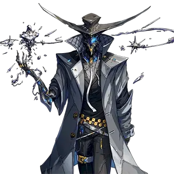
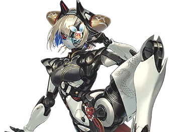
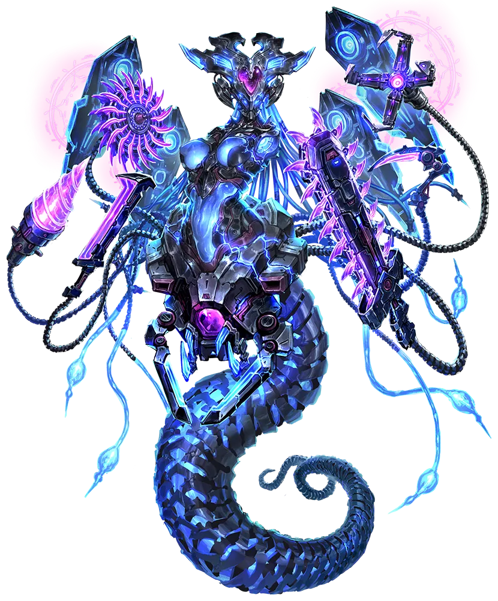
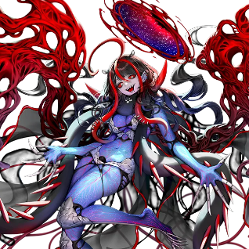

# 拉尔瓦

| 角色信息   |  |
| ----------- | ----------- |
| 名称    |拉尔瓦
| 年龄   |不明
被作为寄生体的人类的年龄|122岁
| 职业 |侵蚀生命体
| 对应曲   | Crossmythos Rhapsodia
| 对应版本 |Chunithm X-Verse

## Episode 1 少女梦见的天空尽头
　
居住区域扩展型星际轨道航行船海伯里昂。
　
那正是开发者的艾比斯在幼年时所梦见理想的具象化。
　
她之所以开始从纸面开始，一步一步地执行起这个计划，正是因为她察觉到了这颗星球正缓缓开始走向名为衰退的下坡路这一事实。

 

从艾比斯还是那个只会仰望天空的少女，到她成长为一名初具规模的研究者的时候，星球已被漆黑的星际物质完全包围，环境本身也发生了剧变。

天空被黑暗封锁，地面气温开始下降后，人们只能住在特定的地方。

在可居住的地区稳步减少，艾比斯竭尽所能让更多人活下去的某一天，她遇见了一位长寿种族的女性。

她的名字叫毛毛。也是在这被黑暗笼罩的世界中，照亮了这个星球居民们的未来的科学家之一。

 

之后，艾比斯和毛毛在人类种与兽人种们的协助下，建成了一座让人们不必饱受寒冷之苦的城市。

后来被称为NEON NEBULA的这座城市，配备了多种抵抗黑暗与寒冷的功能。

就这样，艾比斯在漫长的岁月中不断改良城市功能的同时，也逐渐推进着一个计划。

那就是，在星际物质的密度继续上升、将他们居住的星球压垮之前，移居到另一颗星球上去。

当计划开始变得越来越接近现实的时候，艾比斯向毛毛坦白了这个方案。

她原本以为毛毛一定会赞同自己的方案，和她一起朝着梦想的实现前进，但毛毛断然拒绝了她的提案。

因为毛毛知道，即使明知会死，谁也无法舍弃母星。

如此彻底的拒绝，对艾比斯来说还是头一遭。

　
从相遇之初就一直针锋相对、争论不休的两人，以这一天的冲突为界，彼此的关系被彻底撕裂了。

成为NEON NEBULA统治者之一的艾比斯，创立了实现自己梦想的公司――IDC。

即便年龄已经超过百岁却仍不见衰弱的艾比斯，距离梦想实现只剩一步之遥了。

剩下的课题，只有两个。其一，是解决海伯里昂的能源问题，其二，是赐予人们不受开拓地状况影响的坚韧且革新的肉体。

无论前方有多少艰难险阻，艾比斯都相信，自己能够将这些课题一一解决。

然而，命运却给了她一个残酷的结局。

艾比斯，由于不明的疾病，倒下了。

## EPISODE2　蜕变

一名背着步枪、身穿防具的中年人类种男性，乘电梯前往某个地方。

他此刻所在的地方，是一栋名为艾比斯塔的超高层建筑，它扮演着记录艾比斯至今功绩的资料馆的角色。

艾比斯就住在这座离天空最近、可以俯瞰整座城市的建筑物顶层。

在男人面前，带着语音引导的全息影像正不断播放着，解说她的经历。

『她的脚步永不停歇。直到实现梦想，将NEON NEBULA的人们引向理想乡――』

只听啪的一声，全息影像立刻从头开始播放。

“真是的，都不知道听过多少遍了。就算是我也会听腻了啊。”

男人刚抱怨完，电梯就到达了顶层。那不断重复的解说也停了下来。电梯内陷入了寂静。

这名全副武装的男人能毫发无损地来到这里，还是因为——

除了最低限度的护卫外，所有人都被调去处理外面发生的骚动了。

目前，艾比斯统治的街区聚集了许多市民。
　
兽人种、人类种——他们虽然所属的势力不同，但都是生活在这座城市、真心热爱这座城市的人。

起初，他们还想追究艾比斯的手下拉维娜引发的骚动的责任，以及男人花数天“散播”的人体实验传闻的真伪，但现在已经顾不上那些了。

因为好战的兽人种一拳打飞了应对骚乱的护卫，最终发展成了乱斗骚动。
　
混乱瞬间蔓延开来，街区的各处都发生了同样的骚乱。
　
而散步了谣言的当事人，现在则是装着一副若无其事的样子，朝着艾比斯所在的顶层走去。

――砰。

电梯门缓缓打开。

“那么，也就没必要再穿这身打扮了。”

说着，男人在电梯敞开的瞬间，将双臂向前伸出。

从双臂袖口中，银光闪闪的流体涡旋般向前飞去――接着，就缠上了在艾比斯房间前待命的护卫们的脖子。

“呜啊！？” “噫――”

两人没再多说一句话。

连发生了什么都没弄清，就被拖入深深的沉睡中，瘫倒在地。

“放心吧。等你们醒来的时候，一切都会恢复原样。”

这么说着，从电梯间走出来的，却再也不是那个全副武装的男人了。

出现在这里的，却是个在一身金属铠甲之上套着西装，顶着一顶翘到天上的礼帽的，绅士打扮的人物。

那正是次元审查机构LOGOS的执行官——格雷=古。

他为了审查与这个世界中发生的侵蚀现象有关的艾比斯，一直在暗中活动。

“……那么，该去她那儿了。”

格雷=古迈着流畅的步伐，朝她所在的房间走去。

走廊极其破败，微微泛红的光照亮的墙壁上随处可见狰狞的爪痕，素色的地毯上到处渗透着像是有什么东西爬过的黑色污渍。

那景象简直如同凶猛的野兽肆虐过后的惨状。

而在这片景象中零零散散滚落的，是与此处格格不入的破旧玩具，和看起来像涂鸦一样的机器人的画。

听过艾比斯生平语音导航的格雷=古，很清楚那些东西是什么。

这些全部都是支撑她人生的原动力——可称为梦想结晶的东西。

格雷=古像表达敬意一样避开它们继续向前，终于走到了艾比斯所在的大厅。

　
大厅内部破败的程度与走廊想必也不相上下。就像是被暴风雨席卷过一样。

然后，在格雷=古视线的尽头，艾比斯就在那里。
　
她正望着破碎玻璃窗外延展开的NEON NEBULA。

就在那时，察觉到格雷=古气息的艾薇丝回过头来。
　
在反复明灭的灯光中，她的身影显得格外年轻，完全不像电梯里曾出现过的那个人物。

笔挺的背脊，垂至腰际的，夹杂着红色挑染的亮丽黑发。
　
从突显身体线条的白色西装下露出的肌肤，怎么看都不像是一位百岁开外的杰出人物。

　
“连声招呼都不打就闯进来，可真没礼貌啊。”
　
“不巧的是，我也没有必要向并非这个房间主人的家伙表达敬意。”
　
“你知道老娘的事？”

格雷=古没有回答那个像艾比斯一样的东西，而是接连将悬浮在空中的银色流体变成长剑。

“拉尔瓦啊……就让我在你‘扎根’这个世界之前，解决你！”

格雷=古朝着拉尔瓦飞掷出长剑。
　
对面的拉尔瓦，一边闪避接连飞来的长剑，一边露出锯齿般的牙齿咧嘴一笑。

“拉尔瓦……那是，我的名字？不错嘛，我喜欢！”　

连头也不回，拉尔瓦就抓住了从背后袭来的长剑并一把捏碎，然后，拉尔瓦的身体发生了异变。

眼白变成了赤红色，瞳孔变成了银白色，黑色的细长触手也像是要将西装撕裂一般长了出来。

　
“已经‘孵化’了吗。”

“啊哈哈！真是可惜啊！”

　

拉尔瓦愉快地咯咯笑着，纵身跃出了塔外。
　

如果在这里放走拉尔瓦，她可能会找到别的素体潜伏起来。
　
就在格雷=古正要追她，朝窗边走去时——
　
从塔外，有什么东西朝着格雷=古飞扑而来。
　
那巨大得遮蔽视线的物体，就像要将格雷=古连同这座大楼的最上层一起削掉般快速逼近。

“……！”

格雷=古操控流体接住了这一记大质量的攻击。然而由于势头过猛，他整个人都被狠狠地推出了好远。

两脚在地面上迸出火花，他就这么被撞出了房间――径直坠落到了地面上。

## EPISODE3　降临，海伯里昂
　
与此同时。
　
在艾比斯塔深处修建的IDC研究楼内，威廉与艾莉尼一行人汇合后，才知道她们是被一个冒充威廉的人引导至此。

　
“不是我的我，吗……”
　
“真没想到威廉先生竟然一直被关在这里呢。”
　
“哈哈，所以你看到我才喊了那么一声啊。”
　
“我居然以为是闹鬼了，真是丢人……对不起。”

　

威廉对着垂头丧气的艾莉尼回以微笑。

　

“我倒没在意。再说了，如果我没被拉维娜带走，这事也不会发生。该道歉的是我才对。”

威廉转移话题道：“比起那个。”
　

对现在的威廉来说，最让他放心不下的，是整整四天时间里，有个不是自己的家伙一直和艾莉尼、林内以及毛毛待在一起。

“那个冒牌货……该不会顶着我的脸胡作非为吧……”

　
威廉心中无法平静。

　
“您刚才说什么了吗？”

　
心里堵得慌，威廉向艾莉尼问道。

　
“艾莉尼，那家伙没对你做什么奇怪的事吧？”
　
“奇怪的事？嗯——倒是没有……啊，说起来——”
　
“说起来？”
　
“我可是严格遵照威廉先生的嘱咐了！对吧，林内？”
　
“嗯！没有一起洗澡！”

　
威廉完全没想到这里会提到这茬，差点就晕倒在地上。但这还是让他松了口气。

　
“哈哈，听你这么说的话就没什么问题了……林内也是，谢谢你遵守了约定。”
　
“诶嘿嘿。”

　
威廉庆幸自己不在时，有林内在。如果那冒牌货像安克那样心怀不轨，他们恐怕就没法像这样重逢了。

　
『那么，闲话就说到这里了吧？这里可是艾比斯的统治区域哦？能不能有点紧张感！』

“诶，毛毛……？”

听到突然从艾莉尼身后的吉吉那里传来的毛毛声音，威廉困惑不已。
　

随即，吉吉头部“噗嗤”地响起了一声放气般的声响。紧接着，覆盖吉吉左半边脸的宛如面具一般的外装甲被打开，从吉吉那空荡荡的脑袋里，可以看到毛毛正坐在一把小椅子上。

　

“啊！？吉吉的脑袋里是这样的吗！？”

也许是惊讶于吉吉的头颅之中竟然还有如此宽广的空间能装下毛毛，威廉新奇地来回看着毛毛和吉吉。
　
这时，他与冷冷盯着自己的吉吉对上了眼。

　
“警告。您现在是不是在想非常失礼的事情，威廉少爷？”

　
“哪、哪有。怎么可能啊。”

　
“哈，是这样的吗。”
　

“总、总之。你们两个没事就好。”

　
“嗯。那就先梳理一下情况吧。我们是为了从拉维娜手里夺回那个男人而来的。”

　
那个男人，指的是有着和威廉一样面孔、一直盯着艾莉妮的安库。
　

他和威廉一起被拉维娜抓住，接受了各种人体实验，但在他用扭曲物体的力量解除了束缚后，就消失得无影无踪了。

　
“那家伙现在应该还在拉维娜那里。现在说不定还能在他逃跑之前抓住他。我和艾莉妮的话，一定能――”

　
就在这时，整栋建筑剧烈地震动起来。

　
窗户哗啦啦地晃动着，仿佛随时都会在冲击下碎裂。

　
『怎么回事，这震动是！？』

　
“毛、毛毛大人！那个……请看那个！！”

　
随行的护卫兽人种颤着声音喊道。
　
众人将视线转向窗户，那里――。
　
在朦胧照亮夜空的霓虹灯光中，一条如同手风琴般又长又巨大的尾巴浮现在空中。

『不，不可能……那是——』

“毛毛，你知道那是什么吗！？”

『嗯……那是海伯里昂！！』

## EPISODE4　噬星之船

　
同一时刻。

被格雷=古煽动、带着大批手下来到艾比斯塔的“方格斯塔”帮首领——萨拉=匠恩，面对已经断裂，从空中坠落下来的高塔的一部分，以及在弥漫的粉尘中浮现的巨尾，愣住了。

“头儿！！那该死的大尾巴怪物到底是什么玩意儿！？”

　
脸色大变地跑来的鳄鱼兽人戴诺的声音，让萨拉=匠恩唤回了神。

即便是他们那样体格强健的人，也没有勇气去面对能与艾比斯塔匹敌的那个东西。

“老大――唔噗――”

萨拉=匠恩按住了正在慌乱中的迪诺的嘴，露出了如黄连入口般痛苦的表情。接着，从他口中，说出了老友艾比斯所描绘的梦想之名。

　
“海伯里昂……已经完成了吗？”

““海伯里昂！？””

威廉和艾莉尼妮的声音在通道中回荡。

　

据毛毛说，那是三会头之一、同时也是毛毛的朋友的艾比斯，小时候幻想的一艘船的名字。
　

虽然从窗户看不到它的全貌，但据说那是一艘拥有人的上半身和蛇般长尾的下半身、能够进行星际航行的船。

　

“那、那就是宇宙船……吗？”

　

它的模样，与威廉认知中的宇宙船形象实在相差太远了。

　

“那玩意儿到底是怎么浮在空中的啊？”
　

『如果设计还是当时的样子的话，上半身应该会有四台被冠以“无比强大的推进力！”之名的超巨大浮游单元才对』

　

荒诞无稽，说的正是这种情况。

　

然而，那个东西确实在众人的面前，在天空中飞翔着。

　
“就算有再大的推力，光是持续浮游就会消耗相当多的电力吧――”

　
『电力的话，要多少有多少吧』

　

“难道说……”

　
艾莉尼似乎察觉到了什么。稍晚一步意识到的威廉，视线向下移去。

『嗯，也就是NEON NEBULA本身。』

　

毛毛的声音，开始紧张起来。

　
『虽然NEON NEBULA的光芒不会立刻消失，但我们大伙儿就该一块儿冻死了吧。』
　
“怎么会……那该怎么办……”
　
『很简单，把那个破坏掉就行了。』
　
“有能阻止那么大的东西的武器吗？”
　
『……没有。准确地说，是没有武器能“到达”浮游单元所在的高度。』

NEON NEBULA虽然有过一些小摩擦，但从未发展成大规模争斗。
　
因此，对于这里的人来说，没有必要在武器开发上投入精力，所有用于开发的资源都被投入到城市功能的提升和维护上了。

　

『没想到艾比斯竟然钻牛角尖到这种地步。就那么渴望天空吗，你这家伙……』

　
那句话像是自言自语一般，有些闷沉，难以听清。

　
“那就去找那个叫艾比斯的人吧！说服她让她停下海伯里昂！”
　
『……这，恐怕没那么容易吧。』

　

毛毛的话说得格外含糊。
　
也许两人之间曾有什么过节，但现在，尽快阻止事态才是首要任务。

　

『那家伙可是比我还要固执。一旦决定了的事，不做完是不会改变的。』

　

“那就先从毛毛开始改变吧。”

　
威廉不紧不慢地走到吉吉面前，紧握的拳头直抵吉吉的胸口。

　

“我们不知道你们之间发生过什么。但就在这座城可能毁灭的关头，可不能做出会后悔众生的事情啊！”

『……！』

　

四周陷入一片寂静。
　

被威廉的气势压倒的毛毛，把脸从吉吉的头颅中探了出来，只是说了这句话——

“那，就去见见她吧”。

　――

　
在威廉他们离开研究楼的时候，有几个人在远处眺望着这一幕。
　

是安克和猫型兽人拉维娜。
　

在从研究楼中离开之前，还对安克一直处于反抗态度的拉维娜，现在已经完全对他言听计从了。

　

“喂，拉维娜。那个圆盘在哪儿？”
　

“你说威拉德喵？那家伙还没修好……喵，难不成你想用威拉德去袭击喵？”
　

“啊，没错。”
　

“……不行喵。我，我现在就得去找艾比斯大人――呜喵呜……！”

　

安克的手用力掐住了拉维娜的脖子。

　

“我不会说第二遍。马上把圆盘修好。”

　

拉维娜只能强忍着颤抖的身体，慢慢地点头。

## Episode 5　红色闪光

　
与此同时。
　
在艾比斯塔的顶层遭到海伯里昂奇袭的格雷=古，正追着那拍动着不停扭动的红色翅膀，自由自在地在空中游弋的拉尔瓦。

在艾比斯塔交战时，拉尔瓦还勉强保留着被用作素体的艾比斯的形态，但现在的她的样子，已经可以说与“怪物”二字无比相称。

微微泛青的透明肉体，以及蔓延到身体每个关节、浮突而起的血管，仿佛体内栖息着一个小小的宇宙。

只剩下头部还残留着艾比斯的些许模样。

拉尔瓦朝着向行进方向喷溅流体碎片、并继续追踪的格雷=古，像是看着什么有趣的东西一样，愉快地搭话道。

“哈哈哈！你还真够顽强的啊！”

　朝着格雷=古正要落地的流体碎片，从拉尔瓦身体伸出两根黑色触手袭去。
　然而，触手只是划破了格雷=古的战斗服，并未造成实质伤害。
　格雷=古不仅调整了碎片的位置避开了直击，还趁转身的间隙架起生成的剑，斩断了触手。
　那身手轻盈得完全不像穿着金属铠甲。
　拉尔瓦仿佛对这场厮杀毫不在乎，拍着手，脸上浮现出戏谑的笑容。

　“那个……什么都能做到吗？”
　“倒不是说无所不能。不过，将你从这个世界上抹去，倒是轻而易举。”
　“嘿……听起来挺有意思的。”

　说着，拉尔瓦便将格雷=古斩落的触手再生了。
　然后，像是要模仿他的战斗方式似的，将右臂变成无数鞭子般细长的触手。

　“人家也想要！”

　为了让格雷=古无处可逃，那画出一道巨大弧线将他包围的触手群，一齐袭了上来。
　即便面对推开流体碎片、缠上自己身体的触手，格雷=古也毫不慌乱，冷淡地说道。

　“……是时候了。”

　――叮。

　突然，一声像金属撞击般的轻响在四周回荡。

　“……嗯？”

　拉尔瓦对触手一直没能勒死格雷=古这件事感到疑惑，轻轻歪了歪头。
　就在这时，拉尔瓦注意到了。自己的视野开始逐渐倾斜。
　身体，从右肩到左侧腰腹，被整整齐齐地切开了。
　被从拉尔瓦身上斩落的肉体，像被抛上岸的鱼一样抽搐着，在与地面碰撞前就粉碎四散了。

　“我、我的身体，怎――怎么会！？”
　“居然那种状态下还能活着。不过，就算是拉尔瓦，刚孵化的个体似乎也构不成威胁呢。”

　突然从头顶传来的声音让她抬头望去，只见一个身着红色紧身衣的女人站在流体的碎片之上――。

　“呃！？”
　“抱歉介绍晚了。其实，追你的并不只有我一个人。”

　女人一边怒视着拉尔瓦，一边将手伸向挂在夹克上的刀鞘。
　本能地认出那就是将自己逼入绝境的武器的拉尔瓦，打算在下一波攻击飞来之前，把女人变成新的宿主。
　就在它想要以最快速度将身体变形以缠上女人的那一瞬间，早已被斩断数处的拉尔瓦的身体开始崩塌。

　“已经，结束了。”

　拉尔瓦已经连维持身体都做不到了。

　“这、这种事――我、还没――活着――”

　那微弱听到的沙哑声音，究竟是拉尔瓦在痛苦中操控宿主发出的，还是作为宿主的艾比斯自身的愿望呢。
　那个答案，融入了黑夜，无从得知。

　“……侵蚀反应，已消失。”

　阿斯特尔用从怀中取出的终端，确认了周围没有拉尔瓦的痕迹。

　“干得漂亮，阿斯特尔执行官。我特意让拉尔瓦从‘感知范围外’发动攻击试探了一下，看来是我白担心了。”
　“不，这没什么值得夸奖的。”
　“你还真是严肃呢。算了，也行。”

　对于这两个从这个世界消除了最大威胁的人来说，剩余的工作只有调查拉尔瓦引发的事件以及事后处理了。
　由于克莱=格把拉尔瓦引到了NEON NEBULA之外，两人正好就在之前一直搁置处理的地下设施附近。
　一边操控流体的碎片和阿斯特尔一起降落到地面，一边直接向设施走去。

　“克莱=格阁下。我有件事想请教。”
　“什么事？”
　“她启动的那个东西，不用处理吗？”

　正如阿斯特尔所指出的，向克莱=格袭来的物体――海伯里昂，仍在城市上空徘徊。
　如果它因为失去主人而陷入失控状态，NEON NEBULA恐怕会毁灭。

　“没必要”
　“可是！这样下去，我们就是眼睁睁看着这颗星球毁灭了！我们是维护多元世界秩序的人。既然有能力帮助他人，现在不正是应该使用这股力量的时候吗！？”
　“我应该说过吧，阿斯特尔君。我们的使命是排除浸食事象，而不是拯救世界”

　克莱=格冰冷的声音响起。
　接着克利=格又像钉钉子一样，再次强调了逻各斯介入的危险性。
　如果拥有超常力量的我们直接插手，会给那个世界带来多少异常，谁也说不准。

　“……唔”

　阿斯特尔咽下到嘴边的话，似乎在与自己的正义感斗争。
　克莱=格看着她，嘀咕道：“说起来啊”

　“阿斯特尔君，我还这么说过：'所谓组织，还是汇集了各种想法的人组成时强度更高'”

　这番拐弯抹角的话让阿斯特尔一时看不清他的真意。
　她微微皱起眉头，瞥了他一眼。
　从头盔缝隙中露出的蓝光，正直直地看向这边。

　“一切，都看方法。拥有力量的人，能决定如何使用那股力量，阿斯特尔君。我认为你有这种能力”
　“什么意思？”
　“街上的人应该都在想办法阻止那个东西吧。但那未必一定会成功”
　“……”
　“可能就差一步，会失败”

　说到这里，阿斯特尔的表情突然缓和了下来。

　“也就是说，克莱=格阁下是想说：不是去支援他们，而是只看结果吗？”
　“……”

　阿斯特尔将克莱=格的沉默视为肯定，端正姿势向他敬礼。
　然后，就在她转身朝向NEON NEBULA的瞬间――她悄然消失了。
　看着那道如同闪电般通向都市的红色光轨，格雷=古低声嘀咕道“还年轻啊”。

 EPISODE6　胜利的突破口
　『这、这是怎么回事……』

　一边提防着在NEON NEBULA天空下横行霸道地移动的海伯里昂，威廉一行人来到了艾比斯塔顶层的艾比斯私人房间。
　然而，在那里等待他们的，是仿佛被龙卷风席卷过一般崩溃坍塌、变得空空如也的顶层。
　理所当然，本应卧病在床的艾比斯的身影并不存在。

　“喂，那里有人啊。”

　琳涅所指的地方，有两名男子倒在地上。吉吉跑过去确认他们的呼吸。
　两人都还有气息，但无论吉吉怎么摇晃他们，他们始终没有醒来。

　『常、艾比斯在哪里，到底在哪里啊！』
　“追踪――”

　吉吉的双眼发光，强烈而纤细的光束照射到瓦砾下以及楼层的各个角落。

　“非常抱歉，毛毛大人。虽然有艾比斯大人曾在此处的痕迹，但她的身影无论哪里都找不到。”
　『是吗……』

　事态陷入了最糟糕的状况。
　既然制造者艾比斯不在，就只能靠自己去阻止海伯里昂了。

　“对手是攻击都打不到的对象，到底该怎么阻止它……”
　“啊，那个……也许我能做到。”

　艾莉妮说完，说出了自己的想法。
　她打算利用自己拥有的异能――跳跃（瞬移）的力量，跳上海伯里昂。
　即使跳跃的射程很短，只要不断从一个地方移动到另一个地方，抵达的可能性就极高。

　“确实，我觉得艾莉妮是合适的人选。但是……不管怎么说这也太危险了。”

　在来塔的路上，威廉注意到从海伯里昂的躯体部分伸出的多条手臂上，搭载着各种武器。
　据毛毛说，这些似乎是针对各种用途设计的，但剑、钻头、切割刀等，全是像把小孩子喜欢的东西不嫌多地塞进去似的危险玩意儿。

　“确实，说不定有可能阻止Hyperion。但是，就算艾莉尼能赶到，要怎么让它停下来啊？”
　“我做了很多特训！”
　“特、特训……？”

　艾莉尼在扮成威廉的人的指导下，开始正视自己的力量。
　在这样调查自己能做到什么和做不到什么的过程中，艾莉尼发现她只能让“手触碰到的物体”进行跳跃。
　这个射程接近艾莉尼一次跳跃＜传送＞能移动的距离。

　『是吗，所以是要攻击Hyperion的弱点啊？』
　“弱、弱点……？”

　听到这个陌生的词，艾莉尼和琳涅一起歪了歪头，这时威廉补充道。

　“就是要攻击那艘船最痛的地方。”
　『嗯，正是如此。』
　“可是，它身体那么大，会有觉得痛的地方吗？”
　『有的，而且还是特别要命的地方。』
　“对了，是漂浮单元！”

　理解了毛毛的想法后，威廉确认自己的考虑是否与她的想法一致。

　“没必要破坏所有漂浮单元。两肩上各有两组漂浮单元，只要破坏其中一侧的两组，它应该就会因自重而崩溃。”
　『正是这样。』

　毛毛说到这里停顿了一下，然后说明了接下来打算做的事。

　『那艘船现在是勉强航行状态。只要让一侧停止运作，它就无法支撑自己的身体，会因自身重量而坠落。”

　乍一看，对手似乎遥不可及，但总算找到了攻略的线索。
　接下来，需要确保能破坏漂浮单元的武器。
　幸运的是，漂浮单元的结构使它们像喷气式飞机上的引擎一样暴露在外部。
　只需利用艾莉尼的力量，把异物扔进去就行了。

　“各位，看来事情已经定下来了。”
　“嗯。”

　大家决定的分工如下。
　威廉和艾莉尼通过跳跃＜瞬移＞登上海伯利安号，甩出从不知火腿上回收的两把刀刃，使浮游单元停止运行。
　让毛毛和不知火动员手下的人手，疏散NEON NEBULA的居民。
　林奈则负责在海伯利安号将威廉和艾莉尼甩落时，追踪海伯利安号的动向。

　“林奈，万一出事我会喊你的名字。这是非常重要的任务，拜托了”
　“嗯。我会保护好你们两个的。”
　
　要做的事，极其简单。
　阻止海伯利安号。仅此而已。

　『不得不把这座城市的未来托付给你们，真让人不甘心……但这次作战的关键毫无疑问就是你们。拜托了，威廉，艾莉尼。』
　“嗯！”
　“我一定让它停下来！”

　一场孤注一掷的战斗，此刻正要拉开帷幕。

 EPISODE7　最糟糕，却也是最好的时机
　在艾比斯统治区一栋高层大楼的楼顶，威廉和艾莉尼俯视着脚下延伸的NEON NEBULA街景。
　通过跳跃＜瞬移＞提前绕到前进方向的两人的目标是，接下来跳上即将横穿大楼的海伯利安号，并瞄准左右各两台搭载其上的浮游单元。
　只要让其中一方的浮游单元停止运转，威廉他们就赢了。

　“事到如今才说……比想象中高好多啊……”
　“是、是啊……”

　虽然两人势在必得地来到了这里，但海伯利安号在较低的位置移动，距离比预想的要远。

　“加、加油吧，威廉先生！我、我们就是这样一次次越过障碍的――阿嚏！”
　“艾、艾莉尼，你没事吧！？”

　在高楼楼顶，单是吹过的风就冷得刺骨。
　就算装了防具，也几乎没什么用。
　已经分不清这颤抖是来自紧张还是来自寒冷了。

　――不行了，必须马上走！

　下定决心的威廉，抓住了艾莉尼的小手。仿佛有别于手中传来的热度，某种东西正流淌过来的感觉中，威廉用不会被风声盖过的大嗓门喊道。

　“艾莉尼！”
　“在！”
　“听到我的信号就从大楼跳下去！”
　“明白了！”

　彼此回握的手中，注入力量。

　“我们俩都是胆小鬼，但是――”

　――在来到这里之前，发生了很多事。
　两人在什么都不懂的情况下在废土相遇，败给了安克。
　但在星云霓虹，他们凭借齐心协力，成功击退了他。
　而接下来要面对的，是吞噬城市光芒、封锁众人未来的船――海伯里昂。
　敌人很强大。但是，如果是携手共进的两人――无论面对怎样的对手，都能一战。

　“走吧，艾莉妮！”
　“是！”

　两人从大楼屋顶跳进了空无一物的空间！
　一阵失重感包裹身体之后，两人的身体像被地面吸住一样落了下去。
　就在这时，横穿大楼的海伯里昂的浮游单元逼近而来。

　“艾莉妮！就趁现在！”
　“在！”

　海伯里昂似乎注意到了接近的两人。
　从腰部伸出的圆柱形手臂，迫近而来试图迎击两人。
　安装在手臂前端的链锯，震动着周围的空气，眼看就要击中两人的那一刻——
　艾莉妮和威廉通过跳跃/传送躲开了链锯，降落到了浮游单元的前端。

　“好，能接近到这里的话，再努力一点就行了！艾莉妮，等进入跳跃的射程范围了告诉我！”
　“包在我身上！”

　威廉一边朝着漂浮单元前进，一边留意着周围。然后，他做好准备，随时都能将背着的刀递出去。
　没过多久，机会就来了。

　“这个距离能行！”

　两人已经接近到能通过肌肤感知漂浮单元发出的震动的距离。
　随着艾莉妮的喊声，威廉将刀递给她。
　艾莉妮在威廉的支撑下，目光笔直地锁定着漂浮单元――

　“去吧啊啊啊啊啊啊！！！”

　只将刀刃瞬间移动了。
　紧接着，吸收了刀刃的浮游单元开始发出异响。
　能明显看出浮游单元的输出在下降。紧接着内部发生了爆炸。影响也立刻显现到Hyperion的动作上――
　失控的浮游单元拖着烟雾，从Hyperion上脱离。

　““太好了！””
　“好，就这样――艾莉尼！　快离开这里！”
　“诶！？”

　艾莉尼依言，和威廉一起瞬间跳到了空中。
　就在那一瞬间，巨大的钻头穿过了两人刚刚还在的浮游单元。
　两人没有喘息的时间。
　Hyperion的手臂接连不断地朝被抛到空中的两人逼近。

　“艾莉尼，跳到那边！”
　“在！”

　躲过闪烁着蓝光、如同触手般的东西后，两人落在了从Hyperion头部伸出的导管中。

　“躲在这里的话，也许能撑过去！”

　威廉本想藏在导管的缝隙里躲避攻击，却慌忙拉住了她。
　不停剧烈晃动的导管，乍一看似乎很柔软，但导管表面却是金属制成的，很硬。
　要是钻进导管之间的缝隙里，两人恐怕已经被碾碎了。
　两人立刻离开了那里，总算抓住了Hyperion脖子上的一个突起。
　稍微冷静下来的两人，重新望向Hyperion。
　由于破坏了一个浮游单元，Hyperion的晃动变得剧烈到连体感都能察觉。
　船体似乎想保持平衡，但每次尝试姿态控制时，到处都会传来嘎吱作响的声音。
　就在威廉瞄准第二个浮游单元，准备瞬间移动的时机——
　突然间，Hyperion的船体剧烈摇晃，大幅度倾斜了。

　“糟――了！？”

　两人一瞬间被抛到了空中。

　“呀啊啊啊啊啊啊啊！？”

　视野飞速变换，上下方向感都混乱了。
　两人被抛出去时的冲击力使她们松开了手。
　在一片混乱之中，威廉最先重新稳住身形，将艾莉尼纳入了视野。
　她到现在还没弄清楚发生了什么，一直在尖叫。

　“艾莉尼！听我说！”
　“啊……好、好的”

　艾莉尼察觉到威廉就在附近，稍微冷静了一点。
　但她仍然没能重新集中精力进行跳跃＜传送＞。

　“威、威廉先生！你在哪里！？”
　“没事！我这就过去找你！”

　威廉合拢了张开的双臂和双腿，朝着艾莉尼的方向――抱住了她。

　“已经没事了！”

　艾莉尼听从威廉的声音，逐渐平复了慌乱的心情。等重新集中精神后，她传送＜跳跃＞到了附近的位置。
　两人着陆的地方，是在海伯利安号的手臂上。
　圆筒形的手臂行进起来很不稳定，两人身后能看到发出刺耳声响的电锯。

　“到、到底发生了什么？”

　威廉的视线，在被抛向空中的前一瞬间捕捉到了某个东西。那是一股类似能量奔流的东西，在将目标扭曲时释放出来。

　“不是吧……谁会想到在这种最糟的时机出现啊……喂，安库！！”

　仿佛在回应威廉的喊叫，那个攻击海伯利安号、将两人抛向空中的罪魁祸首，从高空显现了身形。
　那个乘坐着拉维娜的圆盘威拉德的男子――安库，作为最大的障碍，挡在了两人面前。

　“时机简直太完美了吧！？因为我可是能亲眼看着你那因为绝望而扭曲的脸啊！威廉！！”

 EPISODE8　少女的梦坠入大地
　在摧毁了海伯利安号一个浮游装置后，威廉和艾莉尼正朝着破坏第二个的目标向上前进。
　但两人在最后一步时被挡住了去路。
　出现在他们面前的，正是乘坐着从拉维娜那里抢来的圆盘的安库。

　“我还以为我们多少处得好一点了呢！”
　“哈！我说过吧，我……最讨厌像你这样的家伙了！！”

　在这样喊叫的同时，安库使用了异能――扭曲。
　随着弹指发出的干涩声响，连接向海伯里昂船体的手臂开始扭曲变形。
　在立足点完全崩塌之前，艾莉尼拉住威廉的手，尝试跳跃。
　然而，在上一次战斗中已掌握了艾莉尼能力特性的安库，在她发动能力之前就操控威拉德堵住了去路。

　“唔……！”

　跳跃的能力未能发动，艾莉尼倒吸一口凉气。在这期间，安库正用从威拉德身上展开的机械臂拆毁两人脚下的立足点。
　艾莉尼重新集中精神，跳向稍高一点的空间。要是再次失败的话，后果不堪设想。这次总算勉强避开了攻击，但下一次是否还能同样顺利躲开，就不得而知了。

　“库哈，你们已经哪儿也去不了了，战斗的手段也没了！再怎么挣扎也是没用的啊！”

　通往船体的道路已被切断。
　而且，也没有可以跳跃的地方。
　身后延伸的道路，充斥着轰鸣作响的电锯声。
　如果战斗再这样拖下去，海伯里昂剩余的几条手臂恐怕也会蜂拥而至。到那时，想靠跳跃来避开它们就困难了。

　“我们……绝不会输给你这种卑鄙小人！”
　“卑鄙有什么不好？难道你以为光凭手拉手、说些漂亮话，就能搞定一切吗？”
　“唔……没错！在我的世界里，大家就是这样幸福地生活着的！”

　艾莉尼闭上眼，提高了音量。

　“艾莉尼……”
　“小屁孩……这样看来，到底是谁疯了还真不好说啊。”

　这样低语着，安库嘴角上扬，嘿嘿一笑。

　“那好，老子就把你们带到那种漂亮话行不通的世界里去啊！！”

　安库轻轻倾斜威拉德，身体前倾，逼近而来。
　艾莉尼被迫做出选择。是和威廉一起挑战安库来阻止海伯里昂，还是放弃并不断跳跃逃往地面――二选一。

　“――艾莉尼尼”

　那时，威廉用只有艾莉尼尼能听到的声音对她说道。

　“能让我跳到那个圆盘上去吗？”
　“咦？”
　“那家伙肯定以为我不跟你在一起就没法战斗。这个错觉，就是我们的可乘之机”

　威廉用一只手朝背后指了指。
　那里，还留着吉吉交给他的一把刀刃――。

　“明白了。我一定，会成功的！”

　艾莉尼尼松开威廉的手，然后将那只手贴向他的后背。紧接着，下一瞬间――威廉便悄然消失了。

　“――什！？”

　看到本应挡在自己面前、只能保护自己的威廉消失了，安库动摇了。
　他终于扔下女人独自逃命了吧——安库本想这样想让自己保持冷静，但威廉从上方出现，瞬间粉碎了这个想法。
　他的手中，握着一把隐约有些眼熟的刀刃。

　“安库啊啊啊啊啊啊啊！！！！”
　“――切！！”

　安库用戴在手臂上的终端接住了挥下的刀刃。虽然听到了终端破损的声音，但现在他脑子里只想着要杀掉这个自己扑向死地的威廉。
　受到斩击微微后退的安库，对面前的空间发动了歪曲＜菲亚策尔隆格＞的力量。
　维拉德的落脚点很狭窄，只要稍微失去平衡，就能毫不费力地让人摔下去。瞄准这个目的放出的一击――却没有命中。
　因为威廉，已经先从维拉德上面消失了。

　“为什么――”

　正要驱动维拉德寻找威廉去向的安库，终于察觉到了异样。
　视线前方――维拉德的中心部位，深深插着原本应该握在威廉手中的那把刀刃。

　“那个混蛋……”

　威廉的真正目的，并不是杀死安库，而是让维拉德失控，强行把这家伙赶出战场。

　“竟然处处都在算计我――”

　开始猛烈旋转的维拉德，带着安库一头撞向了海伯里昂的船体――撞击的瞬间，引发了剧烈的爆炸。

　――
　――――

　威廉从维拉德上脱离后，被艾莉尼紧紧抱住了。
　跳向海柏利昂的手臂那一步本来很顺利，但维拉德在短短一瞬间就把威廉带到了很远的地方。

　“得救了，艾莉尼。”
　“请别再那么乱来了。”
　“抱歉，我太依赖你的力量了。”
　“那个……倒也没什么。比起这个――”

　两人正迅速远离海柏利昂。
　周围没有任何可以落脚的地方，想要再次接近海柏利昂似乎得花不少时间。
　更糟的是，两人似乎落入了浓雾般喷涌的瓦斯弥漫的区域。
　视线很差，加上从各处照射来的霓虹灯，连准确的距离都无法判断。
　这样下去，迟早会撞上地面或建筑物。

　“怎、怎么办，威廉先生！？”

　危机一刻刻逼近。
　但威廉记得，他为了这种时刻，已经安排了某个人待命。

　“一定没事的！”

　对艾莉尼说完这句话，威廉立刻喊出了那个名字。

　“林——奈！！在这里！！”

　就在威廉喊出那个名字的瞬间，听到声音的林奈高高跃起，穿过霓虹灯映照的瓦斯，出现在了他们面前。
　林奈伸出感知触手抓住两人，又伸出另外两根感知触手抓住建筑外墙停了下来。

　“任务，完成。”
　“林奈小姐……！”
　“谢谢你，林奈！”

　林奈开心地微笑了起来。
　林奈抓着两人，灵巧地沿着墙壁爬上去，把他们带到了视野开阔的屋顶。

　“已经……离得相当远了呢……”

　在高空中移动的海柏利昂，此刻仍画着不稳定的轨道。更糟的是，它似乎开始把大楼视为敌人，接连破坏附近的建筑。

　“可恶，明明只剩一座核心了……”
　“……哈啊，……哈啊。”

　艾莉尼的体力即将到达极限。
　想要再次攀上海柏利昂，除非它降下来，或者他们像维拉德那样乘坐圆盘追上去，别无他法。

　“难道……真的没办法了吗？”
　“……一定，会有的。只要不放弃思考，这座城市就有得救的方法”

　现在，必须尽快把这件事告诉小桃他们，在NEON NEBULA被黑暗吞没前定下对策。
　就在她准备前往小桃等待的艾比斯塔时。

　“威廉，在发光呢”
　“……诶？”

　威廉顺着凛音所指的方向，仰望天空。
　那里，是大楼之间的缝隙里穿梭交织的光的轨迹。以及，一道闪电般的红色闪光，径直射向海伯里昂。
　那道红色闪光仿佛划破弥漫的乌云，贯穿了海伯里昂。