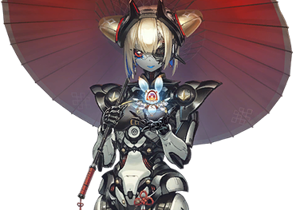
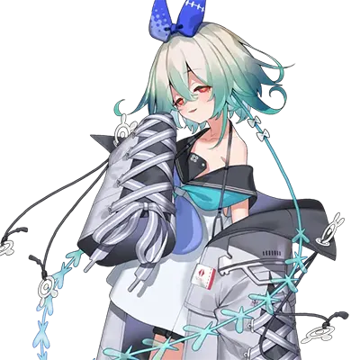

# 毛毛&吉吉

| 角色信息   |          | 角色信息   |          |
| ----------- | ----------- | ----------- | ----------- |
名称|毛毛|名称|吉吉|
年龄|不明|年龄|制造后20年
职业|恩迪商会的商人|职业|社长秘书
身份|总裁
初出|Chunithm VERSE
对应曲|The Devil Incarnate

（立绘中的机器人为吉吉，手上的浮游生物为毛毛。）

## Episode 1 蠢蠢欲动的人们

幻想都市·NEON NEBULA。

这座城市的每一个角落，都闪烁着五颜六色的霓虹灯，弥漫的气体将灯光渲染成梦幻般的景象。仿佛是为了给这幅光景再添一抹色彩般，无人机的全息广告如洄游鱼般穿梭在楼宇之间，在小巷里投下几分诡异的阴影。

小巷中，温暖的小吃摊灯火点点亮起。四面八方传来无数的呐喊与欢呼，仿佛要与上空的霓虹灯光一较高下。

“还真是，每天都能这么吵闹，也挺不容易的。”

她站在某栋大楼的露台上俯瞰地面，轻声说道。

她一手端着酒杯，正端坐在一张华丽装饰的金属桌子——上面的一把只有手掌大小的旋转椅上。

这座城市光影交织、喧嚣不断，时刻充满热闹气息，而这样的城市，却让她格外喜欢。

这时，杯中的冰块发出清脆的碰撞声。

紧接着，一阵金属摩擦的声响传来，告知她有客人到访。

她所在的顶层戒备森严，严禁任何人进入——除了一个人之外。
“毛毛大人。”

“怎么了，吉吉？”

应答的是一台以黑白为主色调的女性型机械人偶——吉吉。

被称作毛毛的女人转动椅子，面向吉吉，示意她继续说下去。

“报告。在城市外缘的山区，检测到三处强烈的热源反应。”

“热源反应？”

毛毛皱起那双又大又圆的眼睛，露出不满的神情。

“想必又是艾比斯那家伙在搞实验吧？”

“否定。我们一直在监视艾比斯氏的动向。她多年来专注于自身研究，从未在设施外进行过实验。”

“嗯，那头脑简单的家伙，也不像是能搞出什么名堂的样子。这么说来……难道是变异种？”

“肯定。关于肉体被侵蚀的变异种的报告案例，正在逐渐增加。恐怕有必要进行一次大规模调查。”

“请指示。” 

吉吉微微垂首说道。

“吉吉，你去观测地点一趟。记住，若是此事对恩迪，乃至对NEON NEBULA的利益不利…… 你该明白怎么做吧。”

“明白。”

“我知道你不会拖后腿，但还是要多加小心。”

“遵命。”

吉吉点头应下吩咐之后，转身离开了露台。

毛毛再次转动椅子，重新俯瞰这座被光影与喧嚣包裹的城市。

“那么，就看看这所谓的热源反应，会不会打破眼下的平衡吧……”

她自言自语的声音，与下方急促回荡的鼓声交织在一起，渐渐消散在夜色中。

## Episode 2 于异界苏醒

“——先生，威廉先生！”

在朦胧的意识之中，威廉听到了呼唤声，醒了过来。

最先映入眼帘的，是在这黑暗之中被淡淡的光芒照亮的，一头银发的艾莉尼的脸庞。

真好看啊……这样不合时宜的念头，不经意间掠过他的脑海。

“……唔……艾莉尼……”

“啊！威廉先生……太好了……”

她的声音带着一丝哽咽。

“你一直不醒，我、我还以为你……已经死了……我、我好害怕……”

看来在威廉醒来之前，艾莉尼一直紧绷着神经。确认他平安后，压抑已久的情绪再也忍不住，大颗的泪珠从她眼中滚落。

她显然已经心力交瘁。

这也难怪——他们被敌人追杀着穿过了整片沙漠，好不容易以为能逃脱，却又<ruby>跳跃<rp>（</rp><rt>TELEPORT</rt><rp>）</rp></ruby>到了这片漆黑的地方。

再加上威廉一直毫无反应地躺着，她怎么可能不慌乱。

“让你担心了，对不起。”

威廉立刻坐起身，想要稍稍缓解她的不安，于是温柔地笑了笑。

“我已经没事了。谢谢你，艾莉尼。”

“呜……嗯，嗯……”

确认威廉平安无恙后，艾莉尼渐渐找回了冷静。

两人互相检查过身体，确认没有异常后，立刻开始试图弄清当前的状况。

“这里……到底是哪里？”

他们本应通过艾莉尼的<ruby>跳跃<rp>（</rp><rt>TELEPORT</rt><rp>）</rp></ruby>，从荒芜之地来到威廉居住的巨型都市利布拉的。

可这里不仅看不到利布拉标志性的极光，没有港湾区域特有的海水气息，连一丝楼宇的灯光都没有。更糟的是，空气还带着几分寒意。

虽然不知道已经过去了多久，但这个季节的港湾区域，即便是深夜，穿轻便衣服出行也完全没问题。

也就是说，这里既不是荒芜之地，也不是巨型都市利布拉。

“艾莉尼，你对这个地方有印象吗？”

“没有，完全没有……诶？这里不是你说的那个地方吗？”

“看样子好像不是。”

“那……这里到底是……”

两人同时抬头望向天空，却既看不到星光，也看不到月光。取而代之的，是在遥远高空悬浮着的、隐约泛着赤黑色的、像一团瘫软云雾似的不明物体。

“我们到底迷路到了什么地方……对了！艾莉尼，你看到那家伙了吗！？”

“诶？那家伙是指……啊！没有，这里只有我和威廉先生两个人。”

威廉口中的“那家伙”，就是他们在荒芜之地遇到的那个男人。他长着和威廉一模一样的脸，还出于某种目的想要抓艾莉尼。

明明在醒来之前，他们还在拼命与那个男人周旋，可现在却完全看不到他的踪影。

“是吗……”

虽然还有很多让人在意的事，但最大的威胁已经消失，两人总算松了口气。

这样一来，眼下的当务之急就是摆脱现在的处境。

他们必须尽快弄清楚自己在哪里、面临着怎样的状况。

“威廉先生，你看那个！”

“嗯……？”

艾莉尼突然指向远方的天空——那里有几道带状的光芒，正朝着天际延伸。

在这片看不到其他显眼事物的地方，那光芒仿佛是通往天空的路标。

“虽然只是猜测，但我们说不定是到了另一个世界呢。”

“另一个世界吗……”

艾莉尼轻声呢喃着，伸手摸了摸自己的肚子。

“不过，我的肚子好像不饿呢。”

“诶？”

“诶？……啊。”

艾莉尼突然意识到，自己还没告诉威廉一件事：那就是每次使用<ruby>跳跃<rp>（</rp><rt>TELEPORT</rt><rp>）</rp></ruby>的力量后，她都会感觉到一股空腹感。

“那个，我、我不是单纯想说肚子饿啦！我想表达的是！”

她急忙手脚并用地想要解释，可越着急越觉得难为情，话也说得颠三倒四。

看到她这副模样，威廉抬起一根手指抵在自己唇边，轻轻打断了她的话：

“等等。要是我们的声音太大，说不定会引来野狗或者沙虫那样的怪物。在这里还是谨慎一点好。”

“……”

“嗯？怎么了？”

“没、没什么。”

艾莉尼淡淡地应了一声，然后向威廉身边靠了靠。这样一来，似乎能稍微驱散一些寒意。

“虽然可能有危险，但我们必须去那里看看，对吧？”

“嗯。到了那里，说不定就能弄清情况了——比如这里是哪里，这是个怎样的世界。只要一个个解开疑问，总有一天，我们一定能继续前进。”

这番话让艾莉尼感到格外安心。

“走吧，艾莉尼。”

“好，威廉先生。”

两人手牵着手，朝着光带的方向走去。

他们不知道前方等待着自己的是什么。

但奇怪的是，心中并没有丝毫不安。

因为通过彼此相握的手传递过来的温暖，已经驱散了所有消极的情绪——

## Episode 3 危险的脚步声

幸运的是，威廉紧紧攥着的自卫钥匙链上，装着一个手指大小的照明灯。

虽然光线微弱，但在这个连像样光源都没有的地方，这束光无疑就是希望的灯火。

两人大致观察了周围的环境，发现这里似乎是一处被植物环绕的山丘。

可即便统称为“植物”，它们的高度也远远超过了威廉和艾莉尼的身高。

椭圆形的叶片大得能轻松裹住娇小的艾莉尼，密密麻麻地向上生长，几乎挡住了所有视线。

若是低矮的灌木丛，叶片则更加厚实，再加上表面的条纹纹路，看起来活像某种奇异的生物。

要是在黑暗中突然撞见这样的植物，恐怕会吓得慌了神，甚至可能受伤。

“虽然好奇这些植物是什么种类……但我们还是先赶路吧。”

对未知世界的探索，比预想中要顺利。

或许是因为不在生物活跃的时间段，他们一路上既没遇到野生动物，也没碰到虫子。

“……威廉先生。”

“嗯？”

“我刚才……好像听到什么声音了。”

威廉学着艾莉尼的样子闭上眼、竖起耳朵，也将手贴在耳侧，集中注意力捕捉声音。

起初听得并不清晰，但那声音渐渐变得鲜明起来。

——哗啦，哗啦啦……哗啦啦……

那声音像极了河水流动的潺潺声。

附近有水！

意识到这一点，两人不约而同地松了口气。

“沿着河走，说不定能找到有人居住的地方。”

“那我们快去看看吧！”

两人的脚步变得轻快，仿佛刚才沉重的步伐只是错觉。

随着距离缩短，水流声越来越清晰，也越来越湍急。

突然，眼前的视野豁然开朗——与此同时，冰冷的飞沫像雨点般从侧面袭来。

原来他们正站在一处陡峭的悬崖上，而悬崖下方，赫然是——

“这是……水坝啊。”

一座巨大的水坝正矗立在那里，规模大到仿佛能将巨型都市利布拉的一个区域完整容纳。

在等距排列的照明灯照耀下，水坝上游积蓄的河水正从弧形坝体上的六个闸门中奔涌而出，如怒涛般向下游倾泻。

“水坝……是什么呀？”

“简单来说，就是像这样拦住河水，用来调节水量或者发电的重要设施。不过，还不知道这个世界的人用它来做什么就是了……”

“竟然能造出这么大的东西啊……”

艾莉尼被这巨型建筑的气势震撼得说不出话来。

她的眼中满是惊叹与好奇，仿佛第一次亲眼见到绘本里登场的魔法城堡。

威廉望着她这副模样，忽然发现水坝下游的对岸，正升腾着之前看到的带状光芒。

虽然之前一直把握不准距离，但此刻看来，光芒比他们醒来时的位置近了不少——看来他们已经走了比预想中更远的路。

“从我们现在的位置看，走那条路或许是捷径。”

威廉指向一条横跨水坝上游、连接两端的弧形道路。

两人找到一处能下坡的地方，互相协助着走到了道路附近。

靠近泄洪处后，空气变得更加寒冷。

他们不能在这里久留。

“这里没人，我们抓紧时间穿过去吧。”

“好！”

两人沿着道路中央行走，生怕不小心从护栏边摔下去。可就在这时——

——滋……滋滋……滋啦……

身后传来一阵难以形容的诡异声响。

他们慌忙回头，只见三个穿着类似水坝工作人员制服的白衣男人，正站在那里。

## Episode 4 第一次接触

威廉和艾莉尼遇到的，是几个看起来像是水坝工作人员的男人。

他们戴着压得很低的帽子，穿着厚重的制服，让人看不清表情，却无声地向两人散发着压迫感。

正如威廉所说，这座水坝显然是重要设施——对他们而言，威廉和艾莉尼无疑就是闯入者。

既然不清楚对方的规则，威廉只能在他们采取行动前，先表明自己没有敌意。

“抱歉！我们迷路了！”

为了证明自己没有反抗的意图，威廉张开双手举过头顶，朝着男人们迈出脚步。

“……嗯？”

他突然注意到，男人们的衣服已经完全湿透了。

虽然一瞬间对他们产生了怀疑，但转念一想，自己和艾莉尼本就是在泄洪时出现在步道上的可疑人物——不管他们是不是浑身湿透，优先应对闯入者都是理所当然的事。

“我们只是想去那个地方！能告诉我们正确的路吗！”

“求求你们了！”

艾莉尼也学着威廉的姿势，向男人们恳求。

“……”

可无论等多久，男人们都没有任何回应。

这时威廉才猛然想起，这里不是自己熟悉的世界。

之前因为能和艾莉尼正常交流，他完全忽略了一个问题：自己的语言，未必能和这些人沟通。

“该怎么办才好……”

威廉只好加上手势，再次向男人们解释：

“我们……只是想去……那个地方！”

他一边大声说着，一边用夸张的肢体动作描述现状。

可男人们依旧毫无反应，只是身体左右摇晃着，拖着一条腿，发出“滋啦……滋啦……”的声响，缓缓向两人靠近。

他们的状态显然不对劲。

“艾莉尼。”

“嗯？”

“看来……这次可能得靠你的力量了。”

就在艾莉尼伸手想握住威廉的手时，威廉突然察觉到那些工作人员的脸有些异样，下意识地后退了一步。

“威廉先生？”

“怎、怎么会……”

男人们的脸上，从鼻梁到下巴斜斜地划着一道呈缓慢蛇形的纹路。不仅如此，他们的左半边脸覆盖着半透明的胶状皮肤，那皮肤既像某种液体凝结的形态，又像是介于固体与液体之间的物质——

“那是……故障（グリッチ）吗！？”

威廉的直觉在心中呐喊。

所谓“故障（グリッチ）”，是他在巨型都市利布拉发现的一种异常现象，是会引发违背物理法则的状况。

此前威廉遇到或发现的故障，全都发生在空间中，从未见过“与人类融合”的情况。

左脸被故障覆盖的男人们，同时张开了嘴：

「「啊……啊……啊啊……」」」

“威廉先生！！”

“……！”

还没等艾莉尼的呼喊让威廉回过神来喊出“快跑”，男人们就已经扑了上来。

就算是威廉，也无法同时应对从三个方向逼近的敌人。

他正想拿出自卫钥匙链，争取时间让艾莉尼发动<ruby>跳跃<rp>（</rp><rt>TELEPORT</rt><rp>）</rp></ruby>。

——就在这一刹那，一道身影突然出现在威廉和男人们之间。

## Episode 5 蓝色蝴蝶结的妖精

突然出现在争斗现场的，是一个头上戴着巨大蓝色缎带的小孩。

在场的所有人都没看清这孩子是怎么出现的，直到等威廉反应过来时，原本扑向他的男人们已经倒在了地上。

“诶……怎、发生什么了？”

艾莉尼还没理清状况，一个劲地眨着眼睛。

“是那个孩子，不对，准确说是那孩子的头发做到的。”

“诶，你看到刚才发生的事了吗？”

“嗯，勉强看清了。”

威廉的眼睛，刚好捕捉到了事情的经过。

那个不知是男还是女的孩子，操控着从后颈延伸出的青绿色长发，轻轻扫过了男人们的后脑勺。

就在那一瞬间，他们便滚倒在地，一动不动了。

只剩下胸口缓慢起伏，完全没有要再次发起攻击的迹象。

仿佛毫不在意眼前紧张的局面，刚“完成任务”的青绿色头发还在空中轻飘飘地浮动着。

“是你……救了我们吗？”

听到威廉的话，孩子转过身看向他们。

那是一副和艾莉尼差不多纤细瘦小的身躯，身上套着一件明显不合身的灰色大夹克，夹克从肩膀滑落，全靠绕在脖子上的背带勉强维持着平衡。

这孩子浑身透着一股奇妙的氛围，让人难辨雌雄。

“……”

孩子什么也没说，只是带着一丝像是有些困扰的、虚幻的笑容，回望着威廉。

“啊，对了……语言不通是吗？”

“明明想对你说谢谢，可现在根本没法传达啊。”

孩子只是微笑，始终不说话，两人完全找不到开启对话的头绪。

正当他们为无法沟通而发愁时，孩子突然眼前一亮，转身朝着倒地的男人们走去。

那步伐很特别，再配上在空中浮动的头发，仿佛像在水中漂浮一般。

“威、威廉先生，那孩子会不会是守护森林的小精灵啊！”

“小精灵？”

“对！我房间里有好多讲小精灵的绘本。小精灵也会像这样，让头发轻飘飘的……没错，就是这样在空中浮着……真的太棒了！”

“小精灵啊……经你这么一说，好像还真有点那感觉。”

这里是威廉他们完全陌生的世界。

就算生态里存在小精灵这样的生物，也没什么好奇怪的。

孩子折返了回来，似乎抱着什么东西，灰色夹克被提到了胸口的高度。

过长的袖子几乎遮住了他的大半身体，再加上缀满缎带的夹克，真让人误以为是小精灵。

孩子向威廉和艾莉尼递过什么东西

——放在夹克上的，是两对小巧的耳饰。

设计很简单，更像是夹在耳垂上的耳夹。

“——”

“……你是让我们戴上这个？”

“——”

孩子点了点头。

“哇……这耳饰在闪着彩虹色的光呢，好漂亮！”

“总觉得像在看贝壳内侧一样，有种奇妙的感觉……明明这么薄，却好像要被吸入彩虹里似的。”

威廉和艾莉尼戴上耳夹，重新转向孩子——

“现在，能听懂我的话了吗？”

“「诶！？」”

原本无法理解的语言，此刻竟清晰地传入了他们耳中。

## Episode 6 你的名字是？

