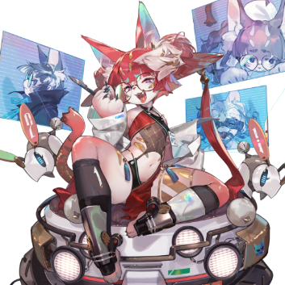
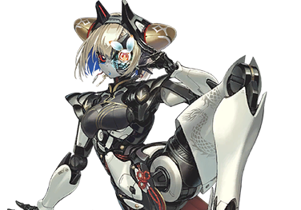
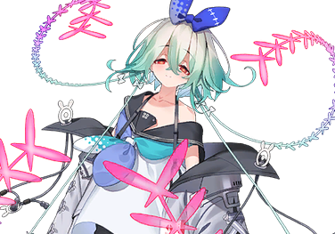

# 林内

| 角色信息   |  |
| ----------- | ----------- |
| 名称    |林内
| 年龄   |  外表年龄8岁
| 职业 |  无|
| 对应曲   | 旅星に渇く
| 对应版本 | Chunithm VERSE

## Episode 1 实验体006

—— 嗡、嗡…… 嗡。

 

耳畔深处回荡着低沉的声响，“它”缓缓睁开了眼睛。

模糊的视野中，是一片泛着淡蓝色的世界。

随着意识慢慢地清晰起来，“它”意识到了，自己正全身浸泡在某种液体里。

这液体不冷不热，甚至可说有些舒适。但下腹传来的阵阵凉意，却足以让“它”感到一种不快。

随着一阵刺痛袭来，“它”往自己的下半身望去，映入眼帘的，却是一条与自己相连的管子——

（——！？）

剧痛骤然席卷全身。

“它” 拼命扭动身体，想挣脱那根管子，可身体却完全不听使唤。

 

——哐、哐…… 哐。

 

耳鸣声越来越响，比刚才还要更甚。

仿佛被针扎般的锐痛，沿着全身蔓延开来。

 

——咕叽、咕…… 咕叽……。

 

在头脑中，“它”感觉到了有什么别的东西正在里面爬动着的感觉，那东西每动一下，剧痛就随之加剧。

 

（不要，我不想死！）

 

当“它”在液体里疯狂挣扎的时候，却在向上浮动的水泡对面，看到了一个人影。

“它”拼尽全力地往人影所在的方向扑了过去。

那人影的真身，是个眼角泛着泪光的女人，她的脸上交织着不甘与痛苦，紧抿的嘴唇像是在拼命压抑即将溢出的呜咽。

 

（救——救我，救——、我——）

 

“它” 张着嘴，向女人求救，可这份恳求终究没能传递过去。

“它” 终于耗尽了力气，纤细的四肢失去了力气，在液体中缓缓漂浮着。

 

——嘀!嘀！嘀！

 

圆柱形的房间里，刺耳的警报电子音骤然响起。

然而房间里的人们却没有任何反应。

仿佛就像是司空见惯般，正在各忙各的研究者们，脸上都挂着一副满不在乎的表情，望向声音的来源。

警报声来自房间里并排摆放的、数个 “Ω” 形圆柱装置中的一个。

一个穿白大褂的女人走到圆柱前，透过顶部的玻璃观察内部的情况。

——在那被染成淡红色的液体里，躺着一个已经再也无法动弹的孩子。

 

“确认实验体006已死亡。”

 

女人的声音平淡无波，却带着一丝不易察觉的颤抖。

她假装扶了扶眼镜，拼命抑制着这份颤抖，不让它蔓延到全身。

 

“实验反应如何？”

“啊！”

 

听到身后传来主任的声音，穿着白大褂的女人强作镇定，连忙解释到。

 

“报，报告主任，反应还未知。推测是实验体体力不足以承受侵蚀，才导致死亡。”

“那就立刻去准备下一个实验体喵。”

 

被称作主任的女性说到这里，她停顿了一下，故意重重地叹了口气。

“艾比斯大人可是对我们寄予了厚望喵，我们可不能辜负这份信任喵。不论如何，都必须拿出成果来。你也不想变成这些‘实验体’的一员吧？”

 

就在这时，一声轻微的电子提示音响起。

从身后传来主任与人交谈的声音。

对话很快便结束了。白大褂的女人察觉到主任要离开的样子，连忙出声叫住对方。

 

“拉、拉维娜主任，您要去哪里？”

“听说城外出了点事喵。”

 

“怎么又是我……” 

名叫拉维娜的女性小声抱怨着，转身离开了房间。

留在原地的女人，用仍在颤抖的手，将指尖放到了控制台显示的 “废弃”键上。

## Episode 2 崭新的自己

被执行废弃处理的实验体006，顺着通往城外的下水道漂流，最终流到了净化处理设施外的取水口。

这里是将那些成为了研究废料的实验体等东西分解到分子级别，然后净化的设施。但是，如果想要进行完全的净化处理，还是需要花一些功夫的。

而这个取水口，就是为了控制废料处理的量而设计出来的，暂时的滞留所。

 

——哗啦……哗啦……

随着那些先来的“东西”被吸进处理口，取水口处的水位也开始剧烈变动。就在这连光线都无法抵达的漆黑环境中，那些曾是实验体的残骸在摇晃的水体中，不断撞击着壁面，发出令人毛骨悚然的声响。

就在这时，一个发着淡淡光芒的物体从水中浮了上来。

 

——哗啦！！

 

水花四溅，一张脸从水面探了出来——那正是本该死亡的实验体 006。

 

“……”

 

006并不清楚自己的身上发生了什么事，只能茫然地确认着自己的身体。

 

“我…… 为什么会……”

 

明明那时，自己分明感觉有什么东西从体内将自己啃噬殆尽一般，早就该被恐惧所吞没，惨死于水缸之中的。

可如今，那种痛苦早已消失无踪，只剩下在冰凉的水中漂浮着的感觉。

 

『——』

“！？”

 

脑海中突然传来一阵类似低语的感觉。虽然听不懂具体在说什么，但，006隐隐约约地从中明白了它的意思。

——你已经重获新生了。

 

“嗯。我知道了。”

 

006将从脖颈延伸出的、类似触手的感官器官向左右展开，接触了那些漂浮在水中的其他实验体残骸。

这些残骸逐渐与感觉器官融为一体——最终化作了包裹住006身体的衣物。

接着，它将感官器官向上伸展，确认触碰到取水口边缘后，猛地一跃，逃离了净化处理设施。

 

“好了。接下来该做什么？”

无论006如何追问，脑海中的低语都没有再回应。

“……”

 

006没有过多在意，开始整理起了自己迄今为止发生的所有事情。

可脑海中闪过的画面，只有被关在某个容器里的自己、从容器中看到的景象，以及那张曾窥探自己的女人的脸而已。

 

“我不明白。我究竟应该做什么？”

 

就在 006 茫然地望着天空时，它发现远处有一道直冲天际的光带。

 

“我感觉……我应该去那里。”

 

为什么自己会这么想呢，006不得而知。

只是有一种本能的感觉催促着006自己做出行动罢了。

确定好目标的006，沿着水路的方向，向着黑暗中那道唯一的光芒走去。

 

“……！？”

 

突然，006 浑身汗毛倒竖，猛地回头望去。

身后空无一物，可它却清晰地感觉到了什么。

006快速地跨过水路，拼命地在黑暗中奔跑着。

向着那黑暗深处唯一的答案而前进。

## Episode 3 萌生的愿望

遵循着本能的指引，006在前行的路上，救下了正被一群男人袭击的两个人。

他们名叫威廉和艾莉尼，是一对看起来比006稍大一些的少年与少女。

“那个……你叫什么名字呀？”

 

面对艾莉尼的询问，006才意识到自己没有名字。当006把这件事告诉两人后，他们表示了深深的同情，还特意为没有名字的006，取了一个只属于它的名字。

——林内。

据说这个名字，是从艾莉尼喜欢的绘本作者那里引用的。对平时就喜欢给虚构角色或小精灵取名的艾莉尼来说，或许这只是一件稀松平常的事。但对006而言，这个名字却有着格外特殊的意义。

 

“林内。林内。林内……”

 

仿佛在印证这份特殊般，每当它轻声念出自己的名字，一股温暖的感觉就会缓缓漫过心头。

 

“林内。”

 

虽然不明白为什么会有这种感受，但林内自然而然地露出了笑容，打从心底感到喜悦。与此同时，一个念头也在它心中萌生。

想为这两个人做些什么。

于是，006决定主动开口询问他们。

 

“对了，你们要去哪里呀？”

 

在这片被黑暗笼罩的世界里，这本是无需特意询问的事——果然，两人的目的地，和006本能前往的方向一致。

 

“我知道路哦。”

 

当006说出这句话时，威廉和艾莉尼的脸上立刻露出了安心的神色。

太好了，他们很高兴。006的心里，再一次被温暖的感觉填满。

 

“林内认识那个地方吗？”

“嗯，我以前住在那里。”

 

006其实并不记得那个地方有什么，这句话也不过是顺着本能说出口罢了。但它觉得，这样说的话，两人一定会更开心。

 

“住在那里？那也就是说……只要走到那里，我们就能到达城镇，对不对，威廉先生！”

“是啊。这样一来……说不定能找到些线索。”

“我来给你们带路吧。”

“哇，真的可以吗？太感谢你了，林内！”

 

就这样，三人一同朝着那道直冲天际的光带进发。

* * *

过了一阵子。

三人终于抵达了光带的脚下。

眼前是一座被弧形高墙环绕的巨大都市。

虽然高墙遮挡了城市的全貌，但即便隔着墙壁，也能看到高楼群的灯火。霓虹灯与高楼的灯光相映成趣，交织出一幅诡异却绚烂的景象。

 

“往这边来。”

 

林内拉了拉正惊叹地望着高楼的两人的衣袖，朝着与墙壁相反的方向走去。

最终停在一处通往暗渠的入口前。

暗渠，即是埋在地下的水路。

由于生活废水与污水混杂其中，这类地方大多弥漫着独特的臭味。

这里也不例外。林内刚推开暗渠的门，一股刺鼻的恶臭便瞬间涌了出来，几乎要让人捏住鼻子。

 

“哇啊！？”

“唔……呃……”

 

威廉还能勉强适应，艾莉尼却显然被熏得不轻。她用手紧紧捂住口鼻，眼尾泛着泪光，拼命忍耐着。

 

“艾莉尼，没事吧？”

“……”

 

艾莉尼虚弱地点了点头。

 

“我知道了。那，跟我来。”

 

以林内为先导，三人踏入了巨大的地下空洞。他们脚下的路，是暗渠里专门修建的检修通道。

脚下流淌的水位不高，气温也比外面暖和些。

等他们抵达目的地，已经是进入暗渠的十几分钟后了。

 

“顺着这个爬上去，就能到城里了。”

 

林内身旁立着一架高大的梯子。

从细长的竖井顶端，隐约有光线透下来。

威廉试着把脚踩在梯子上，轻轻向上爬了几步。

梯子的结构看起来十分坚固，没有发出任何异响。

 

“嗯，应该没问题。”

 

艾莉尼点点头，小心翼翼地握住梯子，以缓慢的速度开始向上攀爬。

 

“……”

 

接下来该做什么呢？

林内望着正在爬梯子的两人，心里不由得泛起这个念头。

它当初只说要带两人到城市，如今这个“任务”眼看就要结束了。

这种时候，该露出什么样的表情呢？

林内的记忆里，没有任何答案。于是，它只好带着一种分不清是喜悦还是悲伤的、模糊的神情，默默目送着两人。

 

“林内——你不来吗——？”

“诶？”

 

听到威廉的声音，林内像被惊醒似的猛地抬头。

两人已经停下了攀爬的动作，正朝着它的方向回头。

 

“威廉……可以吗？我也能一起去吗？”

“当然啊。我本来就打算让你一起的……话说，你该不会想一声不吭地就自己走掉吧？”

“……”

 

林内完全没料到对方会这么说，一时不知道该如何回应，只能微微垂着眉梢，露出一副脆弱又茫然的模样。

 

“林内，你也没有别的地方可去吧？”

 

嗯。林内用细若蚊蚋、仿佛下一秒就会消失的声音应道。

听到回答，艾莉尼的脸上立刻绽放出了笑容。

 

“要是林内能一起来的话，我会很开心的！”

“我和艾莉尼想法一样。就看你的想法了。”

 

林内红色的瞳孔，像小波浪似的轻轻晃动着。

 

“我想和你们一起。”

 

就在这一瞬间，一个崭新的愿望，在林内的心底悄然萌芽。

## Episode 4 毛毛

顺着梯子爬上地面后，迎接威廉等人的，是被五彩霓虹与气体装点的高楼大厦，以及一群“人面兽身”的居民——他们被称为兽人种。

威廉等人难掩惊讶与兴奋，可兽人种张牙舞爪地向他们发动了攻击。就在这危急时刻，一道身影出现在他们面前。

她名叫<ruby><ruby>吉吉<rp>（</rp><rt>ジジ</rt><rp>）</rp></ruby><rp>（</rp><rt>ジジ</rt><rp>）</rp></ruby>，是服务于幻想都市NEON NEBULA的统治者的女性型机械人偶。

 

威廉等人穿过兽人种统治的区域，终于抵达了<ruby><ruby>吉吉<rp>（</rp><rt>ジジ</rt><rp>）</rp></ruby><rp>（</rp><rt>ジジ</rt><rp>）</rp></ruby>的主人“<ruby>毛毛<rp>（</rp><rt>モモ</rt><rp>）</rp></ruby>”所管辖的片区。

<ruby>毛毛<rp>（</rp><rt>モモ</rt><rp>）</rp></ruby>所居住的城池，与NEON NEBULA里那些风格杂乱的建筑截然不同，整体结构规整有序，给人一种秩序井然的感觉。

统一的象牙白墙壁，搭配温暖灯光照亮的楼宇，仿佛将这片空间与外界隔绝开来。若这是威廉原本生活的世界，说它是面向富裕阶层的高档酒店，也绝对有人相信。

 

“这边请。”

 

在<ruby><ruby>吉吉<rp>（</rp><rt>ジジ</rt><rp>）</rp></ruby><rp>（</rp><rt>ジジ</rt><rp>）</rp></ruby>的引导下，三人朝着入口走去。

三人无意间瞥见左右墙边站着的护卫。这其中，既有人类也有兽人——这些兽人与之前袭击他们的截然不同，举止知性，透着一种秩序感。

这正是<ruby>毛毛<rp>（</rp><rt>モモ</rt><rp>）</rp></ruby>的统治力渗透到基层的证明。

这时，威廉突然发现：这些护卫的面部特征，都属于草食动物。

虽然不确定这个世界是否存在“草食-肉食”的生态金字塔，但他总觉得，自己似乎隐约窥见了两类兽人之间历史纠葛的一角。

 

“……啊。”

 

威廉的目光与一名浑身覆盖灰褐色毛发的鹿头护卫对上了。对方投来略带责备的眼神，让威廉为自己方才用好奇目光打量他们的举动感到羞愧。

 

“这边请。”

 

在<ruby><ruby>吉吉<rp>（</rp><rt>ジジ</rt><rp>）</rp></ruby><rp>（</rp><rt>ジジ</rt><rp>）</rp></ruby>的催促下，威廉快步走进电梯。电梯在顶层停下，走出轿厢后，正前方是两扇装饰华丽的对开门。

 

“<ruby>毛毛<rp>（</rp><rt>モモ</rt><rp>）</rp></ruby>大人，我将客人带来了。”

 

没有回应，只有一声电子提示音响起，紧接着，大门缓缓打开。

 

“会是怎样的人呢……”

“我已经开始紧张了……”

 

三人被眼前庄重的氛围感染，脸上都露出紧张的神色。威廉为了转移注意力，在脑海中勾勒起了<ruby>毛毛<rp>（</rp><rt>モモ</rt><rp>）</rp></ruby>的形象。

（能住这么气派的地方，手下还有如此强悍的机械人偶，甚至统治着整座城市的一个片区……肯定是像黑帮电影里那样，满脸凶相的老大吧？“<ruby>毛毛<rp>（</rp><rt>モモ</rt><rp>）</rp></ruby>”这个名字，说不定也是为了让对手放松警惕才取的。）

可大门后方的景象，却完全超出了他的预料——

 

“嗯？”

 

房间给人一种莫名的“简洁感”。

空间虽然宽敞，却只有正中央的桌椅和沙发，没有任何多余的装饰。

更重要的是，本该在这里的“主人”，居然不见踪影。

 

“好像……没人啊。”

“这是怎么回事？”

 

就在众人困惑之际，<ruby><ruby>吉吉<rp>（</rp><rt>ジジ</rt><rp>）</rp></ruby><rp>（</rp><rt>ジジ</rt><rp>）</rp></ruby>走到桌子旁，对着空气躬身说道。

 

“<ruby>毛毛<rp>（</rp><rt>モモ</rt><rp>）</rp></ruby>大人，客人的名字从右至左分别是威廉大人、艾莉尼大人、林内大人。”

“嗯，辛苦了！”

 

一个尖锐的声音不知从何处传来。

 

“请问，<ruby>毛毛<rp>（</rp><rt>モモ</rt><rp>）</rp></ruby>大人您在什么地方？”

“在这儿呢，在这儿！”

“诶…………啊！？”

 

艾莉尼突然注意到，桌子上方的架子深处，放着一把小小的椅子。

椅子上坐着一个“小东西”——在那脑袋上嵌着一只巨大的单眼，还长着耳朵和身体，正盘腿坐着。

 

“啊！？”

“哇……”

“？”

三人反应各异，而<ruby>毛毛<rp>（</rp><rt>モモ</rt><rp>）</rp></ruby>则从椅子上飘到空中，抱臂轻笑。随着她的动作，右耳上戴着的金色耳饰闪烁着微弱的光芒。

 

“呵呵，真有趣。”

“请、请问您就是<ruby>毛毛<rp>（</rp><rt>モモ</rt><rp>）</rp></ruby>大人吗？”

“没错，我就是<ruby>毛毛<rp>（</rp><rt>モモ</rt><rp>）</rp></ruby>！”

 

<ruby>毛毛<rp>（</rp><rt>モモ</rt><rp>）</rp></ruby>说着，在原地转了一圈。

她身上那件纯白的外套随之而动，看见此景的林内，不禁小声嘀咕了一句可爱。

 

“林内，你也这么觉得吗！”

 

艾莉尼似乎对自己和林内在可爱东西的感性一致这点感到欣喜。

看着两人手贴手相视而笑的样子，威廉赶紧提醒了他们。

 

“喂，你们俩，对着‘老大’说‘可爱’什么的，也太失礼了吧。”

“呵呵，眼睛比嘴巴诚实的多哦。你啊，其实也很在意我的样子，对不对？”

 

<ruby>毛毛<rp>（</rp><rt>モモ</rt><rp>）</rp></ruby>说着，故意在威廉面前转了一圈。

威廉下意识地用目光追随着她，却突然与她那圆溜溜的大眼睛对上。

 

“啊！”

“突然大呼小叫干什么，吵死了！”

 

威廉这才猛然反应过来——街上广告的那个形象，就是<ruby>毛毛<rp>（</rp><rt>モモ</rt><rp>）</rp></ruby>。

之前那种“似曾相识”的感觉，终于有了答案。

他差点脱口而出“这个世界居然有会说话的海天使”，连忙岔开话题。

 

“啊，街上看到的那个广告，原来就是您啊……”

“没错。这座NEON NEBULA，是由三个势力共同统治的。”

<ruby>毛毛<rp>（</rp><rt>モモ</rt><rp>）</rp></ruby>的语气突然变得低沉，开门见山地说道：

“看你们的反应，果然不是这个世界的人吧？”

“您、您怎么知道的！？”

“艾莉尼！怎么能自己说出来……啊。”

“呵呵，看来你们不擅长撒谎呢。”

 

威廉判断，再隐瞒下去也没有意义，于是决定坦白他们的来历。

## Episode 5 信赖与契约

“唔，本应在沙漠的世界战斗，却在不知不觉却转移到了这个世界……乍一听确实难以置信。”

 

<ruby>毛毛<rp>（</rp><rt>モモ</rt><rp>）</rp></ruby>说到这里顿了顿，轻轻叹了口气。

 

“虽然我想这么说，但结合你们突然出现在观测点的记录，再看看你们身上的东西，也由不得我不信了。”

 

话音刚落，<ruby>毛毛<rp>（</rp><rt>モモ</rt><rp>）</rp></ruby>的目光在威廉放在桌子上的私人物品以及艾莉尼之间来回移动——艾莉尼那独特的发色，在NEON NEBULA的人类种身上根本见不到。

 

“对于转移的原因，你们有头绪吗？”

“没有。”

“是吗。那你呢，又是什么人？”

 

<ruby>毛毛<rp>（</rp><rt>モモ</rt><rp>）</rp></ruby>坐回椅子上，转了个身，面向了林内。

 

“林内在水坝救下了被袭击的我们，还一路带我们到这里。”

“他是我们的救命恩人。”

 

仿佛呼应威廉和艾莉尼的话一般，林内一个劲地点着头“嗯嗯”。

 

“我已经从<ruby>吉吉<rp>（</rp><rt>ジジ</rt><rp>）</rp></ruby>那里得知客人从两人变成了三人……只是你……”

 

<ruby>毛毛<rp>（</rp><rt>モモ</rt><rp>）</rp></ruby>似乎对林内的来历有些印象。

然而，她却没有再追问下去，只是嘀咕了句“罢了”，便将话题拉回正轨。

 

“看来要查明原因，还是得追查另一个反应才行啊。”

“另一个……？难道是……”

“没错，在NEO NEBULA的外围，我们又在别的地方检测到了一样的反应。”

“怎么会……”

“难道那个人也在这里……”

 

威廉和艾莉尼明显慌了神，尤其是艾莉尼，脸色已经开始变得苍白。

 

“虽然不确定是不是你们想的那个人，但不查一查是不会知道的。<ruby>吉吉<rp>（</rp><rt>ジジ</rt><rp>）</rp></ruby>，进展如何？”

一直站在<ruby>毛毛<rp>（</rp><rt>モモ</rt><rp>）</rp></ruby>身边的<ruby>吉吉<rp>（</rp><rt>ジジ</rt><rp>）</rp></ruby>开口回答到。

“目前不明。观测点已经被艾比斯的人接管，但尚未有发现目标人物的报告。”

“是吗。”

“不过，若该人物也是来自其他世界的访客，他现在有可能还在山区移动，或是潜伏在城市的某个角落。”

 

听完<ruby>吉吉<rp>（</rp><rt>ジジ</rt><rp>）</rp></ruby>的汇报，<ruby>毛毛<rp>（</rp><rt>モモ</rt><rp>）</rp></ruby>下达了指令。

 

“<ruby>吉吉<rp>（</rp><rt>ジジ</rt><rp>）</rp></ruby>，去追查那个人的下落，你要带多少个护卫，尽管说吧。”

“遵命。”

“请等一下！”

 

就在<ruby>吉吉<rp>（</rp><rt>ジジ</rt><rp>）</rp></ruby>准备离开房间时，艾莉尼慌忙叫住了她。

 

“那个人……他在我面前拧断了维尔维奇亚（ヴェルウィッチア）小姐的脖子……<ruby>吉吉<rp>（</rp><rt>ジジ</rt><rp>）</rp></ruby>小姐，你一定要当心啊！”

 

或许是当时的画面再次浮现，艾莉尼捂着嘴蹲在了地上。

 

“艾莉尼！？”

“艾莉尼，你没事吧？”

 

尽管林内扶住了她，但艾莉尼的身体依旧虚弱无比，仿佛下一秒就要不省人事。

 

“<ruby>毛毛<rp>（</rp><rt>モモ</rt><rp>）</rp></ruby>小姐，我有个请求。”

“什么事？”

“艾莉尼这一路上一直被追杀着，我想找个能让她安心休息的地方。如果可以，还希望能提供些换洗衣物和食物。”

 

<ruby>毛毛<rp>（</rp><rt>モモ</rt><rp>）</rp></ruby>故意重重地叹了口气，用无奈的眼神看着威廉。

 

“你这小子还真贪心啊……那，你打算用什么作为交换呢？”

“情报。关于我原来世界的事，我什么都可以说。如果还不够，让我做什么都可以。”

 

威廉很清楚，这样的交换条件并不对等，但他实在没有其他能拿出来的东西了。

 

“我也可以帮忙！”

“多一个小鬼也没什么区别。不过嘛……就算多三个吃闲饭的，我的钱包也不会有太大负担，这倒是真的。”

“那……”

 

<ruby>毛毛<rp>（</rp><rt>モモ</rt><rp>）</rp></ruby>最终还是答应了威廉的请求。

 

“<ruby>吉吉<rp>（</rp><rt>ジジ</rt><rp>）</rp></ruby>，先带他们两个去楼下的房间吧。”

“遵命。”

 

说完，<ruby>吉吉<rp>（</rp><rt>ジジ</rt><rp>）</rp></ruby>抱起艾莉尼，和林内一起离开了房间。

威廉也想跟上去，然而，身后却传来了<ruby>毛毛<rp>（</rp><rt>モモ</rt><rp>）</rp></ruby>的声音。

 

“还有事吗？”

“我们之间，总得定个契约吧。难道说你们的世界不签契约吗？还是说，你们那里都是些只靠口头约定就办事的马虎家伙？”

“啊……”

 

<ruby>毛毛<rp>（</rp><rt>モモ</rt><rp>）</rp></ruby>靠在椅子上，操作了一下扶手旁的装置，一道投影出现在威廉眼前，上面写满了契约的内容。

虽然他完全看不懂那些文字，但<ruby>毛毛<rp>（</rp><rt>モモ</rt><rp>）</rp></ruby>特意口头解释了一遍，让他得以理解。威廉听完所有条款后，在投影上签了名。

 

“这样契约就生效了。”

“谢谢你。今后请多关照，<ruby>毛毛<rp>（</rp><rt>モモ</rt><rp>）</rp></ruby>。”

 

威廉向<ruby>毛毛<rp>（</rp><rt>モモ</rt><rp>）</rp></ruby>伸出了手。

 

“这是做什么？”

“握手。在我的世界里，既可以用作问候，也会在契约达成时使用，代表着我对你的信任。”

“哦？”

 

<ruby>毛毛<rp>（</rp><rt>モモ</rt><rp>）</rp></ruby>飞到威廉面前，将两只小手放在了他的大拇指上。

 

“这样就可以了吗？”

“嗯。”

 

指尖传来一丝冰凉的触感。

威廉虽然不知道<ruby>毛毛<rp>（</rp><rt>モモ</rt><rp>）</rp></ruby>心里真正的想法，但至少，他已经传递了自己最真挚的心意。

他真心希望这段关系能长久下去，于是再次对<ruby>毛毛<rp>（</rp><rt>モモ</rt><rp>）</rp></ruby>说了声“谢谢”。

## Episode 6 你与我如此相似

威廉一行人被<ruby>毛毛<rp>（</rp><rt>モモ</rt><rp>）</rp></ruby>以客人之礼遇所对待。

尽管他们的行动必须“处于<ruby>毛毛<rp>（</rp><rt>モモ</rt><rp>）</rp></ruby>的监视之下”，但这份待遇依旧堪称破格——不仅提供衣食住行，若有需要，甚至还会准备货币。

 

与<ruby>毛毛<rp>（</rp><rt>モモ</rt><rp>）</rp></ruby>签订契约后，威廉朝着艾莉尼和林内等候的房间走去。

他原本以为三人会分到各自的房间，可当他向<ruby>毛毛<rp>（</rp><rt>モモ</rt><rp>）</rp></ruby>提起这件事时——

 

“蠢货！要是艾莉尼身边没人看护那要怎么办！”

 

<ruby>毛毛<rp>（</rp><rt>モモ</rt><rp>）</rp></ruby>瞪圆了眼睛如此怒吼着。

经<ruby>毛毛<rp>（</rp><rt>モモ</rt><rp>）</rp></ruby>这么一提醒，威廉才决定留在艾莉尼身边陪护。

 

“话说回来……这房间也太大了吧。”

 

据说这一层是专为“特殊客人”准备的，房间之间的间隔格外宽敞。

走廊里站着负责保护他们的护卫。

威廉一边向他们点头致意，一边往前走，终于抵达了房间门口。

门无声地滑开，室内的豪华与宽敞程度，可以说与巨型都市·利布拉的高档酒店房不相上下，甚至更胜一筹。

 

“以前我打零工赚的钱，连在利布拉住个普通旅馆都费劲……”

 

脚下突然碰到什么东西，威廉低头一看，发现艾莉尼和林内的鞋子正并排放在门口。

他学着两人的样子脱了鞋，走向客厅——可宽敞的客厅里却空无一人。

 

“大概是太累，已经睡了吧？”

 

威廉沿着客厅连通的走廊往前走，很快找到了卧室，可卧室里也没有两人的身影。

 

“艾莉尼——！林内——！你们在哪儿啊！？”

“——啊！”

 

威廉仿佛听到了艾莉尼的惊呼。他顺着声音望去，才发现卧室深处还有一条走廊。

 

“艾莉尼！”

就在威廉穿过床边、朝走廊深处跑去时——

 

“啊，威廉先生！欢迎回来！”

“欢迎回来！”

 

先是传来水溅起的声音，紧接着，浑身湿透的艾莉尼和林内从走廊另一头蹦了出来。

 

“……！？”

 

一丝不挂的两人，正毫不顾忌地向着这里跑来。

 

“威廉先生，这个房间超棒的！有好多热水呢！”

“等、等一下啊喂！？！？！？”

 

威廉猛地别过脸，紧紧闭着眼睛向着二人大喊。

 

“你、你们俩快把衣服穿上！”

“怎么了呀，威廉先生？”

“威廉，你眼睛疼吗？”

（没看见，我什么都没看见！）

 

威廉在脑海里拼命地让自己保持冷静，然而，在那短暂的瞬间，从两人那濡湿的头发间露出的肌肤——不论是艾莉尼雪白色的肌肤，还有林内的樱粉色肌肤，这些画面却久久不能从威廉脑中散去。

 

“你、你们为什么光着身子跑出来啊！”

“我们在泡澡呀！威廉先生也试试吧，泡完之后疲劳全都不见了，超舒服的！”

“威廉，一起泡吗？”

 

艾莉尼和林内显然没理解威廉提问的重点，可现在没时间解释了。

 

“我、我知道你们泡的很舒服了！总之现在立刻擦干身体，把衣服穿上啊！”

 

后来，在威廉的苦苦恳求下，两人终于乖乖照做。

威廉还特意叮嘱了她们“不在别人面前光着身子”“别跑以免滑倒”“别把房间弄湿”等注意事项。

等两人洗完澡出来，威廉才独自走进浴缸，好好洗一下身上的尘土。

浴缸比普通人类用的大得多，想来是考虑到体型高大的兽人使用的场合吧。

 

“今天真是够折腾的啊……”

威廉望着被水汽模糊的天花板，享受着这片刻的安宁。

* * *

洗完澡的威廉小心翼翼地避开熟睡的两人，穿过卧室来到阳台。

阳台十分宽敞，如果摆上桌椅，感觉立刻就能开一场小型派对了。而从阳台眺望到的景色，更是美得难以用语言形容。

——这般梦幻的景象，让威廉再次清晰地意识到，自己真的来到了异世界。

 

“我们真的能回到原来的世界吗？”

 

威廉轻轻叹了口气，深吸了一口微凉的空气。

冷风拂过温热的身体，带来恰到好处的凉爽。

 

“——威廉先生，泡澡泡的舒服吗？”

“啊……抱歉，是不是把你吵醒了？”

 

“没关系的。”

艾莉尼用温和的语气说着，走到了威廉身边。

“能和你聊聊天吗？”

 

阳台被上升的气体折射出的霓虹灯光照亮，两人终于能够说出那些一直未曾说明的事情了。

话题渐渐聊到了艾莉尼曾经生活的地下都市。

 

“现在我终于明白，你为什么看到浴缸会那么开心了。”

 

了解了艾莉尼的生活环境后，威廉心中的许多疑问都有了答案。

在艾莉尼原来的世界里，为了不浪费电力，人们必须多人一起洗澡。

因此，根本不存在为个人或少数人设计的浴缸。

 

“抱歉刚才那么兴奋……还有，我以后会注意不光着身子乱跑的。”

“嗯、嗯……”

 

威廉含糊地应着，有些不好意思地红了脸。

 

“嘛，先不说这个了。”

 

为了缓解尴尬，威廉主动切换了话题。

他聊起自己原来的世界，聊起身边的好朋友，话题一个接一个，仿佛永远说不完。

两人最感兴趣的，是关于绘本和电影的事。

威廉好奇艾莉尼读过的绘本，艾莉尼则好奇威廉喜欢的电影。

这种分享与创作相关的情感的过程，就像两人一起将名为“各自人生”的拼图，一片片拼凑起来。

 

“不知道为什么……和你聊天，我完全没有‘陌生人’的感觉。”

“呵呵，其实我也有这种感觉呢。”

 

这种默契或许是两人无意间达成的，但究其根本，还是因为彼此都对对方的世界充满好奇。

一阵欢笑过后，威廉放低了语气，问出了一个更深入的问题：

 

“艾莉尼，你很想回到有妈妈在的世界，对吧？”

“……嗯。”

 

艾莉尼深吸一口气，说出了自己几乎快要放弃的心愿。

 

“我想再见到妈妈。同时，也想知道那天在索拉里斯到底发生了什么。”

 

她的声音带着一丝颤抖。

在艾莉尼倾诉的过程中，威廉始终没有插话——他知道，安慰的话随便就能说出口，可那些话根本解决不了任何问题。

两人之间陷入了沉默。

但这份沉默并不让人压抑，反而有种莫名的安心。

## Episode 7 终有一天

“威廉先生有想见的人吗？”

 

艾莉尼打破了沉默。

威廉故作思考了片刻，平静地开了口。

 

“我有想见的人——不，是必须要见的人，那是一个‘怪人’。”

“‘怪人’？”

 

听到陌生的词汇，艾莉尼歪着脑袋反问。

威廉似乎早料到她会有这样的反应，脸上露出一丝自嘲的笑容。

 

“我第一次见到那个怪人，还是个小孩子的时候。他能操控银色的发光液体，还能自由改变形态。”

 

说着，威廉将伸直的食指抵在太阳穴旁，模仿起怪人的样子。

 

“他的头就像这样向上弯，形状跟回旋镖差不多。”

 

威廉一本正经的表情，配上滑稽的模仿动作，让艾莉尼忍不住笑出了声。

 

“那、那个，威廉先生见到他之后，想做什么呢？”

“我有话要问他。我想知道，那个怪人到底对父亲做了什么，还有我的眼睛的事情。”

 

那是威廉年幼时的事情。

他的父亲是个沉迷研究的人，别说一天，有时连好几天都不回家。

所以威廉几乎没有和他一起玩、或是被他关心的记忆。

直到有一天，我偶然看到了那个操控银色液体的怪人。

威廉想，要是把这件事告诉父亲的话，说不定会就会对自己产生兴趣。

可没想到，父亲听完后脸色大变，突然就失踪了——

 

“后来我再次见到爸爸时，他已经变得像完全变了个人。所以我一定要找到那个怪人，问清楚他到底对爸爸做了什么。”

“那这和你的眼睛有什么关系呢？”

“因为我能看到一些不可思议的东西。”

 

威廉提起了在水坝被那些男人袭击时的事：

 

“你还记得吗？当时我问过你看到了什么。”

 

艾莉尼抬眼望着天空，小声嘀咕了一句“说起来好像是有这么回事”。

 

“嗯。当时在你的眼里，他们也许跟普通的人类别无二致，但在我的眼中，他们的头却是半透明的。”

“诶？”

“就像你拥有空间移动的能力一样，我拥有看到、并且触碰那些‘奇怪事物’的能力。”

“难道说，当时只有你能看到那个怪人吗？”

“似乎是这样。”

 

威廉眼神飘向远方，轻声说道。

他本想努力不让自己的声音变得低沉，可这份情绪似乎还是传递给了艾莉尼。

不知为何，艾莉尼突然在原地转了个圈。

 

“艾、艾莉尼？”

“威廉先生，你是怎么看待现在的我的？”

 

她眨着眼睛，抬头望向威廉。

在NEON NEBULA的光影下，她那双大眼睛似乎与那光芒交融在一起，眼瞳中映照出的，是宛如小星云一般的光芒。

仿佛再多看一会，就会被这双眼睛吸进去一般。

 

“……亮”

“威廉先生，你刚才说什么了呀？”

“很漂亮啊……——啊！不对！把刚才那句话忘了吧！”

 

威廉感觉脸颊瞬间发烫，像是要被太阳烤化一般。

他慌忙转过身，将双臂撑在阳台栏杆上，接着把脸埋进手臂间，深深吸了一口气。

 

“威廉先生？”

 

当威廉再次转向艾莉尼时，脸上露出了灿烂的笑容。

 

“谢谢你为我加油打气，艾莉尼。”

“我、我其实不是这个意思的……不过，要是威廉先生能打起精神来，那就太好了。”

 

为了在这个陌生的世界生存下去，两人重新确立了各自的目标。

威廉要找到怪人，问清楚关于父亲和自己眼睛的真相。

艾莉尼要回到索拉里斯，确认母亲是否平安，以及那天到底发生了什么。

威廉的世界、艾莉尼的世界、荒芜大地与NEON NEBULA——或许还有更多他们不知道的世界存在于某处。

哪怕只是找到从这里返回原世界的方法，恐怕都困难重重。

但两人坚信，总有一天能找到线索。

因为他们相信，只要一个个解开心中的疑问，终有一天能找到自己的前路。

 

“对了，威廉先生的爸爸，叫什么名字呀？”

“啊……说起来我还没告诉你呢。我爸爸的名字是埃弗——”

 

就在威廉即将说出父亲名字的瞬间，他忽然感觉阳台对面的全息广告有些不自然地闪烁。他眯起眼睛，仔细观察着。

 

“怎么了吗？”

“刚才，那边好像有什么——”

 

——吱——————！！

突然，一阵刺耳的尖啸声划破夜空。两人被这毫无预兆的声波冲击得捂住头，当场跪倒在地。

 

“啊……”

“唔……怎、怎么回事！？”

“嗯？作为人类种，你们倒是挺顽强的嘛。”

一个女人的声音从空中传来。

威廉皱着眉抬头望去，只见一个兽人坐在飞行圆盘上，嘴角挂着挑衅的笑容，正居高临下地看着他们。

## Episode 8 不速之客

就在威廉与艾莉尼站在阳台上，下定了决心的时候，一名女兽人突然对他们发动了奇袭。

她将露着肉垫的手指向威廉，居高临下地喊到。

“我是拉维娜·基顿！也就是IDC的天才主任研究员！来自异界的侵略者们，你们的性命就由我——喵！？”

 

然而，根本没人理会拉维娜的叫唤。

早在她自报家门时，威廉和艾莉尼就被林内抱着，逃进了屋内。

 

“你、你们竟敢无视我喵！真是不知天高地厚的家伙喵！！”

 

拉维娜怒吼着，朝着客厅方向从圆盘上发射声波。可那些声波被大楼的防御系统轻易拦截，连一丝涟漪都没掀起。

 

“喵啊！？那家伙……我都把话说得那么清楚了！怎么能擅自发动攻击喵！所以我才讨厌人类种啊喵！”

 

拉维娜在圆盘上直跺脚，却很快冷静下来。她操控圆盘发射出搭载的无人机，试图干扰防御系统。

 

“绝对不会让你们逃掉的喵～！”

 

与此同时。

从卧室逃到客厅的威廉一行人，听着身后传来的刺耳刮擦声，冲向了有护卫驻守的走廊。

走廊光线昏暗，仅够视物；房间外，一名护卫正举着枪，守在架起的长方形路障后。

他注意到威廉等人的身影，慌忙喊道。

 

“你们怎么出来了！外面很危险，快回房间里去！”

“回不去了！房间正在被人攻击！”

“什……什么！？”

 

听完林内结结巴巴的解释，护卫立刻行动起来。

他单手扛起金属路障，说道“跟我去<ruby>毛毛<rp>（</rp><rt>モモ</rt><rp>）</rp></ruby>大人所在的地下室”后，便在前方带着三人向前走。

威廉终于缓过劲来，向护卫问到。

 

“到底发生了什么事？”

“有一个人类种单独发动了袭击。我们本以为能很快制服的，可那人不知用了什么诡异的能力，我们的防线被接连突破……”

 

——诡异的能力。

符合这样描述的，只有那个人。

艾莉尼的脑海里瞬间想起了被那个褐色皮肤的男人袭击的记忆。那个人，在她刚抵达维尔维奇亚家不到一天时就出现了。

即便她靠<ruby>跳跃<rp>（</rp><rt>TELEPORT</rt><rp>）</rp></ruby>的能力在沙漠里拼命逃窜，对方也总能精准地追上来。

那个男人是这么说的——“你的位置我一清二楚”。

 

“我、我怎么会把这么重要的事……”

 

——轰隆！！

 

就在这时，通往电梯厅的走廊墙壁突然崩塌，碎石飞溅了出来。

一块碎石径直砸中走在前面的护卫，将他狠狠撞向对面的墙壁。

 

“唔啊……！？”

“你没事吧！？”

威廉正要上前搀扶，一道尖锐得刺耳的声音却打断了他。

“喵哈哈哈哈！还想往哪里逃呀？”

 

拉维娜的身影，从崩塌的墙壁后方走了出来。

 

“可恶……！？”

“已经晚啦喵！”

 

圆盘底部伸出一条机械臂，直逼威廉。

就在机械臂顶端的四根“手指”正要抓住他的瞬间——那东西却突然僵在了半空。

 

“喵！？”

 

只见林内像一道屏障般，突然挡在了拉维娜与威廉之间。他泛着微光的感官器官死死缠住机械臂，死死不肯松手。

 

“威廉，这里交给我吧。”

 

林内的声音不再像往常那样清脆如铃，反而带着一丝冰冷的决绝。

 

“林内……？”

“林内先生！？”

“没时间了，快逃！”

 

威廉简短地应了声“知道了”，便扶起护卫的肩膀，转身往回跑。

林内目送着威廉与艾莉尼渐渐远去，才缓缓转向拉维娜。

 

“那、那个感觉器官……你一个实验体怎么会在这里喵！？”

“你认识我？”

“想知道喵？那就乖乖把那些人类种交出来喵！”

“不行。”

 

林内眼神茫然地微笑着，将感官器官向左右展开。

“他们，由我来保护。”

“好大的口气喵啊啊啊！！”

 

拉维娜展开所有机械臂，朝着林内猛冲过去。缠斗在一起的两人互相拉扯着，最终一同消失在了墙壁的另一侧。