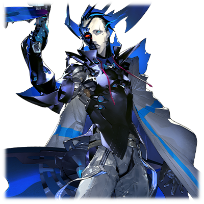

# 亚哈

|
角色信息 
  |          |
| ----------- | ----------- |
|  名称 |亚哈
|年龄 |推定为80岁（已经超过了使用年限，目前正依靠机械化的身体维持生命）
|职业|真人强硬派“革新者”的领导者
|对应乐曲|雪男
|初出|Chunithm NEW
CV|堀川亮

## Episode 1 绝望的时代

>让大地重获新生，是我等的使命。然而，这也不过是神赐予我们的虚假的幸福而已。

——虽然无法理解那个人所有的愤怒和悲伤，但是，那份痛苦，不论如何都要传递出去——

在旧人类种被毁灭，最终步入电子的乐园之后，让荒废的旧世界再生的任务，就落到了我们“真人”身上。

由机械装置的神明制造出来的我们，从一开始就被赋予了这一职责，而且坚信完成这一职责是我们无上的荣幸。

我们相信，在大地完成再生之后，我们将会成为这片大地的后继者而生活下去。

  
我第一次对这个理想感到了违和，是我的身体即将到达使用年限的时候。

我们从某个时期的世代开始，就被赋予了自我意识，并且被要求根据自己的判断完成大地再生这一重大任务。

身为医生，同时也是研究者的我，相比较最新的世代，使用年限要短得多。但我并没有什么方法，只能默默地等待着自己的死期到来。

  
然而，我内心中的自我意识却又驱使着我延长自己的寿命。于是，我对自己的身体，实施了机械化的手术。

就在这时，我第一次触及到了真实。

与此同时，我也完全理解了一切。

那些支配者们，从来就没有想过将大地交给我们，只是把我们当成修复这片大地的道具罢了。

## Episode 2 革新者

>他们只是把我们当成用完即弃的道具而已。那么，只有我自己向这个世界掀起变革了！

根据自己将自己的身体改造为机械的过程所获得的知识，我开始了对真人身体的解析工作。

最终我得到的结论，那就是——“机械种从一开始就并不打算给予真人繁荣的可能”这一事实。

明明是模仿人类，十分精巧地制造出来的产物，但真人却独独被省去了“生殖能力”这一项能力。

所以，不论是生，亦或是死，这一切都是在机械种的掌控之中。

可以说，这与将自己的人生完全奉献给机械种无异。

  
这是我第一次对创造出这个世界的规则的神明——也就是那些机械种，感受到愤恨。

他们所做的事情，不过是对世世代代修复着大地，为此奉上无数生命的我等的，背叛和亵渎而已。

怎么能够允许如此残忍的事情继续上演呢。

如此不可理喻，如此草菅人命。怎可允许这样的世界存在呢？

  
——于是我下定决心。

要将那些说谎成性，只会将虚伪的话语挂在嘴边的神明赶尽杀绝，成为通过自己的双手拯救真人的指导者。

如果是为了这个目的的话，我愿意奉上我的“一切”。

我的生命，我的身体，以及——我的时间。

奉上我这残存下来的一切东西。

  
之后，我走遍了整个世界。

我见到了试图从机械种的支配下逃离的人，也见到了对机械种的暴行而愤怒的人。

我与他们同悲喜，同进退。他们接受了我的思想，来到了我的旗下。最终，我们终于组成了一个巨大的势力——最终，这个势力被人取了一个名字。

向神揭竿而起的势力之名——<ruby>革新者<rp>（</rp><rt>INNOVATOR</rt><rp>）</rp></ruby>。

这，就是即将为世界带来革新的人们的名字。

## Episode 3 为了所有种群的未来

>我无论如何都必须要完成才行。怎么可能就这样一事无成地死去呢！

除了指挥革新者以外，与我有着共同志向的研究者们，和我一起开始探索起了如何脱离机械种的依赖保存种群的方法。

  
被故意剥夺的，真人的生殖能力。

首先，必须想办法夺回这一机能才行。

如果想要解明其中奥秘，果然还是要和身为原型的人类进行研究，比较才行。

残留在地上的旧人类种，绝大多数都是和机械完成了融合的“混合物”，但是，地下都市之中还是残留着一些逃离了神的审判的幸存者们。

如果要研究的话，势必需要众多的样本。

男女老幼，各色人等。

不管是什么样的样本，我都毫不例外地收集起来，持续进行着实验。

为了解明“机能”的原理，我不厌其烦地进行了无数次，无数次，无数次的实验。

尝试着旧人类种和真人之间的“可能性”，通过不断的“替换”，尝试着让这一“机能”再现。

但是，不论怎么尝试，都没有成功。

不管牺牲再多的真人的身体，也未能得到令人满足的结果，我的妻儿，也在这期间，成为了不归之人。

  
时间的流逝是无法抵抗的。

我大部分的身体，都为了延长寿命替换成了机械的零件。

即便如此，我却未能留下一点成果。

而这，才是对我来说最恐惧的事情。

我难道就要这样迎来我的死期了吗？

  
——就在这个时候。

就在我行将就木的前夕，我终于找到了一丝光明。

  
——也就是我的女儿“拔示巴”的诞生。

欢喜涌上心头，令我为之颤抖。

  
终于……终于！！

我等的悲愿说不定就要在此实现。真人的历史，通往未来的希望，就要在我的手中……！

如果我们能夺回生殖机能的话，那么从机械种的支配之中解放真人，也将不再是梦了！

  
但是——她的诞生终究只是偶然的奇迹产物而已，无论如何都无法再现。

即便重复了无数次，也未能像拔示巴那样诞下同样的孩子。

为什么？为什么做不到！？

我究竟是漏掉了什么！？

在无数次的失败之中，我的生命也在渐渐地走向尽头。

“再……再这样下去的话！”

绝不能让这道希望就此断绝。

我等存续于世的希望，一定要靠这双手获得才行！

如果为了这个目的，即便要我化为恶鬼罗刹，我也在所不惜。

## Episode 4 全新的人类种

>这就是机械种所提供的答案吗。那么，我等就只有将其斩尽杀绝而已。

我的孩子，拔示巴，展现了真人能够存续于未来的可能性的，唯一的存在。利用她的遗传因子，我对众多与她年龄相仿的人们进行了**各种各样的实验**。

这个实验有着崇高的目的。

然而，不论我再怎么诉说，幼年时期的拔示巴去并未表示任何的理解。

不但如此，她甚至还曾试过**自己选择放弃自己那神圣的身体**。

  
这几乎等同于舍弃了我等未来的这一行动，令我无比恐惧。

为自己从一开始就进行了“处理”而感到安心。

  
在这之后，拔示巴虽然不再像以前那样活泼开朗，但似乎是终于开始意识到自己身体的神圣了吧。

在那以后，即便各种各样的**实验**，她也乐于献身于其中。

但就在此时，新的问题产生了。

突然，一个被称为“归还种”的新物种，出现在了这片大地上。

而保护它们的，是那些愚蠢的稳健派的真人们，还有那些现在仍然作为支配着君临天下的机械种。

这一切，都必须从这片大地上驱逐出去才是。

  
——在奥林匹亚斯的大圣堂之中的一间白色房间。

拔示巴正坐在房间中，眺望着窗外的世界。

“拔示巴。我将率领军队攻下机械种的大本营，佩尔修斯殖民地。当机械种被赶尽杀绝的时候，这个世界就是你的了。你，要成为统治这个世界的女王。”

超越了真人的她将成为王，将世界带入一个崭新的阶段。

“呵呵……女王，吗。那还真是厉害呢。”

“是吧？所以，为了成为真人们的救世主，你有着繁衍后代，授予子孙的义务。这一切，也是为了铸造真人们的千年王国啊。”

“……”

看来她还未能理解我的真实意思。也罢，那一刻始终会到来的。

“那么，我走了。”

“我期待着你的好结果哦。”

当我走出大圣堂的时候，随着一阵风，传来了拔示巴的歌声。

那通透的声音，就像是在祝福着从奥林匹亚斯出征的我们一样，在晚霞染红的天空中回荡着。

## Episode 5 背弃神明之人
>在我等面前出现的是超大型的机动兵器。既然要站在我等的悲愿前方的话，那就将其打到体无完肤为止！

当我们从奥林匹亚斯率领船团前往佩尔修斯殖民地的时候，我们船团所遭遇的，是可谓之晴天霹雳的紧急事态。

“怎么可能……！？”

出现在我们面前的，是一尊青蓝色的巨大身躯，那个东西，比矗立于地上的构造体要大得多，释放着无与伦比的存在感。

那宽大，厚重的钢铁巨剑和盾牌，以及发出怒吼的恐怖模样，简直就像是为世界带来毁灭的神的使者一样。

——歼灭兵器、机动兵器。眼前的这个东西有着各种各样的叫法。

传说这些存在埋藏于各个地下都市，是机械种为了抹杀旧人类而制造出来的遗物。

“没想到，居然会在这里遭遇灾厄的机神啊……”

  
这已经不是能从战术层面应对的敌人了。

但是，眼前的东西已经将我们彻底当成了敌人。

已经没有回避战斗的方法了。

说到底，要是就在这里打退堂鼓的话，那这也就意味着对机械种俯首称臣了。

  
“亚、亚哈大人，我们该怎么办……！”

“全体舰队，立刻转向！集中炮火攻击敌人，抢占先机！”

  
变换阵型，我们立刻进入了迎战态势。众人合力的炮击，在命中机动兵器之前，就被巨大的盾牌挡住了。

  
“竟然能挡住我们的攻击！赶紧准备下一轮的炮弹！”

  
既然无法从那个距离攻击过来的话，那么那个东西说不定只能进行近距离的白兵战。

那么，在那个东西接近之前，只要倾泻炮火将其击溃就行了。

然而，机动兵器却远在我的思考之前就采取了行动。

  
“竟然是爬升？难道说……通告全舰队！立刻拉开距离，回避攻击！”

  
机动兵器飞到了遥远的高空之中。

而当这个东西再次现身的时候，展开阵型的大部分船团，都被从天而降的钢铁巨剑卷入，吞噬，沉没。

  
“这就是机动兵器的力量吗……！？”

  
敌人竟然还有这样的战力……。

但是，要是连这点宿命都无法打破的话，那反抗身为神的机械种也不过只是痴人说梦罢了！

一定有方法能够突破目前的局势的。

  
“……嗯？那个是？”

  
仔细一看，机动兵器的各个部分似乎在散布着烟雾的样子。

——原来如此，那台机器也似乎是大限已到了。

应该是机体的一部分遭到了腐蚀吧，战前的整备不过关啊。

那么，我们只要撑住攻势就行了。

这样的话，这场战斗的走向，终会倒向我方。

## Episode 6 对峙

>机械种啊，无论如何都要阻挡于我的前方吗。那么，你这可恨的存在，就由我的利剑下达审判吧！

战斗进入了白热化。

我们的舰队虽然损失惨重，但是突然失去了力量的机动兵器，似乎也是岌岌可危的样子。

矗立于眼前的机动兵器，就像是要鼓舞自己一般，举起了巨剑。

“——噢噢噢噢噢噢噢噢！！”

机动兵器发出了怒吼，宣告着自己仍有一战之力。

可恨的遗物……是把自己当成了审判者吗！

  
“嗯……只有那个机动兵器……那个古代的遗物，无论如何都必须要排除掉才行！”

残存下来的战力，是不足以攻下佩尔修斯殖民地的，不过——

  
“为了我等身后的子民们！”

  
绝不能在这里退缩！

即便耗尽一兵一卒，一枪一弹，也要将那个家伙击沉！只要失去了机动力的话，那东西就与铁块无异！

  
“决胜负吧！全炮门，齐射！”

  
炮弹如暴雨般倾盆降下，机动兵器舍弃了大盾，向着天空飞去。

即便装甲被炮火炸开，剥裂也毫不在意，机器只是举起了巨剑，向着前方突刺。而巨剑的剑尖，直指我等的旗舰。

  
下个瞬间。

旗舰与机动兵器互相碰撞，两者一同坠向地面。

随着船体的剧烈摇晃，身体也被甩了出去——

  
“……这里是——”

我的周围，已是一片被火海和废墟所包围的光景。

我到底是失去意识多久了呢，竟然能从那个爆炸中幸存下来……。

就在这时，我感觉到了身体的沉重。回头望去，原来，那些近卫兵们，为了保护我，献出了自己的生命，用身体帮我挡住了冲击。

  
“是吗……真是谢谢你们了。”

“——亚哈大人！您没事吧！”
  

似乎是残存的船团派出的搜索队的样子。但，我已经……

身体的各处传来了剧痛。因为坠毁的冲击，维持我的肉体生存的控制装置已经破损。

再这样下去，我在回到奥利皮亚斯之前，就会先死去的。那么，至少在死前，用这副即将腐朽的身体，调查这个机动兵器的残骸吧。
  

“亚哈大人，是不是先暂时回到奥林匹亚斯比较好呢……”

“不行。我还有必须完成的事情。”
  

我将搜索队赶走，奔向了机动兵器坠毁的地方。

似乎是与旗舰同归于尽的样子，机动兵器离得并不远，就这么镇坐于附近，俯视着这一切。

然后，就在我接近机动兵器的时候，一个东西进入了我的眼帘——
  

“就是你吗。启动了那个遗物的人。”
  

眼前出现了一个损伤严重的，蓝色的机械种。

没有错，那就是萨乌尔队报告中提到的，守护了归还种的那个机械种。

如果是这样的话，很有可能归还种还在这个都市的哪个角落。

我立刻向士兵们下达了追击归还种的命令，与眼前的机械种针锋相对。
  

“是吗，你就是‘革新者’的领导人吗。”
  

机械种歪了歪半边嘴露出了笑容，仔细打量着我。

  
正是。没想到会被你这样小丑一般的机械种阻止了我等的大业……”

“你们连一个小丑都干不掉的话，想要毁灭机械种什么的，看来也不过是痴人说梦。”

“可恨的机械种。已经没有必要跟你们多说了。”

  
机械种就要全部消灭。

这个世界，不需要机械种的存在！

## Episode 7 赎罪

>破灭？赎罪？你们这些单方面放我们自生自灭的家伙，还有资格说这种话吗！？

“就让我在这里打倒你！”
  

为了牵制布鲁斯坦因，亚哈使出了光学兵器进行了连射。

回避了攻击的布鲁斯坦因，毫不犹豫地冲向了亚哈的怀中。

  
“嗯！？”
  

没有灵活快捷的装备的亚哈，为了面对近身的战斗，扔下了手中的枪，以手中的长剑应对敌人。

虽然各自都受了些伤，但是拥有纯正的机械身体的布鲁斯坦因，还是远远胜过亚哈的。

更不用说，与模仿人类的真人相比，机械种的身体能够发挥超越极限的可动性。

超出人体构造，从难以想象的轨道飞来的攻击，令亚哈难以招架。

  
“哈!”
  
布鲁斯坦因的拳头打进了亚哈的腹部。

因为冲击，亚哈蜷缩成了之字形，随着呻吟声跪倒在地上。
  
“果然跟我的想象一样啊！”

“你说什么……！？”

“给你们赋予自我这件事，说到底就是错误的啊！拥有旧有的自我，只会为你们带来毁灭啊！”
  

这句话令亚哈顿时火冒三丈，恶狠狠地瞪着机械的男人。
  

“就凭你们！！有资格说这话吗！！”

“所以！！就由我负起责任，送你们上路吧！而这！就是给予了你们空虚的希望的……我等的！！赎罪啊！”
  

布鲁斯坦因像握着指挥棒一样双手高举，露出自信的笑容。

  
“赎罪？别开玩笑了……就凭我们所承受的宛如地狱一般的痛苦……！就凭你们一句话！就想这样一笔勾销吗！！！！还真是够厚颜无耻啊！！”

“这就是，我的赎罪！”

布鲁斯坦因掏出腰间那把古旧的散弹枪“剑鱼”，指向了亚哈。

由于枪身被削到很短，所以在极近距离的杀伤力被提升到了极限，而现在，这把枪正在最佳的射程内，蓄势待发。

## Episode 8 永不交汇的理想乡

>我等才不需要被机械种强加的“未来”。我等，必定会建立起真人的乐园啊！

就在这决定生死的间隙之中，下一秒，枪弹就即将发射——

一道激光穿过亚哈的膝盖，直接冲了出去，将布鲁斯坦因的身体一分为二。

  

“什么……！？”

  

子弹慢了半拍，才发射出去。

子弹本该确实地命中了亚哈，但是因为长剑和生命维持装置的阻挡，并未造成致命的伤害。

“咕……嗯呜……！”

跪在地上仍在呻吟着的亚哈用剩余的力量努力站了起来，然后缓缓地走向失去了一半身体的布鲁斯坦因。

嘎啦嘎啦。长剑被拖行者着的声音，在荒野上回响着。

望着正在地上喘着大气，用单手努力支撑着身体的蓝色的机械种，亚哈的眼中满是憎恨。
  

“你要用这双手……埋葬自己的创造主吗。”

“只不过把我们当成道具利用的创造主……难道还想自称为父兄吗？”

“你们真的明白吗？在这前方所等着的，只有破灭……”

  

“那又如何。我已经发誓为了创造真人的未来而拼尽全力了。如果是为了这个目的的话，即便要我变成恶鬼罗刹也在所不辞。”

“……未来吗……我也——”

  
布鲁斯坦因还未说完，亚哈就举起长剑，刺入了机械的身体。

  
“————”

  
铁与铁之间压迫与摩擦的刺耳声音，在空气中回响着。

仿佛就像是蓝色的机械种，在死前最后一刻发出的惨叫一般。

等到确定蓝色的机械身体不再发出声音的时候，亚哈将剑拔了出来。

然后，确认了自己还能勉强移动身体之后，为了追上归还种，乘上了搜索队留下的船。

“绝对不能，在此止步……为了……我等的未来……”

亚哈发动了飞船，前往了塞雷基亚的都市中。

为的，是将那会关闭真人未来的可能性的归还种，亲手葬送。

## Episode 9 交错的想法

>只有你……我绝对不会认同的！像你这种被世界所祝福的人，就由我来否定！

进入了黑烟笼罩的塞雷基亚的都市之中，我们遭遇了“革新者”的追击，慌忙进入了战斗状态。

由约拿使用步枪“砍刀斧”对敌人进行牵制，然后在吸引注意力的时候，我趁机使用手枪“腕甲”和“胴甲”射击，将他们逐个击破。

很快我们就摆脱了所有追兵，抵达了皮阔特号。

接着，我们就沿着布鲁斯坦因设计好的航线，前往佩尔修斯殖民地。

“我们走吧，蕾娜！”

“嗯！”

跟随着操作指南，约拿发动了飞船。

再过一会儿，我们就能离开塞雷基亚了。这样，一切就都结束了。我虽然是这么想着的，但是——

  

“约拿！有什么东西正在接近！”

“是新的敌人吗！？”

  
远处那艘能用肉眼看到的船——毫无疑问，那是“革新者”的战斗艇。

似乎是从都市中冲出来之后就直接向着这边冲来的。

光学兵器的闪光在空中闪烁了数次之后——
  

“不行！躲不开！蕾娜！要抓紧了！”
  

下一刻，一道光直接命中了飞船。

船体激烈地摇晃着。船体也没法自由操作，飞船脱离了航线，向着地面坠去。

再这样下去的话会撞上的——！

下个瞬间，船的底部直接触礁了。

巨大的冲击向我们席卷而来。

* * *

“……呜，啊啊……”

我们似乎在飞船触底迫降的时候被甩出去了。幸运的是，我并未受到什么重伤——

“约拿！约拿快醒醒！……约拿 ！！！”

约拿的头部流出了鲜血，正洋面躺在地上。

我的脑中一片空白，只能不停地叫着约拿的名字而已。

“求你了，起来吧，约拿……求你了……！”

要是像这样继续失去重要的人的话，我……！

泪水滴到了约拿的脸上。不知道是不是传到了呢，约拿的脸上开始渐渐恢复生气。

“咦……我？”

“约拿！？太好了……太好了……约拿啊啊啊！！”

“那个……我的意识……”

约拿的右手碰到了我的脸颊。

“不好意思，让你担心了。”

“没关系的，约拿没事就好……”

约拿露出了个温柔的笑容，而我也以笑容回应。

透过脸颊，我感受到了约拿手中的温暖，让我再次感受到了生命的实感。

  

“我们现在究竟是在哪里呢……”
  

确认了一下位置情报。我们现在，正在从塞雷基亚出去之后，最近的一座小山丘上。
  
“总之，先确认损伤吧。”

  

约拿这么说着，打算走出去。

就在我也想跟着打开舱门的时候——
  
随着戈登一声，一个东西被扔到了甲板上。那个东西，是本应该在米吉多·科古上战斗着的，布鲁斯坦因先生的——头颅。
  

“布鲁斯坦因？！”

“怎么、会……”

“终于找到你了……归还种……！”

  

一个沙哑的机械声响起。

向着声音发出的方向望去——

  
“为了我等的悲愿，为了我等的子民。就让我在这里消灭你！”
  

约拿在一旁倒吸了一口凉气。

她一言不发，只是默默地瞪着对方。
  

“难道说……你就是……亚哈！？”

“正是。你们，就成为我等光明的未来脚下的垫脚石吧！”

  

拖着破破烂烂的身体，“革新者”的领导者正缓缓地向这里走来。从碎裂的装甲的缝隙之中能看到的，是一双被无尽的憎恨所侵染的双眼。

  
“你们到底经历了什么样的痛苦，我也是愿意了解的。可是，就算是这样！！也应该有无需争斗也可以获得的未来才是啊！”

“那么，就请你们立刻向愚昧的我等传授智慧吧！你们这些连整个世界的样貌都无法明白的归还种，是没有资格谈论未来的！”

“我靠着我的这双眼睛，亲眼见到了一切！亲眼见到了无数的痛苦与悲伤！还有，愿望！然而，为什么经历了比我更加多的你，却会选择重复同样的事情呢！？”

“哼，不过是被世界祝福着的人的一派胡言罢了。”

  

亚哈举起了枪，一道光束闪过。

“蕾娜，危险！”

多亏了约拿在千钧一发之间将我拉开，我才没有被打中。

“我要否定你的一切！由机械种所选出来的后继者，就由我来亲手葬送！”

  
——好不甘心。

那个人，已经说什么都没用了。

从那双眼中，我感觉到了那股可怕的执念。

## Episode 10 我们的未来

>我们，要向着我们所选择的路前进。为了创造一个能让我们所爱的人能够获得笑容的“明天”而努力！

沙沙的脚步声在原野上响着。

亚哈拖着仿佛随时都会倒下的身体，举着枪向着我们这里走过来。

眼中充满了憎恨。

被痛苦的过去所囚禁的那个人，眼中已经看不到我们了。

  

“为了我等的理想……阻挡于我等之梦想前方的尔等……就由我在这里处分掉！”

“不会让你得逞的。因为，我已经和大家约好了。”

“我是不会认同的，什么机械种所决定的未来什么的！”

“——所以，蕾娜才会在这里啊！”

  
约拿的手，放到了“破晓者”的握把上。

还在颤抖着的瞄准，也不再混乱，直直地指向亚哈的方向。

  
——这是一发，可以斩断憎恨的<ruby>子弹<rp>（</rp><rt>思念</rt><rp>）</rp></ruby>。

这是为了被悲伤的过去所束缚，试图将我们毁灭的亚哈而准备的，诀别的弹丸。
  

所以，我会按下扳机。

为的，是保护那些重要的人们。

为的，是与那些否定这一切的人们战斗。

即便到最后的最后，我也要抵抗下去！

我已经决定了！我已经选择了！

所以，我绝不会放弃！
  

“约拿、基德翁、米莉安姆——”
  

将大家的心意，集中于枪口中。

将那个被憎恨所支配的人贯穿！

能够决定我们的未来的人，只有我们自己！

  

“为了真人的世界啊啊啊啊啊啊啊！！！”

“我要！将你的意志贯穿！！”

就像是回应着各自的想法一样，两边的光也越发强大。

““上啊啊啊啊啊啊啊啊啊啊啊啊啊啊啊啊啊啊啊！！！！””

## Episode 11 银色之翼飞舞于空

>基德翁，米莉安姆，我要走了哦。前往各位为我所连接着的，未来……

“破晓者”的闪光，将亚哈释放出的光芒和他本身，一同吞没。

刚才亚哈还站着的地方，现在已经空无一物了。

往上一看，“革新者”的飞船也已远去。

敌人……已经走了。

  

“蕾娜，我们……做到了啊……”

“嗯……”

  

我们紧紧地抱在一起，确认着各自的安好。

过了一阵子，约拿将手放在了我的头上。

  

“我们走吧。”

“是呢。”

  
我拉着约拿的手，向前走了一步。

然后，一股强烈的风吹拂而过。

稍微过了片刻，就像是被风所推动一般，直到刚才还是乌云密布的天空，也从云层中露出了一束光芒——

从云层的缝隙中落下的阳光，仿佛就像是在指示着我们的前路一般。

  

“这么漂亮……感觉，就像是神明在祝福我们一样。”

“不过，我觉得像是基德翁、米莉安姆，还有布鲁斯坦因他们给我们的祝福呢。”

“啊……呵呵，说不定是这样呢。”

“我们能来到这里，都是多亏了他们三人。……不对，不止如此。正因为有许多人的支持，我们才能活着，站在这里。”

  
我们的目的地，是机械种的大本营，“佩尔修斯殖民地”。

还不知道会有什么东西在那里等待着我们。

说不定，迎接我们的，是更加残酷的现实。

但是，只要“两人”的话。

肯定能够突破这一切的。

愈发深厚的羁绊，还有承载着众人的思绪。

不论是谁，都无法将我们这坚固的意志斩断的吧。

  

“走吧，前往东方之地！”

  
——银色的飞船，飞上天空。

飞离了小山丘，在天空中划出一道平滑的轨迹，向着东边而去。

在那片小山丘上，建立了一个小小的墓碑。 

墓碑旁边摆放着的白花，就像是为两人的未来祈祷一般，轻轻地摇曳着。

