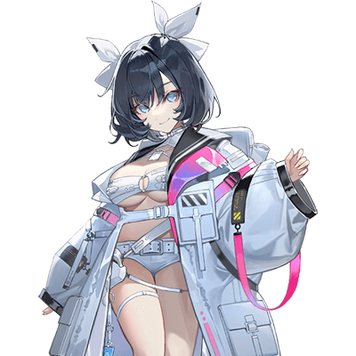
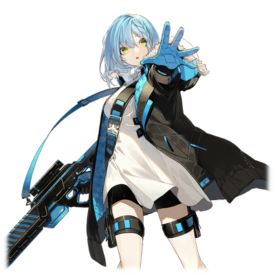

# 艾尔·利贝尔德

| 
角色信息 
  |          |
| ----------- | ----------- |
|名称|艾尔·利贝尔德
|年龄|17岁（再生后三年）
|职业|运输者/第三次归还种
|对应歌曲|crazy (about you)
|初出版本|Chunithm Luminous

 

警告：该人物故事为Metaverse所有主线故事结束之后的后日谈，强烈建议读者先去阅读先前的所有内容再来观看。

 

## Episode 1 这个请求，我接受了！

>大显身手吧，利贝尔德酱一号！竟然把我可爱的战斗机器人弄得这么脏，可要好好赔偿哦！

在那场将地上世界与电子乐园卷入战争的事件之后几年。

世界开始渐渐走向了共存的道路。

曾经作为归还种与真人的悲剧中心的佩尔修斯殖民地，现在已经是“共存与繁荣”的象征，由双方阵营的代表一同统治着。

即便如此，这也不代表这长年的争斗所带来的伤痕和分歧就会这样一笔勾销。

如此激进的变革，不论选择什么，都会迎来巨大的反弹。

 

“给我站住！！！”

“绝对不会让你逃走的！”

 

这里是已经停止运作的安特路亚殖民地附近的沙漠地带。就像是要冲破这万里无云的晴空一般，一艘气垫船和两台老式的荚舱形战斗机器人正在沙漠上高速飞驰着。

 

“啊啊，真是的！太难缠了吧！”

 

大喊着的，正是驾驶着气垫船的人——一名看起来还有些许稚气的少女。

与之相对的，那些驾驶着战斗机器人的，则是几个面相丑陋的男人。

经历风吹日晒的黝黑皮肤，宛如被煤炭熏过一般的黑色手指，还有怎么看都是违法改造的机械手腕。这些家伙简直就是再标准不过的无赖模样。

其中的一人，正拿着扩音器执拗地向着少女喊话。

 

“话又说回来，那到底是什么啊！”

 

少女自从被他们追着的时候，就一直在意着一件事。

 

“那个‘角’到底是什么！？明明原本的战斗机器人那么可爱的啊！！”

 

他们所乘坐的荚舱形战斗机器人，本来是以简单的球体型外观为人所知，然而他们却在上面装上了角。

不但如此，还把本来朴素的涂装颜色换成了鲜艳刺眼的亮色。

 

“啊啊啊！！我受不了了！！不行，绝对饶不了你们！”

 

少女下定了决心，用熟练的手法拉动操纵杆，让气垫船狠狠地转了个头。

接着，少女向着因为逆光而无法对应的战斗机器人照射了某样东西。

瞬间，那些战斗机器人就失去了悬浮能力——直接沉入了沙海之中。

 

“哈啊，终于平静下来了。”

 

少女爱惜地摸着自己开发的，可以搭载于气垫船上的电磁脉冲照射装置——“利贝尔德酱21号”的发射手柄。

接着，她收起了自己的发明品。

 

少女把气垫船停靠在那些战斗机器人坠机的地方。

从雷达上看，那些生体反应正在逐渐远离这里。

看来是察觉到技术力的差距，落荒而逃了吧。

 

“啊啊……真想把这些东西也带回去啊。”

 

少女急忙摇了摇头，告诫自己。没错，现在正是在办正事的途中。

现在不是满足自己的兴趣的时候。

等到完成“任务”之后再来这里吧。少女这么想到。

 

“你这小妮子！！不要以为会玩点机械就能在这里横着走啊————！”

 

在稍远的沙漠地带，那个东西出现了。

那是台拥有远远比人类高出数倍的长脚，同时还附带迷彩功能的，具有强大杀伤力的机动兵器。

 

“啊，被发现了。”

“只要有这台最新型的机动兵器的话，你也就只能乖乖被踩成肉饼了吧！”

 

在那机动兵器之上，一个看似头领的男人向着少女叫嚣着。

正如男人所说，那台战斗兵器比之前的战斗机器人还要新。但是对于少女来说，这些机械都未免过于老旧了。

 

“哈哈，面对这么大的机动兵器，你也就只能拼命逃了吧！”

“我说，你们不会以为‘利贝尔德酱’只是搭载在船上的玩意儿吧？啊哈哈，真是遗憾啊！真正的利贝尔德酱——就在我的手上哦！”

“什么！？”

 

就像是被那些男人们挑起兴致一样，艾尔高声呼喊着。然后从宽大的外套袖子中，伸出了一把手枪，轻声念到。

 

“大显身手吧，利贝尔特酱一号。”

“——驱动邀请承认，限制解除。”

 

少女只是稀松平常地举起了手枪，然而从手枪中射出的那道光束，却精准无比地命中了机动兵器的要害。

 

“啊？怎么回事……？”

 

机动兵器就这么随着男人泄气般的声音，停了下来。

 

“真走运！虽然不知道是怎么回事，这样的话这里的‘任务’也就完成了吧。”

 

少女从怀里掏出一个小小的电子装置。

上面显示的是某样东西的名单。少女划动着屏幕，确认着名单上的内容。

 

“嗯，没错。”

 

就在少女结束了机动兵器的回收手续，准备走向战斗机器人的时候。

 

“好了好了好了！那边的那位违法武器持有者！！请立刻就范～～！”

“啊？为什么<ruby>和平维持联合<rp>（</rp><rt>PEACEMAKER</rt><rp>）</rp></ruby>会出现在这里？”

 

一艘大型运输艇正悬浮在少女的上空。

顶着降落时产生的气流，少女——艾尔·利贝尔德一边按着自己头上的白色缎带，一边深深地叹了一口气。

 

这，正是拔示巴引起了“乐园事变”之后的某个时间点所发生的事。那是那些从残酷的战争中活下来的人们，在那之后的后日谈。这正是追寻那些从战争中幸存下来的人们，所留下的足迹的故事。

## Episode 2 穆尔西亚的英雄

>最初我还觉得他们只是一群怪人，不过随着和他们交流，我也喜欢上了他们。

悬浮在艾尔上空的，正是归还种与真人一同建立的新组织——<ruby>和平维持联合<rp>（</rp><rt>PEACEMAKER</rt><rp>）</rp></ruby>的飞船。

从那艘船上还能听到那个响亮的女声——然而随着一声“咚”的碰撞声和微弱的悲鸣响起，飞船也静了下来。

 

“哈啊……今天还真是不走运啊……”

 

少女从那艘船上感觉到的不是什么“和平缔造者”的气息，而是一股“麻烦制造者”的感觉。但是要是在这里逃之夭夭的话，估计只会引来更大的麻烦。

艾尔只能默默地举起手，表示自己没有抵抗的意思。

* * *

“咦！竟然一个人当运输者，真是厉害啊！”

 

从船上一口气跳下来的女性，看着艾尔的身份证露出了饶有兴致的表情。

这个从刚才情绪就特别高涨的女性，正是艾莉夏·穆尔西亚。

虽然怎么看都有些勉强，但她确实是统领着这个队伍的队长。

目送着那些无赖们被带走的艾尔，回答了艾莉夏的提问。

在结束了几个问题之后，“那么。”，话锋一转，她转到了本来的话题。

 

“为什么会拿着那样的兵器？”

 

“那个兵器”所指的，正是艾尔的爱枪——利贝尔德酱一号。简单来说，那东西的真实面貌正是只有归还种能够使用的第九音素临界加速装置，但是由于威力实在是太强大了，所以被“<ruby>和平维持联合<rp>（</rp><rt>PEACEMAKER</rt><rp>）</rp></ruby>”限制了使用。

根据场合，甚至可能会发展成重罪，接受法律的制裁。

艾丽夏继续说着。

 

“你知道最近就要召开和平仪式了吗？”

“知道。”

“那么，能不能不要做这些会无意中刺激到过激派的行为呢？”

“这个嘛，毕竟我也是有任务在身。而且敌人也是持有非法的武装力量，那我就不能‘正当防卫’吗？”

 

艾尔不慌不忙地向对方解释到。

面对这迅速而冷静的回应，不知为何艾丽夏却反而一副吃了苦黄莲般的表情。

 

“这位姑娘，能不能就这么放过她呢？”

 

突然，一名魁梧的男性打断了两人的对话。

 

“啊！小队长！现在是我在询问，不要突然就进来打断我！”

“不就是因为你根本派不上用场，我才得来帮你的吗。”

“咕奴奴奴……”

“咦？小队长？这是怎么回事……？”

“啊，别在意，这是这家伙的习惯叫法。”

 

旁边的其他男人回答了艾尔的疑问。

听他们说，这艘船上的船员全部都是出身于同个地区，同个部队的人，而他们不知为何，都从九死一生的战场上侥幸活了下来。

而且这场漫长的战争在不知不觉间就这样结束了，本来应该前往萨马拉坎达的他们，却因为燃料的整备不足而不得不折返回佩尔修斯殖民地。从结果上来看，艾丽夏他们整船人就这样，又一次躲过了死神的魔爪。

她的好运并未止步于此。由于指挥层的人事出现了急剧变动，而他们整个小队又平安无事地从战场上回来，所以艾丽夏并未遭到什么刁难，在各种因缘际会之下，最终变成了穆尔西亚的英雄。

 

“嘛，小队长什么的，就是当时她对我的称呼。”

“那个，这么多事情，到底哪些是真的，哪些是假的……”

“哈哈哈！你会这么想也不奇怪！不过我可以担保，这些都是真的啊！”

 

虽然艾尔还是半信半疑的状态，但是从那些人们的表情来看，说不定事实真是如此。

这个世界上，应该也是存在那种把一切都点在幸运上的人吧。艾尔想着。而正是这点，这个世界才如此有趣。

 

“那么，你有许可证吗？”

“嗯。我有准备好正规的证件。”

 

艾尔赶忙从衣服的内口袋将许可证拿出来。

许可证上印着的，正是佩尔修斯殖民地的共同监督官——蕾娜·伊修梅尔的大名。

 

“还真是……不好意思，错怪你了。”

“不，请不用在意。”

 

这样的话，应该就自由了吧。

就在艾尔嘟囔着的时候，艾丽夏终于逃离了与小队长的争吵，跑到了艾尔面前。

 

“哇！还真的是她的名字！难道说你其实是个大人物吗！？”

“倒也不是这么说……”

“——艾丽夏！今天我是绝对不会饶过你的！”

“哈？你在说什么呢？我可是这支‘穆尔西亚队’的队长哦？”

“啊——啊——，又开始了吗。不好意思啊，艾尔小姐。”

“啊，哈……”

 

两人把艾尔放在一旁，吵了起来。

 

“我说你到底要叫我‘小队长’到什么时候啊！”

“小队长就是小队长啊！由我说了算！”

“这样只会越叫越乱的吧！我的名字是——”

“啊——啊——我听不到！我！听！不！到！啊！既然如此，要不干脆就这样吧？”

“哦……说来听听。”

“干脆，小队长就把名字改成‘小·队长’啦！这样的话就一了百了——”

“你小子！！你觉得我会抛弃这光荣的‘穆尔西亚’之名吗！！”

“噫噫噫噫噫噫！！对、对不起！！”

 

两人就这么围着飞艇开始了追逐。

 

“真是的，这又是在闹什么啊？真希望他们俩也能够稍微照顾一下我们这边的感受啊……”

“啊，啊哈哈……”

 

那些男人们虽然嘴上这么说，但从他们的表情可以看出，他们是真心享受着这样的光景。

靠他们这样的人真的能够维持治安吗？

艾尔努力忍着不将这句话说出口。接着，她向那些男人们提案到。

 

“那么，既然我也见到了难得的场面，那能否听我一个请求呢？”

“嗯？啊，可以哦。是什么呢？”

“非常感谢！我接下来要绕路前去塞雷基亚那里，能不能护送我过去呢？”

## Episode 3 湛蓝深邃的天空

>想到她们也应该在哪个角落望着同一片蓝天，我就越来越喜欢了。

结果，艾丽夏他们就这样跟着艾尔来到了塞雷基亚的旧址，并且在那里停留到艾尔完成工作之后才离开。

艾尔从小队长那里得知，本来他们也有计划去这里调查是否潜藏着反对势力的据点，所以这次带艾尔过来干脆就一并做了。

很快，两边的工作都平安结束，艾尔也在调查途中与穆尔西亚小队打成一片，之后，他们就一同回到了佩尔修斯殖民地。

 

艾尔的家，同时也是她的事务所，就坐落在新规划好的外壳部周边地区。

 

“今天也是工作顺利的一天啊~！哼哼哼哼哼♪”

 

将气垫船停入机场的艾尔，本想直接就回家的，但突然她看到了什么东西，于是决定去市内逛逛。

 

“果然，这个时间的佩尔修斯殖民地是最漂亮的啊……”

 

艾尔抬头望去，数个构造体在晚霞的照射下矗立于此。

本来一片银色的都市的轮廓，被夕阳照射着，与天空的颜色合为一体，仿佛看不到它们之间的分界线。

不管是人造物，还是人，还是自然环境。

在这短暂的时间内，都像是与天空合为一体。

夕阳与夜幕的交替之刻——<ruby>魔幻时刻<rp>（</rp><rt>Magic Hour</rt><rp>）</rp></ruby>。

艾尔最喜欢的，就是这座被天空的颜色浸透的都市。

 

举起双手，艾尔用手指架起一个相框，将远处的都市纳入囊中。此时，她才注意到她已经到了距离都市的中心部有点距离的地方了。

虽然殖民地内不管哪里看着都差不多，但是这里的建筑物相对较新，而且作为运输者，她也常常造访此地。

所以，艾尔记得这里的路。

再往前走的话，就是医院了。

 

这座为了战争的伤者而设立的医院，似乎也因为正值傍晚，门可罗雀。

 

“呐，请问那边那位小姐……”

 

突然，艾尔察觉自己正被什么人叫住，赶忙回过头去。

原来是一名正坐着轮椅的女性向她搭话。

 

（哇……好漂亮啊……）

 

不知是不是因为夕阳照耀的缘故，看不出头发本来的颜色。但是由于这一头长发经过精心打理，扎成了漂亮的麻花辫，反而为她带来一种虚幻而高贵的感觉。

艾尔点头回应，那名女性也以笑容回应。接着，她向艾尔问到。

 

“你喜欢这里的景色吗？”

“是的。我最喜欢的就是这个时候的。”

“呵呵，真的很漂亮呢。”

“你也喜欢这里的景色吗？”

“我……不太清楚。我的记忆稍微有些缺失的样子。”

“咦？啊……不好意思。”

“没关系，不用在意。”

 

女人露出了略显寂寞的笑容。

 

“天空什么的，真的很不可思议呢。明明就在我们的头顶上，随时都能看到，但却不知为何如此摄人心弦……”

 

这是为什么呢？女人这么问到。艾尔望着天空，回答到。

 

“肯定是因为大家都在同一片天空下吧。”

“咦？”

“天空是无限延伸着，并且没有任何界限的。而它又是渐渐地，不停地在变换着的。所以，才会这么摄人心弦吧。……这么说，可以吗？”

“嗯嗯。当然可以。”

 

女人点了点头，再次露出了笑容。

 

“真是漂亮的天空啊。”

“是啊，很漂亮。”

 

不知道是不是感觉到各自的对话有些滑稽了呢，两人不自觉地笑了出来。

 

“啊，可以的话能不能告诉我你的名字呢？”

“啊啊，可以哦。我是——”

“喂——！尼亚——！！”

 

平静的气氛一瞬间就被打破了。

艾尔望去，映入眼帘的是正向着这位被称作尼亚的女性挥着大手的男人的身影。

 

“啊呀，这不是马尔杜克和安夏尔吗？怎么连艾萨克也在？”

 

尼亚看到了正跟在挥手的马尔杜克身后的两人。

 

“尼亚，你又在看天啊。”

“是啊。今天结交到了个同样喜欢这片天空的朋友。”

 

感觉到马尔杜克和尼亚的视线，艾尔也简单打了个招呼。

 

“是吗，真是太好了！那么，既然是尼亚的朋友的话，那你也是我的朋友了！”

 

这么说着，马尔杜克一边自我介绍，一边伸出了手。

不知为何，总觉得这个男人的距离感很近。明明已经日薄西山开始感到寒冷了，但有他在，就感觉周围的温度都上升了两三度的样子。

 

“咦？难道说还是太早了吗？”

 

艾尔默默地往后退了一步。

 

“马尔杜克……你这人就是……”

“呵咔咔……果然过了这么久，还是没变啊。”

“不，这种程度很正常的吧。先拉近距离，接着再慢慢开始改变就好了。对吧？”

 

马尔杜克又走近了一步。

艾尔也跟着后退了一步。

 

“哈啊……就是这回事……”

“你这个蠢货！”

“好痛！？怎么突然打我啊，艾萨克队长！！”

“呵，呵呵……”

“啊，抱歉啊尼亚。吵到你了吧？”

“没什么。我应该只是看你们乐在其中的样子，所以才笑了出来的吧……”

“……嘻嘻。这样吗。那就好。”

“那么，差不多太阳也要下山了，送尼亚回屋吧。”

“啊啊。”

“啊，那我也差不多回去了。”

“哦，再见啦！艾尔！”

 

艾尔向着准备回去的尼亚他们挥了挥手，踏上了回家的路。

她的脚步，比来时更加轻快。

对她来说，又多了一个喜欢这座都市的理由。

## Episode 4 虹色的庭园

>对于一些人来说，这可能是毫无用处的东西，但对于其他的人类说，说不定就是承载着无法代替的回忆的存在呢。

第二天。

艾尔被她的依赖人——也就是佩尔修斯殖民地的共同监督官之一，蕾娜·伊修梅尔叫到了她所在的中枢塔。

坐上由监督官提案并新建的观景电梯，艾尔眺望着正在自己脚下展开的银色都市。

被朝阳沐浴着的巨大都市闪耀出彩虹般的光芒，令见者无不动容。

而这都市最大的特色，就是这里的模样会根据不同的时间点发生变化。

早晨，这里会展现出整个世界的宽广。

夕阳，这里则会令人感觉到稍许的悲欢离合。

夜晚，则会映照出电梯中的观者的模样。

人们都说，这里承载着无数悲伤的过去。

艾尔虽然也能理解其中的含义，但对于活在当下的人们来说，这也不过是过去发生过的事情而已。

诚然，将这些悲伤传达出去也很重要。

但对于艾尔来说，更重要的，还是将这个世界的美丽之处传递出去。

 

“啊，已经到了啊。”

 

随着“哔哔”的声音，电梯也到达了目的地。

 

“就不能让他们把这电梯的速度改慢点吗……”

 

虽然看着像是滥用职权一样的行为。但是如果是他们的话，应该会接受吧。想着这些“任性”的请求，艾尔到达了监督官的办公室门前。

 

“门开着哦。”

“咦？”

 

突然，一个稳重的男声响起。与此同时，大门打开。于是艾尔走了进去。

 

“欢迎你，艾尔·利贝尔德。”

“咦，感觉……大家都在聚集在这儿呢？”

 

明明还没到正午时分，然而艾尔却发现已经有许多人聚集在了这里。

以就座于中央的监督官蕾娜和蕾亚为中心，左右站着身为辅佐官的某个男人和艾斯特尔。

然后，站在他们面前的，是身为<ruby>和平维持联合<rp>（</rp><rt>PEACEMAKER</rt><rp>）</rp></ruby>的代表的安夏尔和马尔杜克。

众人的视线都聚集到了自己的身上，感觉到一丝尴尬的艾尔，自然而然地跟着敬了一礼。

 

“嗯，不需要那么拘谨的。”

 

艾斯特尔就像是劝艾尔安心一样，把举起的手放了下来。

但是，却还是有种紧张的感觉。

可能还是这里的几人的格调还是太高贵了吧。艾尔想到。

 

“嘻嘻，看你还在紧张的样子嘛？”

“马尔杜克，不要这么跟人开玩笑。”

“我只是想让艾尔不要那么紧张而已啊？”

 

订正一下，除了一个人以外。

 

“啊哈哈，不好意思啊，艾尔。其实我们正在准备那场仪式，所以正在讨论着各种事情呢。”

 

蕾娜微笑着说到。接着便让大家先去外面等候一下。

众人就这么在欢声笑语中离开了办公室，只剩下艾尔，蕾娜还有那名辅佐官的男人留在办公室里。

 

“咦？这个人也要留在这里吗？”

 

艾尔有点失礼地打量着这名辅佐官。

这名衣着修长的辅佐官，给人一种优雅的感觉。看着这位辅佐官，艾尔的脑中不知为何出现了点既视感。

 

“是的。其实我的请求，也和布鲁先生有关。”

“正是如此。不用在意我，你们继续说吧。”

“这样吗，我明白了。”

 

艾尔很快就接受了现状，从背包里拿出了某样东西。拿出来的时候，艾尔还担心这些东西会跟这里的气氛格格不入，稍微紧张了起来。

 

“因为还是有些特征，所以很快就找到了。不过最终也只发现了这些。”

 

放在桌子上的，是染成红色的目镜，还有被凝固的润滑油黏住的怀表。

 

“这个怀表是在塞雷基亚调查的时候找到的，应该是那个跟蕾娜小姐一起的人的东西吧？所以我就这么顺路带过来了。那个，这样就可以了吗——”

 

艾尔没有再继续说下去。

因为，面对现在的她，还继续追问就有点不解风情了。

 

“嗯……已经很足够了……”

 

一直都挂着笑容，对于艾尔来说都觉得有些过于温柔的监督官——蕾娜·伊修梅尔。

她丝毫不在意弄脏了衣服，只是小心地抱着那个目镜。

 

“米莉安姆……这么晚才来接你，对不起……正是因为有大家的支持，我才能来到这里……”

 

看来，即便是她，也有埋藏于心的往事吧。艾尔看着这样的蕾娜，对她也产生了改观。

 

“艾尔·利贝尔德，看来蕾娜君对你的工作十分满意呢。虽然现在这副样子看起来会影响到午后的事务工作呢……”

“啊哈哈……多谢夸奖……”

 

摆弄着坏掉的怀表，名为布鲁的男人继续说到。

 

“那么，我们换个话题如何？”

“可以，请问是什么呢？”

“请问，在你眼中，这个世界是怎样的呢？”

“这个世界？突然这么说……嗯嗯嗯……还是太宽广了，不太明白呢。”

“是吗。那就尽你的力量，走遍这个美妙的世界吧。”

 

这番话，就像是看透了自己的存在一般。

望着布鲁那迥然不同的眼神，艾尔也只能露出个奇妙的表情回应。

 

“那么，蕾娜君现在也是思绪万千的状态。能不能等到蕾娜她们能够再次开始会议之后再联络你呢？”

“我明白了。能够将让蕾娜的心灵为之颤动的东西送达这里，我也很高兴。那么，我就先走了。”

 

艾尔向正扑在布鲁怀里的蕾娜打了个招呼，接着就离开了办公室。

 

“——艾尔·利贝尔德。”

 

下一刻，艾尔就被待在办公室旁边的蕾亚叫住了。

 

“虽然我觉得应该由艾斯特尔事先跟你联络说明的，但是现在能否听一听我的请求呢？”

“是的。当然可以。距离会议再度开始应该还要些时间，就让我在这里确认请求的内容吧？”

 

——翌日。

呼吸着清晨清冷的空气，艾尔为了蕾亚的任务做着准备。

下一个目的地是卡拉玖殖民地。

蕾亚给她的任务，是去寻找原强硬派指导者“沃特”的行踪，确认他是否出现于此。

## Episode 5 Mad Party

>这到底该怎么上报呢……仅凭一个人就将整座都市破坏掉什么的，怎么会有人相信啊。不过，这才是“死神”的实力吧。

“这里……就是卡拉玖殖民地吗！？”

 

驾驶着气垫船，穿过沙漠地带，艾尔终于抵达了卡拉玖殖民地。

根据事先获得的情报，这里确实是一座偏僻的都市，但眼前这一片狼藉的模样，实在难以称之为“都市”了。

映入眼帘的，只有废墟堆积而成的山丘。

勉强能够看出这都市的原貌的，只有那座从瓦砾的小山丘之间勉强能看到的，远处与资料符合的高塔。

 

“这下，看来在开始工作之前……”

 

说着，艾尔从怀里掏出了作业用的终端。

接着，从终端中掉出了小型的球体状的东西，那些东西飞散到了周围的废墟中。

 

“还是得先‘回放’一下现场的情况呢！”

 

艾尔所释放出来的无数小球，那些都是能利用Metaverse上记录的，殖民地当地的数据和情报设备记录下来的信息和影像，进行分析并且进行高精度的行动预测的无人机。

艾尔正是利用了这些无人机的力量，才能在塞雷基亚殖民地中根据仅剩不多的数据找到蕾娜所寻找着的遗物。

由无人机收集的情报，渐渐地收集到了终端之中。

数十分钟后，重构工作完成了。

 

“咦……原来都市崩坏是最近才发生的事情啊。”

 

艾尔按下了终端画面上的播放键。

然后，空中浮现了立体投影。立体投影以网格的形式再现了都市的地形，开始回放起居民们的生活。

 

“这个人……难道说……！”

 

突然，艾尔注意到了某种照片。

那照片上赫然映着的，正是失踪已久的沃特。

 

“果然！这个人就是沃特对吧！”

 

立体影像上的沃特就像在逃离什么东西一样，在都市中全力飞驰着。而在她的身旁，一个似乎是他的同伴的人正与他一起奔跑着。

虽然很想确认这个人的真面目，但是立体影像上只能确认大体的外观和身形。

而这个人物在资料中也没有任何记录。

 

“稍微往回拨一点吧，说不定就能明白了。”

 

艾尔修改了回放系统，以沃特为起点进行回溯。

沃特和他的伙伴，当时正在殖民地内的一件小店里吃着饭。

他的同伴的右手是机械式的义手，所以动作稍微有些笨拙。

然后不知道什么东西被细细地分成几份，被那个人送到了沃特的碗里。

面对这样粗鲁的同伴，沃特不知道嘀咕了些什么。

 

“好！这样应该就能够回放声音了！”

“…………啊！所以我说你这个人——”

 

虽然噪音很大，但还是能确认其中的情况。

除了沃特他们以外，店里还有其他几个人。

那些客人们互相点头示意了之后，走到了他们面前——

 

“……了！……通缉榜上……的红……死神！”

“……嗯……难道……其实很出名？”

 

看起来他们跟这些客人们起了争执。

虽然听不清在说什么，但可以看得出似乎是那些人们向沃特的同伴率先发难的。

片刻，口角就升级成了械斗，那些客人们一同掏出了枪。

然而，就连一发子弹都没射出去，那些枪就从客人们的手中脱手，掉到了地上。

 

“刚刚发生了什么！？”

 

艾尔放慢了速度。只见在缓慢流逝的影像中，那些举枪的客人们，纷纷被那名同伴扔出的叉子和餐刀命中了手腕，几个人就这样被他一并放倒。

那名同伴的兴趣，再次回到了沃特和面前的饭菜上——突然，店铺就被卷入了爆炸中。

 

“终于找到了！这里就是开始崩塌的时间点吗！”

 

艾尔以都市视角再次开始俯瞰起当时的情况。

原来，在发生爆炸的店铺周围，正有一群人正荷枪实弹，守在那里。

 

“红色死神！终于找到你了！”

 

看起来，沃特的同伴似乎是被通缉了的样子。

虽然因为声音问题无法听清，但是能够听到类似于“赏金”啊“性命”之类的话语在不断出现着。

 

不久，沃特的那名同伴就像是没事人一般从店里出来，带着沃特，一边打倒那些人们，一边在都市中四处逃窜着。

他们逃到哪里，战斗就跟到哪里，渐渐的，整座城市就这样变成了废墟成堆的地方。

 

“看来这就是当时的情况呢。”

 

那么该怎么办呢？

艾尔开始苦恼应该怎么把这件事向蕾娅报告。

到底是一五一十地说出来呢，还是怎么办呢？就在艾尔沉思着的时候，她并没有注意到一件事。

那就是在立体影像上，上空正有什么块状物体向这里飞来。

 

“啊！影像还没停下来啊！”

 

就在艾尔想要伸出手停止影像播放的时候。

 

“嗨！小流星！”

“——！？”

 

这个声音，并不是立体影像重放的声音。因为，那是从自己的背后传来的声音。

毫无防备的艾尔，本想急忙掏出“利贝尔德酱一号”的，然而还没等她反应过来，她就失去了意识。

## Episode 6 乐园放逐

>明明拿着利贝尔德酱却还被抓住了什么的，怎么可能报告上去啊……不过看起来也没有伤害我的样子，也罢！

艾尔不知被什么人下了毒手，失去了意识。

等到她再次醒来的时候，已经是躺在一艘不认识的船上了。至于为什么能认出这是船呢，是因为这股摇晃着的感觉跟自己常常驾驶的气垫船十分相似。

然而，她的手上却没有手铐之类的拘束具，不过装在外套袖子里的“利贝尔德酱系列”小道具还是全都不翼而飞了。

难道那些把她打晕的人都把她当成了没有武器和终端的话，就只是个手无缚鸡之力，可怜又弱小的小女生了吗？

 

“总有种……好像被人小瞧了的感觉。”

 

一股无名火冒了起来。艾尔现在就想找到那个把自己扔进这房间里的人，给那个人一点颜色瞧瞧。

由于出入口的门并未上锁，于是艾尔便稍微打开了一点，伸出头确认周围的情况。空无一人的走廊上，只有一台看起来上了年纪的机器在那里来回游荡着。

 

“那是什么……？我还是第一次见到这样的东西……！这也太可爱了吧……！”

 

对她来说，这没有任何自我意识的机器要重要得多。虽然当务之急是离开这里，不过现在对这机器进行调查也是没办法的事。

艾尔把走到自己门前的机器“迎”进了房间内，立刻开始了拆解调查。

看起来这台机器因为容量的缘故，只能至多保存一个星期的影像，能够从中获得的线索，只有把自己运来这间房间的那些人的剪影。

其中一人，是穿着黑色连衣裙的少女。

另外一人，是带着黑色的外套以及丝绸礼帽的男性。

他们的打扮和行事作风，都有股夸张的感觉。

然而，却也同时有着一股违和感。

 

“嗯……果然，那个女孩的动作……有点老——”

“你，说，什么啊啊啊啊啊啊啊！！？？”

“呀！？”

 

突然，一个足以把鼓膜震破的尖锐女声响彻整个房间。

然后，随着一阵吵闹的噪音和撞击音响起，某个东西正向着这个房间而来——然后猛地撞破了房间的大门。

出现在艾尔面前的，正是刚刚在机器中见到的那个少女。

 

“你这【限制音】有胆再说一次啊啊啊啊啊啊啊啊！？？？？老娘到底哪里老了啊！！！！”

 

随着响亮的声音和尖锐的“哔”一般的限制音响起，尖锐的音波在房间内回响着。艾尔只能捂住耳朵，等到声音慢慢平息下来。

等到声音终于收束下来，艾尔向着少女喊到。

 

“难道说，你们一直都在监视着这里吗！？”

“那是当然。毕竟我们得知道你究竟是什么人，有什么目的才行。”

“原来如此。不过，我倒是知道说什么能够‘气’到你了。”

“嘿——？你有种就试试看啊？”

 

艾尔嘲讽一般地说着，少女也不甘下风地骂了回去。

虽说是最糟糕的见面方式，但两人的个性真的是互不相容。

 

“哈。二位还是适当收收手吧？”

就在两人的对话已经变成对骂的时候，一个人插入了两人之间，制止了她们的争吵。

那个人正是出现在影像中的另外一人。

他单手用手杖将地面敲出响声，接着用另一只手拿起头上的礼帽在空中划了个圆，向艾尔行了个脱帽礼。

虽说熟练，但却给人一种演戏一般的感觉。

 

“那个，请问你们是——”

 

然后，那个男人就像是等待着这句话一样，未等艾尔说完，就高声回答到。

 

“这里是！放逐者们的乐园·新涅墨亚2nd！不管是那边那位想要在天空翱翔的你，还是厌倦孤独想要寻找伙伴的你！还请安心！在这永不沉眠的空中乐园之上，您那如螺丝钉般微不足道的烦恼也肯定会被——咦！？”

“真是的，每次开场白都要这么长。这样的话那个女的也会感到困惑的吧？”

 

女人打断了男人的开场白，如此吐槽着。

艾尔直接地问到。

 

“那个，难道你们每次都要说这一套吗？”

“咦咦！我还是第一次被人问到这个问题呢。这可是黄金时代的人类所说的‘约定俗成’的文化来着……米卡，怎么办啊！那孩子好像根本就对我们的说话方式不感冒啊！？”

 

明明刚才还在那里说的天花乱坠的，现在却像是换了个人一样。那名被称作米卡的少女，正摇晃着他的身体，大喊着：“快醒醒啊，丹！”。

然后，从少女的口中又传来了“哔哔”的声音。

 

“啊啊！！吵死了吵死了吵死了！！从刚才就一直发出来的‘哔哔’声到底是什么啊！？”

“你的耳朵很灵呢！这可是米卡最为人称道的魅力点呢！只要从她口中说出‘不文雅’的话……就会变成这样。”

“等等！！你也给我好好听听老娘在说什么啊！！【限制音】【限制音】【限制音】【限制音】！！”

“根本不知道你们在说什么……”

 

从她口中传出来的限制音实在是太吵了，根本没法正常思考。

突然，艾尔想到了监督官蕾娜身旁的那个机械种，布鲁。说不定那个机械种也有着类似的特点呢？艾尔的脑中就这么想着脱线的话题。

 

“其实最近啊，我在尝试猜一猜米卡究竟在这些限制音里面说了些什么呢。没想到我说的还挺准的呢！也就是这种时候，我才意识到米卡骂人的种类有多么丰富啊！”

“这算是夸奖吗？”

“那当然！”

 

艾尔再次望向米卡，只见她内心窃喜着，却无法表露出来，只能在脸上挂着一副别扭的表情。

从这点看，她也只是个心地淳朴的少女吧。

 

“如果可以的话，你也可以一起来哦？”

“啊，不用了！”

“啊啊……真是遗憾啊。”

“那么，为什么要把我关在这里？”

“那个啊——”

 

丹说起了他们的目的。

原来，两人正以卡拉玖殖民地为中心，在周围的都市发放着“红色死神”的通缉单。

因为之前，这个嬉皮笑脸的死神不但破坏了他们辛苦建立起来的都市，还让米卡身负伤势。

然后，他们成功地将红色死神和他的同伴一起抓住，并且收容于这艘船中。

 

“也就是说，你们把我当成了那个‘红色死神’的同伴了吗！？”

“那当然！有什么问题吗？”

“肯定有啊！我只是个在都市间来往，运送重要物资的运输者而已啊！”

“咦，那又咋样？”

“咕……！别看我这样，我可是认识那些<ruby>和平维持联合<rp>（</rp><rt>PEACEMAKER</rt><rp>）</rp></ruby>的大人物的！只要我把这里发生的一切都向他们告状，他们肯定会赶过来，把你们当成扰乱治安的存在一并取缔的！真是遗憾啊，米卡！”

 

艾尔神纠纠气昂昂地站在那里说着。

当然，对于几乎忍耐不了挑衅的话语的米卡来说，怎么能忍受这样的鬼话？就在两人又要吵起来的时候——突然，船内传来了一声巨响。

 

“丹！刚刚发生了什么！？”

“我正在检查……啊啊，怎么会！米卡，这该怎么办啊！”

“哇啊……听着就有股不祥的预感。”

 

原来，那个“红色死神”引爆了他所在的那间房间，并且抢走了一艘小型船只。

以丹为先头，三人前往了红色死神所在的房间。

不出所料，那里已经人去楼空。

突然，艾尔注意到了画在墙上的文字。

 

“我们也差不多玩够了，就先走啦，拜拜♪”

 

他甚至没忘了加上个音符的记号。这下就连艾尔都看到气不打一处来了。

就在艾尔露出同情的眼神回头望去的时候，她看到的，是听到艾尔念着的这些留言之后，已经怒不可遏，凶神恶煞的米卡。

 

“等等，这、这又不是我写的东西啊！”

“都都都是你的错啊！给我负起责任啊！”

 

没想到竟然连自己都被卷进去了。

这两人，果然还是远远超出了自己的想象啊。

 

“那个……【限制音】啊！！！！老娘绝对要把他揪出来做成【限制音】，一直在这里干到死啊啊啊啊！！”

 

在那之后，艾尔向米卡和丹提出了修理空中乐园的条件，以交换回自己手上的东西还有气垫船，并且附带一大堆通缉令。

## Episode 7 破坏之后的遗留物

>那个人到底是抱着怎样的想法死去的呢？希望他的最后一刻，是满足地死去就好了。

与空中乐园的两人别过，艾尔也结束了卡拉玖殖民地的调查工作。

本想就这样回到佩尔修斯殖民地的，但是难得来一趟卡斯比大裂谷地区，所以艾尔打算继续执行那挂在一边的“任务”。

她选择了绕远路，前往了萨马拉坎达，还有在那途中的废弃都市。

* * *

萨马拉坎达，那是在拔示巴战役，以及之后的乐园事变中大展身手的英雄，梅尼·特尔塞拉与安夏尔和马尔杜克一同对抗巨大的机动兵器的地方。

由于这里路途险峻，也没有什么适合大型船舶停靠的地方，再加上清理机动兵器的残骸也很麻烦，所以这里一直处于放置状态。

对于艾尔来说这也是她第一次来到这里，所以她也是抱着见识见识看那台机动兵器到底是多强大，当时那名**两次**击倒了机动兵器的“前辈”到底是多厉害的想法，才决定前往那里的。

 

当艾尔终于到达了都市所在，映入眼帘的，是一座已经折断了一半塔身的高塔，还有倒在那塔的面前的机动兵器的残骸。

如果不是有事前了解的知识的话，艾尔估计会把这机动兵器的残骸当成倒塌的构造体吧。

这机动兵器是如此的庞大，以至于需要让气垫船爬升才能确认其全貌。

在确认了周围没有生体反应之后，艾尔在附近下了船。

 

当亲眼来到高塔和机动兵器面前，艾尔才再次意识到残骸的巨大，还有自然的“鬼斧神工”。

塔的外墙和机动兵器身上，就像是喷涌而出一般，长满了无数的植物。

然后，在机动兵器的疑似“胸口”的所在地，则长着一团宛如放射状散开般的，开着红色花朵的植物丛。那些植物在骄阳下绽放着，吸收着阳光。

 

“真是漂亮……”

 

艾尔的脚步就像是被自然与花草引导一般，往花朵最为茂密的地方前去。

然后，就在她走着走着，踩到了和柔软的花草完全不同的硬物的时候，她的视线向脚边移去。

 

“这是……书本吗？哇，还真是破破烂烂的……”

 

就在艾尔打算确认其中内容的时候——

 

“呀……！？”

 

在书本的旁边，正倒着一具已经化作白骨的人类尸体。

条件反射般的往后退了几步的艾尔，稍微隔着一点距离，观察着眼前的这具尸体。

尸体已经暴露在大自然中许久，除了这本书以外，再也没有其他能够联系到这具尸体的东西了。

 

“怎么办……要不要‘回放’看看呢……？”

 

艾尔苦恼着。

然而，如果真的要这么做的话，那就意味着必须要亲眼目睹这个人的“最后一刻”。

 

“嗯嗯……果然，还是算了。总觉得像是在偷窥这个人的想法一样。而且……”

 

这里，已经成为某种意义上的“圣域”了。

不能以轻松的态度踏入其中。

与之相对的，艾尔摘下了几朵宛如燃烧的烈火般鲜艳的红花。

为的，是那之后将于佩尔修斯殖民地举办的仪式。

这些花，将被放在即将公之于众的慰灵碑上，献给那些死在战争中的人们。

## Episode 8 这个美丽的世界

>谢谢大家。正是因为大家这么说着，我才注意到，自己是如此地爱着这个世界。

“——定期报告。”

 

这里是位于佩尔修斯殖民地的自家兼事务所。

艾尔正用熟练的手法在终端上打着报告。

 

>安特路亚……威胁度更新：低 塞雷基亚……威胁度更新：低 卡拉玖……威胁度更新：需要观察 佩尔修斯……威胁度更新：维持现状 萨马拉坎达……威胁度更新：维持现状 坎达——

那报告的内容，正是艾尔调查了各种各样的殖民地之后，向她的“依赖人”——基干系统，提交的报告。

地上的再生工作，在战争结束之后，以飞一般的速度顺利推进着。

在战争结束之后，那些过激派爆发的叛乱也渐渐消失，各地正以艾尔都无比惊讶的速度，向着和平大步推进。

 

然而，那些系统管理不到的地方——例如奥林匹亚斯周边，还有安特路亚，塞雷基亚以及卡斯比大裂谷地带以东的地区，都需要定期进行检查。

而独自一人负责这些工作，根据场合甚至允许行使“武力”——这就是第三次归还种，艾尔·利贝尔德被授予的“任务”。

 

写上各地的进度，外加上自己在游历途中经历的各种各样的事情，还有遇到的人们，将这些感想和报告一并写入终端的艾尔，合上了终端，开始做出门的准备。

 

“好，差不多准备出门了。”

 

今天，将有一场活动在佩尔修斯殖民地举办。

然而，她的目的地却并不是活动会场。

 

“反正献花什么的大早上已经做了，在那之后有时间再好好去看看吧。”

 

站在停机坪的艾尔，望着慰灵碑说到，然后便坐上气垫船，前往了坎达尔殖民地。

* * *

坎达尔殖民地的中枢塔。

在某间建好的研究室中，正进行着某样实验。

在研究室的中央，正放着两张简单的床铺，两名少女正躺在床上静静地睡着。

在她们身上正插着点滴管还有其他的各种设备。虽然她们正平静地呼吸着，但她们并没有意识。

 

“……”

“索罗，很紧张吗？”

“……嗯。”

“没事的。因为你不是为了这一天，做了很多很多吗？我们都是一清二楚的。”

 

索罗自从战争结束的那天，就一直在坎达尔的实验室默默地研究着。

他研究的内容是——寻找那消失在电子的乐园·Metaverse的某个角落的少女，米斯拉·特尔塞拉，还有他的母亲，拔示巴·阿西德菲尔的意识情报。寻找到她们的意识情报所在的坐标，并且将一直停留于电子空间中的她们带回现实世界中的肉体。

 

“看你一副忧心忡忡的样子呢。”

“什么啊，原来是梅尼吗？”

“这种时候竟然还这么阴沉，到底那个拯救了世界的英雄是跑去哪儿了啊？”

“我，我知道了——别，别扯我的脸啦！！”

 

在梅尼的玩闹下，索罗才稍微精神了一点。

这也是自从索罗来到坎达尔之后无数次经历的光景。

虽然对于索罗来说无法理解，不过根据泽法所说，自己也和梅尼一样，不论索罗长到多大，都会把他当成自己的孩子一般看待。

 

“真是的……”

“啊，对了对了。其实，在开始之前，有个‘货物’想要给你看看。”

“货物？”

 

面对惊讶的索罗，梅尼只是说着“等等”，就走出了房间。

然后等到她回来之后——在她的身边，正站着个被她强行拉过来的男人。

 

“咦……不是吧——”

“你是……约基姆吗？”

 

正被梅尼从背后推着，走到面前的约基姆，正用微妙的眼神错开两人的视线。接着，他缓缓地开了口。

 

“哟，哟……真是稀奇啊，你们俩都在这里……”

 

约基姆一副客气的模样，抢在索罗他们开口之前继续说了下去。

 

“在那场战斗之后，我为了不打扰你们的战斗，本来想要离开萨马拉坎达的，结果因为肚子饿了，我就直接晕过去啦！不过，等我醒来之后——”

 

约基姆那胡编乱造的借口，随着索罗默默的一个拥抱，彻底消失了。

 

“别开玩笑了啊！我、我们可都以为你已经死了啊！”

“哎呀……真的是太抱歉了啊……”

“泽法你也说说他两句啊！！”

 

然而泽法已经泣不成声，只能发出“嗯”的声音，说不出一句话了。

 

“这小子啊，可是一直都被收容在卡斯比大裂谷附近的基地呢。因为全身上下都卷满了绷带，又报出了我的名字，结果被当成了强硬派的暗杀者。更不用说他的出身也一切不明，所以花了这么长时间才认出他究竟是什么人。”

“啊啊啊啊啊！！喂！不是说好了不要跟他们说这些话吗！至少就不能够斟酌一下，再跟他们说吗！？”

“现在还耍帅什么的已经没什么意义了吧！”

“那……约基姆，已经哪里都不会去了吗？”

“就是这样啦……”

 

约基姆尴尬地擦了擦脖颈，小声地说到，“至少直到这条命没了为止啦……”。

 

“那么，这下应该不会再紧张了吧？”

 

梅尼拍了拍手，催促着索罗。

 

“啊啊，我已经准备好了。谢谢你。”

 

索罗走到了装置面前。

画面上显示的，是某个地方的坐标数据，那里对应的就是米斯拉和拔示巴所在的碎片领域。

众人的心都提到了嗓子眼。索罗毅然决然地按下了装置。

随着装置的启动，片刻之后，两人的身体发生了变化——

 

“成了……成功了！”

 

映入索罗的眼帘的，是正眨着眼确认着周围情况的米斯拉。米斯拉从装置中起身的时候，似乎身体还没适应地上的样子，摇摇晃晃的，所以只能由索罗扶着。

当米斯拉抓着索罗的身体缓缓站起身后——她露出了无比灿烂的笑容。

 

“我回来了，索罗！”

“————！啊啊，啊啊……”

 

索罗也以同样的笑容回应。

 

“欢迎回来……米斯拉……”

 

索罗本来已经想好了的，当他再次见到米斯拉的时候，绝对要以笑容迎接她的。然而实际上——

 

“咦……？明明我已经为了今天练习了这么久……我怎么根本就笑不出来啊……！”

“啊哈哈，没事的，有好好笑出来哦。”

 

米斯拉这么说着，突然想到了什么，接着以轻柔的声音向着索罗到。

 

“这下该怎么办呢？”

“嗯？”

 

米斯拉少见地露出了腼腆的笑容。

然后举起了右手轻轻地拂过索罗的脸颊。

 

“没想到，我也被人赶超了呢。”

 

现在的索罗，已经长大到米斯拉踮起脚尖才能勉强够到的地步了。

现实世界所经历的变化，在两人的身上体现的淋漓尽致。

 

“…………呐，能否稍微打扰你们一下？”

 

就在米斯拉打算把手放到索罗的头上的时候，有一名少女正站在身旁，仰视着这一切。

 

“……啊……！这是……母亲……对吧？”

 

少女确认着自己那小了一圈的身体无数次之后，默默地说到。

 

“索罗，你原来是有这种兴趣的人吗？”

“不…………！！不是这样的！！！”

 

索罗在基干系统的协助下，在尽可能还原当时的年龄的情况下，制造了她的素体。

但是，不知道到底是哪里出现了差池，制造出来的“她”，却年轻了几岁。

 

“嘛，我倒是无所谓来着。”

“啊，啊啊……”

 

虽然从那话语间能感觉的到一股寒气，但是现在还是先放在一边吧。

索罗重整了一下心情，蹲了下来，向母亲伸出了手。

 

“欢迎回来，母亲。”

“我回来了，索罗。”

 

拔示巴的手与索罗的互相重叠。

手中那股温暖的感触，通过那双握紧的手传了过来。

她现在，就确实地存在于此。

 

“啊，好狡猾啊！我也要加入！”

“米、米斯拉！这里太窄了就不要冲进来啦！”

“呵呵……啊哈哈，你们俩还真的很般配呢。”

 

在两人插科打诨的时候，拔示巴自然地笑了出来。

 

“咦，母亲……？”

“真是失礼啊。就算是我，也是会笑出来的。”

“毕竟我们一起练习了很久嘛！”

“这、这种事情不是说好了不要说出来的吗！”

 

拔示巴虽然露出了慌忙的神色向着米斯拉抗议着，但是对于已经无比幸福的她来说，这些都无所谓了。

 

“搞什么啊，结果我是笑得最烂的吗……”

 

索罗会心一笑，之后便牵着拔示巴的手，站了起来。

 

“那么，必须向大家介绍才行。不然的话，这间房间迟早要被这么多人挤爆啊……”

 

是的，现在，就先为两人的“归还”庆祝吧。

就先将这小小的幸福，传递给大家吧。

* * * 

“……总之，这里的‘任务’，也完成了吧。”

 

在报告上打上“威胁度更新：低”的艾尔独自念叨着。

现在，她正在中枢塔里别的房间，利用“上位管理权限”，监视着索罗·莫尼亚他们的一举一动。

让“她”回归地上的任务，在系统所设定的项目中，是最高的优先级。

艾尔虽然好奇着她究竟会成为什么样的威胁，但是听着她与其他人那毫无营养的对话，艾尔根据现状，得出了不过是杞人忧天的结论。

虽然写下了“威胁度：低”，但是艾尔还是认为，她应该不太可能再度成为威胁整个世界的存在。

 

只继承了名字与意识，年纪尚幼，毫无力量的无瑕身体。

然而，这并不意味着她所犯下的罪行就能一笔勾销。

即便如此，艾尔·利贝尔德仍旧想着。

仍旧期望着，这个不可思议的“家庭”的未来，仍是一片光明。

 

 

 

 

 

 

 

 

 

 

 

 

 

 

 

 

 

 

 

 

 

 

 

 

 

 

 

 

METAVERSE END.
