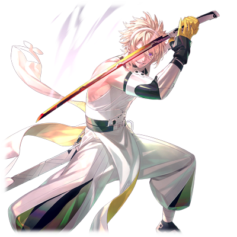
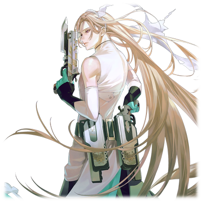

# 安夏尔·奥达奇亚

| 角色信息   |          |
| ----------- | ----------- |
|名称|安夏尔·奥达奇亚
|年龄|容貌年龄28岁左右（再生后7年）
|职业|游击队队员
|对应歌曲|Daphnis
|初出版本|Chunithm SUN

## Episode 1 那双眼中见到了什么

>好好地看着，绝对不要背过身去。在这个两极化的世界中不停地寻求着活着的意义吧！

当我和马尔杜克在地上“再生”的时候，世界已是一分为二，处在战火之中。

愤怒，憎恨，放弃，悲哀。

这些与理想世界背道而驰的东西，正遍布于这个世界上。

我们被教导要向那些被负面的感情的人们伸出援手，拯救他们。

但是，这种漂亮话起不到任何作用。

这些被世界否定的人们的愤怒，只靠话语是无法镇住他们的，也没办法让他们停止破坏与杀戮。

这样的世界，真的能够称之为我们梦寐以求的理想世界吗？

 

应该怎么拯救这个世界？到底要做什么，才能实现那个理想的世界呢？

这个问题的答案，想必不在我的心中。

所以，我决定参加军队。

为了保护重要的人，为了走上前线，亲自左右这个世界的发展，我必须奋斗下去才行。

我一定要找到这一切的答案。

我要找到——这个世界真正的模样。

## Episode 2 奇妙的缘分

>真是奇妙的缘分啊。前两天我们还在互相厮杀，现在却站在一条战线上，祈祷他们能够平安无事什么的……

为了追踪被红发眼罩男·洛特带走的尼亚·尤迪特和索罗·莫尼亚，安夏尔和马尔杜克前往了卡斯比大裂谷地带。

在各种机缘巧合下，他们与米斯拉·特尔塞拉等人达成了合作关系，并且在他们的助力下前往追击洛特的船团。

但是，洛特却用索罗作为诱饵，带着尼亚远走高飞。

就在众人拼尽全力从坠落的飞船之中救出索罗，准备继续追赶洛特的时候，从友军那里传来了信息。

真人强硬派的大军已经到达了防卫网前，正准备向佩尔修斯殖民地进军。不但如此，战场上还出现了大型的机动兵器。

虽然说他们是和本队互不相干，独立行动的游击队，但是在佩尔修斯殖民地的危机面前，已经没有时间先去拯救尼亚了。

安夏尔不得不考虑大局，作出判断。

归还种对于一直在寻求着谋求物种生存之道的真人来说是十分贵重的研究材料，就算只是一具尸体，对他们来说都是无价之宝。

教会自己这些的，正是他们的队长艾萨克。

要是在这里放弃的话，那么尼亚必死无疑。

本来马尔杜克无论如何都想要去拯救尼亚的，但是，本来曾是敌对关系的索罗等人，竟然在这时提出了帮助他们的请求。

明明索罗他们是安夏尔的游击队的目标，但是他们仍然不计前嫌，说是为了报答安夏尔等人救出索罗的恩情，才决定帮忙的。

若是平常，这种提案是绝对不可能同意的。

但是在这短暂的共斗经历之中，安夏尔和马尔杜克早就已经放下了心防。

 

“——那么，就由我们去捉拿那个把尼亚小姐带走的红发男吧。”

“等等。”

“喂喂，又怎么了吗？”

“从这里往南边移动，有我们的前哨基地。在那里补给一下，也会轻松一点的吧？”

“大哥……！？”

“那些抓走尼亚的人是有组织地在行动的。所以他们才会冲向敌人的势力范围。因为越长驱直入，他们要面临的风险就越大。所以，我们这边也要做充分的准备才行。

 

自从在新涅墨亚殖民地遭到洛特的奇袭，安夏尔就在分析那些人的真实身份，而现在，他已经得出了结论。

 

“他们带走的并不是真人的王子——索罗·莫尼亚。而是‘身为归还种的尼亚’。也就是说，他们有什么非得用到尼亚的理由，说不定还准备了能够利用她的价值的设施。所以我们要是小看了敌人的规模，那这一趟怕是有去无回了。”

“有道理。索罗，你怎么看？”

“那我们就诚恳地接受好意吧。如果他们真的是把尼亚当做研究还是什么的对象的话，那肯定不会轻易杀死的……因为我就是这样被他们‘折腾’了多少年啊。”

 

索罗的神色又黯淡了几分。注意到这瘦小的躯体身上早已经受了多少的磨难，马尔杜克的眼神也多了几分同情。

 

“索罗……你……”

“时间宝贵，我们赶紧出发吧。”

“啊，啊啊……”

 

听着索罗的这句话，众人也只能点头回应。

* * *

众人来到前哨基地的时候，刚好正值部分在新涅墨亚殖民地受伤的游击队员驻留于此。

大部分的基地人员都去救助伤兵了，没几个能说得上话的。

于是安夏尔和马尔杜克立刻前往了基地的司令官所在之处。

然而迎接他们的却是一个意外的新闻。

 

“啊？佩尔修斯殖民地沦陷了……不是吧……？”

“就算是玩笑也不会这么开的。就算是我们，现在也仍未接受这个事实啊。”

 

身为基地司令的机械种，只是将迄今为止发生的事情娓娓道来。

包括佩尔修斯殖民地的监督官——艾娃·多米南斯XII在沦陷之前就已经失去联系这件事。

 

“那那些留在殖民地的同伴们不就……”

“不用担心。艾娃·多米南斯XII让那些归还种提前乘坐运输艇离开了那里。去坎达尔殖民地你就能确认他们是否平安了。”

“你说坎达尔！？”

当听到“坎达尔”的时候，马尔杜克的眼睛都瞪大了。因为坎达尔殖民地正是马尔杜克从尼亚那里听说过的，她的故乡。

梅尼·特尔塞拉——也就是养育了米斯拉和尼亚，从拔示巴战役中生存下来的那名女性，现在就住在那里。

 

“是的，有什么在意的事情吗？”

“是的，那里住着一个能够帮上我们的忙的人！”

“是吗。虽说通往坎达尔殖民地的通路仍在我们的控制范围，但还是要小心。”

“非常感谢，司令官大人！那个，其实还有一件事情需要司令官大人帮忙。”

“是什么？”

“请借我们一艘小型战斗艇和适当的燃料。”

 

——马尔杜克和安夏尔回到了正在机场等着他们的索罗那里。

他们说明了迄今为止发生的事情，并且跟索罗他们说明了借到了一艘全新的战斗艇的事情。

 

“操作系统跟迄今为止开的应该差不多。飞船也没什么损伤，也有细心保养，应该会比现在用的这艘性能好一些。”

“安夏尔先生，谢谢你的帮忙。没想到为了救出尼亚小姐竟然让你们花费这么大周章……”

“这是理所当然的。”

 

听着泽法的话，安夏尔再次望向四人，深深地低下了头。

 

“咦？”

“我能做的也就这么多了。还请各位，一定要救出尼亚。”

“大哥！？”

 

有些东西，即便绞尽脑汁也无法以言语传达出来。

所以，索罗也只能努力将自己心中所想的一切说出来。

 

“我是没办法立下约定的。”

 

安夏尔看着索罗的眼睛，那双眼睛中没有一丝虚伪和欺瞒。

 

“我是被那个女的，还有艾萨克盯上性命的人。老实说，我也有想过要么干脆放着你们的请求不管，直接偷偷远走高飞的。”

“……”

“活到现在，我仍然憎恨着这个世界。我有想过，只要跟泽法一起找到一个能够平安生存下去的地方，在那里隐居就已经足够了。对我来说，这样的生活就已经可以称作‘自由’了。但是，在我的心底里，却总觉得这样做是不行的。”

 

索罗看着周围的人。泽法，约基姆，米斯拉。

还有站在对面的安夏尔和马尔杜克。

 

“是取？还是舍？对我来说，能够自己决定取舍，才是真正的自由。所以，我会以我的意志前去拯救尼亚。”

“索罗你也真是的……”

“哈哈，虽然绕了一个大圈，不过这也是他的风格吧。”

“多谢你，真人的王子。”

 

安夏尔露出了笑容，而索罗的脸颊也有些发红，脸歪向了一旁。

 

“总、总之就是这样！”

“呵呵，是吗。”

“那么，让我们出发前去救尼亚吧！”

“是啊！就算只是为了马尔杜克，我们也得把尼亚救出来才行啊！”

“等等，为什么突然出现了我的名字啊！”

 

——等到准备完毕，战斗艇就此启程。

看着远去的战斗艇，安夏尔想着。

 

（艾萨克队长，请原谅我选择了与您不同的道路。而其结果，我会以行动证明的。）

 

在机缘巧合之下成为了命运共同体的真人和归还种们。

他们都是期望着和平的人们。

如果是他们的话，说不定真的能够改变这个世界的未来呢。安夏尔如此想着，踏上了全新的旅途。

## Episode 3 梅尼·特尔塞拉

>正因为她和蕾娜·伊修梅尔一同跨越了拔示巴战役，才有了现在的一切呢。

与索罗一行人别过，安夏尔和马尔杜克带着众多的伤兵离开了前哨基地，踏上了旅途。

在日以继夜地驾驶了几天战舰后，安夏尔等人终于到达了坎达尔殖民地的势力范围。

坎达尔殖民地是位于佩尔修斯殖民地东边的一座殖民地。在拔示巴战役中，当佩尔修斯殖民地沦陷之后，这里就成为了归还种和机械种的反抗据点。

所以，许多从佩尔修斯殖民地逃难而来的归还种都定居在这里。

 

“看来大家气色都很不错啊，大哥。”

“嗯。这也是多亏了艾娃·多米南斯的计策。”

 

现在，艾娃·多米南斯XII究竟去向何方仍旧不得而知。在不知道佩尔修斯殖民地的情况下，这里说不定也会成为战场。

住在这里的人们也意识到了这一点。就算他们逃到坎达尔以东的其他据点，也没有能够避难的地方了。

所以就算是住在这里的难民，也会拿起武器，自发组成防卫部队，进行战斗训练和后方支援行动，为即将到来的大战做准备。

 

“我们还真是不争气啊……”

“大哥？”

“我们那么努力地作为游击队在前线跟真人战斗，但结果还是让他们不得不选择拿起武器保护自己啊……”

 

就像在揶揄自己一般，安夏尔自嘲地说到。

 

“艾萨克队长也已经不在了。结果，我们所做的一切真的有意义吗？”

“……我还是挺敬佩大哥的这点的。”

“突然怎么了？”

“大哥你就是太为大家着想了。不过，会让他们做出这样选择的并不是大哥，是他们自己啊。”

 

马尔杜克环视了一下周围，继续说到。

 

“意义这种东西不过是马后炮的定义罢了。我们只要考虑做还是不做，这不就行了？”

 

马尔杜克莞尔一笑。看着这样的笑容，安夏尔的表情也放松了不少。

 

“……呵呵。”

“啊，这个笑声！你又要取笑我了是吧！”

“不是。我只是觉得，这个世界还是需要像马尔杜克这样的人才行。多谢了。”

“嘿嘿……那，我们也得完成我们的工作才行！首先，让我们找到尼亚的母亲——”

“我说你们还挺吵闹的嘛，在找什么人吗？”

“咦？”

 

突然，一个声音在两人的旁边响起。

两人转过头去，站在那里的是一个穿着黑色斗篷的女人。

她到底是从什么时候站在那里的呢？即便是受过正统的战斗训练的两人，在被她搭话之前甚至都没有注意到她的存在。

这也证明她的气息隐藏的有多好。

 

“啊，这个嘛！其实，我们是听到尼亚的母亲住在这里来着——”

“喂，马尔杜克！”

“哎呀，真巧呢。”

“咦？”

 

这么说着，马尔杜克开始确认起眼前的女人的模样。

 

“你们要找的人，就是我对吧？”

 

女人将头套摘了下来。出现在眼前的，是一头艳丽的黑发。

比这头黑发更加显眼的，是那双一金一蓝的异色眼睛。

这个特征，和之前尼亚描述的极为相似。

也就是说，眼前的这个女人就是——

 

“梅尼·特尔塞拉，从拔示巴战役中生存下来的女英雄……！”

“你，你就是……尼亚的母亲吗！？”

“怎么说呢，要说是‘母亲’什么的也不太对来着……”

 

被称作梅尼的女性，只是露出了微笑。

## Episode 4 幸福的化身

>在这个世界的战火愈发猛烈之前，绝对不能让他们死去。

站好军姿，摆出姿势敬了一礼的马尔杜克，用正式的口吻向梅尼说到。

 

“抱歉失礼了！没想到竟然会在这里见到尼亚……小姐的母亲……！”

 

僵硬的动作，怪诞的语气。

马尔杜克的脸上写满了“紧张”二字，逗得梅尼也笑了出来。

 

“哎呀，不用那么紧张啦。”

“不！那个……”

“哼，临时抱佛脚就是这个样子的。抱歉自我介绍晚了，梅尼·特尔塞拉大人。我是安夏尔，而那边那位是马尔杜克。我们和尼亚是同属一个队伍的同僚。”

“原来如此。那么，尼亚现在去哪了——”

“真的非常抱歉！！”

 

马尔杜克的道歉声打断了对话。

回过头去，他已经深深地低下了头，仿佛随时都要磕到地面了一样。

梅尼似乎察觉到了什么，眉头一皱。

 

“……能跟我详细地说一说吗？”

* * *

“咦，原来是这样啊。”

“您不会感到惊讶吗？”

“因为那是她自己决定的事情。既然已经选择了参军，肯定会有这样的风险。如果她是抱持着半吊子的想法前去的话，那可得好好说说她。”

 

梅尼只是平静地说着。

但是从她那双蓝金相间的异色眼瞳之中仍旧能够看到她对尼亚的关心。

 

“而且，既然米斯拉已经前去找她的话，那就没关系了。”

“您真的很信赖米斯拉·特尔塞拉呢。”

“因为米斯拉，她就是决定好了之后就会一以贯之的类型。拔示巴的孩子……记得叫索罗来着？既然她跟那个孩子在一起的话，那就更加确定了。她的确是一直在思考着这个世界的事情，活到现在的。”

“整个世界的事情？此话怎讲？”

 

就在这时，梅尼的表情变了。变得十分温和，又像是孩子一般天真。

 

“那孩子啊，老是说自己怎样都好，只要让这个世界绽放出笑容就好了。你想想，这种思考方式的她竟然还能和尼亚合得来什么的……”

“确实，我光是想想都觉得不可思议。”

“原来如此，也就是说，您的思想也被她所继承了是吧。”

“该怎么说呢。我跟那孩子也没有血缘关系，我只是让那孩子去做她想做的事情而已。”

 

不知是否是回想起了过去的回忆呢。在她的眼中，似乎是看到了曾经和米斯拉相处的回忆。
 

“归还种和真人终有一日能够互相理解的世界。米斯拉就是为了这一点才会与索罗相遇，然后战斗至今的吧？既然如此，那就必须把错过的东西，重新弥补回来。”

 

梅尼的语气变得更加温和。

安夏尔看着她，想起了曾经那些曾经与归还种共同行动的真人——也就是稳健派的人们。也许对她来说，她跟那些稳健派的真人也有些特别的回忆呢。

 

“如果你们也希望改变这个世界的话，那就去保护索罗·莫尼亚吧。”

 

梅尼说到。

若他死了的话，这个世界就会陷入更加混乱的局面。而且，也会在真人与归还种之间产生绝对无法愈合的裂痕。

安夏尔也想到了这一点。

红发的眼罩男会抓走索罗和尼亚，说不定就是为了引发整个世界的大战。

但是，他们却轻易地放弃索罗，选择带走尼亚。这一点令安夏尔实在是坐立不安。

 

“我相信你们。所以这艘船就交给你们了。然后——”

 

就在这时，梅尼身上的终端响了起来。

在稍微交谈了片刻之后，梅尼将终端接收的数据投影到了空中。

送来的数据，似乎是某个空域的侦察机拍下来的画面。在模糊的画面中，能够看到一尊骷髅状的巨大机动兵器正和一队庞大的舰队一同前往某个地方……。

 

“这是……！”

“大哥，这个东西，莫非就是把佩尔修斯殖民地打下来的那个……”

“啊啊，很有可能。梅尼大人，您知道这个兵器大概前进的方向吗？”

“嗯。这个舰队正向着佩尔修斯殖民地的东北处——卡斯比大裂谷地带的东边前进。”

“我说，这里不就是索罗他们前往的地方吗？”

“果然，在尼亚被带去的那个地方，有什么名堂啊……”

 

在一片沉默之中，梅尼突然拍了拍手。

 

“好，就这么定了！”

 

梅尼向露出惊讶的表情的二人说到。

 

“果然，我也要去。飞船就拜托你们操纵了，我可不擅长开啊。”

“……哈？”

## Episode 5 因果交汇的绀青之都

>那些人的目的究竟是什么？如果我们看错的话，说不定就会招来无法挽回的事情……

面对这突如其来的变化，安夏尔、马尔杜克、梅尼三人决定去追那队疑似是真人主力部队的，带着机动兵器的舰队群。

梅尼准备了一艘老式的气垫船。

毕竟这类载具并未考虑到多人搭载的场合，虽然机动型不错，但是对于三个人来说实在是太拥挤了。

但是现在已经没有时间抱怨了。

深谙兵贵神速的道理，三人在做好了各种准备之后，就从坎达尔殖民地出发了。

沿着通向东北方向的道路，安夏尔根据梅尼所提供的情报，开始搜寻索罗他们前往的地方的线索。

坐在操纵着气垫船的安夏尔旁边，马尔杜克操作着终端，将地图投影出来。

 

“现在米斯拉他们应该在这附近。”

 

画面上显示出来的，是卡斯比大裂谷东边的一片区域。

地图上没有任何标记，只有白茫茫的一片平原，唯一能知道的就是这块地方距离山脉比较近而已。

 

“我认为那些带走了尼亚的家伙就潜藏在这里。梅尼大人，您有什么看法吗？”

 

被问到的梅尼露出了有些惊讶的表情，接着，她闭上了眼睛，努力回想着相关的线索。

片刻过后，她似乎想到了什么，睁开了眼睛。

 

“我想起来了。如果他们的据点在这里的话……那肯定指的就是萨马拉坎达了。”

“萨马……？大哥，你知道这里吗？”

“不，我也不知道。这里难道是机械种管理的地方吗？”

“对。那里也是跟佩尔修斯一样的，主机所在的都市。”

 

梅尼将她在这个地方再生的时候，从系统那里获得的情报，还有来到这里时发生的事情向他们娓娓道来。

 

“Metaverse系统，是将整个星球作为演算机来使用的。虽然每个都市都布置有演算机，但是这些机器也会管理这些地区的各项事宜。所以如果都市发生了什么，主机就可以自发切断跟系统的连接，也可以进行自毁。”

“也就是说，如果他们在这里建立据点的话，很有可能反过来利用这些主机做什么事情对吧？”

“有这个可能。当时在拔示巴战役中，都市损失惨重。虽然强硬派最终撤军，但是监督官还是被破坏，整个都市就这样在无法连接系统的情况下被完全废弃……应该是这样的。”

 

然而，现实却并非如此。

那些真人们，毫无疑问是要利用萨马拉坎达做什么事情。安夏尔结合迄今为止的线索，思考着。

 

“如果说那些真人们打算利用什么方法接触Metaverse系统，并且干涉……不，如果他们只是用来将一部分的区域分割开来那也太小题大做了。而且这样要花费的时间也太多，未免有点大费周章……可是，如果是这样的话，根本就没有什么决定性的证据能确认他们的计划。既然如此的话——”

“等等，大哥！不要一边想事情一边驾驶啊！”

“哦，抱歉。”

（果然，总觉得欠缺了些什么。如果能够找到的话，应该就能够明白他们的目的了……）

 

安夏尔暂时将这件事放到一旁，专心驾驶气垫船。

 

——与此同时。

先行前往萨马拉坎达的索罗等人，却不得不放弃使用战斗艇前往的念头。

 

“真是绝了。这帮家伙竟然还准备了那么大的火炮啊……”

 

躲在小山丘上，约基姆眺望着远处的萨马拉坎达的市街。通往都市的漫长通路，被潜伏在森林之中的无数防空炮塔封锁着。

就算是再先进的军用机，也很难接近这全副武装的都市，要是被炮塔锁定的话，那就完了。

 

“看来只能小心翼翼地前进了。”

“是呢，虽然会花费更多的时间，但总比被发现的好。”

“嘛，好像除此以外也没什么别的东西了。要是能在天黑之后行动就好了……”

“——大家，等一下。”

 

就在三人在前方观察情况的时候，米斯拉似乎感觉到了什么，把手放在耳边仔细地听着周围的声音。

与此同时，三人也感觉到了周围的空气开始震动起来。

约基姆的反应最快，直接摆好了架势，护住了索罗和泽法二人。

很快，他们就明白了震动的来源。

原来是一队舰队正从他们上方经过。

 

“可恶，难道是他们的增援吗！？”

“等等，样子有点不对。”

 

正如约基姆所说，舰队在萨马拉坎达的前方停了下来。就像是呼应着他们一样，又有一队涂装成白色的舰队出现在了萨马拉坎达的上空。

两边的舰队排成了阵型，就这么停留在空中互相对垒。

 

“看起来并不像是友军的样子？”

“那么，应该可以利用一下——”

 

突然，某个庞然大物从一边的舰队掉了下来。

伴随着着地的地鸣声，周围也卷起了冲天的沙尘。

庞然大物的真身，竟是一个巨大无比，即便站在远处的小山丘上也能轻易目视的，大型人形机动兵器。

“喂喂喂！那是什么东西啊！？”

“这也太大了吧！”

“现在是说这种事的时候吗！？”

 

就在米斯拉和索罗一唱一和的时候，两边的舰队也开始了攻击。

 

“说不定现在就是机会呢。”

“那种庞然大物就在前方大闹，怎么可能穿的过去啊！肯定会被炸成炮灰的！”

“那就只能绕路了。”

 

虽然前方都是比较容易前行的开阔地，但也很容易成为敌人的目标，所以他们只能走险峻的小道。

 

“希望我们不会被散射的流弹弹片砸到，就这样无谓地死去吧……”

 

一行人沿着通往萨马拉坎达的迂回路继续前进。随着他们越来越接近，炮火声也越来越激烈，战况已经激烈到不论天上还是地下都能直接感觉到的时候——

不知道又是什么东西，从他们的上空飞过。似乎有几艘战斗艇从萨马拉坎达的方向向这里飞来。

 

“刚才看到的是……难道说，又有新的部队向这里过来了吗？”

“从这里什么都看不到。要是能够找到个瞭望点看看就好了，但是也不知道敌人会不会继续增援……等等，米斯拉！？”

“我稍微过去看一下！”

“到底是什么样的理由才会让她这么行动啊……”

 

并未在意泽法的话，米斯拉只是向着小山丘的山顶冲了过去。

 

“又是一直以来的直觉吗。真是的，又是这个样子……”

 

虽然抱怨着，但是索罗还是紧跟着米斯拉的脚步向前进发。

很快，索罗就来到了小山丘上。

米斯拉正站在山上观察着天空的景象。索罗上前向她搭话。

 

“米斯拉！你就不能稍微说明一下再冲出去吗……”

“那是妈妈！那是妈妈的船啊！”

“哈？你突然在说什么……”

 

这么说着，米斯拉直接掏出了“米特隆”，向着空中射出了几发光之箭矢。

## Episode 6 光与暗的狭间

>让他们能够带着希望活下去，就是我身为军人的使命。

安夏尔驾驶着气垫船，终于来到了萨马拉坎达附近。

“看起来战斗已经开始了。”

 

朝远处看去，宛如要塞一般的萨马拉坎达上空，已经被无数的炮火覆盖，而在炮火间穿行的是两军的战斗艇，此刻，萨马拉坎达的上空的战况已是激烈非常。

 

“虽然本想找个地方降落看看情况的……看来还是小看了他们的索敌范围啊。”

 

雷达画面上立刻出现了数个红点。

那是刚从萨马拉坎达出发的几艘新的战斗艇。

 

“这些战斗艇全部往这里来了！数量……很多！”

“至少报个具体的数字啊！”

 

安夏尔抓着操纵杆，尝试拉开距离。

如果继续这样低空飞行的话，肯定会被敌人包围最终被击坠的吧。

这船上也没什么像样的武器。

 

“把舱门打开。”

“梅尼大人？难道说？”

“用我的‘NINE’把他们打下来。拜托你们开稳点啊！”

“我明白了，还请小心。”

“哼，你以为我是谁啊。”

 

舱门打开，就在梅尼即将射击的时候。

突然，几道光之箭矢穿过，准确命中了那些追来的战斗艇，将它们逐个击破。

片刻间，追击的战斗艇就被全部击坠。

 

“这道光……难道是米斯拉吗！？”

“肯定是。大家都平安无事就好。”

 

虽然仍在气垫船上，但是间接地知道自己的孩子仍然活着的事实还是让众人不自觉地笑了出来。

梅尼一边说着“看来技术也进步了不少呢”，一边露出满足的微笑，看着划过天空的光束轨迹。

* * *

“妈妈！”

 

迎接从气垫船上降下来的梅尼的，是自己女儿的拥抱。

看着正感受着自己的温暖的米斯拉，梅尼也伸出手，紧紧抱住了女儿。

 

“还真是一点没变呢，米斯拉。”

“我一直都是这样的好吗！”

 

在这和乐融融的光景之中，马尔杜克和约基姆，安夏尔和泽法等人都在各自确认着彼此的安好，并且确认着迄今为止发生的事情。

除了索罗一个人。

 

“那就是……米斯拉的……”

 

索罗躲在一块岩石后面，偷偷望着那边众人的互动。

他的视线一直停留在米斯拉和梅尼身上。注视着这宛如一家人般欢笑的温馨场面。

听米斯拉说，梅尼并不是她的生母，只是养母而已。

但是，从远处看去，她们就像是亲生母女一样，可以从中感觉到实在的羁绊。

 

“母亲……吗。”

 

不知何时，索罗把视线从母女身上移开，蹲坐了下来。

不知是否是这个原因呢，索罗感觉自己内心某些黑暗的东西开始渐渐的浮现。越是思考，就越觉得自己将要被那种黑暗所吞噬。

母亲留给自己的，难道就只有这样黑暗的感情吗？就在索罗一人思索的时候，突然，某人的鞋子映入了眼帘。

 

“还真是忧郁呢，索罗·莫尼亚。”

 

就在索罗抬头朝着声音发出方向望去的时候，两人的眼光相对了。

 

“哇啊！”

“啊哈哈！不用这么大惊小怪嘛！”

原来是声音的主人——梅尼弯下了腰，为的是和索罗的视线齐平。

“搞、搞什么啊！”

 

看着这真挚的表情和眼神，从那双眼中，索罗感觉得到这双眼睛似乎看到了很远的地方，仿佛就要将他内心的一切都看透一般。

也正是这个原因，索罗就算再怎么掩饰，还是掩盖不住自己内心的悸动，顿时觉得自己的身体又热了几分。他的目光游离，就像在找能够逃离这里的方法一样。

看着索罗的反应，梅尼笑出了声。

 

“这种勉强自己的样子……让我想起我认识的某个人。”

“哈？”

“这下我明白米斯拉会对你感兴趣的原因了。”

“……”

 

面对这抽象的话语，刚才还围绕在脸颊间的热意已经消失不见。

索罗哑口无言，梅尼只是轻轻地把手放在了他的头上。

 

“从你的心中……同时能够感觉得到光明和黑暗呢。”

“你、你也跟那家伙差不多嘛。老是说这些不明就里的话……”

“趁还年轻就尽量烦恼吧，小子。”

 

这么说着，梅尼肆意地摸着索罗的头发。

 

“等等……你在、做什么……啊……！”

 

索罗慌忙挥手将梅尼赶开。

似乎看着这样的索罗很有趣的样子，梅尼甩了甩手，笑了出来。似乎是平时照顾米斯拉和尼亚时的习惯带了过来。

 

“啊！真狡猾！我也要摸摸看！”

 

米斯拉在远处也看到了这一画面，赶忙冲了过来。

对于索罗来说，眼前就像是出现了两个米斯拉一样，他深深地叹了一口气。

 

“现在不是做这种事情的时候吧……”

“那就等到全部都搞定了之后在做呗！”

“才不会做！”

 

虽然只是短暂的安稳时光。

梅尼还是看到了，这个即便被米斯拉耍的团团转，却还是乐在其中的少年的身姿。

她可以确定，眼前的这个少年，不会像拔示巴那样走上同样的黑暗道路。

 

“那么，是时候决定该怎么行动了吧？”

 

约基姆的话把众人的思绪拉回了现实。

为了决定之后的方针，众人躲进了旁边的森林之中，开始了作战会议。

* * * 

“你们就趁乱绕过战场前往萨马拉坎达吧。”

 

梅尼开口的第一句就是这个。

 

“可是啊，就算要靠我们的双脚，应该怎么到那里啊？那个怪物还在战场上大闹，说不定连我们都会被卷进去啊。”

 

除了梅尼以外，其他人都是这么想的。

然后，梅尼就这么云淡风轻地说着。

 

“那个东西，就由我们拖住！”

 

接着她拍了拍安夏尔和马尔杜克的肩膀。

 

“咦？我们也要去！？”

“毕竟就我一个人还是太勉强了。”

“……我明白了。但是有什么不同的吗？”

“梅尼大人，难道您有什么计策吗？”

“放心吧。船到桥头自然直。”

 

看着梅尼这仿佛异想天开一般的发言，除了米斯拉以外的众人都露出了惊恐的表情。只有米斯拉望着母亲的眼睛，等待着她的下一句话。

 

“嘛，倒也不是无计可施。不过相比较直接在这里讲解还不如——”

 

就在这时，一阵足以让周围的空气都为之震动的强烈冲击波伴随着巨响袭来。

众人连忙到视野开阔处确认情况。原来是攻打萨马拉坎达的部队，正利用舰艇空降机动兵器至萨马拉坎达的外围区域发动攻击。

空降时的冲击力十分大，覆盖萨马拉坎达的疑似力场一样的东西也无法维持，青色的围墙墙体直接暴露在外。

 

“这些家伙为了发动特攻看来也开始不择手段了。不过这样的话就更容易侵入内部了，接着就是……”

 

安夏尔的视线转向现在仍旧在战场上肆虐着的机动兵器。

携带着巨剑的大型机动兵器——德威格。

德威格的躯体已经经受了无数的炮火侵袭，甚至失去了一只手。但是就算大半身体都被炮火灼烧，那魔剑的锋刃仍未折断。

现在那台机动兵器正不分敌我地发动攻击，将视野里一切的东西都以巨剑斩个粉碎。

 

“真的要和那东西打吗……”

“做好觉悟吧，马尔杜克。”

“啊啊，我知道的。这也是为了保护尼亚而战啊！绝对会把那家伙打倒的！”

 

看着两人也已经进入状态，梅尼拍了拍手，自信地向其他人说着。

 

“尼亚就拜托你们了哦。”

 

目送着梅尼他们准备离开这里，米斯拉露出了寂寞的表情，轻声地念叨着“妈妈……”。

那是当然的，他们三人要面对的敌人实在是太过强大了，就算说是有去无回也不为过。

 

“哎呀？一直帅气而自信的米斯拉是跑去哪了呢？在这儿是吧？”

 

这么说着，梅尼伸出手捏住了米斯拉的两颊，撑起了一个笑容。

 

“为了你能够露出笑容，我也会去战斗的。所以不要觉得寂寞，米斯拉·特尔塞拉。”

“……嗯！”

“啊对了，少年。”

“我吗？”

“不管前方发生什么事，你都得向前前进哦？要是你又打退堂鼓的话，我可要好好地摸摸你的头了哦？”

“哼……这种事还是免了吧。”

“那就好。”

 

“……”

 

索罗望着远去的三人。

被米斯拉当做母亲一样仰慕的那个女人，这一刻，那背影，是何等的高大，伟岸。

* * *

站在战斗艇的后方甲板的梅尼，向已经在各自位置上就位的两人发出信号。

从通信机中传来的声音都能感觉得到两人无比紧张的呼吸声。

 

“放心吧，谁都不会死的。”

“我自从参加军队以来，就决定了无论任何时候死去，都要不留后悔。但是，我在身为一名军人之前，我也是一名归还种。同时，也是一名为未来着想的人类。在我见到那未来的模样之前，我是不会死在这里的！”

“我也是，送死什么的那还是算了吧。我要把那家伙砍成两半，然后在‘母亲’的面前炫耀一番啊！”

“……等等，怎么从刚才开始就一直以‘母亲’称呼啊。听着就不好意思，能不能以‘梅尼’称呼啊？”

“不，那个还是有点……”

“也罢。放松也放松完了，我们上吧！”

 

下一秒，梅尼就向着钢铁的巨人举起了枪。

指尖一动，那支跟随着梅尼南征北战的“NINE”——第九音素临界加速装置的扳机，也随之击发。

## Episode 7 决意之一闪

>机会只有一次。要是打偏了的话，我们就没有明天了。

“NINE！<ruby>点火·指令<rp>（</rp><rt>CODE·IGNITION</rt><rp>）</rp></ruby>！！”

“驱动要求承认——启动。”

 

打头阵的，是梅尼的当头一击。

笔直飞行的光束，直接命中了暴走中的德威格的背后。

德威格顿时停止了动作。

接着，德威格胸部那类似骸骨一样的部位突然红光一闪，向着战斗艇发射了赤红色的光线。

 

“安夏尔！加速！”

“明白！”

 

赤红色的光线命中了刚刚战斗艇还在停靠的地方，将那片地方的地形整个都挖空了。

 

“就这样把它引出萨马拉坎达！”

 

三人驾驶着着索罗等人乘坐的飞船，用最快的速度远离萨马拉坎达的空域。

梅尼的目的只有一个。

那就是尽量让德威格远离萨马拉坎达以减少被害，把它引到附近的废弃都市停止它的行动。

 

“要是有机会的话真想直接把它打倒，但那也太麻烦了。”

“虽然有想过要不要把这东西撞进卡斯比大裂谷的谷底……不过那也太远了。我们现在已经在迎击火炮范围内了，适当做些威吓射击就行。”

“好嘞。”

 

三人将战斗艇保持在低空飞行的姿态，冲入了迎击火炮的范围内。虽然因为战斗的余波导致各个地方的炮塔减少了一些，但已经足够吸引德威格的注意力了。

在雨点般的炮火之中，梅尼站在后部甲板上持续向着德威格发动挑衅射击。

虽然德威格已经是伤痕累累，也几乎失去了机动能力，但当那个东西捕捉到梅尼的瞬间，它的疯狂程度就更进一分。

两眼瞳孔，露出尖牙吼叫的德威格，简直就像一只发狂的猛兽。

 

“！要打过来了！”

“咕！”

 

安夏尔赶忙掉转船头，下一秒，闪光就从船体的上方划过。

 

“要提升速度了！”

 

说时迟那时快，德威格就像是刚才的迟钝动作完全不存在了一般，向着他们冲了过来。感觉下一秒就会将手上的巨剑向他们挥过来一样。

安夏尔也不甘落于其后，提升了速度，将德威格引向更远的地方。

引向比迎击系统范围的森林地区更远的地方——马尔杜克所埋伏之地。

 

“——终于来了吗。”

 

地面的鸣动甚至通过刀柄向着手心传了过来。

马尔杜克知道，很快就要轮到自己出手了，深深地吸了一口气。

驾驶着气垫船预先来到这里的他，正藏在树下，握着刀等待着。

等待着那个时机的来临。

等待着将剑的输出功率提升到极限，以不顾一切的光之斩击，击中德威格的脚部关节的瞬间。

渐渐地，震动愈发激烈，大地也伴随着地鸣颤抖着。

若这乾坤一掷的攻击落空，一切就结束了。

但是，即便是如此关键的瞬间，也不能乱了呼吸。

胸中愣是有千斤重担，马尔杜克还是集中了精神，等待那个时刻的来临。

 

“接下来可就是关键了，拜托你了，马尔杜克！”

 

在战斗艇从马尔杜克的上空飞过之后，德威格也紧随其后——

 

“封刃——最大解放！！”

“——驱动要请，承认。”

 

马尔杜克用尽全力的一刀，在瞬间迸发出了足足有刀身十倍以上长度的能量刀身，命中了德威格。

德威格的一只脚被命中，打成了数块碎片，在大地上砸出一条深沟。就在马尔杜克以为德威格必然因为这突然的袭击而失去平衡的时候，它却利用这一瞬间的反作用力——跳了起来。

 

“什么……！”

 

高高跃起的德威格，向着飞在前方的战斗艇，挥下了巨剑。

战斗艇终究还是没有躲过攻击，随着巨剑轻轻一划，船体的一部分就被刮了下来。

 

“大哥！梅尼！”

 

这突如其来的攻击造成的反冲力令战斗艇失去了控制，直接掉入了都市的废墟之中。

## Episode 8 最后一赌

>为了保护重要的人，我们不能屈服在这里！就在这里永远沉睡吧！钢铁的巨人啊！

面对这预料之外的攻击，安夏尔和梅尼乘坐的船坠入了废墟之中。

马尔杜克无法确认两人的情况。就算怎么呼叫都没有应答。

马尔杜克脑中不断闪过“死”这个字。

为了拂拭这种不安的感觉，马尔杜克强打精神，赶紧前去驾驶气垫船。

 

“——！”

 

但是，由于先前的奋力一击消耗了太多体力，脚已经开始不听使唤地发抖，马尔杜克就这样瘫倒在地。

 

“可恶……怎么能在这种地方……”

 

马尔杜克趴在地上，试图站起来。

就在这挣扎的期间，在那漫天的沙尘和烟雾之中，德威格的怒吼仍旧在上空回响着。

艰难起身的马尔杜克，只能默默地祈祷着两人的平安。

 

“等等我啊……我很快就会过去的……”

 

——与此同时。

“咕……总之，算是勉强避免了最坏的情况吧……”

 

安夏尔在坠毁的战斗艇中醒了过来，立马确认了现在的情况。

由于避免了与废墟的垂直碰撞，战斗艇才没有四分五裂。

自己应该就只是失去了十几秒的意识吧。德威格仍旧倒在地上，试图撑起那巨大的身躯。

就在这时，安夏尔想到了某件事。

 

“梅尼大人，去哪里了……”

 

船内没有她的身影。

靠思考努力掩盖着身体各个部位的疼痛，安夏尔向船外走了出去。

 

当他走出飞船，很快就看到了梅尼。

她正一瘸一拐地向着废墟中心矗立着的高塔前进。

 

“请等一下！靠这样的身体您还要做什么！”

“安夏尔，你没事真是太好了……”

“相比我，你的伤不是更重吗……！！”

 

是因为固定在后方甲板上来不及躲避吗。

梅尼的身体各处已经流出了鲜血，手指也断了几根。

但是，即便遍体鳞伤，她还是咬紧牙关，向着安夏尔说到。

 

“虽然跟计划略有不同……不过，只要用那座塔借用‘系统’的力量的话……说不定就能够将那家伙彻底消灭吧……”

“那种废弃的高塔能做什么？而且，‘借用’是什么……”

“是赌注哦。名为奇迹的赌注。只要成功引发**三次**的话，我们应该就能够打赢那个东西。”

 

在塔的另一面，是正拿着巨剑试图撑起身子的德威格。

在现在这千钧一发的关头，已经没有时间思考了。

 

“我明白了。虽然有些痛，还请您忍一下。那么，失礼了。”

“咦？”

 

安夏尔立刻蹲下身来，托起了梅尼的脊背和腿部，横抱了起来。虽然梅尼那略显慌乱的样子有点滑稽，但安夏尔只以温柔的笑脸回应。

 

“来吧，我们走。”

 

两人很快就到达了塔底。

在安夏尔的搀扶下，梅尼触摸了高塔旁准备好的终端。很快，停止机能的高塔再次亮起光来——一条通往深处的道路显现出来。

 

“去最上层。”

 

似乎是听到了梅尼的声音，两人站着的平台浮了起来，向着高塔的顶层移动。

当两人来到最上层后，昏暗的房间渐渐被灯光点亮，一个发着光的箱型构造体出现在他们面前。

 

梅尼在安夏尔的搀扶下来到了构造体面前，从里面抽出了一条长长的缆线，然后连上了“NINE”。

不知道什么东西通过线缆流入了NINE，梅尼轻轻地点了点头。

 

“好，这就是第一项赌注。”

“竟然直接连接了Metaverse系统的能量管道……？”

“把你的东西也借我一下。用我的权限分给你一些力量吧。”

“这种事情……你到底是什么人……”

“解释什么的之后再说。现在还是先打倒那家伙吧。”

“也就是说……这就是第二个赌注。”

“理解的还真快啊。对，我们就要在这里，用全部的能量向它发动攻击。”

 

梅尼一边说着，一边操作着构造体，打开了一片墙壁。

从那片墙壁能够直接看到正缓缓向这里接近的德威格

 

“请等一下，那第三个赌注究竟是什么？”

“这种事情在第二件事情之后再说，快点！那家伙要来了哦！”

 

安夏尔再次将梅尼抱了起来，奔向打开的墙体处。

德威格正一步步地逼近他们。

要是那东西确认到了这边的情况，德威格的赤红闪光就会直接让整座塔灰飞烟灭吧。

 

“如果要确实地打穿那个东西，就需要等到光束发射的瞬间，那个瞬间，机体会暴露中心的部位。不过那也意味着要暴露这里的位置。这可真是前所未有的豪赌啊。”

“不是挺懂的嘛。”

 

安夏尔举起了双枪。

梅尼也用自己能动的一只手握紧了“NINE”、

 

“好了，要上了哦！‘NINE’！<ruby>光辉·指令<rp>（</rp><rt>CODE·RADIANT</rt><rp>）</rp></ruby>！！”

“超频驱动请求承认。限制——解除。”

 

就在这瞬间，随着梅尼的呼唤，NINE变身成了一把闪耀着白色光芒的枪。

这闪光也吸引到了德威格，它的眼中闪过了血红色的光芒。

 

“双枪啊！呼应我的意志吧！”

“超频驱动请求承认。限制——解除。”

 

安夏尔的双枪也变成了同样的形状。

德威格进入了发射的姿势。然后——

 

“去吧啊啊啊啊啊啊啊！！”

 

两人按下了扳机。也几乎是在这个瞬间，德威格的身体也迸发出了光束。

两道光激烈地碰撞着，将周围的废墟照的宛如白昼。

压缩着的能量似乎还保持着势均力敌的状态，但很快，能量的角力就开始向着一方倾斜。

白色的光芒，吞没了德威格的光束，并且连着将德威格的中心部一并贯穿。

下一秒，能量的冲击波传遍了德威格的全身——终于，整台机子开始崩坏。

 

“——————！！”

 

像是混合了无数的怨恨和痛苦的悲鸣吼声，震撼了周围的空气。但是，即便如此，即便拖着分崩离析的身体，德威格也没有停下步伐。

 

“就算在那种状态……也要继续战斗吗？

 

就在这时，德威格的眼睛闪过一道耀眼的光芒。

就像是挤出了最后的一点力量，德威格举起巨剑，向着前方狠狠地扫了过去。

结果，整座高塔也被一刀两断。在看到这副光景的时候，德威格的眼中也失去了最后的光芒。

 

“可恶，整座塔在倾斜啊！”

“还真是死不罢休啊。看来这最后的赌注，是对面赢了吗……”

 

由于之前释放了强大的力量，似乎对身体造成了更大的负荷。不知道是不是连安夏尔的那份也承受了呢，梅尼已经无力动弹，只能这么跪在原地一动不动。

就算是身体能力更高的归还种，从这种高空掉下去也是会死的。但是就算这样留在塔里的话，也会被倒塌的建筑物压死的。

但是，明明前方就是无可避免的死亡，梅尼的脸上也没有一丝绝望和痛苦。

不但如此，她的脸上甚至还挂着一副再无遗憾的满足笑容。

 

“您这种人也真是……嗯？”

 

就在这时，安夏尔注意到了什么。

就在梅尼被搀扶起来之后，就在她还露出疑问的表情的时候，安夏尔露出了笑容。

 

“不……这最后的赌注，是我们赢了！”

“……咦？”

“那么，请您稍微忍耐一下！”

 

这么说着，安夏尔就抱起了梅尼，从渐渐倒塌的高塔上纵身一跃——

 

“大哥！！！！！”

 

向着这里笔直赶来的——正是马尔杜克的气垫船。

马尔杜克打开了舱门试图接住两人。但是不知道是不是操作不精，还是气垫船的状态不好呢，始终无法稳住船体。

安夏尔两人距离气垫船正越来越远。再这样下去的话——

 

“唔噢噢噢噢噢噢噢噢噢噢噢噢！！”

 

在这短暂的瞬间，马尔杜克伸出了舱门，抓住了安夏尔的手臂。

 

“好嘞！我成功啦，大哥！”

“喂，马尔杜克，你怎么把手从操纵杆上放开了，你打开了自动驾驶了吧？”

“咦？……啊啊啊啊！！”

“别‘啊啊啊啊’了！赶紧给我让开！”

 

在安夏尔的指点下，马尔杜克才发现事情不对。

把两人拉到船舱之中，安夏尔才重新坐上了驾驶席——最终，他们三人幸免于难，勉强躲过了跟障碍物撞个粉碎的命运。

 

“哈哈……还真是千钧一发啊……”

“真的是，非常抱歉！”

“……没想到，到最后的最后竟然还有如此极限的赌注啊……”

“呵呵，就是呢。”

“嗯？你们在说什么？”

“别在意。一切都已经结束了。”

 

由于强敌已经被打倒，三人那根紧绷的弦终于是放松了下来。

 

“虽然……还想就这样直接前往萨马拉坎达的，不过……感觉要撑不住了……我就先睡了……”

 

遍体鳞伤，筋疲力尽的梅尼，在刚说完这句，就立刻闭上了眼睛，呼呼大睡。

 

“哈哈，这位大人真的是……果然真就应了那句，龙生龙，凤生凤吗。”

“呐，大哥，用我能理解的话描述一下吧。”

“这对母女，还真的是超出了我们想象的，破天荒的母女俩啊。”

 

梅尼在安夏尔的怀中沉沉睡去，挂着安详地笑容。

想必，她也在做着梦吧。

做着被所爱的家人簇拥着的，充满笑容的美梦。
