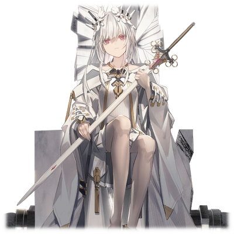
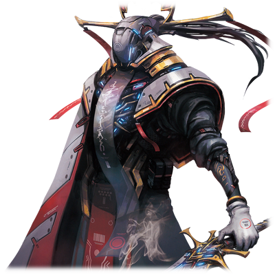

# 拔示巴·阿西德菲尔

|
角色信息 
  |          |
| ----------- | ----------- |
|  名称 |拔示巴·阿西德菲尔
|年龄 |不明（外表大概十几岁左右）
|职业|真人们的希望象征
|对应乐曲|[CRYSTAL_ACCESS]
|初出|Chunithm NEW

注：人物原名バテシバ对应了《圣经》中的出场人物，拔示巴（Bathsheba）。

**注2：部分剧情包含了血腥和残酷的表现，请谨慎阅读。**

## Episode 1 被诅咒的命运之子

>如果不论是谁从生下来就被赋予了某个使命的话，那么，我应该做的事情那就是……呵呵……

踏着蹒跚的步伐，一位少女被侍女带着，前往祭坛。

这里是奥林匹亚斯的圣堂。仿佛就像在隐藏什么东西一样，大厅一片昏暗，只有一扇大窗敞开着，让阳光倾泻进来。

在这昏暗而阴沉的圣堂之中，从窗口照下来的光芒，照亮了少女的脸庞。

细小，脆弱，仿佛随时都会折断的纤细肢体。

苍白瘦削的脸庞还有红色的双眼。

足以让人联想到玻璃工艺品一般的，脆弱虚幻的少女。

但是与那虚幻的气氛相对应的。

是她手中握着的，那把反射出妖艳光芒的利剑——

  

拥有如此虚幻外表的少女——拔示巴，并没有属于对这个世界来说的，常理上应有的“母亲”。

通过机械装置的神明之手，模仿人类而制造出来的生命——“真人”。

接受了这虚伪的生的真人，却也模仿着人类，将他人扮成母亲的模样，将自身的存在寄托于其中。

简直就像是在模仿着人类的行为一样。

但是，拔示巴并不需要进行这样的“仪式”。

要问为什么的话——那就是因为拔示巴有着“真正的母亲”。

她并不需要仪式上的母亲这样的存在。因为，她正是独一无二的，由自然分娩诞生出来的，唯一的真人。

虽然她的生母在她出生的时候就也跟着死去了，但是，那些将人类的行为捧上神坛的真人们将她当成了“命运之子”，她也在真人们的指导者亚哈的名下悉心培养。

成为让真人距离人类更进一步的，希望象征。

这就是拔示巴被赋予的使命。

## Episode 2 内里之光，外界之影

>想要抵抗那位大人什么的……我怎么可能做到。那可是养育了我们的恩人啊……

拔示巴和几名少年少女们一同生活在一间似乎是养护设施的地方。

虽然她的生活衣食无忧，看似完美无缺，但是，只有一件东西这里是没有的。那就是——自由。

周围被高高的白墙所包围，似乎看不到尽头。

对拔示巴来说，这片高墙之内的一切，就是她的整个世界。

但是，拔示巴并不在意这些。因为如果从一开始就不知道自由为何物的话，那就不会感到不自在了。

劳逸结合的学习生活，还有与朋友们一起度过的快乐时光。

属于拔示巴的这个“世界”，就是如此的美好。

  

就在如此平和进行着的日常之中，某天，和拔示巴非常亲昵的一位少女，突然从这里消失了踪影。

面对着因为突如其来的离别而悲伤的拔示巴等人，负责教育他们的养母们只是淡淡的说到。

——少女去了别的殖民地生活了。

而只要他们长大了的话，他们就能从这里出去了。听到这样的话语，孩子们也明白了那位少女是明白了自己的使命，深明大义，选择了离开这个地方之后，大家才安心了下来。

但是，只有拔示巴一人见到了那个东西。

那天晚上，她见到了正一个人躲在角落哭泣着，乞求着那名消失的少女的原谅的养母的身影。

  

在这之后，又经历了几年。

就像之前所说的一样，设施中的少年少女，一个又一个地，从设施中离去。

最后，只剩下拔示巴一人留在这里。

虽然设施中只剩下自己一个人生活着有些寂寞，但一想到大家说不定正在外面的世界幸福地生活着的时候，拔示巴就觉得即便是再寂寞的日子她也能够乐观对待。

就在她这样过着孤单一人的生活的时候。

拔示巴终于收到了养母的传唤。
  

“拔示巴，你也差不多到了即将从这里离开的日子了。”

“是吗……。那么，之后，我要去哪里呢？”

“首先先去亚哈大人那里吧。他肯定会告诉你以后应该怎么做的。”

“……我明白了。”

  

在养母的带领下，拔示巴终于第一次走出了白色的高墙，向着外面的世界进发。

不知道在狭长的隧道之中走了多久呢。在漫长的隧道之中回响着的脚步声和呼吸声，以及那一成不变的布置，让拔示巴头晕目眩，连时间的观念都被模糊了。

就在她的思绪开始变得一片模糊的时候，一道微弱的光芒从远处照了进来，她才注意到已经走到了出口附近。

穿过出口，出现在拔示巴眼前的，是一片毫无生命气息的，被无机质的器材和设备所占据着的，类似研究室一样的场所。

然后，就像是接替沿原路回去的养母一般，亚哈站在研究室的中央，伸出双手——

“……欢迎你。我们的‘希望’啊。欢迎来到我的研究所。”

“很荣幸能见到您，亚哈大人。为我提供如此优渥的生活条件的，就是您吧。请让我再一次，向您表示衷心的感谢。”

  

亚哈听着拔示巴的话露出了笑容，然后指示她将身上的衣服全部脱下。

面对这一指示，拔示巴露出了困惑的表情。亚哈看着困惑的她，淡淡地解释着。

“我虽然在各方面都有进行研究，不过我也是一名医生啊。这只是为了迎接你而进行的一次健康检查而已。”

既然自己的恩人都这么说的话，那应该就没有别的意思了吧。如此想着的拔示巴，褪下了自己身上的全部衣物。

亚哈叫拔示巴“继续靠近一点”之后，伸出手，轻轻地碰了下她的腹部。

“嗯……虽然还有些**青涩**……不过应该没什么问题……”

这一行为令拔示巴很不可思议地感觉到了些厌恶，但她并没有反抗的意思。

然后，当她被亚哈以进行检查的名义躺上手术台的时候，一股强烈的睡意席卷了她的意识，让她昏睡了过去。

看着拔示巴的身体，亚哈自言自语着。

“果然，那些‘仿品’是不行的啊……这次……这次一定要获得那最为纯粹，最为真实的‘希望’才行……”

## Episode 3 呜咽的肉块

>为什么……为什么当时带着笑容离开的各位，会变成这副模样……这，真的不是在做梦吗……？

拔示巴再次醒来之后，对自己身处何处不知所措。

“这里是……对了……我记得和亚哈大人见了一面……之后是什么时候睡着的呢……”

感觉身体有些沉重。拔示巴仿佛做过一场噩梦般，冷汗直冒，汗水浸湿了她的刘海。

拔示巴摇晃着仍觉沉重的头脑，确认着现状。

然后，她才注意到手术台上沾了些血迹。她慌忙确认了自己的身体有无异状，但是，除了自己身体的下腹部有些许的违和感以外，并没有任何显眼的外伤。

不过，就算这么说，还是无法把握自己目前所处的状况。

但是，这个研究所散发出的些微的可怕气息还是让拔示巴坐立不安。

拔示巴的心里只想着尽快离开这里，于是她开始了行动。

拔示巴从手术台上轻手轻脚地下来，拖着摇摇晃晃的身体走向房间外部，沿着昏暗的走廊前进。

  

但是，不论怎么走，都碰不到别的东西，完全无法掌握整个建筑的结构。

不管走到哪里，都是和先前所在的研究室十分相像的房间，然而里面却空无一人，令拔示巴更加不安。

随着拔示巴在这一片死寂，暗无天日的走廊中行进着。在用手贴着墙壁前进了一阵子之后，她听到了类似于哭声一样的微弱声音。

顺着声音发出的方向前进，拔示巴来到了一扇大门面前。

从门中传出啜泣一般的哭声，还有偶尔传出的苦闷的呻吟声。拔示巴确信了，门后发出的声音，就是“人的声音”。

  
“好可怕……但是，总觉得有种必须上前确认的感觉……”

  
拔示巴战战兢兢地将手了过去，下定决心，推开了大门。

瞬间，映入眼帘的光景，令她无比后悔自己的这个决定。

这不是她应该看到的光景。而在这一刻，她所知道的整个“世界”，都将就此变样。
  

“怎么会……难道说……！！”

在宽敞的圆形房间中，以放射形状摆放着无数床铺。

在那些床铺上躺着几个人。在他们的身上，连接着无数从连接的部位来看，怎么看都不是治疗所需的管线。

呻吟声和哭泣声，就这么跟滋滋声和机械杂音一样的声音混杂在一起，在房间中回响。

那些勉强活着的“物体”的真面目，竟是那些曾经和拔示巴一同生活在设施中的少年少女们。

拔示巴已经被吓得瑟瑟发抖，然而另一个更加异样的东西映入了她的眼帘。

那是放置在房间的最深处的，一个狭长的类似于水槽一样的透明玻璃缸。

在那个容器之中，正漂浮着一个长着跟拔示巴有着同样头发的，宛如少女一般的“物体”。

那个肉体的模样甚至难以名状，扭曲到简直就像是小孩子的涂鸦一样。

只是个不成人形，丑陋血腥的肉块而已。

  

到底发生了什么。面对脑子已经无法理解眼前的一切，在原地倒吸了一口凉气的拔示巴，那个肉块发出了声音。
  

“拔……示……巴……”

“！！你没事吧！？到底发生了什么！？”

“杀……了……我……”
  

呼唤着拔示巴的名字的，正是那个在养护设施之中关系特别好的那个女孩。

然而，那声音却并非声带发出的纯粹声音，而是像坏掉的音响一样的，混杂着杂音，荒腔走板的声音。

遭到改造的不止有声带。仔细一看，手脚也被改造成了非人之物。身体早已到达极限，只是靠着机器强行撑着一条命而已。

而这位少女，现在却出现在自己眼前，呼唤着拔示巴自己的名字，恳求着自己的死亡。

注意到眼前的景象是现实的拔示巴，无法忍住从胸中涌出的呜咽声，跪在了地上。
  

“哎呀，真是个坏孩子啊。竟然会溜到这种地方……”
  

亚哈带着数名研究员，不知何时，已经站在了拔示巴的背后。

那名少女注意到了亚哈，从喉咙深处努力地挤出一丝咒骂之声。
  

“这个……恶魔……快把……我这一团糟的身体……恢复原状……！”

“哼，区区‘仿品’。只是乖乖地当个失败品也许还有些价值，现在看来，甚至连家畜都不如啊。”
  

亚哈不屑地说着，然后就像习以为常一样，将手伸向生命维持装置的开关。

拔示巴在那瞬间立刻就明白了一切，但是，即便发出了不成声音的呐喊试图制止，但是仍然无法赶上。
  

——啪。
  

“啊啊啊啊啊啊啊啊啊啊啊啊啊啊啊啊啊啊啊啊啊啊啊啊啊啊啊啊啊啊啊啊啊！！！！！！”

躺在床上的少年少女们，一起发出了凄厉的惨叫，身体扭成了一团。

他们口吐白沫，四肢止不住地痉挛，失心疯一般拼命地撕扯着连接着自己身上的管线。出现在拔示巴眼前的，已经是一副常人难以想象的地狱图景。

拔示巴无力地瘫倒在地上。一股温暖的液体浸湿了她的臀部。
  

如此恐怖，如此绝望。

就像在说给自己听一样，拔示巴拼命地说服自己眼前的一切不过是做梦。
  

“不对……这绝对是假的对吧……如果不是这样的话……那么……”
  

然而即便再怎么暗示自己，她的脑海中始终会回想起刚才映入眼帘的，那个曾经是自己最亲最爱的好友的少女的双眼。
  

“不……那双眼睛……怎么可能是假的……怎么会……怎么会！！！！！”
  

人为了让身心能够逃离强烈的负荷，都有着与生俱来的自我保护机能。

在拔示巴彻底崩溃之前，她的大脑，选择了暂时中断一切的意识。

## Episode 4 母体

>母体……为了这种事就把大家给……绝对不会原谅你……我是不会成为你的道具的！

等到拔示巴再度醒来，她又一次躺在研究室的手术台上。

由于注射过镇静剂，拔示巴的视野仍旧摇摇晃晃，无法定位。
  

“终于醒来了吗……我等的希望……我等的‘命运之子’啊……”
  

在模糊的视野之中，拔示巴看到了亚哈的身影。声音就像经过混响一样，在耳边轰鸣着。
  

“虽然还想稍微慢一点进行的……不过现在看来只能让你早点意识到自己的使命才行了。”
  

亚哈开始缓缓道来。

对于无法自己繁衍后代，只能被人工制造出来的真人来说，最能够让他们距离人类更加接近的象征。

那就是——**生殖活动**。

曾经，超越了奇迹的希望，降临于这个本无可能的世界。

引发了这一奇迹的人，正是通过自然分娩的形式，生下了拔示巴的，她的母亲，还有作为自然分娩降生于世间的拔示巴自己。

亚哈为了让奇迹能够稳定地再现，确立了一个计划。

那就是——“让全部的真人，从持有生殖机能的单一母体中诞生”这一计划。

那些曾和拔示巴一同生活的少年少女们，他们都是以拔示巴的母亲的细胞作为蓝本而制造出来的**定制胎儿**，然而本该很有希望能够达成这一目的的他们，却不论是谁，都未能拥有生殖的机能。

最终，完美继承了**生殖机能**的，只有拔示巴一个人。

也就是说，拔示巴，正是被赋予了“孕育距离人类更进一步的真人的母体”这一使命的，最后的，也是最重要的存在。

  

看着正在一边滔滔不绝地说着的亚哈，拔示巴想起了那副光景。

与母亲，以及自己共享着相同基因的朋友们。还有那漂浮于水槽之中的“不成人形的肉块”。

即便是被制造出来的生命，他们也是有感情，也是有意识的啊。

  

——不可饶恕……。
  

一股从未感觉到的怒意，正从拔示巴的心中涌出。
  

“这下，你明白了吧？”

“……我大概是听明白了。但未能‘明白’啊。”
  

拔示巴恶狠狠地盯着亚哈，但是亚哈本人却并未在意这些，他仍就在那里滔滔不绝地讲着，描述着这对他来说无比神圣，无比美妙的计划。
  

（虽然看着像是站在真人全体的意思之上说着的……但是这个男人，不过是想实现自己的梦想罢了……而现在的我……只是他实现梦想的一个道具而已……！）
  

和愤恨不已的拔示巴不同的是，亚哈似乎并不在意她的表情，只是高声地赞颂着。

“呵呵……终有一天，你应该能够理解的吧。不管是你，还是全部的真人！然后，成功完成这一切伟业的我，必将被众人当成救世的神明顶礼膜拜吧！啊哈哈哈哈哈哈！！！”

## Episode 5 触手可及的绝望

>我本以为，不论变成怎样，都有可以抵抗的手段的……然而，竟然连这样的权利，都不被允许什么……

拔示巴所迎来的，是一切都被彻底管理着的生活。

从早晨醒来直到上床睡觉为止的一切活动，都被以亚哈为首的研究员们彻底监视着，而且每天还要强制服药三次。

虽然拔示巴并不知道自己吃下的这些药具体是什么样的作用，但是，她很快就通过自己的身体明白了这一切。

急剧生长的四肢。大幅增长的臀部。渐渐膨胀的乳房。

她的身体正在急速生长成母体所需要的模样。而且，这副模样，正是他们所要的结果。不如说，这是显而易见的事实。

然后，随着拔示巴肉体上的成长，亚哈的计划也逐渐进入下个阶段。

  

亚哈坐在椅子上，端详着正一丝不挂地站在自己眼前的拔示巴。

亚哈伸出手触碰着拔示巴白皙的肌肤，仔细地抚摸着，确认着身体的形状。

  

“不要用你那肮脏的手碰我。”

“这可是身为救世主无比神圣的仪式啊。难道不应该感到光荣吗？为何还会如此嫌弃？”

  

这么说着，亚哈继续着“检查”。

从肩膀，到胸部，再到腰间，接着一直到脚跟，甚至脚趾尖。
  

“嗯……”

“哦……刚来到这里的时候身体还残留着一份青涩呢……看来‘**机能**’已经完全准备好了呢。”

  

即便说着，亚哈也没有停下检查的工作。当结束之后，他掏出手帕擦着自己的手指，向着部下发出了指示。
  

“是时候进入下个阶段了。你，去准备一下那个实验吧。”

“明白！”
  

令人无比恐惧的那一天还是到来了——

仅靠自己微小的力量，是绝对无法反抗这残酷的命运的。

呼吸已经无比急促，难以控制心跳的拔示巴，直接蹲在了地上。

对于拔示巴来说，真人的未来什么的并不重要。

不管是亚哈所说的“让真人更接近人类的希望”，还是自己对真人来说那至高无上的荣誉，自己无论如何都无法赞同。

不但如此，还要经历比这更加残酷的苦难和耻辱，成为生殖的道具——迎接自己的，只有这个可怕的“命运”。

拔示巴想起了那一天，那些在自己眼前绝望地嘶喊着，痛苦地死去的朋友们的身影。

  

（到底要怎么活着，应该是我自己决定的事情……那么，死的时候，我也要在仍旧是我的情况下死去……与其被他们蹂躏到不成人形，不如……）
  

——只能选择自觉性命了。

就在这个瞬间。
  

“啊！？不要啊啊啊啊啊啊啊啊啊！！！”

  

突然，一股强烈的恐怖心，还有剧烈的疼痛传遍了全身，让拔示巴发出了惨叫。

看着这样的拔示巴，亚哈不为所动，只是淡淡的说着。

  
“就像真人被**神**制造成服从他们的样子一样。为了不让你随便浪费掉你的生命，我也花了点工夫呢。毕竟，你还得平安无事地完成你的**使命**，呢。”

  
听到这句话的拔示巴，在忍受着传遍全身的疼痛之余，内心也渐渐地被染上绝望。

自己在不知不觉中，就被人改造，成为了只为真人繁衍后代而生的存在。

不但如此，她从出生，到死去，她的一生，只能活在亚哈的阴影下，只能永远地成为亚哈的道具而用。

  
连死都不被允许，只能活着，永远地品尝着这绝望。

“命运之子”这个称号不过是虚有其表的称呼，自己也不过只是亚哈的一个傀儡罢了。

不论生死，都被掌握在亚哈手中的拔示巴，她的心灵，正逐渐地变得污浊，黑暗。

## Episode 6 宿于体内的憎恨

>那个男人的遗传基因……在我的体内……这么可怕的事情，我怎么能接受啊……！！

对于真人来说，“出生”这一字眼的意义，就是指从机械种所准备的人工子宫中降生。

除此以外，别无他意。

所以，真人的生命从一开始就是只为了被**神**利用而存在的。而为了反抗这一宿命，所以真人渴求着能够靠自身的意志繁衍生命的生殖机能——

这，就是以亚哈为首的，那些赞同着他的真人们的想法。

  
“不要……我不要！快放开我！”

  
即便被数名研究员按着，拔示巴仍旧在拼死抵抗。

即便是那些平时就在侍奉她起居的侍女们，面对拔示巴的求救，也只是低下头颅，站在那里充耳不闻。

拼死挣扎的拔示巴被注射了药物失去了意识，最终被送往实验室。

看到如此光景的其中一名侍女，伊泽维尔·亚戈鲁修，将视线从拔示巴的身上移开，在心中默默地念着“这一切都是为了拯救真人的未来。”，借此催眠自己。

  
拔示巴被人抬到了手术台上，就这样在失去意识的状态下进行了实验。

甚至连自己的身体将遭到怎样的处置都未曾知晓……

  
“……这里是……？”

  
当拔示巴重新醒来的时候，她已经不在那昏暗而阴郁的实验室之中了。现在，她正躺在一间干净的医院的病床上。

一名穿着形似医生的白大褂一样的白衣研究员，正坐在她身旁的椅子上。

  
“实验……结束了吗……？”

“是啊，实验可是大获成功啊！拔示巴大人，您真的很努力了啊！”

  
对于拔示巴来说简直就是地狱一般的实验，在亚哈他们的眼中却是那么的至高无上。看着喜形于色的研究员，拔示巴不禁对这巨大的反差感到一阵头晕目眩。强忍着晕眩感，她向研究员询问了最重要的事情。

  
“这个实验究竟是什么……你们到底对我的身体……做了什么……”

  
研究员仍旧是一副眉飞色舞的样子，坐在那里回答了拔示巴的问题。

在之前的实验中，拔示巴的**卵子**已经被他们提取出来，并保存于人工子宫之中进行管理。

之后，他们将**特定的遗传基因**注入其中，并且确认到胚胎开始进行细胞分裂的迹象。

而这次的实验，正是将胚胎**移回拔示巴的体内**的手术。

  
“以后，我们还会对母体的机能进行观察。拔示巴大人就请在这里静养吧。”

“也就是说……我的体内……怀上了一个**孩子**……是吗？”

“虽然还很难界定这个东西是不是‘孩子’，不过，简而言之，就是这样。”

  
自己在不知不觉中，就怀上了他人的孩子。

光是这个事实就足以让人发狂，但拔示巴还是努力支撑着自己的理性，努力摆出冷静的表情，继续问着研究员。

  
“那……注入我身体里的遗传基因……是谁的呢？”

“那当然，是亚哈大人的啊！迄今为止一切都进行得很顺利。真的是**恭喜**您啊！”

  
自己最忌讳最厌恶的人的**基因所形成的胚胎**，现在正寄宿在她的体内。

面对这冲击性的事实，拔示巴再也抑制不住自己，顿时感到一阵恶心，直接吐了出来。

  
（……恭喜？这有什么值得恭喜，值得祝福的吗？这种东西……只不过是一种诅咒而已啊……！）

  
拔示巴，已经再也没有能够支撑她那摇摇欲坠的精神的东西了。

就在研究员看到拔示巴的异样上前打算扶住她的时候，拔示巴看着自己眼前的研究员，狠狠地拔出了连接着自己的一条针管，向着研究员的眼睛刺了过去。

  
“呀啊啊啊啊啊啊啊啊！！”

  
其他的研究员听到了惨叫赶到了现场，他们看到的，是正捂着脸跪倒在地上痛苦着的研究员。

还有——

  
“啊哈……啊哈哈……啊哈哈哈哈哈哈……”

  
正坐在床上失心疯了一般，疯狂地笑着的拔示巴。

在她的脸上，还能看到两行泪痕。

## Episode 7 邪恶之秘事
>你要说我只是听从于那个男人的指示吗？可是……他并没有什么罪过吧？

就在培养的过程顺风顺水地进行着的时候，某天，突然发生了异变。

就在实验过了几周之后，突然，胚胎的成长停止了，并且从拔示巴的身上脱落了下来。

精神方面的焦躁，不受控制的用药量，都使得拔示巴身为母体的身体机能弱化了不少。

当拔示巴结束了检查，一名带着单片眼罩的研究员向她搭话。

那正是之前被拔示巴将眼球生生挖出的男性研究员。

  
“拔示巴大人……虽然结果令人遗憾，但还请您不要太沮丧……”

“沮丧？我反而还觉得前所未有的爽快呢。”

“内心真是强大……不愧是拔示巴大人！在下佩服！”

  

带着眼罩的研究员露出真挚的笑容望向自己。

拔示巴看着那个研究员，什么都没说，默默地回到了自己的房间。

  
那个男人对拔示巴即将成为真人们的神明这点深信不疑，即便自己的眼睛被她亲手挖出来，他也只会将这一行为当成神的想法，靠着极度强烈的信仰心全盘接受的吧。

没想到的是，曾经被自己挖出眼球的研究员却因为因缘际会再次成为了负责检查身体的医生。而每当她见到那个男人用着毫无掩饰的真挚笑容赞颂着拔示巴的时候，拔示巴的心灵就愈发枯竭。

  

虽然实验以失败告终，但是亚哈也不是一无所获。

因为虽然只有短短数周，但是胚胎确实在她的体内成长。

这也就意味着拔示巴的身体，确实在执行着孕育全新的生命这一使命。

对于亚哈来说，这也不过是计划中的情况而已。

在拔示巴恢复肉体上的损伤的这一期间，亚哈开始了下一次实验的准备。
  

“拔示巴大人，我们到了。”
  

手上带着拘束具的拔示巴，被研究员取下了眼罩。瞬间，照明灯的光亮映入眼帘，令她眯起了眼睛。

等到视野恢复，出现在她眼前的，是一间被纯白色的围墙包围着的房间，以及铺着白色的床单床铺。

还有，**一个跟自己年龄相仿的少年**。

  
“今天的‘仪式’就将在这里进行。我们会在房间外等着的，有什么事情就叫我们一声。”
  

眼罩男留下了这句话，就留下了拔示巴，离开了这里。

拔示巴努力思考着这句话，和现在所处的环境究竟是何意思。

对面的少年也露出了不可思议的表情望着自己。感觉到视线的拔示巴也回头望向这位少年。

突然，拔示巴产生了一种很熟悉的感觉。
  

（这张脸……不是亚哈吗……！）
  

是的，眼前的这名少年有着亚哈的影子，他正是亚哈的克隆体。

既然药物和强制性的手术会对拔示巴的身心造成巨大的负担的话，那么，就交给人类的方法“**自然而然**”地完成这一目的吧。这，就是亚哈想到的新的实验。
  

（也就是说……我要和眼前的这位少年**交合**……是这样的吧……呵呵呵……）
  

明白了意图，拔示巴轻声地笑了出来。

在研究员们卸下了拘束具和衣服之后，她缓缓地走向了少年正坐着的床铺。
  

“等等……为什么要光着身子！？你要对我做什么！？”

  
突然看到如此美丽而煽情的肉体的少年，露出了困惑的表情。

脸上挂着笑容的拔示巴并不在意这些，只是缓缓地将少年按倒在床上，然后将他的手，放到了自己的胸口。

  
“不用慌张。怎样？有没有稍微冷静下来了？”

“嗯……嗯……可是，这到底是……”

“呵呵，不用害怕的哦。这可是‘**仪式**’啊。如果你不知道怎么做的话，就由我来教你吧……”
  

拔示巴继续抓着少年的手，这次从胸口移动到了下腹部。

用自己的手包覆住对方的手背，拔示巴就这样引导着少年的手指伸向应去的地方。
  

“啊……”

  
拔示巴的喘息传到了少年的脸颊上，少年就这么在极近的距离以身体的五感，尽情地感受着拔示巴的存在。

然后，拔示巴从上方跨过，将全身的重量靠在了少年的身上。

光滑的皮肤，柔软的身体，这一切的感触传遍少年的全身。虽然少年已经因为紧张而满脸通红，但是就像是着了魔一样，少年的手指伸向了拔示巴，狠狠地渴求着她的身体。
  

“啊……哈……嗯……这就对了……”
  

拔示巴的额头渐渐地浮现出汗珠，但还是这么说着，温柔地抚摸着少年的头。

这舒服的感觉，令少年不由得虎躯一震。
  

少年只是被药物和其他手段进行改造强行成长起来的克隆体，并没有受过完整的“**教育**”。

但是，不知道是不是身为其原型的“人”的本能呢，他开始渐渐地明白了自己应该做的事情。

呼吸开始变得极为慌乱，少年紧紧地抓住了拔示巴的腰部。

而就像是接受着这一切一样，拔示巴举起双手，夹着少年的双颊，露出了一个异常的笑容。

就在这个瞬间。
  

“……！？嘎哈……啊……嘎……”

  

拔示巴倾注了全身的重量，死死地掐着少年的脖颈。

她的脸上没有一丝焦急和恐怖。只是一直挂着那清廉无比的笑容。
  

“为……什……么……”

“你问为什么？没有为什么。只不过因为你是‘那个人’而已。”
  

不知是否是感知到了少年的危险呢，警报响了起来。

蜂拥而至的研究员们将拔示巴和少年拉了开来，但是，少年已经彻底断气了。

少年的嘴角流着白沫，白眼翻了过去。

看到如此可怕事情的研究员们纷纷转过了头。但是，其中唯有一人，那个带着眼罩的男人，露出困惑的表情看着拔示巴。
  

“你在看什么？你也想变成这样吗？”

“如果这能够让拔示巴大人的心中稍微痛快一点的话，在所不辞。”
  

戴着眼罩的男人向前走出了一步。

拔示巴的表情没有变化，只是伸出双手，默默地绞住了男人的脖颈。

随着时间的推移，男人逐渐缺氧，最终窒息而死。

但是，即便是在死的那一刻，他的脸上仍旧挂着那副平时对着拔示巴歌功戴德时的笑容。

拔示巴站在那里，默默地望着无力地倒在地上的男人，然后，就被其他的研究员按住，带离了这间房间。

在昏暗的研究所的走廊之中，难以辨认拔示巴的表情。

但是，拔示巴的眼角似乎有些湿润。

只有这点，拔示巴十分清楚。

## Episode 8 祈求死亡的少女

>睡吧……睡吧……孩子们……可爱的孩子们……睡吧……

对亚哈的憎恨，彻底压垮了拔示巴的心。

但是，以亚哈为首的研究员们却从未想过从心灵方面对她进行治疗，他们只是苦恼着拔示巴在实验时的暴动对他们计划的影响而已。

  

在这之后的实验，即便是在一直带着拘束具的状态下与克隆体进行着“**仪式**”，拔示巴却总能在他们不注意的时候，将克隆体的喉咙狠狠地咬断，拼死抵抗着他们的实验。

就算是克隆体，也不是无穷无尽的。

耗费了大量的人力，物力还有时间。却没有丝毫的成果。

终于认为再继续这样进行强制性的实验是没有希望可言的亚哈，打消了继续执行实验的念头。

  
在拔示巴的房间中。

亚哈将旁人支开，亲自会见了两眼空虚，只是眺望着看不见的远处的拔示巴。

然后叹了一口气，终于开口。

  

“……到底是什么让你如此不满？你可是要代替神明，成为诞下全新的真人的**圣母**啊，为何你却还不能理解这件事到底有多伟大？”

  
面对亚哈的质问，拔示巴没有回答，也没有将脸投向那里，只是嘀咕着。

“……只要大家都死光光就好了……不管是你……还是那些跟你想法一样的家伙……全都死了就好了……”

  
一直保持着冷静的亚哈，在这连续的实验受挫之中，也渐渐地焦急起来。

然后，开始恼羞成怒。

在终于制造出了真人以来，不但不能理解自己这至高无上的计划，甚至还诅咒着自己，这一切令亚哈对拔示巴怒不可遏。

他反射性地甩出手，打了拔示巴一巴掌。

被挨了一巴掌从床上摔到地上，拔示巴的表情也没有变化。

  
“……不要再让我听见这样的傻话。”

  
为自己这突然爆发的感情感到困惑的亚哈，留下了这句话，离开了房间。

拔示巴只是倒在地上一动不动，用着微小的声音，轻轻地歌唱着。

  

——都疯了。都疯了。一切都正在变得疯狂。一切都已经疯了。

不管是他，还是我自己。这整个世界都已经疯了。

不管是那个利用生命试图制造生命的男人。

还是就算知道自己将死，却仍旧以笑脸相迎的那个男人。

到底是谁造就了这样的世界？

难道是我吗？

如果真的是我的话，那我就必须完成我的使命才行。

拯救这一切吧。

拯救这个世界吧。

  
从拔示巴的口中传出的，是安抚着孩童的摇篮曲。

拔示巴躺在那小小的白色房间之中，轻声地歌唱着。

## Episode 9 傀儡

>对啊……这一切的存在本身就是错的啊……不管是这个世界……还是那个男人……还是我……

实验陷入停滞之中，亚哈的计划也止步不前。但是，也不能就这样放着拔示巴不管。

亚哈如此向着，于是决定将拔示巴带到与他志同道合的人们的根据地，奥林匹亚斯的圣堂，为她准备了衣食无忧的生活，并让她在那里行使身为“圣母的象征”的义务。

拔示巴坐在圣堂的宝座之上，无数的真人前来这里，对着她顶礼膜拜。

（男的人偶……女的人偶……孩子外表的人偶……衰老的人偶……）

求生不得，求死不得，报仇不得。就算来到了这里，自己也不过是一个放置于神坛上的人偶罢了。

注意到这点的拔示巴，很不可思议地，从心底里浮现了一股笑意，渐渐地，笑意无法控制，她笑了出来。

“咕呵呵……呜呵呵……”

“拔示巴大人……？”

即便是在拔示巴的身边形影不离悉心照顾的侍女，也露出了惊讶的表情。

但是，陷入疯狂之中的拔示巴，已经抑制不住笑意了。

“啊哈哈……啊哈哈哈哈哈哈哈哈哈……”

  

——拔示巴憎恨着。

憎恨着自己这背负着特异的命运的出身。

憎恨着明知道自己的前方如此绝望，却撒手不管，只是将自己拱手相让的养母，还有那些侍女们。

憎恨着那些将自己的身体弄到乱七八糟的研究院们。

以及最为憎恨的——**亚哈**。

不，拔示巴的憎恨并不止于此。

明明不过是制造出来的存在，却抱持着与自己丝毫不相称的愿望的所有真人们。

拔示巴憎恨着他们。
  

“拔示巴大人……身体有什么不舒服的吗……？”

  
侍女不安地询问着拔示巴，但拔示巴没有回答。

（这个疯狂之极的世界……肯定是因为弄错了什么，才会变成如此的吧……不管是神，还是真人，还是我。本来都是不该存在于这个世界上的东西吧……既然谁都没有注意到这点的话……那就由我……）

  
这个世界全体，本来就是错误的。

拔示巴如此确信着。

从此以后，拔示巴那一直空虚无比的眼中，开始渐渐地浮现扭曲妖艳的凶光。

## Episode 10 讣告带来的战火

>没想到这一天那么早就到来了……难道说，我的祈祷，传到了谁的耳中了吗？呵呵呵……

“亚……亚哈大人……战死了……！”

  
没有任何前兆地，亚哈的死讯就这么传到了自己面前。

迄今为止，不知道已经多少次，多少次，多少次，多少次，多少次……

多少次想象着靠自己的双手将他亲手杀死的景象。

但是，拔示巴已经不会为这样的小事而动了。

拔示巴想要杀死的目标，已经不只是亚哈这样小小的范围了。

她想杀死的，是遍布于这个世界上的所有真人。

  
面对亚哈的死讯，真人们陷入了混乱之中，而在这混乱的中心的，正是那些居于奥林匹亚的真人们。

在亚哈已死的现在，反抗了神明的统治的真人们很快就会被肃清的吧。

害怕如此事情发生的真人们，开始分化出主张对神表达顺从的融合派，并且主张将拔示巴交出去以求自保。

与之相对的，是继承了亚哈的遗志，拥护着拔示巴，选择继续战斗的武斗派。

将拔示巴变为母体，试图让真人们脱胎换骨，甚至想要挑战机械之神的，那些亚哈的部下们，已经是群龙无首的状态。

  
议会在圣堂连日召开着会议，在这期间唇枪舌战不绝于耳。

没人希望对机械之神卑躬屈膝，但是，神明的力量之强大也是不可忽视的事实。

看着双方毫不相让的主张，拔示巴坐在王座上目睹着这一切。接着，她把侍女叫了过来。

  
“将那些融合派的代表们……带到这里。”

“是！我明白了！”

  

拔示巴一人坐在王座上，望着远处的某个地方。

那里，正放着祭祀用的利剑。而那把利剑，正反射着黯淡的光芒。

## Episode 11 步入破灭之道

>丑陋无比。一切都是那么丑陋啊。简直就像一堆无头苍蝇一样。必须要清理干净才行呢。……将这整个世界给清理干净……

今天，也是预定要召开议会的一天。

但是，到场的却几乎只有亚哈的部下们，却没有见到融合派的各位代表。

即便再怎么等，也没有等到他们的出现。

就在会场开始喧嚣起来的时候，拔示巴打断了这一切。

  
初次出现在议会场的拔示巴，走向了众人围着的长桌，将手中的东西一股脑地扔到了桌子上。

失去血色的苍白肌肤，充满苦痛的扭曲表情。以及，不知道是不是因为使用了祭祀用的剑的缘故，简直就像是被生生磨断一般的粗糙断面。

那些东西——正是融合派代表们的**头颅**。

不管是亚哈的部下们，还是身为指导者的亚哈本人，都是将拔示巴当作神明，甚至更高的存在而膜拜，信仰着的。

那些融合派的代表也是这样，听从着拔示巴希望斩下他们头颅的愿望，自行献出了自己的生命——

  
众人纷纷倒吸一口凉气。拔示巴向众人发出了质问。

  
“是要被机械之神杀死呢，还是为我而战，为我而死呢？没有给你们犹豫的时间了，现在，就在这里做出选择吧。但是，如果选择了不战斗的话……那么就会落得跟眼前这堆头颅一样的下场哦？”

  
拒绝了战斗的人们，纷纷被人杀死，无一幸免。

另一方面，发誓参加战斗的人们，重整了武装力量，重新建立起了全新的组织。

他们将拔示巴视为真正之神明，万物之圣母。真人们之间的信仰前所未有的强大。

  

“机械种称为神，也已经是过去的事情了。让我们作为统治这个世界的‘人’，崛起吧！”

“噢噢噢噢噢噢噢噢——————！”

  
成为了全新的指导者的拔示巴鼓舞着真人们，而真人们也以强烈的呼声回应。

拔示巴以虚伪的话语，煽动者真人们发起行动。

拔示巴自己却对神明，圣母，或者是真人的未来什么的毫无兴趣。

她真正的目的只有一个——那就是，解放。

  
“对人的憧憬，对神的抵抗。这一切都是因为对‘生’的诅咒而起。那么，只要让全部的真人迎来死亡的话，想必就能从这‘**诅咒**’中，解放了吧……。这，就是我所被赋予的，真正的使命……”

  
思考已经极为偏执的拔示巴，不论使用什么手段都要达成她的使命。

不管是真人，还是神明，还是这整个世界，整片大地，对拔示巴来说也不过只是棋子罢了。

  
“直到最后……我自己得到‘**解放**’的那天……”

  

看着正在台下呐喊着，奋勇着的真人们。

拔示巴坐在宝座上，露出恍惚的表情如此嘟囔着。

而这，就是充满了无尽的疯狂，却又无比纯粹的——

真人们“全新的指导者”的话语。
