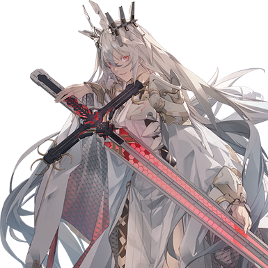
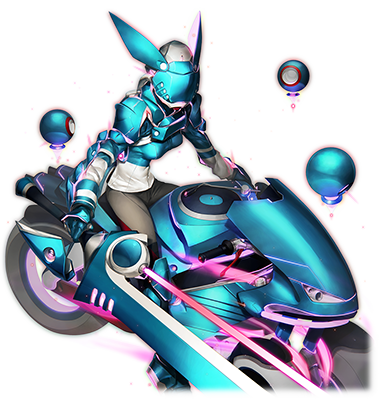

# 拔示巴/Metaverse异体

| 
角色信息 
  |          |
| ----------- | ----------- |
|名称|拔示巴·阿西德菲尔
|年龄|不明
|职业|将人类带往毫无痛苦的世界的圣女
|对应歌曲|Ultimate Force
|初出版本|Chunithm Luminous

## Episode 1 青色的系统树

>这个电子的乐园对我来说，未知的东西还是太多了。但是，现在不是思考这些东西的时候。

电子的乐园·Metaverse。

那是曾经濒临毁灭的人类建造起来的理想乡。

在这个理想乡中，无论任何人都能从中享受幸福，在这近乎永远的漫长时光中尽情地活下去。

但是，人类这一种族，就算形态发生了变化，场所发生了变化，甚至是连作为生命的形式都发生了变化，只有一件事是永远不会变的。

那就是——人终究会伤害他人。

只要略有差距，即便成为了被选择的人类的末裔所诞生的新人类——归还种，人们仍旧无法从这诅咒中逃离。

出身、环境、对比。

身为社会动物的人类，就算再怎么改变自己存在的形式，也无法从这诅咒中脱离。

那么，是否存在着从这诅咒中彻底解放的方法呢？

知道这个问题的答案的人，正前往电子的乐园，试图将自己的福音广布天下。

* * *

为了阻止拔示巴，索罗和米斯拉前往了Metaverse。

从萨马拉坎达的中继点出发，传送到Metaverse的基干系统附近的二人所见到的，是与想象中的乐园相去甚远的世界。

 

“这到底是什么啊……”

 

这里，并没有像现实世界的物体那样的“纹理”。

索罗能看到的，只有无限延伸的蓝紫色的网格线。而眼前的空间，既有起伏的山峰，也有深不见底的洞穴。

而且现在这些地形也在不停地变形，整个世界就像是活着一样。

要是掉进那无底的大洞里的话会怎样呢？只是这么想着，索罗就感觉到了一股无名的恐惧。

 

“米斯拉就是在这里长大的吗？”

“我也是第一次见到这样的地方。我所生活的‘庭园’，可是一片白色，比这里更加亮堂的。”

“那个……你说的难道是那个东西吗？”

 

索罗指向了远处正在空中漂浮着的球体。

 

“嗯！肯定是这样！”

“‘肯定’什么的，那不是你长大的地方吗？”

“嗯，没想从外面看竟然是这幅样子。还真是不可思议啊！”

 

就像是表现现在的心情一样，米斯拉奋力一跳，就跳到了比索罗的个头还高的地方。

 

“我们去那里吧！”

 

随着米斯拉着地，她便朝着球体的方向大步前进。

 

“啊，喂！真的没问题吗！？”

“没问题！”

 

米斯拉并未在意索罗，继续马不停蹄地奔跑着。

在这个把握不准距离的地方，很难判断出远处的那个构造体究竟有多大。

有可能一瞬间就过去了，也有可能穷尽一生都到不了那里。

但是不论如何，索罗他们的时间是有限的。只能且走且想了。

就在索罗准备追上米斯拉一起向着空间的尽头前进的时候，周围突然响起了什么东西摩擦着的尖细声音。

 

“米斯拉，有什么东西过来了！”

 

当索罗与回过头的米斯拉汇合之后，他绷紧了神经，巡视着周围。

声音是从多个地方传来的，虽然因为把握不了距离无法得知正确的位置和数量，但唯一可以确定的，是那些声音的来源，正朝这里冲过来。

索罗立刻就掏出了“巴拉基尔”——然而他伸出的手中却是空空如也。

 

“不好，这里是……”

 

这里并不是现实，而是电子的世界。

在米斯拉的帮助下才构筑出自己的化身的索罗，是无法再现“巴拉基尔”这样的武器的。

他慌忙望向了米斯拉，才发现她手上已经握着一把长得跟“密特隆”十分相似的弓了。在感觉到自己不争气的同时，他也暗暗下定决心，即便赤手空拳也好，至少也要保护好她的背后才行。

然后，声音渐渐地达到了极限——

 

“是上面……！！”

 

随着索罗的声音响起，那些东西从两人的死角——也就是正上方出现了。

忍受着巨大的噪声，索罗抱着米斯拉扑向了一边。

下一秒，某样东西就掉到了两人刚才所在的地方，伴随着响亮的轮胎摩擦声停了下来。

 

“嗯……还真是盛大的欢迎式呢。”

“索罗，快看！”

 

在距离两人稍微有点距离的地方，那个物体就伫立在那里。

即便在这凹凸不平的网格空间中也能自如行动的两颗巨大前轮。还有闪烁着淡淡的粉色光芒的，青色的流线型车体。

出现在索罗他们眼前的，是怎么看都是军用级别的大型三轮摩托车。

驾驶着这辆车子的，是一名穿着铠甲的女性型化身。她拿着手中的大剑指着索罗，大声问到。

 

“你们这些入侵者，竟然还活着吗！”

“入侵者？不是的！我们是——！”

“我们是来帮你们的！”

“……？无法理解。这是什么意思？”

“那个，我们是——”

“米斯拉，等等。这里就由我来说明吧。”

 

在米斯拉偶尔插两句嘴的情况下，索罗算是一五一十地把他们为啥会来Metaverse的经过说清楚了。

 

“是吗，原来你们就是为了解决这个问题而前来此地的吗。”

 

明白了原委，那名女性化身也下了车。

接着走到索罗他们面前，对自己刚才的无礼行径表示歉意。

 

“我是负责管理Metaverse的防卫机能的程序化身·钟摆队的成员。”

 

如此标准的敬礼姿势，还有自称程序的语气，眼前的女性就给人一种机械的感觉。

 

“程序化身……？也就是说类似于在Metaverse里类似于艾萨克他们那样的存在吗？你刚才说了‘钟摆队’，意思是还有其他的同伴吗？”

 

那名钟摆队的队员没有说什么，只是举起了一只手。

然后，从周围隆起的网格体的后面，走出了四个与这名女性穿着同样装备的队员。

如果说这就是防卫部队的总数的话，这也未免太少了。

 

“这……只有这么多吗？”

“其他的同伴和突然出现的白色女人交战了。结果我们损失了几乎全部的同伴。”

“你说白色的女人！？”

 

听着钟摆队的女性所描述的特征，索罗他们很快就想到了拔示巴的样貌。

 

“难道说你们认识那个女的吗？”

“是的。我们就是为了阻止那个女人——也就是拔示巴，才来到这里的！”

“是吗。那就好说了。”

 

看起来像是队长的女性，让队员们赶紧上车。

 

“我们边走边说吧。请跟我们来。”

“呐，拔示巴难道说就在那里面吗？”

 

米斯拉望向了远处的球状构造体。

队长点了点头，接着继续催促众人赶紧上车。

 

“不是吧，难道说要用这辆车前往那个漂浮在空中的东西吗？”

“那东西并不是‘浮着’的。这个世界的认知和规则，跟你们所熟知的现实世界有着根本的不同。而且，要前往那里的话，我们自然也有我们的‘门路’。”

 

话音刚落，周围的景色就随着“嗡”的一声变化了。

回过神来，眼前蓝紫色的网格空间出现了一条通往远处构造体的漫长通路。

那正是能够在Metaverse里穿梭的，宛如系统树一般的青色道路。

## Episode 2 网格空间攻防战

>索罗，这也太好玩了吧！要是能在这里继续多玩一会儿就好了！

坐在钟摆队的三轮摩托车后面，索罗和米斯拉二人跟随着她们一同向着Metaverse中心部的球体——基干系统进发。

闪烁着蓝色光芒的通路，是她们用来快速移动的高速通信网格通路，当Metaverse出现异常的时候，利用这个就可以马上到达现场。

索罗回过头去，才发现一眨眼的功夫，他们就离刚才遭遇钟摆队的地方很远了。

 

“这到底是怎么回事……？”

“好快！这样的话很快就能赶上了吧！”

“米斯拉不要闹啦！要是在这种地方掉下去的话那可不知道会变成什么样啊！？”

 

各自坐着一辆车，两人就这么在高速奔驰的道路上对话着。

本来如此高速度的移动，没有相应的装置是无法进行对话的。但是正因为这里是电子的乐园·Metaverse才能做到这点。

这些现实世界中绝无可能体验到的种种现象，令他们叹为观止。

沿着路线前进的“钟摆队”等人，以队长机为首，接着是索罗和米斯拉乘坐的两台，然后再由两机殿后保护他们。

通往基干系统的路途很顺畅。

但随着后方的钟摆队队员发现了某样东西之后，情况发生了变化。

 

“从后方发现变异体的反应！”

“来了吗！”

 

随着队员的声音回过头去，只见从网格空间的旁边冒出了一个个黑块，向着这里冲了过来。那些黑块的真身，是驾驶着青黑色的三轮摩托车，穿着装甲，拿着大剑的女性们。

看起来就像是褪了色的钟摆队一样。

 

“那些家伙不是你们的同伴吗！？”

“从他们的身上能感觉到敌性反应，毫无疑问是我们的敌人！”

 

驾驶着三轮摩托车的女性向索罗如此答到。

她们是被突然出现的拔示巴影响，变异成为攻击性的程序的同伴们。

随着她们攻击这些同伴，她们的数量就越来越多，渐渐地变成了钟摆队都无法应付的大军。

她们本来就是维持系统的治安的存在。然而正因如此，才会被吸引到这条通天的网格通路之上吧。

很快，钟摆队就被无数的敌人包围了。

 

“真的没问题吗？”

“当然，我们早已有所准备。”

 

钟摆队向后方投射了某样物体。

看似小型球体的那个东西，在掉到通路的前一秒变成了六角形的蓝色半透明板材，下一刻就以放射状的形式向着周围疯狂展开——最终变成了分型结构的障碍。

无数的变异体撞上了这些障碍物，脱离了轨道。

但是，他们并没有摆脱所有的追兵。

就在跟在后方的变异体们把同伴们当做垫脚石，准备飞越过去的时候，坐在车上的米斯拉射出了弓箭，刺穿了车子的车轮。

变异体被这突如其来的攻击震到，掉入了下方那深不见底的Metaverse的空间之中。

 

“感觉把握到诀窍了！”

 

在射击了好几次之后，米斯拉终于重新夺回了手感。虽然射出的箭不如“米特隆”那般的强力，但仍是百发百中。

 

“可恶，要是我也能做到些什么的话……”

 

看着自己只能坐在车上什么都做不了，索罗的内心充满了不甘。简直就像是自己被这个Metaverse当成了异物所刁难，拒绝一般。

“想象一下箱子中的自己”，米斯拉当时是这么对索罗说的。

为了降临于这电子的世界，索罗是利用米斯拉的力量才得以构筑自己的化身。

虽然成功维持了身体的模样，但要是不偶尔跟米斯拉牵手以进行“充能”的话，自己在这个世界的存在就会分崩离析。

就在索罗自觉羞愧的时候，位于前方的钟摆队的女性队员向大家喊到。

 

“已经能看到基干系统了！”

 

跟着女性队员的声音，索罗和米斯拉向前望去。

 

“——哈？那是什么啊……”

 

出现在索罗面前的，是一整个“宇宙”。

眼前是无数的“卫星”，就像是星系一般围着中心部的“恒星”公转着。而这些东西就像是先前钟摆队放出的障碍物一样，呈现出分型的形状。

索罗明白，自己正踏入超越人知的领域。

这就是他面对眼前的景象所能发出的感想。

 

“好漂亮——”

 

米斯拉也不禁露出了惊叹声。突然，“咣”的一声响起，像是什么东西被撼动了一样。

往发出声音的方向望去，原来他们所行驶的通路，被开了一个大洞。幸运的是，钟摆队在千钧一发之际闪开了这次攻击。

然而后方的两辆车还是未能幸免，掉了下去。

这难道是新的攻击手段吗？还是说——

 

“这反应，是探查程序吗！”

“还有别的敌人吗！？” 

“对。它们本来是用于调查Metaverse的混沌领域的程序——“

“喂！又有敌人来了！”

 

说时迟那时快，那些变异体就从星空之中现形，向着他们所在的通路发起了攻击。

这些被称作探索程序的变异体，都是长着机械翅膀的程序化身。她们似乎认为与其对高速前进的钟摆队发动攻击，直接对他们所前进的道路攻击会更有效的样子。

挥动着灵活的翅膀，她们用身体直接冲破道路，然后像是流星一般急转弯回来再度发动攻击。

面对这些从四面八方发动攻击的变异体，仅靠障碍物和米斯拉的弓箭还是力不从心。

下一刻，眼前的道路就开始慢慢碎裂，崩坏。

就在这时，先头的队长举起了右手。

接着车体向着前方大大倾斜。

索罗和米斯拉所乘坐的车子也开始向前倾斜——

 

“抓好了！”

“唔——哇啊啊啊啊啊啊啊啊啊！！”

 

钟摆队沿着垂直于道路的角度，向着无垠的黑暗虚空之中冲了进去。

## Episode 3 无名的战士们

>等到这个世界再次恢复和平，我会和米斯拉再找机会去见你们的。

索罗他们正在下坠，而闪烁着朦胧光芒的基干系统就在他们的上空。

本来再怎么下坠也应该会碰到这网格空间的底部吧，然而无论下坠了多久，都看不到那些整齐划一的青紫色网格线。

在这下坠的途中，就连风阻和重力的感觉都无比模糊。

就像是在永无止境地滑翔着一般。

说不定很快就要被黑暗所吞噬了。就在索罗如此想着的时候，车子降落在了突然出现的网格道路上。

 

“啊哈哈！这也太好玩了吧，索罗！”

“我这边可是要吓到魂飞魄散了——唔哦！？”

 

索罗还没说完，车子就开始加速了。

 

“抓紧了。”

“要是他们继续追上来，又会跟先前一样了吧。有没有能够打败他们的方法？”

“没有。”

“喂！”

“就算是我们，面对这些异常者也是有极限的。”

“就算这么说，也总得想出个办法吧！”

 

女队员冷静地回答着索罗的提问，“所以。”，女队员这么说着，慢慢地将车子停在了分叉路的面前。

然后，钟摆队的其中一名成员从车上下来，示意米斯拉跟自己交换。

 

“难道说你们……”

“这辆车就交给你们了。在我们作为诱饵吸引敌人的期间，你们就坐着这辆车前往基干系统吧。如果从这里出发的话，应该能够在他们察觉之前进入系统。”

 

这就是最佳的选择。那名女队长这么说到。

既然都这么说了，那就没有别的余地了。现在这副样子，也只能选择最有希望的方法了。

米斯拉兴高采烈地坐上了索罗乘坐着的三轮摩托车。

 

“驾驶就交给我吧！”

“你明明就没驾驶过吧！真是的……那个，谢谢你们帮我们到这里。各位钟摆队的成员们……那个，你们有名字吗？”

“我们没有个体的名字。只有用于识别个体的序号。”

“那么，就让我给你们起名字吧！”

 

这么说着，米斯拉以这三名队员的识别序号为引子，给她们各自取了小名。虽然最初她们还感到困惑，但是在米斯拉的强烈意志下，还是欣然接受了。

然后，她们三人向着索罗和米斯拉敬了一礼之后，便驾驶着车子，向着另一条分岐路扬长而去。

 

“我们也出发吧！”

“啊啊。”

 

索罗坐在车上，抓着三轮摩托车的边缘等待着车子启动。然而无论等待多久，车子都没有发动。就在索罗想要抱怨的时候，米斯拉的手从前方伸了过来，抓住了索罗的手腕，就这样让他的左右两手围着自己的腹部环抱了起来。

结果就是索罗就这么直接贴在了米斯拉的背上——

 

“喂，喂！快停下来……！”

“可

是如果不抓紧的话，会掉下去的哦？”

“不，可是那个……”

 

索罗本想继续用微弱的声音抗议的，但他的视线却在四处游离。

虽然很清楚这里并不是现实世界，但是，人就是会将自己见到的东西当做真实，并且深信不疑的生物。

“怎么可能抱着”什么的，索罗根本说不出口。

 

两人坐着三轮摩托车，沿着通道向着基干系统进发。米斯拉似乎凭直觉就掌握了操作方法，没过多久，她就能把车子开的宛如自己的手脚般灵活了。

现在似乎还没什么问题。

钟摆队她们的诱敌作战似乎很顺利的样子，这一路上，索罗他们都没有遇到任何变异体。

距离基干系统只有少许距离了。

即便是如此漫长的通路，在车子的帮助下也不成问题。

终于能稍许放松的索罗，开始眺望起基干系统周围的星辰一般的物体。

那些闪烁的星星就像是在互相通信一般，以不同的间隔闪烁着。

也许在那些星辰之上，也住着其他的人呢。索罗这么想到。

就在这时，索罗想到了一件事。

 

“米斯拉。”

“嗯——？怎么了吗？”

“我们，好像正飞在天上啊。”

“啊——对啊！”

 

听着米斯拉开朗的声音，索罗也露出了微笑。

* * *

两人终于到达了基干系统的构造体门前。

这个超构造体明明释放出了宛如太阳一般耀眼的光芒，但却并不让人觉得眩目。

随着他们前进，光芒也渐渐地微弱下来，内部的构造也出现在他们面前。

当他们来到开阔的地方后，索罗被眼前的光景所惊讶。

“
 

“难道说这里还住着巨人什么的吗？”

 

出现在眼前的是一眼望不到头的巨大光柱。

就像是围着这条光柱一般，一条足足有数十人宽度的螺旋楼梯，正沿着光柱蜿蜒上升。

 

“你对这边有印象吗？”

 

米斯拉思考片刻之后，摇了摇头。

 

“养育我们的‘庭园’，是个像城池一样的地方。”

“也就是说，和萨马拉坎达那样吗？”

“嗯——！应该是这样！”

“真的吗？”

 

之后，他们沿着漫无止境的楼梯驱车而上，就在途中，他们似乎看到了什么东西正倒在地上。

 

“米斯拉，稍微停一下车。”

 

索罗从车上下来，向那个物体跑了过去。原来，那是个穿着一身以白色为主色调的衣服的人。

虽然呼喊了很多次，还是没有任何反应。

于是索罗把那人扶起来，试图确认他的意识。

倒在地上的，是个看起来比米斯拉要年轻个五岁左右的少女。

她的脸上挂着痛苦的表情，就这么僵在那里。

从方向来判断，她应该是从上面逃出来的吧。

 

“这孩子……难道也是归还种吗？”

“……嗯。”

 

两人往上望去，发现了更多和少女一样倒在地上的人。

会做出这种事的，除了拔示巴外别无他人。

 

“米斯拉，我们走。”

 

随着他们慢慢登上楼梯，就能看到越来越多倒在地上无法动弹的孩子们。

然后，他们终于来到了目的地。

两人来到了基干系统的中心部——一座庄严的白色神殿。

神殿的结构十分精巧，甚至连细节都是左右对称的。建筑物与通往神殿入口的楼梯一样，都是“8”字的形状。

 

“我回来了！索罗，这里就是‘庭园’哦。”

 

望着神殿，米斯拉的眼中露出了怀念的表情。

然而，现在并没有时间让他们故地重游。

将那些倒在楼梯上的归还种们抛在脑后，他们继续驾驶着车子向上进发——最终，他们来到了神殿的门前。

门是半开着的。虽然听不见什么声音，但里面的情况绝对不乐观。

在焦躁与紧张之中，两人走入了神殿。

## Episode 4 母与子

>对这个世界仍有未竟的念头的人们，阻止了我的未来。所以，就由我来引导迷途的众人吧。

“尼亚！”

 

刚进入神殿内部不久，他们就追上了尼亚·拔示巴。

 

“呵呵，又用了那个名字称呼我吗，米斯拉……”

 

注意到米斯拉的声音，拔示巴停下了脚步，缓缓地回过头来。

在她的手中握着一把长剑。

 

“——啊呀。”

 

忽然，拔示巴的视线从米斯拉转向了索罗。

她就像是在打量着索罗一样，感觉到这股视线的索罗，也以混杂着不安与敌意的眼神回应着她。

注意到对方也回瞪着她，拔示巴的眼瞳稍微动摇了一下，但很快，她就闭上了眼睛，再也无法确认她的神态。

然后，拔示巴就像是歌唱着一般，复诵着少年的名字。

 

“索罗……索罗，索罗……是吗……你就是，索罗·莫尼亚对吧？”

“初次见面……这么说就可以了吧，拔示巴……不对，母亲。没想到……竟然真的能够像这样说上话啊。”

 

从索罗的喉咙中挤出来的声音，却没有一丝羁绊或者亲情之类的东西。

 

“呵呵……”

 

对于拔示巴来说也是一样的。

如果没有尼亚的脑海中关于索罗的记忆的话，她甚至都认不出索罗的模样。

不管怎么说，身为亲生儿子的索罗出现在她的面前，确实在她的意料之外。

虽然她的脸上仍旧挂着沉稳的笑容，但还是能感觉得到她正在观察着这边的行动。

 

“看来……赛罗还是失策了呢。”

 

无意间，那锐利的眼神投向了索罗。

在那眼神之中充满了污蔑、失望、嘲笑。不管哪种，都不是应该对亲生儿子应有的感情。

 

“那么，你准备和米斯拉一起阻止我的计划，对吧？”

 

仅仅几句话，拔示巴就对索罗失去了兴趣。

索罗一边回应着拔示巴，一边在心中暗想着。

就算是有血缘关系的人，但是既然从一开始都不抱期待的话，那被怎么说都无所谓。

索罗，从一开始就明白这点。

 

“啊啊。我们绝对不会让‘你’的未来成真的。”

“呵呵……是吗。不过，就算我的未来未能实现，剩余存活于世间的人们，真的能获得属于他们的幸福吗？”

“决定幸福与否的，是人自己。绝对不是你。”

“只凭自己的心，就能够让痛苦的未来发生改变？那那些只有反抗的意志却没有力量的人们，你能拯救他们吗？”

 

“明明你也是跟我一样的处境才对。”，拔示巴向着索罗问到。

 

“……这倒也是。就算是我，也不认为我能够拯救全部的人。至少比现在就想要‘拯救’全部的人类的，脑子里尽是痴心妄想的救世主强得多了啊！”

 

索罗的脑中回想起了童年时期的回忆。

想起了那些以真人的繁荣为名目，被研究者们肆意处置的日子。随着索罗经历各种各样残酷的实验，他就对这个不公平的世界愈发愤慨，痛恨着自己的命运。

如果母亲也经历了这样残酷的事情的话，确实值得同情，也值得理解。

但即便如此。

索罗仍旧无法支持母亲的选择。

 

“你所做的事情，没有一丝正确可言。如果连你都变成了那些令人憎恨的存在的话，不就跟他们做的一模一样了吗？没有痛苦的世界？这种东西，只要我们还活着，就绝对不可能存在！”

“存在的。这样的世界是存在的。”

 

拔示巴露出了微笑。

 

“为了达到这点，就必须让大家都变成‘一样’的东西。例如……跟那边的米斯拉那样。”

“我？”

“‘一样’什么的，到底是什么意思？”

 

没有回答索罗的问题，拔示巴只是指向了倒在自己脚下无法动弹的归还种。

 

“就让我告诉你们，归还种的真相吧。”

 

拔示巴开始娓娓道来。

讲述大地的继承者——也就是归还种的真相。

## Episode 5 名为“生”的诅咒

>既然疼痛是无法避免的，那么只要将“接受”疼痛的容器消去就行。很简单，对吧？

“你们知道归还种是怎样的存在吗？”

 

被拔示巴这么问着，索罗跟随着拔示巴的视线望向了站在身旁的米斯拉。拔示巴的眼神仿佛就在说着“这点东西，至少还是知道的吧”一样。

然而米斯拉只是歪了歪头，并未回答。

 

“……嗯？”

“归还种什么的，到底是什么东西啊？”

“我，就是我自己啊？”

 

米斯拉只是纯真地笑着。

对于她来说，这就是她的答案吧。

 

“确实，米斯拉就是米斯拉……但不是这个意思。”

“呵呵，还真是般配的一对啊。”

“哈？”

 

听到这唐突的发言，索罗吓了一跳。然后赶忙站直了身子回到。

 

“归还种不就是在Metaverse中养育出来的人类吗？”

“确实是这样。但，也不止是这样。”

 

拔示巴只是说着模棱两可的话语。

面对这副只有自己知道真相的样子的拔示巴，坐不住的索罗只得催促她说下去。

 

“那到底是怎么回事？”

“归还种，是由管理Metaverse的一切的基干系统所制造出来的全新的人类。但是，这也不过是系统为了管理地上而专门设计出来的产物而已。”

 

拔示巴这么说着。

归还种也不过是和被“系统”制造出来的真人一样的，调整了思考的存在，对她来说，不管哪边，在本质上都没有区别。

 

“我从亚哈他们遗留的数据中，学到了各种各样的事情。真人与机械种，旧人类与归还种，最后来到了Metaverse。在我见到归还种的时候，我就在想，啊啊，这些孩子们都已经扭曲了啊。”

 

拔示巴望着米斯拉，但却像是望着并非她的什么人，滔滔不绝地说着。

 

“这里的这些孩子们也是一样的。身为人的负面情绪被抑制，只有正面的部分被彰显……这些从出生以来就被决定了方向的孩子们，难道算不上是‘扭曲’吗？所以，我才决定要做出改变。”

“改变？”

“就像曾经的真人被抑制了感情一般。我要把归还种的‘心’和‘感情’，统统剔除。”

 

双指合十于胸前，少女用着天真无邪的表情说着残酷的话语。

“活着”这一选择，总是伴随着无尽的痛苦。

而这些痛苦就会以各种各样的“诅咒”为形式，出现在人们面前。

出身，环境，对比。

人总是被这些东西所束缚，最终支撑不住而崩溃。既然这样的话，要么就把“个体”抹杀掉，要么，一开始就不要拥有“心”就好了。

只要这样的话，人类就再也不会有任何痛苦，不管是谁都能够平等地，幸福地活下去。而这，才是人类应有的崭新模样。

 

“什么都感觉不到。什么都无法思想。人只要满足生物本身的机能就足够了。你难道不觉得这很棒吗？”

“你要把我们变成动物……不，难道说是‘人偶’吗！？”

“怎么称呼因人而异。”

“这种事情，怎么可能让你做到啊！将心灵与感情全部剔除什么的，就算是神也——”

 

突然，索罗绷住了脸，没有继续说下去。

因为他察觉到眼前正天真无邪地笑着的女人，正准备做什么。

 

“不错，如果是神的话，就做得到。只要有统治着这个世界的机械装置的神明——基干系统的话。”

 

就在这时，拔示巴就像是指挥者什么东西一样，把手举向了空中。下一刻，刚才还倒在地上的归还种的孩子们纷纷站了起来。

 

“难道他们还活着……不对，这是被操纵了吗？”

“我差不多也该走了。要是舞会缺少了主办者的话，那不是很奇怪吗？索罗，米斯拉，等到这个世界改写完毕之后，会好好陪你们玩的。”

 

拔示巴穿过那些被操纵着的归还种们，扬长而去。

索罗和米斯拉本想继续追上去，然而那些归还种们却挡住了他们的去路。

那些孩子们目光空虚，怎么看都不是正常的模样。

他们一个又一个向着索罗他们缓缓走去。

甚至从背后也围了上来。

 

“怎么能让你得逞啊！”

 

索罗身子一转，绕过了那些归还种们。

跳过那些重心较低的人，再闪开那些正往这里撞过来的孩子们，向着神殿深处进发。

就在索罗闪过最后一个归还种的时候，突然他听到了呼唤着自己的米斯拉的声音。

 

“索罗！”

 

回头望去，那把很像米斯拉爱用的“密特隆”的弓正向自己径直飞来。

索罗伸出身子，抓住了正以抛物线轨迹扔来的弓。

 

“太、太危险了吧！为什么要把这个交给我——”

 

就在索罗略有不满打算回头向米斯拉抱怨的时候，才发现当事人正离自己越来越远。

原来在她身后，那些被操纵着的归还种们正追着她。

就算是被拔示巴操纵着，也不愿意向同为归还种的同胞们出手。正因如此，米斯拉才决定将自己的武器交给索罗。

 

“你就带着这个先走一步吧！”

 

没有多说什么，米斯拉就这样消失在了神殿内部的柱子深处。

 

“……真是的。”

 

虽然没有说什么，但米斯拉想要传达的意思，索罗已经完全理解了。

他攥着米斯拉托付给他的弓，向着神殿深处前进。

必须赶在母亲将她的福音广布天下之前，阻止她才行。

## Episode 6 那只手抓住的是

>这个大家都能够以自己的意志露出笑容，以自己的意志活下去的世界，绝对不会让你夺走的！

索罗终于来到了这电子世界的核心，管理着一切的基干系统的中枢区。

这个圆形的房间是神殿的内部空间，然而明明这里是室内，但房间的外墙体上却到处都是点点星辰，就像置身于宇宙空间中一般。

那究竟是与米斯拉一同见到的空间呢，还是完全不同的地方呢。索罗不得而知。

 

“那么，你一个人觉得能够阻止我吗？”

 

这么说着，拔示巴再次伸手举向了空中。

接着，在她的周围出现了各种大大小小的幻影。

 

“！？”

 

索罗还以为拔示巴又要召来归还种，然而出现在他面前的，却是一群似是人类，但又并非人类的存在。

 

“这基干系统，同时也是一个极其庞大的保存着无数生命资料的数据库。我从里面挑出了与你十分相称的对手——**去吧**。”

“咕……！？”

 

幻影们听从着命令，向索罗发动了攻击。

索罗虽然架起了弓箭迎敌，但是对于几乎没有用弓经验的索罗来说，面对这些幻影实在是太吃力了。

更不用说现在仍旧以地上的感觉进行战斗的索罗，实在是招架不住这些无视着物理法则运动的幻影们的攻击，很快就败下阵来。

 

“呵呵，真是不堪一击。”

“可恶……难道只有我一个人的话，就什么也做不到吗……”

 

索罗被长着数条手臂的幻影按在地上，眼前站着的是手持着巨大镰刀的另一个幻影。

不知道是不是已经距离米斯拉太远了呢，他的身体已经开始渐渐地发虚了。这正是自己在电子的世界中对自己的认知力开始下降的征兆。

 

“你只要在这里死去的话，就能够比谁都更快地前往我所期望的世界了呢。恭喜你，索罗。”

“哈，这种世界……还是算了吧！”

“是吗。”

 

拔示巴举起了食指，就像是指挥棒一样，挥了下去。

与此同时，已经举起了镰刀的幻影，直接沿着索罗的左肩和右腹部挥了下去——索罗就这样消失了。

唯一剩下的，只有维持着人的形态的，发光的残影。残影就像是线路迸开的电火花一样，噗呲噗呲地闪烁着。

片刻，米斯拉交给他的弓箭也掉在了地上。

 

“永别了。”

 

即便亲生儿子就这么消失在自己面前，拔示巴仍旧挂着那安稳的笑容。

接着，她回过头，踏着优雅的步伐向着基干系统的方向走去。

* * *

在一个昏暗且看不到边界的空间中，我醒来了。

 

“——我到底……是怎么了……”

 

环视周围，我能看到的，只有延伸到地平线尽头的红色和蓝色的线，只有一成不变的景色。

不但如此，我甚至连疼痛或者重力都感觉不到。

 

“啊啊，是吗。这里就是……”

 

这里就是母亲所期望的世界吧。

不知为何，我就是这么想的。

 

“真是安静，根本想象不出刚才才和母亲打的热火朝天啊……”

 

风平浪静，波澜不惊的世界。

这还是我第一次感觉这么的平静。

没有痛苦。

也不需要担心会伤害任何人。

这里的一切都是波澜不惊的。

这里给人的感觉确实舒服。

如果变成了“人偶”的话，那么肯定就不用再担心自己的处境，大家就都是平等的吧。

 

“……”

 

然而，就在这时。

如果是那家伙的话，又会怎么想呢？

面对这样风平浪静的世界——她也会笑出来吗？

 

“……”

 

我在脑海中想象着那家伙再也笑不出来的世界。

但是，不论我怎么想象，下一秒我的脑中浮现的，却总是她的笑容。

她的脸上总是挂着笑容，自从那一天见面开始，不论何时，不论何地，那副笑容也从未消退过。

如果母亲的愿望实现了的话，那么她的笑容应该就会不复存在了吧。一想到这点，我的心就感觉到无比的痛苦。

 

“……！”

 

啊，原来是这样啊。

这一切不应该是这样的。

因为，在这样的世界上，是如此无可救药地“寂寞”啊。

对我来说，实在无法忍受。

我向右手使了点劲。然后，我注意到我的手中出现了什么东西。

 

“这是什么……？”

 

出现在我面前的，是一个小小的，散发着蓝色光芒的箱子。

当我把这个东西放到胸前，那个东西缓缓地飘了起来——

 

“你不是一个人”

 

箱子仿佛这么说着。

我把手伸向了略有温暖的箱子——在碰到的瞬间，箱子变成了小小的米斯拉。

 

“咦？”

 

大概只有手掌大小的米斯拉，用自己的手触碰着我的指尖。她抓着我的手指头，露出笑容说到。

 

“就让我带你一起前往吧。”

啊啊，原来是这样。

这里是Metaverse，是电子的乐园。

只要自己有相应的意识，就能够改变自己，甚至改变整个世界。

 

“那么，只要我不放弃我所坚持的东西，我就……不会这样死去！”

 

呼应着我的意志，一个又一个的蓝色箱子浮现在我的面前。那些东西越来越多——渐渐地将灰飞烟灭的我慢慢重组起来。

米斯拉再次变成了箱子的模样，与我的右手合为一体。

 

“这就是，我的力量吗……？”

“走吧，索罗。去阻止你的母亲。”

 

我用力点了点头。

* * *

“嗯……刚才的光，究竟是怎么回事？”

 

那只不过是索罗被消灭之后，短短的一瞬间发生的事情而已。

正准备走向基干系统的拔示巴，面对这突然发生的奇异现象感到不解，只是杵在那里一动不动。

本以为光芒只会缓缓消散，但事实却恰恰相反，光芒变得越来越耀眼。

即便拔示巴正仔细地端详着这道光芒，这道光芒也未曾停歇，只是闪烁的愈发频繁，简直就像是对母亲进行恶作剧的小孩般，疯狂地闪烁着。

然后，从闪光之中，出现了无数的蓝色箱子。然后这些箱子渐渐地组成了那个拔示巴非常熟悉的人。

 

“难道是……索罗……”

“————啊啊。我回来了，母亲。”

 

右手佩戴着闪着蓝光的护腕，索罗·莫尼亚再度降临于这电子的乐园之中。

## Episode 7 并不是一个人

>索罗，要是我去了很远的地方，那你一定要找到我哦。

见到刚才才灰飞烟灭的索罗竟然就这么出现在自己面前，拔示巴第一次出现了动摇的神色。

 

“你应该已经彻底消失了啊。怎么可能……”

“因为米斯拉对我露出了笑容啊。”

“无法，理解……”

“你应该是跟我这么说的吧。在电子的世界中的死亡，就是精神的死亡。正是多亏了这点，我才得救的。所以——”

 

多谢你了。说完，索罗本想模仿米斯拉那样露出个笑容的，但是由于五官僵硬，实在是做不出那样的表情。

 

“……看来还是失败了啊。”

“呵，呵呵……既然这样的话，那就一直打到你再也不会复活为止。**去吧**！！”

 

拔示巴再次命令那些幻影发动攻击。

那些幻影向着索罗袭来。但是，现在的索罗拥有与之对抗的能力。

模仿着拔示巴的动作，索罗也将右手举起来，像是斩断空间一般，把手臂挥了下去。

在那瞬间，在索罗的周围出现了数个箱子——接着渐渐变成了人的形状。

长着翅膀的人们，手握**苍剑**的人们……他们都是被记录在这电子的乐园之中的人们的数据。

不但如此，还有一个人，正站在这露出自信笑容的少年身旁。

“咦……索罗？我为什么会在这里？我记得直到刚才我还在跟他们玩捉迷藏的样子……”

 

仍未明白目前情况的少女——米斯拉·特尔塞拉歪了歪头。

 

“老实说，我也不太清楚。不过我也只是希望跟米斯拉在一起，仅此而已。这个世界，是能够把认知和想象变为现实的地方对吧？”

“……虽然不太清楚发生了什么，不过我明白了！”

 

索罗对米斯拉的心意，在无意识间引来了能够对抗的力量。

握在手中的蓝色箱子——那正是被称作“VOX”的管理机能终端，正是能够创造Metaverse的力量。

 

“竟然……模仿我的样子，真是个坏孩子啊……”

“母亲。”

 

站在两方对峙的基干系统中枢面前，索罗呐喊着。

 

“虽然我能够稍微理解母亲的理想中的世界究竟是什么模样，但是，我还是无法赞同。所以——”

 

索罗的右手与米斯拉的左手重合。

就算一个人在这个世界上会感到痛苦，但如果是两个人的话。

不论到了什么世界，想必也能够度过难关的吧。

 

拔示巴举起了剑，向着索罗的咽喉冲去。与之相对的，索罗和米斯拉举起了手，与拔示巴正面对抗。

在这力量的交锋之中，拔示巴向索罗问到。

 

“难道说，你想要杀了我吗？”

 

努力维持着力量，索罗将自己所想的一切注入自己苍蓝色的拳头之中。

 

“不。我要杀死的——只有你的愿望！”

 

瞬间，拔示巴的光芒开始弱了下去，拔示巴所构成的世界开始出现裂痕。

然后，索罗向着被压制下去的拔示巴冲了过去，用手碰到了她的肩膀，然后一口气注入了力量。

 

“——！”

 

强烈的闪光在三人的面前炸开。

随着闪光消失之后，留在那里的，正是尼亚·尤蒂特，还有从她的身上分离出来的少女——拔示巴。

与此同时，拔示巴所召唤出来的幻影也开始消散，回到了基干系统之中。

 

“尼亚！”

 

米斯拉扶着缓缓倒下去的尼亚，无数次地呼唤着朋友的名字。但是尼亚似乎已经失去了意识，没有回应。不过从身体没有消失来看，尼亚的精神应该还没迎来死亡。

将露出安稳表情的米斯拉放在一边，索罗向着正蜷缩在地上一动不动的母亲走了过去。

 

“已经结束了。”

“……呵，还没，还没结束。怎么可能结束呢……”

“还在想着这种事情——”

“不。因为我只剩这点东西了。我唯一能做的，就只有把大家带往没有痛苦的世界而已了……”

 

拔示巴的声音在颤抖着，无法听清楚。

不但如此，似乎因为与尼亚断绝了联系的缘故，身体已经开始渐渐无法保持形体了。

即便已经如此虚弱，拔示巴仍然能够存在于此的原因，估计就是那牺牲了一切所锻炼出来的强韧意志吧。

索罗默默地把自己的手跟母亲的手重合。

 

“我既不像母亲那样直面了这个世界那么久，也不认为会有人能够完全理解母亲的想法。”

“……是啊。这个愿望是属于我自己的东西。是一直憎恨着这个残酷的世界的，我的——”

 

拔示巴握紧了索罗的手，就像是仍未放弃对这个世界的憎恨一样。

 

“呐，既然如此的话，至少悲伤哭泣一会儿不也好吗？”

“悲伤？”

“只要有能够一同分享悲伤的人，一同分享这份痛苦就好了。”

“……我一直以来都是孤独一人。不论是曾经也好，还是现在，抑或是未来也罢。”

“怎么会……不是还有我吗？”

“……咦？”

“除了我，还有米斯拉，以及泽法。那可是将我从把整个世界都当作敌人的阴影中救出来的泽法啊，母亲你只要愿意敞开心扉的话，大家肯定会愿意听取你的话的。这样的话，终有一天——”

“……为什么要做到这个地步？”

“因为，你是我的母亲啊。”

“……是吗。”

 

这缓缓道来的语气却带着一股寒意。

每当索罗呼吸一次，就愈发从拔示巴的话语中感觉到这一点。

 

“我可不记得我成为了你的母亲。”

 

啊啊，正是这样。——拔示巴露出了一个混杂着疯狂地笑容，死死地盯着索罗。

 

“然后你们就会这么说着，从我的身上，夺走我的一切对吧？否定了我的憎恨，否定了支撑着我活下去的东西的话，我就会一无所有地死去对吧？这种事情……对你们来说，应该是非常，非常爽快的事情吧？”

“不是！我只是！”

 

即便用最诚心的话语传达出去，面对心门紧闭的她来说，这也不过是缘木求鱼吧。

 

“呵呵，这一切……都是没用的……”

 

下一刻，拔示巴甩开了索罗的手。

就像是在暗示着“你是做不到的”一样，拔示巴拒绝了索罗的提议。

 

“等等我！母亲——”

 

伸出去的手，只是穿透了拔示巴的身体。

从尼亚的身体里分离出来的她，已经没有可以回归的容器了。迎接她的，只有在这里消失，抑或是被基干系统当作敌人，被系统消灭的结局而已。

背对着索罗，拔示巴说到。

 

“——不过，还是谢谢了。”

“咦？”

 

这到底是对什么说的呢？

估计除了她自己以外，没有人知道。

留下这句话之后，拔示巴就从乐园之中消失了。

望着曾经还是母亲的光之粒子在空间中缓缓消散，索罗跪倒在了地上。

 