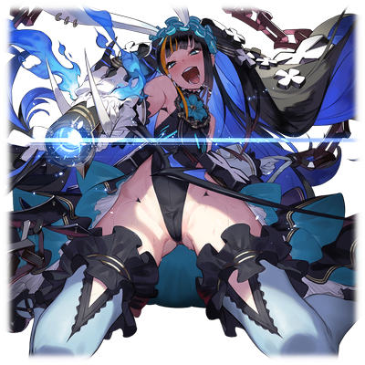
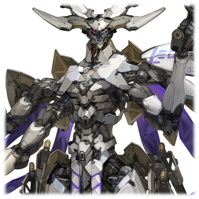

# 丹迪

|
角色信息 
  | 
     
     |
| ----------- | ----------- |
|  名称 |丹·多米南斯 V
|年龄 |制造后200年以上
|职业|新涅墨亚殖民地的支配者
|对应乐曲|#SUPE3RORBITAL
|初出|Chunithm NEWPLUS

## Episode 1 并非痴人说梦

>我知道自己的判断和世间的常理无法相容。但是，就算这样，我也要直面面对才行！

丹·多米南斯V，是为了管理一座位于污染严重的欧亚大陆的都市，而被制造出来作为监察官使用的机械种。

监督官作为他们所属的<ruby>都市<rp>（</rp><rt>殖民地</rt><rp>）</rp></ruby>里拥有各种权限的机体，是能够自行思考，独自作出判断的最上位个体。

他的主要任务，就是管理那些负责环境净化工作的真人们，还有为迎接重获新生的新人类所需的准备工作。

丹被派往的，是一座位于欧亚大陆的中心的沙漠都市，巴乌殖民地。

那里的污染极其严重，与卡斯比大裂谷地带不相上下。由于污染过重，就连机械种也难以预测这片地区还能不能恢复已有的模样。

丹虽然在那里持续进行着净化工作，但在预定的期间内再怎么努力也没有成果，只是白白的浪费掉资源罢了。

如果仍是这样一事无成的话，那么系统肯定会把丹和整座殖民地的真人们直接从系统的联系中断开。

而在这个时代，与“系统”断开连接也就意味着死亡。

若真是这样，殖民地必将会衰亡，真人们也难逃一死。

 

“我……要为了那些为了殖民地的生存发展献出生命的人们而努力。”

 

于是，丹开始了他的抵抗。

以调和作为其基本理念制造出来的他，为了保护那些仰赖自己的真人们，向系统发出了反抗。

他下定决心，一定要让这个巴乌殖民地发展到跟黄金时代的城市一样繁荣的模样。

但是，不论他怎么向系统争取，没有成果的监察官就没有任何价值。诉求不被接纳，反而被当成异见分子的丹被打上了叛乱者的标签，整个殖民地被系统断绝了供给。

都市的动力源和人口子宫被迫关闭，殖民地陷入了机能不全的困境之中。

又过了不久，巴乌殖民地也被从系统中除名了。

那些现存的真人们，既有只能默默等待着自己死亡的人，也有彻底接受了系统的判决，自绝性命的人。

但是……即便是这样。

丹也没有放弃。

 

“怎么能在这里就放弃了呢……！”

 

丹为了让殖民地能够独自再生，想出了一个办法。

那就是去卡斯比大裂谷的深处，寻找埋藏于此的资源。

## Episode 2 孤独一人的世界

>这个铁制的身体，真是不方便啊。

为了让被系统舍弃的巴乌殖民地重获新生，丹前往了卡斯比大裂谷地带。

虽然系统给他下达了前去其他殖民地进行管理的命令，但一心复苏巴乌殖民地的他果断拒绝了这件事。

然后，在自己被系统处分之前，他自行切断了自己跟系统的联系，带着那些仰慕自己的真人和机械兵们，踏上了旅途。

不顾危险，也不去管那里是否有或者无，偏偏就是要前往那里的，作为机械种绝无可能的行动。

但是，丹就是如此坚信着自己的想法。

 

他的判断，从结果上看是正确的。

在大裂谷的缓坡处安营扎寨的丹，开始了对曾经建设过的地下都市，以及对地底资源的探索。

虽然在这片毫无记录和数据的大裂谷之中从零开始勘探简直就是天方夜谭，但随着众人的努力，情况也开始稍微好转。

 

然而，这里终究还是重度的污染地区，参加开采作业的真人们不敌环境的毒害，一个又一个倒下了。但，正因如此，丹才更有必要继续坚持这个任务。

数个月后，丹终于收集到了足以让殖民地再次启动的资源。

 

“各位，辛苦你们了——”

 

直到这时候，他才注意到一件事。

已经没有一个真人站在他身旁了。

 

“大家，对不起……”

 

当然，这种结果他最初就已经料到了。

但是，即便如此他也愿意把一切赌在那些微的希望上。

而最后，也只剩下丹一个人活着。

就在丹垂头丧气地打算回到巴乌殖民地的时候，突然，一阵爆炸声响了起来。

 

“那个地方……难道是！？”

 

从大裂谷中冲出来，丹看到了一缕黑烟正从巴乌殖民地的方向升起。

 

“为了……不让我再启动整个都市，就把它自爆了吗……”

 

就像是要给丹一个警告一般，系统执行了废弃整个都市的指令。

 

栖身之所，该保护的人，一切的一切都已经消失。丹，已经一无所有。

丹回过头去，就像是要逃避这残酷的现实一般，回到了大裂谷之中。

 

丹孤身一人在大裂谷的谷底中徘徊。

漫无目的，只是等待着自己死期的来临。

但是，希望仍未断绝。

 

“咦？为什么……在这种地方会有殖民地？”

 

出现在丹面前的，是由小规模的构造体群所构成的小型都市。

与其说是都市，不如说更像是研究某样东西的研究设施。

 

“竟然不在我的数据库里……这到底是什么时代建成的——”

 

脚自然而然地动了起来。

就像是被什么呼唤着一样。

就像是被什么催促着一样。

 

“虽然基本构造和巴乌殖民地很像，但没想到这么老旧……”

 

丹试着将收集来的资源用来恢复这里的系统。

幸运的是，这些资源在这个地方也派的上用场。于是，虽然仍有些许限制，但系统还是成功启动了。

一片黑暗的通道变得灯火通明，仿佛就像在迎接新的主人一般。

丹走入构造体之中调查一番后才发现，这座都市，似乎是很久以前的时候就完全停止了机能。

说不定和巴乌殖民地一样，都是被遗弃的殖民地呢。

有些蹊跷的，是那些倒在附近的真人尸体。那些被蜡化的尸体，不知为何他们的脸上都挂着一成不变的笑容。

就像是时间被定格了一般。

 

随着他渐渐地向深处进发，丹发现真人的尸体越来越多。

而其中的几具尸体，他们的手都指向了某个地方。

那个地方——正是通向更深处的楼梯。

 

“这里……难道藏着什么东西吗？”

 

丹就像是鬼神使差般，走向了更深的地下。

随着楼梯渐渐往下延伸，倒在地上的真人的尸体也越来越多。

小心地绕过成堆的尸体，丹来到了一片开阔的地方。

然后，他看向了房间中央的高台处。

 

“那个是……”

 

位于这个房间中央的，豪奢华丽的宝座。

在那宝座之上，正抱膝坐着一位停止了机能的机械种。

 

“……少女形态的……机械种？”

 

穿着黑色礼服沉睡着的她，就带着一丝神秘的气息。

就在这时，丹注意到了些不寻常的事情。

那是机械的身体绝不可能出现的，某些细小的异常。

然而怎么做都无法确认其真面目，丹于是只能走到宝座面前，帮少女扫净了灰尘，然后说着“抱歉”，将少女放到了平底上。

少女那精巧的五官映入他的眼帘。

 

“真是漂亮。简直就像是黄金时代的艺术品一样，有着灵魂……”

 

少女的样子让丹越看越入迷，甚至忘记了时间的存在。

 

“哈啊——！现在可不是欣赏的时候啊！利用现有的资源，说不定就能让她重启了吧！”

 

丹急忙用线缆接入了自己后颈部的接口，然后抱起了少女。接着，把长长的头发分开，丹将线缆插入了少女的接口中。

 

——刹那间。

丹的脑核中，传来了大量的数据。

 

“这些是——她的记忆吗！？”

 

随着数据的读取，丹也渐渐地知晓了这名少女所经历的一切。

 

“啊啊……原来是这样吗。你也是……”

 

紧紧地抱着。

丹紧紧地抱着少女。

 

“我想，我肯定是为了见到你才——”

“——#￥*#@￥%#%……”

“咦？”

“——你这变态【限制音】！！别随便摸老娘的身体啊！！”

“哇啊啊啊啊啊啊啊啊——！？！？”

 

面对突然再次启动的少女的怒吼，丹吓了一跳，吓得从台阶上滚了下去。

 

“搞、搞什么啊！不要这么一惊一乍的嘛！”

“这……这话得轮到我说……”

“这种事情无所谓吧！说起来，你刚才，和我‘连接了’，对吧？”

 

这就是丹和机械种的少女——米卡的邂逅。

而这也成为了两人建立一个乐园的开端。

## Episode 3 这就是所谓的奇迹吧

>超越时空的分隔，我们终于相见了。就让我们在没人能打扰我们的地方，建立两人的乐园吧。

“直接闯进老娘的领地，你好大的胆子啊！难道说，你是想把这里据为己有？还是说……想要老娘的身体……你这死变态！”

“等、等等啊！我和你一样都是机械种……”

“这种事情，一看就知道啊！”

 

少女型的机械种坐在王座上，像是威吓一般指着台下的丹。

面对少女这意料之外的态度和反应，丹的语气也不禁拘谨起来。

 

“那、那个……总之你先冷静一下，如何？”

“这话轮不到你说啊。我就和平时一样！我很冷静！”

 

少女从王座上跳了下来，走到了仍瘫倒在地的丹的面前。

虽然少女的样子怎么看都不是很冷静，但丹决定将这句话藏在心底里不说出来，以避免不必要的麻烦。

 

“我是米卡。是第三世代的最新型机体。看看这美妙的手臂形状，很漂亮对吧？不过我最喜欢的还是——等等，仔细一看你也做得很不错呢。难道是同个世代的机体吗？”

 

看着眼前趾高气扬地夸赞着自己身体的少女，丹不好意思地回答到。

“我，我的名字叫丹。那个……”

“那个什么？要说就给我说清楚点。”

“我是第五世——”

“五！？！？！？！？”

 

不知是不是对丹的话难以置信呢，米卡两眼一翻，就这样杵在原地一动不动。

 

“那个，这件事……真的有那么重要吗？”

“——那可太重要了！啊啊，怎么会这样……我到底是沉睡了多久啊！？”

“其实呢……”

* * *

“——是吗，看来你也是很辛苦呢。”

 

听着丹说着自己迄今为止的经历，米卡也不再胡闹，镇定了许多。

 

“嗯。看你的样子也差不多吧？”

“啊啊，是啊。……不过，这种问题还需要专门问我吗？明明刚才才直接钻进我的脑海里看了个遍……你这变态。”

“抱、抱歉……不过如果不这么做的话也没法让你苏醒啊……”

“嘛，嘛……至少救了我这件事，我得谢谢你才是……多……多谢了。”

 

看着扭过头去不情愿地向自己道谢的米卡，丹的表情立刻开朗不少，直接抱住了她。

 

“你你你你你在干什么啊！？果然是哪里有故障对吧！？”

“这不是什么故障。我只是感到高兴而已。为自己能够在这深邃的地底见到你而感到欣喜。”

 

两人无机质的铁皮身躯互相碰触了一下。

明明只是这样简单的事情，但米卡却感觉到了某些无法形容的东西。

 

“…………你都这么说了，那我还气个啥啊……”

“嗯？怎么了？”

“没，没什么！”

“不过啊，你的表情还真是丰富呢。我记得这个世代的机体还很难再现人类的喜怒哀乐来着……”

 

听到这句话，米卡的身体不禁抖了一下。

然后，她露出妖艳的笑容，缓缓抬起头望向丹，回答到。

 

“不愧是机械种，挺有眼光的。正是，我这张脸，可是由技术精湛的真人工程师专门为我做的哦！”

“原来如此。难怪会这么合适啊。”

“~~！说、说起来，丹，你这张脸也长得不错嘛！你也应该是由技术不错的工程师帮忙做的吧？”

“谢谢夸奖，怎么说呢，大概就是这样吧。”

 

对于第五世代的机体来说，这种程度的机能已经是理所当然的配置了。——当然，丹并没有将这话说出口。

 

“呐，丹你以后有什么打算吗？”

“本来我是想在一个无人能寻找到的地方，等待着自己的身体腐朽的……本该是这样的。”

“也就是说现在不一样了吗？”

“嗯。我的想法是，在这片从系统的枷锁中解放出来的城市里，建立一个新的世界。”

“也就是说想要反抗系统的干涉吗？这种事情真的能做到吗……”

“可以的。只要你和我一起的话。”

“和我……一起？”

“不行吗？”

“不不不……这种事情，哪有不做的理由啊！”

“真的吗？谢谢你！”

“呀！？怎，怎么又抱上来了啊！呜~~给我松手啊！”

“哇啊！”

 

米卡将丹推开，扭过头去。

但是，与这行动相反的，她的脸上却没有那种虚假的，亦或是愤怒的表情。

 

“好痛……”

“来，站得起来吗？”

 

米卡用眼角瞥着丹的方向，伸出了右手。

 

“谢谢。”

 

仍侧坐在地上的丹，脸上露出温和的笑容，伸手抓住了米卡的右手。

 

“让我们一同，创造新的世界吧——”

 

两人异口同声地说着，开启了对这个世界的反抗。

首先，他们进行了都市的重建工作。

利用剩余的资源重启了作业用机器人之后，他们就以他们的居所，净化槽为中心，渐渐地向外扩张，修复。

虽然这是件漫长的工作，但随着时间流逝，还是有了些成果。

最终，他们终于以净化槽为中心，建立了个放射状分布的小型都市。

虽然从外人的角度来看，这个都市根本算不上什么。

但是对他们来说，没有比这更有成就感的事情了。

因为这就是两人在这无人触及的禁地之中养育，建立起来的，只属于两人的乐园。

 

丹在净化槽的楼顶处望着整座城市。

在他的眼中，他看到的是那不久的未来光景。

如天上星辰般闪耀着的霓虹灯。

将整座城市照亮的，象征着这座城市本身的巨大高塔。

在丹的眼中，豪华绚烂的光彩世界，将在不久出现在他们面前。

即便，这对于机械种来说，是极其不相称的行为也罢。

 

“虽然这座城市还很小，不过总有一天会变得比任何一个殖民地还要大的吧。”

“啊啊，可要好好干啊，丹。”

 

看着正滔滔不绝地说着的丹，米卡也露出笑容，点头答应。

 

——在这之后经历了漫长的时间，都市也发生了剧变。

曾经的净化槽变成了跟不断扩张的广大都市不相上下的通天巨塔，从那塔顶洒下的青色光芒，源源不断地点亮着整个都市。

可以说，现在的都市正是丹梦寐以求的，黄金时代的都市的样子。

在更加坚固，更加宽敞的都市中枢中，两人正看着显示屏上的画面，享受着难得的休闲时光。

画面上放映的，是黄金时代的人们生活的画面。

讲述的是一对生活锦衣玉食的情侣的日常。

在一个又一个的片段之中，画面转到了屏幕中的女人正露出痛苦的表情拼命地忍耐着什么东西的场面。

“丹，那个小小圆圆的东西是什么？”

“嗯……对哦，米卡还没见过这个呢。众所周知，真人都是在出生前就决定好容貌和体格，就这样诞生的。但是，人类的孩子是不一样的。”

“就是画面里那个生物吗？”

“对。人类都是由母亲的胚胎之中诞生，成长的。”

“……”

 

米卡目不转睛地看着画面中抱着孩子的母亲。

虽然无法修复视频中的声音，但看着画面中母亲温柔地握着比螺丝还要细小的婴儿手臂的画面，米卡就能想象的到，这位母亲的心中是什么样的感觉。

 

“……我也想要个孩子啊。”

“很遗憾，我们终究只是机械种，没有这样的机能。”

“是吗……”

“所以呢，我有个提案。”

“提案？”

 

丹点了点头，接着就将他的计划讲了出来。

 

“等到这个殖民地壮大之后，我们也差不多该进入下一个阶段了吧。”

“丹，那是……”

“我想要接收那些跟我们有同样遭遇的，失去了栖身之所的人们。这里将会成为不再被系统所束缚，能够自由地活下去的乐园！你只要成为那些人们的‘母亲’就行了！”

“由我成为……‘母亲’……”

“从我窥探到你为人们的死亡而悲伤的记忆的时候，我就已经决定这么做了。”

 

那天，流入丹脑海中的，米卡的记忆。

丹意识到了她的“特别”之处，所以才决定为了她而努力。

 

“……原来你还记着这件事啊。”

“怎么可能忘掉啊。这个计划，还有很多事需要做呢。不过，我和米卡两人，可是有着大把大把的时间呢。

“……”

“就让我们一起努力吧。”

“谢谢你……丹……”

 

从这天起，定下了伟大志向的二人，为了让都市更加壮大开始了行动。

随着时间流逝日渐壮大的殖民地，就像是他们倾心培育的孩子一般。

## Episode 4 来吧，是时候去迎接客人了

>还真是令人惊讶。竟然能够在那么远的地方就注意到这里。看来必须尽早做好迎接客人的准备才行！

由丹迪和米卡一同建立起来的都市“新涅墨亚殖民地”，在不断的改造和建设之中，自成一派，建造起了其独自的风貌。

曾经，在系统之中，有着两座被称为乐土的都市——涅墨亚和佛根。对那个以音乐支配一切的高度发达的文明的世界记录十分有兴趣的两人，决定以这两座城市的名字，为自己的乐园命名。

 

然后，等到殖民地做好迎接真人们的准备之后——不知何时，丹就已经化身为带引迷途的人们前往乐园的引导者·丹迪，前往世界各地，招募那些人们。

就这样，时光流逝——

在一座能够看到整个新涅墨亚殖民地全貌的高塔上层。

丹正在上面的控制室里，好奇地看着屏幕里的画面。

 

“那艘船……看他们突然掉过头来，现在正笔直地朝着谷底冲来？难道说，是解除迷彩的那个瞬间发现的吗？”

 

丹所指的，是殖民地为了隔绝外界而展开的光学迷彩。

为了获得太阳光，所以光学迷彩必须解除一小会。丹没想到的，是竟会有人趁此时机注意到这里的存在。

出现在画面上的，是一艘遍体鳞伤的战斗艇。

看起来像是机械种的现行型号。

 

“米卡，你怎么看？”

 

坐在装饰华丽的椅子上，米卡嗤笑着，回答到。

 

“怎么样都无所谓。这可是难得的客人，就让我们好好招待他们吧？我的乐园，不管是谁都是来者不拒的。”

 

米卡露出了妖艳的笑容。

 

“不过，要是想从我的身旁离开的话……呵呵。”

“我明白了。我会多加注意的。那就和平时那样迎接那些人吧。”

 

一边说着，丹一边联系了那些在大裂谷地区负责警戒的部下，让他们提高警戒的等级。

 

“那么，必须做好迎接的准备才行呢。”

“丹，可不要在客人面前畏首畏尾的哦？你可是这个乐园的支配者啊。”

“没关系，信号输出也已经准备好了。”

“呵呵，那就好。”

 

看着露出笑容的丹，米卡也以笑容回应。她从椅子上下来，张开双手。然后，从地板和天花板处伸出众多的机械臂，帮她梳妆打扮。最后，则是丹不知从什么地方拿来一面全身镜，进行最终的检查。

 

“嗯，米卡今天也很漂亮呢。”

 

米卡向丹伸出了右手。

丹托住了米卡的右手，在那细腻精致的人工皮肤上轻轻一吻。

 

“走吧，让我们去迎接那些新来的孩子们。”

 

在走向船坞的路上，丹思考着。

要是能平安过去，无事发生就好了……然而，这份不安，却并未从他心中消失。

## Episode 5 乐园之上的“自由”

>他们似乎还不明白，在这个时代，想获得“自由”，究竟是件多么艰难的事情。

他们迎进来的战斗艇上，坐了四个人。

都是从未见过的面孔。

一般，那些失去了容身之所，被追杀的人们，他们的眼睛都黯淡无光，眼中充满了对周围事物的恐怖和不安。

然而，这四个人却看不到这样的神色。

 

（……虽然说是把他们迎进来了，不过以防万一，还是需要密切监视呢。）

 

丹为了不让他们发觉自己的意图，便以夸张的态度，引导着他们前往殖民地中心的都市“佛根市”。

 

一行人从停靠着战斗艇的船坞前往中枢塔。

在路上，和正向着一行人介绍都市的各种景观的米卡不同，丹把目光投向了那名白发的少年。

（虽然还有位完全无法预测她的行动的小姑娘在……不过这个团体的中心并不是他，而是这位少年的样子……）

 

丹之所以会如此判断，是因为两名真人站在他的身边形影不离，就像是为了能在紧急的状况下，立刻做出反应一般。

 

（也就是说那个少年是重要到需要需要两个人随时保护的存在吗？可是从他们之间的关系来看，似乎也不是一家人的样子……嗯？）

 

就在丹继续思考着的时候。

他注意到了护送白发少年的两名真人之中，那个女的真人的脚步似乎有些不稳定。

似乎其他三人并没有注意到这点，其中，那名发型十分夸张的男人向丹搭了话。

“虽然盛情难却，不过我们还有不得不做的事情呢。我们有不得不去的地方。飞船的修理费我们会出，所以——”

“也没必要这么急着出发吧？外面也已经是深夜，就在这里休息一下也好。”

 

刚好，众人也走到了中枢塔附近，丹回头向着少年一行人问到。

“就现在这种状态，她还能上路吗？”

“咦？”

“——泽法！？”

 

就像是被丹的话语引导一般，少年回头望去。

与此同时，在他背后，刚才那名步履蹒跚的女人——泽法，已经失去意识，倒在了地上。

由身旁的少女扶着瘫倒在地的泽法，少年急忙赶了过去。在少年确定了泽法仍有呼吸之后，立刻回过头来，向着丹发问。

 

“你这家伙，对泽法做了什么！？”

“哈！这还真是不白之冤啊。如果想在她的身边当个骑士的话，至少也该看得出她身体的异常吧？现在难道不是该为自己的疏忽而悔恨吗？”

“……”

 

少年无法反驳，只能默默退下。丹微微一笑，向众人行了一礼。

 

“很好！都这个样了，看来你们也不得不待在这里一阵了呢。不用客气，在你们的飞船修好，她恢复为止，就尽情呆在这里吧。没意见吧，各位？”

 

那个发型夸张的男人默默地看着丹和米卡，露出了严肃的表情，点了点头。

 

“既然都这么说了……”

“呵呵，那就这么说定了。那么，各位，欢迎来到我的城堡。”

 

在米卡的带领下，一行人进入了中枢塔。

* * *

* * *

在少年一行人在中枢塔的居住空间滞留的期间。

丹在连接船坞和中枢塔的空中回廊上，发现了那名白发少年。他正扶着栏杆，眺望着下方的都市。

 

“很漂亮，对吧？”

“你是……那个叫丹迪的人对吧？”

 

丹来到少年的身边，靠在了栏杆上。

 

“哈，正是。一个人在这里吹风吗？不去跟你的同伴们玩玩？”

“现在没有这种心情。话说回来，你怎么知道我在这里的？”

“我可是这个乐园的支配者啊。我可以出现在任何地方，也可以前往任何地方。”

“也就是说，你们一直都在监视我们对吧。最初这么说不就行了？”

 

看着对自己摆出臭脸的少年，丹赶忙以开玩笑的语气说到。

 

“不用这么担心嘛。至少我不会在别人面前说你在沉睡着的泽法面前哭了什么的。”

“……！我，我才没哭呢！”

“哈！还真是个好懂的家伙啊！”

“可恶，如果是来戏弄我的话，你还是赶紧滚吧。”

 

看着为掩饰羞愧而退下的少年，丹用平稳的语气说到。

 

“因为我想和你说几句话啊。如何，要不要跟我一起散散步？”

“……也好。”

 

并未拒绝丹的提案，少年就这样跟着丹一起走了。

两人眺望着青蓝色的光芒还有五光十色的霓虹灯，漫无目的地游荡着。最初开口的，是丹。

 

“看你们的样子，你们应该也是为了追求自由才逃到这里的吧？”

 

少年脸上多了一份警戒，谨慎地回答到。

 

“你……不，既然在监视我们的话，那也不难推测出来啊。”

“谢谢夸奖。”

“又不是在夸你。说起来，你明明是机械种，却连这种事情都知道吗？”

“因为我比其他的同胞要活的更长久啊。我已经亲眼见证了无数多的真人来到这里，然后在这里结束他们的一生。”

 

看着眼前这个寿命远超自己想象的机械种，少年实在按耐不住自己的想法。

 

“我们是敌人对吧？那为什么还要把我们招待到这样的地方啊？”

“追求自由这件事，是不分敌人和朋友的啊。还是说，你是那种只因为对方是敌人，就会不由分说下杀手的人？”

 

被戳中了要害，少年只能沉默不语。

人们在被霓虹灯照耀下的都市中穿梭着。

不管是谁，脸上都是一副幸福的模样。

面前的少年，虽然看似是对这机械种建造起来的理想之城看的入了迷，但是，从他嘴里说出来的，却是另一番话语。

 

“现在，我还没办法回答，什么才是真正的自由。但是，我认为我在这里发现的‘自由’，和我想追求的‘自由’，是不一样的。所以……”

“——”

“等下，你又没听人说话对吧？”

“咳咳，你们只是来这儿的时间不长而已。只要跟住在乐园之中的各位交流的话，肯定会改变想法的。对了，这个给你。”

 

丹如此说着，将一张薄薄的东西递给了少年。

那是用金属制成的信纸。

 

“这上面写的什么……宴会？”

“是的。我认为，现在的我们最欠缺的，就是互相的交流啊。”

“那个，我……”

“索罗！怎么了吗？”

 

突然听到了个熟悉的声音，少年赶忙望去。

定睛一看，在远处的某个地方，一个少女正站在远到只有豆粒大小的地方，向着这里挥手。

 

“那家伙，真亏能找到这个地方啊……”

“那么，我还有事，就先行告退了。我期待这各位的造访。”

“喂，喂，等一下啊……！”

 

少年本想将信纸返还回去，但只是扑了个空。

丹头也不回地离开了这里。

* * *

回到控制室的丹，从负责大裂谷周边地带的防卫部队那里收到了报告。

 

“西边的斥候队伍无法取得联系？”

“是的，应该是遭遇了敌人，被全数歼灭了。”

“……你们继续提高警戒，有什么风吹草动都要说一声。”

“明白。”

 

丹切断了通讯。

大裂谷的附近，似乎已经是暗流涌动了。

太多偶然的事情在这个时候突然爆发了。

## Episode 6 虽然很遗憾……

>不管怎么说，事态都已发生变化。如果不利用你们的话，我们的乐园是无法存续下去的。

“丹迪！这到底是怎么回事啊！！！”

 

本该是一片和睦的宴会，在开始没几分钟，这气氛就被打破了。

虽然米卡对那些客人们大为光火的场面，丹已经见过了很多次。

但是，只有这次的情况有所不同。

 

“等，等等。让我先确认一下管理系统……别这么晃着我……”

 

丹甚至都忘了摆出那副支配者的样子，一边按住冲过来的米卡，一边集中精神获取整个都市的情况。

连接上防御系统的丹，发现殖民地的西南地区发生了异常。本该作为障壁存在的光学迷彩，似乎撞上了什么东西。

整个都市都能感觉到震动，肯定是因为敌人的袭击导致。

 

“来袭的是机械种和真人的部队！”

“……难，难道说！？”

 

对丹所说的话最为震惊的，正是那白发的少年。

 

“难道说……难道说什么啊！？”

 

米卡很快就注意到了少年的反应，马上冲到了少年面前举起了枪。

 

“索罗！”

“不许动！你这臭小鬼！！”

 

米卡的怒吼让整个屋子重回宁静。

她趁着这个势头继续说了下去。

“给我把知道的事情一五一十地说出来！说不出来的话，那我这把枪可要把他脑子里的【限制音】都给掏个天翻地覆了啊！！”

 

在这稍有闪失，说不定就会丢了小命的紧张感之中，少年做好了觉悟，在一阵深呼吸之后，将他们迄今为止的经历说了出来。

他的神色，就像是早已料到事情会变成这样一般。

白发的少年——索罗，正是真人的王子。那些忌惮他的人，把他当作祸害欲将他置于死地。而之前在大裂谷南方的战斗，也让机械种盯上了他。

正在丹为索罗的真实身份欣然接受的时候，米卡却勃然大怒，身体都止不住的颤抖着。

 

“——呵，呵呵，哈哈哈哈哈哈！！原来是这样啊。没想到啊，没想到……我们迎进来的这个孩子，竟然是这么大的一个瘟神啊……！”

“喂，现在不是说这些事情的时候吧！？我们也会一起战斗的，所以——！”

“闭嘴。”

 

——砰。

 

米卡毫不犹豫地按下了扳机。

 

“……。”

“明明只是个小鬼头，竟然还有种瞪着老娘吗？”

 

索罗的脸颊流过一道血痕。

刚刚发射的子弹，直接划过了索罗的脸颊，贯穿了身后的墙壁。

 

“你说帮忙？战斗？别给我开玩笑了！”

 

米卡已经愤怒到了极点，索罗连反驳的机会都没有。

 

“竟然将争端带入我的乐园，可别以为你们能活着离开这里啊！”

 

高声笑着的米卡，向周围待机着的机械兵发出了指示——拿下索罗他们。

 

“你们的目的地已经决定好了。这群【限制音】！对吧，丹？”

“正是。本以为是个互相了解彼此的好机会呢……真是遗憾。”

“真是的，这都啥跟啥啊。明明就是你们这边自说自话地把我们迎进来的……”

 

发型夸张的男人这么说着，把武器扔到了地上。

剩下的两人也只得妥协，被机械兵纷纷拿下。

 

“哈！不错，挺配合的。”

 

如果是正常情况的话，之后就该交给米卡“教育”那些无礼之徒了，然而这次却不一样。

丹所思考的计划是——如果索罗是十分重要的人物的话，就把他当作交换的人质，从而让殖民地能安然度过这次危机。

丹站在那里转了一圈，高举手杖下达了宣言。

 

“卫兵们！把这些客人们护送到船坞那边！”

“还来得及啊！就让我们一起——”

“在那边叽叽歪歪的叫够了吗，你这【限制音】！赶紧给我滚进去！滚！”

“放开我——！唔！？”

“泽法——！”

 

试图抵抗，不愿登上电梯的泽法，被米卡狠狠地踢中了小腹。

武器被机械兵抢走，现在的索罗他们毫无反抗的能力。

 

“哎呀，真是抱歉呢？我这个人就是手脚不太老实呢？要是惹火了我，这个【限制音】的白色脑袋，说不定就要被血液染成鲜艳的红色了哦？”

“咕……”

“迎来这样的结局，真的非常遗憾……不过，你们的牺牲将会让这个殖民地得以存续下去……那么，祝你们好运。”

“可恶！这到底是哪门子的自由啊！结果你们不也是跟那些家伙一样吗——”

 

强行拖着索罗，米卡登上了电梯。

在那个瞬间，丹和米卡四目相对。

在那短暂的瞬间之中，丹看到了她那充满不安的眼神。

但是，在丹想上去搭话之前，电梯就已关门，往下层而去。

 

“米卡，可要平安无事啊……”

 

大厅中只剩丹一个人。他回过头去，走向了上层的控制室。

## Episode 7 不能失去

>不管耗费了多少时间去建设，崩坏总是在顷刻之间发生的。毁灭，会平等地降临于此地的一切存在。

丹迪在控制室之中确认着都市的情况。

 

“啊，啊啊……”

 

在无数屏幕上显现的，是惨无人道的光景。

被倒塌的瓦砾压扁的人们，被无情的烈火燃烧的人们。

被爆炸的冲击波波及，粉身碎骨的人们。

这里的居民们逃无可逃，在这压倒性的武力面前被无情屠杀。

丹和米卡曾经拼命建立起来的乐园，正在一步一步地走向崩坏。

 

“……准备防空炮！”

 

目睹着不断更新的被害状况，丹仍旧在苦苦支撑着。他指挥着殖民地外部的构造体和都市内部设计好的迎击系统，向敌人发起攻击。

攻击的目标，是那些向机械种那边发动奇袭的真人部队。

 

“我当然很清楚我们的战斗力根本就算不上什么，但是就算这样，也要将这场战斗，导向可控的方向！”

 

由于新涅墨亚殖民地从未经历过争端与战火，配备于都市中的武器和飞船仍旧是数个世代前的产物。

这一切，全都是因为身处于大裂谷的最深处这一天然要冲之中的缘故。

而丹能做的事情，就只有击退真人的部队之余，与机械种的指挥官进行交涉，尽可能让殖民地能持续存在下去。

 

“张开弹幕！保护机械种的飞船！”

 

丹迪一边指挥着，一边寻找着机械种的旗舰所在。

 

“……找到了！这里是新涅墨亚殖民地监督官，丹·多米南斯V。我等没有攻击贵舰的意思！请回答！”

 

“——这里是威亚马里斯的指挥官艾萨克·多米南斯VIII。我们知道你们藏匿着真人的王，索罗·摩尼亚一事。”

“那名少年已经被我们制服了。等到这场战斗结束后，我们就会将他引渡过去。已经向你们发送坐标了！还有，虽然只是我个人的任性，但是，还请务必让这个殖民地——”

 

————！！

 

突然，一阵巨大的爆炸声打断了丹的呼叫声。

然后，通信机传来了一阵吵闹的噪音，然后就中断了联系。

 

“怎么会……”

 

就在丹迪焦急之际，他看到了被不知什么的人的攻击命中，正喷吐出火柱，缓缓坠落的威亚马里斯。

他所仰赖的机械种的部队，也因为旗舰的坠毁，渐渐失去了阵型，纷纷撤退。

大局已定。

殖民地的陷落也只是时间的问题了。

 

“哈……就算我们把机械种当成友军，他们也不会放过我们的吧……”

 

即便如此。

丹还是为了让都市能够继续存在下去，选择了最该做的事情。即便这件事情的可能性无限接近于零。

 

“我是新涅墨亚殖民地的支配者！不管是那些孩子们，还是我的米卡，都要由我——！”

 

突然，控制室被耀眼的亮光包围。

当丹迪注意到那彻底照亮了显示屏的亮光，是真人部队的炮火的瞬间，中枢塔传来了强烈的冲击。

崩坏，也不过是一瞬之间。

 

（米、卡……）

 

失去立足点的丹，随着瓦砾一同沉入了黑暗之中，消失不见。

## Episode 8 孤身二人的世界

>一切的终结总是那么的无趣。不过，只要还有人一同前行的话，不论多少次，都能够重来。

“————————”

 

在断壁残垣堆积而成的小山之中，丹终于是勉强重新启动了。

到底沉睡了多久呢？他急忙确认现在的情况。

往上看去，能看到的是有些暗淡的深青色的夜空，还有几道像是暗星一般在空中划过的光点。

 

“啊啊……都结束了吗……”

 

在空中闪烁着的几道光芒，那是战斗艇的推进喷口发出来的烈焰的光芒。

 

“结果，我还是无能为力啊……”

 

中枢塔已经崩坏，都市已经丧失了其机能。

已经被两方势力知晓了其存在的现在，这里也已经不再安全，必须尽快去寻找新的据点才行。

但是，丹却觉得，现在这副样子，也足够了。

因为他应该保护的人的反应也已消失，只剩自己继续活动下去也没有任何意义了。

 

“到底是先腐朽风化掉呢，还是被他们发现杀死呢……哈，到底会怎样呢……”

 

那么，至少。

丹觉得，至少也要和米卡一同迎接自己的最后一刻。

 

“米卡……米卡……”

把被瓦砾压断的一只手切断，为了寻找不知道埋在什么地方的米卡，丹拼命地从废墟中爬了出来。

* * *

“……”

 

在曾经是船坞的地方，米卡就躺在那里。

胸口被开了个大洞，人工皮肤被烧焦，框架部分也纷纷暴露在外。

曾经美丽的样貌，已经再也见不到了。

然而就算这样，丹也能在这一片废墟之中认出她来。因为，他看到了那张他愿意付出一生保护到最后一刻的“脸”。

 

“……能够这样再会，也是多亏了你呢。”

 

这么说着，丹，坐在了她的身旁，轻轻地用手抚摸着那冷冰冰的，被灰烬覆盖的漆黑的脸庞。

 

“至少……必须把脸弄干净才行。”

 

仔细地打理头发，将溅到脸上的循环液和煤灰统统擦掉。虽说仍旧算不上是恢复原状，至少还是能够看出启动的时候的模样。

 

“这样就可以了。……嗯？”

 

突然，不知道什么东西滴到了米卡的脸上。

不知何时开始下起了雨。

 

“啊啊，不行啊……明明好不容易才弄干净的……必须修好才行，必须修好才行，必须修好才行，必须修好才行……”

 

雨势越来越大，渐渐将丹细小的声音吞没。

 

“米卡……不要丢下我……我已经……不想再孤独一人了……”

 

丹再也动不了了。

两人躺在地上，身体被雨点打过，发出各种各样的声音。

在滴滴答答的雨声之中，一个微小的声音传到了丹的耳边。

嗞，嗞——速度变得越来越快。

 

“——窝囊废。”

“咦？”

 

丹以为是自己太过寂寞，不自觉播放了存储在自己记忆体里面的声音。

然而，这个声音，毫无疑问是——

 

“不管经历多久，都这么窝囊呢，丹……”

“米、米卡！？为什么！？”

“**只要脑核没事的话……机械种就不会迎来死亡**。对吧？”

“可、可是，你的机能明明停止了啊……”

“只不过是突然被打了一枪，身体进入了睡眠模式罢了。哈啊……全身都破破烂烂的……”

“现，现在立刻救你起来！”

 

丹把米卡扶了起来，然后背着她走向了外面的搬运入口。

出现在两人眼前的，是已经变为一片废墟的殖民地遗迹。

 

“哈哈……全部，都坏掉了啊……”

 

米卡呆站在原地，一动不动。

在她呆了一阵子之后，突然，从她的背后传来了金属一样的碰撞声。

回过头望去，原来是丹捡起了一根细长的铁管。

似乎是在像手杖一样转动着铁管。但是因为失去了一只手，他的平衡也出现了问题，没法灵巧地抓住铁管。

 

“你在干什么？”

“……做准备。”

“丹……难道说，你想要再一次……？”

“如果是为了你的话，无论多少次都会再度尝试的。”

 

丹露出了毫无芥蒂的笑容。

他伸出了手。

 

“让我们建造一个崭新的乐园吧。”

“……”

“不行吗？”

 

那正是她一直见到的，丹的样子。

虽然跟那时候相比，已经有很多东西发生了改变。

说不定，这个世界已经没有属于他们的居所了。

 

“……这可不行。”

 

即便如此，只要两个人一起的话。

不管是明天，还是在那前方的未来，都能够继续前进。

米卡微笑着握住了丹的手。

 

“你啊，没了我，可是什么都做不成的啊。”

 

——就从此再度开始吧。

属于两个人的，小小的叛逆之旅。