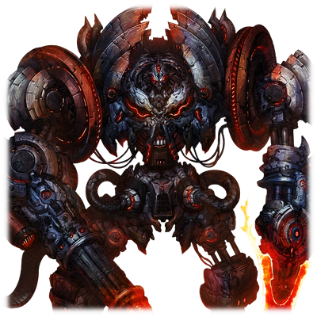
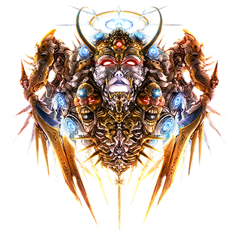
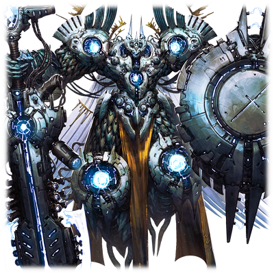
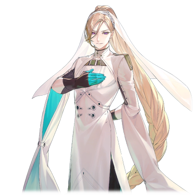
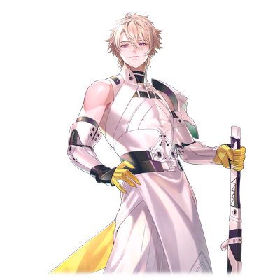

# 德威格

| 角色信息   |          |
| ----------- | ----------- |
|名称|德威格
|年龄|制造年份不明
|职业|强硬派南方方面军的机动兵器
|对应歌曲|Disruptor Array
|初出版本|Chunithm SUN

## Episode 1 记忆的碎片

>我们必须亲手铸造新的历史才行。我们不要神赐予我们的都市，因为未来的愿景是由我们所描绘的啊！

曾经，那是反抗的象征。

曾经，有一群人被政府驱逐进了地下的都市。

那些遭受不公命运的旧人类们，利用储藏于地下的机动兵器，向统一政府军发起了反抗。

在这场与身为支配阶级的政府军，还有他们拥护的管理AI对抗的大战之中，虽然牺牲了许多生命，但旧人类也成功地斩杀了人造的神明。

 

这集结了人类的怒火的反抗一击，的确触及了神明的领域。这对于早已将与神明对抗一事视作不可能的他们来说，这正是带来希望的绝世一击。

然而，这也不过是顷刻的幻影罢了。

管理AI以超越人类认知的速度恢复了损伤，将他们的希望彻底打碎。

旧时代的人类，终是折戟于神明面前。

 

以这场战争为契机，系统得出了结论——人类的存在对这污染的大地的再生工作毫无意义。

于是，那些存活在地上的所有人类，都只能迎接被机械装置的神明歼灭的命运。

即便如此，人类也没有放弃希望。

那些潜藏于地下都市，从神明的制裁中幸存下来的人们，即便是在步步紧逼的生存环境之中，也没有舍弃希望。

为的就是终有一天，能够亲手讨伐神明。

 

——在那之后，时光荏苒。

现在，在大地上昂首阔步地行走着的，是代替了人类的，由机械所设计出来的人造人种“真人”。

非洲大陆，一片仍旧残留着前次大战的无数伤痕的大地。在那里的某处遗迹，发现了那个东西。

旧时代的机动兵器。

那散发着凶邪气息的外表，还有无尽怒火的头部。

那机动兵器的残骸，就像是那些被驱逐到地下的人类的怒火体现一般。

这些被发掘出来的机械兵器，有的还算完整，有的已经支离破碎，而且由于四处分散，根本无法分辨这些部件是来自单一的机体，还是各种不同型号的机体。

在无数技术人员的努力之下，从各地收集过来的碎片，渐渐地聚集成了一个有形体，组成了全新的身躯，和名字。

其名为——德威格，源自于旧人类的神话传说之中的黑暗精灵之名——

## Episode 2 某个男人所见到的地狱

>魔剑的名字绝非浪得虚名！这能行，能行啊！就由我驾驶德威格，亲手将那些机械种打入地狱吧！
一边，是由众多的机动兵器群所组成的，机械种的钢铁防线。另一边，则是真人强硬派所组成的浩浩荡荡的大军。就在这两军正拼杀的你死我活的时候，那台机动兵器——德威格，登场了。

在那压倒性的质量面前，这个战场上没有任何东西能够承受住它的一击。

德威格只是挥舞着剑，横扫千军，将战场上的一切都破坏殆尽。

这宛如天灾般的恐怖力量，成功扭转了战局，拯救了正处于下风的真人强硬派。

 

“哈哈，厉害，太厉害了……这就是德威格的力量啊！！”

 

德威格的志愿驾驶员正坐在操作席上，带着头盔式显示器，眺望着机械种的大军。他瞪大了眼睛，就像是要将这一画面尽收眼底一般。

 

“被当成猎物的感觉如何啊！！机械杂种们！！”

 

一想到自己曾经苦战过无数次的敌人，现在就像蝼蚁一样毫无反抗之力，只能任由自己蹂躏，他感到了前所未有的快感。

这到底是一种宛如天神下凡般的权力感呢，还是沉睡于男人内心深处的破坏冲动呢。

现在，男人的脑海中只有一个念头——把眼前的敌人全部粉碎。

 

“哈哈哈！上吧！德威格！给他们好看！”

 

无法抑制自己高昂的情绪，男人向着远处的都市——佩尔修斯殖民地开足马力，飞驰而去。

没有人能够阻止这台机体的前进。

将挡在面前的敌人一一粉碎，德威格冲到了都市的外壳部。即便再多的敌人也阻挡不了它的脚步。

然后，随着坚固的外壳被破坏，驾驶员跟随着友军进入了市区内。

与外头热火朝天的战场不同，这里被一种诡异的静寂所包围。

就在大军到达矗立于中心部的，巨大的圆锥形的塔的时候，突然，一个声音响彻了整个都市区域。

 

“**各位，辛苦你们来到这里了**。”

 

一个冷酷的女声从都市的角落响起。

那声音的主人，正是管理佩尔修斯殖民地的机械种——艾娃·多米南斯XII。

 

**“虚▼……梦◆▼〇破……坏×◆◆吧！”**

“啊……咕……！？”

 

就在听到艾娃的声音的瞬间，男人的视野一阵天旋地转。

“是攻击吗！？到、到底……是从哪里来……咕！？”

 

随着艾娃的声音继续在城市中回响，那头脑中的疼痛就愈发严重。那尖锐的痛感，仿佛就像一根钢钉敲入脑髓一般，钻心，尖锐。

这疼痛的来源，是来自于进行了神经连接的德威格。然而，身在其中的驾驶员并不知情。

随着艾娃继续说着，德威格的共鸣也愈发强烈。

 

**“未来◆▼〇我们……创造啊！”**

 

与这些声音同时出现在男人脑海里的，是许多断断续续的影像。不知何时，男人的眼中看到的，已不再是面前的都市景象，而是储存在德威格的机体内的影像记录。

通天的高塔，被废墟压碎的机械群和人类。

那些是不知在什么地方上演过的，都市联合军与统一政府军之间所爆发的，远古时期的战争。

 

“我，我到底是……？对了，我是……”

 

这些影像的碎片仍未结束。影像转向了一个漂浮在塔的遥远上空的某个人形——

**“神自己创造的理想的都市，不要也罢！”**

 

男人的怒火，和曾经驾驶着德威格的人的怨念，合二为一。

自我意识的边界被打破，融合。从那钢铁的身体中传来的，是不该存在的幻痛。从机体中传来的膨大的情报洪流，让男人把这截然不同的现实——亦或者说，这脑中所见到的景象，当成了“现实”。

 

乘上德威格所带来的，不只是那神一般的全能力量。它还会操纵驾驶者的脑波，令其亢奋起来，使其意识和精神与机体同化。

而这样的行为会带来什么结果，德威格并不知情。

对于德威格自身来说，最重要的，只有将那些把旧人类从地面上抹除的，不共戴天的敌人，还有那些在地上肆意妄为的虚伪生命统统斩尽杀绝而已。

坐在驾驶舱中的男人，已经忘记了自己原本是什么人了。

他已经忘记了自己曾经所秉持的大义，志向为何物了。

只要把眼前的所有“敌人”消灭，就行了。

 

“去死吧啊啊啊啊！！！你这神明！！！”

 

就在德威格即将动身的瞬间——一片银色的佩尔修斯殖民地市区“鸣动”了。

音响兵器“哈莫尼亚”。由机械种所准备的战略兵器，直接攻击了德威格的驾驶舱内的驾驶员。

在那瞬间，男人的身体从内部炸开。

内脏被震个粉碎，七窍流出了血泪。即便是坚固的真人骨骼，也被折断，扭到了不该在的地方——这个驾驶员，在刚才的一瞬间，就被震天的音波，变成了某样看不出原来模样的凄惨尸骸。

而这，就是这个男人最后见到的地狱。

## Episode 3 虚实相生

>说不定……从初次见到它的时候……我就被它所吸引了啊。
发生于佩尔修斯殖民地的战斗，以预想之外的形式迎来了落幕。

由于机械种的监督官——艾娃·多米南斯XII人间蒸发，佩尔修斯殖民地很快就被占领了。

即便音响兵器“哈莫尼亚”几乎全歼了强硬派的军团，但是中枢塔管制室也已人去楼空，双方的战线都已崩溃。

这场战斗，就这样以无数的真人的死亡而落幕。然而，这样残酷的胜利，也未免太过苦涩了。

* * *

就在那些突入佩尔修斯殖民地的士兵准备归还的时候，纳丁为了回收遗留在中枢塔附近的德威格，重新来到了这里。

 

“……这可真惨啊。”

 

在阳光的照耀下反射着银光的市街，现在已经变成了弥漫着刺鼻恶臭的死亡之城。

随着一声叹气，纳丁坐上了德威格的驾驶舱。

在仍未清理过的驾驶舱中，血腥味仍未散去，即便是早已见惯了死亡的纳丁都皱起了眉头。

擦干布满血迹的头盔，纳丁戴上了它，开始检查机身是否有异常。

 

在稍微检查了下之后，纳丁并未在德威格上发现什么异常。

但如果没有任何异常的话，那之前乘坐德威格的时候听到的究竟是谁的声音呢？

 

“不管这东西能不能动，都要好好调查一下这台机子才行了……嗯？这是什么？”

 

在头盔映射的界面上，发现了一个未曾见过的项目。这不存在于说明书中的东西，应该是上一个驾驶员的视觉信息的碎片吧。

纳丁轻触画面，打开了文件。

在几个片段中被选取出来的，正是即将冲入佩尔修斯殖民地的那一刻。

光是从男人的喊声和手势，就能看出当时的驾驶员究竟是处于何等亢奋的状态。

 

“还真是疯狂啊。我记得他本来应该是个温厚老实的家伙啊……”

 

随着纳丁继续翻找其他的记录，他看到了驾驶员眼前的景象变成了完全不同的东西。和眼前的这片银色都市完全不同的，凄惨的大战光景——

**“虚▼……梦◆▼〇破……坏×◆◆吧！”**

**“◆▼站起来！同志们，……◆▼〇起来啊！！◆▼〇不能就这样在神◆▼〇的面……屈服◆▼〇！！”**

“……！？”

 

声音虽然还是上一个驾驶员的，但是音调已经扭曲到无法分辨的地步了。

 

**“▼克※＊尔！！！”**

“唔哦！？”

 

宛如裂帛般的响声在纳丁的耳边响起，令他不禁取下了头盔。他试着深呼吸让自己重新冷静下来，但令他更为惊讶的，是不知从何时起，他听到的前驾驶员的声音已经渐渐地变成了自己的声音。

 

“——快回想起来吧。回想起我等为何要对神明发起反抗。”

 

这是幻听吗？

纳丁一开始是这么想的。但是，刚才这句话确确实实是由自己的嘴说出来的。这种在无意识之间，自己变得不再是自己的感觉，令纳丁感觉到了一股寒意。

 

“可恶，就连我的脑袋也变得不正常了吗……”

 

明明没有继续看那些影像了，但随着纳丁的眼睛一睁一闭，那些画面就像是阴魂不散一样，在自己的眼前不断浮现。

 

“对了，这种感觉……就跟被亚哈操纵记忆的时候很像……”

 

到底什么才是真实，什么才是虚幻呢？

纳丁已经无法判断了。

“真是的，到底要笑到什么时候啊……”

出现在眼前的纳丁的倒影，一直挂着笑容，望着他自己。

## Episode 4 沿着圣女的轨迹

>萨马拉坎达……聚集了一切因果的城市。这一切的一切，都是跟拔示巴这个女人紧密相连的呢。

在真人军占领了佩尔修斯殖民地之后，众人在强硬派的指导者·沃特的旗舰上展开了一场军事会议。

除了确定今后的方针，这次会议的重点，就是身为指导层的前线指挥官的凯南·梅尔维亚斯的动向。

他在这场战斗的途中，暗中夺取了监督官艾娃·多米南斯XII，并且就此人间蒸发，消失不见。

而这件事，还是在萨尔贡提供的情报，以及突入部队的少女的证言之下，才得以证实。

以此情报为基准，沃特决定派出追击部队前去讨伐凯南。

虽然蕾亚和艾斯特尔等人由于担忧机械种的反击而对于分割部队一事持反对意见，但是沃特一意孤行，终是将部队分成了两部分。

* * *

在奔向凯南所在之处的旗舰参谋室内。

沃特正咧着嘴露出笑容。

 

“我的预感果然没错。那个反贼果然正拿着萨马拉坎达作为自己的据点。”

 

根据拔示巴战役时期的卡斯比大裂谷周边地形的数据，还有艾丽夏·穆尔西亚提供的追踪信标的反应，两者所结合起来的地图影像，正在屏幕上显示着。

信标所指示的坐标，正在大裂谷以东的某个地方缓缓地闪烁着。

这闪烁于空无一物的地方的信号反应，令萨尔贡也露出了惊讶的表情，问到。

 

“萨马拉坎达……我还从没听过这个地方。那里是个怎样的地方？”

“萨马拉坎达，是母亲所直属的部队最后打下的城市。虽然成功占领了那里，但是母亲也在那里驾崩，结果不得不仓皇撤退。”

“那么，凯南所说的‘拔示巴的愿望’什么的，只要前往那里就能够知道了吧。”

“啊啊……是的……”

 

“凯南”与“拔示巴”。

只是听到这两个词语，就足以让沃特心如刀绞，眉头深锁。

 

“母亲大人的崇高理想……怎么能让那个家伙实现……能够担当如此重任的人，只有我，只有我……！”

 

以狂信形容也不为过的，对亡故母亲的忠诚心。

从初次见到沃特，以同为指导者的立场一起共事的萨尔贡来看，这一切都没有改变。

沃特一直以来就是这样维持着如此疯狂的信仰心活着的。

即便是面对萨尔贡这样的人，沃特也并不在意，只是不厌其烦地念叨着。

 

“那个毛头小子！！母亲大人……母亲大人是只属于我一个人的啊！！绝对不会……绝对不会交给那种人的！！”

 

然而，正因如此。

这不管做任何事情都不会得到“母亲”的回报的活法，对于萨尔贡来说，这样的活法实在是太过悲哀了。

而这异常的思考方式，说不定也是拔示巴一族一脉相承的产物吧。

## Episode 5 黎明之前

>即便结果不尽如人意，我也并不后悔。要说有什么后悔的事情的话，那就是我背叛了那些把我的一切托付给他们的人吧。

离开了参谋室，萨尔贡走到了德威格停靠着的滑行轨道。

很快，朝阳就要升起了。然而，即便如此，机体的周围仍旧是灯火通明。

 

“原来在这里吗，纳丁。”

“……萨尔贡大人。”

 

明明其他的工作人员已经回去休息了，但是纳丁仍然坚持留在这里进行整备工作。

 

“热衷于工作不是什么坏事，但是也不要勉强自己哦？”

“可是……”

 

萨尔贡的语调似乎轻松不少。纳丁露出惊讶的表情转过头去——然后，他就明白了缘由。

 

“原来如此，是这回事吗。”

 

萨尔贡的手上拿了什么东西。

仔细一看，那是两个糖果色外壳的小瓶子。

 

“我请客，如何？”

 

就像个把戏被看破的孩子一样，萨尔贡露出了笑容。

看着自己上司这意料之外的一面，纳丁会心一笑。

 

“哈哈，既然是长官的命令的话，那我可不能拒绝了啊。”

 

两人背靠着德威格的巨大身躯，席地而坐，举杯痛饮。

* * *

“萨马拉坎达……本来是跟前次大战无缘的地方，但是那个男人竟然能执着到这个地步……把整支军队当成自己的私有物管理，你也很辛苦吧。”

“毕竟是一把手，会这样也不奇怪。不过，虽说是被他限制了行动，但是相对的也更容易预测他的动向，所以并不构成威胁。现在更重要的应该是打倒凯南和在幕后操纵着他的黑手才是。”

 

萨尔贡握紧了拳头，纳丁也点头同意。

在这之后，两人畅谈了在一切都结束之后，世界将要何去何从的话题。

等到战争结束，这个世界也脱离了“系统”的控制之后，就要建立新的世界。

在他们体内的旧人类的血脉，也是如此期望着的。

 

“不久就要破晓了啊。”

“是的。”

“即便到了崭新的世界，我也得拜托你了。”

“这还真是麻烦啊。要是比现在更忙的话，那我可真的要吃不消了。”

“别这么说嘛。所以啊，一定要活下去啊，纳丁。”

“……那是当然。毕竟我们可是从那片地狱里爬出来的人啊。”

 

纳丁伸出了拳头，碰了碰萨尔贡的拳头。在双拳互碰之余，他们也在心中默默起誓——一定要活下去。

 

“已经很久没有这么畅谈了啊。”

“怎么说呢，感觉像是很久以前，又觉得是最近才发生的事情呢。”

 

积年累月的共事，使得他们之间已经不只是真人战友间的关系了。

现在的他们，已经是能够同甘共苦，互相托付背后的兄弟了。

 

大战当前无比紧绷的神经，也得以稍微缓和下来。

但是仍旧不能松懈。这么想着的纳丁，缓缓地站了起来。

 

“那么，我也差不多得回去继续整备了。还有没检查的地方——”

就在这个瞬间，强烈的眩晕感袭来。

 

“怎么了？身体**『——埋葬他们——』**不舒服吗？”

 

混杂在萨尔贡的话语里的，是德威格的声音。

即便以否定回应，声音却只在脑海里越来越响，就像是要将纳丁的灵魂拉向无底深渊一般。

 

“不、不……没什么的。”

“那就好，**『――将系统，将神明――』**可不要勉强自己啊。”

“那是当然。但是，我也是知道自己的极限，才会这么勉强自己的。因为，我可是你最忠实的部下啊。”

 

顶着脑中不停回响着的『**诛杀神明**』『**将Metaverse系统破坏掉**』的声音，纳丁努力摆出一副平静的样子，露出了笑容。

萨尔贡虽然还略有不满的样子，但是还是被纳丁强硬地赶回了飞船内。

纳丁以手轻抚紧闭的铁门，跪在了地上。

 
“我会活下去……会活下去给你看的……我绝对，绝对不会步上那个驾驶员的后尘……怎么可能就这样屈服呢……”

 

望着云层中漏出来的月光，纳丁默默祈祷着。

即便他不知道，这一别，将是永恒。

## Episode 6 人机一体

>我还真是个不成器的部下啊。真想亲眼看看，您建立起来的新世界啊……

在漫长的航行之后，追击部队终于来到了萨马拉坎达——一座如今已经变成了一座要塞的地方。

这副阵势，完全不下于佩尔修斯殖民地或者奥林匹亚斯的守军规模。

根据沃特的情报，萨马拉坎达原本并不是如此军事化的地方。

那么这肯定是什么人的手笔。

 

不但如此——还有一大群以放射状布阵于都市上空的，白色涂装的舰队。

那舰队的颜色，代表的正是拔示巴战役时期，圣女以及其从者们的势力。

 

“凯南！不但背叛了我……竟然，竟然还把母亲大人的方舟搬了出来！仅凭此，就已经是罪该万死了啊！”

坐在舰长席上，沃特狠狠地咒骂着正潜藏在眼前的都市之中的反贼·凯南。

 

“不，只是让他一死了之也太便宜他了！要让他体验到万般痛苦，求生不得求死不得的感觉才够啊！”

 

没有人敢回应正在座位上大发雷霆的沃特，船舱中弥漫着一股沉重的气氛。

就在这时，那队白色的舰队发来了通讯，而从扬声器中传出来的，是一个与这气氛极为不相称的开朗声音。

 

“哦~好可怕！竟然这么痴情的吗？”

 

就在这剑拔弩张，随时都会开火的紧张状态之中，仍旧我行我素的人。

这样的家伙，沃特只认识一个。

他瞪大了眼睛，露出了不爽的表情。

 

“洛特……！我就说为什么你没有参加之前的战斗，原来一早就在我的背后暗中行动了吗！”

“咦？可是我看你也不怎么惊讶的样子啊？”

“你觉得你这副态度我还会信你多少？”

“啊哈，有个不争气的兄长还真是对不起啦！毕竟我也有我优先想做的事情呢。”

“哎！跟你这家伙已经没话可说了！消灭他们！把这些侮辱了母亲大人的英名的家伙——”

 

话还没说完，旗舰就开始大幅倾斜了。

原来是纳丁驾驶着德威格，等都不等地出发，降落到了大地之上。

接着，宛如重磅炸弹触碰到地面的声音响起，随之而来的是漫天的尘土和烟雾。

从风沙和浓烟中现身的，是单膝着地的德威格的巨体。

降临于大地之上的德威格也出现在了洛特的战舰屏幕上，各种估算的数据也在屏幕上闪现着。

那些战舰上的船员们，反应各有不同。

既有完全潜藏不住惊讶和恐惧发抖的人，也有努力保持冷静，在脑海中沉思这个庞然大物可能的危害的人。

但是，并未在意船员们的反应，洛特只是爽朗地说着。

 

“等等，这也太大了吧！这种东西拿出来也太犯规了！到底是从哪里掏出来的啊！”

“哼，你们就好好地偿还自己的罪孽吧！”

 

沃特的舰队突然发难，拉开了战争的序幕。与之相对的，面对这个一意孤行的弟弟，洛特也只能笑笑，向全军下达了迎击的指示。

就这样，战火在这绀青之都的上空打响。

 

——稍微把时间往回拨一些。

坐在德威格中待机的纳丁，现在正一片混乱，甚至连沃特的话都没听到。

明明没有碰到操纵杆，但是在视野捕捉到萨马拉坎达的时候，机体竟然开始自行运动了。

 

“等等！？这家伙……！！”

 

纳丁试图阻止，但德威格并未回应。

不但如此，德威格就像是警告纳丁不要阻止他一样，以神经元的接口入侵了纳丁的意识，甚至以萨尔贡的声音试图让他屈服。

**『将Metaverse系统破坏掉，纳丁。』**

“不要拿着……萨尔贡大人的声音来欺骗我啊……！”

 

即便脑袋承受着钻心的疼痛，纳丁也仍旧强撑着。

于是，为了让他的意志屈服，德威格直接以电子信号向他的脑海传输了信息。

浮现在纳丁眼前的，是萨尔贡无比凄惨的死状。

利用以假乱真的幻影，刺激纳丁的心理，让他迷失自我。

就这样持续了好一阵子——直到纳丁再也没有反抗的能力为止。

 

**『纳丁，我们只有向前才行』**

“……”

**『这样就对了。我们别无选择。』**

 

声音在耳边响起，纳丁只是默默地点了点头。

**『前进吧，纳丁。以魔剑之名，将神明，将整个系统，还有其带来的无数产物悉数毁灭。』**

 

就像是回应着这句话一样，纳丁轻声地咏唱着。

“——<ruby>诸神黄昏模式<rp>（</rp><rt>MODE RAGNAROK</rt><rp>）</rp></ruby>”

在这个瞬间，纳丁完全被德威格同化，“魔剑”已成。

机体变成了一柄无需顾虑防御，只需要将一切破坏的，究极的“魔剑”。

搭载于德威格身上的黑盒子。

那正是能够吸收驾驶员的意识和精神，让驾驶员与德威格同化的机能。

虽然上一个驾驶员无法承受这种负荷，在完成同化之前就已经粉身碎骨了，但是拥有旧人类血脉的纳丁，能够承受这样的负荷。

 

“将一切——全都毁灭——”

 

举目望向战场，到处，都是需要**毁灭**的东西。

只有将这一切都破坏掉，才是最能够推进萨尔贡理想的方法。纳丁如此想到。

## Episode 7 吹响终焉的号角

>这种阵仗才配得上这最后的一战嘛！来吧，尽情开火！尽情厮杀吧！

两军在萨马拉坎达的上空交战。

本来在数量上占劣势的追击部队，依靠机动兵器的突破力展示占据了上风，但是化作要塞的城市也以猛烈的炮火回击，制空权就这样在双方的交锋中一进一退。

部署于都市各处的“巴尔迪艾尔”的炮塔扫射攻击，阻止了漂浮于空中的米吉多·科古的进攻，沃特军也失去了反击的机会。

要是继续这样遭受地上和空中的双向攻击的话，沃特的舰队势必会陷入不利的境地。

 

“可恶，纳丁究竟在搞什么名堂！通讯员！赶紧指示他破坏掉那个炮台啊！”

“这、这个……我们已经尝试了很多次，但是都没有回应……”

“可恶！”

 

面对这超出想象的窘境，沃特气的牙痒痒。

已经失去耐心的他，直接向坐在身旁的副手席的萨尔贡发起难来。

 

“喂！萨尔贡！你家养的这条狗怎么根本就派不上用场啊！赶紧给我做些什么啊！”

 

从显示地上战况的屏幕来看，德威格正在战场上横冲直撞，将挡在眼前的一切敌人斩杀殆尽。

但是这动作，与其说是熟练的士兵，不如说更像是遵循本能行动的野兽。

 

“没有缰绳抓着，你就会觉得不自在也是无可厚非的吧。”

“你说什么！？”

“但是，要是束缚的太过了，养的狗也是会狗急跳墙的。你还是好好在座位上等待形势的变化吧。而且，不只是下方，要是正面也疏于防御的话，可是会出大事的。”

“哼，这不用你说！”

 

沃特下达了加强弹幕火力的指示后，回到了舰长席上，继续观察着战况的变化。

 

（如果是他的话，是绝对不可能在战场上迷失自我的。既然如此的话，那肯定是出了什么事……）

 

萨尔贡想起了一件事。

就是最后一次说上话的时候的纳丁，总觉得有些奇怪。他的视线似乎没有对焦，十分空虚，就像是眺望着什么不存在的东西一样。

 

（抱歉……纳丁……）

 

在残酷的战场上，祈祷是没有任何用的。

即便在任何时代，这都是亘古不变的真理。

然而，即便萨尔贡知道这件事，他也不愿放弃，坐在座位上，祈祷着纳丁的平安归来。

* * *

“那个大家伙还真厉害啊。挨了‘巴尔迪艾尔’的直接攻击竟然还能动弹？真不敢相信！”

“洛特大人，看起来似乎很享受的样子……我们放着那个怪物不管真的可以吗？”

“嘛，我们也只能做我们能做的事情而已嘛♪”

 

出现在屏幕上的，是发出野兽般的咆哮声，向着“巴尔迪艾尔”飞扑上去的德威格。

看着如此非现实的光景，洛特反而更提起了兴趣，兴奋地拍着手。

 

“说不定我的‘命定之日’，会来的早一些呢？”

“哈，哈啊……”

“不过啊，我可不想被那么大的一柄剑砍成两半啊~”

“可是，在战场上战斗到最后一刻，光荣地死去才是我们身为军人的荣誉，不是吗？”

“啊哈，你还真认真啊。喂喂喂，那边的弹幕怎么弱下来了！赶紧开火啊！”

 

就在洛特伸出身子发出指示之后，他向着没人看到的地方小声地说到。

“……嘛，至少到完成母亲大人的愿望为止就是了。”

 

就在这时，负责萨马拉坎达的管制系统的地上部队，传来了通信。

 

“洛特大人，有个高速移动的飞行物体正向这里接近，该怎么办？”

“数量有多少？”

“一机。这个……难道说是气垫船吗？”

“咦~还真有这种疯子专门来到这里的啊？也罢，你们给我好好地招待他们！”

“是！”

 

洛特结束了通讯之后，嗤嗤地笑着。

越来越多的不确定因素。这些东西究竟会对这场战事的战局产生怎样的影响呢？

洛特一想到这个，就兴奋地难以自制。

 

“看来这场戏也来到了最高潮的部分了啊！那么，就让这最后的狂欢，更加热闹起来吧！”

## Episode 8 挑战魔剑的人们

>那个东西，必须由我们阻止才行。这一切也是为了让那些孩子们能够向着未来前进啊。

德威格，是由以魔剑之名命名的机体的碎片，与其他同型号机体的部件所组装起来的机体。

在机体性能远超常理之余，魔剑也会挑选相称的驾驶员。

为了引出机体真正的实力，只有与适合率更高的驾驶员实现同化——也就是“人机一体”的境界才行。

也就是说，这台机体只有流淌着旧人类的血脉的人才能驾驶。

本来，在这个由真人所占领的大地之上，是绝无可能有人与德威格有着如此优良的适应性的……

然而，在这无数的因果命运的交织之中，还是有一个人成功与魔剑邂逅了。然后，也吸引来了那些挑战魔剑的人们，向着这决战的战场而来。

 

梅尼·特尔塞拉。

安夏尔·奥达奇亚。

马尔杜克·阿尼玛特。

 

他们三人，不管是谁，都是被魔剑所憎恨的系统所养育，并且降临到这片大地上的全新人类——归还种。

一边是旧日血脉的终点的继承者，另一边则是到达进化极点的人们。

两者是水火不容的。

这场战斗，最终只能由一方的消亡落下帷幕。

命运，再度重演——在这一刻，魔剑再度向世界下达了审判。# 德威格

| 角色信息   |          |
| ----------- | ----------- |
|名称|德威格
|年龄|制造年份不明
|职业|强硬派南方方面军的机动兵器
|对应歌曲|Disruptor Array
|初出版本|Chunithm SUN

## Episode 1 记忆的碎片

>我们必须亲手铸造新的历史才行。我们不要神赐予我们的都市，因为未来的愿景是由我们所描绘的啊！

曾经，那是反抗的象征。

曾经，有一群人被政府驱逐进了地下的都市。

那些遭受不公命运的旧人类们，利用储藏于地下的机动兵器，向统一政府军发起了反抗。

在这场与身为支配阶级的政府军，还有他们拥护的管理AI对抗的大战之中，虽然牺牲了许多生命，但旧人类也成功地斩杀了人造的神明。

 

这集结了人类的怒火的反抗一击，的确触及了神明的领域。这对于早已将与神明对抗一事视作不可能的他们来说，这正是带来希望的绝世一击。

然而，这也不过是顷刻的幻影罢了。

管理AI以超越人类认知的速度恢复了损伤，将他们的希望彻底打碎。

旧时代的人类，终是折戟于神明面前。

 

以这场战争为契机，系统得出了结论——人类的存在对这污染的大地的再生工作毫无意义。

于是，那些存活在地上的所有人类，都只能迎接被机械装置的神明歼灭的命运。

即便如此，人类也没有放弃希望。

那些潜藏于地下都市，从神明的制裁中幸存下来的人们，即便是在步步紧逼的生存环境之中，也没有舍弃希望。

为的就是终有一天，能够亲手讨伐神明。

 

——在那之后，时光荏苒。

现在，在大地上昂首阔步地行走着的，是代替了人类的，由机械所设计出来的人造人种“真人”。

非洲大陆，一片仍旧残留着前次大战的无数伤痕的大地。在那里的某处遗迹，发现了那个东西。

旧时代的机动兵器。

那散发着凶邪气息的外表，还有无尽怒火的头部。

那机动兵器的残骸，就像是那些被驱逐到地下的人类的怒火体现一般。

这些被发掘出来的机械兵器，有的还算完整，有的已经支离破碎，而且由于四处分散，根本无法分辨这些部件是来自单一的机体，还是各种不同型号的机体。

在无数技术人员的努力之下，从各地收集过来的碎片，渐渐地聚集成了一个有形体，组成了全新的身躯，和名字。

其名为——德威格，源自于旧人类的神话传说之中的黑暗精灵之名——

## Episode 2 某个男人所见到的地狱

>魔剑的名字绝非浪得虚名！这能行，能行啊！就由我驾驶德威格，亲手将那些机械种打入地狱吧！
一边，是由众多的机动兵器群所组成的，机械种的钢铁防线。另一边，则是真人强硬派所组成的浩浩荡荡的大军。就在这两军正拼杀的你死我活的时候，那台机动兵器——德威格，登场了。

在那压倒性的质量面前，这个战场上没有任何东西能够承受住它的一击。

德威格只是挥舞着剑，横扫千军，将战场上的一切都破坏殆尽。

这宛如天灾般的恐怖力量，成功扭转了战局，拯救了正处于下风的真人强硬派。

 

“哈哈，厉害，太厉害了……这就是德威格的力量啊！！”

 

德威格的志愿驾驶员正坐在操作席上，带着头盔式显示器，眺望着机械种的大军。他瞪大了眼睛，就像是要将这一画面尽收眼底一般。

 

“被当成猎物的感觉如何啊！！机械杂种们！！”

 

一想到自己曾经苦战过无数次的敌人，现在就像蝼蚁一样毫无反抗之力，只能任由自己蹂躏，他感到了前所未有的快感。

这到底是一种宛如天神下凡般的权力感呢，还是沉睡于男人内心深处的破坏冲动呢。

现在，男人的脑海中只有一个念头——把眼前的敌人全部粉碎。

 

“哈哈哈！上吧！德威格！给他们好看！”

 

无法抑制自己高昂的情绪，男人向着远处的都市——佩尔修斯殖民地开足马力，飞驰而去。

没有人能够阻止这台机体的前进。

将挡在面前的敌人一一粉碎，德威格冲到了都市的外壳部。即便再多的敌人也阻挡不了它的脚步。

然后，随着坚固的外壳被破坏，驾驶员跟随着友军进入了市区内。

与外头热火朝天的战场不同，这里被一种诡异的静寂所包围。

就在大军到达矗立于中心部的，巨大的圆锥形的塔的时候，突然，一个声音响彻了整个都市区域。

 

“**各位，辛苦你们来到这里了**。”

 

一个冷酷的女声从都市的角落响起。

那声音的主人，正是管理佩尔修斯殖民地的机械种——艾娃·多米南斯XII。

 

**“虚▼……梦◆▼〇破……坏×◆◆吧！”**

“啊……咕……！？”

 

就在听到艾娃的声音的瞬间，男人的视野一阵天旋地转。

“是攻击吗！？到、到底……是从哪里来……咕！？”

 

随着艾娃的声音继续在城市中回响，那头脑中的疼痛就愈发严重。那尖锐的痛感，仿佛就像一根钢钉敲入脑髓一般，钻心，尖锐。

这疼痛的来源，是来自于进行了神经连接的德威格。然而，身在其中的驾驶员并不知情。

随着艾娃继续说着，德威格的共鸣也愈发强烈。

 

**“未来◆▼〇我们……创造啊！”**

 

与这些声音同时出现在男人脑海里的，是许多断断续续的影像。不知何时，男人的眼中看到的，已不再是面前的都市景象，而是储存在德威格的机体内的影像记录。

通天的高塔，被废墟压碎的机械群和人类。

那些是不知在什么地方上演过的，都市联合军与统一政府军之间所爆发的，远古时期的战争。

 

“我，我到底是……？对了，我是……”

 

这些影像的碎片仍未结束。影像转向了一个漂浮在塔的遥远上空的某个人形——

**“神自己创造的理想的都市，不要也罢！”**

 

男人的怒火，和曾经驾驶着德威格的人的怨念，合二为一。

自我意识的边界被打破，融合。从那钢铁的身体中传来的，是不该存在的幻痛。从机体中传来的膨大的情报洪流，让男人把这截然不同的现实——亦或者说，这脑中所见到的景象，当成了“现实”。

 

乘上德威格所带来的，不只是那神一般的全能力量。它还会操纵驾驶者的脑波，令其亢奋起来，使其意识和精神与机体同化。

而这样的行为会带来什么结果，德威格并不知情。

对于德威格自身来说，最重要的，只有将那些把旧人类从地面上抹除的，不共戴天的敌人，还有那些在地上肆意妄为的虚伪生命统统斩尽杀绝而已。

坐在驾驶舱中的男人，已经忘记了自己原本是什么人了。

他已经忘记了自己曾经所秉持的大义，志向为何物了。

只要把眼前的所有“敌人”消灭，就行了。

 

“去死吧啊啊啊啊！！！你这神明！！！”

 

就在德威格即将动身的瞬间——一片银色的佩尔修斯殖民地市区“鸣动”了。

音响兵器“哈莫尼亚”。由机械种所准备的战略兵器，直接攻击了德威格的驾驶舱内的驾驶员。

在那瞬间，男人的身体从内部炸开。

内脏被震个粉碎，七窍流出了血泪。即便是坚固的真人骨骼，也被折断，扭到了不该在的地方——这个驾驶员，在刚才的一瞬间，就被震天的音波，变成了某样看不出原来模样的凄惨尸骸。

而这，就是这个男人最后见到的地狱。

## Episode 3 虚实相生

>说不定……从初次见到它的时候……我就被它所吸引了啊。
发生于佩尔修斯殖民地的战斗，以预想之外的形式迎来了落幕。

由于机械种的监督官——艾娃·多米南斯XII人间蒸发，佩尔修斯殖民地很快就被占领了。

即便音响兵器“哈莫尼亚”几乎全歼了强硬派的军团，但是中枢塔管制室也已人去楼空，双方的战线都已崩溃。

这场战斗，就这样以无数的真人的死亡而落幕。然而，这样残酷的胜利，也未免太过苦涩了。

* * *

就在那些突入佩尔修斯殖民地的士兵准备归还的时候，纳丁为了回收遗留在中枢塔附近的德威格，重新来到了这里。

 

“……这可真惨啊。”

 

在阳光的照耀下反射着银光的市街，现在已经变成了弥漫着刺鼻恶臭的死亡之城。

随着一声叹气，纳丁坐上了德威格的驾驶舱。

在仍未清理过的驾驶舱中，血腥味仍未散去，即便是早已见惯了死亡的纳丁都皱起了眉头。

擦干布满血迹的头盔，纳丁戴上了它，开始检查机身是否有异常。

 

在稍微检查了下之后，纳丁并未在德威格上发现什么异常。

但如果没有任何异常的话，那之前乘坐德威格的时候听到的究竟是谁的声音呢？

 

“不管这东西能不能动，都要好好调查一下这台机子才行了……嗯？这是什么？”

 

在头盔映射的界面上，发现了一个未曾见过的项目。这不存在于说明书中的东西，应该是上一个驾驶员的视觉信息的碎片吧。

纳丁轻触画面，打开了文件。

在几个片段中被选取出来的，正是即将冲入佩尔修斯殖民地的那一刻。

光是从男人的喊声和手势，就能看出当时的驾驶员究竟是处于何等亢奋的状态。

 

“还真是疯狂啊。我记得他本来应该是个温厚老实的家伙啊……”

 

随着纳丁继续翻找其他的记录，他看到了驾驶员眼前的景象变成了完全不同的东西。和眼前的这片银色都市完全不同的，凄惨的大战光景——

**“虚▼……梦◆▼〇破……坏×◆◆吧！”**

**“◆▼站起来！同志们，……◆▼〇起来啊！！◆▼〇不能就这样在神◆▼〇的面……屈服◆▼〇！！”**

“……！？”

 

声音虽然还是上一个驾驶员的，但是音调已经扭曲到无法分辨的地步了。

 

**“▼克※＊尔！！！”**

“唔哦！？”

 

宛如裂帛般的响声在纳丁的耳边响起，令他不禁取下了头盔。他试着深呼吸让自己重新冷静下来，但令他更为惊讶的，是不知从何时起，他听到的前驾驶员的声音已经渐渐地变成了自己的声音。

 

“——快回想起来吧。回想起我等为何要对神明发起反抗。”

 

这是幻听吗？

纳丁一开始是这么想的。但是，刚才这句话确确实实是由自己的嘴说出来的。这种在无意识之间，自己变得不再是自己的感觉，令纳丁感觉到了一股寒意。

 

“可恶，就连我的脑袋也变得不正常了吗……”

 

明明没有继续看那些影像了，但随着纳丁的眼睛一睁一闭，那些画面就像是阴魂不散一样，在自己的眼前不断浮现。

 

“对了，这种感觉……就跟被亚哈操纵记忆的时候很像……”

 

到底什么才是真实，什么才是虚幻呢？

纳丁已经无法判断了。

“真是的，到底要笑到什么时候啊……”

出现在眼前的纳丁的倒影，一直挂着笑容，望着他自己。

## Episode 4 沿着圣女的轨迹

>萨马拉坎达……聚集了一切因果的城市。这一切的一切，都是跟拔示巴这个女人紧密相连的呢。

在真人军占领了佩尔修斯殖民地之后，众人在强硬派的指导者·沃特的旗舰上展开了一场军事会议。

除了确定今后的方针，这次会议的重点，就是身为指导层的前线指挥官的凯南·梅尔维亚斯的动向。

他在这场战斗的途中，暗中夺取了监督官艾娃·多米南斯XII，并且就此人间蒸发，消失不见。

而这件事，还是在萨尔贡提供的情报，以及突入部队的少女的证言之下，才得以证实。

以此情报为基准，沃特决定派出追击部队前去讨伐凯南。

虽然蕾亚和艾斯特尔等人由于担忧机械种的反击而对于分割部队一事持反对意见，但是沃特一意孤行，终是将部队分成了两部分。

* * *

在奔向凯南所在之处的旗舰参谋室内。

沃特正咧着嘴露出笑容。

 

“我的预感果然没错。那个反贼果然正拿着萨马拉坎达作为自己的据点。”

 

根据拔示巴战役时期的卡斯比大裂谷周边地形的数据，还有艾丽夏·穆尔西亚提供的追踪信标的反应，两者所结合起来的地图影像，正在屏幕上显示着。

信标所指示的坐标，正在大裂谷以东的某个地方缓缓地闪烁着。

这闪烁于空无一物的地方的信号反应，令萨尔贡也露出了惊讶的表情，问到。

 

“萨马拉坎达……我还从没听过这个地方。那里是个怎样的地方？”

“萨马拉坎达，是母亲所直属的部队最后打下的城市。虽然成功占领了那里，但是母亲也在那里驾崩，结果不得不仓皇撤退。”

“那么，凯南所说的‘拔示巴的愿望’什么的，只要前往那里就能够知道了吧。”

“啊啊……是的……”

 

“凯南”与“拔示巴”。

只是听到这两个词语，就足以让沃特心如刀绞，眉头深锁。

 

“母亲大人的崇高理想……怎么能让那个家伙实现……能够担当如此重任的人，只有我，只有我……！”

 

以狂信形容也不为过的，对亡故母亲的忠诚心。

从初次见到沃特，以同为指导者的立场一起共事的萨尔贡来看，这一切都没有改变。

沃特一直以来就是这样维持着如此疯狂的信仰心活着的。

即便是面对萨尔贡这样的人，沃特也并不在意，只是不厌其烦地念叨着。

 

“那个毛头小子！！母亲大人……母亲大人是只属于我一个人的啊！！绝对不会……绝对不会交给那种人的！！”

 

然而，正因如此。

这不管做任何事情都不会得到“母亲”的回报的活法，对于萨尔贡来说，这样的活法实在是太过悲哀了。

而这异常的思考方式，说不定也是拔示巴一族一脉相承的产物吧。

## Episode 5 黎明之前

>即便结果不尽如人意，我也并不后悔。要说有什么后悔的事情的话，那就是我背叛了那些把我的一切托付给他们的人吧。

离开了参谋室，萨尔贡走到了德威格停靠着的滑行轨道。

很快，朝阳就要升起了。然而，即便如此，机体的周围仍旧是灯火通明。

 

“原来在这里吗，纳丁。”

“……萨尔贡大人。”

 

明明其他的工作人员已经回去休息了，但是纳丁仍然坚持留在这里进行整备工作。

 

“热衷于工作不是什么坏事，但是也不要勉强自己哦？”

“可是……”

 

萨尔贡的语调似乎轻松不少。纳丁露出惊讶的表情转过头去——然后，他就明白了缘由。

 

“原来如此，是这回事吗。”

 

萨尔贡的手上拿了什么东西。

仔细一看，那是两个糖果色外壳的小瓶子。

 

“我请客，如何？”

 

就像个把戏被看破的孩子一样，萨尔贡露出了笑容。

看着自己上司这意料之外的一面，纳丁会心一笑。

 

“哈哈，既然是长官的命令的话，那我可不能拒绝了啊。”

 

两人背靠着德威格的巨大身躯，席地而坐，举杯痛饮。

* * *

“萨马拉坎达……本来是跟前次大战无缘的地方，但是那个男人竟然能执着到这个地步……把整支军队当成自己的私有物管理，你也很辛苦吧。”

“毕竟是一把手，会这样也不奇怪。不过，虽说是被他限制了行动，但是相对的也更容易预测他的动向，所以并不构成威胁。现在更重要的应该是打倒凯南和在幕后操纵着他的黑手才是。”

 

萨尔贡握紧了拳头，纳丁也点头同意。

在这之后，两人畅谈了在一切都结束之后，世界将要何去何从的话题。

等到战争结束，这个世界也脱离了“系统”的控制之后，就要建立新的世界。

在他们体内的旧人类的血脉，也是如此期望着的。

 

“不久就要破晓了啊。”

“是的。”

“即便到了崭新的世界，我也得拜托你了。”

“这还真是麻烦啊。要是比现在更忙的话，那我可真的要吃不消了。”

“别这么说嘛。所以啊，一定要活下去啊，纳丁。”

“……那是当然。毕竟我们可是从那片地狱里爬出来的人啊。”

 

纳丁伸出了拳头，碰了碰萨尔贡的拳头。在双拳互碰之余，他们也在心中默默起誓——一定要活下去。

 

“已经很久没有这么畅谈了啊。”

“怎么说呢，感觉像是很久以前，又觉得是最近才发生的事情呢。”

 

积年累月的共事，使得他们之间已经不只是真人战友间的关系了。

现在的他们，已经是能够同甘共苦，互相托付背后的兄弟了。

 

大战当前无比紧绷的神经，也得以稍微缓和下来。

但是仍旧不能松懈。这么想着的纳丁，缓缓地站了起来。

 

“那么，我也差不多得回去继续整备了。还有没检查的地方——”

就在这个瞬间，强烈的眩晕感袭来。

 

“怎么了？身体**『——埋葬他们——』**不舒服吗？”

 

混杂在萨尔贡的话语里的，是德威格的声音。

即便以否定回应，声音却只在脑海里越来越响，就像是要将纳丁的灵魂拉向无底深渊一般。

 

“不、不……没什么的。”

“那就好，**『――将系统，将神明――』**可不要勉强自己啊。”

“那是当然。但是，我也是知道自己的极限，才会这么勉强自己的。因为，我可是你最忠实的部下啊。”

 

顶着脑中不停回响着的『**诛杀神明**』『**将Metaverse系统破坏掉**』的声音，纳丁努力摆出一副平静的样子，露出了笑容。

萨尔贡虽然还略有不满的样子，但是还是被纳丁强硬地赶回了飞船内。

纳丁以手轻抚紧闭的铁门，跪在了地上。

 
“我会活下去……会活下去给你看的……我绝对，绝对不会步上那个驾驶员的后尘……怎么可能就这样屈服呢……”

 

望着云层中漏出来的月光，纳丁默默祈祷着。

即便他不知道，这一别，将是永恒。

## Episode 6 人机一体

>我还真是个不成器的部下啊。真想亲眼看看，您建立起来的新世界啊……

在漫长的航行之后，追击部队终于来到了萨马拉坎达——一座如今已经变成了一座要塞的地方。

这副阵势，完全不下于佩尔修斯殖民地或者奥林匹亚斯的守军规模。

根据沃特的情报，萨马拉坎达原本并不是如此军事化的地方。

那么这肯定是什么人的手笔。

 

不但如此——还有一大群以放射状布阵于都市上空的，白色涂装的舰队。

那舰队的颜色，代表的正是拔示巴战役时期，圣女以及其从者们的势力。

 

“凯南！不但背叛了我……竟然，竟然还把母亲大人的方舟搬了出来！仅凭此，就已经是罪该万死了啊！”

坐在舰长席上，沃特狠狠地咒骂着正潜藏在眼前的都市之中的反贼·凯南。

 

“不，只是让他一死了之也太便宜他了！要让他体验到万般痛苦，求生不得求死不得的感觉才够啊！”

 

没有人敢回应正在座位上大发雷霆的沃特，船舱中弥漫着一股沉重的气氛。

就在这时，那队白色的舰队发来了通讯，而从扬声器中传出来的，是一个与这气氛极为不相称的开朗声音。

 

“哦~好可怕！竟然这么痴情的吗？”

 

就在这剑拔弩张，随时都会开火的紧张状态之中，仍旧我行我素的人。

这样的家伙，沃特只认识一个。

他瞪大了眼睛，露出了不爽的表情。

 

“洛特……！我就说为什么你没有参加之前的战斗，原来一早就在我的背后暗中行动了吗！”

“咦？可是我看你也不怎么惊讶的样子啊？”

“你觉得你这副态度我还会信你多少？”

“啊哈，有个不争气的兄长还真是对不起啦！毕竟我也有我优先想做的事情呢。”

“哎！跟你这家伙已经没话可说了！消灭他们！把这些侮辱了母亲大人的英名的家伙——”

 

话还没说完，旗舰就开始大幅倾斜了。

原来是纳丁驾驶着德威格，等都不等地出发，降落到了大地之上。

接着，宛如重磅炸弹触碰到地面的声音响起，随之而来的是漫天的尘土和烟雾。

从风沙和浓烟中现身的，是单膝着地的德威格的巨体。

降临于大地之上的德威格也出现在了洛特的战舰屏幕上，各种估算的数据也在屏幕上闪现着。

那些战舰上的船员们，反应各有不同。

既有完全潜藏不住惊讶和恐惧发抖的人，也有努力保持冷静，在脑海中沉思这个庞然大物可能的危害的人。

但是，并未在意船员们的反应，洛特只是爽朗地说着。

 

“等等，这也太大了吧！这种东西拿出来也太犯规了！到底是从哪里掏出来的啊！”

“哼，你们就好好地偿还自己的罪孽吧！”

 

沃特的舰队突然发难，拉开了战争的序幕。与之相对的，面对这个一意孤行的弟弟，洛特也只能笑笑，向全军下达了迎击的指示。

就这样，战火在这绀青之都的上空打响。

 

——稍微把时间往回拨一些。

坐在德威格中待机的纳丁，现在正一片混乱，甚至连沃特的话都没听到。

明明没有碰到操纵杆，但是在视野捕捉到萨马拉坎达的时候，机体竟然开始自行运动了。

 

“等等！？这家伙……！！”

 

纳丁试图阻止，但德威格并未回应。

不但如此，德威格就像是警告纳丁不要阻止他一样，以神经元的接口入侵了纳丁的意识，甚至以萨尔贡的声音试图让他屈服。

**『将Metaverse系统破坏掉，纳丁。』**

“不要拿着……萨尔贡大人的声音来欺骗我啊……！”

 

即便脑袋承受着钻心的疼痛，纳丁也仍旧强撑着。

于是，为了让他的意志屈服，德威格直接以电子信号向他的脑海传输了信息。

浮现在纳丁眼前的，是萨尔贡无比凄惨的死状。

利用以假乱真的幻影，刺激纳丁的心理，让他迷失自我。

就这样持续了好一阵子——直到纳丁再也没有反抗的能力为止。

 

**『纳丁，我们只有向前才行』**

“……”

**『这样就对了。我们别无选择。』**

 

声音在耳边响起，纳丁只是默默地点了点头。

**『前进吧，纳丁。以魔剑之名，将神明，将整个系统，还有其带来的无数产物悉数毁灭。』**

 

就像是回应着这句话一样，纳丁轻声地咏唱着。

“——<ruby>诸神黄昏模式<rp>（</rp><rt>MODE RAGNAROK</rt><rp>）</rp></ruby>”

在这个瞬间，纳丁完全被德威格同化，“魔剑”已成。

机体变成了一柄无需顾虑防御，只需要将一切破坏的，究极的“魔剑”。

搭载于德威格身上的黑盒子。

那正是能够吸收驾驶员的意识和精神，让驾驶员与德威格同化的机能。

虽然上一个驾驶员无法承受这种负荷，在完成同化之前就已经粉身碎骨了，但是拥有旧人类血脉的纳丁，能够承受这样的负荷。

 

“将一切——全都毁灭——”

 

举目望向战场，到处，都是需要**毁灭**的东西。

只有将这一切都破坏掉，才是最能够推进萨尔贡理想的方法。纳丁如此想到。

## Episode 7 吹响终焉的号角

>这种阵仗才配得上这最后的一战嘛！来吧，尽情开火！尽情厮杀吧！

两军在萨马拉坎达的上空交战。

本来在数量上占劣势的追击部队，依靠机动兵器的突破力展示占据了上风，但是化作要塞的城市也以猛烈的炮火回击，制空权就这样在双方的交锋中一进一退。

部署于都市各处的“巴尔迪艾尔”的炮塔扫射攻击，阻止了漂浮于空中的米吉多·科古的进攻，沃特军也失去了反击的机会。

要是继续这样遭受地上和空中的双向攻击的话，沃特的舰队势必会陷入不利的境地。

 

“可恶，纳丁究竟在搞什么名堂！通讯员！赶紧指示他破坏掉那个炮台啊！”

“这、这个……我们已经尝试了很多次，但是都没有回应……”

“可恶！”

 

面对这超出想象的窘境，沃特气的牙痒痒。

已经失去耐心的他，直接向坐在身旁的副手席的萨尔贡发起难来。

 

“喂！萨尔贡！你家养的这条狗怎么根本就派不上用场啊！赶紧给我做些什么啊！”

 

从显示地上战况的屏幕来看，德威格正在战场上横冲直撞，将挡在眼前的一切敌人斩杀殆尽。

但是这动作，与其说是熟练的士兵，不如说更像是遵循本能行动的野兽。

 

“没有缰绳抓着，你就会觉得不自在也是无可厚非的吧。”

“你说什么！？”

“但是，要是束缚的太过了，养的狗也是会狗急跳墙的。你还是好好在座位上等待形势的变化吧。而且，不只是下方，要是正面也疏于防御的话，可是会出大事的。”

“哼，这不用你说！”

 

沃特下达了加强弹幕火力的指示后，回到了舰长席上，继续观察着战况的变化。

 

（如果是他的话，是绝对不可能在战场上迷失自我的。既然如此的话，那肯定是出了什么事……）

 

萨尔贡想起了一件事。

就是最后一次说上话的时候的纳丁，总觉得有些奇怪。他的视线似乎没有对焦，十分空虚，就像是眺望着什么不存在的东西一样。

 

（抱歉……纳丁……）

 

在残酷的战场上，祈祷是没有任何用的。

即便在任何时代，这都是亘古不变的真理。

然而，即便萨尔贡知道这件事，他也不愿放弃，坐在座位上，祈祷着纳丁的平安归来。

* * *

“那个大家伙还真厉害啊。挨了‘巴尔迪艾尔’的直接攻击竟然还能动弹？真不敢相信！”

“洛特大人，看起来似乎很享受的样子……我们放着那个怪物不管真的可以吗？”

“嘛，我们也只能做我们能做的事情而已嘛♪”

 

出现在屏幕上的，是发出野兽般的咆哮声，向着“巴尔迪艾尔”飞扑上去的德威格。

看着如此非现实的光景，洛特反而更提起了兴趣，兴奋地拍着手。

 

“说不定我的‘命定之日’，会来的早一些呢？”

“哈，哈啊……”

“不过啊，我可不想被那么大的一柄剑砍成两半啊~”

“可是，在战场上战斗到最后一刻，光荣地死去才是我们身为军人的荣誉，不是吗？”

“啊哈，你还真认真啊。喂喂喂，那边的弹幕怎么弱下来了！赶紧开火啊！”

 

就在洛特伸出身子发出指示之后，他向着没人看到的地方小声地说到。

“……嘛，至少到完成母亲大人的愿望为止就是了。”

 

就在这时，负责萨马拉坎达的管制系统的地上部队，传来了通信。

 

“洛特大人，有个高速移动的飞行物体正向这里接近，该怎么办？”

“数量有多少？”

“一机。这个……难道说是气垫船吗？”

“咦~还真有这种疯子专门来到这里的啊？也罢，你们给我好好地招待他们！”

“是！”

 

洛特结束了通讯之后，嗤嗤地笑着。

越来越多的不确定因素。这些东西究竟会对这场战事的战局产生怎样的影响呢？

洛特一想到这个，就兴奋地难以自制。

 

“看来这场戏也来到了最高潮的部分了啊！那么，就让这最后的狂欢，更加热闹起来吧！”

## Episode 8 挑战魔剑的人们

>那个东西，必须由我们阻止才行。这一切也是为了让那些孩子们能够向着未来前进啊。

德威格，是由以魔剑之名命名的机体的碎片，与其他同型号机体的部件所组装起来的机体。

在机体性能远超常理之余，魔剑也会挑选相称的驾驶员。

为了引出机体真正的实力，只有与适合率更高的驾驶员实现同化——也就是“人机一体”的境界才行。

也就是说，这台机体只有流淌着旧人类的血脉的人才能驾驶。

本来，在这个由真人所占领的大地之上，是绝无可能有人与德威格有着如此优良的适应性的……

然而，在这无数的因果命运的交织之中，还是有一个人成功与魔剑邂逅了。然后，也吸引来了那些挑战魔剑的人们，向着这决战的战场而来。

 

梅尼·特尔塞拉。

安夏尔·奥达奇亚。

马尔杜克·阿尼玛特。

 

他们三人，不管是谁，都是被魔剑所憎恨的系统所养育，并且降临到这片大地上的全新人类——归还种。

一边是旧日血脉的终点的继承者，另一边则是到达进化极点的人们。

两者是水火不容的。

这场战斗，最终只能由一方的消亡落下帷幕。

命运，再度重演——在这一刻，魔剑再度向世界下达了审判。
