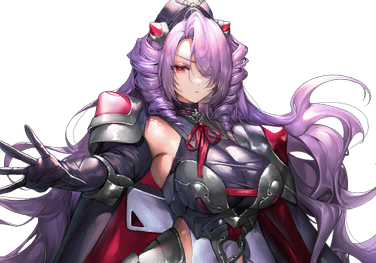

# 艾斯特尔·亚戈鲁修

| 角色信息   |          |
| ----------- | ----------- |
|名称|艾斯特尔·亚戈鲁修
|年龄|容貌年龄20岁左右（制造后12年）
|职业|强硬派士官
身份|金骑士
|对应歌曲|Makear
|初出版本|Chunithm SUN PLUS

## Episode 1 暴风雨前的宁静

>就算把我的行为认为是反叛行为，也是没办法的事。即便如此，也必须保全真人这一种群的未来才行。

从佩尔修斯殖民地的中枢塔极目远眺，银色的都市在夕阳的照耀下，呈现出一副恍若隔世的美景。

这幅光景简直就像是精雕细琢的产物一般，让我的嘴唇不禁扭向了一边。

我不知道机械种是否有追求美的哲学思想。

但是，这天衣无缝的设计，却让我从中感觉到了一股将他人拒绝于千里之外的意志。

虽然从这么高的地方无法确认，但是，在我脚下的这片都市，正有无数的跟机械种战斗过的真人们的尸体，沉睡于其中。

那些都是遵循着沃特的命令，突入这座城市，最终命丧于此的人们。

为什么不惜一切代价也要占领这座都市？答案是为了夺取这座殖民地的人口子宫的使用权。

然而，就为了这样一座城，就要牺牲这么多的人吗？

我思考着未来的模样，不禁说到。

 

“说不定，我们才是必须要被消灭的存在呢。”

“真的很抱歉，真的。要是我能够改变沃特的想法的话……应该就不会造成这样的结果了吧。”

 

看着站在身旁无力哀叹着的蕾亚大人，我只是摇了摇头。

 

“这并不是您的错。”

“可是……”

“结果已经无法改变。那么，我们之后就必须好好思考未来应该怎么做了。”

“……我真的做得到吗？”

“做得到的。蕾亚大人可是十分温柔的啊。”

 

我就在这时提出了一个方案。

 

“首先，就从理解我们现在失去的东西开始吧。不要把他们的死亡当成纯粹的数据，而是一个个的，活生生的人的死亡来看待。”

“那就是说……”

“去了解他们的名字，他们的职位吧。这些积累的东西肯定会成为您的支柱，也会让那些仰慕您的人们付诸行动的吧。”

“……看来，现在不是感慨的时候了。”

 

蕾亚似乎是想通了，脸上的表情也放松了些许。

 

“为了不让他们的死白费，我们无论如何也要活下去。然后，通往我们的未来。”

“如果是您的话，一定能够做到的吧。”

 

这么说着，蕾亚大人向我伸出了手。

 

“能陪着我一同前行吗？”

“只要您这么想的话。”

 

我用一只手托起她那华奢的手，另一只手放到了自己的胸口。

曾经，我立下了誓言。

要成为蕾亚大人的指路明灯。

不能再让愤怒与憎恨的连锁继续下去了。

## Episode 2 侍从骑士

>以亚戈鲁修之名，我一定会将您培养成优秀的圣女。

“艾斯特尔·亚戈鲁修，你就负责照料‘这个’吧。”

 

这件事情，还得从我当上赛罗大人的辅佐官之后说起。

被称作“这个”的，是一名真人的少女。她似乎还未能理解现在的情况，只是向着这里偷偷瞄着。

 

“蕾亚，你在干什么？”

“……”

 

即便被叫到名字，也只是微微一颤，并没有回应。

 

“赛罗大人，这到底是……”

“这是利用拔示巴大人的胚胎做出来的产物。”

“这……”

“虽然只是个未能完美模仿的失败品……不过还是有用处的。”

 

赛罗大人所说的“未能完美模仿”，指的应该就是外表吧。就算身形和脸庞再怎么像，这宛如燃烧的火焰一样的红发和耀眼的金色瞳孔，还是和拔示巴相差太远了。

 

“之前我也说过了，我也将不久于人世。在我死后，强硬派将会迎来新的体制。而你的工作，就是将她培养成能够引导强硬派的存在。”

 

赛罗大人的命令是绝对的。我没有拒绝的权利。

 

“区区一名卫士的我……真的能够担当这样的重任吗？”

“你可是亚戈鲁修家的人。如果说是作为圣女的侍从的话，在真人之中应该是无出其右的一族吧？”

 

我的先祖——伊泽维尔·亚戈鲁修。虽然我只知道一些零碎的事情，但是我听说在她上战场之前，她就是拔示巴的侍女来着。

 

“我明白了。我艾斯特尔，必将效犬马之劳，将蕾亚大人养育成才！”

“甚好。”

 

赛罗把我们留在这里，接着就一个人回到了实验室。

……这里的空气很沉重，感觉很不舒服。

我一边在心里想着去别的地方透透气，一边跪了下来，将手伸到了一动不动的蕾亚大人面前。

 

“来吧，蕾亚大人，我们走吧？”

“不要……！”

 

看来我的行为似乎是吓到了她的样子。等我回过神来，她已经用嘴咬住了我的手。

伴随着一股疼痛感，我的手上也传来了一股暖流。

与那粗重的呼吸声相对应的，是她那双死死瞪着我的眼睛。

看来我被她讨厌了。

面对说不定连人话都听不懂的她来说，现在就算我说再多她也听不进去的吧。

所以，趁着她的注意力仍在我的手上的时候，我把她抱了起来。

 

“……！？”

 

只是轻轻地把她抱起来，蕾亚大人就立刻松了口，反过来紧紧地抱住了我的脖颈。

蕾亚大人的身体是如此轻巧，身体也是如此的娇小。

 

“说不定这么做反而会让她更怕我也说不定呢……”

 

我突然觉得这么拼命地抱着我的蕾亚大人有些可爱，不禁伸手摸了摸那头鲜红的红发——然后，我的脸颊就被狠狠地拍了一巴掌。

 

“……呵呵，说不定会比锻炼新兵还要棘手的多呢。”

 

圣女——蕾亚·艾·弗拉达。

与这位在未来将会成为真人强硬派的指导者的她的邂逅，将会大幅改变我的人生这件事，现在的我，还未从得知。

## Episode 3 圣女的身影

>如果真的有所谓的因果循环的话，那么我成为蕾亚大人的侍女应该也是理所应当的吧。

在我出生的很久之前就已经开始的，真人与机械种的的争斗，随着指导者亚哈以及圣女拔示巴的死，规模变得愈发巨大，也越来越激烈了。

强硬派想要的，是位于奥林匹亚斯的东方之遥的，机械种的据点——佩尔修斯殖民地。

只要能够将这座要冲攻下，我们就能够获得可以生产真人的人工子宫，从而让我们能够得以延续生命。

我们已经没有多少时间了。

真人所拥有的大多数的人工子宫，要么因为年久失修，要么因为机械种的妨害，基本都已经停止了运作。

 

许多的真人都是伴随着短命的诅咒降生于这个世上的。

就算是再优秀的人，在短暂的寿命之中，他们能做的事情也是有限的。

 

“呐，艾斯特尔，我也会很快就死去吗？”

“蕾亚大人稍微有些不一样。”

“此话怎讲？”

“在亚哈大人和赛罗大人的研究下，我们这个世代的寿命已经延长了不少。”

 

迄今为止的世代的真人，顶多只能活十几年而已，但是我们的寿命几乎是他们的两倍。

在无数的研究中诞生的技术，毫无疑问会为真人开拓出一片未来。

 

“而我们也借此得以开发更加精密和高级的武器和装备。”

 

然而，蕾亚大人却向我问到。

 

“即便延长了寿命，我们也要战斗吗？”

“咦？”

“除了战斗以外，我们什么都做不了吗？”

 

我从来都没想过这种事情。

蕾亚大人似乎对这一直以来的行为产生了违和感。

我们的存在意义就是消灭机械种和归还种，成为这片大地的支配者。

如果选择了战斗以外的道路，就会像那些稳健派和融合派那样被当作思想犯，打入大牢。

如果让冷酷无情的赛罗大人知道这些，就算是蕾亚也自身难保。

只有这件事，无论如何都要避免。

 

“蕾亚大人，绝对不能将这种想法说出来。”

“为什么？难道说我们就不能思考别的方法吗？”

“……绝对不行。”

“呐，为什么？”

“……！总之就是不行！”

“噫！”

“非、非常抱歉，蕾亚大人……”

 

不好，明明蕾亚大人只是毫无恶意地质问了一下，我却践踏了她的意志……

那双充满疑惑的眼睛，令我无法直视。

 

“您要做的，就只有继承引导了强硬派的拔示巴大人的意志而已。像您刚才那样的想法，只会为您自己带来危险。我不希望您变成那样。所以，以后还请您谨言慎行。”

“……”

“蕾亚大人？”

“艾斯特尔，真的很温柔呢。”

“我，我吗？”

 

这是我第一次被人这么说。

 

“嗯，因为我就是有这样的感觉……总觉得，有点温暖……”

 

蕾亚大人露出了一个寂寞的笑容，便决定将这份想法藏于心中。

 

“今天就到这里吧。明天见。”

“好的。明天见，艾斯特尔。”

“晚安。”

 

走出蕾亚大人的房间，我背靠着大门思索着。

额头的些许冷汗，暗示着刚才在我内心中的动摇。

 

“蕾亚大人，真正温柔的，是您才对啊……”

 

面对那真挚的提问。

面对那提问背后所潜藏着的感情，我却只能将它强行掐灭，这令我的心中无比刺痛。

## Episode 4 孕育疯狂的存在

>竟然会允许这样的行为……到底在那个人的心中，还残留着多大的执念？

与蕾亚大人相处的时光，就在差不多三年之后，迎来了终结。

强硬派的指导者——赛罗·达文斯死去了。

曾经由他顶替了圣女拔示巴所主导的真人强硬派，也在他死后变为了合议制。

随着势力的改旗易帜，引导真人们的指导者们也变成了这些人——圣女蕾亚，宰相沃特，凯南，萨尔贡——还有作为蕾亚的辅佐官上位的我。

 

指导层的方针仍旧是攻占佩尔修斯殖民地。但是，随着体制的转换所带来的混乱，各地也开始出现了异变。

 

那些警备薄弱的地方都市以及真人的研究设施爆发了恐怖袭击。

自从拔示巴统治了真人以来，由于十分急促的统一行动，招致了稳健派和融合派的不满。

主张对机械种效忠，与归还种一同共存这点，两派还是一致的。

但是他们之间却有一点不同。

那就是是否将主张付诸于暴力行动。

跟那些随着寿命到达尽头自然消失的稳健派不同，拥有一定的军事实力的融合派开始了武装斗争。

 

收到了融合派的袭击声明的我，带着手下们一起前往了某座都市。

 

“——你们这些家伙不会连武器都用不熟吧？不要以为仗着人多就可以肆意妄为啊！”

“强硬派的狗杂种！” “要被制裁的，是你们！” “将那个暴君拉下台！”

 

那些被捉拿归案的恐怖分子们努力宣张着自己的正义。

 

“你们爱怎么说就怎么说。但是如果付诸于暴力行为，那就另当别论了。”

“如果不靠武力的话，就现在这样的体制，我们也没有发言的立场！不用你们说，我们也知道这样的行为是会被惩罚的！”

 

我望向了倒在脚边已经一动不动的真人。

应该是那些被恐怖分子当成人质的研究人员吧。到底是谈判失败了呢，还是因为别的理由呢，他的全身上下都是被殴打的痕迹。

从后脑勺直通向额头的弹孔，绽放出了一朵鲜红的血花。

 

“竟然对毫无关系的平民出手，这就是你们的‘正义’吗？真是冠冕堂皇啊。”

“……我、我们可没有做错什么！这个家伙的所作所为，早已是罪该万死了！”

“所作所为？你在说什么……？”

“哼！说不出话了吧，狗种！要是你们什么都不知道的话，就自己亲眼去确认吧！看看那扇门的里面，到底还藏着什么东西！”

“把他们带走。”

“明白。”

 

就在部下们将那些恐怖分子们带走的时候，我的视线投向了房间深处的某扇大门。

 

“在那扇门的背后，到底是什么东西……”

 

推开半掩着的门，我望向了房间内。

房间中只有一个被透明的墙壁所隔离开来，正躺在手术台上的，白色头发的男孩子。

简直……就像是展览品一样。

不知道究竟是死了呢，还是睡着了呢。站在这里无法确认。

只能看到无数的管子正接在他那虚弱而憔悴的身体上。

 

“没想到在战争时期还能见到如此年幼的真人……这里到底是在进行什么研究？”

 

随着我调查设施的数据，我也得到了答案。

少年名为——索罗·莫尼亚。

他正是继承了圣女拔示巴的血脉的，如假包换的“后代”。

 

“——虽然总觉得有些不可置信，如果那些家伙利用他与机械种进行交涉的话……”

 

就在这时，我的终端传来了通讯。

画面上显示的，是“凯南”的字样。

 

“真是稀奇，您竟然会亲自联系我。”

“我想知道你占领的那座设施的情况。”

“……消息竟然传得这么快吗。”

 

凯南·梅尔维亚斯是在我从赛罗大人那里接下照顾蕾亚的工作的时候，进入奥林匹亚斯殖民地的中枢部的新人。

虽然对他不甚了解，但我可以确定他也跟赛罗大人一样，对拔示巴拥有同样的忠诚之心。

 

“你是从赛罗大人那里得知了这里的情报的吗？”

“差不多就是这样。在他死后，我继承了他大部分的研究项目。”

“那么，既然我已经知道了秘密，是不是也要落得跟那些恐怖分子一样的下场？”

“我可不是赛罗或者沃特那样的强权主义者或者秘密主义者。不如说，我反而需要你的帮忙。”

“帮忙？”

“请将索罗·莫尼亚藏到一个无人能够找到的地方。”

 

他的存在毫无疑问会对现在的体制的根本造成严重的冲击。凯南如此说到。

确实，现在正是强硬派转至新体制不久的时候，那些融合派的残党肯定不会放过这个机会。

再加上可能存在的第三势力，眼前的局势可以说是危机四伏。

如果强硬派变得四分五裂的话，蕾亚大人应该也会受到影响的吧。

风险还是少一点比较好。

所以，我同意了凯南的提案。

* * *

等我将索罗等人送到戈里齐亚殖民地不久，我再次接到了凯南的联络。

从终端上看，凯南一副眉头紧皱的样子。

 

“看你这副样子，似乎形势不太好啊。”

“……我们虽然占领了数个融合派的据点，但是还是没能找到提供情报的人。我们这边会继续调查。”

“是吗，我知道了。那么有什么进展的话还请联系我。”

“等等，我还没说完。”

“还有什么事吗？”

“有一件事要拜托你。”

 

凯南这么说着，向我展示了某张照片。

出现在屏幕上的，是一名穿着白衣，正沉睡着的真人女性。

 

“她的名字叫泽法。是从我继承了赛罗的研究项目之中产生的，**拔示巴的复制体**。”

“复制……”

“他为了拔示巴大人，真的想尽了一切的方法。”

 

赛罗大人所追求的，难道就是像她那样的复制体吗？不止她和蕾亚大人，赛罗大人应该为了研究的目的制造了无数的产物吧。

不停变换素材和方法，只为了那终极的答案。

 

“能否将她送到索罗那里呢？”

 

到底，赛罗·达文斯要对拔示巴大人执着到什么地步？到底是什么在驱使着他这么做？对我来说实在无法理解。

## Episode 5 以意志为形

>两人就像真正的家人一样。这就是凯南要这么么做的理由吧……

最终，索罗大人就这样在和泽法在戈里齐亚殖民地定居了下来。

虽然听说泽法是纯正的拔示巴的复制体，但是她的气质和我所熟知的蕾亚大人和拔示巴大人都截然不同。

应该说是内向呢，还是拘谨呢……总之就是一副久居深闺的感觉。

不过我也觉得，只有这样的她，才能够将索罗带向正确的方向。

 

刚来戈里齐亚殖民地的时候，索罗大人还是一副充满敌意的样子，但随着时间流逝，他也渐渐向泽法敞开了心扉。

* * *

时光飞逝，两人已经渐渐建立起了亲密无间的关系，不需要我担心了。

从旁看，两人既像是母子，又像是一对姐弟。

这肯定是联系于两人之间的，宛如血缘关系一般的存在了吧。

在这里的悠闲时光，对于从奥林匹亚斯来到这里的我来说，也渐渐成了我心中的慰藉。

就在这种时候，泽法向我请求了一次见面的机会，而我见到她的时候，她的脸上挂着一副奇妙的表情。

 

“——艾斯特尔大人，能否教我成为卫士所需要的知识和技巧呢？”

“哎呀，这是突然怎么了？”

“我想要保护索罗。那个孩子想必从今以后也会遇上险境的吧。如果真的变成了这样，那么至少我也要有战斗的力量才行……”

 

那双真挚的眼睛正凝视着我。

 

“拜托您了，艾斯特尔大人。”

 

我似乎对这个眼神有印象。

对了，虽然瞳色不同，但是在那双眼中所凝聚着的意志，和蕾亚大人别无二致。

 

“……她们到底和拔示巴大人，有着怎样的区别啊……”

“咦？”

“不要在意。泽法，你现在的这份想法，可千万都不要忘记了啊。”

“那就是说……”

“嗯。就由我亲自锻炼吧。但是，只有你一个人是不行的，也必须让索罗大人一起参加才行。”

“咦咦！？”

 

我跟泽法一起前往了索罗大人的房间，而他也同意了我的想法。

* * *

——自从开始了训练之后，又过了一阵子。

 

“你们俩的配合不错，已经可以成功打中我一次了。”

“……多、多谢您，艾斯特尔大人……”

“我、我还以为，自己要，要被艾斯特尔给干掉了啊……”

“我说啊，索罗……”

 

我站在精疲力尽躺在地上的两人面前说到。

 

“说的没错。我正是带着要将你们杀死的想法开展训练的。因为如果不以杀死人为前提进行训练的话，那就没有任何意义。战场可是无情且不可理喻的。不管是谁的生命，决定生死也不过就是一瞬间的事情哦？”

“嗯……我知道了。”

“哎呀，这幅表情还挺不错的嘛。那么就让我送您一份礼物吧。”

 

我将某样东西递给了经受住严酷锻炼的索罗大人。

 

“这是枪吗？哇，好重……”

“等到你长大一点的话，应该就能够自己操作了吧。这把枪是凯南以**归还种的武器**作为参考制造出来的兵器——‘巴拉基尔’。肯定能够成为保护您的重要之人的得力武器吧。”

“啊……艾，艾斯特尔。”

“嗯？”

“谢、谢谢你。”

 

索罗大人试图露出一个笑容回应，但却没法自如的笑出来。

但是，我却觉得这个时候的他的表情，比任何时候都耀眼不少。

## Episode 6 煽动者们

>随着战争的意欲日渐抬头，在水面之下也是暗流涌动……看来这一切已经无法阻止了。

如此安稳的日子，就这样在某天夜里，被融合派突如其来的袭击彻底打碎。

城市虽然遭受了损伤，但是索罗大人并未受伤，勉强是把伤亡人数控制在了极少数。

但是还不能安心下来。

因为这次袭击代表索罗大人的所在已经被暴露了，戈里齐亚殖民地已经不是能够安全藏身的地方了。

 

最终，在凯南大人的协助下，两人移动到了奥利匹亚斯殖民地。

但是，那里也不是多么安全的地方——

 

就在我忙于处理戈里齐亚殖民地的事后工作的时候，我接到了两人失去行踪的消息。

 

“凯南……明明这是你负责的事情，你究竟在做什么？”

“我也在跟进他们的动向，但是由于在伊欧尼亚殖民地的时候，因为某些人的妨碍，这边也追踪不到他们的踪迹了。”

“难道说又是融合派干的吗？”

“不，他们在先前的戈里齐亚殖民地的袭击，以及前阵子的讨伐作战中已经被我们消灭了几乎全部的有生力量。剩余的残党被我们剿灭应该也就是几天以内的事情吧。”

“那究竟是什么人……”

“简单来说，强硬派也并非上下一心。我们也是被人利用了而已。”

 

接着，凯南又提到，沃特会以索罗作为借口提早与机械种开战。

 

“也就是说，沃特也有可能与这件事有关？”

“我们并未找到跟稳健派相关的线索。根据我从多方获得的情报，我认为这次应该跟他们脱不了干系。虽然事情已经发生了，但是我已经派出了追兵。等到有新的情报我会知晓给你的。”

“……我知道了。”

 

短暂的和平就被如此轻易地打破了。

当天平倒向战争的一方，在一切都结束之前，是绝无可能回到原样的吧。

* * *

当我回到奥林匹亚斯的时候，我看到的是已经全副武装，变为战时状态的机械都市的光景。

整条街上都是全副武装的士兵们，在他们的头上挂着的，是能够让人联想起曾经的拔示巴的风采的，蕾亚大人亲自督战的影像。

 

“蕾亚大人……”

 

影像中的她，总带着一丝冷漠。

简直就像是在模仿那些残留在影像资料中的拔示巴大人一样。

我感到了一丝不安，立刻前往了蕾亚大人的所在之处。

 

来到只有强硬派指导层的一部分人才能进入的“荷莱亚”的上层区域，穿过号五壮士，装潢单调的走廊，我来到了蕾亚大人的房间门前。

站在紧闭的大门前，我轻声呼唤着她的名字。

 

“——请进来吧。”

“我打扰了……”

 

就在我刚走进房间的瞬间，蕾亚大人就扑进了我的怀里。

 

“蕾、蕾亚大人……？”

“艾斯特尔，真的好久不见了……”

 

蕾亚大人的笑容，带着几分寂寥和憔悴。

 

“抱歉吓到你了。因为这里除了卫士基本上没有人会来，所以喜不自禁就……”

“这到底是怎么一回事？”

“其实，平时我是不允许从这里出去的……”

“咦……”

“之前你也说过的吧，不要把自己的想法说出口。但是，我终究还是做不到……我本来想试着阻止执意开战的沃特的，结果就变成了这个样子。”

 

这不就是事实上的软禁吗。

结果，在公众视野中的蕾亚大人，不过是个扮演着圣女拔示巴的幻影罢了。因为他们不想让大家知道本来的蕾亚大人跟拔示巴实在是相差甚远的事实。

 

“蕾亚大人，真的非常抱歉。”

“这不是你的错。是我太愚蠢了。”

“蕾亚大人，您是真正考虑到了我们未曾考虑过的事情的人，是与‘圣女’之名极为相称的人啊。”

“你是说一边心系和平，一边让那些士兵们上战场送死吗？脸上挂着笑容，却怂恿着别人上战场去死……这样的我，与其说是圣女，不如说更像是个死神啊！？”

 

被抑制着的无数感情在这一刻爆发。

做着自己不情愿的事情，竟然令蕾亚大人如此痛苦……明明我才是最愚蠢的那个人啊！

 

“……请您不要放弃自己。”

 

看着自己只能说几句话鼓励着蕾亚大人，我不禁感觉到一股厌恶。

这样还算得上什么侍女？再这样下去的话，就会跟伊泽维尔舍弃拔示巴大人一样，重蹈覆辙了。

明明我已经下定决心要成为她的指路明灯，一直陪到最后的。

 

“请您相信，总有一天大家会接受你真正的想法。您现在只不过是走在一条无人认可的荆棘之道上而已。”

“真的吗？明明我只是一个手无缚鸡之力的女人而已。”

“就凭您能够亲自向沃特大人进谏这点，就已经十分厉害了。”

“那只是……我无论如何都想这么做而已。”

“不是谁都能够做到这点的。”

 

我单膝跪地，低下了头。

 

“我相信，您总有一天能够带领我们前进的。走向那并非战乱的未来。”

“…………抬起头来吧，艾斯特尔·亚戈鲁修。”

“是。”

 

蕾亚大人向我伸出了手。

 

“我需要有人帮忙。作为我的心腹，只要有你帮忙的话，我就能够面对这残酷的现实。”

“那么我艾斯特尔·亚戈鲁修，必将为您上刀山下火海，为您奋战到最后一刻！”

 

我托起了圣女的手，向着她那双充满了悲伤的眼睛起誓。

## Episode 7 银色的方舟

>我们要争取到自己的未来。我们要选择的，不是毁灭，而是生存下去的道路。

在那之后，真人就在紧锣密鼓地筹备着战争——然后，随着沃特的宣战公告，无数的大军奔向了佩尔修斯殖民地。

那些从边境城市征来的众多士兵，乘着列车奔向前线。

这场战役，只许成功，不许失败。

如果败北的话，那真人这一种群的命运就只能委身于机械种的脚下了。

 

在那之后，佩尔修斯殖民地的战斗姑且是落下了帷幕。

从佩尔修斯殖民地的中枢塔上远远望去，银色的都市在夕阳的照耀下，呈现出一副恍若隔世的美景。

面前的这幅光景简直就像是计算好的产物一般，让我的嘴唇扭曲了一下。

我不知道机械种是否有追求美的哲学思想。

但是，这天衣无缝的设计，却让我从中感觉到了一股将他人拒绝于千里之外的意志。

虽然从这么高的地方无法确认，但是，在我脚下的这片都市，正有无数的跟机械种战斗过的真人们的尸体，沉睡于其中。

那些都是遵循着沃特的命令，突入这座城市，最终命丧于此的人们。

为什么不惜一切代价也要占领这座都市？答案是为了夺取这座殖民地的人口子宫的使用权。

然而，就为了这样一座城，就要牺牲这么多的人吗？

我思考着未来的模样，不禁说到。

 

“说不定，我们才是必须要被消灭的存在呢。”

“真的很抱歉，真的。要是我能够改变沃特的想法的话……应该就不会造成这样的结果了吧。”

 

看着站在身旁无力哀叹着的蕾亚大人，我只是摇了摇头。

 

“这并不是您的错。”

“可是……”

“结果已经无法改变。那么，我们之后就必须好好思考未来应该怎么做了。”

“……我真的做得到吗？”

“做得到的。蕾亚大人可是十分温柔的啊。”

 

我就在这时提出了一个方案。

 

“首先，就从理解我们现在失去的东西开始吧。不要把他们的死亡当成纯粹的数据，而是一个个的，活生生的人的死亡来看待。”

“那就是说……”

“去了解他们的名字，他们的职位吧。这些积累的东西肯定会成为您的支柱，也会让那些仰慕您的人们付诸行动的吧。”

“……看来，现在不是感慨的时候了。”

 

蕾亚似乎是想通了，脸上的表情也放松了些许。

 

“为了不让他们的死白费，我们无论如何也要活下去。然后，通往我们的未来。”

“如果是您的话，一定能够做到的吧。”

 

这么说着，蕾亚大人向我伸出了手。

 

“能陪着我一同前行吗？”

“只要您这么想的话。”

 

蕾亚大人那只娇小而柔弱的手，此刻却无比的坚强。

 

“——艾斯特尔大人！”

 

就在这时，我接到了士兵的联络。

 

“发生什么事了？”

“佩尔修斯殖民地以东的方向，发现敌人的势力反应！那些东西……是机械种的战斗艇！”

“数量呢？”

“看起来还没到十艘的样子，凭现在的战力还是能够应付的……但是他们只是展开了宽广的阵型，完全不知道他们的目的——”

“喂，怎么了？”

“有、有一艘船，正向这里飞来！”

 

出现在荧幕上的，是一艘小小的银色飞船。

## Episode 8 和平使者

>这难道就是她所安排下的巧合吗。如果是这样的话，那我希望这将会成为那崭新的道路的开端。

“有一艘船，正向这里飞来！”

 

正如士兵所说，正有一艘飞船正单独向着佩尔修斯殖民地飞来。

那艘船上到处都是伤痕，给人十分破旧的感觉。

在后方待机的应该是最新型的飞船吧。

然而，他们却开着这样一艘破旧的飞船过来。就算是再愚蠢的人也能明白，这样做是十分不明智的。

就算他们打算舍身攻击，但是这样破旧的飞船也会被立刻击坠的吧。

那么，他们为什么——

就在这时，银色的飞船停在了佩尔修斯殖民地外围部的上空。

 

“艾斯特尔大人，那艘船发出了公共广播通讯！”

“我们这边来处理，你们继续盯着那艘飞船。”

“明白！”

 

我立刻接通了通讯。

 

“我是真人军的指挥官，艾斯特尔·亚戈鲁修。佩尔修斯殖民地已经是我们的囊中之物。根据你们的行动，我们有可能会发动攻击。你们有什么目的？再重复一遍，你们有什么目的？”

“……。”

 

我听到了吸气的声音。

 

“我是蕾娜·伊修梅尔。是第一名降临于这片大地的归还种。我并没有战斗的意思。当然，我也可以保证，后面的船不会发动攻击。但是，这也仅限于……我们的船并没有受到攻击的情况。”

“那么，你们有何贵干？”

“我想要和你们这边的领导者商讨一下。为的，是能够一同走向未来。”

“……”

“如果你们还不肯相信的话，就请让我停靠于此吧。这样，我就是你们的人质了。”

“你们也该知道，这里是敌人的领地吧？明明前几天才杀了个你死我活，现在还做出这样的举动，这是认真的吗？”

“如果要让对方相信的话，就要先从相信对方开始。要是不这样的话……那憎恨的连锁是绝对无法停息的。”

 

她的声音无比清澈而坚强。

能从中感觉到强烈的意志。

 

“哼……还真是充满自信啊。”

 

看来没有我质问的必要了。

之后就交给蕾亚大人吧。

蕾亚大人看来也非常想和她交流呢。

 

“这一切，真的只是偶然吗？”

“你是……？”

“我是蕾亚·艾·弗拉达。我就是你想找的领导者。我也想与您这样的人进行会谈。”

 

祈祷着和平的两人，邂逅了。

在这个瞬间，似乎一道光明，照进了这个世界。