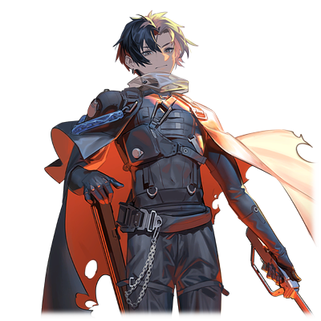

# 艾娃·多米南斯XII

| 角色信息   |          |
| ----------- | ----------- |
|名称|艾娃·多米南斯XII
|年龄|外表年龄22岁（最新型都市监督官）
|职业|佩尔修斯殖民地所属的监督官
|对应歌曲|To：Be Continued
|初出版本|Chunithm SUN

## Episode 1 一分为二的世界

>向身为创造主的我等发起反抗，还自称为革新者……看来有必要让他们明白自己的立场呢。

向机械种与归还种宣战，并且决定将他们赶尽杀绝的，真人强硬派的领导者——圣女拔示巴，引发了一场被后世称作“拔示巴战役”的大战。

被圣女所煽动，舍生忘死地发动进攻的真人大军，突破了机械种和机动兵器所设下的层层防线，很快就连身为机械种中枢的佩尔修斯殖民地也沦陷了。

真人也趁着这股气势，占领了佩尔修斯殖民地东部和东北部的几个城市，但却因为某件事，使得战况急转直下。

那就是圣女拔示巴的驾崩。

随着拔示巴驾崩的消息传遍了整个战场，真人们顿时失去了团结的能力，军队瞬间就溃散了。

结果，机械种再度夺回了佩尔修斯殖民地，势力图又一次发生了变化。

 

在拔示巴死后，作为机械种的上位存在，“系统”预测到未来很有可能出现继承圣女·拔示巴的人，于是便决定投入实装了新的思考回路的第十二代型机械种监督官。

 

而艾娃·多米南斯，正是“系统”所部署的，负责佩尔修斯殖民地的管理的，第十二代型的机械种监督官之一。

新官上任的她所做的第一件事，就是罢免力有未逮，未能阻止拔示巴的进攻的前监督官——艾萨克·多米南斯VIII。

在那之后，艾娃就以远程操作的形式，将佩尔修斯殖民地西边的殖民地一个又一个的停止运行。

殖民地已经不再是地上再生的关键了。艾娃认为，既然真人已经变成了这个世界的威胁，那么为了避免他们继续产生，关闭生产真人的人工子宫，才是上上之策。

虽然关闭这些殖民地的机能对于将这些都市作为巨大的演算装置而使用的Metaverse系统来说是一大损失，但是，如果不能将真人赶尽杀绝的话，那这系统也难以独善其身。

 

曾经，真人们分成了强硬派与稳健派，两边互相敌对，甚至也有人选择了与机械种一同战斗。但是，对于艾娃来说，他们之间没有任何差别。

虽然她并未对那些稳健派下杀手，但随着他们的寿命到达终点，他们也慢慢地从这个世界上消失不见——最终，稳健派也不复存在了。

由第十二世代型监督官所执行的真人灭绝计划。只有黑白分明的完美世界。

在那机械种所描绘的世界中，真正的和平能够降临吗？

## Episode 2 让人疯狂的存在

>是安稳地死去，还是痛苦的死去……至少，赐予你们选择的权利吧。

真人，说到底只是由身为创造主的系统所制造出来的，只为了地上的再生而制造出来的，恰到好处的产物而已。

被控制的思维，被抑制的感情，被缩短的寿命。

这些东西就像一道道枷锁，像是自然的法则一般刻在真人的身上。

但是，不知是不是命运的玩笑呢。

这加在真人身上的重重枷锁，竟然被真人自己一一破解。

——由名为觉醒者·巴西安的真人开始。

还有，继承了他的遗产的指导者·亚哈。

 

借由亚哈的研究，本来寿命极为短暂的真人，其寿命也被延长了几倍，甚至获得了如何再利用人工子宫的技术。

借由这些技术，本来应该慢慢迎来灭绝的真人，其数量却不减反增。

 

“对生的渴望让他们超越了极限吗……真人的感情，还真是不可小觑啊。”

 

冷静分析的艾娃，也想过使用机动兵器进行镇压。但是，在拔示巴战役过后，地上的环境已经被污染，外加上资源几近枯竭的现状，大动干戈的话，只会对归还种的生存环境造成危害。于是，她安排了另一种策略，让真人们自取灭亡。

那就是一条拒真人与千里之外的绝对防线。只要耗下去，真人必定会遭遇资源枯竭的危机，不得不发起另一场战争。

“就让我好好引导你们的‘感情’吧。”

“渴望”会让人的思考受限，“贫困”会让人的视野狭窄。

虽然感情的力量确实能促进进化，但是相应的，也非常容易掌控。

 

只要在佩尔修斯的西边，建立起一条从大陆西边延伸到东北的钢铁防线的话。

面对这明晃晃的高墙，想必那些真人的强硬派们肯定会坐不住，引发一场新的战争吧。

 

“我是不会跟艾萨克·多米南斯VIII一样重蹈覆辙的。不需要长久的战斗，只需要一场战争，就足以解决这一切。”

接着，艾娃进行的，是将佩尔修斯殖民地彻底改造为都市决战兵器的计划。

万一真人们攻入了佩尔修斯殖民地，也能利用兵器化的都市机构将他们一网打尽。

 

“已经攻破防线的他们，肯定会不顾一切地冲向中枢部吧。根本不会注意到自己正在缓缓走向自己的坟墓……”

 

艾娃触碰了一下投影于半空中的终端。

一片白色的司令室里，映照出被夕阳所照耀着的，银色的城市。

 

“就算这里沦陷了，也足够埋葬众多的真人。不管怎么反抗，他们也只有通往破灭一途。”

 

艾娃淡淡的说着，在空中划出一道弧线。

刻在右眼上的刻印，就像是在为将来的大战中即将死去的无数真人吊唁一般，闪烁着青白色的冷光。

## Episode 3 向着决战而去的世界

>重复这些无聊的琐事，是改变不了整个大局的。连这点都不理解，果然还是旧时代的型号呢……真是可悲。

自从圣女拔示巴死后，已经经过了十几年。

世界的局势，正向着艾娃所预测的那样变化着。

就在这期间，对艾娃的计划感到不满的艾萨克，决定自己率领游击队主动出击消灭真人。

但是，就算在前线杀死再多的真人，也不过只是激起小小的波澜罢了。

不管再怎么努力，终究是抵抗不了真人大军的无尽洪流。

 

然后，随着强硬派带着大军向防线发起了进攻，艾娃所预想的，终于变成了现实。

真人与机械种，在各自的意志和思绪的交锋之中，大战开始了。

为的，是获得在那决战的前方，那属于自己的未来。

* * *

在佩尔修斯殖民地的远东方向，康达尔殖民地外壳部的防壁处，一名女性正站在那里。

女人双手抱胸站在高处，眺望着远处正在飞行着的一队输送艇。

船头等间隔的灯光闪烁着的，是救援的信号。

待到飞船与殖民地取得联系后，知道事情的经过的女人小声地嘀咕了一下。

 

“看来风也强了不少啊……”

 

一阵大风袭来，吹得女人身上的黑色斗篷发出响亮的声音。

以前这条斗篷还大到足以覆盖整个身体。要是当时的自己的话，肯定会被这阵强风吹得东倒西歪的吧。

但是，现在的她已经今非昔比。

正像她那已经成长的身体，这条黑色的斗篷，已经与她十分合身了。

女人不经意地咧嘴露出了笑容。

 

“如果是那孩子的话，肯定没问题。所以，我也要完成我的使命才行。”

 

就在这时，一股更加强劲的风卷起了斗篷的头套。女人的视线转向了背后的康达尔殖民地的都市区域。

 

“虽然**保护我的人**已经不在了，但是那些孩子们还需要我的帮助。啊，放心吧！要是寂寞的时候，我也会稍微想起你的——”

 

从女人的口型中似乎能看到她在呼唤着谁的名字。

但是，这个名字也随着强烈的风声，消失在虚空之中。

 

“那么，我就先走了。”

 

刚才她还在的地方，就像从未有人来过一样，只有被阳光照耀着的闪闪发光的防壁。

但是，在某个角落，却留下了一朵顽强生存于此的白色小花。

## Episode 4 恶性程序

>不可能，我的计划，怎么可能有疏漏……

“终于见面了啊。艾娃·多米南斯。”

“——为什么真人会出现在这里？”

 

艾娃无法理解自己的面前究竟发生了什么。

不，她应该很清楚才对。

已经布下了重重机关，会有人出现这种情况的几率，应该无限接近于零才是。就算再怎么机缘巧合，也不可能会发生这种事情啊。

然而，这却是血淋淋的现实，也就是说，有人在艾娃的感知范围之外，布置了这么一手计划。

 

（竟然有人在我完美无缺的战略之上建立了战术应对吗！？）

 

当然，刚才出现在战场上的大型机动兵器也是不可忽视的不确定要素。

那骷髅形状的机动兵器的突破能力超出了想象。但是，自己还是有自信能够靠缜密的计划解决这意外的盘外招。

而事实就是，那些真人们自以为已经攻陷了佩尔修斯，就这么踏入了“哈莫尼亚”的攻击范围中，成为了音波兵器的牺牲品。

但是，现实却截然不同。

眼前的男人，突破了层层防线，甚至识破了“哈莫尼亚”的攻击，来到了这里。

 

“将整座都市当做兵器使用，确实是难得一见的奇策。但是，不管使用怎样的手段，只要有一丝破绽，那就毫无意义。”

“怎么可能？我等的防线，可是从来都没被突破过啊……”

“哼，越说就显得愈发愚蠢啊。‘从来都没有’？从前提上你就搞错了吧？”

“错了？不，这怎么可能……”

 