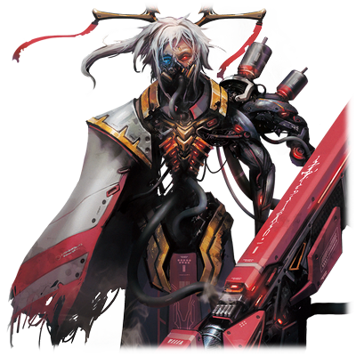

# 蕾娜·伊修梅尔

| 角色信息   |          |
| ----------- | ----------- |
|  名称 |蕾娜·伊修梅尔
|年龄 |16岁
|职业|从Metaverse归来的归还者
|对应乐曲|月詠に鳴る
|初出|Chunithm Paradise Lost|

## Episode 1 抉择的扳机

>这就是我所选择的道路。能够决定我们未来的，只有我们自己！

——能够为他人着想的心，以及些许的温柔……。

祈望着在这长久的积累的前方的未来，我——

沙。沙。仿佛拖着双脚般的脚步声正回响着。

拖着仿佛随时都会倒下的残破不堪的身体，亚哈将枪口对准了我。

“为了我等的理想……阻挡于我等之梦想前方的尔等……就由我在这里处分掉！”

“不会让你得逞的。因为，我已经和大家约好了。”

我握紧仍在颤抖着的小小的手枪，瞄准了亚哈。

——这一发子弹，就会断绝所有的憎恨。

面对被束缚于悲惨的过去，打算将我们毁灭的亚哈，这一发子弹，将是永别。

所以，我会按下扳机。

为的，是保护那些重要的人们。

为的，是与那些否定这一切的人们战斗。

即便到最后的最后，我也要抵抗下去！

我已经决定了！我已经选择了！

所以，我绝不会放弃！

“约拿、基德翁、米莉安姆——”

将大家的心意，集中于枪口中。

将那个被憎恨所支配的人贯穿！

能够决定我们的未来的人，只有我们自己！

## Episode 2 梦的终结

>曾经，外面的世界对我们来说，只是存在于童话中的存在。而现在，我终于能够踏上旅途，前往那个地方。

超大陆·艾玛格。

曾经包含着无数个世界的电子的乐园，在重组之后，合并成为了一个崭新的世界。而艾玛格正是这个崭新世界之中的一片大陆。

经过漫无止境的战争和冲突，人们终于跨越隔阂，最终携手并进，走上了和平共存之路。

而就像是回应着人们的意志一般，曾经出现于世界的角落的光之塔“复苏之门”，再次出现在他们面前。

现在，十二名少年少女，正在塔中踱步着。

脚步无比沉重，不论是谁都露出一副紧张的样子。

然而在这些人之中，只有蕾娜·伊修梅尔一人不同。她比任何人都期待着外面的世界，即便是现在，她的内心也务必雀跃。

一行人来到了大门面前。

敞开的大门之中，闪烁着耀眼的光之漩涡。

“当你们穿过了这前方的光，你们在这个世界所存有的身体就会消灭。”

“但与此同时，你们也会在真实的世界获得全新的身体。”

不知从何处传来了无机质一般的声音。

声音的来源，是已经化为基干系统的一部分的，乐园的管理者们。

十二名少年少女，大家都紧张地听着系统所说的内容。

对前往外面的世界无比期待的蕾娜，在看到那个光之门的时候，也露出了紧张的表情。

“不需要担忧，不需要恐惧。”

“当各位再次醒来的时候，迎接各位的，肯定是生机盎然的大地，以及清澈湛蓝的天空吧。”

被这句话所打动，他们一人，又一人地，触碰到了光之旋涡，从这个世界中消失了。

只剩下蕾娜一人了。蕾娜默默地点了点头，然后缓缓地向光伸出了手。

触碰到光的指尖变成了粒子，与光化为一体。然后——

“哎！”

心意已决的蕾娜，飞身跃入了光之中。

然后，在纯白色的光芒之中，意识逐渐模糊——

* * *
* * *

“——嗯，这里是？”

首先映入视野的，是上空正发出哗啦哗啦的声音，正在盘旋着的直升机。

“我好像……又梦见了那个梦的样子。”

在醒来的同时，她同时感觉到了自己身体的重力。

看来还需要一定时间才能习惯与曾经世界完全不同的感觉呢。

“哈啊……我到底是睡了多久啊……”

虽然没看到睡在身旁的约拿，不过从被窝中感觉到的些许温暖，证明着不久之前她还在这里。

就在蕾娜努力抑制着睡意的时候，突然，一阵好闻的香味传入了她的鼻孔。

“哇……好香啊……”

“蕾娜！差不多要吃早饭了哦？”

听到约拿的声音，蕾娜的意识终于清醒。

“嗯！我现在就过去！”

蕾娜披上自己的大衣，奔向了约拿所在的饭桌处。

## Episode 3 终有一日梦见的景象

>这个世界，现在还没有完全痊愈。不过，用这双眼睛亲自目睹这一切，还是有意义的。

当早饭结束之后，我前往了伊欧尼亚殖民地郊区的某个展望台。

沐浴着温和的阳光，听着小鸟的叫声，感觉身体都轻快了不少。

看着清澈蔚蓝的天空，我不禁想到了曾经在艾玛格见过的天空。到底是哪一边更蓝呢？

地面的感觉……看来还需要一些时间才能够习惯。

就在我漫步于这座城市之中感受着丰饶的自然景观的时候，从背后传来了一个声音。

“——喂！蕾娜！等等我啊！”

“啊，原来是基德翁啊。早上好！”

声音的主人，正是基德翁。

吃早饭的时候没看到他，难道是去训练了吗？

“啊啊，早上好……才怪啊。我们大早上发现你不在家里，姐姐可是焦急的跟热锅上的蚂蚁一样啊？”

“不好意思……我看外面的景色看入迷了，在屋子里怎么坐都坐不住，所以……“

“啊~~真是的。你都这么说了我还怎么说你啊？真是的，你也太纯真了吧？”

“……基德翁要不要一起散步呢？”

“要。肯定要啊！既然都这么说了，就让我给你介绍这座城市里的几处漂亮的景点吧！”

“基德翁，谢谢你！”

虽然基德翁笑着，但不知为何，他的脸却朝向一边，不愿和我面对面。

而且不知为何，总觉得他耳根有点发红。

在这之后，我就跟着基德翁，一起在伊欧尼亚殖民地的街上闲逛。

基德翁介绍的景点，基本上都是些只有住在当地很久的人才熟知的地方，不知不觉我们就逛了很久。

而最后，我们来到的，是城区外面的小山丘。在这片小山丘上，能够看到远处的大海，还有几座矗立在荒野上的高塔。

“我最喜欢这里的景色了。”

一望无际的荒野和大海。

那些未完成再生处理的地区，都可以从这座小山丘上一览无遗。

那座孤零零地矗立着的高塔，让我想起了在漫长的时间之中等待着自己的使命的，艾玛格的“复苏之门”。

当夕阳西下，高塔沐浴在晚霞之中的那副景象，令我心头一紧，久久难以离去。

过了许久，冷风吹过我的脸颊……。

“阿嚏！”

“没事吧？外头也很冷了，赶紧回家别着凉了啊。”

“嗯，是啊。今天多亏了你，我才能见到这么多的美景。谢谢你，基德翁！”

“嘿嘿，是吗？既然能得到你的认可，那也不枉费我当了一天导游啊。”

我们说笑着，踏上了归途。

我能够来到这个世界真的是太好了。

从此以后，也要将更多的景色，收入眼帘之中啊。

## Episode 4 细小的阳光

>即便我遇上了什么烦恼，止步不前，只要有他们俩在的话，就没问题。那份温暖……会支撑着我走下去。

在和基德翁一起回家的路上，我想起了基德翁的话。

——蕾娜你是怎么来到这个世界的？

虽然基德翁这么问了，但是我的记忆实际上也是模糊不清的。

关于艾玛格的记忆总有些含糊其事的部分，有时候甚至会突然冒出些我未曾经历过的事情。

所以，我无法确认，自己脑海中浮现的这些记忆，是否真的是自己的，是否真的是正确的。

我来到这个世界，究竟应该做些什么呢？我的目的究竟是什么呢？真的去到远东之地，又能够改变什么呢……？

“喂——蕾娜。怎么突然板着一副脸杵在原地啊？”

“啊……不好意思，基德翁。”

这么说着，基德翁重新回到了我的身旁。

“有啥烦恼的话，随时都可以跟我说的哦？毕竟我和约拿两人就是为了这个才会在这里的啊。”

“……嗯，我会的。”

我露出一个笑容回应到。基德翁把手扶在脸上，点了点头。

“对，对。果然蕾娜还是笑着的时候最棒了。我可要去跟约拿炫耀一番了哦！”

——嗯。

果然，只有我一个人钻牛角尖思考的话，是怎么也得不出答案的。

要是迷惘，或者找不到答案的时候，还是向基德翁和约拿他们直接请教吧。

在这之后，又经过了几天。

和约拿的母亲也熟络了不少，我就这样在他们家中度过了安稳的几天。

要是能这样跟大家继续生活下去的话，该有多好啊。

如果可以的话，真希望能够一直待在这里啊。

一直待在这片充满阳光的地方……

然而，分别的那一天，突然就到来了。

与这些迎接了我的稳健派敌对的另一批真人——强硬派“革新者”们，似乎正在策划一场针对这座城市的袭击战。

听约拿说，预测到此事的机械种的监督官们，似乎正在做将我转移到别的殖民地的准备的样子。

这个时候的我，还未能明白此事究竟是何等的重大。

## Episode 5 火海中的伊欧尼亚

>曾经憧憬着的都市，世界，都在一瞬间被火焰吞没。我所熟知的世界，就这么在我眼前粉碎，消散。

## Episode 6 绝不放手

>他们两人对我来说，都是不可替代的存在。所以，我现在能做的事情是……！

## Episode 7 第九音素临界加速装置

>我手上的这把被人赐予的手枪，这究竟意味着什么，现在的我还未能理解……

## Episode 8 带来死亡的男人

>希望就这样被轻易粉碎。约拿，基德翁，米莉安姆，希望你们都能平安无事……

## Episode 9 恶意的尖端

>呐，为什么不回应我！？再这样下去的话，基德翁就会死了！

##　Episode 10 憎恨之光

>难道说，我只是为了被人杀死才来到这个世界的吗？不，绝对不是这样！我来到这个世上的理由！来到这个世上的理由是！！

## Episode 11 虽然，仍旧只是微弱的光芒

>约好了。不管遇到什么样的困难，我都绝不会放弃。这就是我所选择的道路。