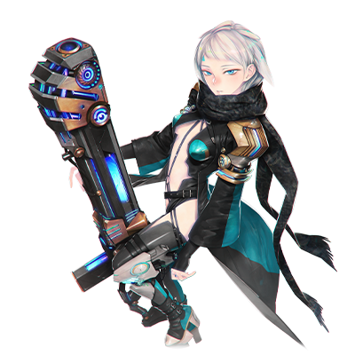

# 蕾亚·艾·弗拉达

| 角色信息   |          |
| ----------- | ----------- |
|  名称 |蕾亚·艾·弗拉达
|年龄 |容貌年龄20岁（制造后9年）
|职业|引导真人的圣女
|对应乐曲|夢と幻想の終点にて
|初出|Chunithm SUN PLUS

## Episode 1 圣女的悔恨

>没有人追求着我。他们所期望的是拔示巴大人，而不是我。

拔示巴·阿西德菲尔——刻在真人们的记忆深处的圣女。

我正是为了顶替她，为了填补失去了精神支柱的真人们，而被生下来的存在。

拔示巴对于我们这些被机械种当成即用即弃的工具的真人来说，是毋庸置疑的救星。

正因为有她的引导，即便她已经离去了十多年，她的名字仍旧保持着巨大的影响力。

 

今天，也是我顶着她的名号出现在公众面前的一天。

每当我开口，大家都会以拔示巴之名敬仰我。

每当我挥手，大家都会以拔示巴之名膜拜我。

但是，他们却并不知道拔示巴真正的模样。

真人的寿命很短。在拔示巴战役中，无数的同胞走上了战场，其中大部分的人死在战场上，而那些幸存者们也很快就因为寿终正寝，早早离开了人世。

也就是说，如果没有人能够正确地记录历史的话，那想要怎么改写都是可以的。

而这一切，全部都掌握在强硬派指导层的手中。

限制情报，为了粉饰太平而抬上神坛的理想圣女。只为了完成他们的愿望而被塑造出来的愿望象征。

这就是我——蕾亚·艾·弗拉达的工作。

 

……最初，我还为自己能够得到众人的敬仰而感到欣喜。

令我愈发想要扮演好众人眼中的圣女模样。

但是，每当我尝试着距离她越来越近的时候，我就感觉的到，我所理应模仿的圣女的模样与我的差距越来越大。

不同的地方，在于思想的差距。

我无论如何都想创造一个大家能够活下去的未来。

既不会让煽动那些无辜的人们前往死地送命，也不会轻易舍弃那些人。

但是，她所描绘的未来，却是空无一物的。

是的，空无一物。

不管是机械种，还是归还种，甚至是真人本身，对她来说都是毫无价值的东西。

……这令我感觉到恐惧。

打从心底里感觉到恐惧。

如果继续这样模仿着拔示巴大人的模样，说不定连我也会被其吞没的吧。

真的……这样就可以了吗？

## Episode 2 从痛苦之中诞生之物

>不知痛苦为何物的人的愿望无足轻重。这是我的创造主，赛罗大人留给我的一句话。

在一片黑暗之中，我听到了某人的声音。

 

“赛罗大人，您看这样如何？”

“……就当做是成功了吧。”

 

从左右两侧传来了声音，里面还混杂着“混合物”之类的我听不懂的词汇。

“……嗯…………”

“醒来了吗。”

 

睁开眼睛，夺目的强光向我袭来。我能用眼睛确认到的，只有几个黑块。

 

“……”

“反应也很正常，应该能够完成相应的任务吧。”

“这、里、是……我、是……？”

 

等到我的眼睛习惯了光亮后，我才注意到这些黑块是人的身影。在一群穿着白大褂的男人中，只有一个人穿着全身黑色的衣服。

那个黑色衣服的男人说到。

“蕾亚。这就是你的名字。”

“蕾亚……我是，蕾亚……”

“意识的固定化也也没什么问题。”

“进入下一个阶段。”

“我明白了。”

 

随着黑色衣服的男人一声令下，那些白大褂的人们把某个东西带到了我的头上，而我的身上也被接上了什么东西。

我不知道接下来将要发生什么 ，就算质问，也没有人回答。

 

“蕾亚，你在无数的素体之中被我们选中了。你将作为引导真人的圣女被人崇敬，被人传颂。就像曾经的拔示巴大人为我们带来了希望一般，你也要成为我们真人的希望的象征。”

 

圣女？希望？这到底在说什么？

 

“想要成为圣女的话，那就必须要有足够打动民众的‘愿望’才行。只有从内心深处产生的愿望，才能够形成足以震撼人心的话语。但是……这些是不能从空无一物的地方产生的。”

 

突然，周围响起了噼里啪啦的声音。

 

“愿望这种东西，是要从痛苦和绝望之中诞生的。”

“启动。”

 

——啪呲。一道惊雷闪过我的脑海。

在那瞬间，无数我未曾见过的光景，在我的脑海中鲜明地回放出来。

 

“啊啊——————”

 

眼前飞速变换着的世界，正以极快的速度“改写”着我。

* * *

“艾斯特尔·亚戈鲁修，你就负责照料‘这个’吧。”

 

在我结束了研究所的思维调整工作后，我就被那个黑色衣服的男人——赛罗带了出来，与眼前这位紫色头发的，长得十分漂亮的女性见面了。

 

“蕾亚，你在干什么？”

“……”

“赛罗大人，这到底是……”

“这是利用拔示巴大人的胚胎做出来的产物。”

“这……”

“之前我也说过了，我也将不久于人世。在我死后，强硬派将会迎来新的体制。而你的工作，就是将她培养成能够引导强硬派的存在。”

 

赛罗的话语令对面的那名女性露出了疑惑的表情。

 

“区区一名卫士的我……真的能够担当这样的重任吗？”

“你可是亚戈鲁修家的人。如果说是作为圣女的侍从的话，在真人之中应该是无出其右的一族吧？”

“我明白了。我艾斯特尔，必将效犬马之劳，将蕾亚大人养育成才！”

“甚好。”

 

说完，赛罗大人就回到了自己的研究室。

艾斯特尔似乎想追上去的样子，但很快她就回到了我的面前，然后单膝跪了下来。

 

“我们走吧，蕾亚大人。”

 

这一行为令我无法理解，我只能观察着眼前的状况。

就在艾斯特尔准备向我的头伸出手的时候，我突然感觉到了一股恐惧，回过神来，我已经狠狠地咬住了她的手。

我到底在干什么呢？

明明自己都不明白自己在做什么，明明脑子里都觉得应该松开比较好，但身体就是不听使唤。

突然，我感觉自己的双脚离开了地面。

 

“——！？”
 

原来是我被她抱了起来。

虽然艾斯特尔好像说了什么话的样子，但不知该作何反应的我，只能紧紧地抱着她。

不知是不是看到我的反应觉得有趣呢，艾斯特尔轻声笑了出来。

接着艾斯特尔试图摸一摸我的头发——结果我又自然地抵触了她的互动。

 

“……呵呵，说不定会比锻炼新兵还要棘手的多呢。”

 

即便我做了这么过分的事情，她也能够笑着原谅我。

仅仅是这一点，就让我的心中感觉到了一点暖流。

这就是我人生中第一次感觉到的，来自他人的温暖。

一直生存于苦痛和黑暗之中的我。

终于迎来了那道属于她的光芒。

## Episode 3 血之宿命

>索罗·莫尼亚……他的存在，应该会大幅改变真人这一种群的未来吧。绝对不能让他死了。

我有一个比我稍早出生的，像是兄长一样的人物。他的名字叫沃特。我们诞生于同一个实验室，也同样被分配了引导强硬派的职责。

和我作为圣女通过演说提振士气不同，身为宰相的沃特则是以各种手段彰显强硬派的实力，从而推动战争的步伐——我们俩就是为了推动战争而设计出来的存在。

不过，就算我很清楚这一切都是赛罗大人的安排，但是只要稍微偏离了一点轨道的话，我们就会被立刻替换掉的吧。

会让我这么想的缘故，还是因为赛罗大人偶尔挂在嘴边的，一个叫“索罗·莫尼亚”的真人。

据说，他是继承了拔示巴大人的大部分血统的孩子。

所以每当我们做错了什么事，赛罗大人就会提起那个人的名字。

索罗是名正言顺的后继者。

你们只是一无是处的失败品罢了。

每当赛罗斥责沃特一次，沃特对索罗的憎恨就更深一分。

但我并没有沃特那样的憎恨。我只是好奇，在赛罗口中常常提到的那个孩子，究竟是怎样的人呢？

而等到我真正跟他见面的时候，已经是赛罗死后，强硬派的体制已经今非昔比之后的事情了。

* * *

“——欢迎来到奥林匹亚斯。未能前来迎接，非常抱歉。”

 

在凯南的带领下，在侍从·泽法的陪同下，那名少年来到了奥林匹亚斯殖民地。

那名少年，正是索罗·莫尼亚。

拔示巴的子嗣，同时也是名正言顺的，真人的王子。

明明索罗比我和沃特出生的要早，看起来却比我们还年轻。

这就证明了他是像那些旧人类种那样，是从幼年时期经历时间的流逝才慢慢成长起来的。

而这一点，已经足够刺激沃特的逆鳞了。

现在的他，正站在我旁边，露出一副随时都会爆发的表情，狠狠地攥着拳头。

不知是不是索罗也感觉到了这股怨气了呢，突然，索罗一个重心不稳，倒向了泽法的方向。

 

“索罗！？”

“哎呀，索罗看起来好像很累的样子呢？今天就在这里好好休息吧。”

“啊……谢谢圣女大人的关心。”

“那么，让我带二位前去房间吧。跟我来——”

“喂，那边那个女人，对，就是你。”

 

站在泽法两人身后的凯南的话，被沃特直接打断了。

 

“沃特大人，请问有何吩咐呢？”

“之后到我房间来。”

“我……吗？”

“走吧，泽法。你要这么放着索罗大人到什么时候？”

“啊……蕾亚大人，沃特大人，我就先告退了……”

 

我连远去的三人都没细看，直接质问了沃特。

 

“沃特，她可是凯南的部下。就算你是宰相也不能——”

“哼，我只是有想确认的事情罢了。”

“难道是什么难以启齿的事情吗？为什么那么在意她？”

“闭嘴！对我来说这很重要！”

 

呵斥了一番后，沃特扬长而去。

在那之后不久，我就收到了消息，索罗带着泽法从奥林匹亚斯人间蒸发了。

## Episode 4 无法填补的沟壑

>我的话语无法传达到沃特那里……果然我也不过就是拔示巴大人的模仿者吗……

得知索罗的事情后，我立刻来到了沃特那里。

 

“沃特？这到底是怎么回事！？”

 

来到办公室，沃特只是靠在椅子上，用轻蔑的眼神望着我。

 

“……哼，有何贵干？”

“那还用问吗？索罗可是不见了啊！果然，你是因为泽法和索罗在一起的缘故——”

“闭嘴！不要再跟我提那个名字！”

 

就像是被什么刺激到了一样，沃特怒不可遏，气的直接把桌子上的东西翻了个底朝天。头发散乱，目露凶光。

 

“不管哪个家伙，嘴里挂着的，都是索罗！索罗！索罗！那种小屁孩，到底何德何能足以替代我啊！明明怎么看都是我更加优秀啊！！”

“沃特……”

 

这缠绕在沃特身上的诅咒，正愈演愈烈。

不但如此，甚至让他的憎恨之火，愈发旺盛。再这样下去的话，甚至连他自己都会迷失的吧。

说真的，我也没想到竟然会他逼到这个地步。

 

“可恶啊啊啊！！那个家伙正在一点一点抢走我的东西！”

“那、那个……还是稍微冷静一下吧？我哪里都不会去的……”

 

我试图让沃特冷静下来，于是我伸出自己的手与他的手相合。

 

“不要随便碰我的手！你以为模仿母亲大人的行为，就能够让我消气吗！？你这个冒牌货！！”

 

没想到我的行为竟然反过来激怒了沃特，下一秒，他的拳头就挥了过来。

 

“……！”

 

我下意识地闭上了眼睛。

没事的。我已经习惯了疼痛。

如果这样就能够让沃特稍微好受一点的话，这样也无所谓。

……然而，沃特的拳头却没有打到我的身上。

 

“必须尽快派人去追他们。”

“咦？那就是说……！”

“必须尽快确认他们的所在位置，然后派出舰队。万一那些家伙闯进机械种的战斗区域那就更该如此了。”

“太好了，这样的话两人应该就安全了吧——”

“啊啊，这样的话他们说不定就会**死在战场上**了呢。就算是再身经百战的人，只要有一个闪失，下一刻就是粉身碎骨了。更不用说一边保护着人一边战斗的情况，说不定一发流弹就能送他们上西天呢……”

 

沃特笑得咧起了嘴角。

 

“难、难道说……你要提早开战吗！？不会让你这么做的！”

“你到底是哪边的人啊！！”

 

大喊着，沃特掏出了终端呼叫了某个地方。

然后，我就听到了敲门声。

 

“直到下次军事会议之前，你就给我乖乖呆在房间里吧。要是有什么事情的话由卫士帮你代劳就是。”

 

就在我还想上前阻止沃特的时候，卫士们把我围了起来。

 

“正好。蕾亚，你就好好趁这段时间重新确认下你自己的职责，究竟是什么吧……”

“沃特，等一下……！”

 

我的声音再也传不到他的耳中了。

 

“……”

 

我跪倒在地上。

是啊……我是这么的无用。我的话语……终究是无法传达到别人的心中的吧……

 

“呵呵……冒牌货……吗……”

 

我也终究只是个替代本体的替身吧。

啊啊，这是何等空虚的事实……

## Episode 5 银色之都沉入火海

>我的话语……究竟是何等的轻薄啊。
佩尔修斯殖民地的二次进攻，就这么在沃特的强推之下，一致通过。

正式的通知业已下达，奥林匹亚斯也渐渐地进入了战时状态。

在情报被统一管理的都市中，无人敢提出反对的意见。

整座城市，渐渐只剩下那些负责警卫的卫士在街上踱步。

站在“荷莱亚”的上层房间眺望着进入备战状态的都市，就连我都能感觉得到，战争很快就要到来了。

 

“……如果我是真正的拔示巴大人的话，会不会选择不战之道呢……”

 

现在的我，只能扮演成圣女拔示巴的模样，向那些即将被送往前线的应征兵们发表演说。

不知边境都市是不是情报的管理更加严峻了呢，甚至有人只是见到我就禁不住地流下了眼泪。

每当我开口，大家都会以拔示巴之名敬仰我。

每当我挥手，大家都会以拔示巴之名膜拜我。

随着我愈发目睹这样的光景，我就愈发感觉到，自己的心正越来越冰冷，距离那些人们越来越远。

以前那些充满了激情和热血的话语，现在却变得无比空虚冰冷。

我已经不再是那个沉浸于扮演拔示巴的自己了。

在那之后不久，与机械种的战斗打响了。

凯南率领的先遣队，攻向了机械种展开的防卫线。

开弓没有回头箭。

这，肯定是一场有去无回的战争。

我也只能在心里默默祈祷着，就算多一个人也好，只要能够平安回来就行。

* * *

随着战线向东移动，我也和沃特一同从后方的阵地向着佩尔修斯殖民地推进。

就在战局略显不利的时候，随着萨尔贡准备好的机械兵器投入了战场，局势瞬间发生了变化。

举世无双的力量将机械种的机动兵器悉数破坏，成功地突破了防卫线。而真人的进军也势如破竹——就这样长驱直入，冲入了佩尔修斯殖民地。

只要能够占领殖民地的话，应该就不会再有人死去了吧——

然而，迎接我们的，却是无数丧命于都市之中的真人们的尸骸。

那些冲入城市的士兵们，被隐藏在都市中的战略兵器仅凭一击全灭了。

## Episode 6 无法传达的想法

>但愿我的预感不会成真吧。拜托了，一定要平安归来啊……
让部队暂时后退之后，我和沃特为了讨论是否要再次进入佩尔修斯殖民地，展开了激烈的讨论。

 

“该死！！为什么不继续发动进攻啊！！从殖民地内的动力反应看，那个东西怎么看都不是能够连续发动的东西吧！赶紧让部队冲进去才是上策啊！”

“可是，我们要是连后方部队都没了的话，那战线就无法再维持了。说不定我们真人就会这么灭绝的吧……还是冷静一点。”

“我现在很冷静！现在的我，是基于目前的状况进行判断的，跟感情用事的你相比，到底谁才是对的还用说吗！”

 

沃特之所以会这么急是有原因的。

因为先行进入佩尔修斯殖民地的凯南和萨尔贡两人，目前生死不明。

 

“如果不赶紧组织部队进入的话，我们就再也没有机会攻下那个殖民地了！这里可是战场，只要迟疑了一秒，等待我们的就是满盘皆输！你为什么还不明白！？”

“所以我们才需要更加谨慎才行。现在的你怎么看都不是能冷静——”

“你难道要说，我的判断是错的吗！！”

“……那不就是吗！”

“你这家伙！！”

 

……要是能有让沃特满意的方法就好了。

就在这时，沃特的终端传来了什么人的声音。

 

“咦咦咦！对不起对不起对不起！”

“……啊啊！？给我等一下。谁站在那里！”

看起来似乎是有人迷路撞进了沃特的房间了。

从远处可以听到沃特向卫士下达指示的声音，还有一个跟这严峻的空气毫不相称的女性的声音。

“……久等了。关于突入的部队，我想到了一个绝佳的<ruby>人选<rp>（</rp><rt>棋子</rt><rp>）</rp></ruby>。”

“<ruby>人选<rp>（</rp><rt>棋子</rt><rp>）</rp></ruby>？”

“萨尔贡手下那个副官。如果是那个忠实的副官，听到自己的长官有危险，肯定会自告奋勇地前去打头阵的吧。”

 

另外，沃特还指定了一队在突入佩尔修斯殖民地的时候来迟了的后方部队一同前往。在那队伍之中，刚好有一队从属于我这里的**小队**。

 

“这样人数就凑齐了。就算他们被全部消灭，损失也不大。这样你就没意见了吧？”

“啊啊……就这样吧。”

 

——在我和沃特的这场讨论过后不久。

再次突入殖民地的部队成功确认了萨尔贡的生还，并且获得了某项重要的情报。

那就是原本消息不明的凯南，实际上是带着佩尔修斯殖民地的监督官，艾娃离开了这里。

凯南·梅尔维亚斯是在指导层中最为沉着冷静的人物，他在士兵中的威望也很高。

实在想不到他要如此以身犯险，远走高飞的理由。

而且，凯南要前往的地方正是——萨马拉坎达殖民地。

那里是圣女拔示巴的军队最后攻陷的都市。在她死后，那座都市就被遗弃在那里。

就连知道这个都市的存在的人也就只有我和沃特而已。

为什么凯南会带着机械种前往那里？他到底要做什么？如果想要知道答案的话，也只能亲自去问了。

沃特立刻就做出了决定——追击凯南。

 

“沃特，无论如何都要去吗？”

“我早就说过了。能够实现母亲大人的愿望的，只有我。要是有人妨碍我的话，无论是谁我都不会放过。”

 

只要确定了一件事，就绝对不会放弃。

虽然我觉得这也是沃特的一个优点，但是这次未免太过感情用事了。

 

“沃特是想实现母亲大人的愿望才会这么努力对吧？那要是沃特所做的事情让我们距离那个愿望渐行渐远，那也可以吗？”

“有何不可？那些叛徒们没有那个资格。消灭机械种与归还种，让真人繁荣昌盛可是我的使命啊。”

 

沃特所做的一切，都是为了拔示巴。

完成母亲未竟的愿望，从而报答死去的母亲，得到她的认同。

正是这个想法，才支撑着他带领强硬派走到了这一步。

但是，我却有一件事情放不下心。

 

“我说，沃特……如果母亲的愿望和沃特所想的完全不同的话，你会怎么做？”

“你在说什么？”

“我一直都在研究着母亲大人的想法。我认为，母亲大人其实并没有期望着真人的繁荣。”

 

不知何时开始，我会在梦境中见到拔示巴大人的梦。

在梦中的她，似乎正憎恨着这个世界。

在我通过影像资料进行取证的时候，也可以从她脸上的微表情查知一二。

她一直都在为了消灭机械种和归还种而战。如果她没有病倒的话，说不定此时此刻，地上早就是再无生物生存的荒芜大地了吧。

 

“你这可是大不敬啊！就算你再怎么说，继续这样歪曲母亲大人的话语的话——”

“我的愿望只有一个，那就是让真人这一种群不至于灭绝……你应该也是同样的想法吧？所以，如果母亲大人的真正想法是毁灭的话……我会毫不犹豫地选择那条繁荣之道。”

“……哼。”

 

追击部队已经集结完毕。沃特和萨尔贡一并启程，踏上了前往萨马拉坎达的旅途。

 

“……”

 

我望着远去的飞船。

这也不是第一次与沃特有冲突了。虽然基本上都是以我的失败告终，但我认为，我们的愿望的本质其实是一样的。

所以，如果前往了萨马拉坎达的沃特，发现自己所坚持的梦想都被无情粉碎的话——。

那时候的沃特又会变成怎样呢？

 

“一定要平安归来啊，沃特……”

 

我也只能这么祈祷着。

然而，这就是我和沃特最后的对话。

## Episode 7 知晓痛苦之人

>这是何等澄澈的心灵啊……！要是有她那样的人的话，说不定我们就能够走上不同的道路吧。

就在沃特等人前往萨马拉坎达的途中，我们也在后方进行着佩尔修斯殖民地的修复工作。

由于大部分的都市系统都需要监督官的权限才能使用，所以需要一些时间才能破解。

而且，留在这里的部队也不多。

所以，在那些从奥林匹亚斯赶来的后续部队到来之前，如果有机械种的部队从其他的殖民地打过来的话，我们将会陷入孤立无援的境地。

 

这里，就是我们的生命线。

如果这里被敌人夺回的话，我们真人将再无希望。

只有这点，我无论如何都必须避免。

如果想要稳妥地回避灭亡的命运的话，就算要牺牲我的生命，我也甘愿付出，甘愿为了真人的未来而付出。

……当然，我也知道，事情绝对不可能简单到，仅凭我的一条命就想让这场战争平息什么的。

但是，如果献出这条虚有其表的圣女的生命，就能够让真人活得更久的话，那要多少有多少。

 

——然而，做出决定的那个时刻，就这样唐突地到来了。

 

“——艾斯特尔大人！”

 

突然，我们接到了正在殖民地的外围部警戒巡逻的士兵的紧急联络。

 

“发生什么事了？”

“佩尔修斯殖民地以东的方向，发现敌人的势力反应！那些东西……是机械种的战斗艇！”

“数量呢？”

“看起来还没到十艘的样子，凭现在的战力还是能够应付的……但是他们只是展开了宽广的阵型，完全不知道他们的目的——”

“喂，怎么了？”

“有、有一艘船，正向这里飞来！”

正如士兵所说，屏幕上显示出来的，是一艘银色的飞船。

 

“艾斯特尔大人，那艘船发出了公共广播通讯！”

“我们这边来处理，你们继续盯着那艘飞船。”

“明白！”

 

艾斯特尔拿起了自己的终端向对方讲话。

 

“我是真人军的指挥官，艾斯特尔·亚戈鲁修。佩尔修斯殖民地已经是我们的囊中之物。根据你们的行动，我们有可能会发动攻击。你们有什么目的？再重复一遍，你们有什么目的？”

“……。”

 

对方似乎有些紧张的样子。

机械种是不会有这样的反应的。那么，在那艘船上的就是……

 

“我是蕾娜·伊修梅尔。是第一名降临于这片大地的归还种。我并没有战斗的意思。当然，我也可以保证，后面的船不会发动攻击。但是，这也仅限于……我们的船并没有受到攻击的情况。”

 

对方说出了“归还种”三个字。对于我和艾斯特尔来说，这也是第一次与归还种面对面交流。在不知道对方样貌的情况下，唯一能够判断的，就只有对方的声音了。

她的声音虽然还有些紧张，但却能从中感觉到一种清亮，澄澈的感觉。

真挚而稳重。这就是我们对她的第一印象。

 

“那么，你们有何贵干？”

“我想要和你们这边的领导者商讨一下。为的，是能够一同走向未来。”

“……”

 

艾斯特尔的表情似乎舒缓了一些。

而我在听到她的这些话的时候，我的内心也不禁雀跃起来。

如果是她的话，说不定真的能够创造出一条战争以外的道路呢。

 

“如果你们还不肯相信的话，就请让我停靠于此吧。这样，我就是你们的人质了。”

“你们也该知道，这里是敌人的领地吧？明明前几天才杀了个你死我活，现在还做出这样的举动，这是认真的吗？”

“如果要让对方相信的话，就要先从相信对方开始。要是不这样的话……那憎恨的连锁是绝对无法停息的。”

“哼……还真是充满自信啊。”

 

艾斯特尔把目光投向了我，似乎是想让我来决定。

我轻轻地点了点头，从她手上接过了终端，回答到。

 

“这一切，真的只是偶然吗？”

“你是……？”

“我是蕾亚·艾·弗拉达。我就是你想找的领导者。我也想与您这样的人进行会谈。”

 

就这样，我们将归还种——蕾娜·伊修梅尔迎入了都市之中。

* *  *

在艾斯特尔的引导之下，银色的飞船在一处开阔的地方降落了。走近一看，才发现这艘飞船到底是何等的小巧。

“这已经是几个世代以前的型号了吧……看得出真的很珍惜这艘船呢。”

“我查阅了以前留下来的记录，那艘船曾经载着她逃过了无数的强硬派的袭击，最终将她送到了佩尔修斯殖民地。那艘船对她来说应该就是她的希望吧。话又说回来——”

 

艾斯特尔转过话头，露出了严峻的表情。她的视线投向的，是那些正躲在构造体的阴影处，随时观察着情况的士兵们。

 

“艾斯特尔，这是怎么回事？”

“……这只是以防万一。因为她手上的武器，就是曾经将大半个伊欧尼亚殖民地给破坏掉的致命武器。为最坏的情况做考虑，也是身为蕾亚大人的侍女必须做的事情。”

 

看来艾斯特尔似乎对她非常警戒的样子。

虽然表情十分平静，但是手却始终放在腰间的武器边，随时准备应对可能的突发情况。

 

“我不想以这样危险的状态迎接她。”

“当然，我也让大家在判断没有危险的情况下，绝对不要出手了。而且，我认为，蕾娜·伊修梅尔应该也想到了我们这边会这么‘迎接’她了吧。”

“可是……”

 

就在这时，银色的飞船舱门打开了。

从中出现的，是穿着一件像是斗篷一样的宽大夹克的女性。一头银色的长发随着她的步伐轻轻摇曳着，给人一股神秘的感觉。

 

“您就是蕾娜·伊修梅尔是吧？”

“是的……初次见面。”

 

从这副紧张的样子来看，她应该还不习惯这种交涉的场合吧。不过，她确实是我所想的那种人。

我们在互相介绍之后，我介绍了站在我后面的艾斯特尔。

在开始会谈之前，蕾娜首先说了起来。

她说，她们所在的舰队，现在正在佩尔修斯殖民地以东的坎达尔殖民地构筑防卫线。

但是她听说真人的大部队带着机动兵器往北进发，所以为了确认这里的情况，才带着几艘船来到了这里。

 

“我不想和你们交战。”

 

蕾娜的视线投向了那些死于佩尔修斯殖民地的人们的尸体。

 

“虽然这种事情由我来说不太合适，但是，无论如何都不能让双方继续这样永无止境地厮杀下去了。”

 

蕾娜低着头，从她的眼角能够看到泪光。

竟然为了他人，甚至是身为敌人的真人流下眼泪。这是何等真挚的人啊。

 

“看来您是会为了他人而流眼泪的人呢。我已经明白了，您是为了我们着想才会这么做的对吧。能够如此表态，我已经很高兴了。”

“啊，不好意思……我明明是作为归还种的代表来到这里的，没想到献丑了。”

“不，已经很了不起了。而且，我也不希望出现更多的死者了。我可以确信，我们的方针是一致的。”

 

我向蕾娜介绍了我们现在的处境。

 

“我是现在强硬派的领导层之一不假。不过如果现在仅凭我的独断做决定的话，肯定会引来内部的反弹。所以我有一个提案……直到我们这边统一意见之前，能不能暂时把这里当作我们的领地呢？”

 

我知道，这是十分任性的要求。

但是，为了让真人能够存续，通往未来，我无论如何都要保住这座殖民地。

 

“那么，这样如何？”

“咦？”

“要不要和我一起担任这座殖民地的代表，也就是监督官呢？”

“监督官？我吗？”

“我也是有点权限可以做自己喜欢的事情的。就让真人和归还种同时统治这里吧。而且有我在的话，蕾亚小姐想传达些什么意见也会方便不少的吧？”

 

她打算将与我共同管理佩尔修斯殖民地这件事包装成收复失地进行宣传，并且以此功绩作为管理这里的名分。

 

“为什么……为什么要做到这个地步？明明身为归还种，为何还要为我们如此着想？”

“因为我现在能够站在这里，都是多亏了那些支撑着我，推动着我前进的真人们。所以，这是我对他们的回报。”

 

这么说着，蕾娜望向了远处的天空，露出稍显寂寥的笑容。

 

“啊——”

 

忧虑，悲伤，慈悲。还有希望。

那所有的感情，全部凝聚在蕾娜·伊修梅尔的身上。

代替已经惊讶到说不出话的我，艾斯特尔说到。

 

“看来，您已经成功地斩断了仇恨的连锁呢。”

“啊哈哈，是这样的吧……要真是这样就好了……因为我只是**一直都在沉睡着**而已。”

 

蕾娜露出了个有些困惑的笑容。

 

“看来……我还不够成熟呢。我也能够成为像她那样的人吗？”

“如果是蕾亚大人的话，肯定可以的。因为您也是明白痛苦为何物的人。”

“艾斯特尔……”

 

接着，艾斯特尔就向周围正在待机的士兵们下达了解除武装的手势。

看着这样的光景，我心里悬着的大石头，终于落地了。

虽然已经说了这么多，但是接下来跟蕾娜的会谈，才是真正的开始。

 

“蕾娜·伊修梅尔，请让我们一同探讨和平共处应做的事情吧。请跟我们一起去塔中——”

 

就在这时，从刚才还是一片死寂的银色都市，突然响起了尖锐的声音。

 

“这，这到底是……艾斯特尔！？”

“怎么整个城市突然就动起来了？赶紧前去避难——！”

**“——吧。将一切都毁灭吧。将我们最大的敌人——”**

 

随着声音的响起，一个巨大的拔示巴的立体影像出现在了佩尔修斯殖民地的上空。

## Episode 8 圣女应行之道

>我们的共同点还有很多。所以能够一同学习，一同成长。就让我们一同走向明天吧。

**“毁灭吧，将一切——都毁灭吧。将我们最大的敌人——”**

 

浮现在空中的立体影像，就像是将无数个拔示巴的画像拼接起来一样，给人一种不舒服的感觉。

随着她不停重复着话语，画面就一次又一次地闪过红光。

那画面，正是我曾经在梦里见过的她的模样。

只是看着就会愈发不安。

……不能再这样下去了。

如果那些待机中的士兵听信了这影像的唆使开枪射杀了蕾娜·伊修梅尔的话，那到时候就会演变成无法回避的大型战争了。

不能被那种影像迷惑。

蕾亚，好好思考思考下现在有什么能做的事情！

想想看，手无寸铁，没有战斗的能力的我能够做到的事情！

就在我环视周围的时候，艾斯特尔映入了我的眼帘。她的手已经伸向了腰间的枪——

 

“艾斯特尔！”

 

明白了我的意思之后，艾斯特尔把枪扔了过来。

我接住了枪，向着城市的上空按下了扳机。

随着弹丸划过，浮现在空中的圣女的影像也应声碎裂。

 

“请听一听我的想法吧！”

 

我用尽全力，向着周围的士兵们大喊着。

不再是作为扮演着圣女拔示巴的“蕾亚”，而是作为引导真人的“蕾亚·艾·弗拉达”而存在！

 

“——各位，请好好地倾听一下！”

 

明白我要做什么的艾斯特尔，立刻就向士兵们发出了指示。

 

“曾经有人这么说过。‘愿望这种东西，是要从痛苦和绝望之中诞生的。’ 而我们这些在残酷的环境中生存着，并且一代一代地继承下去的真人的历史，可以说是充满着痛苦和绝望了。光是总结我们过去所经历过的无数不公，苦痛，遭遇，估计早就有人放弃了追求和平的心了吧。说不定也会有人觉得，只要将所有的敌人都消灭，就能够迎来实现愿望的那天吧。但是……这一切的结果，现在就血淋淋地展示在我们的面前。”

 

我的手指指向了某个地方。那里躺着的，是无数被战略兵器夺取性命的同胞们的尸体。

 

“……这非常的痛苦。简直是万箭穿心一般的痛苦。然而，明明知晓这份痛苦，我却连这些牺牲了的同胞的名字都未曾知晓。只是想到这点……我就深刻地感觉到自己是何等地不成熟啊！诸位好好地思考一下，即便你们今天跨越了同胞们的牺牲，明天也要重演这样的悲剧吗？重演着‘下次一定会赢’，‘下次一定能够打倒’，‘下次一定能够将一切毁灭’的循环吗？即便明天后天，再也没有人站在你们的身边，你们也要这样战斗下去吗？”

 

无数的想法，从我的口中传出。

没有任何力量，谁都拯救不了的我。如此人微言轻的我，说不定说再多都是没有用的。但是，我还是要说出来。

 

“我和那名归还种的女性以话语进行了交流，互相获得了理解。战争的时代，已经是时候结束了！而为了能够这么做，我们必须学会互相体谅，共同向着未来前进才是！我们的双手，应该不只是为了握着武器而存在的啊！”

 

我指向旁边的一个士兵。

 

“你的名字是？”

“咦？说、说我吗？我是戈里齐亚殖民地的阿伽特！”

“哦，跟艾斯特尔是同乡啊。那么我问你，面对跟我抱持着同样想法的归还种的她，你会举起枪口吗？”

“……不，那个，我就……”

 

他已经答不上来了。

不过这样就足够了。只要他愿意倾听我的话，愿意直面自己内心的想法这就够了。

 

“那么，那边的那位呢？”

 

被我问到的，是一名看着年龄甚小的女兵。

她看来也是被征召，来到这里的。

 

“我，我……我不想战斗。我想回家！我想回到大家所在的那片城区……！我已经不想看到那些同伴们遇到那样的事情了！”

 

以这个声音为起始，越来越多的人开始赞同那个女兵的想法，声音由细小变为宏大，渐渐的包围了整个场地。

一切都在向好的方向发展。然而就在这时，一个响亮的声音从角落传了出来。

 

“少开玩笑了！那些家伙可是把我们整的多惨啊！竟然还说要和平相处，这怎么做的到啊！”

“你会这么想也是很正常的。就像你说的那样，在这个场合，选择平和的解决方法，就要比武力的方式要困难得多。但是……”

“为了真人的理想能够存续！这个归还种，必须死在这里！”

 

男人向我举起了枪。

 

“蕾亚大人，快退下！”

“该退下的是你们！现在的我，是作为率领着真人的领导者，与他进行对话而已！”

“我、我明白了。”

 

艾斯特尔不再多说什么，只是将蕾娜挡在自己身后，与男人拉开了距离。

 

“那么让我们继续说吧。可以吗？”

“啊啊，好的……”

“你所说的的确有你的道理。但是，我们也同样对她的同胞们做了一样的事情。”

 

这么说着，我慢慢地走向能够看到男人的眼睛的地方。

 

“然而，仅仅只是像阴差阳错一般不停持续下去的复仇的连锁，却被她亲手斩断。所以她才会来到这里。为了与我们共存的明天来到这里！”

 

随着我向前一步，男人也后退一步。随着这一进一退，我们的周围已经围满了许多士兵。

 

“别、别过来！”

“只要一点时间就行了。我——”

“不是说了不要过来了吗！！”

 

砰——！

 

“——！”

 

男人的枪发出了一道火光。

弹丸从我的右脚边划过，贯穿了地面。

 

“蕾亚大人！” “蕾亚小姐！？”

“没事！我没事的！”

 

我向着那个已经被周围的士兵们按住的男人，平静地说到。

 

“我的选择到底对不对，就由之后的历史来作判断吧。如果这样的结果你都不满意的话。那么那个时候，就请你拿起武器，向我开火吧。”

“……！……恕、恕我得罪了……”

 

那名士兵再也没有反对的意见了。

回过头来，那些反对的人们也早已将手指从扳机上移开，和其他的士兵们一样，向我单膝跪了下来。

这是只能被当作圣女拔示巴的模仿品的我的小小愿望。

只是人微言轻的我所能说出的一家之言。

然而这些话语，确实传达到了大家的心中。

 

“蕾亚大人的想法，确实已经传达到大家的心中了。”

 

回头望去，艾斯特尔和蕾娜走了过来。

 

“蕾娜·伊修梅尔。你愿意和我一同向着未来前进吗？”

“嗯。就让我们一同改变未来吧。”

 

我望着紧握的手，祈祷着。

祈祷着在那前方的未来，是先人们未曾见过的不同景象。

* * *

坐在临时设置在佩尔修斯殖民地内的临时办公室里，我终于和奥林匹亚斯殖民地以及沃特的舰队取得了联系。

虽然还要和蕾娜讨论之后的各种协议，不过她现在不在这里。

她取得了**刚刚播放的影像也在她们的殖民地那里出现**的报告，于是先行回到了后方的舰队那里。

在蕾娜回去之后，我接到了奥林匹亚斯殖民地的联络。原来，**那里也出现了同样的现象**。

 

“这到底是怎么一回事……”

 

这种状况肯定和萨马拉坎达脱不了干系。

为了共享情报，还是赶紧和沃特取得联系才是。

然而，关键的沃特却没有回应。

我有种不祥的预感。

说不定，就连我们都想象不到的，最糟糕的情况正在那座都市上演着。

要是不尽早去确认，说不定就会变成无法挽回的状况了……就在我这么想着的时候。

 

“——你说什么！？”

 

与各个殖民地取得联络的艾斯特尔，脸色大变地喊着。

 

“艾斯特尔，跟沃特取得联系了吗？”

“其实……追击部队，也就是沃特的整个舰队的反应，已经完全消失了。”

“咦——”

 

别离，从来都是来得如此突然。

而这也为即将迎来光明的未来，投下了一丝阴影。
