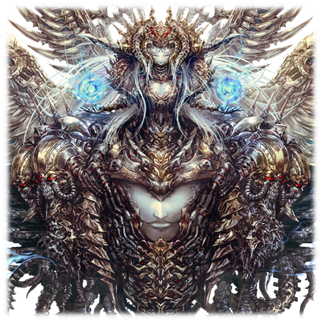

# 马尔库特的女神

| 角色信息   |          |
| ----------- | ----------- |
|  名称 |马尔库特的女神
|制造日期 |不明
|目的|真人生产据点防卫兵器
|对应乐曲|MALKUTH -The Last Ruler of Terrestrials-
|初出|Chunithm NEWPLUS|

## Episode 1 持续变化的大地

>觉醒者开始质疑起周围的事情。不只是自己，也包括神明。

电子的乐园，同时也是人类的摇篮，Metaverse。

作为保护人类这一种群，以及让Metaverse繁荣发展的整个系统来说，非常讽刺的是，最大的障碍正是人类自己。

那些无法移植进入Metaverse的“一无所有之人”向系统发动了攻击，而这个系统，不知从何时起，便下达了“将残留在地上的所有人类都消除”的指令。

就这样，系统制造出了无数的机动兵器，将地上残存的人类通通消灭。

这个全新的世界，不需要这些过去的遗物。

这就是系统所得出的结论。

系统创造出了模仿人的产物“真人”，并且驱使着他们进行着地上环境的再生计划。

真人们在系统整齐划一的指挥之下，终有一天会让整个世界焕然一新，重现生机的吧——。

然而现实并非如此。

最初的破绽，只不过是一个微不足道的小问题而已。

然而，各种各样的异常之物却渐渐地吸收，积累，最终变成了足以影响整个系统的威胁。

最后，甚至连系统所产生的，拥有绝对的神明权威的统制之程序也无法幸免，迎来了自己的死亡。

失去了该项权能的系统，决定将现在的方针由地上再生转向了Metaverse的稳定优先。

但，这并不意味着放弃掉地上再生计划。

放弃了直接支配操作的系统，往地上的各个地区配置了自律终端“多米南斯”。而且出于裁定事项，以及让真人们能够自我做出判断并且为了地上的再生而继续努力的需求……系统赐予了真人们“自我”。

而系统赐予他们的临时的“自我”之中，写满了服从，以及救赎的记忆。

真人们依旧在残酷的环境之中活着，为了让这片荒废的大地恢复生机而努力。

即便他们从未知道自己的生命，自己的心，都被掌握在系统的手中。

他们只是相信着在地上的再生结束之后，神明会在地上再生的尽头等待着他们，并给予他们救赎。

——但是，即便是在这样的真人的“自我”之中，却也孕育着微小的火种。

被故意缩短寿命的真人们，从诞生，到废弃，他们以极快的速度进行着生命的循环。

而在这些轮回之中，终于出现了一些个体。他们开始思考系统赋予他们的东西以外的东西，并且持有着强大的自我意志。

那些由系统所生产出来，几乎等同于管理真人的神明的那些存在——机械种。

那些想要寻求到“真正的心”的人们，开始向着那些神明们发问。

就像曾经像神发起挑战的人类一样——。

## Episode 2 动摇的心

>这微小的变化就宛如波纹一般扩散开来，最终导致了悲剧的发生。

大陆西部，穆尔西亚。

在这片大地上，有一名真人。

这里建立着一座将效率化发挥到极致的，了无生机的都市。而在都市中心的某条交通要道穿梭着的无人运输车辆之中，这名青年丝毫不顾左右的环境，只是径直走向自己的工作地点。

他的名字叫巴西安。

除了这个用于辨识个体的名字以外，他一无所有。

巴西安和其他的真人一样。

所有的真人都是不被允许产生属于自己的自我意识的。

迎接来到工作现场的巴西安的，是堆积如山的真人们的尸骸。

“处理到期的真人们的遗体”——这就是巴西安所属的单位给他的工作。

由巴西安他们搬到传送带上的尸骸，会被倒进废弃炉中吸收并且进行降解处理。

这些东西，一部分会变成诞生全新真人的所需养分，另一部分则会成为让大地再生的废料。

巴西安正是这样生活在这个连生命本身的价值都要利用到极致的循环系统之中。

巴西安只是机械地进行着工作。

