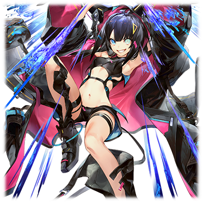
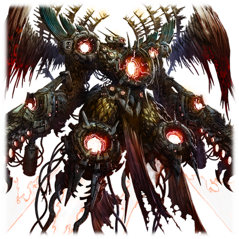

# 梅尼·特尔塞拉

|
角色信息 
  | 
     
     |
| ----------- | ----------- |
|  名称 |梅尼·特尔塞拉
|年龄 |15岁
|职业|从Metaverse而来，前往调查地上的归还者
|对应乐曲|ANU
|初出|Chunithm Paradise

## Episode 1 神之庭园

>蕾娜姐是我重要的家人。总有一天，我要和她一起前往地上旅行。

——<ruby>神之庭园<rp>（</rp><rt>GARDEN</rt><rp>）</rp></ruby>。

这里，是存在于Metaverse之内的，用于培养归还种的特别空间。

即将成为全新人类的人们，在基干系统的庇护下过着自在的生活。然后在终有一日启程前往地上的梦想之中，度过一日又一日。

在神之庭园中出生的少女——梅尼·特尔塞拉，也是这些归还种中的一员。

她，正是追随着作为第一批归还至大地的人类——也就是即将启程的蕾娜·伊修梅尔一行人的步伐，即将前往地上的下一批归还种。

  

“蕾娜姐……明天就要和大家一起前往地上了，对吧？”

  
梅尼抓紧了蕾娜的袖口。

“是的。啊哈哈……不要露出这种表情嘛。梅尼肯定很快也会前往地上的吧。”

“真的吗……？”

“肯定是。我就先前往地上去冒险了，等梅尼到了地上，就由我为你带路吧。”

  
梅尼伸出手来，和安抚着自己的蕾娜的双手重合。梅尼露出了心无芥蒂的笑容。

  
“那，等我到了地上，我一定会去找蕾娜姐的！约好了哦！”

“嗯，一言为定。”

  
两人小指相勾，立下了今后再次相会的约定。

第二天。

蕾娜他们踏上了前往大地的旅途。

站在光之漩涡——“复苏之门”面前的众人，都是一副紧张的模样。

为了亲眼目睹蕾娜启程的瞬间，梅尼也跟着蕾娜他们来到了现场。

蕾娜也在人群中发现了梅尼。于是，她在谁都没有注意的情况下，向着她露出了一个温柔的笑容。虽然听不见声音，但是从嘴唇的动作上看，应该是“我出发了”吧。

渐渐地，就只剩蕾娜一个人留在那里。而她，向着光的漩涡之中缓缓伸出了手。

指尖碰触到了光芒，而蕾娜的身体也一同化为了光的一部分。

看着蕾娜顺势跳入光芒之中，梅尼默默地祈祷着。

  
“希望蕾娜姐的旅途，能够一帆风顺。”

  
幻想着再度见面的景象，梅尼也在心中期待着前往大地的那一刻。

## Episode 2 前往纷争之地

>竟然决定要杀死蕾娜姐？我是绝对不会让这种事情发生的！我现在就前往地上，用这双眼睛亲眼见证事实！

“要我前往地上，对吗？”

  
在蕾娜姐他们前往地上不久之后，我就从基干系统那里收到了通知。

  
“是的。地上似乎发生了意料之外的事情。”

“意料之外的事情？地上，难道不是我们所知道，理想而美好的世界吗？”

“由于一部分人的反叛，我们无法追击到众人的生体反应了。”

“不是吧……蕾娜姐呢……蕾娜姐怎么样了！？”

“她现在还活着。准确来说，现在，‘只’剩她的生体反应还存在于世上了。”

  
系统向我阐述了地上发生的事情。

蕾娜姐他们虽然再生到了地上，但是除了蕾娜姐以外，其他的人都已经行踪不明，他们所再生的都市也已经崩坏。

听系统的描述，似乎围绕着蕾娜姐，地上的人们开始了争端。

而这个说法，仿佛就像是在说蕾娜姐正是煽动这场战争的罪魁祸首一样。

  
不可能……不可能不可能不可能！这绝对不可能！

比谁都要温柔，比谁都要纯粹，虽然稍微有些笨拙，但是，只要在她身旁的话，心情总能够畅快起来。

这样好的蕾娜姐，竟然会是煽动战争的人！？

我不会认同。我绝对不会认同！

  
“蕾娜姐才不会做这种事情！这一定是有什么误会！”

“我们，现在正在讨论是否要对引起这场战乱的全部的势力进行**净化**的措施。”

“净化！？”

  
这个系统，究竟是在说什么？

明明培养了我们，居然会选择弃卒保车这样的做法……

  
“当然，这确实是令人忧虑的现状。但是，那些在地上迎接着归还种的机械种们，对我们的决定有所异议也是事实。”

“虽然由机械种他们直接将她一并处理也是可以的，但是，这样只会加剧地上的混乱，让我等距离回归地上这一本质的目的渐行渐远……”

  
我终于明白了系统为何会这么说。也明白了为什么我会被传唤到这里提前再生。

那么。

现在就没有时间继续呆在这里了！

  
“于是，我们的想法是——”

“我会去地上的。现在就请让我前往地上吧。让我自己确认这个世界的真实模样，证实蕾娜姐是否是产生战乱的真正原因。”

“我们已经预料到你会这么说了。”

  
这就够了。

我只要能够确认蕾娜姐平安无事就行——

如果，蕾娜姐真的是在这背后指挥着一切的话，到时候……

  
“那么，我们就将你作为我们的代理人，将你送到地上吧。”

“虽然形式有所改变，不过，还是作为出远门的祝福，选一件你想要的东西吧。”

“那么，请给我最强的武器。而且……我还想要另一件东西。”

“是什么呢？”

“请给我——地上所有的权限！一切的权限！”

  
——就这样，我前往了地上。

等我啊，蕾娜姐。就由我证明蕾娜姐并非煽动这场战争的罪魁祸首吧！

所以，直到那时为止，都要平安无事啊！

  
——待到梅尼出发了之后，系统看着缓缓关上的“复苏之门”发出了感慨。

“又让**她**……不对，**‘她们’**，背负了沉重的任务了呢……”

“**第一次是为了世界的战斗拼上了自己的性命，第二次则是互相拼了个你死我活……**”

“希望她们的旅途，能够一帆风顺。”

基干系统，少有地表露出了其内心中的“祈愿”。

而梅尼，究竟能否凭借其一己之力阻止“净化”呢？

这一点，即便是系统，也无法估测。

## Episode 3 撕裂大地的爪痕

>好过分……这就是地上的世界吗？对了，与其想这个，还是快点去找蕾娜姐吧！

——伊欧尼亚殖民地地下，再生炉。

这里，正是归还种回归地上的重要机构。

房间被蒸汽笼罩，在这烟雾缭绕之中，一个人影出现。

那一丝不挂的人影，也渐渐地清晰起来。

  
“……呼。看来是成功来到地上了呢。嘛，虽然周围这么暗根本没啥实感呢。”

经过再生，来到地上的梅尼，在确认了自己的身体没有异常之后，穿上了再生同时生成的衣服，捡起了地上的枪，走向了外面的大地——

“——咦，这就是现实的世界吗。嗯……总感觉，和想象中的完全不同啊。”

  
从放置着再生炉的构造体之中走出来，首先映入我的眼帘的，是一整片被烧成焦炭颜色的田野，还有无数倒塌的房屋，还有……

“这到底是……”

遍布于地表，延伸到看不见的远方的，仿佛被利爪划过的裂痕。

  
我沿着裂痕走遍了整个都市，然后我明白了，这里就是一切的开始。

这个都市，已经几乎没有活着的迹象了。

周围的景象印证了这一切。

地上的景象，距离我们曾经魂牵梦萦，日思夜想的那个理想乡，实在是相差太远了。

  
“既然已经是这种惨状，那就没有留在这里的必要了。得赶紧找找看蕾娜姐的线索——”

  
——铛！

就在这时，随着风声，一阵像是什么东西被弹开的声音传了过来。

这难道——是枪声？有谁在这附近战斗吗？

难道说，是蕾娜姐！？

我抱着这些微的期待向着发出声音的方向奔去。

  
稍微走了一阵，在一片倒塌的房屋群之间，我看到了几个人影。

一群全副武装的人们，似乎在追着一个人……一个看起来比我还要年轻，皮肤棕褐色的男孩子。

要问在这种情况下，谁是敌人，谁是同伴。

这还用说吗！

  
“以多欺少什么的，我可看不惯啊！”

  
我立刻启动了手中的枪。

这把枪，正是“系统”为我准备的东西。

——名为“第九音素临界加速装置”的枪。

至于使用方法，已经刻在我的脑海中了！

  
“来吧，‘NINE’！让我见识下你的力量！点火·指令！”

“驱动要求承认——启动。”

“去吧——！！”

  
我向天打了一枪作为威吓射击，而这道青光就这样突破云层，向着高空飞去。

当那些人们看到了那束光芒，他们就陷入了混乱，很快就作鸟兽散。

没想到这群人连战斗的想法都没有，稍微有些失望啊。

我很快就来到了那个被追着的男孩子面前。

  
“你没事吧？”

“是的，我没事……咦！？等等，还有人活着吗！？”

  
仍然不知所措的男孩子，眨着那双苍蓝色的眼睛，向我问到。

“这到底是怎么回事？能不能向我说明一下呢？”

“不、不好意思。我叫纳荷姆。是驻守于这个伊欧尼亚殖民地，保护着归还种的卫士……的幸存者。”

## Episode 4 被遗留下来之人

>在我和纳荷姆接触的时候，我想起了和蕾娜姐一起生活着的时光。当时的蕾娜姐，也是和我一样的想法吧？

我在伊欧尼亚殖民地遇见的男孩子——纳荷姆，听他说，在蕾娜姐一行人刚到地上的时候，他也曾去迎接过他们。

不过，在这之后，他们就遭受了名为<ruby>革新者<rp>（</rp><rt>INNOVATOR</rt><rp>）</rp></ruby>的势力的袭击。刚才追着他的那些人们，正是<ruby>革新者<rp>（</rp><rt>INNOVATOR</rt><rp>）</rp></ruby>的走狗。

  
“哼……基本算是明白发生什么事了。那么，你为什么留在这里？”

“我是出生于这座城市的人。没有可以保护的人的我，能做的就只有让这座城市复苏了。”

“就这片……跟废墟没什么两样的地方……？”

“嗯。”

  
原来如此，这就是那些还在为大地的再生而努力的真人吗。为了完成自己的职责，默默地为这座都市而努力……

  
“不过，事情发生了变化。你和之前在这里出现的归还种大人是一样的吧？拜托了，我有一个请求！能不能让我当你的护卫呢！？”

“咦？”

“其实，我们家代代都从事着卫士一职。所以，我想代替已经战死的兄长们，完成他们未竟的职责！”

“就算你这么说……”

  
比我矮了整整两个头的小男孩，竟然在我眼前说要保护我什么的。难道说，人不可貌相，其实很擅长用枪什么的？

  
“可是现在的你，比我还要弱吧？”

“啊……这还真是无话可说了……”

果然。
  

“那么，除了这件事以外还有什么会做的？”

“嗯！虽然我无法参加战斗，不过我对操纵飞船什么的还是很有自信的！”

纳荷姆顿时两眼放光。

看来是非常有自信的样子啊。

飞船吗。确实，在这个广大的世界中，仅凭一人就去寻找蕾娜姐什么的实在是太勉强了。

那么。

  
“可以哦。那么我们就一起出发吧。我不会开船，所以正需要一个司机呢。”

“真的吗！？太棒了！那么请多关照了！归还种大人！”

“梅尼。我的名字叫梅尼·特尔塞拉。用‘归还种大人’称呼什么的，总觉得有些怪怪的。直接称呼我‘梅尼’就行了。”

“咦？可是……”

“好啦。来，试着这么称呼我一下？”

随着梅尼这么说着，纳荷姆在稍微迟疑了一阵子之后，害羞地称呼了我的名字。

“梅、梅尼。……这样就可以了吗？”

看到这样的光景，我想起了曾经和蕾娜姐见面的时候。就像蕾娜姐曾经做过的一样，我不自觉地伸出手摸了摸纳荷姆银白色的头发。

“呵呵，干得不错。”

“我、我可是卫士啊！就不要这么捉弄我了吧！”

“好啦好啦。”

“为什么又开始摸我的头啦~！”

“那么，以后也请多关照，卫士纳荷姆。”

不知是不是初次被人叫名字，纳荷姆似乎很高兴的样子。他站直了身板，自豪地拍了拍自己的胸口。

“是！还请多关照！”
  

然后，我们就在市区的郊外捡到了一艘被废弃的，像是球形的驾驶舱装上翅膀和机枪一样的奇怪飞艇。

看起来应该是那些强硬派的人们很久之前遗弃在这里的机体。
  

“那么，梅尼果然是要去佩尔修斯殖民地对吗？”

“佩尔修斯殖民地？去那里的话，就能见到蕾娜姐了吗？”

“难道说，那个人就是之前在这里出现的归还种大人……”

“嗯。我是来寻找唯一幸存下来的归还种，也就是蕾娜姐的。”
  

目的地已经定好了。

穿过荒芜的大陆，向远东的殖民地进发。

蕾娜姐，应该就在那里。

## Episode 5 镌刻的记忆

>蕾娜姐曾经梦寐以求的这个世界，并不是所谓的理想乡。求你了，要活下去……

如果要前往佩尔修斯殖民地的话，那就必须要穿越广阔的沙漠地带，冲破荒无人烟的山岳地带才行。

只靠我们手上这艘船的话，没有补给就想前往那里，怕不是只会有去无回。
  

“就没有办法前往佩尔修斯殖民地了吗？”

“那个……根据这艘船上遗留下来的数据，沿着沙漠地带往南方前进的话，就能找到一座殖民地。如果我们经由那里前进的话，应该就能够前往佩尔修斯殖民地了。”

“好，现在就立刻出发吧！快点！”
  

我抓着纳荷姆的肩膀拼命地摇着，催促着他赶紧出发。

“我、我知道啦！再摇晃下去就没法开船了！”
  

——烈日当空，黄沙遍地。

以一座细长的高塔状构造体为中心的安特路亚殖民地，就这样静静地矗立在沙漠之中。

我们将飞船降落在附近的建筑屋顶上，然后进入了大半都被黄沙掩埋的都市之中。

当我们来到建筑物的最顶层，向下望去，发现到处都能见到战斗的痕迹。

也不知道是什么缘故，到处都能见到像是**埋藏于都市中的管线一样的东西**从墙体中，从地底下暴露出来。

“看起来似乎是<ruby>革新者<rp>（</rp><rt>INNOVATOR</rt><rp>）</rp></ruby>**跟什么人在这里爆发了战斗的样子**。不过既然他们都撤退了，那么在这里休息也无妨。”

到底是跟谁在战斗呢？

难道是蕾娜姐吗？
  

“总之，还是下去下面调查一下吧。说不定能够找到什么线索呢。”

“嗯嗯，是这样呢。我们走吧。”
  

就这样，我们开始了对安特路亚殖民地的搜索。

就像纳荷姆所说的那样，<ruby>革新者<rp>（</rp><rt>INNOVATOR</rt><rp>）</rp></ruby>的部队已经撤去，连一点痕迹都没留下。

只不过，亲眼见到这座城市还是让我明白了一件事。
  

“斗争仍未结束……这就是这个世界的真实吗。”

“看来想要让这个世界恢复到能够被称之为理想乡的程度，还需要很长的时间……”
  

不管到哪里都能看到战争留下的痕迹，我也开始理解为什么系统会选择将地上全部的势力净化干净了。

就在我们探索的途中，我们也渐渐地走近殖民地的中心部。应该很快就能到那座细长的构造体的脚下了。既然在那样的惨状之中，伊欧尼亚的再生炉仍能够运行的话，那么，这里的构造体说不定，还能够使用。

当我们来到塔状构造体脚下的那片广场处，我们看到了数根柱子，就像是要把构造体围起来一般，立于四周，而柱子上细小的缆线则通向了构造体的方向。

虽然在上面也设置了些类似于立足点一样的地方，不过大多数都已经崩塌了。

在地面上，也可以看到一些石头垒成的椅子一样的东西散落在各处。

“这里，说不定是曾经住在这里的人们的休息场呢。”

“休息的地方，吗……”

“梅尼，怎么了嘛？”

“好奇怪……虽然不知道发生了什么事，但是不知为何眺望着这里的景观，就感受到一股寂寥的感觉……咦？”

  
突然，我失去了力量，直接瘫倒在了地上。

  
“梅尼？没事吧？”

“……嗯，嗯。谢谢你，纳荷姆。”

  
虽然只有一瞬间，但是，我感觉我似乎接收到了那些镌刻于这座城市中的记忆的样子。

“能站起来吗？可以的话请抓住我的手……”

“没、没事的啦！好啦，快走吧！”

“咦？等等我啊，梅尼！”

  
当我来到了中央的构造体面前，我立刻就将手放了上去。不知是不是给予了全部的权限呢，我的手上很快就传来了一股宛如微量的电流一般的感觉。

果然，这座都市，还活着。

当我将手放了一阵子之后，不知从何处传来了一股无机质的声音。

“已确认从框架主脑而来的连接——认证完毕。”

接着，构造体的周围传出了一阵震动，接着，地面上的一块开始隆起，形成了个小小的平台。

原来如此，要我们登上去吗。

“咦？咦？梅尼，这是怎么回事？”

“纳荷姆，要走了哦。”

我抓着纳荷姆的手，登上了平台。然后，平台就开始缓缓地上升，向着构造体的顶端而去。

在上升的途中，当我望向构造体的内部，我看见了无数蜿蜒曲折，正在内部延伸着的管线。简直就像是在看着人体内部的血管一般。

很快，平台就停了下来。看来这里就是我们的目的地了。

被微弱的光所笼罩的这间屋子，正是所有的管线最终的汇集之地，是一座宛如圣堂一般的地方。

## Episode 6 系统的思虑

>我不想杀死蕾娜姐。但是，如果系统是这么判断的话，那我……

“这、这里到底是什么……？”

“这里，不，不只是这里。这些分布于各个都市的构造体，它们自身就是一台巨大的演算机。”

“可、可是到底是为了什么而建造的……”

  
机械的轰鸣声宛如地震般浑厚，还能听到偶尔从周围喷射出来的冷却气体的喷气声。那喷气声，就像是对这经历过一次终焉的世界的悲叹般。

看着对眼前这一景象心生怯懦的纳荷姆，我只是淡淡地继续说到。

“在这些演算机里面，不知道进行了多少次的系统模拟，保存了多少的生命的数据。而我也是那些数据中的一员。”

“也就是说，梅尼是从那个东西中来到这里的……”

“就是这样。”

  
我一边向着纳荷姆介绍着Metaverse中相关的各种事情，一边从构造体的都市防卫机构中启动了监视系统。

太好了，终端看来还能用。

我立刻开始搜索战斗相关的记录，很快，我就找到了想要的东西。

根据上面的画面，蕾娜姐似乎是正被谁拉着手，逃离了这座都市的样子。

虽然只能在影像中瞥见一瞬，但蕾娜姐，确实来过这里。

  
“蕾娜姐……太好了……”

我下意识地松了口气。

这下终于安心了。

从这段画面中，还能得知一件事。

那就是蕾娜姐，只是为了逃离<ruby>革新者<rp>（</rp><rt>INNOVATOR</rt><rp>）</rp></ruby>的追击，而并非自己挑起战争的这一事实。

从画面上都能看得出蕾娜姐的艰辛。

我很清楚。

现在已是心急火燎，恨不得立马飞到跟前。

……必须尽快前往蕾娜姐所在的地方才行。

  
在我们确认蕾娜姐她们乘坐着飞船向着东方而去之后，我们完成了物资补给工作，接着，沿着他们的航线，离开了安特路亚殖民地。

虽然山岳地带已经近在眼前，但是天色已经开始昏暗。

结果，我们不得不在山脚下露营。

在我们安营扎寨之后，周围已经是一片漆黑。

我们围着篝火，席地而坐，互相谈起了各自的事情。

从纳荷姆口中听着真人的想法——那些真人们被赋予的苦役，我实在是难以判断，是真人，还是系统的想法，才是正确的。

  
“我也不是不能理解真人们的想法。不过，如果这个世界的战火继续扩大下去的话，这个世界会再次变成无人居住的星球。不，应该说是——会被变成那样。”

“那是什么意思？”

“纳荷姆你也见到了那个演算机了吧？管理着那个东西的系统，他们似乎决定要将所有这些招致战乱的生命通通消灭啊！”

“咦！？”

  
纳荷姆瞪大了眼睛，我继续说了下去。

  
“系统将再生于纳荷姆所在的城市的归还种——也就是蕾娜姐，认定为了煽动战乱的源头。所以，我为了确认蕾娜姐是不是真的为这个世界带来战乱的存在，才来到了这里。”

“所以，你才会那么在意那名归还种大人的安危吗？”

“嗯。现在，我还看不出蕾娜姐成为了我们的威胁的可能性，我也不认为会是这样。”

“那个……如果说啊，真的只是‘如果’啊！如果那名归还种大人，真的是引起了战乱的始作俑者的话——‘你’，会选择做什么呢？”

  
纳荷姆真挚的眼神投向了我。

仿佛就像是看透了我内心的迷惘一样。

  
“那么，在系统下达决定之前……我会靠我这双手……亲手杀死蕾娜姐。”

  
——对。

因为，这就是我被赋予的使命。

  
“怎么会这样……”

“当然，这也不是说因为是蕾娜姐，就会网开一面什么的呢。只不过，系统到底是怎么判断的，就连我也不知道……”

说不定，在这个瞬间，系统也将我视为了敌人，想要抹杀我也说不定。当我从系统那里接下那个任务的时候，我就已经有这样的觉悟了。可是，如果真的变成这样的话，我——

“梅尼。”

我的手和纳荷姆的手重合到了一起。

“……我还不能完全理解梅尼的事情。不过，如果这个世界要成为系统所肃清的对象的话，我肯定会拼上性命保护好你的。”

深蓝色的眼眸望向了我。

那双眼睛吸引住了我。

  
“这种话啊，还是等到变得比我更强再说吧。”

我不自觉地转移了话题，将眼前的情况搪塞了过去。

  
“啊哈哈……好像也是呢……抱歉。”

  
啊——

纳荷姆的小手正在离我而去。

只在这种小事上这么心细……

等我回过神来，我已经握住了纳荷姆的手。

“梅尼，怎么了吗？”

纳荷姆的脸上露出一丝寂寥。

看来是我让他伤心了啊。

“刚才的当我没说吧，纳荷姆。其实，我是觉得纳荷姆很可靠的啊。”

“可是，我没有能够战斗的力量……”

“但我不讨厌纳荷姆，还有你的想法啊！所以，一定要保护好我哦！‘我的’卫士君！总之，就说到这里！我要去睡了！”

“……是！我会努力的！”

  

看着两眼放光露出灿烂笑容的纳荷姆，我也安心了下来，进入梦乡。

向天上看去，不管看向哪里，都是满天璀璨的星斗。

——这个世界，距离那梦想中的家园，还是过于遥远。

但是，绝对不能让这个再生至此的世界，因为我们的事情而再度被蹂躏，被践踏。

## Episode 7 卫士纳荷姆

>保护某个人。直到现在为止，我仍未能理解这句话真正的含义。

待到日出时分，我们踏上了前往山岳地带的旅途。

眼前是岩层被风沙剥露开来，由连绵的山峰所构成的光景。当我们飞过此处时，我们本能地感觉到了，这里并非人所能造访的地方。

就在我们进入山岳地带不久，雷达就发出了反应。

虽然被高耸入云的构造体遮挡住，难以分辨其真身，但是，可以确认在那里有着一座都市。

不过，与其说那是一座都市，不如说……

  
“呐，纳荷姆……那也是都市的一种吗？”

“看起来更像是要塞什么的……可是为什么会在这种地方……——不好！梅尼！从那座要塞里不知道放出了什么物体！正向这里飞过来！”

“是敌人吗！？”

  
从雷达上，可以看到三台机体。

“必须立刻离开这片空域！要抓紧了！”

下个瞬间，船体就传来了强烈的震动。纳荷姆以球形的船体为轴，直接把飞船翻转了个一百八十度。

接着，飞船就向着来时的方向飞驰而去。

  

“不行……对面的速度太快了！”

战斗是无法避免的。接着，纳荷姆就深吸了一口气，然后大声喊到——

  
“这里就交给我吧！”

  
纳荷姆顿时气场大变。

从全身都能感觉到那股紧张感。

  
“纳荷姆！敌人来了！”

“放心吧！”

  
敌人展开了攻击，炮火倾盆而下。

然而，这些攻击也只是在坚硬的岩层上凿开了几小块碎石罢了。纳荷姆操作着飞船灵敏地躲避着攻击，将飞船的机枪转向了与船头相反的方向，向着跟在后方的敌机狠狠地扫射过去。

  
“好！干掉一台！”

“好厉害！纳荷姆真的好厉害啊！”

“还没结束呢！”

  
飞船就像是要将敌机甩开般，开始急剧加速。

敌人也不甘示弱，跟着追了上去。

在飞船的前方，是布满了宛如针刺般凹凸不平的岩层的开阔地带。

飞船贴着地面闪转腾挪，蜿蜒曲折地向前飞行着，而敌机则是选择了暂且向上爬升。

纳荷姆并未放过这个机会。

他将机身纵向调转了一百八十度，一边回转着一边向上爬升。

纳荷姆就这样与失速的敌机撞了个对头——

机枪的火舌在这分毫之间绽放，当双方交错开来，剩下的两机也在空中炸开了绚丽的火光。

  
“梅尼！我做到了哦！这样的话，应该也能帮上些忙了……咦，梅尼！？”

“好厉害啊！纳荷姆，刚才真的太帅了！”

“等、等等，梅尼！前面！我看不到前面了啦！快放开——！”

  
突然，一股仿佛掠过机体般的震动传了过来。

  
“啊……？”

“是敌人的增援！怎么这么快就追上来了！？”

  
从雷达上看到的机影，是先前的两倍以上。虽然距离这里还有些距离，不过再怎么说也不是我们一艘飞船能对付的量啊！

  
“看来只能赌一把了，这里就由我的‘NINE’来……”

“不，那些战斗艇可是从四面八方向这里飞来的。就算是梅尼，也难保有个闪失啊。”

“那该怎么办？”

“由我来当诱饵。在我负责引诱敌人的期间，梅尼你就赶紧下船，然后跑的越远越好。”

“哈？你在说什么——”

  
纳荷姆的判断很迅速。

当他把船停靠到岩石的阴影处之后，他立刻就打开了驾驶舱的舱门并且催我出去。

  
“好了，快点！”

“你难道要我在这里直接就允诺然后拍拍屁股就走人吗！？我可是直到最后都——”

“你还有必须完成的事情，不是吗？所以才不能止步在这个地方啊！！”

  
敌机正在正步步逼近。

明明是这样火烧眉毛，令人绝望的状况。然而。

纳荷姆——却笑了出来。

  
“我能做的事情，也就只有这些了。会把我称作卫士的也就只有你了。所以，至少让我直到最后一刻，都像一个卫士一样活下去吧。”

“纳荷姆，我……！”

“走吧！梅尼·特尔塞拉！！”

  
纳荷姆大喊着。我也明白，没有继续追问的必要了。

这孩子，明明最初只是个看起来就不太可靠的存在而已。

弱小，空虚，比我还要脆弱。

可是，现在却完全不同。

现在，站在我面前的。

是一名顶天立地，十分完美地执行了自己身为卫士这一职责的少年。

所以，我不能践踏纳荷姆的觉悟。

我走下了飞船。

  
“纳荷姆……迄今为止真的很谢谢你。”

“希望你能够平安见到那位归还种大人。”

  
这么说着，纳荷姆启动了飞船，飞离了此处。

  
我不知道躲在岩壁的阴影处，等待了多久。

已经再也听不到爆炸声了。说不定纳荷姆已经成功从他们手中死里逃生了也说不定？

就在我祈祷着纳荷姆能够平安无事的时候，我看到了正准备返航的战斗艇机群。

虽然只是短暂的一瞬间，但我却在那队机体的编队中看到了——

  

“那不是——纳荷姆吗！”

  
映入我眼帘的，是纳荷姆刚才还在驾驶着的飞船，还有纳荷姆自己。他并未被击坠，只是被敌人俘虏了而已。

  
——很快，山岳地带也被夜幕所笼罩。

幸运的是，敌人并未注意到我的存在。他们甚至连回巡的意思都没有。也就是说，现在的我可以在掩人耳目的情况下去任何地方。

——可是。

我从最初就没有这么做的想法。

这是我生来第一次这么想。

没想到，我居然会对蕾娜姐以外的人，如此的“介怀”。

我想要拯救纳荷姆。

因为他赌上了自己的性命保护了我。

所以，这次就轮到我救他了。

我看着握在手中的“NINE”。

现在，要做的事情只有一件。

  
“等我啊，纳荷姆。”

  
远方，构造体正在夜空中矗立着。

不管前方会遇上什么艰难险阻。

我都要将纳荷姆救出来！

## Episode 8 奇袭

>我一定要将纳荷姆救出来！因为，我有着能将其实现的“力量”啊！

虽然花了很长时间，但我还是平安到达了可以直接目视那座要塞的地方。

接着只要找到纳荷姆被抓走的地方就好了……

在晦暗的光线下，我朝着要塞的周围瞥了一下。

  
“咦？那个……难道是？”

  
最初，我还以为那只是一块被强风切割到无比细长的岩石，然而，那块岩石的表面，却有些像是灯光一样的微小光点。

“难道说……这一整片地方，其实是座化装成巨大岩石模样的，框架主脑的都市吗……？”

他们会在那里，也就意味着说<ruby>革新者<rp>（</rp><rt>INNOVATOR</rt><rp>）</rp></ruby>他们掌握了这座城市了吗？到底是怎么做到的……？

不，现在还是先救人要紧。如果说这一带的设施都是框架主脑的东西的话，那对我来说，简直再好不过了。

这里就让我反将一军，利用我所拥有的更高位的权限找到纳荷姆吧！

  
很快，当我接触到附近的构造体，我很快就提取出了信息，明白了一切。

这座被要塞化的都市，其名为——塞雷基亚。

其正是框架主脑所拥有的其中一座都市。

可是，为什么会坐落于如此不便的地方呢——

  
就在这时，细微的震动从我的手心传来。

“——找到了。看来比想象的还近。”

纳荷姆的位置，就在那座要塞的西北方向的一座废屋里。

等着吧，我现在就过去！

  

——在夜色的掩护下，我没有遭遇任何敌人，就这样安全地到达了废屋子面前。

只有这个时候才该庆幸我这一身黑的行头啊。

躲过看守的耳目，我偷偷地走进了废屋之中。

沿着废屋的走廊行进，我听到了微弱的声音。

不会错的，这个声音是——

“NINE！加速指令！”

  

我将枪的连射性能提升，三下五除二就将站在门口的士兵击破。敌人听到了响声急急忙忙地冲了出来，但是已经太晚了。

我一个大步冲到了敌人的面前，以NINE的枪口顶住了敌人的下颚。

然后，趁敌人失去平衡的这个瞬间，使出全力，向敌人的脸上来了一记高抬腿的踢击。

  
“呼。这样就结束了吧。”

“——梅尼！是梅尼吗！？”

“纳荷姆！”

冲进房间内，我看到了正绑在椅子上的纳荷姆。他的脸不知道是不是因为被人殴打过多少次呢，红肿的厉害。

“纳荷姆！没事吧！？”

“没，没事。这种程度的话还可以……与其说这个，这又是为什么……？为什么，要来，救我……”

  
眼角还带着泪花，纳荷姆向我这么问到。

为什么……这还用说吗。

  
“佩”

“佩？”

“佩、佩尔修斯殖民地！去佩尔修斯殖民地，我还要个司机啊！要是司机擅自走掉了，我可是会很困扰的啊……”

“啊哈哈……梅尼还真是不坦诚呢。”

“嗯？你刚刚说了什么？”

“呵呵……没，没什么。只不过……”

“只不过？”

  
纳荷姆一边说着，一边将脸向我转了过来。他真挚地望着我，然后，努力地露出了一个笑容——

  
“对我来说，最高兴的事情，就是能够继续保护您。”

“可要保护好我哦。我的卫士君。”

“是！”

  
好了，纳荷姆也平安无事地救出来了，是时候离开这里了。

  
“纳荷姆，战斗艇——”

  
就在这时，一阵地动山摇，一股强烈的震动席卷了整个都市，警报也响彻了整个地方。当我们跑出废屋，来到外面确认情况的时候，我们发现，那些<ruby>革新者<rp>（</rp><rt>INNOVATOR</rt><rp>）</rp></ruby>的士兵们并没有向这儿过来，而是向着别的地方而去。

“怎么回事？这个警报声，并不是因为我们而拉响的吗？”

“梅尼，快、快看那个！那、那座山！！”

  
向纳荷姆所指着的那座山望去。那座看起来似乎只是一座小山丘的物体，突然，就像是“从睡梦中惊醒一般”，整个动了起来。

  
“那、那到底是什么啊！？人型……兵器？难道说，是<ruby>革新者<rp>（</rp><rt>INNOVATOR</rt><rp>）</rp></ruby>的……！”

“——不对。那个东西……我很清楚是什么。”

那个正是框架主脑制造出来的——

突然，那个东西发出了怒吼，打断了我的思绪。

不，那并不是怒吼，准确来说，那是那个物体发射出来的热能射线射向要塞的某个方向，照射到某些物体身上发出的巨响声。

## Episode 9 钢铁之巨神

>如果要从这里逃出去的话，就必须想办法解决那台歼灭兵器才行。也只有我能做到了！

突然出现在我们面前的巨大物体。

潜藏于我脑海中的记忆，告诉了我面前的存在为何物。

“那是，毁灭了古代人类的——歼灭兵器。”

“兵器！？再怎么说这也太大了吧！？”

那个东西，现在也不过只是一台忘记了自己的目的，会朝周围无条件发动攻击的杀戮机器而已。

毫无疑问，那东西已经失控了。

  
“梅尼！趁<ruby>革新者<rp>（</rp><rt>INNOVATOR</rt><rp>）</rp></ruby>在跟那个巨大兵器交战的时候逃走吧！”

“好！”

当我们跑到外头之后，那些<ruby>革新者<rp>（</rp><rt>INNOVATOR</rt><rp>）</rp></ruby>的部队，围住了巨大的歼灭兵器，并且向它发动了猛烈的炮火攻击。然而，在巨大的身躯面前，这些炮火攻击也不过是小小擦伤罢了。

要是那个东西倒下了的话，战舰主炮级别的攻击就会向我们袭来——

  
“梅尼！危险！”

  
突然，我被纳荷姆狠狠地拽了一下手。然后，歼灭兵器的大手就在我身后掠过。大手一挥，刚才还在的废屋就被扫成了一堆废墟，卷起了漫天的风沙。

“刚刚……它盯上了我吗？”

和迄今为止没有意识的无差别攻击不同，这次，我从那台机器身上感觉到了些微的“意志”。

难道说，其实让那个东西启动的原因其实是因为我吗……！？

  

“梅尼！怎么停下来了！？再不继续跑的话，就会被那些<ruby>革新者<rp>（</rp><rt>INNOVATOR</rt><rp>）</rp></ruby>发现的啊！”

“纳荷姆，我们现在这样是逃不掉的。这家伙的目标是我。如果只是一味逃跑的话肯定会被它抓到的……”

“怎么会……那我们该怎么办……”

“——那家伙，必须由我打倒才行。”

现在，在这里能够打倒那个东西的只有我了。

所以，我也不得不这么做了。

只要让这东西失去行动能力就行。

在我手上，拥有能够做到这些的“力量”！

  
“NINE！涡流·指令！”

既然如此——那从一开始，就使出全力吧！！

“纳荷姆！稍微离我远点！”

“好的！”

歼灭兵器的手，再次伸向了我。

我瞄准的目标——绝对不会偏移！

  
“去吧！！！”

  

一道暗青色的雷光，冲破夜空。

雷光向着歼灭兵器笔直地飞去，直接吞噬了整只左臂，然后在肩膀处打出了一个大口子。

  

“——！！”

从歼灭兵器中听到了机械般的错误音，就像是人类在痛苦中的呻吟一般。

歼灭兵器再也无法维持姿势，就这样撞倒了周围的物体，倒在了地上。

“可恶……果然光靠这个是没办法解决的吗！纳荷姆！在我把那家伙打倒的期间，快去取回我们的飞船！”

“我明白了！……咦！？”

“停机库在往这里过去东边一点的地方。既然你是我的卫士的话，这种事情还是做得到的吧？”

“可是……要是找到了飞船之后，该怎么找到梅尼你呢！？”

面对纳荷姆的质问，我指向了远处高耸入云的构造体。

“我会到那座建筑物的顶楼，以NINE的最大出力攻击那台兵器。我开火的时候就是信号。”

“我明白了！肯定会前来接你的！”

就这样，我们兵分两路，趁着夜色的掩护开始了各自的行动。

## Episode 10 空虚的眼瞳

>原来，你只是想要保护我，仅仅只是这样吗……抱歉，我竟未能注意到这点……

趁着<ruby>革新者<rp>（</rp><rt>INNOVATOR</rt><rp>）</rp></ruby>与歼灭兵器混战的时候，我潜入了矗立于中央地带的构造体的内部。

以和安特路亚殖民地同样的方法叫出平台，然后乘坐上去。

在这细长的高塔内部，虽然昏暗，但还是有些些许的灯光一路延伸到建筑物的顶端。这里也有着无数的线缆蜿蜒于高塔的内墙之中。

很快，我就到达了顶部。

当到达顶楼的时候，室内的照明就一并启动了。

然后，从黑暗的角落中，某样东西浮了上来。

那是由管线聚集起来组成的，宛如圣堂一般的制御机构。在它附近的，则是一尊无人就座的王座。

这座由框架主脑所建设起来的都市中的构造体——即巨大演算装置，为了维持演算机能的运作，在各个都市间都有线缆连接着地下的大型发电机进行供电。

我利用自己所获得的权限，从制御机构中调出了连接装置，将它与我的NINE进行直连。

简直就像是最初就想好了会有这么使用的一天一样。

  
“好厉害……能量通过NINE，我可以很明确地感觉到能量正在积蓄着。只要有这股力量的话，就能够完全破坏这台歼灭兵器！”

将墙壁打破，我借此确认了一下外面的情况。

只剩右手的歼灭兵器正快速地向我所在的构造体逼近。即便机身已经燃起大火，产生了大大小小的爆炸，它也毫不在意，只是向着我所在的地方前进。

就在这时，不知是不是看到了我呢，机械兵器那宛如灯火般的红色瞳孔突然瞪大了起来。

  
“————！！”

歼灭兵器发出了怒吼。

我从它撑起的上半身部分，看到了在胸口闪烁着红光的核心单元。

如果要攻击的话，就是现在——

“NINE！光辉·指令！！”

“超频驱动请求承认。限制——解除。”

  
随着声音，我手中的NINE瞬间“抖了”一下。

然后，它的形态在瞬间发生了变化——

变成了一把聚集了整座都市所有的电力的，苍白色的枪。

我从手上感到了扎实的手感，仿佛只要按下扳机，就能让眼前的歼灭兵器灰飞烟灭一般。

就是现在！聚集所有从线缆收集到的电力！向眼前的目标打过去！！

  
“这样就——结束了啊啊啊啊！！！！”

  
能量，随着被压缩的冲击波和爆音炸开——我的攻击成功命中了胸部的核心单元。

在一瞬的静寂之后，射线上的空间崩坏了，核心单元喷出了火焰，歼灭兵器也在爆炸和火光中渐渐地倒了下去。

在那双赤红色的眼睛最终消灭的瞬间，我的脑中突然传来了什么东西。

  
“这个是——那个兵器的‘记忆’吗？”

然后，我终于明白了一切。

为什么那个东西要朝我过来。

原来是这样啊。

原来，你只是想要保护我而已吗。

  
“抱歉。愿你，能够安息——”

“——还真是厉害啊，那股力量。竟然那么轻松就将那样的庞然大物一举消灭什么的。啊啊，真的是太美妙了啊。”

突然，从背后传来了一个声音。

简直就像是脊梁骨被刀刃直接划过一般的——

实在是过于冷血，过于无机质的声音。

  
“是、是谁！？”

当我回过头来的时候，我发现了一个女人。

宝座明明直到刚才为止还空无一人，现在，那个女人却正坐在那里。

我竟然没有注意到？

是什么时候在那里的？不对，并不是这样。

那个东西……真的是人吗！？

那个全身白色的女的就是让人有这种虚无缥缈的感觉。

那个女的……总觉得在某些地方，欠缺了“某样”决定性的东西……

  
（……咦？）

身体，不能动弹。

自从看到那双红色的眼睛的时候，我的身体不知不觉就不听使唤了。

女人缓缓地向前走着，从剑鞘中拔出了白色的剑。

明明动作满是破绽，可我却根本无法动弹。

这样下去的话，会被杀死的——

  
“梅尼！！！！！！！”

“——！”

  
纳荷姆的声音，打断了我身上的束缚。声音，是从被破坏的墙外传来的。

恢复行动的我勉强躲过了挥下的利剑，之后，我就头也不回地跑了出去。然后，向着纳荷姆驾驶着的战斗艇纵身一跃——跳了过去。

简直像是慢动作回放的视频一样，时间在这短暂的瞬间中流逝着。

在我向着外面跳出去的这个瞬间，纳荷姆也将战斗艇倾斜四十五度并打开了舱门，成功接住了我。

不顾撞击传来的疼痛，我立刻将视线投向了刚才还在的构造体处。

从外墙的缝隙间还能看到那个白色的女人的身影。那个女的就那样瞪着那双不知道有没有在望着我的虚无的眼睛，露出诡异的微笑。

然后用左手摆出了手枪的形状，指向了自己的脑门——

## Episode 11 风暴前夕的预感

>我有股不详的预感。总觉得，绝对不能让那个在都市中遇见的那个女的跟蕾娜姐见面才行。

“没事吧，梅尼？”

“嗯、嗯……谢谢你……”

  
明明已经从塞雷基亚殖民地逃了出来，我的脑海中却还满是那个女人的身影。

  
“梅尼，真的没问题吗？你的身体……”

“咦？”

  
直到被这么提醒，我才注意到这点。

我的身体，现在已经是汗流浃背。

明明刚才只是两眼对上了而已，身体就已经止不住地颤抖着。

我对那个女的产生了无比的恐惧——

在那个瞬间，我终于理解了。

那是决不允许存在于这个世界上的存在。

那是绝对不能与蕾娜姐相见的恐怖存在。

  
“稍微休息一下吧。梅尼你就先在这呆一会。”

“没、没事的啦，你看，我根本没——”

  
咦？

怎么视线突然模糊了起来？

身体……使不上力。

难道说……是NINE使用过度了？

  

“果然还是休息下比较好呢。正好前面有一片小山丘适合降落的样子。”

很快，我们就降落到了一片景观良好的小山丘上。

“好了，我们到了哦。在这里休息一阵子之后，我们就前往佩尔修斯殖民地吧。”

“谢谢你……纳荷姆……”

我就这样横躺在驾驶舱里面，渐渐进入了梦乡。

  
——等到我恢复意识的时候，外面已经是阳光普照。

我向纳荷姆建议出去外面呼吸些新鲜空气，于是，我们二人离开了飞船。

  
“不过啊，没想到居然到现在还没有追兵出现啊。”

难道说那个歼灭兵器造成的损害远远超出了我们的想象，让他们应接不暇了？

“放心吧，梅尼。不会有人来找我们麻烦的。”

“为什么？”

“因为在‘借’这艘船的时候，我同时给停泊着的其他战斗艇做了些手脚。我虽然不能战斗，不过这种东西我还挺擅长的哦！”

“咦……咦……原来是这样的啊。”

看着露出灿烂笑容的纳荷姆，我在心底里暗暗地决定，以后绝对不要惹他生气。

  
“说起来，我在梅尼睡着的时候调查了一下周围，结果发现了一片地方似乎有战斗过的痕迹的样子。”

纳荷姆这么说着，指向了远处的某个地方。沿着他的手指望去，一艘大半毁坏的战斗艇，正横靠在那个地方。

将视线投向更远处，在早晨的阳光下，某样东西映入了我的眼帘。

“那个，到底是什么呢……？”

  
借助纳荷姆的力量，我们慢慢地朝着那个东西所在的方向前进。那个东西，是用铁板之类的小物件组合起来的，一个小小的“墓碑”。

在那块墓碑上，正摆放着似乎从这附近取来的花朵。

花朵已经基本风化，我向花伸出了手。

在我碰到花的瞬间，花朵就像是崩溃一般，失去原型，变成了细小的灰尘飘散而去。

  
“说不定，这是乘坐着那艘战斗艇的人的坟墓也说不定——梅尼？”

“啊……我又……”

  
我从花朵上微微感觉到了其中的思念。

思念着重要的人的哀伤之情，令我胸口一紧。

  
“结果，不论我们走到哪里，战斗就会跟到哪里呢。”

  
<ruby>革新者<rp>（</rp><rt>INNOVATOR</rt><rp>）</rp></ruby>与框架主脑的遗物，还有——那个女人。

这个世界，正充满了许多引起争端的存在。

而就在我们磨蹭的这个期间，事态也在持续恶化下去。

我无论如何，都必须尽快找到蕾娜姐才行。

必须赶在系统下达审判的那一天之前——