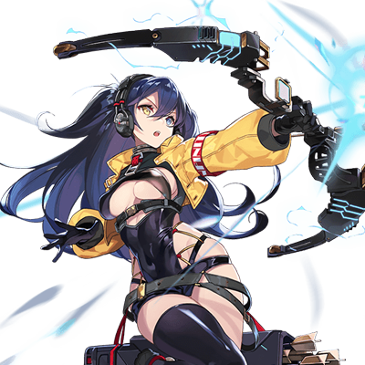

# 米斯拉·特尔塞拉/RE Metaverse

| 
角色信息 
  |          |
| ----------- | ----------- |
|名称|米斯拉·特尔塞拉/RE Metaverse
|年龄|19岁（再生后6年）
|职业|第二次归还种的卫士
|对应歌曲|Dèfandour
|初出版本|Chunithm Luminous

## Episode 1 扭曲的救世主

>我的声音，肯定无法传到任何人的心中吧。即便如此，我也还是要传达出去……

在一条只有等间隔的照明灯照着的昏暗走廊之中，一名少女正在缓缓地走着。

少女被那些男人们围在中间，那些人们都统一穿着白色的衣服。

少女偷偷地将视线投向旁边的男人。男人的脸上一副恍惚的表情，不知道在念叨着什么。

少女集中精神，试图听清他们究竟在说什么。

她能听到的，只有名为“救世主”的几个字。

 

下一刻，视野又突然暗了下来。

再次睁开眼睛，少女看到的，是几个正躺在围着环形房间铺设的床铺上的孩子们。

他们的身体无一不遭受摧残，没有一个是正常的模样。

 

“哎呀，真是个坏孩子啊。竟然会溜到这种地方……”

 

从少女的背后传来了声音。

被这恐怖的声音吓到，少女回过头望去，站在那里的，是一个身体四处都已经被机械化的男人的身影。

男人并不在意少女的请求以及孩子们的意思，就像是出门忘记关掉了电灯一般，他轻轻地按下按钮——杀死了这间房子里所有的孩子们。

 

“啊啊啊啊啊啊啊啊啊啊啊啊啊啊啊啊啊啊啊啊啊啊啊啊啊啊啊啊啊啊啊啊啊！！！！！！”

 

出现在少女面前的，是一副地狱般的光景。

疯狂挣扎着，扭曲着身体，无谓地挣扎到痛苦死去为止都不会停息的这副模样，对于少女来说，实在是过于超现实了。

 

视野再次暗淡了下来。

少女正绷着脸，向着眼前的男人展示着自己一丝不挂的身体。

男人面对那带着些微曲线的身体，毫不犹豫地伸出了手。

 

“——！”

“这可是身为救世主无比神圣的仪式啊。难道不应该感到光荣吗？为何还会如此嫌弃？”

 

对眼前的男人来说，少女的抵抗不过是些琐碎的事情。不如说，有这样的反应才算的上“正常”。

 

“看来‘**机能**’已经完全准备好了呢。”

 

随着男人刺耳的声音响起，视野再度陷入了黑暗之中。

 

少女的日常，就几乎是以下的循环——

永无止境的试验，投喂各种不知来历的药物，还有确认身体机能是否正常。

不管怎么抵抗，不管怎么哭泣，他们都不会停手。

 

最终，少女所见到的世界渐渐地开始支离破碎，就像是与少女的感情共鸣一般，裂解，粉碎，最终变成了扭曲的影像。

无数被改造成扭曲模样的，曾经身为人的物体。

被投喂了各种各样的物质，开始急速生长的肉体。

为了确认“机能是否正常”，而不知道进行了多少次的，名为“仪式”的暴行。

曾经纯白无暇的少女，早已封闭了身心，就像随波逐流一般，接受着眼前这一切的发生。

 

“——呜……！”

 

少女在昏暗的研究室中醒来，踏着摇摇晃晃的步伐，继续前往下一个仪式的地方。

就在这时，她注意到了室内的一面镜子，驻足于此。

 

“啊哈……哈哈哈哈哈哈……”

 

望着自己在镜中的倒影，少女在无意识中竟然哭了出来。

自己早已经被异化成了这副模样，只能作为产下子嗣的机器继续活下去。

不知道多少次，她都想要自绝性命。

然而每当她这么做，潜藏在身体里的机能就会触发，阻止她继续做下去。

乞求着不知道何时才会到来的死亡，少女呢喃着。

 

“谁快来……救救我……”

 

少女的呜咽声在昏暗的室内回响着。

 

“呜呜……救救我……”

“拔示巴大人，您怎么了吗？”

 

估计是外面的人注意到了这个名为拔示巴的少女过了很久都没有从房间里出来吧。

不知何时，一名穿着白色衣服的男性站在了正蜷缩在地上哭泣的拔示巴面前。男人突然露出了一副若有所思的样子，接着，用开朗的表情向着拔示巴说到。

 

“您难道是在为不能产下孩子而不安吗？您尽管放心吧，我们有伟大的亚哈大人在此！在您成功怀孕之前，我们都会一直支持着您的！”

“呵、呵呵……啊哈哈哈哈哈哈——”

 

少女正在渐渐地崩溃。

而与此同时，她也无比强烈地祈求着。

祈求着这个世界的终结——

## Episode 2 从沉睡的深渊之中

>我好像……做了个梦。在那个梦中的女孩子一直都在哭泣。所以，我——

在绀青之都·萨马拉坎达展开的这场战争，从都市的上空，一直打到街区内，再打到萨马拉坎达的中枢处。

在那中枢的最深处，这场战争的中心人物——拔示巴，以归还种尼亚·尤迪特的肉体为容器，再度降临于这世间。

她的愿望只有一个。

那就是将这个世界所有活着的存在，全部带向没有痛苦的世界。

然而，与她的理想完全对立的人们，现在就站在她的面前。

 

“我不会让你这自以为是的想法成真的！通往未来的道路，绝对不会让你断绝！大家的……索罗的未来，就由我来保护！”

 

拔出身上的佩剑，泽法·尼亚德向着拔示巴大喊到。

 

“这就是，你的回答吗？”

“那么想要死的话，你就自己去死吧。不要把你的任性强加到我们身上！”

“正是，这一切不过只是我的任性。因为如果不这样做的话，大家就无法迎来美好的明天哦？”

“……！”

 

泽法的直感告诉她，眼前的这个女人，是认真的。

如果是身为曾经身为真人的指导者，强硬派的顶点人物的她的话，肯定会毫不犹豫地去执行吧。

所以，无论如何都要在这里阻止她才行。

即便要对索罗的亲生母亲举刀相向。

泽法一边牵制着拔示巴，一边寻找着米斯拉的踪影。

注意到泽法的视线的拔示巴，淡淡说到。

 

“如果你在问她的话，现在，她正在做梦呢。”

 

拔示巴指向了某个地方。

她指向的地方，正是直到刚才为止，尼亚还在那里横躺着的台座。然而现在的台座上躺着的，正是被带上奇异的装置，动弹不得的米斯拉。

 

“你对米斯拉做了什么！？”

“我只是为她实现了愿望而已。因为，她想要知道我的想法。”

“‘我的，想法……？’难道说——！！”

 

泽法的脑海中浮现了不详的预感。

拔示巴口中所说的“我的想法”，如果没有猜错的话，现在的米斯拉，应该正被机器灌输着拔示巴的记忆和意识才对。

 

“你这种人……到底要做到什么地步……！”

 

已经没有思考的余地了。

泽法赶紧收起了剑，向着米斯拉的方向冲去。

 

“啊……怎么会……”

 

米斯拉的身上没有任何的拘束或者抵抗的反应。

只是任着机器传输着数据，偶尔像是条件反射一样轻微痉挛着。

那到底是对大脑造成的负荷呢，还是看到了记忆中的幻象呢？她的脸上已经被泪水浸湿了。

 

“必须尽早将装置停下来才行！”

 

到底从开始记忆覆写以来，经历了多久的时间呢？再这样继续下去的话，米斯拉说不定就会像凯南和尼亚那样，被夺去身体的控制权了。

但是，如果随意破坏掉装置的话，说不定就会伤到米斯拉的记忆。

不管怎么说，都必须尽早作出决定才行。

必须在她不再是她之前——

 

“很厉害对吧？这样的话，米斯拉也能够更加理解我的事情了呢。”

“……你这种人真的是！”

 

接着，拔示巴就像是对两人毫无兴趣一样，直接离开了这里。

 

“再见了，我的小傀儡……”

“给我站住！”

“放心吧，我们很快就会再见面的。”

“可恶……！”

 

放弃了追击拔示巴，泽法决定先将米斯拉救出来。

* * *

在拔示巴消失踪影之后不久。

 

“这里就是终点吗……”

 

又有一个人来到了最深处。

手握着大型的手枪“巴拉基尔”的白发少年——索罗·莫尼亚。少年已经遍体鳞伤，身上的衣服也早已被熏黑，东一处西一处的都是破洞。

一只手正卷着渗血的绷带。已经看不出这绷带原来的颜色了。

索罗深吸了一口气，缓缓把手放在了门上。

大门无声无息地打开了。然而索罗并未立刻就冲进去，而是躲在阴影处观察着里面的样子。

里面似乎很昏暗的样子，但也并没有暗到需要灯光照明的地步。

 

“没有人在里面吗？”

 

仔细一看，里面似乎爆发过战斗，不知道是干什么用的装置和材料已经被打成了一地碎片，散落在地板上。

如果这里是研究室的话，那那些研究人员应该早就吓破胆逃离这里了吧。

就在索罗下定决心准备进去的时候。

 

“——！————！”

 

突然，他听到了类似于悲鸣的声音在房间内回响。

 

“这个声音……是泽法！”

 

原本还绷紧的神经，渐渐地放松下来。索罗赶紧奔向发出声音的地方。

随着他越来越接近泽法，那模糊的声音也渐渐清晰起来。

就在这时，索罗才明白。

她现在正被卷入十万火急的情况之中。

 

“米斯拉！快起来！求你了！”

“啊……米斯拉？”

 

泽法正大声向着躺在地上一动不动的少女喊着她的名字。

## Episode 3 再会

>总觉得，索罗好像稍微长大了一点。

一直都是那么地开朗，不管发生什么都是一副天不怕地不怕的样子。

这就是名为米斯拉·特尔塞拉的少女给人带来的印象。

但是，现在的她却像是死了一样，躺在地上一动不动。

只是目睹这样的光景，对索罗来说就已经是无比冲击性的事情了。

 

“啊……米斯，拉……？”

 

努力从口中挤出少女名字的索罗，就像是与这声音呼应一般，身体突然失去了力气，紧握的“巴拉基尔”也从手上滑落。

随着索罗跪倒在地上发出哐咚的一声，旁边也响起了宛如金属摩擦一般令人不快的声音。

 

“！？”

 

泽法反射性的回过头来，挂在她脸上的，是一种介于困惑和悲伤之间的表情。

但是，这也不过是一瞬间的事情。

当她认出站在自己眼前的人是索罗的瞬间，泽法心中那根紧绷的弦也应声而断，积累至今的感情宛如决堤般喷涌而出。

 

“索罗………………”

 

面对泣不成声的泽法，索罗温柔地问到。

 

“泽法……米斯拉，究竟是怎么了？到底发生了什么——”

“对不起……”

“什么……怎么会这样！？”

 

索罗赶忙走了上来，以和泽法面对面，把米斯拉夹在中间的形式坐着。接着，他抓着米斯拉的肩膀，呼唤着她的名字。

 

“喂！米斯拉！现在可不是睡大觉的时候啊！”

 

然而米斯拉没有任何回应。

索罗摇晃得更激烈，并且继续向着米斯拉大声喊着。

 

“明明一直都是那副自以为什么都懂的样子！还一直那么玩弄着我的头发！为什么要一个人先走啊！我还什么都没有——”

“那、那个，先冷静一下吧，索罗。米斯拉其实——”

“我怎么能坐得住啊！米斯拉可是死了啊？还是挂着这幅满足的表情……！”

 

趁着索罗动摇的时候，泽法抓住了索罗的手让他先松开米斯拉的身体。一边抵抗着索罗的挣扎，一边大喊着。

 

“不是这样的！米斯拉，现在只是睡着了而已！”

“哈——？”

 

一股沉默而尴尬的气氛弥漫了全场。

就像这在宽广的空间之内回响着的声音立马就消散一般，索罗很快就冷静了下来。

然后，他轻轻地靠近米斯拉的头部，伸出耳朵仔细地聆听着。

从她的嘴唇处传来的，是无比均匀的呼吸声——

 

“哈啊啊……搞什么啊……”

“呐，怎么突然露出这种表情？”

 

这一切，发生的都太过突然了。

已经彻底瘫软下来的索罗向着发出声音的地方望去——结果就这么在极近的距离与米斯拉四目相对了。

 

“哇啊啊啊啊啊啊啊啊啊啊啊啊啊啊！！”

 

就像是钓上岸的大鱼一般，索罗绷紧了身子一蹦三尺高，同时发出了惨叫声。这幅样子，实在是难以想象刚才还是一副遍体鳞伤的模样。

 

“米、米斯拉？真的是米斯拉，对吧？”

“嗯。我就是我哦。”

“明明才经历过那么辛苦的事情……呐，真的没事吗？”

“嗯……大概吧！”

“大、大概？看来中途把装置停下来，果然是正确的啊……”

 

这么说着，米斯拉也慢慢地站了起来，活动着四肢。

看着这副充满活力的样子，简直无法想象直到刚才为止，她还在被灌输着拔示巴的记忆。

 

“——搞什么啊！这到底是怎么一回事啊！米斯拉也是，到底是从什么时候醒来的啊！”

“大概是听到咯铛一声的时候吧？”

 

如果米斯拉说的是真的的话，也就是说，从索罗把“巴拉基尔”掉到地上的时候，她就已经醒了。

也就是说，索罗的那番话，她听了个一清二楚——

 

“——————————！！”

 

想起自己刚刚一股脑说出来的话语，索罗立刻就羞得转过身去，不让米斯拉和泽法两人看到自己的表情。然而就算这样，也无法镇住自己内心的这股感情。

 

“说、说起来，不就是因为泽法的那句‘对不起’我才会搞错的嘛！”

“咦咦！？”

 

突然被转移了话题，泽法露出了一副充满歉意的表情缓了缓眉头。

 

“那、那个不是这样的啦。”

“什么不是这样？”

“我只是想要回应那个时候我未能对索罗说出口的话而已……”

“对我……？”

 

为什么要道歉呢？

索罗回想着的时候，才想起了一件事。那是索罗他们在进入萨马拉坎达的时候，与赛罗的劣化复制品，也就是那些机械士兵们战斗的时候。

从赛罗那里得知了泽法即便是朝夕相处也未曾和他讲述的秘密，索罗不禁将气撒在了泽法身上。

 

“啊……。那个……那个时候是我不对。”

 

索罗低下头，将内心所想的东西全部说出来。

 

“面对那些事情，当时的我只顾着发泄情绪，让你们遭遇危险了。真的很对不起。”

“已经足够了。而且，我也应该早一点和你阐明的。索罗你能平安无事，我也就放心了。”

 

面对这一连串的事情，泽法的心中早已是惊涛骇浪。

伸手擦拭着眼角的时候，似乎还能看到些许泪光。

 

“……嗯。”

 

索罗就像是为了掩盖害羞一样，向四处望去。

来到里面之后，索罗才终于看懂这里究竟发生过怎样的战斗。

到处躺着的是疑似强硬派的士兵们，加上凯南和沃特，还横躺着机械种的残骸。

但是，无论索罗怎么找，都没有找到他们来到萨马拉坎达的理由——也就是尼亚的身影。

 

“总之，先告诉我现在是什么情况吧。”

 

泽法将来到这里之后发生的事情一五一十地说了出来。

其中就包括了夺取了尼亚的身体的拔示巴，已经离开了这里，前往了什么地方的事情。

 

“是吗——所以那个人偶才会这么说……不过就算这么说，要我相信母亲竟然夺取了尼亚的身体就此复活，还是难以置信啊……”

“没办法。不过从那个人的口吻之中也只能得出这样的结论了。”

“那，包括凯南在内，不对，包括我所打过的那些赛罗的复制品，全都是为了母亲的复活而做的准备吗……可恶！”

 

那个在暗中筹划着战争，在幕后活跃着的黑手的模样，已经越来越清晰了。

内心涌出了无尽的怒火，索罗不禁攥紧了拳头。

 

“呐，索罗。约基姆在哪里？”

“……约基姆，不会过来了。”

“咦？”

 

索罗的声音打破了沉默，然而这声音里却带着些微的颤音。

就像是要死死撑着自己的心，不让自己被即将喷涌出来的感情冲动所吞没一般……

索罗也是从那以命搏命的战场上活着回来的。

 

“因为我跟他约好了。约好了不会让那些家伙对这个世界肆意妄为。然后，等一切都结束之后，我就会去见他。”

 

索罗的眼神无比认真，只向两人说了这些话。

从索罗的那双眼睛里，可以感觉到今非昔比的强烈意志。

 

“我们走吧。为的，是阻止母亲所期望的未来。”

## Episode 4 终结与开始

>我的手，又一次将和尼亚交汇。Metaverse……尼亚和拔示巴，肯定在<ruby>庭园<rp>（</rp><rt>GARDEN</rt><rp>）</rp></ruby>那里。

穿过房间深处的装置，索罗，米斯拉，泽法三人沿着楼梯向上层进发。他们打倒了赛罗部署的机械兵，来到了某个房间的门前。

大门的构造和地下的那个别无二致，比任何地方见到的都要坚固。在那大门的对面，拔示巴和赛罗就在那里等着他们。

 

“小心行事吧。”

 

索罗指示着两人靠着门边隐蔽好之后，自己伸出了手，试图按下眼前的按键打开大门。

然而，在索罗触碰到按键之前，门就自行打开了。

 

“！？”

“还在那里做什么。还不赶紧进来。”

 

从门户大开的房间里面，听到的是以机械装置再现的，赛罗的声音。

三人点了点头，进入了房间。

与地下空间那宽广而昏暗的地方不同，这里是一片采光良好，能够接收到外面光照的圆形空间。

索罗他们虽然并不知道自己目前所在的位置，但是如果来到房间的边缘的话，应该就能看到萨马拉坎达的市街吧。

然后，就像是为了将这片绝景尽收眼底一般，在这空间的中央放置着的，是某样巨大的装置。

然后，在这个巨大装置周围，就像是要把它围起来一样设立起来的数个半圆形装置的其中一个，就坐着尼亚·拔示巴本人。

 

“是尼亚！”

“啊，米斯拉，等等！”

 

见到尼亚的身影，米斯拉一个箭步就冲了上去。

然而，一只机械兵却突然出现在了装置面前，挡住了众人的去路。

和那些不停复制的，搭载着劣化版的赛罗的意识的量产型不同，眼前的这台机体，和他们完全不同。

 

“竟然试图妨碍圣女的睡眠，真是无礼。”

“赛罗·达文斯！”

“索罗·莫尼亚……我就知道你会过来。如何？要不要一同见证这个世界被改变的瞬间呢？”

 

略微歪着头，赛罗张开了双手如此说到。简直就像是在挑衅一般。

不知道是不是没有完全模仿人体的构造呢，还是故意这么设计的呢，那金属的身体发出了吱吱的声音，伴随着僵硬的动作，简直就像是在刺激着这边的神经一般。

但是，索罗并未中了赛罗的计谋，只是淡淡的说到。

 

“我没时间陪你们玩这些无聊的把戏。”

“就连讨论的余地都没有吗？”

“你们的愿望是绝对不可能实现的。已经结束了！”

“结束？非也。这并非结束。而是开始。”

 

泽法接过了索罗的话头。

 

“我们才不需要被赐予的幸福！将所有生活在这片大地上的人们全部消灭，建立只有自己合适的未来什么的，绝对是错误的！”

 

两人一秒都没有把视线从赛罗身上移开，只是缓缓地接近赛罗。

然而，即便被逼到角落，赛罗也仍旧没有乱了阵脚。

 

“泽法……在我所不知道的地方对着凯南摇尾乞怜的女人。竟然向自己真正的创造主发起反抗，真是悲哀到了极点啊。”

“如此这么悲哀的女人，现在就要阻止你的计划了！明明不惜利用这机械的身体努力让自己能够活的更久一点，看来也是气数已尽啊！”

“随你怎么说。因为不论你们说什么，这一切的结局都不会改变。”

“你说什么？”

“你以为我会在一切的计划成功之前，就在这里向你们讲这些大话吗？”

 

这么说着，赛罗望向了坐在半圆形的装置中的尼亚·拔示巴。

 

“计划的最终阶段，我们早就结束了。”

 

被几条从中央的装置伸出来的线缆连接着的她，只是平稳地呼吸着，然而在那双眼中，却是空无一物。

 

“一片空白……这是为什么？”

 

索罗和泽法，对米斯拉所说的这句话表示不解。

即便米斯拉已经接近了装置，赛罗也并未在意，只是继续说了下去。

 

“第一，你们似乎误会了一件事。对地上出手的并非我等，而是那些自诩神明的蠢货们。第二，你们似乎误会了我们的想法。我等的行动并非要带来毁灭，而是要将人们引导至众生平等的未来。”

“你们把尼亚带到哪里了？”

“约束之地——也就是电子的乐园。”

 

突然，赛罗举起了一只手，那只手从中央分开，从里面伸出了一根潜藏在手臂中的枪管。

然后，枪口精确地瞄准了米斯拉——

 

“米斯拉！！快闪开！！”

 

瞬间，比赛罗发射的子弹还要快，索罗的“巴拉基尔”就释放出了强光，打穿了赛罗。

身体的右半部分被轰掉了一大块，赛罗的身体也失去了支撑，只能迸出火花，无力地倒在地上。

循环液流了一地板，那些再也无法结合的零件发出了嗡嗡的声音。

 

“赛罗，你所期望的世界，是绝对不会到来的。”

“你们，如，如果做得到，到，到，的话，就，尽，尽管，管，试试看吧。我的，使命，已经完……成了——”

 

而这，就是赛罗最后的话语。

身为真人的身体早已腐朽，却仍旧以机械之身继续延续着生命的幕后黑手。

他最后的下场，竟是如此地平平无奇。

 

“米斯拉，没事吧？”

“嗯，可是……。”

 

如此说着，米斯拉向着索罗的背后的某样东西指着。

 

“咦……？——！？”

 

沿着米斯拉的指的方向望去，索罗瞪大了眼睛。原来，在巴拉基尔命中的地方，正横卧着某个受损的装置。

原来，赛罗是一边靠话语拖着索罗他们，让自己走到了和装置以及索罗呈三点一线的地方。然后，最重要的，他也计算到了“巴拉基尔”的发射。

从结果来看，就是一切正如赛罗所想，以自己为牺牲品，他成功利用索罗他们，破坏了能够连接上电子的乐园的演算装置。

 

“可恶……！”

 

能够连上乐园的装置已经受损，他们已经失去了追踪拔示巴的方法。但是，不幸中的万幸是，装置本身还是很坚固的。虽然外壳损伤严重，但是内部并未彻底毁损的样子。

但是，如果想要修理装置的话，有一个致命的问题。

那就是他们并没有启动演算装置的指示。更不用说修理损坏的装置并且让它再启动了。

 

“抱歉……米斯拉……”

 

看着陷入消沉的索罗，米斯拉只是以一如既往的微笑回应。

 

“总会有办法的。”

“总会有办法……可是我们根本没有处理那个装置的办法啊？”

“妈妈一直都是这么说的。‘相信自己’。”

“相信自己……？”

“对。所以我相信着自己。”

 

米斯拉是绝对不会退缩的。这是索罗在一同旅行之中无数次领悟到的事实。

虽然偶尔也会让索罗困惑，但更多的，却是信任。

 

“……我说你啊。确实有些许长进哦。不过，该怎么说呢。如果只因为这点小事就放弃的话，那就什么都不会改变。”

“嗯！”

“回地下看看吧。”

 

听着索罗的话语，泽法也点了点头。

 

“都已经到这里了，怎么能放弃呢。”

 

三人为了寻找修理装置的方法，再度回到了地下。

## Episode 5 通往乐园的道路

>果然，泽法就是大家的妈妈啊！我也想变成泽法或者梅尼一样的人啊。

回到地下的三人，碰到了预料之外的事情。

 

“索、索罗·莫尼亚 ！！！为、为、为什么你会在这里！！”

 

从刚才就倒在地上一动不动的沃特终于醒来，挡在索罗等人面前。

 

“哈啊……竟然偏偏这个时候冒出来！”

“快回答我！”

“给我闭嘴！我们现在可没有时间理你啊！”

 

说着说着，索罗立刻就掏出了“巴拉基尔”。

然后，就在他瞄准了沃特的瞬间，他立刻调转枪口，向着头顶上的天花板开了一枪。由于调整了活力，所以天花板也只是掉了掉灰，并未产生什么影响。

然而，这一枪已经足以对沃特造成威慑的效果了。

 

“混账！哪有直接就开枪的啊！”

 

被吓得一屁股摔到地上，沃特的眼神仍在左右游离着。直到他发现掉在不远处的手枪，打算一个飞扑过去的时候——这一连串的行动，都被泽法看在了眼里。

在他的手碰到手枪的前一刻，他的手就被泽法狠狠地踩住，就这样被定在地上。

 

“啊啊啊……！”

“你再怎么抵抗也是没用的。没有战斗经验的你，是不可能赢过我们的。”

“咕……呜呜呜呜呜……！”

 

沃特只能不甘心地捶着地面。

眼前这个失去了武力手段的男人，只能挂着一副充满羞耻和屈辱的表情，跪在地上颤抖着。

 

“索罗，米斯拉，你们趁现在赶紧找找看有没有什么能当作线索的东西。”

“啊啊。”

 

泽法为了让沃特不再反抗，打算将他的手捆住。就在泽法慢慢接近的时候，沃特却突然往泽法的脚抱了上来。

 

“！？”

“泽法！？”

“……等一下！”

 

泽法制止了即将冲过来的索罗。原本泽法还以为沃特是要夺走自己腰间的剑，赶忙摆出了架势，然而从他的行动中，泽法却感觉不到这样的意思，不禁放松了下来。

望着那双充满悲怆的双眼，泽法轻声向沃特说到。

 

“没关系了。沃特，已经不用战斗了哦。”

“为，什么……为什么要弃我而去……母亲大人……母亲大人啊啊啊！！”

 

倒在那里的，已经不是身为强硬派指导者的沃特了，只是一个对着长着和自己母亲同样脸庞的女人祈求着原谅，倒在那里嚎啕大哭的一个孩子罢了。

 

“是的……我只是个空无一物的存在……什么都不是……也没有人需要我……只是一个，小丑罢了……”

 

整个昏暗的空间回荡着的，只有沃特的啜泣声。他从一开始就被赋予了虚假的指导者的使命，然后就只被要求存在于那里而已。

身为人造的产物的沃特，也是被赛罗所扭曲的存在。要是在他面前暴露出自己懦弱的一面，就会被他处分掉。

所以，无论自己的内心是多么的痛苦，无论身体是多么的煎熬，都绝不会依赖他人。

他的存在，就是这样的脆弱。

这就是名为沃特的这个男人的真正模样。

 

“难道说，我连被杀的价值都没有吗……母亲大人……”

“沃特……”

 

面

“对向自己吐露着内心想法的沃特，泽法突然产生了一种莫名的既视感。

那是自己还仍旧潜藏在艾斯特尔·亚戈鲁修的宅邸中的事情。

经历了无数的实验，唯一记得的只有痛苦的记忆，只是一人蜷缩在房间的角落里瑟瑟发抖的少年——索罗。

虽然样子不太一样，但是现在的沃特就像那时的索罗一样，一直都被过去的阴影所纠缠着。

 

“……”

 

泽法单膝跪地，缓缓地把手放到正念叨着母亲名字的沃特的脸颊上。在触碰到沃特的瞬间，从指尖处感觉到了他正颤抖着。

 

“闭上眼睛，好好地听一听我说的话吧，沃特……”

“呜……母亲大人……？”

“你一直……都是这么寂寞的吗……”

 

泽法抱住了僵在原地一动不动的沃特。对于一直都是这么孤独，从来不肯与他人产生联系沃特来说，这是他的人生中第一次遇到能够无条件接受自己的人。

而这一行为，就和那认可了他之后，就直接把他扔到一旁的拔示巴，大不相同。

 

“沃特，你不是什么空无一物的存在。你站在了前线之上，带领着那些强硬派继续前进。你只不过是没有去留意而已，想必在什么地方，肯定有着认同你的人存在……所以，这次轮到你为了那些人们而努力的时候了哦。”

“……”

“做得到吧？”

 

沃特什么都没说，只是不停地点着头。

 

“——真不愧是‘妈妈’啊。”

 

在远处望着两人的互动，米斯拉笑着，向着旁边的索罗问到。

 

“是啊。”

“我也能够成为像‘妈妈’和泽法这样称职的妈妈吧？”

“为什么这种事情要问我啊？”

“因为看你很寂寞的样子吧？”

“哈，哈啊啊啊？？？”

 

索罗的声调都高了几度，他急忙把头歪向一边。

就在这时，泽法离开了沃特，回到了两人身边。

 

“那么，我们一起找找线索吧……哎呀，索罗，怎么了吗？”

“没什么！与其讨论这个，放那个家伙在那里真的没问题吗？”

“肯定没事的。他应该已经能够凭自己的力量站起来了吧。虽然稍微哄了哄他来着……？”

“泽法既然这么说的话……我知道了啦。那么，我们就分头寻找——”

“我说你们，到底在这里找什么？”

 

突然打断了三人对话的，正是已经恢复过来的沃特。

 

“沃特……”

 

沃特立刻就站在了沃特的面前。然而沃特面对这样的索罗，却再也没有那样的敌对心了。

 

“我在问你们到底在找什么。回答我的问题，泽法·尼亚德。”

“那……那个……”

“我们在找前往电子的乐园的方法。尼亚和拔示巴，都在那里等着我们呢！”

“喂！米斯拉……”

 

在米斯拉继续说出更多事情之前，索罗赶紧堵住了她的嘴。

然而，索罗却没有迎来那预想之中的反应。

 

“你说乐园……？”

 

面对米斯拉这奇妙的问题。

如果是普通人的话，应该是百思不得其解吧。但是沃特却露出了一副惊讶的表情，皱着眉头开始思考了起来。

然后就像是想到了什么东西一样，向着某个方向默默地走去。

 

“喂！怎么了吗？”

 

沃特面前的，正是之前进行实验的时候使用的台座。

 

“试试看找到这家伙的脑核然后再启动看看吧。如果是关于‘乐园’的事情，应该没有人比她更加清楚才是。”

 

躺在台座上的，正是头部被剖开，脑核被取出来后就那样放置在那里的机械种——艾娃·多米南斯。

## Episode 6 奇妙的缘分

>我所认识的人们正一步步地聚集到一块！这种时候，应该怎么形容呢？

再度启动监督官——艾娃·多米南斯。

这就是为了通往电子乐园能做的最佳选择。

从沃特那里得到了寻找脑核的指示，米斯拉“嗯”地点了点头，开始了搜索。

泽法虽然对沃特的变化感到惊喜，但从她的脸上能够感觉得到一丝欣喜。

站在远处默默望着的索罗，露出一副欲言又止的表情瞪着沃特。

 

“哼，你可不要误会了，索罗·莫尼亚。我只是给泽法还个人情而已。”

“是吗。你对泽法所做的事情，就算泽法自己能够原谅，也不要以为我就能一笔勾销哦。”

“……仔细想还真是不可思议啊。”

“哈？”

“没想到像你这样的小鬼头，竟然能够潜入这萨马拉坎达的中枢啊。”

 

面对这句夹杂着挑衅与事实的话语，索罗一瞬间露出了不爽的表情。但是，他很快就冷静了下来，附和到。

 

“啊啊。毕竟自从我从奥林匹亚斯殖民地逃出来以来，我就见识了很多人。如果你有兴趣的话，要不也试试看？”

“……不必了。”

 

两人结束了对话，准备继续搜索脑核的时候，从远处传来了米斯拉的声音。

 

“啊！找到了！”

 

米斯拉小跑着赶了过来，用索罗他们也能够从远处看到的手势，张着双臂向他们跑来。

握在她的手心里的，是一个金属制的球体——也就是脑核。

 

“就是这个东西对吧？”

“没想到这么快就找到了。你在哪里发现的？”

“那边的地上。”

“地上！？这东西还能用吧？”

“脑核是很坚固的，只是掉到地上的话，不会有什么损伤。”

 

的确如沃特所说。

米斯拉仔细地观察着脑核，到处都没有发现损伤或者凹陷的地方。

 

“沃特还真博学啊！”

“那是当然。我可是真人的指导者，我至少还是记得住那些在战争中被卤获的机械种的身体结构的……喂！你们不是没时间吗！赶紧把那东西拿过来！”

 

米斯拉把脑核递给沃特，然后一同等待着事情的发展。

因为沃特清楚机械种的构造，所以他并没有花太久时间，就成功地把脑核重新装进了艾娃的体内。

 

“这样……就行了……”

 

随着脑核重新装入应在的地方，从缝隙中散发出了淡淡的灯光，一股震动传遍了整个台座。

接着，被剖开的头部皮层也被重新修复。

虽然脖颈附近的人工皮肤还是被剖开的状态，但是应该没什么问题。随着震动越来越强烈，艾娃的素体也很快就恢复了机能。

然而……在旁边观察着的索罗，却发现了艾娃的异常。

 

“你们从刚才……有没有听到什么声音？”

“咦？”

“你难道怕了吗？索罗·莫尼亚。”

“不是这个意思。”

 

然后，索罗听到了从台座那里传来的女性声音。

这应该就是艾娃·多米南斯的声音吧。

 

“……咕……，……啊”

 

然而，索罗却从这声音之中察觉到了某种特别的东西。渐渐地，声音开始清晰了起来。

 

“……呵……………………罗·………………尼亚……”

 

当他靠近了艾娃·多米南斯，准备听清楚的时候——

 

“——呵咔咔！索罗·莫尼亚！”

“哇啊啊啊啊啊啊啊！！”

 

被这响亮的声音吓到，索罗吓得后退了几部。脸上露出了仿佛见鬼了一样的表情。

 

“为、为什么、为什么那家伙会！！”

“索罗？你到底在说什么——”

“这个声音是！索罗·莫尼亚啊啊啊啊！！”

从艾娃的口中传出的，毫无疑问是充满女性特征的高音。

然而这种说话方式，索罗想到的却是另一个人。

 

“艾、艾萨克！？”

“正是如此！！没想到竟然还记得我的名字，虽身为敌人，还是值得敬佩啊！”

“艾萨克？你知道这个名字吗，索罗·莫尼亚？”

“当然。那就是想要了我的命的机械种。”

 

面对无比惊讶的沃特，索罗却像是已经习惯了艾萨克一样说着。

 

“竟然会有这样暴躁的机械种啊……”

“对我来说，这样的家伙才算是普遍的情况啊……”

“咦咦！为何我动弹不得！明明索罗·莫尼亚就近在眼前！？为何！？”

 

即便被固定在台座上，艾娃，亦或是艾萨克，仍旧在叫唤着。

虽然他的四肢被固定着，但是索罗他们还是注意到了艾萨克从头往下的各种部位并不能自如行动。

艾萨克虽然仍旧用着那熟悉的语调大叫着，试图夺走索罗的性命——但他也开始意识到自己的身体发生了某些奇妙的变化。

 

“这个声音是……为什么我会在如此近的距离听到她的声音？索罗·莫尼亚！！你到底对我做了什么！！”

 

不只是沃特，现在甚至连艾萨克都冒了出来。索罗露出了一副无可奈何的表情，深深地叹了口气，然后轻轻地顶住了正在挣扎着的艾娃的头，说到。

 

“你现在，正在使用艾娃的身体跟我们说话呢。”

“不，不可能……！？也就是说，你们把我的脑核，装到了艾娃的素体上了吗！？”

## Episode 7 交叉点

>我们的旅途上所遇到的东西，也正在回应着我们……我真的，最喜欢这样的世界了。

当艾萨克得知自己的脑核被装到了机械种艾娃的体内的时候，相比较自己的目标，索罗，他开始关心起了自己的状况。

 

“咕……这是何等的屈辱！！”

 

对他来说，这一定是十分不甘的事情吧。

即便仍被拘束着，他的头仍旧在乱动。

 

“为什么！为什么要对我做这样的事情！”

 

就在这么说着的时候，艾萨克也渐渐地冷静下来，开始回想起之前的记忆。

 

“——对了，我是……在跟那个红发的男人的战斗中，被打败了啊……结果，还是没能保护好尼亚·尤迪特啊。”

“原来你一直都在保护着尼亚啊。”

 

听到米斯拉的话语，艾萨克做出了反应。

 

“这个声音……是卡斯比大裂谷时候的归还种！你们那个时候也在场，你们知道尼亚究竟怎样了吗？”

“当然知道！所以，我们才需要你的帮助啊！”

“嗯……嗯？”

“女人，说的这么跳跃只会让这机械种不知所措的吧。至少还是把过程讲出来才行。”

 

沃特冷静地指正。在他的脸上，仿佛写着“这个女人一直都是这样的吗？”的，充满困惑的表情。

 

“我们要进入电子的乐园，前去追击尼亚和拔示巴。”

 

索罗接过了话头，向艾萨克说明了情况。眼前的事态，正由于艾萨克的复活，进入到了意料之外的局面。

 

“——是吗。我明白尼亚是什么情况了。然后，我也明白你们想让我帮忙做什么了。”

 

“那么。” ，艾萨克继续说到。

 

“索罗·莫尼亚，你现在有两件不得不做的事情。其一，是救出尼亚。其二，则是打倒已经复活的拔示巴，让电子的乐园Metaverse重归安宁。要是你有一件事情没能成功，那到时候就是你的死期了。”

“真是的……真亏你能用这副身体说这种话。我明白了。”

 

这么说着，索罗解开了艾萨克的束缚。

艾萨克仍未能与艾娃的素体建立正常的连接，只能以怪异的动作站起身来。

 

“这样子真的没问题吗？”

“只是最基本程度的机能的话，没问题。走吧，赶紧带我去演算装置所在的地方。”

 

由索罗在前方开路，众人一同前往了上层区域。

然而在前进的途中，索罗却没有看到沃特的身影。

回头望去，原来沃特正站在离这里稍微远一点的地方。

 

“沃特，你不一起过来吗？”

“我不是说过了吗。不要误会了。而且，我还有别的事情要做。”

“是吗。”

 

就这样，两人没有再说一句话。

沃特沿着索罗的反方向前进，在准备离开房间之前，他望向了自己身后的空间。

 

“再见了，母亲大人。”

 

房间内已经空无一人，留下的，只有他那为之奉献出一切的执念而已。

 

另一边。

索罗他们回到了演算装置所在的地方，并且让艾萨克开始了检修工作。

 

“——这个演算装置，还在运作着。”

“那么，这东西能带我们前往尼亚她们所在的地方吗？”

“可以。虽然连接有些不稳定，但是只是前往Metaverse的话是没问题的。”

 

艾萨克跪在装置面前，从手腕中伸出了接线分析完情况后，立刻就对着几个需要修复的地方开始了紧急修复。

看着如此熟练的技巧，米斯拉和泽法不禁赞不绝口。

 

“看来你不是那种特化了战斗能力的机械种呢。”

“那是当然。我和艾娃一样，都是管理殖民地的监督官。但是，我却被拔示巴所带领的机械种打败，不得不舍弃了一切，拿起了武器。”

 

艾萨克的眼中充满不甘，紧紧握住了拳头。

在他的视线前方，正是赛罗的残骸。

 

“可恶的强硬派……不但与我们为敌，甚至还要将魔爪伸向Metaverse吗。”

 

即便牺牲自己的生命，也要阻止索罗他们继续前进的幕后黑手——赛罗·达文斯。

然而，对他来说，艾萨克的复活也实在是意料之外的惊喜。

 

“但是，你们的野心会被无情粉碎！由我艾萨克亲手粉碎！好了，这边已经准备完毕，随时都可以出发。”

“好！那我就先走一步咯！”

 

米斯拉兴高采烈地举起了手，接着坐上了尼亚旁边的半圆形的装置。然后，向着一动不动的索罗伸出了手。

 

“索罗也一起来吧？”

“归还种的少女，这怕是不可能的。**普通的真人**是无法前往Metaverse的。”

“是这样吗？”

“因为能够前往乐园的只有接受了基干系统认可的人，也就是需要那些拥有上位权限的归还种的认可才行。”

 

艾萨克这么说着，米斯拉露出了遗憾的表情。

“这样的话。”，突然，索罗念叨着这句话，向艾萨克说到。

 

“说不定，我也能去那里。”

“什么？这是什么意思？”

“我实际上……正是最初来到地上的归还种，与拔示巴结合所产下的后代。”

## Episode 8 RE:Metaverse

>各位，我回来了哦。尼亚，拔示巴。我任性的想法，应该还能够传达出去的吧？

“索罗竟然是归还种和拔示巴的……？”

 

面对这突如其来的事实，泽法也掩不住惊讶。

 

“因为赛罗就是这么说的。而我就一直在想——我说不定就是拔示巴复活失败的时候，赛罗预先准备好的保险手段。”

“那个家伙，到底要把人当做道具利用到什么地步……”

“所以，我现在能够确信这点。呐，艾萨克，就让我试试看能不能行吧！”

“明白。”

 

获得了艾萨克的首肯，索罗也坐上了装置。接着，将演算装置中伸出的线缆与装置连接，然后与米斯拉一样做好连接Metaverse的准备。

很快，系统上就出现了结果。众人不禁感叹正如索罗所说的那样。

 

“原来如此，这样一切就都联系起来了。”

 

赛罗为了让计划能够成功进行，几乎用尽了各种手段。

如果真的如索罗所说的那样，就连索罗自己也是赛罗所准备的其中一项保险手段的话，那真的是细思极恐。

 

“但反过来说，这也是把他将死的一着呢。”

“啊啊。所以就让我们反过来好好利用这个机会吧。然后，对着早就已经去了另一个世界的赛罗这么说——‘正是多亏了你，我们才能成功拯救这个世界啊！’”

“呵咔咔！就是这股气势！”

“米斯拉，我们走吧！”

“嗯！”

“索罗，米斯拉，一定要小心啊。”

“泽法，我去去就回。”

 

艾萨克将装置设为待机状态，向二人介绍着进入Metaverse的几个要点。

 

“你们的意识将会电子化，经由这里传入Metaverse。拔示巴的目标毫无疑问就是基干系统。虽然无法直接前往，但我给你们准备了离那里最近的坐标。”

“谢谢你，艾萨克。”

“不用谢。这一切都是为了人类的未来。”

 

这样，一切就准备就绪了。

剩下的就是两人做好准备，从现实世界前往电子世界了。

 

“你们做好心理准备的话，就跟我说一声吧。”

 

看着坐上装置的二人，泽法露出紧张的表情望着。接着，索罗望着艾萨克，用强硬的语气向他说到。

 

“艾萨克，我有个请求。”

“是什么？”

“我们肯定会把尼亚带回来，将Metaverse从拔示巴的魔爪中救出来的。所以在此期间，不管发生什么，都要保护好泽法。”

“放心吧。我是有言必行的人。”

“哈，我就知道你肯定会这么说的。”

 

索罗向米斯拉比了个眼神。

米斯拉露出了个笑容回应，向着坐在隔壁的索罗伸出了手。

 

“索罗，让我们一起出发吧！”

“啊啊！”

 

索罗紧紧地握住了米斯拉的手。

艾萨克也以此为信号，按下了按钮，将两人送往Metaverse。

* * *

* * *

索罗最开始感觉到的，是一股名为“虚无”的漆黑。

这里别说是阳光和风了，甚至连重力或者平衡感之类的，各种能够认知这个世界的要素都没有。

索罗唯一明白的，只有自己没有死这件事。

亦或者，这只是意识在自己强撑着，维持着自己生存着的错觉而已。

 

“难道……我还是去不了Metaverse吗？”

 

随着索罗渐渐地冷静下来，他开始回想起自己的记忆。

他第一个想到的，是米斯拉。

瞬间，右手就像是被温暖的油灯点亮一般。

 

“——索罗，没事吧？”

“米斯拉！？这里到底是那里啊……！？可恶，为什么什么都看不到！”

“我现在就在这里哦。”

 

明明听得见米斯拉的声音，然而眼前却是一片空无一物的黑暗世界。

对于现在的索罗来说，米斯拉的声音简直就像是从上天传来的一般。索罗集中了所有的感官，等待着米斯拉的发言。

然后，米斯拉像是想到了什么东西一样，突然发出了“啊！！”的声音。

 

“说起来索罗是第一次来到这里呢！”

“啊，喂！！你刚刚是不是笑了啊！”

 

没有回答索罗的问题，米斯拉继续说到。

 

“在脑海中想象一个箱子的样子。”

“箱子？”

“然后，想象着把自己放进那个箱子里就行了！”

 

米斯拉的提示对于索罗来说太过晦涩难懂了。在电子的乐园中，为了认知自己，就必须要制造相应的“化身”。

如果“化身”崩溃，那附属的意识情报就会失去意义，最终导致化身无法维持形态，最糟糕的情况，数据都会融入电子的海洋，彻底消灭。

而作为预防手段之一，就必须建立疑似的空间——也就是像箱子一样的东西才行。

 

“成功了吗？”

“不，至少用我能听懂的话说明一下啊！”

“嗯——那就这样试试看？”

 

索罗的右手，再次传来一股热量。

然而这也只是一瞬间的事情而已。

从右手开始，顷刻间，“索罗·莫尼亚”就完成了构筑。接着——

 

“啊——”

 

索罗的世界，再次回归了光明。

最初映入眼帘的，是正看着这里的米斯拉。

 

“啊！看得见了吧？？”

“别，别突然吓唬人啊……”

 

索罗一惊一乍地后退了几步。

 

“啊哈哈！索罗，一直都在惊讶的样子呢！”

“基本上都是米斯拉害的吧！不对，你是故意这么做的对吧！？”

 

等到索罗终于冷静下来之后，他终于注意到自己的身体是半透明的状态。

 

“咦？咦——”

“放心，只是还没习惯这里而已。”

 

接着，米斯拉握住了索罗的右手。

然后，索罗的身体发生了变化——另一边变得虚无缥缈，再也看不到了。

 

“直到习惯为止，就维持这幅样子吧。”

“也、也不用一直这样的！”

 

明明才刚到Metaverse，眼前的一切就足够让人筋疲力尽了。

话是这么说，这样就能够好好地看看这电子的乐园了。索罗这么想着，望向了眼前的光景——然而，他很快就被眼前的光景吓到哑口无言。

 

“这到底是怎么一回事……”

 

电子的乐园·Metaverse。

这里的光景，与地上实在是大相径庭。

这里并没有索罗所梦想中的乐园模样。

有的只是蓝紫色的网格线交叉纵横，延伸到无尽的远方。

不止大地如此，天空也是一样的颜色。

 

少年少女，就此踏上了前往乐园的旅途。

等待着两人的，是苏醒的圣者。

还有从遥远的过去，交缠到现在的长久宿命。

两人所开拓的未来模样——到底是光明，还是黑暗呢？