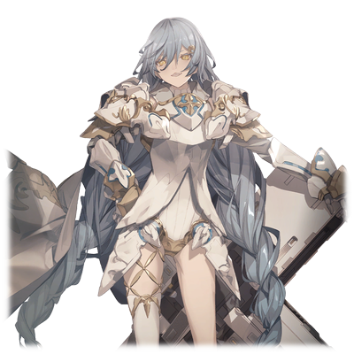

# 尼亚·尤迪特

|
角色信息 
  | 
     
     |
| ----------- | ----------- |
|  名称 |尼亚·尤迪特
|年龄 |20岁（再生后7年）
|职业|第二次归还种的卫士
|对应乐曲|Strange Love
|初出|Chunithm NEW

## Episode 1 即便奉上此身

>如果放任他们肆虐，我们就必死无疑。如果不立刻开始行动的话，这个世界是不会得救的。

因旧人类之手而荒废的地上，经历了漫长的岁月之后，终于经由真人之手重焕生机。

然而，在这终于恢复到人类可以居住的大地上，随着全新的人类——归还种的出现，局势发生了剧变。

为了争夺各自的生存权，新的战争再度于地上打响。

  

在这场战争之中，将人类送到地上的系统，接收了身为第一次归还种的蕾娜·伊修梅尔所带来的情报，于是他们调整了再生的位置，让归还种再生于安全的地带。

他们选择的，是真人的魔爪仍未触及的，大陆的极东之地。归还种就这么在此安顿下来，逐渐壮大。

  

尼亚·尤迪特，也是这些归还种之中的一员。

她对西方地区发生的惨剧，抱有极强的危机感。

如果继续让真人肆意妄为的话，他们终有一天会踏上极东的土地，将他们赶尽杀绝的吧。

  

指导者亚哈，圣女·拔示巴——随着时间推移崭露头角的真人的领导者们。

他们拒绝了机械种所提出的和平交涉和救济援助的方案，甚至举刀伸向了那些稳健派的同胞们。

由于此等野蛮的行径，如果要保护人类，亦或是这整个地上的话，也许将真人这个存在本身从地上彻底抹消才是最快的方法也说不定。

即便被人说是极端的做法也无所谓。

尼亚坚信着这样的想法。而这样的她走上战场，也不过只是时间的问题罢了。

## Episode 2 梦想的终结

>我的愿望很简单。那就是在米斯拉对这个世界绝望之前，将真人赶尽杀绝，仅此而已。

我和其他归还种一样，都是在梅尼大人的养育下长大的。

从“拔示巴战役”中生存下来的梅尼大人，不管什么事情都很擅长，众人都憧憬着她。

而我，也是其中一人。

  

我从她身上学到了很多东西。

譬如说在限定环境下的战斗和谍报活动，还有如何回避与真人之间的种族灭绝战争的方法。

  
对于经历过战争的梅尼大人来说，展露出如此才华的她，简直是无懈可击。

但是，除了一件事以外。

  
“我想要归还种与真人携手共进，一同生存下去。”

  
那就是她对真人无比深刻理解的立场。

她之所以会对此如此在意，估计也是受到了那位跟她一起战斗到最后一刻的真人的影响吧。

我的亲友·米斯拉虽然对梅尼大人的想法十分感动，但是，这种想法，对我来说却是完全无法接受的东西。

因为，他们明明是为了净化大地而制造出来的，却居然要主张自己对这片大地的所有权。

  
然而，米斯拉却不这么想。

她不但为梅尼大人的想法而感动，甚至还说要创造一个让真人在内的所有人都能够露出笑容的世界。

  
仔细一想，那就是我和米斯拉之间开始出现分歧的时候也说不定。

而最终决定了这一切的，是那场发生于我们所居住城市的爆破事件。

为了将梅尼大人杀死，他们夺走了许多人的生命，让城市毁于一旦。

虽然还没有确认到事件的罪魁祸首，但是会这么做的也就只有真人了。

事已至此，我的内心早已是出离的愤怒。

然而，米斯拉即便亲眼目睹了自己敬爱的母亲被伤至重伤，却仍旧相信着那样的梦想。

明明现实就是如此残酷，如此冰冷。

  
“呵……”

  
即便如此，她也仍旧一笑置之。

她似乎还没有注意到自己的情况。

……你注意到了吗？

陪伴在你周围的人，已经一个都没有了哦。

  
所以，我能做的事情就只有一件。

那就是由我亲手将所有的真人赶尽杀绝。

在这之后，你就随便想去哪就去哪吧。

这就是我能做到的，最好的保护你的方法。

就让我们在一切都结束后的世界再见吧。

米斯拉·特尔塞拉。

## Episode 3 天真

>艾娃大人的做法，不过只是缓兵之计。如果不立刻展开行动的话，那什么都不会改变的。

曾被拔示巴的大军攻陷的佩尔修斯殖民地，现在已经重新聚集起了就算一整个大队打来都不会惧怕的坚固防线。

但是，明明拥有这样强大的军力，可是为什么这里的指挥官却不向西方进军呢？

当我向这里的指挥官，名为艾娃·多米南斯XII的机械种询问的时候，我得到了这样的解答。

“我不打算现在就发起进攻。因为上一任指挥官操之过急，结果在拔示巴面前吃了败仗，让我们失去了许多的同胞。”

“……难道说要这么静观其变吗？”

“是的。他们的寿命很短暂。那么，不就根本没有强攻的必要了吗？”

“是这样的吗……”

  

……哼，太天真了。

像这种放任他们自生自灭的方针，我绝不会认同。

就连最前线的指挥官都是这种德行的话，那会保不住该保护的东西那也不奇怪了。

如果这样放任自流的话，最终只会酿成不可挽回的后果。所以，必须在这之前动身才行——

  

在我和艾娃大人结束了见面之后，我前往了训练场。

说不定在那里，我就能找到跟我志同道合的人们。

来到了训练场的我，稍微绕了不到一圈，就找到了足以信赖的同伴。

那些人，现在正在训练场中大放异彩。

“呵哈哈！怎么了！难道就没有一个人能伤吾分毫吗！”

长着四条手臂，手握武器，同时与数名士兵交锋的机械种——艾萨克·多米南斯VIII。

他正是曾经在拔示巴战役中葬送了众多真人的英雄。

“——可恶，没想到竟然会这么棘手，果然曾经身居将军一职不是说着玩的吗……”

“大哥，那四条灵活的手臂可真是危险啊。接下来就改变战术——”

“等等，马尔杜克。喂，那边那个女的。在那里鬼鬼祟祟的看什么？”

“……！不好意思。我是尼亚·尤迪特。是为了驱逐真人，为这场战斗拉下帷幕，从而志愿参加战斗，成为卫士的归还种。”

“哦……？”

“咦，那不就和大哥‘一样’了吗？”

  
就在这时，一阵脚步声传来，打断了对话。

“哼……”

“……艾萨克大人！？”

“哦……这双眼睛，这份志向。不错，我从你身上感觉到了坚实的意志啊，尼亚·尤迪特！”

“是！在下不甚荣幸！”

我在艾萨克大人面前敬了个礼。艾萨克大人也向我伸出了手。

“好吧……从今天起，你就来我们不对吧。安夏尔，马尔杜克！帮尼亚带路！”

两人回应了之后，就带我离开了这里。

从此之后，我就成为了艾萨克大人指挥下的游击部队的一员。

## Episode 4 不归之物

>啊啊，这是何等的恐怖……就为了那种事情，竟然将我们的身体……

尼亚加入了机械种的原指挥官，艾萨克的队伍，并且在他手下执行着任务。

在持续破坏着真人的前线基地的任务之中，尼亚也知道了安夏尔和马尔杜克与自己想法一致的事实。

本该负责警戒任务的尼亚，被艾萨克叫住，并且让她前往防卫网西部的卡拉玖殖民地周边执行任务。

听艾萨克说，那里似乎见到了所属不明的飞船的样子。

  

“虽然还无法确定，不过据说在卡斯比大地裂谷附近有危险分子正聚集在那里。”

“那么，正是因为认为那艘所属不明的飞船和那些危险分子有关系，所以才出动了威亚马里斯的吗？”

“正是。没有东西能躲过这艘威亚马里斯的法眼。呵哈哈……”

  

尼亚和艾萨克所搭乘的，正是同时拥有索敌能力和战斗能力的战术级索敌歼灭型机动兵器——“威亚马里斯”。

不光是把雷达阵列用圆顶状的装甲保护起来，在机身的各处也装备了对冲击用的盾牌，可以说是一艘会动的要塞。

当尼亚启动了大范围的索敌功能之后，片刻，雷达上就出现了几个标志。

“艾萨克大人，卡斯比大地裂谷附近出现了反应。看起来是机械种和真人正在战斗的样子？”

“状况呢？”

“现在完全沉默下来了，要前去现场吗？”

“任何不确定的要素都要清除干净。毕竟他们也有可能‘捕获’那些搭乘者啊。”

“捕获……？”

“就连归还种不知道那么详细的事情吗。那些真人，可是会把捕获的机械种和归还种当成研究的道具的啊。那些曾经在伊欧尼亚殖民地再生的第一次归还种，绝大多数都被他们杀死，亦或是捕获成为实验对象。”

“什么……怎么可能……”

听到这意料之外的事实，尼亚不禁为此颤抖。

“也就是说我们归还种的身体被……”

“对的，他们连一块肉都不会放过。”

  
然后，艾萨克将某样东西放到了屏幕上。

“——！？呜……”

出现在屏幕上的，是根本看不出一点人形的，“某样东西”的照片。

强忍着涌上心头的呕吐感，尼亚拼死瞪着画面上的内容。

  
“这是在袭击真人的研究所时所获得的资料。他们研究归还种的身体，试图优化他们自己的寿命问题。呵哈哈……虽然不过只是无谓的挣扎而已。”

“决不能饶恕他们……竟然做出此等行为……！”

就在尼亚死死盯着画面上的内容的时候，艾萨克将自己的手放到了她的肩上。

  
“！？”

  
机械身体的手掌，又坚硬，又冰冷。

简直就像是要将自己身上的体温全部夺取一般。

感受到刺骨寒意的尼亚，不知不觉将头转向了站在身旁的艾萨克。就在这时，她看到了，艾萨克那双闪烁着不详红光的双眼，还有映照于那双眼睛之中，自己无比惊讶的身影。

“你认为，这样残忍的事情，能够被饶恕吗？”

“怎么，可能……这样的行径，又怎有饶恕之理？真人，果然是必须尽早除之以后快的东西……”

“呵哈哈，正是。你就把这些画面，深深地刻在自己的脑海中吧。”

看着尼亚的反应，艾萨克满足地点了点头。

  

尼亚他们很快就来到了发生战斗的地点。

脚下是一片废墟，还有冒起黑烟的一艘气垫船和复数的战斗艇残骸。在这一片狼藉之中，有几个热源反应聚集于一艘船之中。

确认到这点的尼亚，向那艘不明的机体发出呼叫。

”这里是艾萨克将军旗下的游击部队。所属不明的机体，请立刻应答！重复一次，请立刻应答！”

果然，没有回应。

“再重复一次。请这艘船的成员立刻回答！若不回答的话——”

然而，从无线电的对面传来的，却是一个跟这剑拔弩张的空气极为不相称的，活泼的声音。

“尼亚！是我啊！米斯拉·特尔塞拉！”

“咦——米斯拉？为什么……？”

多年前已然作别的少女，却再次出现在自己的面前。尼亚的脸上写满了疑惑。

## Episode 5 划清界线

>我就知道这一天总会到来的。但是，没想到竟然这么快……

从机械种的战斗艇上出现的，是尼亚早已诀别的亲友，米斯拉·特尔塞拉。

面对这突发的情况，尼亚也不知该如何是好。

而对面的米斯拉，则不由分说地插入了对话。

“没想到居然能在这里见到你！不过，为什么你会坐在那艘船上？”

和因为与自己长久未见的好友重逢而感到高兴的米斯拉不同的是，尼亚的心中所弥漫的，却是锥心刺骨般的寒冷感情——还有对自己内心中仍对能够与米斯拉重聚一事而感到高兴的，自己的愤恨。

  

“为什么，你会在真人——”

“你这家伙！！你就是索罗·摩尼亚吗！！”

  

一个更加响亮的声音打断了尼亚的怒吼。

当艾萨克坐在后面观察着米斯拉和尼亚的互动的时候，某个“东西”映入了他的眼帘，下个瞬间，他就冲了上去，推开了尼亚。

就像是在威吓一般，他张开了四条长臂怒吼着。

  
“只不过是跟着信号来到这里，竟然能找到真人的王子啊！”

艾萨克曾经从俘虏的真人身上得知了真人的王子——索罗·莫尼亚的情报。

从此之后，除了仍旧像往常一样将真人一个不留地杀死以外，艾萨克也把索罗·莫尼亚的项上人头当成了自己的第一要务。

“为、为什么提到了我……”

“咦，原来索罗是王子吗！记得从梅尼读过的书本那里听说过这件事！”

“嘎哈哈，没想到竟然自己送上门来了啊！米斯拉·特尔塞拉，命你立刻将那个家伙引渡至此！”

  

当然，艾萨克的要求是绝对不可能得到同意的。

索罗理所当然地发出了回应。

  

“这种事情怎么都好吧！我不想被卷进你们无聊的争斗中！想打仗的，就自己去打吧！”

“哈哈，说的不错嘛。给他多说两句啊！索罗！”

“真是的，你们俩怎么还骂上了呢……！”

“愚蠢的真人们！你们还有十足的利用价值。就算你们变成一具尸体也罢！”

简直就是火上浇油。艾萨克变得更加激动。

他挥舞着四只手臂，高声宣言着。

  

“你们要是不遵从我们的意志，那我们也不会坐视不管！你们，就由我一并处分！”

对于眼见事态发展到现在这副预想之外的模样的尼亚来说，艾萨克的话语简直就是晴天霹雳。

  

“什么……艾萨克大人！米斯拉可是归还种啊。而且，我们的目的是——”

“我才不知道这些！为了成就我等的大愿，这种小小的牺牲不足为惧！现在可是千载难逢的机会啊！”

“艾萨克大人！——”

艾萨克直接切断了通讯，很快就启动了威亚马里斯的系统，进入了舰炮的发射程序。

“就靠这一发炮火，打响制压地上的第一枪吧！！！！”

炮塔瞄准了米斯拉他们乘坐的战斗艇。

摆在尼亚面前的，是朋友的性命和人类这个种群的未来。

然而，天秤的指针，却并未倾向任何一个地方。

## Episode 6 翱翔于空

>好遥远……没想到你我之间，竟然已经是千里之隔……

威亚马里斯的炮塔喷出了火舌，仿佛就像在诉说着艾萨克的怒火一般。

战斗艇在阿普斯大裂谷的废墟中穿梭着，躲避着激光的扫射。

由于炮塔迟迟未能命中目标，艾萨克难掩焦虑之色，狠狠地敲了下面板。

“呵哈哈，虽然有两把刷子，不过这也只是垂死挣扎罢了！乖乖给我炸成灰吧！！”

威亚马里斯展开了盾牌向着前方突进，巨大的船体，将撞过的所有废墟都变成了无数碎片。

  

“——艾萨克大人，要是把归还种杀死的话——”

“少废话！今天，我就要在这里把真人的王子消灭！要我放弃这千载难逢的机会，绝无可能！”

尼亚展开了威亚马里斯的火器管制系统，在尽可能的范围内进行着调整。

（现在想要阻止发射是不可能的……那么，至少要避免将米斯拉乘坐的船击毁才行……！）

只要将出力下调，稍微让瞄准的位置偏移一下就好。

她相信着，只要这样的话，就能够些许增加自己朋友幸存下来的可能。

（不能在这里失去你……！）

另一边，艾萨克为了将战斗艇逼出来，解放了机体的全部能量，让舰载炮一并发起了攻击。

无差别，无方向地射出，激光的暴雨降临于地面，在顷刻间就将所有的废墟一扫而空。

然后，在冲天的粉尘之中，战斗艇终于现了形。

面对失去隐蔽物只能成为活靶子的战斗艇，艾萨克呐喊着。

  

“去死吧！索罗·摩尼亚！！！”

“……米斯拉……”

威亚马里斯的主炮，瞄准了目标。

（求你了，一定要赶上……！）

抱着最后一丝希望，尼亚输入了最后一行指令。

与此同时，主炮也喷射出了火焰。

一阵足以倾覆整个大裂谷地带的冲击波传来。周围的东西，都在猛烈的冲击波之中，被连根拔起，然后变成看不出原型的模样。

  

“呵咔咔咔咔咔！！终于，由我艾萨克亲手剿灭了啊！！”

在主炮命中之地，已经空无一物。

看到此等情景已然确信自己得胜的艾萨克，欣喜若狂，不禁发出了喝彩声。

——然而他却并未留意到画面上仍然存在的反应源。

那正是距离废墟十分遥远的高空中。

战斗艇就这样悠然漂浮于万米高空之上。

简直就像最初就预料到了一般。

看来，就算不用自己略施手脚，她也能够逢凶化吉，开创属于自己的未来的吧。

尼亚不禁这么想到，脑海中浮现了家人的脸庞。

“——呵。”

尼亚露出了笑容，与这笑容相伴的，是一股混杂着羡慕和放弃的，难以琢磨的感情。尼亚的视线，只是盯着在空中飞舞着的少女的身姿。

“啊啊……你总是……这么简单地……就超越了我的想象呢……”

在一瞬的闪光过后，威亚马里斯传来了强烈的冲击。然后，就像是呼应着冲击一般，内部也发生了大爆炸——

尼亚在意识消失之前，轻轻地操作了下面板。

然后，就像约好了一般，尼亚失去了意识。

## Episode 7 我的世界

>不管有什么缘由，还是什么理由也好。在我理想中的世界，没有你们的栖身之所。

在索罗和米斯拉的合力攻击下，动力部受损的威亚马里斯失去了控制，坠向了地面。

虽然爆炸得以收束到最小范围，但是机体已经被破坏到难以修复的地步，变成了一堆破铜烂铁。

就在这时，一块勉强保持着原形的装甲，从内侧被人狠狠地弹开。

从里面出现的，是身体的四处都被熏黑的艾萨克，还有用四只手臂紧紧抱在怀中的尼亚。

虽然位于爆炸的中心，但身上却没有一丝伤痕。

那是因为在意识消失的前一刻，尼亚启动了紧急用的防卫系统。

艾萨克就这样踢开挡路的残骸，下降到了地面，然后将失去意识的尼亚放到了柔软的沙地上。

在确认了尼亚平安无事之后，艾萨克望向了天空。

万里无云的天空中，有一个小小的黑影。

那个黑影，是一艘位于高空中，几乎难以用肉眼捕捉到的小小的战斗艇。

  
“可恶……可不要以为这样就结束了啊……”

  
在艾萨克充满执念的话语中，尼亚苏醒了。

“——艾……萨克……大人……”

“安夏尔和马尔杜克很快就会到。在这之前就多撑一会儿吧，尼亚·尤迪特。”

说完这句话之后，艾萨克转过头，向着战斗艇的方向走了过去。

在那一刻，在尼亚的眼中，艾萨克比平时多了几分人情味。

* * *

“——唔，这里……是……呜……”

“尼亚，还不能乱动啊。”

  
尼亚重新恢复了意识，下一秒，身体四处就传来了剧痛。

由于尼亚露出了一副“为什么你们在这里？”的表情，安夏尔简洁明快地介绍了其中的缘由。

他们是收到了艾萨克的联络，才前来这里救援的。

艾萨克本人，则自己踏上了旅途，向着北方而去了。

“原来是这样吗……谢谢。我们，也得赶紧跟上艾萨克大人的脚步……唔……！”

“喂，你还是乖乖躺在床上比较好吧。要是乱动让伤势恶化，那可就得不偿失了。”

马尔杜克制止了尼亚，之后就望向了化成一堆废铁的威亚马里斯的残骸。

  
“说起来……这到底是发生了什么事啊？”

“能够破坏威亚马里斯，对方看来也不是等闲之辈啊。那么，情况也就不言自明了。”

“大哥啊，能不能用我也能明白的方式解释一下？”

尼亚在脑袋一片浆糊的情况下努力回响着当时的情况。

在机体被米斯拉的音素兵器贯穿之前，还有另外的一束光芒。

  
“为什么**真人会有……音素兵器……**”

“尼亚，想起什么了吗？”

“不，没什么。与其说这个，我们现在当务之急是赶紧前往艾萨克大人所在的地方才是。”

“还是打消这个念头吧。现在的你还是赶紧回去好好休养下比较好哦？”

“不，这种小伤……与其担心我，还不如赶紧追上米斯拉，还有那个真人……才行——”

“真是难办啊。马尔杜克，拜托你了。”

“好嘞。”

  
由于爆炸过后的后遗症，无法调整体温的尼亚，由于剧烈的疼痛，再度失去了意识。

在逐渐模糊的意识之中，脑海中冒出了那个真人的少年的模样。

——索罗·莫尼亚。

他到底是用什么方法蒙骗了米斯拉的？

但是，尼亚却能够确信一件事。

那就是，索罗终有一天会成为自己道路上的阻碍。

所以——

“在我的世界之中，不需要你们的存在。”

## Episode 8 不和谐音

>等着我，米斯拉。你所描绘的那个世界，就由我代你实现吧。

当马尔杜克和安夏尔带着尼亚回到了佩尔修斯殖民地后，他们察觉到了现在城中弥漫着的奇妙气氛。

到处都能看到士兵四处飞奔着，安夏尔似乎察觉到了什么。看到这样的安夏尔，马尔杜克露出了一副神秘的表情偷偷向他说着。

“看来，是时候了啊，大哥。”

“是啊。必须更加小心才是。”

在这之后，又过了几个小时。

当尼亚结束了治疗，再度苏醒的时候，等待她的，是真人的部队已经聚集到了防卫网附近的基地的报告。

尼亚惊讶于自己失去意识之间所发生的事情，赶忙奔向了司令部，向艾娃报告了迄今为止的情况。

  

“关于这件事，我已经听人说过了。关于叛徒米斯拉还有她们一行人，由艾萨克去处理。现在还是专心于防御的工作吧。”

“可是——”

艾娃只是平静地挥了挥手制止了尼亚的话题。

“根据报告来看，只有三名真人。区区三人，对我等的大局毫无影响。”

“……咕……”

  
已经没有继续解释的必要了。

做出这个判断的尼亚，离开了司令部。

然后，她在走廊见到了安夏尔和正偷笑着的马尔杜克。

尼亚叹了口气，向着他们不客气地问到。

“……有何贵干？”

“切切，还真是一副简单易懂的表情啊……对吧，大哥！”

“哼……”

“这种事情不用你说。”

“抱歉抱歉。那么，要怎么做呢？”

马尔杜克就像是怂恿一般地问到。

虽然，他的脸上已经是一副心照不宣的样子了。

“当然。必须保护好我们的叛徒。在此之上，将那几个共同行动的真人一并消灭。仅此而已。”

“哈，果然就得这样啊！”

“我们本来就是游击部队，那么——”

安夏尔和马尔杜克，伸出了拳头互碰了一下以示鼓励。

尼亚也跟着两人的节奏，将目光投向了两人，点了点头。

（米斯拉，等我。你所描绘的世界，就由我来为你实现吧。呵呵，呵呵呵——）

尼亚的嘴角微微上扬。

那思绪投向了远方，投向了那正前往远方的少女之处。
