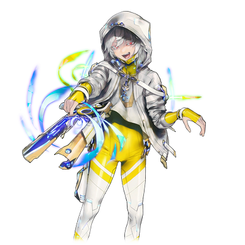

# 尼亚·拔示巴

| 角色信息   |          |
| ----------- | ----------- |
|  名称 |尼亚·拔示巴
|年龄 |20岁（再生后7年）
|职业|为世界带来美好明天的存在
|对应乐曲|βlαnoir
|初出|Chunithm SUN PLUS

## Episode 1 我和“我”

>总感觉好温暖……就像是被梅尼拥抱着一样。已经不用再痛苦了……真好啊。
“这里……到底是哪里……”

 

不知何时，我已经处在一个什么都没有的白色空间了。

在这个空间，没有任何踩在地面上的感觉。但是，看起来也不像是浮在空中的样子。

这个空间里，就像是只有我这个“个体”的存在一样。

 

我为什么会在这里？

到底是从什么时候，怎么变成这副模样的？

就连记忆都十分暧昧。

 

我最后能想起的记忆……是那个时候。

当时，我还在卡斯比大裂谷区域。

然后，在谷底的一座都市发生了战斗……并且和那个跟米斯拉一起行动的，真人的王子……。

 

“——！？”

 

突然，某个红色的东西在我的眼前闪烁着。

对了。我和那个真人的王子，被某个红色的人给抓走——

 

“呜，咕……！！”

 

突然，这白色空间的一边开始呈现出不同的颜色。

眼前出现的，是我正看着我自己的，不可思议的光景。

我正被捆在船舱中，那些真人的士兵们正站在远处眺望着我。

然后，站在他们面前的，是个红色头发的真人——

“啊，啊啊啊……！一回想起来全身都是鸡皮疙瘩……！我竟然，我竟然被那样对待什么的……！”

 

被可恨的真人威胁，吓到魂不守舍只能拼命求饶什么的……！而且，那个男人，还把艾萨克大人的头颅扔在我的面前……！

 

“不可饶恕……！那个真人……不，所有的真人！只要将他们一个不留地，全都消灭就行了！”

 

对啊，就是这样啊。

真人不需要活在这个世界上。

他们不过是为了让人类能够回归大地而制造出来打理地上的，消耗品罢了。

就在我这么想着的瞬间，出现在我眼前的光景戛然而止。

 

“这，这到底是……？”

 

——呵呵。

 

“咦？”

 

我听到了个并非来自于我的，女性声音。

好像在笑着？是谁？在哪里发出的？

 

——你一定十分心痛，痛到无法忍受吧？

 

从我耳边传来了女性的耳语声。

然而就算回过头去，也看不到任何身影。

但是，那股仿佛直接触及了脑髓深处一般的，无法名状的恶心感觉却迟迟不能消散。

 

“给我出来！你到底在哪里！”

“真的，很纯粹，很任性呢。但是，你的心正被你自己困在笼子之中呢。”

“不要用一副很懂的语气说这种话！赶紧给我出来！”

“**我**，一直都在这里哦。”

“……咦？”

 

突然，从我的身上发出了淡淡的光芒。

那些光点聚集到了一个地方……渐渐的变成了人的形状。

明明如此奇异的景象出现在我的眼前，我却无法将视线移开。

随着轮廓慢慢地清晰起来，我才注意到眼前的人，长着一张跟我很相似的脸。

眼前的人影，肯定是很像我的——什么别的东西。

那双血红色的眼睛，跟我完全不同。

 

“……呵呵。”

 

对面的女性，轻轻地触碰了我的身体。

 

“我已经‘看过’了你的全部哦。不管是你的身体，还是你的思想——我想问，身为真人的我，和你之间，究竟有什么不同呢？”

“真人！？”

 

我拼命地挥舞着双手试图赶走眼前的女人。

然而，我的手只是像扑到空气一般，穿过了女人的身体。

 

“噫！？”

“不需要拒绝什么的哦。你只要接受我就行了。”

“你要我……接受你这种家伙！？”

“你想要创造一个没有真人的世界……对吧？我也是一样的想法哦？”

 

女人微笑着。

我的身体也在渐渐的被女人吸入其中。

就像沼泽一样，怎么挣扎都没有用。一股神秘的力量正抓着我，不让我挣脱。

女人的脸已经来到了我的面前。

 

“人类所有的罪业，都在我的心中。就让你稍微看看吧……”

 

——在这么说着的瞬间。

 

“不……不要啊啊啊啊啊啊啊啊啊啊啊啊！！”

 

那个女人所说的“罪业”——那些她从其他的真人那里所遭遇的一切，全部都在我的脑海里同时上演。

 

“啊，不要……不要啊……！不要过来啊……！！”

 

明明这些光景，都只是她一个人的记忆而已。

然而，那些感觉却又太过真实了。锥心刺骨的触感，被无限蹂躏着的不快感，这一切的一切，就像是发生在自己的身上一样，在我的脑海中重演着。

 

“不行了……不要……快停下来……”

 

疼痛，痛苦，这些东西正在我的脑海中不断循环着。

不管我怎么挣扎，都不会停下来。

即便只是一瞬，对我来说那也是永无宁日的漫长地狱。

好想就此消失。好想就此逃出去。好想就此一死了之。

求求你了，把我从这里放出去——

 

“没事的。”

 

随着一个平静的声音响起，一切的痛苦都烟消云散。

回过神来，我已经被刚才的那个女人抱住了。

那感触是多么的温暖。

虽然无法理解，但我却感觉到了一股怀念的气息。

简直就像是一道将我从地狱中拯救出来的光芒一般。

 

“我也是一样的。我们都期望着没有真人的世界。”

“一样……的？”

“接受吧。这样的话，你就不会再困于笼中了。”

“我……”

“晚安吧。”

 

——一切都在沉入黑暗之中。

 

“你重要的那些人们，也会在那里相见的。”

 

——慢慢地，我沉入她的体内。

 

“让我们一同迎接美妙的明天吧？”

 

在一片混沌之中，我向着她——拔示巴，轻轻地点了点头。

## Episode 2 白色的人偶们

>那些并非真人的士兵们，一个个地向我们袭来。那些抓走了尼亚的家伙，肯定是要在这里做什么吧。

就在尼亚和拔示巴的意识正在融合的当中。

正有一群人在萨马拉坎达的都市区域展开着激烈的战斗。

他们的目的只有一个。

那就是拯救被掳走，带往绀青之都·萨马拉坎达的归还种——尼亚·尤迪特。

 

“可恶！这些家伙到底是什么啊！看着根本不像是真人的样子！”

 

然而，冲入了都市的索罗、米斯拉、泽法、约基姆四人所遭遇的，却是一群不明来历的敌人。

那些敌人从矗立于都市的中枢部的构造体之中冲了出来，全身都涂成了白色，给人一种异样的感觉。

就连看着像是戴着面具的头部，仔细一看，原来那并不是什么面具，而是这些人的脸上甚至都没有类似五官一样的东西。

 

“没想到这种地方还会有这么恶心的人偶啊！”

“——！”

“哇！这些家伙都向这里转过头来了啊！？难道说这些家伙听得懂我的话吗？”

“他们冲过来了！”

 

泽法躲在障碍物后面，向那些人偶们发动攻击。但是，瞄准头部的射击却在命中的前一刻被人偶的手臂挡住了。

子弹击碎了人偶的手臂，让其失去了平衡摔倒在地。但是不知是不是不破坏头部就不能停止行动的设计呢，人偶立刻就从地上站起来了，继续向泽法他们冲了过来。

 

“巴拉基尔！”

一道闪光伴随着巨响穿过战场。那些气势汹汹向这里袭来的人偶们，在索罗的“巴拉基尔”面前，都被轰到连渣都不剩。

 

“终于结束了吗……”

“现在还不是安心的时候！又有敌人过来了！”

 

敌人兵分两路，分成了前方的突击部队和后方的射击部队。即便前方的部队已经完全崩坏，他们却仍旧忠实地执行着命令。

光是一群不怕死，不怕损坏的人偶们的进攻，正常来说，任何有自我意识的人，面对这样可怕的敌人都会吓得魂飞魄散吧。

只要有一瞬间被恐怖所支配的话，那再精良的部队都会瞬间被瓦解。

然而，这些人偶们面对的，可不是“普通”的对手。

 

“密特隆！”

在顷刻之间就掌握了敌人的位置了数量的米斯拉，射出了数道光之箭，命中了疯狂乱窜的人偶们的头部。

飞箭的势头在命中之后也并未衰退，直接命中了后面的几只人偶，把它们一一击飞。

 

“嗯，这就行了！”

“哦！小姑娘这弓箭的威力还是一如既往的厉害啊！”

“索罗，趁现在赶紧前进吧！”

“啊啊。”

 

在确认了周围已经没有敌人之后，众人才放下手中的武器。

以约基姆和米斯拉打头阵，四人一边警戒着周围的环境，一边向着构造体前进。

 

“……”

 

索罗掩护着后方，缓缓前进。突然，他听到了一个带着杂音的机械声。

 

“索罗……莫尼亚……”

“嗯？”

 

索罗停下了脚步，环顾四周。

他的目光跟一只躺在残骸中的人偶对上了眼。

 

“索罗……莫尼亚……”

“为什么会知道我的名字……”

“我很清楚。我知道你的身世，还有那个跟你一起行动的女的事情……”

* * *

走在索罗前面一点的泽法，在注意到后面没有传来索罗的脚步声之后，转过了身。

她看到的，是索罗正和一只白色的人偶正在对话的光景。

虽然两边看起来都没有战斗的意思，但是泽法还是感觉到了其中的异样。

 

“索罗！快蹲下！”

“——！”

 

索罗匆忙蹲下。下一秒，泽法的子弹就贯穿了人偶的头部。

头部被破坏的人偶，发出了“咔嚓”的巨响，倒在了地上。

 

“没事吧？有没有受伤？”

“泽法……”

 

不知道被人偶做了什么，索罗的表情似乎有些迷糊的样子。

然后，当他认出眼前的人是泽法的时候——

 

“不、不要过来！”

“索罗……？”

 

索罗，竟然拒绝了泽法的帮助。

从他脸上看到的，是不安和怀疑，以及些许的敌意。

看着这幅被交织着无数负面感情的脸庞，泽法再也不知道该说什么话了。

## Episode 3 心之所在

>那家伙就算经历了这么多，果然还是个孩子啊。

“不要过来！”

“索罗……？”

 

面对索罗这突然豹变的态度，泽法的脸上写满了疑惑。

 

“呐，索罗，到底是怎么了？”

“这话应该轮到我说才对！为什么……为什么要一直隐瞒着我这件事？泽法……其实就是母亲的克隆体对吧！”

“为……为什么……会……”

“不要什么都不说，赶紧回答我啊！”

 

索罗的声音，就像是从很远的地方传来一样。

泽法脑中回想起的，是曾经的记忆。

 

>“也就是说……我只是拔示巴大人的……一个复制品，对吗？”

 

那是她曾经还在奥林匹亚斯殖民地居住的时候，向自己的创造者凯南发起的质问。

和其他的真人不同，她拥有跟归还种一样的，能够成长的身体，而且也拥有与圣女·拔示巴十分相近的生体情报。

但是，她却最终未能成为拔示巴的替代品，终究也只是一个跟拔示巴无比接近的存在罢了。

 

泽法决定将这件事一直隐藏到死为止。因为她不想因为这件事伤害到索罗。

然而，这一事实，却在这意料之外的场合被他人暴露出来。

而现在，知道这件事的人正在——

 

“难道凯南大人，也在这里吗……”

“不想回答吗？呐，难道对泽法来说，我是怎样都无所谓的人吗？”

“这怎么可能！索罗，不是这样的。我只是，只是不想伤害到索罗而已……”

 

泽法一直都惧怕着自己和索罗之间产生隔阂。

必须尽快做些什么才行。然而，泽法越是这么想，她的表情就越是阴沉。

看着这样的泽法，索罗不禁想到了些不好的事情，脸上已经是泫然欲泣的模样。

 

“那个家伙……那个被泽法打倒的人偶！甚至连我的事情都知道的一清二楚！甚至知道**我的父亲是什么人**！这种事情，泽法你不也该很清楚的吗！”

 

面对如此直接的告白，泽法只有哑口无言的份。

现在的索罗被那个人偶蛊惑了，处于非常不安定的状态。绝对不能说错话。要是说错话的话，索罗说不定就会离开自己——

 

“我，我……”

 

就像是要逃离那质问的眼神一般，泽法稍微把视线移开了一点。

 

“……！”

“啊……索罗……！”

 

泽法试图伸出去的手也被索罗拨开，索罗就像是要逃开泽法一样，向着反方向头也不回地跑了出去。

听到索罗的声音，前面的两人也赶了过来，然而早就已经看不到索罗的身影了。

 

“必须赶紧追上索罗才行……！”

“泽法，这到底是发生了什么事！？”

“其实是……”

 

“——没想到大老板竟然也在这里啊……总觉得有些蹊跷呢。”

“约基姆难道知道凯南的事情吗？”

“嘛，这就是大人之间的事情了。话说回来，现在时间可是很宝贵的，索罗就交给我处理吧。你们就继续前进如何？”

“咦，可是这么宽广的地方……”

“找起来很麻烦而且很危险，对吧？不过啊，要是在这种情况下各自分头行动的话，到时候重新汇合的风险就更大了。但如果反过来集体行动的话也会浪费很多时间。所以，这种时候就交给身为‘专家’的我吧。”

 

约基姆·雅木尔，曾经也是真人的督战队的成员。

而他的动作，就是找到那些临阵脱逃的士兵，并且“杀死”他们。

所以在这种场合下，没有比他更加适合的人选了。

 

“……”

 

米斯拉虽然还是一副想问的表情，但是看着约基姆真挚的眼神，还是决定将一切都交给他负责了。

 

“那，我们就待会见咯！泽法也没意见吧？”

“嗯嗯，是这样的呢……我想，现在的索罗应该也不想面对我吧……”

“那就这么定了。那么，我去去就回！”

 

整好因为刚才的战斗被打乱的发型，约基姆向两人举起了个大大的拇指。

然后就一溜烟地离开了这里。

 

“索罗……一定要平安无事啊……”

 

朝着索罗消失的方向祈祷完，泽法就跟米斯拉继续前进，向着构造体的内部进发。

## Episode 4 不为人知的意志

>我们一直都在追寻着拔示巴的幻影……这样的事情，究竟要持续到什么时候？

