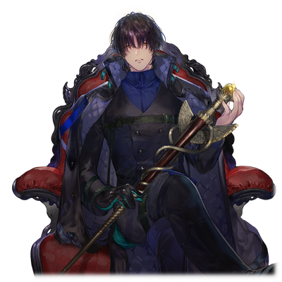
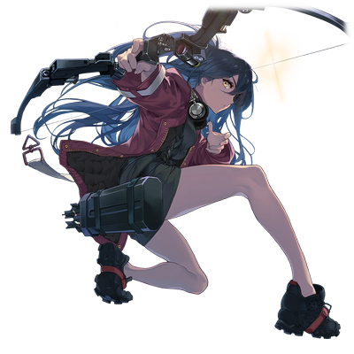

# 洛特·十二

|
角色信息 
  | 
     
     |
| ----------- | ----------- |
|  名称 |洛特·十二
|年龄 |外表年龄25岁（制造后11年）
|职业|军人
|身份|强硬派特殊部队的队长
|对应乐曲|WE'RE BACK!!
|初出|Chunithm NEWPLUS

## Episode 1 父与子

>这双眼睛，这幅牙齿，这双耳朵。我和你，都是用同样的素材制造出来的哦？

一缕朝阳的霞光，照入了卡斯比大裂谷的谷底。

在一阵冲天的烟尘之中，一个物体穿梭而过。

那是属于真人强硬派的特殊部队的，深红色的战斗艇。

而这艘船，正是刚刚结束了在新涅摩亚的战斗的，洛特他们的船。

 

“～～♪”

 

一阵悦耳的口哨声正在艇内回响。

 

“心情不错啊，洛特。”

“啊哈，倒也不是遇上什么好事，就和平常一样啦。”

 

靠在船长的座位上，把脚放到控制面板上的男人——洛特·十二，正向屏幕对面的人说话。

 

“那么，想必你也获得了相应的成果了吧？”

画面对面的男人——凯南，他正皱着眉头，眼中满是怀疑。

 

“当然，我还觉得这次做的意外地好呢～♪”

“闲话少说。让我看看成果吧。”

“真是急性子。也好，你要的东西就在这里哦。”

 

洛特这么说着，从椅子上降了下来，回头走去。

 

“锵锵锵！”

 

在那里的，是两个失去意识的人，一男一女，正躺在船舱的地板上。

 

“您想要的人就是这两个人对吧？”

“不错……本该这么说的，另一个人去哪了？”

“那位啊，让他逃走了。虽然说是代替品，不过，这也是凯南大人梦寐以求的东西吧？”

 

洛特把某样东西放到了画面跟前。

那是一个远远大过洛特的头数倍的——

 

“——！”

 

透过屏幕都能察觉得到对面的态度变化。

领悟到这点的洛特心情也好了起来，吹着口哨向着屏幕露出了个狡黠的笑容。

 

“哼哼，难道说，成功给了你个惊喜？”

“……那么，之后就安排时间碰头吧。”

“哈~真是不配合啊。明白啦。那么，后头见——”

 

洛特确认了汇合地点之后，切断了通讯，吹起了愉快的口哨。

就在这时，从他背后传来了些微的呻吟声。

 

“哦，才刚说到你呢……”

“………………这里，是哪里……”

 

躺在冰冷的地板上，索罗·莫尼亚终于从深沉的睡眠中苏醒。

 

“我记得我……”

“早上好，索罗君！睡得还好吗？”

“你是……！……啊，咕……”

“哼，看来你的脑子还是一片混乱的状态呢？”

 

洛特不停地戳着仍在混乱之中，不停呻吟着的索罗的头。

由于手脚都被绑住，索罗无法反抗。

 

“你这家伙……！”

“还挺有活力的嘛。不过要是太吵的话，我可要惩罚你了哦？”

“啊……”

 

洛特伸出手掐住了索罗的脖颈。

随着他缓缓地加大力道，索罗的脸色就越来越难看。看着这样的索罗，洛特的嘴角些许上扬了几分。

简直就像是在宣示着他的性命就在自己手中一样。

 

“感觉到了吗？在我的手指之下，你的血管正拼命地跳动着，输送着血液呢，是不是难受到说不出话了啊？”

 

即便索罗痛苦地呻吟着，他仍旧用充满敌意的视线瞪着洛特。

就像用眼神说着，即便被你们再怎么对待，也绝不会屈服于你们一般。

看着这样的索罗，洛特突然松开了手。

 

“咳……咳……”

“开——玩——笑的啦。你是不是刚刚觉得自己就要死了？放心放心，我可根本没有要杀了你的念头哦。嘛，其他人就不知道了♪”

 

“可恶……为什么你们这群人就不肯放过我们啊！”

“嗯~难道说你到现在还不懂吗？不懂自己为什么会被盯上这件事？”

“……哈？”

 

洛特晃了晃自己右手的腕轮。

 

“就让我告诉你吧，不然也太可怜了。”

 

还不等索罗回答，洛特就说了下去。

 

“自从**母亲**死去之后，那些担忧这个种群的未来就此终结的家伙，就开始了各种各样的实验。利用那些来自指导者亚哈的‘遗产’……而其中之一，正是利用母亲和你的细胞进行的实验。”

“我的……细胞……”

 

索罗的脑中开始回想起年幼时期被迫进行的“实验”的记忆。那些被科学家们肆意摆弄的那段日子。

 

“与优秀的真人的细胞互相组合，利用母亲和你的细胞组合制造……哦对，那边我记得最后是以失败作结的来着？总之，实验最终的产物……就是像**我**，还有**沃特**这样的人。”

“什么……那，所谓的**母亲**是……！”

“恭喜你！索罗君！终于跟自己的‘家人’相认了呢！”

 

洛特缓缓地蹲下来，在索罗的耳边说到。

 

“我可一直都想见你一面啊……‘**父亲**’。”

 

这冷冰冰的话语，直接穿透耳膜，令索罗心惊胆战。

在那个瞬间，索罗仿佛被人握住了自己的心脏一般，回过神来，他才发现自己已被冷汗浸湿了衣服。

 

“很有趣是吧？明明怎么看，都是我的**岁数比较大**对吧♪”

 

和刚才说那句话的虚无表情不同，洛特又回到了平时开朗的样子。

 

“大家会盯上你，说不定就是因为你拥有和**母亲**一样的生殖机能呢。所以大家基本上都坐不住的，甚至还有对你嫉妒到疯狂，恨不得杀之而后快的家伙在呢。反正，你就算逃到天涯海角，都没有用的。这，就是你的命运♪”

“……别开玩笑了！什么命运啊！那种家伙，我才不知道是什么东西啊！”

“呵呵，这想法还不错呢！越来越欣赏你了♪该说不愧是我的**父亲**呢！”

 

洛特吹着口哨，从衣服中取出了某种药剂。

 

“虽然还有很多想说的，不过现在可是休息的时间了哦♪”

“可恶，给我住手——”

“回头见，**父亲**——”

 

无法抵抗，只能被注射药剂的索罗，在逐渐混沌的意识之中，他看到了洛特手上的腕轮。

那上面的肖像，似乎曾在哪里见过。

简直就像是再熟悉不过的母亲，拔示巴的模样。

## Episode 2 与母亲一起

>实验体SS-012。这就是我的名字。

“实验体SS-012……没有生殖机能，肉体的成长能力……似乎也很低啊。”

“……结果又是个失败品吗。明明都提取了优秀的战士的胚胎进行组合培养，不管哪个都派不上用场的样子。”

“没啥，用途什么的还多着呢，就当是多了几具实验用的素体就行了。”

“嗯，这些家伙能‘活久点’，就好了。”

 

就在我们正躺在手术台上的时候，他们就在那里淡淡地说着这些话。

当然，我们从一开始就没有拒绝的权利。甚至没有许可都不许发出声音，仔细想想也是理所应当的。

 

“为了我等的未来，你们可要好好贡献自己哦？”

 

周围传来了悲鸣与呜咽，还有那不成声的惨叫。

那些家伙冷漠地看着我们绝望的表情，确认着我们的身体的“可能性”。

 

“第十二号实验体还挺有意思的。面对痛苦，他似乎有着和其他人不同的反应。这个如同信仰着什么东西一样的笑容是从何而来的？又能够持续到什么时候？”

 

这，是那些摆弄我身体的家伙们常挂在嘴边的话语。

听那家伙说，我跟那家伙的“相性”似乎很好的样子。

不管什么样的痛苦都能忍受并且露出笑容的我，对于那家伙来说，似乎是能够满足他的要求的，极好的研究对象。

那些被打上了失败品的印记的我的兄弟们，渐渐地都无法忍受这样的地狱，甚至有试图“中途退出”的人。

但是，我们甚至连这样微小的反抗都不被允许，身体自发地拒绝着自绝性命的想法，我们也只能够在这具身体达到其极限之前，拼命地活下去罢了。

……但是，就算这样。

我也不想这样被人持续操弄着，直到死去。

 

我能够在这残酷的实验中支撑下去的理由。

那就是在我出生的时候，一直残留在我脑海中的，母亲的记忆。

在我记忆中的母亲，一直都在哭泣着。

所以，我想要为母亲加油打气。

母亲，不要哭了？只要我努力的话，就能够停止哭泣了吗？

每当疼痛袭来的时候，我的脑海中始终在思考着这件事。

实验体的序号还有母亲的记忆。

这些，就是我所唯二拥有的东西，也是我最重要的东西。

 

今天，在我结束了他们的实验之后，我听到了他们的谈话。

 

“听说了吗？索罗的那个研究所似乎遭到了袭击哦。”

“什么？那索罗本人呢！？”

“那个……据说是被什么人掳走，行踪不明。”

“这可大件事了。要是不能向上级上交样本的话，指导部的供给就会被断掉的！”

“既然再也拿不到实验体的话，那就只能赶紧打包整理下现在的失败作上交给指导部才行……”

 

我终于明白了。我们在生物学上的原型，正是被称作索罗的人物。

在那之后不久，实验就来到了最终阶段。

以为会跟平常一样被带到实验室的我们，却被发了枪械，送到了一处广阔的废墟。

不知道从什么角落传来了他们的声音。

 

“现在开始最终测试。最终合格的人，将会离开这里，光荣成为一名能够为真人的未来鞠躬尽瘁的战士。”

 

终于能够跟这地狱般的生活说再见了。有些人已经喜极而泣，然而，下一句话，就将他们这些微的希望打了个粉碎。

 

“那么，开始测试。”

“请等一下……！那，我们的目标呢……”

“不是已经在这里了吗？在你们的**面前**啊。”

 

是的。所谓的“目标”，就是站在这里的，曾经朝夕相处过的兄弟们。

在如此残酷的指示面前，没有人能够接受这个事实。

 

“来吧，自相残杀吧。证明自己是最优秀的那个！”

 

即便是经历了如此地狱的我们，在这期间也是有些感情的。而正是知道这点，他们才选择了让我们自相残杀。

我们直到最后也不过是他们的玩具罢了。就在我们认识到这件事的瞬间，突然，枪声响起。

听到了什么人倒下的声音。还有悲鸣和嘲笑声。

废墟顷刻间就变成了残酷的战场。

我不想跟他们战斗，于是便立刻逃离了这里。

但是，我的兄弟们却向我开了火。

从腹部传来了灼烧般的疼痛。

随之而来的，是血液像喷泉一般从伤口处流了出来。

——好痛。

明明平常面对这样的疼痛都是无所畏惧的。

但是这次却不一样。只要有些许的闪失，我就会横死当场。对死亡的恐惧缠上了我的心头。

好痛，好痛，好痛！

我因为疼痛蜷缩在地上。突然，一个人骑到了我的身上。

 

“必须杀死才行……必须杀死才行！”

 

长着和我同一张脸的男人。

身体已经因为恐怖颤抖不已，就连枪口也止不住地颤抖着。

死亡即将到来。看着黑漆漆的枪口，我在想，只要那个枪口喷出一阵火舌的话……就能够从这连死亡都不被允许的日常中解放了吧？

既然这样……那不就足够了吗。

已经可以放弃了吧……。

就在被逼到山穷水尽，放弃了生的希望的我的面前。

 

“杀了他。”

 

我的脑海中响起了声音。……响起了母亲的声音。

 

**“你要是随随便便就死掉的话……我可不会饶了你的。”**

 

明明一直都在掩面哭泣的母亲。

只有那一天，她却流着如鲜血般鲜红的血泪，笑着对我这么说到。

 

杀了他，杀了他。

 

——回过神来，我已经通过了最终测试。

通过把在场的兄弟们，还有那些研究者们杀死的方式。

 

“哈……我终于明白了，母亲。”

 

到底该做什么事情。

在我和母亲合为一体的那天，才是我的人生真正的开始。

 

在那之后，我被分配到强硬派的战斗部队，开始了以战斗为生的日子。

每一天，我都在参加战斗。

而在战场上七进七出，每次都得以平安回来的我得到了赞赏，被奥林匹亚斯殖民地的指导者们传唤了过去。

 

“在我看到实验体数据的时候我还在怀疑自己的眼光……干得还不错嘛。你就作为我的手下，继续努力吧。”

指导者·沃特。

引导着真人的指导者之一。

同时，也是在别的设施里和我一样被植入了母亲的记忆而培养出来的……弟弟。

## Episode 3 风起云涌之策谋

>哎呀，我可真是个大忙人呀！果然在背后帮忙工作就是不容易呀♪

几辆车正从阿纳多利亚方向向着佩尔修斯殖民地行驶而去。

在车队的最末尾处，带着眼罩的红发男，洛特，正坐在车上小憩。温暖的阳光与轻柔的晃动，令他沉浸其中。

 

“——喂，喂！洛特，你听到了吗！”

 

但是，这样舒服的闲暇时光，也随着一道呼唤着自己的声音结束了。

睡眼惺忪地望向屏幕，洛特似乎看到了个正在画面的另一边喊着自己名字的人。

 

“啊……沃特啊……有什么事吗？”

“我在问那个臭小鬼的事情！”

“真是冷漠啊，那可是我们的‘**父亲**’啊？”

“别、别提那个！只、只、只是想到这个东西就已经毛骨悚然了！”

“怎么会呢？那可是跟你最喜欢的妈妈留着同样的血哦？这不是很好吗？”

“就是因为这个！令人无法忍受啊！”

 

沃特神经质一般地念着“母亲大人”几个字，持续了片刻，他的愤怒才平静下来，渐渐地回到平时的样子。

这就是沃特自己如何平复情绪的方法。

已经与沃特共事甚久的洛特清楚这一点。

只要一听到索罗的名字，他立刻就会着急。而等到沃特冷静下来之后，洛特便继续向他询问之后的事情。

 

“记得是找到的话就立刻干掉对吧？不过啊，这件事，真的有那么重要吗？”

 

本来，洛特的任务是歼灭展开于阿纳特里亚半岛东部的机械种的工兵部队的。

本该是影响后续战局的重要任务，但对于弟弟沃特来说，没有什么能够比杀死索罗更重要。

 

“不要紧。必须在这个家伙成为全体真人的威胁之前，消灭他。”

“……噗，怎么看都是私人的恩怨吧？”

“你刚刚说什么？”

“没——什——么——哦♪”

 

洛特切断了通讯。

 

“……嘛，反正我是不会杀掉索罗的就是了。”

 

一边嘟囔着，洛特切换了通讯机的频率，向自己的部下们下达了指令。

 

“啊——啊——，全体命令！放弃现在的任务！从现在起，我们前去追击逃跑的王子！各位，赶紧准备！”

 

洛特所率领的特殊部队，为了确保移动的手段，前往了距离他们最近的卡拉玖殖民地。

 

在那之后，洛特他们虽然在卡斯比大裂谷的南部地带遭遇了索罗等人，但由于米斯拉·特尔塞拉意料之外的闯入，不得不仓皇撤退。

补充完物资和装备之后，洛特再次开始了追击行动，突然，一通来自某个人物的呼叫传到了基地。

 

“洛特，进展如何？”

“哦，是凯南啊。我们已经找到那个王子了。正如情报所说，跟着个夸张发型的小哥一起行动呢。”

“是吗，看来一切顺利呢。之后呢？”

“嘛，直到途中还是万无一失的啦，不过之后来了个归还种的女子，坏了我们的好事。”

“哦？详细说一下吧。”

 

洛特简明扼要地解释了发生的事情。

 

“那名归还种，确实有趣啊。”

“那，要以她为‘**目标**’吗？”

“是的。为了让我们的计划万无一失，归还种是不可或缺的。”

“明白啦。还有什么补充的吗？”

“啊啊，虽然这才是正题来着……”

 

洛特难得地感觉到了凯南语气中的焦急。

听凯南说，与机械种的战争，很有可能提前爆发。既然是来自管理情报的他，那应该不用怀疑是真是假了吧。

正因如此，他才会如此迫切地加速自己的计划。

 

“嘛，反正最急的肯定是沃特啦。凯南，难道说你知道索罗君和归还种汇合之后的位置吗？”

“啊啊，这个放心吧，已经知道他们在哪了。”

“有一手！不过，你到底是从哪里得到的情报啊？”

“我只能说是来自信得过的‘朋友’，这样可以吗？”

“……哼，‘朋友’，啊……”

 

虽然连自己都无法得知盟友的真实面目这件事令洛特察觉到了违和感，但如果自己自作主张去寻求真相的话，有什么闪失，想必自身也难保。

把这件事放在之后解决，洛特决定先专心于眼前的任务。

* * *

洛特带着装载着长长的炮管的武装车辆再次来到了大裂谷地带。这些装备，是为了之后的战争而制造出来的歼灭兵器的其中一部分。

当他们到的时候，已经是日落西山。周围都被晚霞染成了同一种颜色。

 

“只要在这里的话那些机械种就会上钩吧……真是的，到底要我们等多久啊！”

 

千里迢迢而来的洛特一行人，就这么在远处眺望着大裂谷地带。过了好一阵时间之后——

那个时刻，终于是到来了。

在他们监视着的沙漠之中，突然闪过一道喷口火焰般的闪光。

接着，出现在空中的是……宛如要塞般巨大的机动兵器，而这机动兵器所率领的，正是机械种的部队。

 

“不错嘛，越来越有趣了哦？”

 

洛特立刻接通了凯南的通讯。

 

“——是我。”

“那些家伙真的来了哦。您想要的，是归还种对吧？”

“啊啊，期待你的成果。”

“明白啦，那就为了母亲，再尽一份力吧。”

 

洛特从车辆中伸出身子敲了敲腕轮。

以此为信号，后面待机着的士兵们立刻静默地开始了行动。

在这片被众人所遗忘的禁忌之地，真人与机械种之间的谋略，即将在此交锋。

## Episode 4 骑士与狂犬

>哼哼，那些碍事的家伙都已经被我收拾干净了！果然打的越顺利的仗，就越是要享受啊！

在洛特的奇袭攻击之下，机械种失去了制空权，末尾的船要么被击坠，要么就是不得不撤离，弄得机械种阵脚大乱。

 

“哼哼，果然单方面的碾压就是无比爽快啊♪只要这样一直保持压制下去就……咦！？竟然能反弹我们的攻击，太狡猾了吧！？”

 

出现在洛特他们面前的，是大型战斗艇“威亚马里斯”。

覆盖船体的力场，将洛特他们的炮火尽数反弹。

 

“原来如此，如果要击坠这个大家伙的话就需要用那个啊。炮兵队！准备好了吗！？”

“是！随时都可以开火！”

“那么，就赶紧把它打下来吧！”

 

随后，大裂谷闪过了一道光芒。

那道光与威亚马里斯的力场互相碰撞，霎时间，大裂谷的深处被强光笼罩，仿佛白昼。

在力场被破坏的瞬间，洛特下达了齐射的指示。

很快，生成力场的装置就被破坏，威亚马里斯也向着谷底的青蓝色都市坠落下去。

以此为契机，战场的局势发生了巨变。

幸存的机械种部队，由于失去了旗舰，纷纷选择了撤退。

战场的局势已经完全落入洛特等人手中。

接着，洛特下达了占领都市的指令。

将都市中央的高塔和炮台破坏掉，将都市的机能封锁，这样就能组织敌人的攻击了。

 

“哼哼，这样就没人能阻碍我了♪”

 

接下来，只要完成最初的任务。

——回收**两名归还种**以及索罗即可。

洛特本想先前往威亚马里斯的坠落点，却突然看到某个东西从威亚马里斯的残骸中飞了出去。

那是一艘小型的战斗艇。

不可思议的是，这艘船却不是朝着都市外飞去，而是向着都市中心直冲过去。

洛特立刻眯起了眼，笑着说到。

 

“嗯，今天的运气果然很好啊♪”

 

洛特接通了炮兵队，让他们往指定的地点开火。

虽然从爆炸的火光上看距离指定的位置有点偏差，但爆炸的冲击波已经足够波及机械种的飞船了。

 

“嗯嗯，果然做事就是要万无一失呢♪”

 

在陷入火海的都市之中，洛特乘着飞船来到了都市的中央地带附近。

因为实在是难以降落，于是洛特决定利用缆绳进行索降。

被炮台破坏的都市的地下区域，现在已是一片狼藉。

 

“啊哈，看来炸的挺厉害的嘛~喂，归还种，还活着吗？”

 

等到其他士兵跟着降落到地上开始搜索之后，洛特突然听到了附近传来的一个声音。

仔细一看，在那堆瓦砾的底下，一个机械种正倒在那里。那正是之前在沙漠之中就严加监视的，机械种的大将，艾萨克。

钢铁铸成的巨体已经严重损伤，四只手臂中的两只已经被扯断，从裂口处迸发出小小的火花和悲鸣一般的驱动音。

看他的样子，就像是为了保护什么东西一样，正屈膝跪于地上。

 

“咕……噶……”

“咦~已经这么破破烂烂的了，居然还活着吗？真不愧是机械种呢！”

“是你，干的……好事吗……”

“不错——♪应该从没想过自己会吃了这样的亏吧？要怪就只能怪你自己的疏忽咯？”

“你这……玷污了神圣的战斗的……卑鄙小人！！”

 

随着怒吼，艾萨克将覆盖全身的瓦砾一举扫开站了起来，在他身下的，是已经失去了意识的归还种的少女——尼亚。

 

“原来是为了保护别人吗，没想到你还挺喜欢逞英雄的？虽然说思维还挺古板的，不过这样就可以理解了♪”

“……混账东西，嘴皮子还挺利索啊。竟做出如此邪道的行径，你们就罪该万死啊！”

 

艾萨克摆起架势，试图以他巨大的身躯震慑洛特等人。

 

“不是吧？真的想打？”

“当然！只要我还活着……必定会为尔等带来制裁——”

“好啦好啦！差不多也玩够了！各位，准备战斗——！”

 

随着洛特敲响腕轮，散开队形的士兵们很快就以二人为一组聚集了起来。

只要洛特一声令下，艾萨克很快就会变成一堆废铁的吧。

 

“奇袭之后，还要以多欺少吗。你们这群不聚起来就做不了事的乌合之众啊……！”

 

艾萨克一步又一步地走近洛特。

但是，即便是在几乎是两倍高度的巨体面前，洛特的表情仍旧是那么轻浮，毫无变化。

不但如此，甚至就像是在享受一般，笑得更加灿烂。

 

“呵呵，我自己都兴奋起来了啊……”

洛特张开着双手，优雅地走到艾萨克的面前。

“那么，游戏开始♪”

钢铁骑士的咆哮声，响彻了整个战场。

与这些玷污了战场的恶徒们的死战，即将展开。

## Episode 5 决一雌雄

>战斗什么的，从来就没有正当与邪恶之分。那些只不过是连一点战斗都不参加的人们所编造的幻想罢了。

艾萨克首先开始了行动。

他高举着钢铁的手臂，宛如鞭子一般对着洛特头顶挥了下去。

但是，对于洛特来说，攻击方向如此明显的招，闪开不过是轻而易举。

 

“哼哼，空门大开啊！”

 

洛特连枪都没拔出来，只是两手插在外套口袋里，轻描淡写地闪过了攻击。

 

“耍小聪明的家伙！”

 

艾萨克的双臂从洛特的头上略过。

如此凶狠的攻击，即便是强化过肉体的真人，只消一击也会粉身碎骨的吧。

但是，即便距离死亡如此接近，洛特却也没有一丝恐怖的表情。

依旧是那副天真浪漫的模样。

依旧在那里一边笑着，一边躲避着。

战斗自始至终都是一边倒的样子，艾萨克拼命地向着洛特发动攻击，但却未能伤及分毫，战况就这样一直僵持着。

 

“哎呀，难道已经结束了吗？”

“你这家伙……明明拥有这样的力量，却为何不光明正大地战斗！”

“因为啊，很有意思不是吗？欺负你这样的弱者。每次看你在那里拼命地想要打中我，看着就很可爱啊♪”

“……无需多言了！”

 

艾萨克怒吼着，向着洛特冲了过去。

 

“虽然还想在多玩一会儿的……抱歉，玩腻了。”

 

洛特抬起右手举到脖颈的高度之后，用大拇指往脖颈处划了一下，向周围的人发出了指示。

下一秒，艾萨克就被四面八方袭来的炮火吞没……再也站不起来了。

 

“虽然说如果是万全的状态的话，应该能轻松地把我杀掉吧……但没办法，这就是战争啊♪”

 

洛特露出满足的表情点了点头，指示士兵们上前回收。

就在士兵们把尼亚搬上船准备离开的时候。

一艘战斗艇冲破浓烟，飞越了他们的头顶，扬长而去。

洛特很快就意识到了索罗就在这艘船上。他立刻通知了在上空盘旋待机的飞船，准备将他们一并击落。

但是，下个瞬间，两个身影就出现在了空中，并且朝地面坠落而去。

 

“哦？哦哦？今天还真的是撞大运了啊♪”

 

不知是不是不幸中的万幸呢。

空中的那两个人影，其中之一，便是洛特一直在寻找着的目标，索罗·莫尼亚。

## Episode 6 明暗

>没想到回收了归还种之后，还有意外收获啊。看来母亲的愿望，只要再努力一下就可以了吧♪

一缕朝阳的霞光，照入了卡斯比大裂谷的谷底。

在一阵冲天的烟尘之中，一个物体穿梭而过。

那是属于真人强硬派的特殊部队的，深红色的战斗艇。

而这艘船，正是刚刚结束了在新涅摩亚的战斗的，洛特他们的船。

 

“～～♪”

 

一阵悦耳的口哨声正在艇内回响。

 

“心情不错啊，洛特。”

“啊哈，倒也不是遇上什么好事，就和平常一样啦。”

 

靠在船长的座位上，把脚放到控制面板上的洛特，正向屏幕对面的凯南说到。

 

“那么，想必你也获得了相应的成果了吧？”

凯南皱着眉头，向着洛特露出怀疑的视线。

 

“当然，我还觉得这次做的意外地好呢～♪”

“闲话少说。让我看看成果吧。”

“真是急性子。也好，你要的东西就在这里哦。”

 

洛特这么说着，从椅子上降了下来，回头走去。

 

“锵锵锵！”

 

在那里的，是两个失去意识的人，一男一女，正躺在船舱的地板上。

 

“您想要的人就是这两个人对吧？”

“不错……本该这么说的，另一个人去哪了？”

“那位啊，让他逃走了。虽然说是代替品，不过，这也是凯南大人梦寐以求的东西吧？”

 

洛特把某样东西放到了画面跟前。

那是一个远远大过洛特的头数倍的——

 

“——！”

 

透过屏幕都能察觉得到对面的态度变化。

领悟到这点的洛特心情也好了起来，吹着口哨向着屏幕露出了个狡黠的笑容。

 

“哼哼，难道说，成功给了你个惊喜？”

“……那么，之后就安排时间碰头吧。”

“哈~真是不配合啊。明白啦。那么，后头见——”

 

洛特确认了汇合地点之后，切断了通讯，吹起了愉快的口哨。

就在这时，从他背后传来了些微的呻吟声。

 

“哦，才刚说到你呢……”

“………………这里，是哪里……”

 

躺在冰冷的地板上，索罗·莫尼亚终于从深沉的睡眠中苏醒。

 

“我记得我……”

“早上好，索罗君！睡得还好吗？”

* * *

与此同时。

米斯拉，泽法，约基姆三人，在脱离了船坞之后，便与洛特的部队展开了战斗。

三人拼尽全力才击破了敌舰杀出了一条血路，但也不得不先行离开此处。

等三人打算救回索罗，回到船坞的时候，一切都已经太迟了。留在那里的，只有两名机械种的残骸而已。

 

“没想到连那位机械种的老大都被打成这样啊……”

 

约基姆向着这名曾经交战过数次的机械种将领行了一礼。

不可思议的是，只有艾萨克的**头颅**哪里都没找到，在脖颈处，发现了被什么东西切割过的痕迹。

 

“尼亚……”

“小姑娘，至少打起精神吧？这位机械中的老大也是为了小姑娘你的朋友才拼死奋战的啊。肯定是被刚才那个家伙抓走了吧。”

“……嗯。我要去找到他们！”

“哦，哦哦。还是老样子，恢复的真快啊。这点也值得我们学习一下呢……不管是我，还是泽法……”

 

约基姆望向了正向着米卡——也就是新涅摩亚殖民地的支配者的残骸默默流泪悼念着的泽法。

虽然从结果上看双方只能以争斗收尾，但是，泽法仍旧跟她一样，想要保护这座城市里的人们。

 

“对不起，把你们最为重要的世界，卷入了我们的战斗中……”

 

虽然是被意外卷入的战斗，但从结果上看是他们的惨败。

敌人也已扬长而去，不知所踪，到底该怎么做才能救出索罗和尼亚呢？

虽然现在还未决定之后的行动方针，但仅凭他们，想要在这广大的大地上追踪索罗等人呢？

 

“那么……之后该怎么办呢……”

 

就在约基姆嘟囔着的时候，米斯拉就像是察觉到什么一样，向着某个方向走去。她似乎正望着天空的某个角落，细细聆听着风吹草动。

 

“嗯？小姑娘，你在——”

“等等。我刚刚听到什么东西的声音！”

 

米斯拉向约基姆指示了方向之后，就不等他们反应，径直冲出了船坞。

约基姆慌忙跟了上去，发现一艘遍体鳞伤的战斗艇，现在正降落在他们面前。

那艘船的形制，和米斯拉他们乘坐的船十分相似——

 

“难道说……是那个机械种的将领的残存部队吗！？”

 

后舱门打开。从中出现的，是两个男人。

“那个，你们是谁？”

## Episode 7 预料之外的逃走剧

>哼，归还种还真是厉害啊。还是说，只是那孩子比较特殊而已？这下可有趣了啊~♪

“嗯~难道说现在很不妙吗……？”

 

洛特现在为自己的判断而后悔了。

为了尽早完成凯南的任务，他们就直接驾驶着损伤惨重的战斗艇准备返航，然而，就在这节骨眼上，敌人就追了上来。

追兵是紧随其后的两艘战斗艇。

不管哪艘都是在新涅墨亚的战斗中幸免于难的，机械种的飞船。

如果只是这样的话，就算仅凭现在的部队，洛特也有自信能够处理。

但是，其中的一艘船上搭乘着的人，却给洛特带来了很大的麻烦。

 

“那家伙，到底是怎么站在上面狙击的啊！？”

 

洛特说的，正是出现在画面上的——**立于战斗艇机身之上的少女**。

 

“泽法，稍微往右转下！”

“我知道了！”

 

把自己固定在船体上部的少女——米斯拉，正曲着身子拉动弓弦。

在与最新型的音素兵器“米特隆”联动的眼罩内部，苍蓝色的眼瞳精准无比地捕捉到了洛特他们的红色飞船。

然后，释放出来的光之箭矢穿过了一艘艘飞船，正确地“掠过”了目标。

“干得漂亮！这样就离他们更近了！”

“好，再来一发！”

“真是的，就在我以为已经习惯小姑娘你这行事风格的时候，又整这么大的活儿啊……！”

“啊哈哈，是吗？不过，既然约基姆都已经认真起来的话，那这种程度也是没问题的吧？”

“至少不会像你这样干啊！”

 

约基姆向着跟随其后的战斗艇问到。

 

“呐，你们这边怎么样？”

“……不，对我们来说，她的行为也远远超出了我们理解的范畴啊。”

 

另一艘船上搭乘着的，正是之前在新涅墨亚殖民地遇到的两名归还种——安夏尔和马尔杜克。

身为艾萨克的部队的幸存者的二人，为了救出尼亚，才与约基姆他们一同行动。

 

“大哥啊，我也能做到那样子吗……”

“我不会骂你的。所以别这么做了。”

 

安夏尔和马尔杜克看着初次见面的米斯拉如此大胆的行动，似乎都很惊讶的样子。

米斯拉站在船体外围，听着通讯，为船舱里的同伴们传达前方飞船的动向。

 

“泽法！那边的船动了！”

 

正如米斯拉所说，飞在前方的四艘船，其中两艘在空中划了一道弧线，回过头向这里冲了过来。

为了让泽法他们的队形打乱，两艘船冲向了泽法他们的飞船中间，试图将他们各个击破。

泽法立刻抬高了飞船，让米斯拉躲开敌人的射击范围。

 

“泽法，谢了！”

“小心，不要被甩下去了！”

 

然后，趁着敌舰从他们下方通过，纵向回转船体，敌方露出背面的的时候，米斯拉发动了攻击。

弓箭贯穿了船的推进器——接着，飞船就这样坠向地面。

 

“干得漂亮啊，小姑娘！”

“还有另一艘呢！”

“不，这边就由我们引开吧。他们俩肯定在剩余的那艘船上。你们就去救尼亚吧。”

“明白，你们那边也要小心啊。”

“米斯拉！尼亚就拜托你了！”

“嗯！”

 

洛特的船队，只剩下两艘舰艇了。

而敌我双方之间的距离，正在不断缩短。

 

“——那家伙也太可怕了吧！不行不行！怎么可能跟那种怪物相提并论啊！？”

 

面对米斯拉这意料之外的活跃，洛特绷紧了身体，露出了痛苦的表情。

 

“……洛、洛特大人居然会如此慌乱……”

“这还真是第一次见啊……”

“区区一个小姑娘就把我的部队差点一锅端掉……啊~可恶，就这样吧！”

 

洛特做出了决定，向全体部队发出了指示。

 

“将这艘船当做诱饵！”

 

米斯拉持续进行着威吓射击，然而，她却察觉到敌人的飞船有些异常。

 

“咦，怎么飞船正在……减速？”

 

飞在他们前方的飞船，正在缓缓减速。

等到那艘船飞到米斯拉他们上方之后，突然，飞船的后舱门打开了。

出现在那里的，正是红发的眼罩男，洛特以及他的手下，还有正在他手中沉睡着的尼亚。

 

“尼亚！”

 

洛特露出一副跟朋友打招呼般的表情向米斯拉挥了挥手，接着，就向平行飞于正下方的飞船跳了下去。

然后，米斯拉的耳边传来了泽法的声音。

 

“米斯拉！索罗……在那艘飞船上！”

 

通过公开频道传来的影像，可以看到索罗正被捆在上方的那艘飞船之中。

 

“切，那个眼罩男……是想要利用诱饵逃之夭夭吗！”

“那，上面那艘船……是不是要坠毁了？”

 

正如米斯拉的预想般，洛特的声音在通讯机中回响。

 

“啊——啊——，你们可真是了不起啊！连我都五体投地了♪所以作为谢礼，索罗君就还你们了。不过要是不赶紧去救他的话，你们可就只能见到凄惨死在船舱之中，只剩肉酱的索罗君了哦♪”

 

就在这么说着的时候，无人操纵的飞船正在缓慢的失去控制，朝着下方坠落而去。

 

“那么，祝各位有个愉快的旅途。拜拜~♪”

 

洛特他们乘坐着深红色的飞船扬长而去。

是要舍弃索罗呢，还是追上去打倒洛特，救回尼亚呢？

已经没有犹豫的时间了。

米斯拉他们做出的选择是——

## Episode 8 恐怖，会改变人

>公主大人一直都是这么强硬啊。所以，在你这张脸蛋的背后，到底是什么样子，我可是很期待的哦♪

“洛特大人，我们应该甩掉他们了。”

“呼……还真是不得了的家伙啊……就算是我，也是要吓破胆了啊。”

 

以索罗为诱饵的苦肉计终是成效，洛特以一艘船作为牺牲，成功甩开了米斯拉他们的追击。

在无数次确认了雷达上空无一物之后，洛特才终于松了口气，向着背后的人质问到。

 

“呐，公主大人，所有的归还种都是像那个戴眼罩的女孩一样用着那么夸张的武器吗？”

“…………”

 

归还种的少女