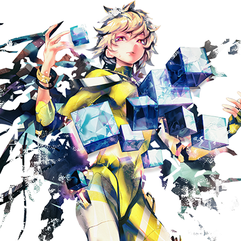
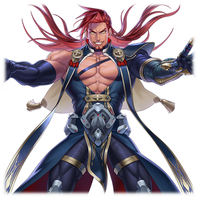

# 索罗·莫尼亚/Metaverse适应体

| 
角色信息 
  |          |
| ----------- | ----------- |
|名称|索罗·莫尼亚
|年龄|14岁
|职业|真人的王子
|对应歌曲|ZegalltA
|初出版本|Chunithm Luminous

## Episode 1 被不安所驱使

>果然，说到底我还是个孩子。总是给周围的人带来麻烦，总是自己一个人冲在前头……

绀青之都·萨马拉坎达。

曾经在黄金时代，这里也是一座极尽繁华，无数人士在此觥筹交错的大都市。

但是现在的萨马拉坎达，却根本看不到曾经繁荣的模样。

取而代之的，是“死亡”。

被焚烧，被破坏，被粉碎的瓦砾与废铁，还有无数真人的尸体。

如此残酷的光景遍布了整座城市，而这对于一名独自闯入其中的少年来说，未免过于“刺激”了。

 

“哈啊……哈啊……”

 

白发的少年，索罗·莫尼亚在这到处都是爆炸声和枪声的都市中穿行着。他似乎找不到来时的通路的样子。

这名少年虽然刚才还在和自己的同伴一起行动，但是因为某些小事，他与同伴们失散了。

 

“我到底在干什么啊……”

 

战场是瞬息万变的。只要有一个闪失，不论是谁都会死在这战场上。就算手中拿着再强的武器，被夺去性命也不过是一瞬间的事情。

因为激烈的战斗，人会过度兴奋，使得自身的感官感知能力提升到必要以上的程度。但是，这对于并非职业军人的少年来说，对身体造成的负担未免太重了。

在精神感到疲劳之前，索罗的身体就到达了极限。他不得不躲在建筑的废墟之下潜藏着自己的身形。

“哈……哈……”的呼吸声和心脏的跳动声互相混杂在一起，变得无比刺耳。

在缓缓整理着呼吸的时候，索罗环视着四周的战场。

虽然因为爆炸产生的黑烟，看不见远处的情况。

但幸运的是，索罗现在所在的地方并不是主战场。

周围传来的战斗声，如果自己的耳朵没出什么差池，那都应该距离自己有些距离。

那么，只要小心前进的话，应该还是可以活下来的。

随着索罗如此思考着，他也渐渐地冷静了下来。

 

“现在就算后悔也没用了。总之，还是先活下来，和大家汇合吧，索罗·莫尼亚……”

 

索罗下定了决心，鼓励着自己。

目的地，是萨马拉坎达中央的高塔。

 

“可恶，要是这股浓烟能够消散的话，应该就能更快汇合的……”

“——那条路，我可不怎么推荐哦。”

“嗯！？”

 

突然，一个声音在索罗身边响起。

索罗立马举起手中的大型枪“巴拉基尔”瞄准了声音传来的地方。然而当他看到那里正站着个自己十分熟悉的男人的时候，他慌忙收起了枪。

 

“呵，看来是赶上了啊。”

 

一身以白色为主基调的衣服，还有那极为个性的一头黑发。站在索罗面前的正是这位在战场上实在是过于显眼的男人——约基姆·雅木尔。

 

“约基姆……为什么在这里！？”

“这里对我来说就像是自家花园一样。那些仍未习惯战场的菜鸟们会怎么行动……我可是一清二楚的。”

 

约基姆的视线向着自己的背后望去。

注意到约基姆的言外之意的索罗瞪大了眼睛。

 

“哈哈，这下你也该学到一课了吧！不过啊，没事真是太好了。”

“……谢谢你，约基姆。”

 

遇见了这无比可靠的同伴的索罗，为了与其他的同伴们汇合，加快了脚步。

 

“呐，她们俩现在在哪里？”

“为了让我能自由行动，她们先一步前往了都市的中心部。现在她们应该已经进入内部了吧。”

“是吗……”

 

随着他们在掩体中穿梭，约基姆也把自己来到这里的经历说了一下。

 

“约基姆”

“嗯？怎么了？”

“你不会生气吗？毕竟我直接在泽法面前发脾气了……”

“怎么？难道你想要我斥责你吗？”

“……抱歉。”

 

看着神色沮丧的索罗，约基姆直接把手伸到了他的头上，像是玩闹一样薅了几下他的头发。

 

“等等，你在干什么啊！”

“索罗，你应该道歉的人，并不是我吧？”

“啊……对呢。”

 

索罗轻轻地点了点头。

 

“嘿嘿，这样的话就要加快脚步了，毕竟这里可不会一直都是安全区的啊！”

“啊啊，我知道了！”

 

必须尽可能避免战斗。

空中的舰队战已经结束了。

那些逃离到地上的残存部队，到底还剩下多少人也不得而知。

行动必须迅速而谨慎才行。

索罗在约基姆的指导下，穿过战场，向着萨马拉坎达的中心进发。

## Episode 2 搭档的背影

>约基姆是这么说的——“要找到自己的职责。”。总有一天，我也要找到属于我自己的路。

约基姆察觉危险的能力令索罗大开眼界。

光是找到藏在掩体里的敌人并且计算出他们的数量就不多说了，甚至还能在敌人尚未察觉之前就无声无息地将他们干掉。

看着他熟练地执行着这些工作，就看得出他到底经历过何等残酷的战场。

 

“……好厉害。”

 

在索罗的眼中，约基姆就像一个无所不能的战士。

但同时，他也想起了那天初次见到约基姆的时候。

如果那天，约基姆并没有加入他们，而是作为敌人挡在他们面前的话，那现在又会是什么样呢？

 

“——怎么了，索罗？”

“咦？……啊，不好意思。”

“哈哈，这下应该没那么紧张了吧？”

 

就在约基姆向索罗说着“就趁现在好好休息一下”，索罗刚想回应的时候，他发现约基姆的脸色变了。

约基姆用手势示意索罗低下头，两人接着就躲到了附近的掩体里，观察着周围的环境。

下一刻，无数的枪声响起。

 

“看来正打得热火朝天呢。”

 

根据约基姆的观察，那些在之前上空战斗的强硬派的士兵现在正与敌人展开了近距离的火拼。

战斗应该发生在船体的残骸和废墟较少的开阔地带。如果能够直接穿过这里的话，中枢就近在眼前了。

但是，就这样带着索罗前进的话，未免太过危险了。

 

“而且啊……总有种不详的预感啊……”

“约基姆。”

 

就在索罗举起了“巴拉基尔”准备射击的时候，约基姆摇了摇头。

最后索罗还是相信了约基姆的判断。就在两人准备迂回前进的时候。

从远处传来了士兵们的悲鸣。

“真是的，他们好像把那些白色的家伙给引过来了啊……”

 

在浓烟的另一边，那些白色的机械兵正向着真人们发动攻击。他们似乎不分敌我的样子，向着周围的一切都开火射击。

 

“约基姆！那些家伙从后面冲过来了！”

 

听到索罗的声音，约基姆偷偷从废墟中抬起了头，发现那些机械兵们已经被交火声吸引，正朝这里冲过来。

虽然躲起来偷偷绕过去也不是不可能，但是如果继续招来更多士兵的话，那就更加麻烦了。

所以，约基姆选择的是——

 

“索罗！在那些家伙聚集起来之前把他们破坏掉！”

“我知道了！”

 

两人利用先前突入萨马拉坎达时对付那些人偶们的经验，向那些机械士兵们发动了突袭。只要把握了弱点的话，那些机械兵也就没什么可怕的了。

能行的——就在索罗这么想着的时候，从背后传来了声音，原来是三只机械士兵正翻过高墙，向这里奔来。

 

“咦？后面也有敌人吗！？”

“索罗！你的背后就由我来保护！所以，我的背后也拜托你了！”

“……！交给我吧！”

 

索罗控制着巴拉基尔的输出功率，瞄准了机械兵的头部。战场是千变万化的，对于常人来说，不但要警戒从四面八方袭来的攻击，甚至有时还没有机会让他们能冷静作出判断。

但是，现在站在索罗背后的，是无比可靠的同伴。敌人也只会从正面进攻，索罗可以心无旁骛地进行射击。

结果就是——仅凭两人，他们就将所有的机械士兵全都破坏掉了。

看着最后一只机械兵被打成废铁的约基姆，向索罗举起了右手。索罗也意气风发地伸手拍去，一声清脆的击掌声就这么在寂静的战场上响起。

 

“哈哈！干得不错嘛，索罗！”

“毕竟有约基姆在背后保护我嘛……不过约基姆你也很厉害，竟然面对这么多敌人都能毫发无伤地将他们干掉。

 

在约基姆的背后，是好几只机械兵的残骸。

索罗虽然成功地打倒了三只，但约基姆打倒的数量甚至是索罗的两倍以上。

虽然这也是因为敌人只有近距离攻击的手段的缘故，但约基姆的技术也是令人咋舌。

 

“我有一天也能像约基姆那样厉害吗……”

“嗯——那应该不太可能吧？”

“咦？”

“我的战斗技巧，可都是在马革裹尸的战场上积累出来的。就算用虚拟记忆全部塞到脑中，要是没有相应的引子将其发挥出来，那也是没用的。”

“……”

“嘛，你就别在意了。我有我的，索罗你也有属于你的职责。而且啊，我能做的事情，不就是让你不会走上像我这样的道路吗？”

“约基姆……”

“懂了的话就赶紧动身吧，‘搭档’。”

 

这么说着的约基姆，笑着向索罗举起了大拇指。

 

“啊啊！”

 

就在两人打算沿着战场前进的时候。

 

“——二位互相信赖，共同战斗的身影，真是了得啊！”

“嗯！？”

 

突然，一个男人的声音响起。

在两人的视线前方，是一名带着一头宛如燃烧的烈火般鲜红的头发，体格无比健硕的男人。

 

“这难道就是天命吗？没想到竟然会在这混沌的战场上遇见你们啊。”

 

这幅口吻，似乎是知道索罗和约基姆两人的事情一样。

 

“竟然是这家伙……真是败给他了啊。”

“约基姆，你认识他吗？”

“那倒是。只要跟军队有关系的人，肯定都知道他。他就是萨尔贡——领导着强硬派的其中一人。”

## Episode 3 赤色凶兆

>可恶！怎么每个人都这么自以为是啊！

出现在索罗和约基姆面前的，正是占据着强硬派一角的男人——萨尔贡·菲尔纳斯。

虽然索罗对这个名字有些印象，但当下更重要的，是眼前这个男人的行动。

虽然他带着几个部下，但他自己手上却没有武器。然而，即便手无寸铁，那股慑人的霸气却并未消减。

 

“没想到竟然知道我的名字，不愧是原督战队队员约基姆·雅木尔。”

“嘿嘿，这还真是荣幸。没想到连小人这种不为人知的佣兵的名字都知道啊。那么，虽然只是顺便一说，能不能放过我们俩呢？”

“哼，这可不行。我找的人，是你身后的那名少年——索罗·莫尼亚。”

“——！”

 

索罗虽然赶忙想举起“巴拉基尔”，然而萨尔贡手下的那些士兵们却抢先一步，拿着枪对准了索罗。

 

“咕……你们难道也是凯南那边的人吗？”

“凯南会由我们这边处理。但是，我也跟沃特之间没有关系。我们是为了我们自己的利益而行动的。”

“那么你们就去做自己的事啊。这又跟我有什么关系？”

“大有关系。至少现在的你有着足以将这混沌的战局彻底倾覆的因素。”

“因素？”

“这场战争，早已不是讨伐反贼的平叛之战了。当然，也不是各方争夺霸权的一战。这场战争，是为了决定谁才拥有继承你的母亲——拔示巴的遗产的资格的战争。”

“我的，母亲？”

 

没想到能从强硬派的将领那里听到母亲的名字，索罗的脸上难掩动摇之色。就像是要将索罗护在身后一样，约基姆站了出来。

 

“哦……也就是说……被称作‘军神’的萨尔贡大人，打算把索罗抬举为新的领导者，然后从暗中进行操纵对吧？”

“哼，至少也该说是以柔克刚的计谋吧。”

 

面对这带着言外之意的话，萨尔贡只是一笑而过。

 

“那家伙，只会让你的‘地位’继续下降啊。”

“当然，我很清楚。但是我等的手足已经失去众多……那么，我们就必须回报他们的牺牲不是吗？”

“净说这些漂亮话，你们就是想爆发战争而已吧？你以为说这些话，我们就会乖乖成为你们的同伴吗！”

“哦，挺有气势的嘛。看来我在背后做的这些工夫也没有白白浪费。你确实在渐渐地成长为拥有王者气概的人呢。”

 

“背后做的工夫”。面对这意有所指的话，索罗露出了惊讶的表情。

 

“这到底是怎么回事，我什么时候被你照顾——不对……我想起来了。”

 

索罗的脑海里回想起了那一天的回忆。

那正是他和泽法一同准备逃离奥林匹亚斯时的事情。当时，他们在艾菲斯殖民地准备夺取一艘小型飞船却被巡逻的卫士发现，正被查问的时候——

救下了正在窘境中的索罗二人的，正是自称为萨尔贡的部下的，名为纳丁的男人。

 

“正是。你以为仅靠你们两人的力量，就能够成功从奥林匹亚斯和艾菲斯殖民地安全脱身吗？”

“原来这一切……都是你策划的吗。”

“换言之，我可是你的救命恩人啊。”

 

沃特、凯南，以及萨尔贡。

虽然他们都自称为强硬派的指导者，但是在这团结一致的表象之下，每个人都是心怀鬼胎。

索罗从眼前的这个男人中感觉到了一股未知的恐怖。

 

“……能否告诉我一件事呢？”

“请讲。”

“你想把这个世界变成什么样子呢？”

 

这句话直指萨尔贡的动机核心。

索罗目不转睛地看着萨尔贡的双眼，就像是暗示着，他绝对不会放过任何一点变化般。

萨尔贡先是“嚯”地一声，之后说出了意料之外的话。

 

“这一切，都是为了向‘神明’发起反抗。”

“神明……？”

“就像是真人是被自诩神明的机械种，还有他们背后的系统所管理一样，我们也是被真人·亚哈所制造出来，并且被他们所抛弃的实验产物。”

 

萨尔贡紧握着拳头，话语也在渐渐地尖锐起来。

 

“然后，我们就会成为‘弑逆之人’，将与神相关的真人，还有整个系统都破坏掉。之后迎接我们的，将是由我们所建设的崭新世界！以我等的旧日血脉，为整个世界带来洗礼！”

 

萨尔贡手下的那些士兵们呼应着他的话语，举起了右手。

看着这些陷入疯狂的人们，还有那沉浸在执念之中，无比灿烂的双眼，索罗终于明白了萨尔贡这个人的本质。

 

——这个人，也是期望着“毁灭”的存在。

 

凯南和拔示巴，以及萨尔贡。

他们都是从毁灭之中诞生，为了追求着毁灭，在这世间彷徨着的存在。

他们所期望的理想，绝对不会迎来真正的明天。

也绝对没有与他们互相理解的可能。

就像是为了从这些无法相容的人们之中远离一般，索罗缓缓地向后退了几步。

呼应着索罗的行动，约基姆大喊到。

 

“感谢您的高论！”

 

就像是为了将那些人们的声音盖住一样，约基姆充满活力的声音再次响起。

 

“这下小人真的是从头到脚都搞明白了啊！不过你们这些大人们就为了这样一个小鬼头鞍前马后，机关算尽，还真是一群变态啊！”

 

就像是故意挑衅一般，约基姆慢慢地让索罗躲到自己的背后。

然后把手放在身后，摆出了赶紧走的指示。

就像是在说着让自己成为诱饵一样。

 

“别开玩笑了！我怎么可能让约基姆一个人留下啊！？”

“不是啊，索罗！这种话是你自己该说的吗！？”

“哼，真是一对活宝啊。”

 

萨尔贡看着正争执着要不要一同逃跑的两人，露出了笑容。

 

“但是你们认为现在这样就能够改变形势吗？”

“哈哈，确实是这样吧……”

 

在萨尔贡的指示下，士兵们举起了枪，就在他们准备把枪口指向约基姆的时候——

 

“那这个又如何！”

 

就像是瞅准了这个机会一样，约基姆弯下了腰，扔出了什么东西。

那个东西直直地向着士兵们飞了过去，那些士兵们很快就做出了反应。然而他们所击碎的，只不过是一块小小的瓦片。

就是这一瞬间的变化，为约基姆他们带来了机会。

约基姆趁着弯腰的势头，直接趴在了地上。与此同时，索罗已经将“巴拉基尔”蓄到了最高的能量等级，并且按下了扳机。

 

“——什么！？”

 

巴拉基尔的强光向萨尔贡他们袭来。

约基姆连背后都不看，趁着索罗因为射击的后坐力暂时飞起来的瞬间抱住了他，然后一溜烟地离开了这里。

随着光束命中了目标，从他们身后也传来了剧烈的冲击波。

 

“约基姆，我们成功了啊！”

“我说啊，刚才可真是把我冷汗都吓出来了啊！！要不是我那时候随意应变，我们俩现在早就死在那里了啊！？”

 

一边抱着索罗，约基姆一边喊着。

然而，刚刚发动攻击的本人却并没有听进去的样子。

 

“有啥不行的？我们不也平安脱险了吗？”

“就算是这样啊！”

“话又说回来！你刚才是想牺牲自己，让我一个人逃走对吧！”

“哈，这还真是被小看了啊！你觉得就靠那几个人就想摆平我吗！”

 

就在两人为些没营养的话题争吵的时候，他们为了回避不必要的战斗，冲到了广场上。刚才还和强硬派正面交锋的战场，因为机械兵的乱入，战斗已经落下了帷幕。现在弥漫于战场上的，只有一股奇妙的寂静感。

然而，约基姆却从这片战场的空气中察觉到了什么——

 

“不妙啊，索罗。这是……”

 

说时迟那时快，约基姆口中的那个家伙出现在了两人面前。

随着一阵风将延误吹散，出现在他们面前的，是那个无脸的机械兵。然而，他们所面对的威胁不止如此。

 

“呃，那家伙是……！”

 

更快发觉到对方的约基姆，不禁叫苦连天。

索罗也被这声音吸引，向上看去。他看见的，是那名正坐在废墟上呆呆地望向远处发出爆炸声的地方的男人——洛特·十二。

 

“——哇……啊！”

 

索罗刚想憋住自己的声音，但还是被洛特察觉到了。在那头被风吹拂着的红发底下，他瞪大了眼睛，双眼中满是光彩。

 

“出现啦————！！索——罗——君——！！”

“真是……糟透了啊啊啊啊啊！！”

 

与欣喜若狂的洛特不同，索罗从约基姆身上松开并且着地之后，立刻举起了手中的“巴拉基尔”。

下一刻，他就按下了扳机。然而因为之前刚刚释放了最极限的能量攻击，现在武器仍然在充能中。

 

“可恶……！”

“真是过分啊~！明明是令人感动的再会，怎么直接就开枪啊！？”

“约基姆，我们撤！！”

“……不，我们怕是进退两难了啊……”

“哈？你在说什么——”

 

就在这时，一阵嘹亮无比的怒吼声向索罗袭来。

 

“别想逃啊啊啊啊！！索罗·莫尼亚！！！”

 

索罗回头望去，原来是遍体鳞伤的萨尔贡正向着这里奔来。

虽然身上因为“巴拉基尔”的射击造成了些许烧伤，但是似乎并未危及性命的样子。

应该是他身上的装甲帮他抵挡了部分伤害吧。

 

“可恶……真是难缠啊！”

 

一边是萨尔贡，一边是与人偶们共同行动的洛特。

真可谓是腹背受敌。

索罗和约基姆，又一次陷入了风起云涌，不知前路如何的险境之中。

## Episode 4 纯真的邪恶

>不管跑到哪里都会追上来……这难道就是我跟他之间的因缘吗？

“可恶，真是祸不单行啊！”

“啊嘞嘞～～？还真是过分啊。明明能在这混乱的战场上相见……就不能更高兴点吗♪”

“我可没有时间理你啊！”

“啊哈，你就那么在意那个‘公主’的事情吗？不过，我想已经太迟了哦～”

“你们打算利用归还种干什么？”

“你想知道吗？”

 

洛特咧开了嘴，大笑着。

那副灿烂的笑容，简直看不出他刚刚打完一场激烈的战斗的样子。

 

“那，只要跟我玩一下的话，就告诉你♪”

“啊啊真是的！我就不该问你这些东西的！”

“现在不是说闲话的时候！赶紧逃啊，索罗！！”

 

约基姆再次抱起索罗一溜烟地逃走了。

 

“啊！我话还没说完呢！”

 

横穿过洛特，两人向着萨马拉坎达的中枢狂奔。在两人的身后，是紧追不舍的萨尔贡。

 

“咦～～这是什么意思？看起来很有趣的样子！要怎么玩才好呢？果然，还是都一起玩玩吧！！”

 

洛特欢快地拍着双手，大喊着。

接着，向着那些站在他身后待机的机械兵们下达了指示。

 

“那么，‘赛罗们’！我们要去追那三个人哦！”

 

与此同时。

正在战场上飞奔着的索罗和约基姆，回到了中枢塔附近的区域。

 

“哈哈，索罗你还真是大红人啊！”

“我才不想当这种大红人！为什么不管哪个家伙脑子里想着的都是战斗啊！”

“谁知道呢，毕竟每个人都有自己战斗的理由——哦？”

 

看来两人似乎正渐渐地接近中枢的要地。

因为那些机械兵们，正挡在他们的面前。

 

“说不定他们也有自己的理由呢。”

“不，这些家伙是……”

“索罗·莫尼亚……”

 

突然，机械兵们说出了索罗的名字。

 

“这家伙，能说话吗！？”

“啊啊。这家伙就是赛罗。也就是曾经是真人的存在。”

“哈啊？也就是说他把自己的意识移植到了机械的身上吗？这怎么可能……”

“真是粗枝大叶啊，索罗。明明将一切的真相告知你的，就是我们。”

 

在这些机械兵中间的一只机械士兵，正摇动着关节发出吱吱的声音。

其他的机体也像是跟随着它一般，异口同声地说着同一句话。

 

“我等既是个体，也是整体——”

 

这些没有脸的机械兵，正是真人——赛罗·达文斯制造出来的量产型半自动机器人。

在它们身上都搭载了赛罗自己的意识数据的复制品，而且各自能够进行一定程度的独立思考活动。

 

“什么既是个体又是整体啊。对我来说，你们就不过是一群可以肆意操控的失败品而已！”

“这一切都是为了让我等的计划能顺利执行所做的准备。”

 

宛如刮擦过物体表面一样刺耳的合成声音响起。

简直就像是为了刺激对方的神经而制造出来的东西一样，这个声音，从头到尾，都让人无比烦躁。

 

“你们做到这个地步，究竟想要怎样！”

“——那还用问吗？那当然是让母亲大人能够终结这个世界啊♪”

“洛特……！”

 

洛特一边拍着手，一边笑着说到。

在他的脸上，沾满了鲜血。

 

“什么……你难道说……”

“那个叫萨尔贡的家伙，真的是强到我都快吓破胆了啊。我还以为受了这么重的伤就能够轻松干掉的……所以，我也稍微认真了一下♪”

 

洛特掏出染成血红色的小刀在手里把玩着。而这代表着什么，已经不用多说了。

 

“你这个人……！只要你能够高兴的话，一切就无所谓了吗！？”

“不是哦♪”

“哈……你在说什么？”

“这一切啊，都是为了母亲做的啊♪”

“为了母亲？”

“咦？索罗君你难道见不到吗？见不到母亲吗？”

“咦？”

“你难道就不想让母亲能够笑出来吗？你就不想让她高兴起来吗？”

 

洛特轻轻地敲着自己的眼罩。

简直就像是在说自己所指的那个人就在那里面一样。

 

“我的世界啊，可是为了母亲而存在的哦♪”

 

一边小跳，一边旋转着，洛特嗤嗤地笑出了声。

面对这远超想象的话语，洛特和约基姆再也说不出话来。

## Episode 5 那一天的决意

>我已经不会再逃避了。我会和约基姆，泽法，还有米斯拉，一起活下去！

为了让已经离开这个世界的母亲露出笑容，自己才会存在于此。

即便是如此快乐的模样，也是为了母亲而做的。

自己能够活到这一刻，也是多亏了母亲。

一切的一切，都是为了自己的母亲——拔示巴而活。这就是洛特的想法。

即便这一愿望，即便穷尽一生也无法传达到母亲那里。

 

“你到底……要做到什么地步……”

“来吧来吧，来玩吧，索罗君……不对，父亲。”

 

就像是宣告话题结束一般，洛特立刻进入了战斗状态。

连架势都没有摆好，一记高速的攻击就向索罗袭来。

但是，这似是玩闹一般向着索罗刺出去的小刀，却被身旁的约基姆掏出的短刀挡住了。

 

“真是遗～憾！”

“……咦？”

 

面对突然冲到自己眼前的洛特，索罗甚至都无法反应过来。

 

“索罗，快退下！！”

 

被约基姆推开，索罗直接一屁股摔倒在地上。

 

“这家伙根本疯了啊！”

“小哥还真是过分啊～！我的脑子现在可是很清醒的哦？看招看招看招！！”

 

连绵不断的突刺向约基姆袭来。

不管哪一刀，只要命中的话，肯定非死即残。

 

“切……！”

 

然而约基姆将这一击击致命的刀招纷纷弹开了。

 

“有两把刷子嘛！果然我的感觉是没错的啊～”

“这家伙……！索罗！！还不快走！！”

“……啊。”

 

约基姆死死地顶着洛特，向着索罗大喊着。

光是看着约基姆如此拼命的模样，就可以知道眼前这个男人有多么危险了。

只要出现一点破绽，约基姆肯定就会立刻命丧于他的刀下。

索罗的手上正握着“巴拉基尔”。

如果按下扳机的话，应该就能够打倒洛特了吧。

 

“啊哈哈！你就试试看吧？说不定一枪下去我就死翘翘了呢？不过，这位帅气的小哥估计也难逃一劫啊～！”

 

一边躲闪着约基姆的反击，洛特一边挑衅着索罗。

洛特会继续进行近身肉搏，肯定是因为忌惮着“巴拉基尔”的力量。

洛特的一只眼睛还带着眼罩，外加上刚才还和萨尔贡进行了一场死战，身体的伤势仍未痊愈，可见他的集中力有多么可怕。

 

“……”

 

索罗陷入了犹豫。

到底是该舍弃约基姆逃走呢，还是向着米斯拉她们的所在前进呢——必须做出选择。

在洛特刺耳的笑声中，掺杂着的是约基姆的悲鸣。

 

“……咕啊！？”

 

约基姆的腹部被小刀刺中。

洛特就像是要把内脏都挖出来一般，回转着小刀，用最小程度的动作向约基姆施加着最为强烈的痛苦。

约基姆向后退了两三步。

洛特并未放过这个机会，继续向前踏了一步，加大了攻势。

 

“咦？这就结束了吗？”

“从刚才……就在那边叫个不停啊！！”

“啊哈，看来还很有精神嘛♪”

 

约基姆努力将敌人的连续攻击架开，展开了反击。

但是只要这边稍微向前进攻一点，洛特就会稍微拉开点距离，让攻击的力道减少几分。

果然这种战斗，还是洛特占据了上风。

 

“为什么……”

“索罗！！快点！！给我走啊啊啊！！”

 

约基姆拼命地大喊着。

向着因为恐惧动弹不得的索罗，呐喊着。

似乎命中腹部的一击产生了效果，约基姆的动作开始紊乱起来。

 

“为什么要为了我做到这个地步……！为了我这种人甚至不惜拼上性命……！”

 

这时，索罗才注意到泪水已经模糊了自己的视线。

约基姆一直一直，都在自己的身边。

为了自己这样的人，甚至不惜拼上性命。

 

“那，还用，说吗！！”

 

使出全力弹开洛特的一击，约基姆喊到。

 

“因为！我相信！你们啊！！要一起前往……那里的，对吧！！”

 

约基姆溅出的血沫，溅到了索罗的脸上。

对啊。在他们初次见面的时候，已经约好了——

 

要一起前往北方的大地——

 

“……啊啊，说的没错啊！我们，可是不会在这种地方，**就此结束**的啊！！”

“索罗……？”

 

面对着索罗的呐喊，约基姆也不禁向后回过头去。

洛特并没有放弃这个机会，立刻就向两人冲了过来。

 

“这样的话，母亲也会高兴的吧！！”

 

在这瞬间，索罗眼中的世界，就像是慢放了一般。

在那慢放的光景之中，洛特正笔直地向着约基姆奔去。那沾满鲜血的小刀，正从下方，向着正上方的喉咙处而去。

然而，正因如此。

索罗才能够正确预测到小刀运动的轨道。

 

——！！

 

突然，一阵不知道撞到什么东西的声音响起，随之而来的，是一股鲜血的气味。

索罗一个箭步上前，挡在了约基姆的面前——用自己的手接住了洛特的小刀。

 

“……咦？”

 

洛特似乎根本没有预料到索罗会采取这样的行动。他的脸上失去了笑容，眼神中充满了惊奇。

然后，在他的嘴角再次上扬之前——索罗拼尽全力的拳头就已经打到了他的脸上！

## Episode 6 稍事休息

>洛特……就算做到这个地步，也还是要实现母亲的愿望吗！？你这样，真的就可以了吗！

原本以为只是个长着跟母亲一样的脸庞的，挂着一副反骨相的小孩而已。

但是又没有什么力量，更无法伤到自己。更不用说杀死自己。

明明只是个怎么看，都只会蜷缩起来，瑟瑟发抖的小孩罢了。

然而，与洛特这片面的认知不同，索罗的反击，确确实实地突破了他的预想。

被这拼命的一拳打的无法自如思考的洛特，呆站在原地，向着索罗笑到。

 

“啊哈……索罗君——”

 

就在这时，约基姆从死角处发动了攻击。一记飞踢狠狠地命中了洛特。

洛特的身子弯成了之字形，然后向着远处的废墟飞去。

接着，约基姆回过头来，大喊着。

 

“索罗！！！开枪啊啊啊啊！！！！”

“啊——！！巴拉基尔！！！”

 

索罗举起已经充能完毕的巴拉基尔，向着洛特被击飞的方向射去。

以最大火力释放出来的白光，向着瓦砾的小山冲去——直接吞没了埋在其中的洛特。

随着光芒闪过，瓦砾的小山被打出了个大洞。在大洞的另一边，已经没有任何东西残留。只能听到周围发出的崩塌声。

 

“哈……哈……好痛……哇啊啊啊！？”

 

直到刚才还无比高昂的感觉，现在正慢慢地消退而去。从手上传来的，只有宛如烈火灼烧一般的剧痛。

拿着巴拉基尔的手，已经因为疼痛而颤抖不已。

必须尽快把刀拔出来才行——

就在索罗即将伸出手的瞬间。

 

“你这个……大傻瓜啊！！”

 

忍着疼痛回过头，索罗看到的是正怒目圆瞪，朝着这里走过来的约基姆。

 

“为什么不赶紧逃啊！！”

“啊哈哈，约基姆……你没事，真是太好了……”

“有什么好的啊！！明明做了这么不要命的事情！！看看你这手！这不都是血了吗！！”

“这，这种伤口没事的吧……约基姆你不是也浑身都是血吗……”

“啊啊？这种小伤，根本无所谓的！来，你把手伸出来给我看看！！”

 

约基姆连等都不等，直接对索罗的手进行了急救措施。因为约基姆那夸张的头发垂了下来，所以索罗看不到约基姆脸上的表情。

但是，索罗伸出了另一只手，托起了约基姆的头发。

 

“嗯……怎么了？”

“不，就是觉得有点不一样了。”

“不一样？啊啊，是关于走还是不走的事情吧？”

 

约基姆沉默了下来，他撕开自己的衣服，将索罗的手臂包起来进行止血。

然后，在所有工作都结束了之后。

 

“……咕唔唔。”

“约基姆！？”

“哈！小事罢了！我可是特化了战斗能力的真人，只要睡一觉就能好的！”

“不要说这种没说服力的话！这次就交给我吧！”

 

用力地按压着已经有数个地方流出血液的腹部，索罗努力地将约基姆的手臂整条包扎起来。因为汗水和鲜血的缘故，视野似乎有点模糊。

 

“……呐，索罗。”

“嗯？”

“刚才的那番话，是在模仿我吗？就那句‘不会就此结束’。”

“那个啊……我也不太清楚当时为什么要这么说了。我觉得，应该是只有这么说才能让我行动起来吧。”

“哈，这算什么啊。不过啊，我有点高兴哦……”

“而且，不是说好了吗。我是绝对不会丢下约基姆一个人的。”

“有说过这种事情吗？”

 

看着装傻的约基姆，索罗回到。

 

“真是的，你可别说你忘了啊！约基姆啊，可是还要和我，还有泽法，以及米斯拉，一起去北方的大地的啊！”

“好像是这么回事吧……只有这个不能忘记呢。”

“啊啊。所以，让我们结束这样的战争，大家一起，启程吧……咦，该死，好像是流太多汗看不清眼前的东西了……”

“哈哈，索罗啊……那可不是汗水。只不过是，泪水罢了……”

“约基姆！？喂！约基姆！！”

“抱歉，让我稍微休息下吧。”

 

索罗赶忙扶住筋疲力尽的约基姆，摇晃着他的身体。

 

“你在干什么啊！我的话还没说完啊！”

 

连脸上的泪花都没有擦拭，他只是不停地摇晃着约基姆的身体。

到底是摇了多久呢。突然从索罗的耳边传来了微弱的声音。

 

“————了”

“约基姆！？成功了——”

“——吵死了！就不能让我好好睡会儿吗！而且，你刚刚还说了‘成功了’对吧！？你说了对吧！？”

 

疼痛就像是被忘到脑后一样，睁开眼睛的约基姆立刻就向索罗发起了质问。索罗也只能老实地回答。

 

“是啊……因为，这种时候就应该是这么说的对吧？”

“那种话，可不是该对同伴说的啊！”

 

约基姆直接捏着索罗的脸颊把他拉了起来。

 

“痛！好痛啊！”

“你听好了？我就只是睡着了而已，我的身体情况我是最清楚的！所以你就——”

“————啊啊啊啊啊啊啊啊啊啊啊啊啊啊！！”

 

突然，从某个地方传来了刺耳的声音。

那个声音是从瓦砾的方向传来的。

索罗最初还以为是什么东西被误启动了……然而随着他意识到这个声音究竟是什么，他举起了手中的巴拉基尔。

 

“……这是开玩笑的，对吧？”

“看吧，我就说……这根本是从地狱活着回来了吧！？”

 

下个瞬间，堆积成山的瓦砾就被顶飞了一部分。

随着这些碎屑掉到地上被摔了个粉碎——洛特·十二从堆积如山的瓦砾中，缓缓地站了起来。

## Episode 7 过去的人类

>不要再被过去所纠缠，不要再妨碍想要继续活下去的大家了！

“啊哈哈——我听不见，我听不见啊……我听不见母亲的声音啊……到底在哪儿啊……母亲……！”

 

洛特把头伸向瓦砾的孔洞内，向着无人的地方喊叫着，接着就像是要爬上去一般，直接趴在了瓦砾堆上。

洛特·十二还活着。

这难道是幽灵吗？还是幻觉呢？然而索罗无论怎么观察，眼前站着的，确实是活生生的洛特本人。

 

“难道他就算挨了那一发攻击还能活下来……？不，不对。难道是因为手腕的疼痛，导致我打歪了吗——”

 

那个时候的恐怖感觉又一次在脑中苏醒。

洛特只是仰躺在那里，不停地叫唤着。但是如果随意接近的话，会发生什么都无法预测。

 

“喂，索罗……可不要太靠近他啊。”

“啊啊，我知道的。但是，如果我不去确认的话，果然还是没法安心。”

 

两人小心翼翼地接近了洛特，才明白洛特现在的状况。

洛特的身体，已经无法自如行动了。

 

右臂被巴拉基尔直接命中，肘部以下的部位已经被轰了个粉碎。然后，左脚似乎因为被瓦砾压扁的缘故，已经无法动弹。

更令人惊讶的——是他被眼罩罩着的地方。

那里，并没有理应拥有的东西。

不，准确来说，虽然还是有类似的东西，但那也只是像玩具一般简陋的义眼而已。

他的右眼，从一开始，就看不到任何东西。

 

“你……难道就是这样一直战斗到现在的吗……？”

 

靠一只眼睛战斗会有多么困难，并不难想象。

想到自己竟然是与如此恐怖的敌人战斗，索罗不禁起了一身鸡皮疙瘩。

 

“对啊——父亲。”

 

洛特突然停止了叫唤，用另一只还正常的眼睛望着索罗。然后艰难地移动身体，向着索罗的方向爬去。

然后，恳求一般地问到。

 

“呐……母亲到底在哪里啊？如果是父亲的话，应该知道的吧？”

“……”

 

洛特即便是这样的状况，仍旧在笑着。

但是，他已经无法像曾经那样露出天真无邪的笑容了。

接着，他轻轻地念叨着：“这可不行。”

 

“再这样下去的话，母亲就笑不出来了……该怎么办……该怎么办……”

“到了这种地步，你也——”

 

推动这个人的意志的，是疯狂的信仰。

那是一种与萨尔贡截然不同的，无比纯粹的疯狂。

面对从未谋面的母亲——拔示巴，正是那扭曲的想法才支撑着洛特·十二走到这一步。

那么，如果要阻止这个男人的话——索罗握紧了手中的“巴拉基尔”。

 

“呐，索罗。”

 

就在这时，索罗听到了一声质问般的声音。

约基姆靠在瓦砾边，用平稳的声音说到。

 

“你要背负他的性命，对吗？”

“约基姆……啊啊……”

“啊哈……父亲……也就是说，你要杀了我……对吧？真是……令人高兴啊……”

 

洛特轻声地笑着，带着夹杂着痛苦的喘气声望着这里，在那眼中映出来的，是恳求。

他正在恳求着与他有着血脉之缘的索罗，给他一个痛快。作为他最初，也是最后的一份礼物。

索罗，确实是流着拔示巴的血脉的存在，但与此同时，他也与洛特有着血缘关系。他们俩，说到底都是那扭曲的实验所降下的产物。

那么，能让他安息的人，是不是就是自己呢？

索罗缓慢地举起巴拉基尔，瞄准了洛特。

 

“这样的话，我就见到母亲了吧？必须好好地，向母亲道歉才行——”

 

洛特闭上了眼睛。此时在他的脑海中，也许就能够见到那从未见过的，母亲的影像吧。

那么，至少在死的那一刻，要鲜明地记下来才行。洛特就这样等待着那个时刻的来临。

 

然而——那个瞬间，即便等了再久，他都没有等到。

 

洛特感到不可思议，就在他打算睁开眼睛确认的时候，从他的头上传来了温柔的触感。

 

“这样就行了吧。”

“咦？你在……做什么？”

 

索罗正用绷带帮洛特的头部进行包扎。

那绷带是从约基姆给他包扎手臂的时候取出来的一部分，所以并不算多干净。

 

“为什么？”

“你觉得我会让你就这样笑着去死吗？笨蛋。”

 

两人直到刚才，还是互相厮杀的死敌。

然而，索罗没有选择杀死洛特，肯定是某些连自己也无法理解的缘故吧。

如果这一切都是因为自己的血统而起，那会这么选择也是很正常的吧。

“这样就可以了吧。”。索罗轻轻地按了按洛特的额头，然后就将他扶了起来。

 

“呐，洛特，虽然由我这个把你整条手臂都炸飞的人来说有点奇怪……能不能不要再纠结于过去了呢？”

 

索罗冷静地说着。

面对眼前这个疯狂的人，也就只有这一刻能够说服他了。就算现在也没有阻止他的手段，所以，如果不趁此机会说服他，那以后将再也没有这个可能。

 

“不管是我，还是你，还是萨尔贡也好，沃特也好，我们这些跟母亲有所关联的人……说不定还包括母亲自己，我们都是被过去的人所操纵着的。”

“可是……对我来说，我也就只有母亲一个人了啊？就算你叫我不要这么做，我也不知道该做什么啊？”

“是吗。原来你一直都在想着母亲的事情吗……”

 

洛特的行为，基本都是围绕着让母亲露出笑容而做的。

因为他一直都是为了“别人”而行动，所以才无法理解什么才是“为了自己”而行动吧。

 

“等到这场战争结束后，再好好思考也不错吧？”

“结束之后？只要母亲的愿望实现的话……反正再怎么思考，都是没用的了……”

“会结束的。”

 

索罗从洛特的身边走开。

留下一句“要是你又不懂了的话，我就陪你玩玩。”之后，离开了这里。

 

“那家伙真的没问题吗？”

“这么放着应该没什么问题吧。而且，我们现在也没时间去理会他了。”

“可恶，果然直到最后都是个难缠的家伙……”

“这话，我觉得原封不动说给约基姆也没问题哦。”

“哈，说的没错啊……”

 

索罗扶着约基姆向着中枢前进。

就在这时，索罗好像踩到了什么东西的样子。

望向自己的脚边——原来是一件已经被打成粉碎的，**金色的饰品**。

## Episode 8 男人的约定

>等到一切都结束之后，我会回来的。所以——

就在两人结束了与洛特的激战，准备前往中枢的时候。

 

“不好意思啊……索罗，果然我已经到极限了。你能不能先走一步呢？”

 

约基姆经历了无数的战斗，现在的疲惫感已经达到了顶峰。当然，索罗是绝对不会把约基姆就这样丢在敌人的阵地之中的。

 

“我说你啊，不是还要阻止拔示巴的愿望什么的吗？那么，现在就赶紧去把这件事做好吧。”

“可是……”

“嘛，我也听不到战斗声了，那些机器人，从刚才开始就没有向我们发动攻击吧？”

“说起来……好像真的是这样。”

“也就是说，对他们来说，根本没有‘阻止’我们的必要了吧？”

“——正是如此。”

 

一只无脸的机械兵插入了他们的对话。

正如约基姆所说的那样，事情已经进展到对他们来说恰到好处的阶段了。

 

“已经没有保护这里的必要了。”

 

发出嘈杂声线的机械兵，就留下了这样的一句话。

 

“对吧？”

 

约基姆用还能动弹的手，向索罗摆出了个赶人的手势。

 

“赶紧继续前进吧，索罗·莫尼亚！”

“……我知道了。呐，约基姆，等这场战争——”

“喂！别给我又说那种不吉利的话了！叫你先走你就先走啊！”

“我知道，我知道啦！”

 

在索罗准备前往米斯拉她们那里之前，他向约基姆伸出了拳头。

“那么，之后见。”

约基姆露出了微笑，也轻轻地伸出拳头碰了碰。

 

“约好了啊。”

 

对二人来说，这已经足够了。

两人之间已经一同经历了足够漫长的时间了。

* * *

* * *

“嘿嘿，走掉了啊……”

 

从来都没想过，自己的人生最后会经历如此波澜壮阔的旅途。

明明只要随便地活着，然后死在一个合适的地方，这就足够度过自己最后的人生了……

没有向任何人说话，约基姆只是喃喃自语着，望着夜幕渐渐降临的都市。

这里简直就像是死者的国度。

世界说不定早已是拔示巴实现了愿望之后的模样，说不定外头已经没有任何的生还者了。

只是想象着这样的光景，就足以让约基姆的脑中冒出各种黑暗的念头。

约基姆就像是要把这些东西全部扔在脑后一样摇了摇头，缓缓地站起身来，向着与索罗相反的方向前进。

 

“之后，就交给你们了啊……”

 

约基姆一瘸一拐地走着，越走越远。

 

“抱歉，我要违约了啊，索罗……不过，我实在是不想让你看到我现在这副模样啊。”

 

就像是追着约基姆的足迹一般，地板上绽放着大大小小的，鲜红色的血花。

突然，约基姆感觉到自己的头发似乎被什么东西钩住的样子，回过头去。

 

“再见了，索罗。跟你们一同踏上的这场旅途……真的是太棒了啊。”

 

男人没有能够前去的地方。

只是缓缓地消失在了黑暗之中。

追求着自由的男人的背影，是那么地虚幻，却又那么地充满喜悦。